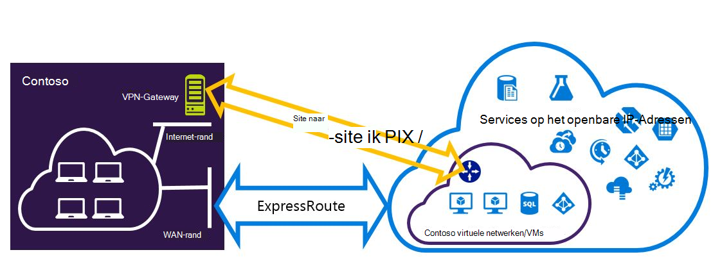
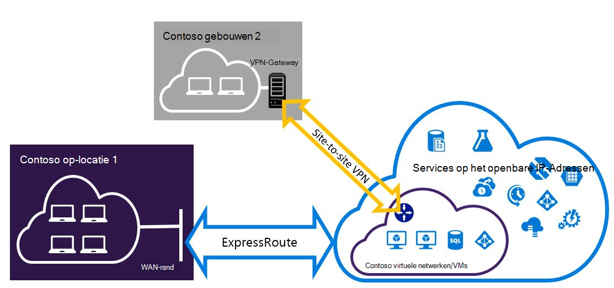

<properties
   pageTitle="Expressroute en van Site naar Site VPN-verbindingen kunnen naast configureren | Microsoft Azure"
   description="Dit artikel helpt u bij het configureren van ExpressRoute en een Site naar Site VPN-verbinding die kan worden geïnstalleerd voor de klassieke implementatiemodel."
   documentationCenter="na"
   services="expressroute"
   authors="charwen"
   manager="carmonm"
   editor=""
   tags="azure-service-management"/>
<tags
   ms.service="expressroute"
   ms.devlang="na"
   ms.topic="get-started-article"
   ms.tgt_pltfrm="na"
   ms.workload="infrastructure-services"
   ms.date="10/10/2016"
   ms.author="charwen"/>

# ExpressRoute en van Site naar Site naast elkaar bestaande verbindingen voor het klassieke implementatiemodel configureren

> [AZURE.SELECTOR]
- [PowerShell - Resource Manager](expressroute-howto-coexist-resource-manager.md)
- [PowerShell - klassiek](expressroute-howto-coexist-classic.md)

Met de mogelijkheid voor het configureren van Site naar Site VPN en ExpressRoute heeft verschillende voordelen. U kunt de Site naar Site VPN configureren als een veilige failover-pad voor ExressRoute of Site naar Site VPN-verbindingen gebruiken voor verbinding met sites die niet zijn verbonden via ExpressRoute. De stappen voor het configureren van beide scenario's in dit artikel wordt ingegaan. Dit artikel is van toepassing op de klassieke implementatiemodel. Deze configuratie is niet beschikbaar in de portal.

**Over de Azure-implementatie**

[AZURE.INCLUDE [vpn-gateway-clasic-rm](../../includes/vpn-gateway-classic-rm-include.md)] 

>[AZURE.IMPORTANT] ExpressRoute circuits moeten vooraf zijn geconfigureerd voordat u de onderstaande instructies te volgen. Zorg ervoor dat u de hulplijnen [ExpressRoute circuits maken](expressroute-howto-circuit-classic.md) en [configureren van routering](expressroute-howto-routing-classic.md) hebt uitgevoerd voordat u de volgende stappen.

## Grenzen en beperkingen

- **Transit-routering wordt niet ondersteund.** U kan geen route (via Azure) tussen het lokale netwerk is aangesloten via VPN van Site naar Site en het lokale netwerk met elkaar verbonden via ExpressRoute.
- **Punt-tot-site wordt niet ondersteund.** U kunt de dezelfde VNet die is verbonden met ExpressRoute point-to-site VPN-verbindingen niet inschakelen. Point-to-site VPN- en ExpressRoute kan niet worden gecombineerd voor de dezelfde VNet.
- **Geforceerde tunneling kan niet worden ingeschakeld op de Site naar Site VPN-gateway.** U kunt alleen 'dwingen' alle Internet-verkeer dat naar uw netwerk on-premises via ExpressRoute.
- **Basic SKU gateway wordt niet ondersteund.** Voor zowel de [ExpressRoute gateway](expressroute-about-virtual-network-gateways.md) en de [VPN-gateway](../vpn-gateway/vpn-gateway-about-vpngateways.md), moet u een niet - standaard SKU-gateway gebruiken.
- **Alleen route gebaseerde VPN-gateway wordt ondersteund.** U kunt een route gebaseerde [VPN-Gateway](../vpn-gateway/vpn-gateway-about-vpngateways.md)moet gebruiken.
- **Statische route moet voor de VPN-gateway configureren.** Als uw lokale netwerk is aangesloten op zowel ExpressRoute als een VPN website, moet u een statische route geconfigureerd in uw lokale netwerk voor het routeren van de Site naar Site VPN-verbinding met het openbare Internet hebben.
- **ExpressRoute gateway moet eerst worden geconfigureerd.** U moet de gateway ExpressRoute eerst maken voordat u de Site naar Site VPN-gateway toevoegen.

## Configuratie ontwerpen

### Een VPN website als een failover-pad voor ExpressRoute configureren

U kunt een Site naar Site VPN-verbinding configureren als een back-up voor ExpressRoute. Dit geldt alleen voor de virtuele netwerken die zijn gekoppeld aan de Azure private peering pad. Er is geen failover-gebaseerde VPN-oplossing voor services toegankelijk zijn via openbare Azure en Microsoft peerings. Het circuit ExpressRoute is altijd de primaire koppeling. Gegevens zullen vloeien via het pad van Site naar Site VPN-alleen als het circuit ExpressRoute mislukt. 

### Configureren van een VPN website verbinding maken met websites die niet zijn verbonden door middel van ExpressRoute

U kunt uw netwerk waarbij sommige sites rechtstreeks verbinding maken met Azure via VPN van Site naar Site, en sommige sites zijn verbonden via ExpressRoute. 

>[AZURE.NOTE] U kunt een configureren een virtueel netwerk niet als router doorvoer.

## De stappen voor het gebruik van selecteren

Er zijn twee soorten procedures om uit te kiezen om het configureren van verbindingen die kunnen worden geïnstalleerd. De configuratieprocedure die u selecteert, is afhankelijk of hebt u een bestaande virtuele netwerk waarmee u verbinding wilt maken of u wilt een nieuw virtueel netwerk maken.

- Ik niet hebben een VNet en moet een maken.
    
    Als u nog niet een virtueel netwerk, helpt deze procedure u bij het maken van een nieuw virtueel netwerk met behulp van het implementatiemodel klassiek en het maken van nieuwe ExpressRoute en Site tot Site VPN-verbindingen. Als u wilt configureren, voert u de stappen in de sectie van het artikel [om een nieuwe virtuele netwerk en naast elkaar bestaande verbindingen te maken](#new).

- Ik heb al een implementatiemodel klassieke VNet.

    Misschien al een virtueel netwerk samen met een bestaande Site naar Site VPN-verbinding of een verbinding ExpressRoute. De sectie artikel [voor het configureren van verbindingen voor een reeds bestaand VNet coexsiting](#add) kunt u via de gateway verwijderen en vervolgens nieuwe ExpressRoute en Site tot Site VPN-verbindingen te maken. Houd er rekening mee dat bij het maken van nieuwe verbindingen, de stappen moeten worden uitgevoerd in een bepaalde volgorde. Gebruik niet de instructies in andere artikelen om uw gateways en verbindingen te maken.

    In deze procedure wordt voor het maken van verbindingen die kunnen worden geïnstalleerd, moet u uw gateway wilt verwijderen en nieuwe gateways configureert. Dit betekent dat u uitvaltijd voor verbindingen tussen ruimten hebt terwijl u verwijderen en opnieuw maken van uw gateway en verbindingen, hoeft u niet de VMs of services migreren naar een nieuw virtueel netwerk. Uw VMs en services nog steeds uit communiceren via de taakverdelingsvoorziening terwijl u uw gateway configureren als ze hiervoor zijn geconfigureerd.

## Een nieuw virtueel netwerk en naast elkaar bestaande verbindingen maken

Deze procedure wordt helpt u bij het maken van een VNet en website en ExpressRoute verbindingen die in gebruik blijven maken.

1. U moet de meest recente versie van de Azure PowerShell cmdlets installeert. [Het installeren en configureren van Azure PowerShell](../powershell-install-configure.md) Zie voor meer informatie over het installeren van de PowerShell-cmdlets. Houd er rekening mee dat de cmdlets waarmee u voor deze configuratie mogelijk iets anders dan wat u gewend bent misschien. Zorg ervoor dat de cmdlets die is opgegeven in deze instructies gebruiken. 

2. Maak een schema voor het virtuele netwerk. Zie voor meer informatie over het configuratieschema [Azure Virtual Network configuratieschema](https://msdn.microsoft.com/library/azure/jj157100.aspx).

    Als u uw schema maakt, moet dat u de volgende waarden gebruiken:

    - Het gateway-subnet voor het virtuele netwerk moet /27 of een kortere prefix (bijvoorbeeld /26 of /25).
    - Het verbindingstype gateway "speciale" is.

              <VirtualNetworkSite name="MyAzureVNET" Location="Central US">
                <AddressSpace>
                  <AddressPrefix>10.17.159.192/26</AddressPrefix>
                </AddressSpace>
                <Subnets>
                  <Subnet name="Subnet-1">
                    <AddressPrefix>10.17.159.192/27</AddressPrefix>
                  </Subnet>
                  <Subnet name="GatewaySubnet">
                    <AddressPrefix>10.17.159.224/27</AddressPrefix>
                  </Subnet>
                </Subnets>
                <Gateway>
                  <ConnectionsToLocalNetwork>
                    <LocalNetworkSiteRef name="MyLocalNetwork">
                      <Connection type="Dedicated" />
                    </LocalNetworkSiteRef>
                  </ConnectionsToLocalNetwork>
                </Gateway>
              </VirtualNetworkSite>

3. Na het maken en configureren van uw XML-schemabestand, het bestand te uploaden. Hiermee maakt u het virtuele netwerk.

    Gebruik de volgende cmdlets voor het uploaden van het bestand, de waarde vervangen door uw eigen.

        Set-AzureVNetConfig -ConfigurationPath 'C:\NetworkConfig.xml'

4. Een gateway ExpressRoute maken. Zorg ervoor dat de GatewaySKU opgeven als *standaard*, *HighPerformance*, of *UltraPerformance* en de GatewayType als *DynamicRouting*.

    In het volgende voorbeeld, vervangen door de waarden voor eigen gebruik.

        New-AzureVNetGateway -VNetName MyAzureVNET -GatewayType DynamicRouting -GatewaySKU HighPerformance

5. De gateway ExpressRoute naar het circuit ExpressRoute koppelen. Na deze stap is voltooid, wordt de verbinding tussen uw netwerk op gebouwen en Azure via ExpressRoute, tot stand gebracht.

        New-AzureDedicatedCircuitLink -ServiceKey <service-key> -VNetName MyAzureVNET

6. Vervolgens maakt u de Site naar Site VPN-gateway. De GatewaySKU moet *standaard*, *HighPerformance*, of *UltraPerformance* en de GatewayType moet *DynamicRouting*.

        New-AzureVirtualNetworkGateway -VNetName MyAzureVNET -GatewayName S2SVPN -GatewayType DynamicRouting -GatewaySKU  HighPerformance

    Het virtuele netwerk gateway-instellingen, met inbegrip van de gateway-ID en het openbare IP haalt met de `Get-AzureVirtualNetworkGateway` cmdlet.

        Get-AzureVirtualNetworkGateway

        GatewayId            : 348ae011-ffa9-4add-b530-7cb30010565e
        GatewayName          : S2SVPN
        LastEventData        :
        GatewayType          : DynamicRouting
        LastEventTimeStamp   : 5/29/2015 4:41:41 PM
        LastEventMessage     : Successfully created a gateway for the following virtual network: GNSDesMoines
        LastEventID          : 23002
        State                : Provisioned
        VIPAddress           : 104.43.x.y
        DefaultSite          :
        GatewaySKU           : HighPerformance
        Location             :
        VnetId               : 979aabcf-e47f-4136-ab9b-b4780c1e1bd5
        SubnetId             :
        EnableBgp            : False
        OperationDescription : Get-AzureVirtualNetworkGateway
        OperationId          : 42773656-85e1-a6b6-8705-35473f1e6f6a
        OperationStatus      : Succeeded

7. Een lokale site VPN-gateway entiteit maken. Met deze opdracht wordt niet in gebouwen VPN-gateway configureren. Maar kunt u de lokale gateway-instellingen kan leveren, zoals het openbare IP- en de lokalen op adresruimte, zodat de Azure VPN-gateway verbinding met het maken kan.

    >[AZURE.IMPORTANT] De lokale site voor de VPN-verbinding van Site naar Site is niet gedefinieerd in de netcfg. In plaats daarvan moet u deze cmdlet geeft u de parameters van de lokale site. U kunt met behulp van de portal of het bestand netcfg niet definiëren.

    In het volgende voorbeeld, de waarden te vervangen door uw eigen gebruik.

        New-AzureLocalNetworkGateway -GatewayName MyLocalNetwork -IpAddress <MyLocalGatewayIp> -AddressSpace <MyLocalNetworkAddress>

    > [AZURE.NOTE] Als uw lokale netwerk meerdere routes, geeft u ze als een matrix.  $MyLocalNetworkAddress =@("10.1.2.0/24","10.1.3.0/24","10.2.1.0/24")  

    Het virtuele netwerk gateway-instellingen, met inbegrip van de gateway-ID en het openbare IP haalt met de `Get-AzureVirtualNetworkGateway` cmdlet. Zie het volgende voorbeeld.

        Get-AzureLocalNetworkGateway

        GatewayId            : 532cb428-8c8c-4596-9a4f-7ae3a9fcd01b
        GatewayName          : MyLocalNetwork
        IpAddress            : 23.39.x.y
        AddressSpace         : {10.1.2.0/24}
        OperationDescription : Get-AzureLocalNetworkGateway
        OperationId          : ddc4bfae-502c-adc7-bd7d-1efbc00b3fe5
        OperationStatus      : Succeeded

8. Het lokale apparaat VPN-verbinding maken met de nieuwe gateway configureren. De informatie die u in stap 6 hebt opgehaald bij het configureren van uw VPN-apparaat gebruiken. Zie [VPN-configuratie](../vpn-gateway/vpn-gateway-about-vpn-devices.md)voor meer informatie over het configureren van VPN-apparaat.

9. De Site naar Site VPN-gateway op Azure koppelen aan de lokale gateway.

    In dit voorbeeld is connectedEntityId de lokale gateway-ID, die u kunt vinden door `Get-AzureLocalNetworkGateway`. U vindt virtualNetworkGatewayId met behulp van de `Get-AzureVirtualNetworkGateway` cmdlet. Na deze stap, wordt de verbinding tussen uw lokale netwerk en Azure via de Site naar Site VPN-verbinding gemaakt.

        New-AzureVirtualNetworkGatewayConnection -connectedEntityId <local-network-gateway-id> -gatewayConnectionName Azure2Local -gatewayConnectionType IPsec -sharedKey abc123 -virtualNetworkGatewayId <azure-s2s-vpn-gateway-id>

## Coexsiting verbindingen voor een reeds bestaand VNet configureren

Als u een bestaande virtuele netwerk hebt, kunt u de grootte van de subnet gateway controleren. Als het subnet van de gateway /28 of /29 is, moet u de gateway virtueel netwerk verwijderen en gateway subnet groter. De stappen in deze sectie leert u hoe u dat moet doen.

Als het subnet van de gateway /27 of groter en het virtuele netwerk is verbonden via ExpressRoute, kunt u de onderstaande stappen overslaan en gaat u verder met ["Stap 6: een Site naar Site VPN-gateway maken"](#vpngw) in de vorige sectie.

>[AZURE.NOTE] Als u de bestaande gateway verwijdert, verliest uw lokale locatie de verbinding met het virtuele netwerk terwijl u in deze configuratie werkt.

1. U moet de nieuwste versie van de Azure Resource Manager PowerShell cmdlets installeert. [Het installeren en configureren van Azure PowerShell](../powershell-install-configure.md) Zie voor meer informatie over het installeren van de PowerShell-cmdlets. Houd er rekening mee dat de cmdlets waarmee u voor deze configuratie mogelijk iets anders dan wat u gewend bent misschien. Zorg ervoor dat de cmdlets die is opgegeven in deze instructies gebruiken. 

2. Verwijder de bestaande ExpressRoute of Site naar Site VPN-gateway. Gebruik de volgende cmdlet, vervangen door de waarden zelf.

        Remove-AzureVNetGateway –VnetName MyAzureVNET

3. Het virtuele netwerk schema exporteren. Gebruik de volgende PowerShell-cmdlet vervangen door de waarden zelf.

        Get-AzureVNetConfig –ExportToFile “C:\NetworkConfig.xml”

4. Het schema netwerk configuratie bestand bewerken zodat het subnet gateway /27 of een kortere prefix (bijvoorbeeld /26 of /25). Zie het volgende voorbeeld. 
>[AZURE.NOTE] Als er niet genoeg IP-adressen die links in het virtuele netwerk vergroten gateway subnet, moet u meer ruimte voor IP-adres. Zie voor meer informatie over het configuratieschema [Azure Virtual Network configuratieschema](https://msdn.microsoft.com/library/azure/jj157100.aspx).

          <Subnet name="GatewaySubnet">
            <AddressPrefix>10.17.159.224/27</AddressPrefix>
          </Subnet>

5. Als uw vorige gateway een VPN website is, moet u ook het verbindingstype wijzigen aan **toegewezen**.

                 <Gateway>
                  <ConnectionsToLocalNetwork>
                    <LocalNetworkSiteRef name="MyLocalNetwork">
                      <Connection type="Dedicated" />
                    </LocalNetworkSiteRef>
                  </ConnectionsToLocalNetwork>
                </Gateway>

6. Op dit punt hebt u een VNet met geen gateways. Nieuwe gateways maken en uitvoeren van uw verbindingen, kunt u doorgaan met [stap 4 - Maak een gateway ExpressRoute](#gw), in de voorgaande stappen worden gevonden.

## Volgende stappen

Raadpleeg voor meer informatie over ExpressRoute, [ExpressRoute Veelgestelde vragen](expressroute-faqs.md)
