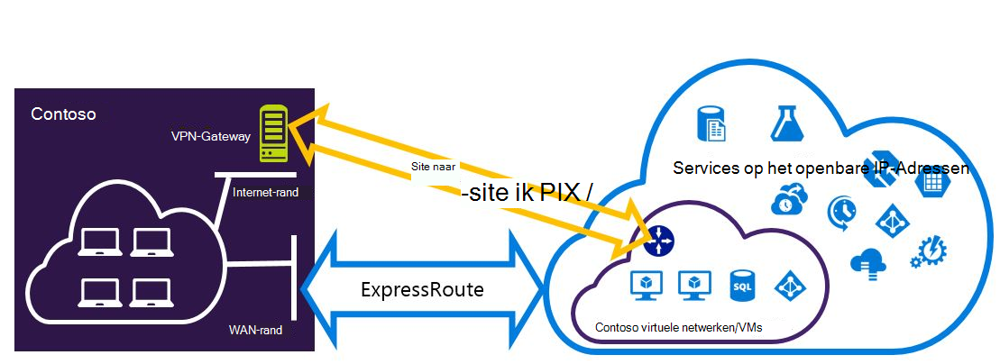
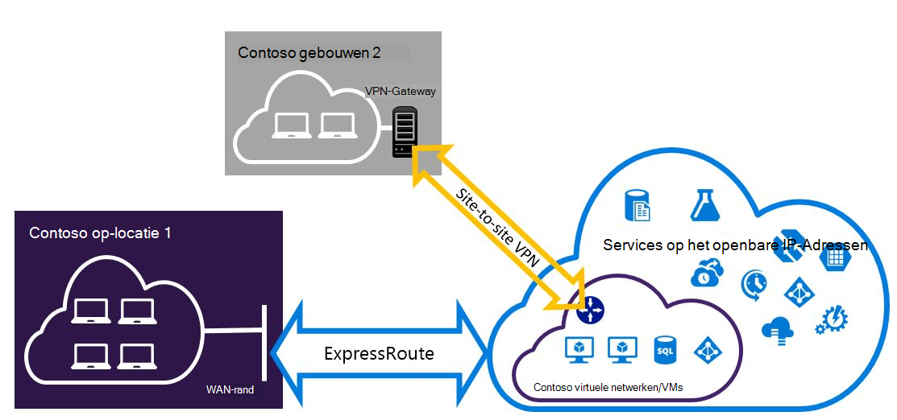

<properties
   pageTitle="Expressroute en van Site naar Site VPN-verbindingen die kunnen worden geïnstalleerd voor het implementatiemodel Resource Manager configureren | Microsoft Azure"
   description="Dit artikel begeleidt u bij het configureren van ExpressRoute en een Site naar Site VPN voor bronbeheer model naast elkaar kan bestaan."
   documentationCenter="na"
   services="expressroute"
   authors="charwen"
   manager="carmonm"
   editor=""
   tags="azure-resource-manager"/>
<tags
   ms.service="expressroute"
   ms.devlang="na"
   ms.topic="get-started-article"
   ms.tgt_pltfrm="na"
   ms.workload="infrastructure-services"
   ms.date="10/10/2016"
   ms.author="charleywen"/>

# ExpressRoute en van Site naar Site naast elkaar bestaande verbindingen voor het implementatiemodel Resource Manager configureren

> [AZURE.SELECTOR]
- [PowerShell - Resource Manager](expressroute-howto-coexist-resource-manager.md)
- [PowerShell - klassiek](expressroute-howto-coexist-classic.md)

Met de mogelijkheid voor het configureren van Site naar Site VPN en ExpressRoute heeft verschillende voordelen. U kunt de Site naar Site VPN configureren als een veilige failover-pad voor ExressRoute of Site naar Site VPN-verbindingen gebruiken voor verbinding met sites die niet zijn verbonden via ExpressRoute. De stappen voor het configureren van beide scenario's in dit artikel wordt ingegaan. Dit artikel is van toepassing op het implementatiemodel Resource Manager. Deze configuratie is niet beschikbaar in de portal Azure.

**Over de Azure-implementatie**

[AZURE.INCLUDE [vpn-gateway-clasic-rm](../../includes/vpn-gateway-classic-rm-include.md)] 

>[AZURE.IMPORTANT] ExpressRoute circuits moeten vooraf zijn geconfigureerd voordat u de onderstaande instructies te volgen. Zorg ervoor dat u de hulplijnen [ExpressRoute circuits maken](expressroute-howto-circuit-arm.md) en [configureren van routering](expressroute-howto-routing-arm.md) hebt uitgevoerd voordat u de volgende stappen.

## Grenzen en beperkingen

- **Transit-routering wordt niet ondersteund.** U kan geen route (via Azure) tussen het lokale netwerk is aangesloten via VPN van Site naar Site en het lokale netwerk met elkaar verbonden via ExpressRoute.
- **Basic SKU gateway wordt niet ondersteund.** Voor zowel de [ExpressRoute gateway](expressroute-about-virtual-network-gateways.md) en de [VPN-gateway](../vpn-gateway/vpn-gateway-about-vpngateways.md), moet u een niet - standaard SKU-gateway gebruiken.
- **Alleen route gebaseerde VPN-gateway wordt ondersteund.** U kunt een route gebaseerde [VPN-Gateway](../vpn-gateway/vpn-gateway-about-vpngateways.md)moet gebruiken.
- **Statische route moet voor de VPN-gateway configureren.** Als uw lokale netwerk is aangesloten op zowel ExpressRoute als een VPN website, moet u een statische route geconfigureerd in uw lokale netwerk voor het routeren van de Site naar Site VPN-verbinding met het openbare Internet hebben.
- **ExpressRoute gateway moet eerst worden geconfigureerd.** U moet de gateway ExpressRoute eerst maken voordat u de Site naar Site VPN-gateway toevoegen.

## Configuratie ontwerpen

### Een VPN website als een failover-pad voor ExpressRoute configureren

U kunt een Site naar Site VPN-verbinding configureren als een back-up voor ExpressRoute. Dit geldt alleen voor de virtuele netwerken die zijn gekoppeld aan de Azure private peering pad. Er is geen failover-gebaseerde VPN-oplossing voor services toegankelijk zijn via openbare Azure en Microsoft peerings. Het circuit ExpressRoute is altijd de primaire koppeling. Gegevens zullen vloeien via het pad van Site naar Site VPN-alleen als het circuit ExpressRoute mislukt.
>[AZURE.NOTE] ExpressRoute circuit is een primaire via VPN van Site naar Site wanneer beide routes hetzelfde zijn, kunt Azure het voorvoegsel longuest match kiest u de route naar de bestemming van het pakket.

### Configureren van een VPN website verbinding maken met websites die niet zijn verbonden door middel van ExpressRoute

U kunt uw netwerk waarbij sommige sites rechtstreeks verbinding maken met Azure via VPN van Site naar Site, en sommige sites zijn verbonden via ExpressRoute. 

>[AZURE.NOTE] U kunt een configureren een virtueel netwerk niet als router doorvoer.

## De stappen voor het gebruik van selecteren

Er zijn twee soorten procedures om uit te kiezen om het configureren van verbindingen die kunnen worden geïnstalleerd. De configuratieprocedure die u selecteert, is afhankelijk of hebt u een bestaande virtuele netwerk waarmee u verbinding wilt maken of u wilt een nieuw virtueel netwerk maken.

- Ik niet hebben een VNet en moet een maken.
    
    Als u nog niet een virtueel netwerk, helpt deze procedure u bij het maken van een nieuw virtueel netwerk implementatiemodel Resource Manager en nieuwe ExpressRoute en Site tot Site VPN-verbindingen te maken. Als u wilt configureren, voert u de stappen in de sectie van het artikel [om een nieuwe virtuele netwerk en naast elkaar bestaande verbindingen te maken](#new).

- Ik heb al een implementatiemodel Resource Manager VNet.

    Misschien al een virtueel netwerk samen met een bestaande Site naar Site VPN-verbinding of een verbinding ExpressRoute. De sectie [voor het configureren van verbindingen voor een reeds bestaand VNet coexsiting](#add) kunt u via de gateway verwijderen en vervolgens nieuwe ExpressRoute en Site tot Site VPN-verbindingen te maken. Houd er rekening mee dat bij het maken van nieuwe verbindingen, de stappen moeten worden uitgevoerd in een bepaalde volgorde. Gebruik niet de instructies in andere artikelen om uw gateways en verbindingen te maken.

    In deze procedure wordt voor het maken van verbindingen die kunnen worden geïnstalleerd, moet u uw gateway wilt verwijderen en nieuwe gateways configureert. Dit betekent dat u uitvaltijd voor verbindingen tussen ruimten hebt terwijl u verwijderen en opnieuw maken van uw gateway en verbindingen, hoeft u niet de VMs of services migreren naar een nieuw virtueel netwerk. Uw VMs en services nog steeds uit communiceren via de taakverdelingsvoorziening terwijl u uw gateway configureren als ze hiervoor zijn geconfigureerd.

## Een nieuw virtueel netwerk en naast elkaar bestaande verbindingen maken

Deze procedure wordt helpt u bij het maken van een VNet en website en ExpressRoute verbindingen die in gebruik blijven maken.
    
1. U moet de meest recente versie van de Azure PowerShell cmdlets installeert. [Het installeren en configureren van Azure PowerShell](../powershell-install-configure.md) Zie voor meer informatie over het installeren van de PowerShell-cmdlets. Houd er rekening mee dat de cmdlets waarmee u voor deze configuratie mogelijk iets anders dan wat u gewend bent misschien. Zorg ervoor dat de cmdlets die is opgegeven in deze instructies gebruiken.

2. Inloggen je account en stel de omgeving.
    
        login-AzureRmAccount
        Select-AzureRmSubscription -SubscriptionName 'yoursubscription'
        $location = "Central US"
        $resgrp = New-AzureRmResourceGroup -Name "ErVpnCoex" -Location $location

3. Een virtueel netwerk, met inbegrip van Gateway Subnet maken. Zie voor meer informatie over de configuratie van de virtuele [Azure Virtual Network configuration](../virtual-network/virtual-networks-create-vnet-arm-ps.md).

    >[AZURE.IMPORTANT] Het Gateway-Subnet moet /27 of een kortere prefix (bijvoorbeeld /26 of /25).
    
    Maak een nieuwe VNet.

        $vnet = New-AzureRmVirtualNetwork -Name "CoexVnet" -ResourceGroupName $resgrp.ResourceGroupName -Location $location -AddressPrefix "10.200.0.0/16" 

    Subnetten toevoegen.

        Add-AzureRmVirtualNetworkSubnetConfig -Name "App" -VirtualNetwork $vnet -AddressPrefix "10.200.1.0/24"
        Add-AzureRmVirtualNetworkSubnetConfig -Name "GatewaySubnet" -VirtualNetwork $vnet -AddressPrefix "10.200.255.0/24"

    De VNet configuratie op te slaan.

        $vnet = Set-AzureRmVirtualNetwork -VirtualNetwork $vnet

4. Een gateway ExpressRoute maken. Zie voor meer informatie over de configuratie van de standaardgateway ExpressRoute [ExpressRoute bestandsgateway-configuratie](expressroute-howto-add-gateway-resource-manager.md). De GatewaySKU moet *standaard*, *HighPerformance*of *UltraPerformance*.

        $gwSubnet = Get-AzureRmVirtualNetworkSubnetConfig -Name "GatewaySubnet" -VirtualNetwork $vnet
        $gwIP = New-AzureRmPublicIpAddress -Name "ERGatewayIP" -ResourceGroupName $resgrp.ResourceGroupName -Location $location -AllocationMethod Dynamic
        $gwConfig = New-AzureRmVirtualNetworkGatewayIpConfig -Name "ERGatewayIpConfig" -SubnetId $gwSubnet.Id -PublicIpAddressId $gwIP.Id
        $gw = New-AzureRmVirtualNetworkGateway -Name "ERGateway" -ResourceGroupName $resgrp.ResourceGroupName -Location $location -IpConfigurations $gwConfig -GatewayType "ExpressRoute" -GatewaySku Standard 

5. De gateway ExpressRoute naar het circuit ExpressRoute koppelen. Na deze stap is voltooid, wordt de verbinding tussen uw netwerk op gebouwen en Azure via ExpressRoute, tot stand gebracht. Zie voor meer informatie over de koppelingsbewerking, [VNets koppeling naar ExpressRoute](expressroute-howto-linkvnet-arm.md).

        $ckt = Get-AzureRmExpressRouteCircuit -Name "YourCircuit" -ResourceGroupName "YourCircuitResourceGroup"
        New-AzureRmVirtualNetworkGatewayConnection -Name "ERConnection" -ResourceGroupName $resgrp.ResourceGroupName -Location $location -VirtualNetworkGateway1 $gw -PeerId $ckt.Id -ConnectionType ExpressRoute

6. Vervolgens maakt u de Site naar Site VPN-gateway. Zie voor meer informatie over het configureren van VPN-gateway [configureren een VNet met een verbinding van Site naar Site](../vpn-gateway/vpn-gateway-create-site-to-site-rm-powershell.md). De GatewaySKU moet *standaard*, *HighPerformance*of *UltraPerformance*. De VpnType moet *RouteBased*.

        $gwSubnet = Get-AzureRmVirtualNetworkSubnetConfig -Name "GatewaySubnet" -VirtualNetwork $vnet
        $gwIP = New-AzureRmPublicIpAddress -Name "VPNGatewayIP" -ResourceGroupName $resgrp.ResourceGroupName -Location $location -AllocationMethod Dynamic
        $gwConfig = New-AzureRmVirtualNetworkGatewayIpConfig -Name "VPNGatewayIpConfig" -SubnetId $gwSubnet.Id -PublicIpAddressId $gwIP.Id
        New-AzureRmVirtualNetworkGateway -Name "VPNGateway" -ResourceGroupName $resgrp.ResourceGroupName -Location $location -IpConfigurations $gwConfig -GatewayType "Vpn" -VpnType "RouteBased" -GatewaySku "Standard"

    Azure VPN-gateway ondersteunt het BGP. In de volgende opdracht kunt u - EnableBgp.

        $azureVpn = New-AzureRmVirtualNetworkGateway -Name "VPNGateway" -ResourceGroupName $resgrp.ResourceGroupName -Location $location -IpConfigurations $gwConfig -GatewayType "Vpn" -VpnType "RouteBased" -GatewaySku "Standard" -EnableBgp $true

    U vindt het BGP peering IP-adres en het nummer van de AS die Azure worden gebruikt voor de VPN-gateway in $azureVpn.BgpSettings.BgpPeeringAddress en $azureVpn.BgpSettings.Asn. Zie [BGP configureren](../vpn-gateway/vpn-gateway-bgp-resource-manager-ps.md) voor Azure VPN-gateway voor meer informatie.

7. Een lokale site VPN-gateway entiteit maken. Met deze opdracht wordt niet in gebouwen VPN-gateway configureren. Maar kunt u de lokale gateway-instellingen kan leveren, zoals het openbare IP- en de lokalen op adresruimte, zodat de Azure VPN-gateway verbinding met het maken kan.

    Als uw lokale VPN-apparaat alleen statische routering ondersteunt, kunt u de statische routes configureren op de volgende manier.

        $MyLocalNetworkAddress = @("10.100.0.0/16","10.101.0.0/16","10.102.0.0/16")
        $localVpn = New-AzureRmLocalNetworkGateway -Name "LocalVPNGateway" -ResourceGroupName $resgrp.ResourceGroupName -Location $location -GatewayIpAddress *<Public IP>* -AddressPrefix $MyLocalNetworkAddress

    Als uw lokale VPN-apparaat het BGP ondersteunt en dynamische routering inschakelen, moet u weten het BGP peering IP-adres en het nummer van de AS die uw lokale VPN-apparaat gebruikt.

        $localVPNPublicIP = "<Public IP>"
        $localBGPPeeringIP = "<Private IP for the BGP session>"
        $localBGPASN = "<ASN>"
        $localAddressPrefix = $localBGPPeeringIP + "/32"
        $localVpn = New-AzureRmLocalNetworkGateway -Name "LocalVPNGateway" -ResourceGroupName $resgrp.ResourceGroupName -Location $location -GatewayIpAddress $localVPNPublicIP -AddressPrefix $localAddressPrefix -BgpPeeringAddress $localBGPPeeringIP -Asn $localBGPASN

8. Het lokale apparaat VPN-verbinding maken met de nieuwe Azure VPN-gateway configureren. Zie [VPN-configuratie](../vpn-gateway/vpn-gateway-about-vpn-devices.md)voor meer informatie over het configureren van VPN-apparaat.

9. De Site naar Site VPN-gateway op Azure koppelen aan de lokale gateway.

        $azureVpn = Get-AzureRmVirtualNetworkGateway -Name "VPNGateway" -ResourceGroupName $resgrp.ResourceGroupName
        New-AzureRmVirtualNetworkGatewayConnection -Name "VPNConnection" -ResourceGroupName $resgrp.ResourceGroupName -Location $location -VirtualNetworkGateway1 $azureVpn -LocalNetworkGateway2 $localVpn -ConnectionType IPsec -SharedKey <yourkey>

## Coexsiting verbindingen voor een reeds bestaand VNet configureren

Als u een bestaande virtuele netwerk hebt, kunt u de grootte van de subnet gateway controleren. Als het subnet van de gateway /28 of /29 is, moet u de gateway virtueel netwerk verwijderen en gateway subnet groter. De stappen in deze sectie leert u hoe u dat moet doen.

Als het subnet van de gateway /27 of groter en het virtuele netwerk is verbonden via ExpressRoute, kunt u de onderstaande stappen overslaan en gaat u verder met ["Stap 6: een Site naar Site VPN-gateway maken"](#vpngw) in de vorige sectie. 

>[AZURE.NOTE] Als u de bestaande gateway verwijdert, verliest uw lokale locatie de verbinding met het virtuele netwerk terwijl u in deze configuratie werkt. 

1. U moet de meest recente versie van de Azure PowerShell cmdlets installeert. [Het installeren en configureren van Azure PowerShell](../powershell-install-configure.md) Zie voor meer informatie over het installeren van de PowerShell-cmdlets. Houd er rekening mee dat de cmdlets waarmee u voor deze configuratie mogelijk iets anders dan wat u gewend bent misschien. Zorg ervoor dat de cmdlets die is opgegeven in deze instructies gebruiken. 

2. Verwijder de bestaande ExpressRoute of Site naar Site VPN-gateway. 

        Remove-AzureRmVirtualNetworkGateway -Name <yourgatewayname> -ResourceGroupName <yourresourcegroup>

3. Gateway Subnet verwijderen.
        
        $vnet = Get-AzureRmVirtualNetwork -Name <yourvnetname> -ResourceGroupName <yourresourcegroup> 
        Remove-AzureRmVirtualNetworkSubnetConfig -Name GatewaySubnet -VirtualNetwork $vnet

4. Een Gateway-Subnet dat is /27 toevoegen of groter.
    >[AZURE.NOTE] Als er niet genoeg IP-adressen die links in het virtuele netwerk vergroten gateway subnet, moet u meer ruimte voor IP-adres.

        $vnet = Get-AzureRmVirtualNetwork -Name <yourvnetname> -ResourceGroupName <yourresourcegroup>
        Add-AzureRmVirtualNetworkSubnetConfig -Name "GatewaySubnet" -VirtualNetwork $vnet -AddressPrefix "10.200.255.0/24"

    De VNet configuratie op te slaan.

        $vnet = Set-AzureRmVirtualNetwork -VirtualNetwork $vnet

5. Op dit punt hebt u een VNet met geen gateways. Nieuwe gateways maken en uitvoeren van uw verbindingen, kunt u doorgaan met [stap 4 - Maak een gateway ExpressRoute](#gw), in de voorgaande stappen worden gevonden.

## Configuratie van een punt-naar-site toevoegen aan de VPN-gateway
U kunt de volgende stappen configuratie punt-naar-Site toevoegen aan de VPN-gateway bij een instelling met naast elkaar bestaan.

1. VPN-Client adresgroep toevoegen. 

        $azureVpn = Get-AzureRmVirtualNetworkGateway -Name "VPNGateway" -ResourceGroupName $resgrp.ResourceGroupName
        Set-AzureRmVirtualNetworkGatewayVpnClientConfig -VirtualNetworkGateway $azureVpn -VpnClientAddressPool "10.251.251.0/24"

2. Het basiscertificaat van de VPN-upload naar Azure voor de VPN-gateway. In dit voorbeeld wordt ervan uitgegaan dat het basiscertificaat wordt opgeslagen in de lokale computer waarin de volgende PowerShell cmdlets worden uitgevoerd. 

        $p2sCertFullName = "RootErVpnCoexP2S.cer"
        $p2sCertMatchName = "RootErVpnCoexP2S"
        $p2sCertToUpload=get-childitem Cert:\CurrentUser\My | Where-Object {$_.Subject -match $p2sCertMatchName}
        if ($p2sCertToUpload.count -eq 1){
            write-host "cert found"
        } else {
            write-host "cert not found"
            exit
        } 
        $p2sCertData = [System.Convert]::ToBase64String($p2sCertToUpload.RawData)
        Add-AzureRmVpnClientRootCertificate -VpnClientRootCertificateName $p2sCertFullName -VirtualNetworkGatewayname $azureVpn.Name -ResourceGroupName $resgrp.ResourceGroupName -PublicCertData $p2sCertData

Zie voor meer informatie over Point-to-Site VPN, [een punt-naar-Site verbinding configureren](../vpn-gateway/vpn-gateway-howto-point-to-site-rm-ps.md).

## Volgende stappen

Raadpleeg voor meer informatie over ExpressRoute, [ExpressRoute Veelgestelde vragen](expressroute-faqs.md).
