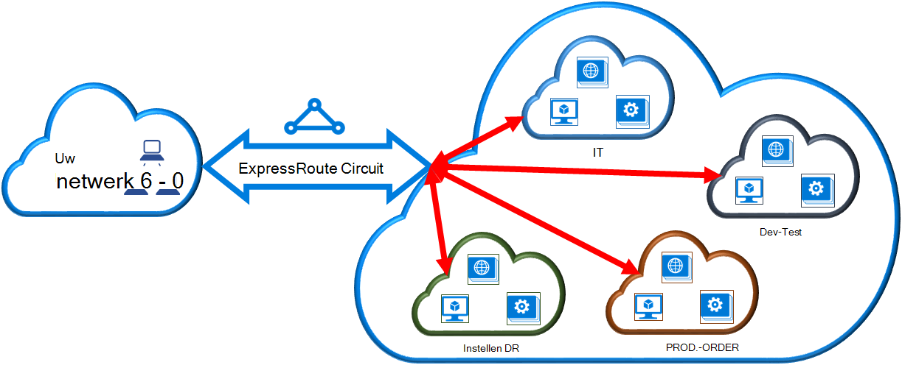

<properties 
   pageTitle="Een virtueel netwerk koppelen aan een ExpressRoute circuit met PowerShell | Microsoft Azure"
   description="Dit document bevat een overzicht van het virtuele netwerken (VNets) koppelen aan ExpressRoute circuits met behulp van bronbeheer implementatiemodel en PowerShell."
   services="expressroute"
   documentationCenter="na"
   authors="ganesr"
   manager="carmonm"
   editor=""
   tags="azure-resource-manager"/>
<tags 
   ms.service="expressroute"
   ms.devlang="na"
   ms.topic="article"
   ms.tgt_pltfrm="na"
   ms.workload="infrastructure-services"
   ms.date="10/10/2016"
   ms.author="ganesr" />

# Een virtueel netwerk koppelen aan een ExpressRoute circuit

> [AZURE.SELECTOR]
- [Azure Portal - Resource Manager](expressroute-howto-linkvnet-portal-resource-manager.md)
- [PowerShell - Resource Manager](expressroute-howto-linkvnet-arm.md)
- [PowerShell - klassiek](expressroute-howto-linkvnet-classic.md)

In dit artikel kunt u virtuele netwerken (VNets) koppelen aan Azure ExpressRoute circuits met behulp van bronbeheer implementatiemodel en PowerShell. Virtuele netwerken kunnen zijn in het abonnement op dezelfde of een deel van een ander abonnement.

**Over de Azure-implementatie**

[AZURE.INCLUDE [vpn-gateway-clasic-rm](../../includes/vpn-gateway-classic-rm-include.md)] 

## Vereisten voor configuratie

- U moet de meest recente versie van de modules voor Azure PowerShell (minstens versie 1.0). [Het installeren en configureren van Azure PowerShell](../powershell-install-configure.md) Zie voor meer informatie over het installeren van de PowerShell-cmdlets.
- U moet de [voorwaarden](expressroute-prerequisites.md), [Routering](expressroute-routing.md)en [werkstromen](expressroute-workflows.md) bekijken voordat u configuratie.
- U hebt een actieve ExpressRoute circuit. 
    - Volg de instructies voor het [maken van een circuit ExpressRoute](expressroute-howto-circuit-arm.md) en hebben het circuit door uw provider verbinding ingeschakeld. 
    - Zorg ervoor dat u beschikt over Azure private peering geconfigureerd voor het circuit. Zie het artikel [routering configureren](expressroute-howto-routing-arm.md) voor instructies voor routering. 
    - Zorg ervoor dat Azure private peering is geconfigureerd en de BGP peering tussen uw netwerk en Microsoft omhoog zodat u end-to-end connectiviteit kunt inschakelen.
    - Zorg ervoor dat er een virtueel netwerk en de gateway van een virtueel netwerk gemaakt en volledig ingericht. Volg de instructies voor het maken van een [VPN-gateway](../articles/vpn-gateway/vpn-gateway-create-site-to-site-rm-powershell.md), maar gebruik `-GatewayType ExpressRoute`.

U kunt maximaal 10 virtuele netwerken koppelen aan een standaard ExpressRoute circuit. Alle virtuele netwerken moeten zich in dezelfde regio geopolitieke bij gebruik van een standaard ExpressRoute circuit. 

U kunt een virtuele netwerken buiten de geopolitieke regio van het circuit ExpressRoute koppelen of een groter aantal virtuele netwerken verbinden met uw ExpressRoute circuit als u de invoegtoepassing ExpressRoute premium ingeschakeld. Raadpleeg de [Veelgestelde vragen](expressroute-faqs.md) voor meer informatie over de invoegtoepassing premium.

## Een virtueel netwerk in het abonnement op dezelfde verbinding met een circuit

Met behulp van de volgende cmdlet kunt u een virtueel netwerkgateway naar een ExpressRoute circuit. Zorg ervoor dat de gateway virtueel netwerk wordt gemaakt en gereed is voor het koppelen voordat u de cmdlet uitvoert:

    $circuit = Get-AzureRmExpressRouteCircuit -Name "MyCircuit" -ResourceGroupName "MyRG"
    $gw = Get-AzureRmVirtualNetworkGateway -Name "ExpressRouteGw" -ResourceGroupName "MyRG"
    $connection = New-AzureRmVirtualNetworkGatewayConnection -Name "ERConnection" -ResourceGroupName "MyRG" -Location "East US" -VirtualNetworkGateway1 $gw -PeerId $circuit.Id -ConnectionType ExpressRoute

## Verbinding maken met een virtueel netwerk in een ander abonnement op een circuit

U kunt meerdere abonnementen een circuit ExpressRoute delen. In de volgende afbeelding ziet u een eenvoudige schematische van hoe delen werken voor ExpressRoute circuits over meerdere abonnementen.

Elk van de kleinere wolken in de grote wolk wordt gebruikt voor abonnementen die deel uitmaken van verschillende afdelingen binnen een organisatie. Elk van de afdelingen binnen de organisatie een eigen abonnement kunt gebruiken voor het implementeren van hun services--, maar een enkele ExpressRoute circuit verbinding uw netwerk op ruimten te kunnen delen. Één afdeling (in dit voorbeeld: IT) eigenaar kunnen zijn van het circuit ExpressRoute. Overige abonnementen binnen de organisatie kan het circuit ExpressRoute kunnen gebruiken.

>[AZURE.NOTE] Verbindingen en bandbreedte kosten voor speciaal circuit wordt toegepast op de eigenaar ExpressRoute circuit. Alle virtuele netwerken delen de dezelfde bandbreedte.

### Beheer

De *eigenaar van het circuit* is een gemachtigde gebruiker van de resource ExpressRoute circuit. De eigenaar van het circuit kunt vergunningen die kunnen worden ingewisseld door *gebruikers circuit*te maken. *Circuit-gebruikers* zijn de eigenaren van virtueel netwerkgateways (die niet in het abonnement hetzelfde als het circuit ExpressRoute). *Circuit gebruikers* kunt inwisselen vergunningen (één vergunning per virtuele netwerk).

De *eigenaar circuit* heeft de kracht om te wijzigen en intrekken van vergunningen op elk gewenst moment. Intrekken van een vergunning resulteert in alle verbinding wordt verwijderd uit het abonnement waarvan access is ingetrokken.

### Circuit eigenaar bewerkingen 

#### Maken van een vergunning
    
De eigenaar van het circuit wordt gemaakt van een vergunning. Dit resulteert in het maken van een vergunning sleutel die door een gebruiker circuit hun virtuele netwerkgateways naar het circuit ExpressRoute verbinding kan worden gebruikt. De vergunning geldt voor slechts één verbinding.

In het volgende fragment van de cmdlet ziet u het maken van een vergunning:

    $circuit = Get-AzureRmExpressRouteCircuit -Name "MyCircuit" -ResourceGroupName "MyRG"
    Add-AzureRmExpressRouteCircuitAuthorization -ExpressRouteCircuit $circuit -Name "MyAuthorization1"
    Set-AzureRmExpressRouteCircuit -ExpressRouteCircuit $circuit

        $circuit = Get-AzureRmExpressRouteCircuit -Name "MyCircuit" -ResourceGroupName "MyRG"
    $auth1 = Get-AzureRmExpressRouteCircuitAuthorization -ExpressRouteCircuit $circuit -Name "MyAuthorization1"
        

Het antwoord bevat de sleutel van de vergunning en de status:

    Name                   : MyAuthorization1
    Id                     : /subscriptions/&&&&&&&&&&&&&&&&&&&&&&&&&&&&&&&&&&&&/resourceGroups/ERCrossSubTestRG/providers/Microsoft.Network/expressRouteCircuits/CrossSubTest/authorizations/MyAuthorization1
    Etag                   : &&&&&&&&&&&&&&&&&&&&&&&&&&&&&&&&&&&& 
    AuthorizationKey       : ####################################
    AuthorizationUseStatus : Available
    ProvisioningState      : Succeeded

        

#### Vergunningen bekijken

De eigenaar van het circuit kunt bekijken van alle vergunningen die op een bepaald circuit zijn uitgegeven door de volgende cmdlet wordt uitgevoerd:

    $circuit = Get-AzureRmExpressRouteCircuit -Name "MyCircuit" -ResourceGroupName "MyRG"
    $authorizations = Get-AzureRmExpressRouteCircuitAuthorization -ExpressRouteCircuit $circuit
    

#### Vergunningen toe te voegen

De eigenaar van het circuit kunt vergunningen toevoegen met behulp van de volgende cmdlet:

    $circuit = Get-AzureRmExpressRouteCircuit -Name "MyCircuit" -ResourceGroupName "MyRG"
    Add-AzureRmExpressRouteCircuitAuthorization -ExpressRouteCircuit $circuit -Name "MyAuthorization2"
    Set-AzureRmExpressRouteCircuit -ExpressRouteCircuit $circuit
    
    $circuit = Get-AzureRmExpressRouteCircuit -Name "MyCircuit" -ResourceGroupName "MyRG"
    $authorizations = Get-AzureRmExpressRouteCircuitAuthorization -ExpressRouteCircuit $circuit

    
#### Verwijderen van vergunningen

De eigenaar van het circuit kunt intrekken of verwijderen vergunningen aan de gebruiker door de volgende cmdlet wordt uitgevoerd:

    Remove-AzureRmExpressRouteCircuitAuthorization -Name "MyAuthorization2" -ExpressRouteCircuit $circuit
    Set-AzureRmExpressRouteCircuit -ExpressRouteCircuit $circuit    

### Circuit gebruiker bewerkingen

De gebruiker circuit moet de peer-ID en een sleutel van de vergunning van de eigenaar van het circuit. De sleutel van de vergunning is een GUID.

Peer-ID is, kan worden gecontroleerd met de volgende opdracht.

    Get-AzureRmExpressRouteCircuit -Name "MyCircuit" -ResourceGroupName "MyRG"

#### Inwisselen van vergunningen voor verbinding

De circuit-gebruiker kan de volgende cmdlet een vergunning koppeling wissel uitvoeren:

    $id = "/subscriptions/********************************/resourceGroups/ERCrossSubTestRG/providers/Microsoft.Network/expressRouteCircuits/MyCircuit"  
    $gw = Get-AzureRmVirtualNetworkGateway -Name "ExpressRouteGw" -ResourceGroupName "MyRG"
    $connection = New-AzureRmVirtualNetworkGatewayConnection -Name "ERConnection" -ResourceGroupName "RemoteResourceGroup" -Location "East US" -VirtualNetworkGateway1 $gw -PeerId $id -ConnectionType ExpressRoute -AuthorizationKey "^^^^^^^^^^^^^^^^^^^^^^^^^^^^^^^^^^^^^^^^^^^^^"

#### Vrijgeven van vergunningen voor verbinding

U kunt een vergunning vrijgeven door het verwijderen van de verbinding die het circuit ExpressRoute met het virtuele netwerk is gekoppeld.

## Volgende stappen

Raadpleeg voor meer informatie over ExpressRoute, [ExpressRoute Veelgestelde vragen](expressroute-faqs.md).
