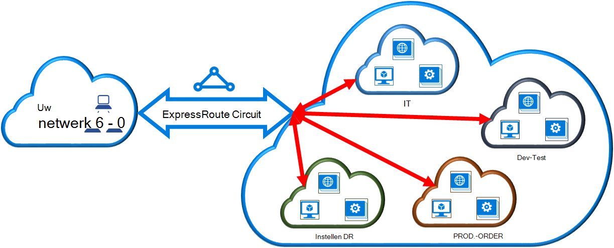

<properties
   pageTitle="Een virtueel netwerk koppelen aan een ExpressRoute circuit met de klassieke implementatiemodel en PowerShell | Microsoft Azure"
   description="Dit document bevat een overzicht van het virtuele netwerken (VNets) koppelen aan ExpressRoute circuits met de klassieke implementatiemodel en PowerShell."
   services="expressroute"
   documentationCenter="na"
   authors="ganesr"
   manager="carmonm"
   editor=""
   tags="azure-service-management"/>
<tags
   ms.service="expressroute"
   ms.devlang="na"
   ms.topic="article"
   ms.tgt_pltfrm="na"
   ms.workload="infrastructure-services"
   ms.date="10/10/2016"
   ms.author="ganesr" />

# Een virtueel netwerk koppelen aan een ExpressRoute circuit

> [AZURE.SELECTOR]
- [Azure Portal - Resource Manager](expressroute-howto-linkvnet-portal-resource-manager.md)
- [PowerShell - Resource Manager](expressroute-howto-linkvnet-arm.md)
- [PowerShell - klassiek](expressroute-howto-linkvnet-classic.md)

In dit artikel kunt u virtuele netwerken (VNets) koppelen aan Azure ExpressRoute circuits met de klassieke implementatiemodel en PowerShell. Virtuele netwerken in het abonnement op dezelfde kunnen zijn of kunnen deel uitmaken van een ander abonnement.

**Over de Azure-implementatie**

[AZURE.INCLUDE [vpn-gateway-clasic-rm](../../includes/vpn-gateway-classic-rm-include.md)]

## Vereisten voor configuratie

1. U moet de meest recente versie van de Azure PowerShell-modules. De meest recente PowerShell modules kunt u downloaden van de PowerShell-sectie van de [pagina Downloads Azure](https://azure.microsoft.com/downloads/). Volg de instructies in [het installeren en configureren van Azure PowerShell](../powershell-install-configure.md) voor stapsgewijze instructies voor het configureren van de computer voor het gebruik van de Azure PowerShell-modules.
2. U moet de [voorwaarden](expressroute-prerequisites.md), [Routering](expressroute-routing.md)en [werkstromen](expressroute-workflows.md) bekijken voordat u configuratie.
3. U hebt een actieve ExpressRoute circuit.
    - Volg de instructies voor het [maken van een circuit ExpressRoute](expressroute-howto-circuit-classic.md) en hebben uw provider verbinding is het circuit inschakelen.
    - Zorg ervoor dat u beschikt over Azure private peering geconfigureerd voor het circuit. Zie het artikel [routering configureren](expressroute-howto-routing-classic.md) voor instructies voor routering.
    - Zorg ervoor dat Azure private peering is geconfigureerd en de BGP peering tussen uw netwerk en Microsoft omhoog zodat u end-to-end connectiviteit kunt inschakelen.
    - Als u een virtueel netwerk en hebt een virtueel netwerkgateway gemaakt en volledig ingericht. Volg de instructies voor het [configureren van een virtueel netwerk voor ExpressRoute](expressroute-howto-vnet-portal-classic.md).

U kunt maximaal 10 virtuele netwerken koppelen aan een ExpressRoute circuit. Alle virtuele netwerken moeten zich in hetzelfde geopolitieke regio. U kunt een groter aantal virtuele netwerken aan uw ExpressRoute circuit of koppeling virtuele netwerken die op andere geopolitieke regio's als u de invoegtoepassing ExpressRoute premium ingeschakeld koppelen. Raadpleeg de [Veelgestelde vragen](expressroute-faqs.md) voor meer informatie over de invoegtoepassing premium.

## Een virtueel netwerk in het abonnement op dezelfde verbinding met een circuit

U kunt een virtueel netwerk koppelen aan een ExpressRoute circuit met behulp van de volgende cmdlet. Zorg ervoor dat de gateway virtueel netwerk wordt gemaakt en gereed is voor het koppelen voordat u de cmdlet uitvoert.

    New-AzureDedicatedCircuitLink -ServiceKey "*****************************" -VNetName "MyVNet"
    Provisioned

## Verbinding maken met een virtueel netwerk in een ander abonnement op een circuit

U kunt meerdere abonnementen een circuit ExpressRoute delen. In de volgende afbeelding ziet u een eenvoudige schematische van hoe delen werken voor ExpressRoute circuits over meerdere abonnementen.

Elk van de kleinere wolken in de grote wolk wordt gebruikt voor abonnementen die deel uitmaken van verschillende afdelingen binnen een organisatie. Elk van de afdelingen binnen de organisatie kunt hun eigen abonnement gebruiken voor het implementeren van hun services-- maar de departementen kunt delen één ExpressRoute verbinding uw netwerk op ruimten te maken. Één afdeling (in dit voorbeeld: IT) eigenaar kunnen zijn van het circuit ExpressRoute. Overige abonnementen binnen de organisatie kan het circuit ExpressRoute kunnen gebruiken.

>[AZURE.NOTE] Verbindingen en bandbreedte kosten voor speciaal circuit wordt toegepast op de eigenaar ExpressRoute circuit. Alle virtuele netwerken delen de dezelfde bandbreedte.

### Beheer

De *eigenaar van het circuit* is de beheerder/coadministrator van het abonnement waarin het circuit ExpressRoute wordt gemaakt. De eigenaar van het circuit kan beheerders/coadministrators van andere abonnementen, aangeduid als *gebruikers circuit*, voor het gebruik van de eigen circuit waarvan ze eigenaar toestaan. Circuit-gebruikers die gemachtigd zijn gebruik van de organisatie ExpressRoute circuit kunnen het virtuele netwerk in hun abonnement koppelen aan het circuit ExpressRoute nadat ze gemachtigd zijn.

De eigenaar van het circuit heeft de kracht om te wijzigen en intrekken van vergunningen op elk gewenst moment. Intrekken van een vergunning heeft tot gevolg dat alle koppelingen worden verwijderd van het abonnement waarvan access is ingetrokken.

### Circuit eigenaar bewerkingen

#### Maken van een vergunning

De eigenaar van het circuit machtigt de beheerders van andere abonnementen voor het gebruik van het opgegeven circuit. In het volgende voorbeeld kan de beheerder van het circuit (Contoso IT) de beheerder van een ander abonnement (Dev-Test) voor het koppelen van twee virtuele netwerken op het circuit. De Contoso-IT-beheerder maakt dit mogelijk door te geven van de Dev-Test Microsoft-ID. De cmdlet wordt niet per e-mail naar de opgegeven id van Microsoft. De eigenaar van het circuit moet expliciet melding de eigenaar van de andere abonnement dat de vergunning voltooid is.

    New-AzureDedicatedCircuitLinkAuthorization -ServiceKey "**************************" -Description "Dev-Test Links" -Limit 2 -MicrosoftIds 'devtest@contoso.com'

    Description         : Dev-Test Links
    Limit               : 2
    LinkAuthorizationId : **********************************
    MicrosoftIds        : devtest@contoso.com
    Used                : 0

#### Vergunningen bekijken

De eigenaar van het circuit kunt bekijken van alle vergunningen die op een bepaald circuit zijn uitgegeven door de volgende cmdlet wordt uitgevoerd:

    Get-AzureDedicatedCircuitLinkAuthorization -ServiceKey: "**************************"

    Description         : EngineeringTeam
    Limit               : 3
    LinkAuthorizationId : ####################################
    MicrosoftIds        : engadmin@contoso.com
    Used                : 1

    Description         : MarketingTeam
    Limit               : 1
    LinkAuthorizationId : @@@@@@@@@@@@@@@@@@@@@@@@@@@@@@@@@@@@
    MicrosoftIds        : marketingadmin@contoso.com
    Used                : 0

    Description         : Dev-Test Links
    Limit               : 2
    LinkAuthorizationId : &&&&&&&&&&&&&&&&&&&&&&&&&&&&&&&&&&&&
    MicrosoftIds        : salesadmin@contoso.com
    Used                : 2

#### Bijwerken van vergunningen

De eigenaar van het circuit kunt vergunningen wijzigen met behulp van de volgende cmdlet:

    Set-AzureDedicatedCircuitLinkAuthorization -ServiceKey "**************************" -AuthorizationId "&&&&&&&&&&&&&&&&&&&&&&&&&&&&"-Limit 5

    Description         : Dev-Test Links
    Limit               : 5
    LinkAuthorizationId : &&&&&&&&&&&&&&&&&&&&&&&&&&&&&&&&&&&&&&
    MicrosoftIds        : devtest@contoso.com
    Used                : 0

#### Verwijderen van vergunningen

De eigenaar van het circuit kunt intrekken of verwijderen vergunningen aan de gebruiker door de volgende cmdlet wordt uitgevoerd:

    Remove-AzureDedicatedCircuitLinkAuthorization -ServiceKey "*****************************" -AuthorizationId "###############################"

### Circuit gebruiker bewerkingen

#### Vergunningen bekijken

De gebruiker circuit kunt vergunningen bekijken met behulp van de volgende cmdlet:

    Get-AzureAuthorizedDedicatedCircuit

    Bandwidth                        : 200
    CircuitName                      : ContosoIT
    Location                         : Washington DC
    MaximumAllowedLinks              : 2
    ServiceKey                       : &&&&&&&&&&&&&&&&&&&&&&&&&&&&&&&&&&&&
    ServiceProviderName              : equinix
    ServiceProviderProvisioningState : Provisioned
    Status                           : Enabled
    UsedLinks                        : 0

#### Vergunningen voor link ruilen

De circuit-gebruiker kan de volgende cmdlet een vergunning koppeling wissel uitvoeren:

    New-AzureDedicatedCircuitLink –servicekey "&&&&&&&&&&&&&&&&&&&&&&&&&&" –VnetName 'SalesVNET1'

    State VnetName
    ----- --------
    Provisioned SalesVNET1

## Volgende stappen

Raadpleeg voor meer informatie over ExpressRoute, [ExpressRoute Veelgestelde vragen](expressroute-faqs.md).
