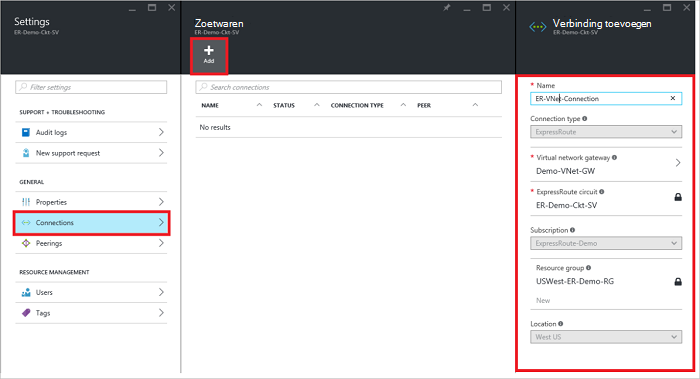
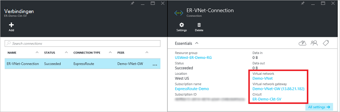

<properties
   pageTitle="Een virtueel netwerk koppelen aan een ExpressRoute circuit met behulp van het implementatiemodel Resource Manager en de Azure portal | Microsoft Azure"
   description="Dit document biedt een overzicht van het virtuele netwerken (VNets) koppelen aan ExpressRoute circuits."
   services="expressroute"
   documentationCenter="na"
   authors="cherylmc"
   manager="carmonm"
   editor=""
   tags="azure-resource-manager"/>
<tags
   ms.service="expressroute"
   ms.devlang="na"
   ms.topic="article"
   ms.tgt_pltfrm="na"
   ms.workload="infrastructure-services"
   ms.date="10/10/2016"
   ms.author="cherylmc" />

# Een virtueel netwerk koppelen aan een ExpressRoute circuit

> [AZURE.SELECTOR]
- [Azure Portal - Resource Manager](expressroute-howto-linkvnet-portal-resource-manager.md)
- [PowerShell - Resource Manager](expressroute-howto-linkvnet-arm.md)
- [PowerShell - klassiek](expressroute-howto-linkvnet-classic.md)

In dit artikel kunt u virtuele netwerken (VNets) ExpressRoute Azure circuits koppelen via het implementatiemodel Resource Manager en de Azure portal. Virtuele netwerken in het abonnement op dezelfde kunnen zijn of deel uitmaken van een ander abonnement.

**Over de Azure-implementatie**

[AZURE.INCLUDE [vpn-gateway-clasic-rm](../../includes/vpn-gateway-classic-rm-include.md)]

## Vereisten voor configuratie

- Zorg ervoor dat u [vereisten](expressroute-prerequisites.md), [vereisten voor routering](expressroute-routing.md)en [werkstromen](expressroute-workflows.md) hebt gecontroleerd voordat u configuratie.
- U hebt een actieve ExpressRoute circuit.
    - Volg de instructies voor het [maken van een circuit ExpressRoute](expressroute-howto-circuit-arm.md) en hebben het circuit door uw provider verbinding ingeschakeld.

    - Zorg ervoor dat u beschikt over Azure private peering geconfigureerd voor het circuit. Zie het artikel [routering configureren](expressroute-howto-routing-portal-resource-manager.md) voor instructies voor routering.

    - Zorg ervoor dat Azure private peering is geconfigureerd en de BGP peering tussen uw netwerk en Microsoft omhoog zodat u end-to-end connectiviteit kunt inschakelen.

    - Zorg ervoor dat er een virtueel netwerk en de gateway van een virtueel netwerk gemaakt en volledig ingericht. Volg de instructies voor het maken van een [VPN-gateway](../articles/vpn-gateway/vpn-gateway-howto-site-to-site-resource-manager-portal.md) (Volg alleen stappen 1-5).

U kunt maximaal 10 virtuele netwerken koppelen aan een standaard ExpressRoute circuit. Alle virtuele netwerken moeten zich in dezelfde regio geopolitieke bij gebruik van een standaard ExpressRoute circuit. U kunt een virtuele netwerken buiten de geopolitieke regio van het circuit ExpressRoute koppelen of een groter aantal virtuele netwerken verbinden met uw ExpressRoute circuit als u de invoegtoepassing ExpressRoute premium ingeschakeld. Raadpleeg de [Veelgestelde vragen](expressroute-faqs.md) voor meer informatie over de invoegtoepassing premium.

## Een virtueel netwerk in het abonnement op dezelfde verbinding met een circuit

### Een verbinding maken

1. Zorg ervoor dat uw ExpressRoute circuit en Azure private peering met succes is geconfigureerd. Volg de instructies in [een circuit ExpressRoute maken](expressroute-howto-circuit-arm.md) en [routering configureren](expressroute-howto-routing-arm.md). Uw ExpressRoute circuit ziet in de volgende afbeelding.

    

    >[AZURE.NOTE] BGP configuratiegegevens wordt niet weergegeven als de layer 3-provider uw peerings geconfigureerd. Als uw circuit een ingerichte staat is, moet u mogelijk zijn om verbindingen te maken.

2. U kunt nu gaan inrichten van een verbinding voor een virtueel netwerk toegang tot het circuit ExpressRoute koppelen. Klik op **verbinding** > **toevoegen** aan de bladeserver **verbinding toevoegen** openen en configureer vervolgens de waarden. Zie het volgende voorbeeld van de verwijzing.

      

3. Nadat de verbinding is geconfigureerd, wordt de informatie voor de verbinding weergegeven in het connection-object.

    

### Een verbinding verwijderen

U kunt een verbinding verwijderen door het pictogram **verwijderen** op het blad voor de verbinding te selecteren.

## Verbinding maken met een virtueel netwerk in een ander abonnement op een circuit

Op dit moment, u geen verbinding maken virtuele netwerken via abonnementen via de portal Azure. U kunt echter PowerShell om dit te doen. Zie het artikel [PowerShell](expressroute-howto-linkvnet-arm.md) voor meer informatie.

## Volgende stappen

Raadpleeg voor meer informatie over ExpressRoute, [ExpressRoute Veelgestelde vragen](expressroute-faqs.md).
