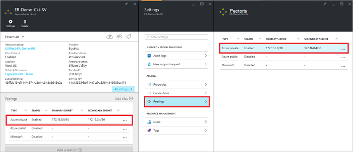
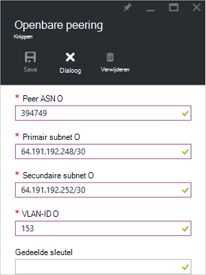
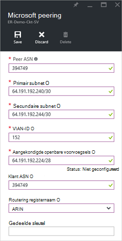

<properties
   pageTitle="Het configureren van routering voor een ExpressRoute circuit met behulp van de Portal Azure | Microsoft Azure"
   description="Dit artikel begeleidt u door de stappen voor het maken en het particuliere, openbare en Microsoft peering van een circuit ExpressRoute inrichten. In dit artikel ziet u ook het controleren van de status, bijwerken of verwijderen van peerings voor het circuit."
   documentationCenter="na"
   services="expressroute"
   authors="cherylmc"
   manager="carmonm"
   editor=""
   tags="azure-resource-manager"/>
<tags
   ms.service="expressroute"
   ms.devlang="na"
   ms.topic="hero-article" 
   ms.tgt_pltfrm="na"
   ms.workload="infrastructure-services"
   ms.date="10/10/2016"
   ms.author="cherylmc"/>

# Maken en wijzigen voor een circuit ExpressRoute routering

> [AZURE.SELECTOR]
[Azure Portal - Resource Manager](expressroute-howto-routing-portal-resource-manager.md)
[PowerShell - Resource Manager](expressroute-howto-routing-arm.md)
[PowerShell - klassiek](expressroute-howto-routing-classic.md)

Dit artikel begeleidt u door de stappen voor het maken en beheren van de configuratie van de routering voor een ExpressRoute circuit met behulp van de portal Azure en het implementatiemodel Resource Manager.

**Over de Azure-implementatie**

[AZURE.INCLUDE [vpn-gateway-clasic-rm](../../includes/vpn-gateway-classic-rm-include.md)] 

## Vereisten voor configuratie

- Zorg ervoor dat u de pagina [vereisten](expressroute-prerequisites.md) en de [vereisten voor routering](expressroute-routing.md) pagina de pagina [werkstromen](expressroute-workflows.md) hebt gecontroleerd voordat u configuratie.
- U hebt een actieve ExpressRoute circuit. Volg de instructies op [een circuit ExpressRoute maken](expressroute-howto-circuit-arm.md) en hebben het circuit door uw provider verbinding ingeschakeld voordat u verdergaat. Het circuit ExpressRoute moet zijn ingericht en de ingeschakelde status voor te kunnen uitvoeren van de cmdlets die hieronder worden beschreven.

Deze instructies zijn alleen van toepassing op circuits gemaakt met serviceproviders bieden services voor laag 2-connectiviteit. Als u een serviceprovider biedt managed Layer 3-services (doorgaans een IPVPN, zoals MPLS), uw provider verbinding configureren en beheren van routering voor u. 

>[AZURE.IMPORTANT] Wij adverteren op dit moment geen peerings geconfigureerd door serviceproviders via de service management portal. Wij werken voor het inschakelen van deze mogelijkheid snel. Neem contact op met uw serviceprovider voor BGP peerings configureren.

U kunt een, twee of alle drie peerings (Azure private, Azure publiek en Microsoft) voor een ExpressRoute circuit. U kunt de peerings in elke gewenste volgorde. Echter, moet u ervoor zorgen dat u de configuratie van elk peering tegelijk uitvoeren. 

## Azure private peering

Deze sectie bevat instructies voor het maken, ophalen, bijwerken en verwijderen van de Azure private peering configuratie voor een ExpressRoute circuit. 

### Azure private peering maken

1. De ExpressRoute-circuit configureren. Zorg ervoor dat het circuit volledig door de provider verbinding voordat u verdergaat ingericht is.

    

2. Configureer Azure private peering voor het circuit. Zorg ervoor dat u beschikt over het volgende voordat u met de volgende stappen verdergaat:

    - Een /30 subnet voor de primaire koppeling. Dit mag geen deel uitmaken van een adresruimte gereserveerd voor virtuele netwerken.
    - Een /30 subnet voor de tweede koppeling. Dit mag geen deel uitmaken van een adresruimte gereserveerd voor virtuele netwerken.
    - Een geldige VLAN ID vast te stellen deze peering op. Zorg ervoor dat er geen bij andere peering in het circuit dezelfde VLAN-ID gebruikt.
    - Als getal voor peering. U kunt zowel 2-byte en 4-byte als getallen. U kunt een particulier als nummer voor deze peering. Zorg ervoor dat u geen 65515 gebruikt.
    - Een MD5-hash als u kiest voor een. **Dit is optioneel**.

3. De Azure Private peering rij selecteren, zoals hierna wordt getoond.
    
    
    

4. Configureer de private peering. De onderstaande afbeelding ziet een configuratievoorbeeld van de.

    

    
5. De configuratie opslaan nadat u alle parameters hebt opgegeven. Nadat de configuratie is geaccepteerd, ziet u een vergelijkbaar met het onderstaande voorbeeld.

    
    

### Azure private peering details weergeven

U kunt de eigenschappen van Azure private peering door de peering weergeven.

### Azure private peering-configuratie bij te werken

U kunt de rij voor peering selecteren en de peering eigenschappen wijzigen. 

### Azure private peering verwijderen

De configuratie van de peering kunt u verwijderen door het verwijderpictogram zoals hieronder wordt weergegeven.

## Azure openbare peering

Deze sectie bevat instructies voor het maken, ophalen, bijwerken en verwijderen van de Azure openbare peering configuratie voor een ExpressRoute circuit. 

### Azure openbare peering maken

1. ExpressRoute circuit configureren. Zorg ervoor dat het circuit volledig door de connectiviteit provider ingericht is voordat u verder gaat verder.

    

2. Configureer Azure openbare peering voor het circuit. Zorg ervoor dat u beschikt over het volgende voordat u met de volgende stappen verdergaat:

    - Een /30 subnet voor de primaire koppeling. 
    - Een /30 subnet voor de tweede koppeling. 
    - Alle IP-adressen die worden gebruikt voor het instellen van deze peering moet geldige openbare IPv4-adressen.
    - Een geldige VLAN ID vast te stellen deze peering op. Zorg ervoor dat er geen bij andere peering in het circuit dezelfde VLAN-ID gebruikt.
    - Als getal voor peering. U kunt zowel 2-byte en 4-byte als getallen.
    - Een MD5-hash als u kiest voor een. **Dit is optioneel**.

3. De Azure openbare peering rij selecteren, zoals hierna wordt getoond.
    
    
    

4. Configureer de openbare peering. De onderstaande afbeelding ziet een configuratievoorbeeld van de.

    

    
5. De configuratie opslaan nadat u alle parameters hebt opgegeven. Nadat de configuratie is geaccepteerd, ziet u een vergelijkbaar met het onderstaande voorbeeld.

    
    

### Azure openbare peering details weergeven

U kunt de eigenschappen van Azure openbare peering door de peering weergeven.

### Azure openbare peering configuratie bij te werken

U kunt de rij voor peering selecteren en de peering eigenschappen wijzigen. 

### Azure openbare peering verwijderen

De configuratie van de peering kunt u verwijderen door het verwijderpictogram zoals hieronder wordt weergegeven.

## Microsoft peering

Deze sectie bevat instructies voor het maken, ophalen, bijwerken en verwijderen van de peering configuratie van Microsoft voor een circuit ExpressRoute. 

### Microsoft peering maken

1. ExpressRoute circuit configureren. Zorg ervoor dat het circuit volledig door de connectiviteit provider ingericht is voordat u verder gaat verder.

    

2. Configureer Microsoft peering voor het circuit. Zorg ervoor dat u hebt de volgende informatie voordat u verdergaat.

    - Een /30 subnet voor de primaire koppeling. Dit moet een geldige openbare IPv4-voorvoegsel eigendom en geregistreerd zijn in een RIR / IR.
    - Een /30 subnet voor de tweede koppeling. Dit moet een geldige openbare IPv4-voorvoegsel eigendom en geregistreerd zijn in een RIR / IR.
    - Een geldige VLAN ID vast te stellen deze peering op. Zorg ervoor dat er geen bij andere peering in het circuit dezelfde VLAN-ID gebruikt.
    - Als getal voor peering. U kunt zowel 2-byte en 4-byte als getallen.
    - **Voorvoegsels aangekondigd:** U moet een lijst van alle nummers die u van plan bent om te adverteren via het BGP-sessie opgeven. Alleen openbare IP-adresprefixen worden geaccepteerd. U kunt een door komma's gescheiden lijst verzenden als u van plan bent voor het verzenden van een set van voorvoegsels. Deze voorvoegsels voor u moeten zijn geregistreerd in een RIR / IR.
    - **Klant ASN:** Als u reclame voorvoegsels die niet zijn geregistreerd op de peering als getal, kunt u het nummer van de AS waaraan ze zijn geregistreerd. **Dit is optioneel**.
    - **Routing registernaam:** U kunt opgeven dat de RIR / IR waartegen de AS en de voorvoegsels zijn geregistreerd. **Dit is optioneel.**
    - Een MD5-hash, als u kiest voor een. **Dit is optioneel.**
    
3. U kunt de peering die u configureren wilt, zoals hieronder wordt weergegeven. Selecteer de Microsoft peering rij.
    
    
    

4.  Configureer Microsoft peering. De onderstaande afbeelding ziet een configuratievoorbeeld van de.

    

    
5. De configuratie opslaan nadat u alle parameters hebt opgegeven. 

    Als het circuit te krijgt een validatie vereist staat (zoals hieronder wordt weergegeven), moet u een support ticket om te tonen dat de eigendom van de voorvoegsels aan ons ondersteuningsteam openen.  
    
    

    U kunt een support ticket openen direct vanaf de portal zoals hieronder wordt weergegeven   
    
    

6. Nadat de configuratie is geaccepteerd, ziet u een vergelijkbaar met het onderstaande voorbeeld.

    
    

### Microsoft peering details weergeven

U kunt de eigenschappen van Azure openbare peering door de peering weergeven.

### Microsoft peering-configuratie bij te werken

U kunt de rij voor peering selecteren en de peering eigenschappen wijzigen. 

### Microsoft peering verwijderen

De configuratie van de peering kunt u verwijderen door het verwijderpictogram zoals hieronder wordt weergegeven.

## Volgende stappen

Volgende stap, [een VNet op een circuit ExpressRoute koppeling](expressroute-howto-linkvnet-arm.md).

-  Zie voor meer informatie over workflows ExpressRoute [ExpressRoute werkstromen](expressroute-workflows.md).

-  Zie voor meer informatie over peering circuit [ExpressRoute circuits en routering domeinen](expressroute-circuit-peerings.md).

-  Zie [virtuele netwerk-overzicht](../virtual-network/virtual-networks-overview.md)voor meer informatie over het werken met virtuele netwerken.

