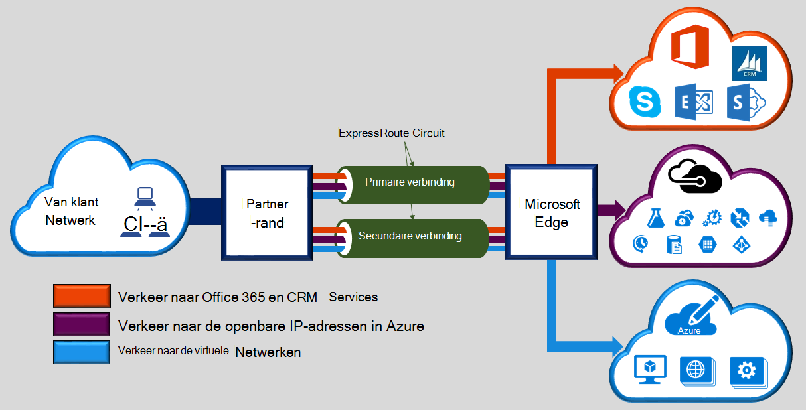
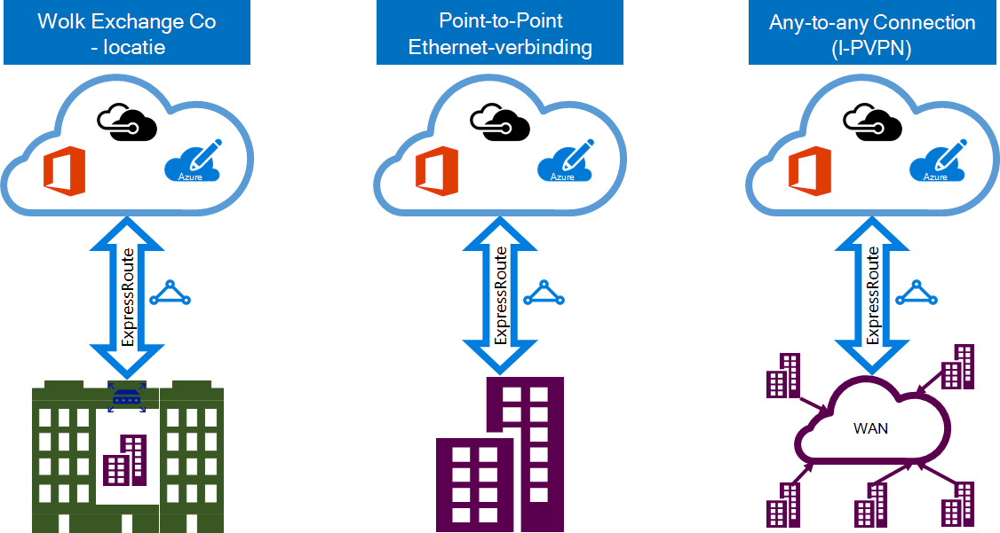

<properties 
   pageTitle="Inleiding tot ExpressRoute | Microsoft Azure"
   description="Deze pagina biedt een overzicht van de service ExpressRoute, met inbegrip van de werking van een ExpressRoute-verbinding."
   documentationCenter="na"
   services="expressroute"
   authors="cherylmc"
   manager="carmonm"
   editor=""/>
<tags 
   ms.service="expressroute"
   ms.devlang="na"
   ms.topic="get-started-article" 
   ms.tgt_pltfrm="na"
   ms.workload="infrastructure-services" 
   ms.date="10/10/2016"
   ms.author="cherylmc"/>

# ExpressRoute-technisch overzicht

Microsoft Azure ExpressRoute kunt u uw netwerken op ruimten uitbreiden naar de cloud met Microsoft via een specifieke persoonlijke verbinding vergemakkelijkt door een provider connectiviteit. Met ExpressRoute, kunt u verbindingen met Microsoft cloud services, zoals Microsoft Azure, Office 365 en CRM Online maken. Verbinding kan van een any-to-any (VPN IP)-netwerk, een point-to-point Ethernet-netwerk of een virtuele cross-verbinding via een provider connectiviteit in een inrichting collocatie worden. ExpressRoute verbindingen gaan niet via het openbare Internet. Hierdoor ExpressRoute verbindingen biedt meer betrouwbaarheid, hogere snelheden, lagere vertragingstijden en een hogere mate van beveiliging dan de normale verbindingen via het Internet.

**De belangrijkste voordelen zijn:**

- Layer 3-connectiviteit tussen uw netwerk op gebouwen en de Microsoft Cloud via een provider connectiviteit. Verbindingen kan worden van een netwerk in any-to-any (IPVPN), een point-to-point Ethernet-verbinding of via een virtuele cross-verbinding via een Ethernet-uitwisseling.
- Connectiviteit met Microsoft cloud services in alle regio's in de geopolitieke regio.
- Globale connectiviteit met Microsoft-services voor alle regio's met een premium-invoegtoepassing ExpressRoute.
- Dynamische routering tussen uw netwerk en Microsoft via standaardprotocollen (BGP).
- Ingebouwde redundantie in elke peering locatie voor een hogere betrouwbaarheid.
- Verbinding uptime [SLA](https://azure.microsoft.com/support/legal/sla/).
- QoS- en ondersteuning voor meerdere klassen voor speciale toepassingen, zoals Skype voor bedrijven.

Raadpleeg de [Veelgestelde vragen over ExpressRoute](expressroute-faqs.md) voor meer informatie.

## Hoe kan ik mijn netwerk verbinden met Microsoft op ExpressRoute?

U kunt een verbinding maken tussen het netwerk van gebouwen en de Microsoft cloud op drie verschillende manieren:

### Kan zich bevinden op een wolk exchange

Als u zich samen in een ruimte met een exchange-wolk, kunt u virtuele cross-verbindingen naar de cloud met Microsoft via Ethernet-uitwisseling van de provider collocatie bestellen. Collocatie providers kunnen cross-Layer 2-verbindingen of beheerde Layer 3 cross-verbindingen tussen uw infrastructuur in collocatie inrichting en de Microsoft cloud aanbieden.

### Point-to-Point via Ethernet-verbindingen 

Naar de cloud met Microsoft via point-to-point Ethernet-verbindingen kunt u uw datacenters op gebouwen/kantoren. Point-to-Point Ethernet-providers bieden voor Layer 2-verbindingen of managed Layer 3-verbindingen tussen uw site en de Microsoft cloud.

### Any-to-any (IPVPN)-netwerken

U kunt uw WAN integreren met de Microsoft-cloud. IPVPN's (meestal MPLS VPN) bieden any-to-any connectiviteit tussen de filialen en datacenters. De Microsoft cloud kan onderling verbonden aan uw WAN zodat deze net als andere filiaal. WAN-aanbieders bieden gewoonlijk beheerde Layer 3-connectiviteit. ExpressRoute functies en mogelijkheden die allemaal identiek zijn in alle van de bovenstaande modellen van verbindingen. 

Providers connectiviteit kunnen een of meer modellen van connectiviteit bieden. U kunt werken met uw provider verbinding te halen van het model dat het meest geschikt voor u.

## ExpressRoute functies

ExpressRoute ondersteunt de volgende functies en mogelijkheden: 

### Layer 3-connectiviteit

Microsoft gebruikt dynamische routering standaardprotocol (BGP) voor het uitwisselen van routes tussen uw netwerk op gebouwen, de exemplaren in Azure en Microsoft openbare adressen.  We stellen meerdere BGP sessies met uw netwerk voor profielen van ander verkeer. Meer informatie vindt u in het artikel [ExpressRoute circuit en routering van domeinen](expressroute-circuit-peerings.md) .

### Redundantie

Elk circuit ExpressRoute bestaat uit twee verbindingen aan twee Microsoft Enterprise edge routers (MSEEs) van de provider van connectivity / uw edge-netwerk. Microsoft vereist dual BGP verbinding van de provider van connectivity / uw kant: één voor elke MSEE. U kunt geen overbodige apparaten implementeren / Ethernet schakelingen aan het einde. Connectiviteit-providers gebruiken echter overbodig apparaten om ervoor te zorgen dat uw verbindingen zijn doorgegeven aan Microsoft op een redundante wijze. Een redundante configuratie van de Layer 3-connectiviteit is vereist voor onze [SLA](https://azure.microsoft.com/support/legal/sla/) om geldig te zijn. 

### Connectiviteit met Microsoft cloud services

[AZURE.INCLUDE [expressroute-office365-include](../../includes/expressroute-office365-include.md)]

ExpressRoute-verbindingen inschakelen voor toegang tot de volgende services:

- Microsoft Azure services
- Microsoft Office 365 diensten
- Microsoft CRM on line services 
 
U kunt de pagina [Veelgestelde vragen over ExpressRoute](expressroute-faqs.md) voor een gedetailleerde lijst van services die worden ondersteund via ExpressRoute bezoeken.

### De verbinding met alle regio's binnen een geopolitieke regio

U kunt verbinding maken met Microsoft op een van onze [peering locaties](expressroute-locations.md) en toegang hebben tot alle regio's in het geopolitieke gebied. 

Als u verbinding met Microsoft in Amsterdam via ExpressRoute, hebt u bijvoorbeeld toegang tot alle Microsoft cloud gehost in Noord-Europa en West-Europa. Raadpleeg het artikel [ExpressRoute partners en peering locaties](expressroute-locations.md) voor een overzicht van de geopolitieke gebieden, gekoppelde Microsoft cloud-regio's en bijbehorende ExpressRoute peering locaties.

### Globale connectiviteit met ExpressRoute premium-invoegtoepassing

U kunt de functie ExpressRoute premium invoegtoepassing connectiviteit geopolitieke grenzen uitbreiden inschakelen. Bijvoorbeeld, als u met Microsoft in Amsterdam via ExpressRoute verbonden bent, hebt u toegang tot alle Microsoft cloud gehost in alle regio's over de hele wereld (nationale wolken zijn uitgesloten). U kunt toegang krijgen tot services geïmplementeerd in Zuid-Amerika of Australië dezelfde manier hebt u toegang tot de regio's Noord en West-Europa.

### Uitgebreide connectiviteit partner ecosysteem

ExpressRoute heeft een steeds groeiend ecosysteem van providers connectiviteit en SI-partners. U kunt verwijzen naar het artikel [ExpressRoute providers en locaties](expressroute-locations.md) voor de meest recente informatie.

### Verbinding met nationale wolken

Microsoft werkt geïsoleerde cloud-omgevingen voor speciale geopolitieke regio's en klantsegmenten. Raadpleeg de pagina [ExpressRoute providers en locaties](expressroute-locations.md) voor een lijst met providers en nationale wolken.

### Ondersteunde bandbreedte-opties

U kunt kopen ExpressRoute circuits voor een brede reeks bandbreedtes. Hieronder wordt de lijst met ondersteunde bandbreedten. Moet u contact opnemen met uw provider verbinding naar de lijst met ondersteunde bandbreedten die ze bieden.

- 50 Mbps
- 100 Mbps
- 200 Mbps
- 500 Mbps
- 1 Gbps
- 2 Gbps
- 5 Gbps
- 10 Gbps

### Dynamische schaal van bandbreedte

U hebt de mogelijkheid om te vergroten de bandbreedte ExpressRoute circuit (op een beste inspanning) zonder verbindingen verwijderen. 

### Modellen voor flexibele facturering

Kunt u een factuuradres model dat het meest geschikt voor u. Kiezen tussen de facturering modellen die hieronder worden beschreven. Raadpleeg de pagina [Veelgestelde vragen over ExpressRoute](expressroute-faqs.md) voor meer informatie. 

- **Onbeperkt gegevens**. Het circuit ExpressRoute wordt in rekening gebracht op basis van een maandelijkse vergoeding en overdracht van alle inkomende en uitgaande gegevens is opgenomen in het vrije kosteloos. 
- **Metered gegevens**. Het circuit ExpressRoute in rekening wordt gebracht op basis van een maandelijkse vergoeding. Al het binnenkomende gegevensverkeer is gratis. Uitgaande gegevensoverdracht wordt per GB overdracht van gegevens aangerekend. Gegevensoverdrachtsnelheden verschillen per regio.
- **ExpressRoute premium-invoegtoepassing**. De premie ExpressRoute is een invoegtoepassing via het ExpressRoute circuit. De invoegtoepassing ExpressRoute premium biedt de volgende mogelijkheden: 
    - Verbeterde route limieten voor Azure openbare en Azure private peering uit 4000 routes naar 10.000 routes.
    - Globale connectiviteit voor services. Een ExpressRoute circuit gemaakt in elke regio (met uitzondering van nationale wolken) hebben toegang tot bronnen in een andere regio in de wereld. Bijvoorbeeld, zijn een virtueel netwerk gemaakt in West-Europa toegankelijk via een ExpressRoute circuit ingericht in Silicon Valley.
    - Grotere aantal VNet koppelingen per ExpressRoute circuit van 10 voor een grotere, afhankelijk van de bandbreedte van het circuit.

## Volgende stappen

- Informatie over ExpressRoute verbindingen en routering domeinen. Zie [ExpressRoute circuits en routering domeinen](expressroute-circuit-peerings.md).
- Zoeken naar een Internet-provider. Zie [ExpressRoute partners en peering locaties](expressroute-locations.md).
- Zorg ervoor dat aan alle vereisten is voldaan. Zie [ExpressRoute vereisten](expressroute-prerequisites.md).
- Raadpleeg de vereisten voor [Routering](expressroute-routing.md), [NAT](expressroute-nat.md) en [QoS](expressroute-qos.md).
- Configureer uw verbinding ExpressRoute.
    - [ExpressRoute circuits maken](expressroute-howto-circuit-classic.md)
    - [Routering configureren](expressroute-howto-routing-classic.md)
    - [Een VNet koppelen aan een ExpressRoute circuit](expressroute-howto-linkvnet-classic.md)
