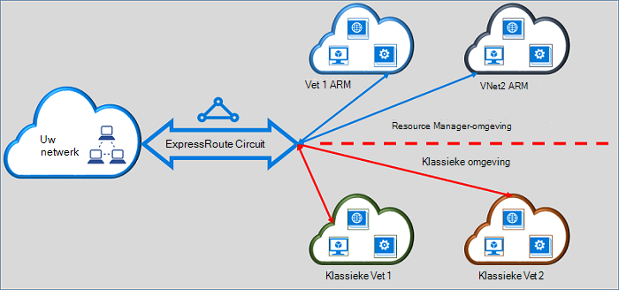

<properties
   pageTitle="ExpressRoute circuits verplaatsen van klassiek tot Resource Manager | Microsoft Azure"
   description="Deze pagina biedt een overzicht van wat u weten moet over het overbruggen van de klassieke en de implementatiemodellen Resource Manager."
   documentationCenter="na"
   services="expressroute"
   authors="ganesr"
   manager="carmonm"
   editor=""/>
<tags
   ms.service="expressroute"
   ms.devlang="na"
   ms.topic="get-started-article"
   ms.tgt_pltfrm="na"
   ms.workload="infrastructure-services"
   ms.date="10/10/2016"
   ms.author="ganesr"/>

# ExpressRoute circuits van het klassieke verplaatsen naar het implementatiemodel Resource Manager

Dit artikel bevat een overzicht van wat het betekent een Azure ExpressRoute circuit van het klassieke naar het implementatiemodel Azure Resource Manager verplaatsen.

[AZURE.INCLUDE [vpn-gateway-sm-rm](../../includes/vpn-gateway-classic-rm-include.md)]

Verbinding maken met virtuele netwerken die zijn geïmplementeerd in de klassieke en de implementatiemodellen Resource Manager kunt u een enkele ExpressRoute circuit. Een circuit ExpressRoute, ongeacht de manier waarop deze is gemaakt, kan nu koppelen aan virtuele netwerken tussen beide implementatiemodellen.

## ExpressRoute circuits die zijn gemaakt in het implementatiemodel klassiek

ExpressRoute circuits die zijn gemaakt in het implementatiemodel Klassiek moeten worden verplaatst naar het implementatiemodel Resource Manager eerst voor verbindingen met zowel de klassieke als de bronnenbeheerder implementatiemodellen. Is er geen verlies van de netwerkverbindingen te onderbreken of wanneer een verbinding wordt verplaatst. Circuit-de virtuele netwerkverbindingen in het implementatiemodel klassiek (binnen hetzelfde abonnement en cross-abonnement) blijven behouden.

Na de verplaatsing is voltooid, het circuit ExpressRoute zoekt, voert, en lijkt net als een ExpressRoute circuit dat is gemaakt in het implementatiemodel Resource Manager. Nu kunt u verbindingen met virtuele netwerken maken in het implementatiemodel Resource Manager.

Na een ExpressRoute is circuit verplaatst naar het implementatiemodel Resource Manager alleen met behulp van het implementatiemodel Resource Manager kunt u de levensduur van het circuit ExpressRoute beheren. Dit betekent dat u bewerkingen, zoals het toevoegen/bijwerken/verwijderen peerings circuit-eigenschappen (zoals bandbreedte, SKU en type facturering) bijwerken en verwijderen van circuits in het implementatiemodel Resource Manager alleen kunt uitvoeren. Raadpleeg de sectie hieronder op circuits die zijn gemaakt in het implementatiemodel Resource Manager voor meer informatie over hoe u toegang tot beide implementatiemodellen kunt beheren.

U hoeft geen betrekking hebben op uw provider verbinding voor het uitvoeren van de verplaatsing.

## ExpressRoute circuits die zijn gemaakt in het implementatiemodel Resource Manager

U kunt ExpressRoute circuits die zijn gemaakt in het implementatiemodel Resource Manager zijn toegankelijk vanaf beide implementatiemodellen inschakelen. Een circuit ExpressRoute in uw abonnement kan vanuit beide implementatiemodellen worden ingeschakeld.

- ExpressRoute circuits die zijn gemaakt in het implementatiemodel Resource Manager hebt geen toegang tot het implementatiemodel klassiek standaard.
- ExpressRoute circuits die zijn verplaatst van het implementatiemodel klassiek aan het implementatiemodel Resource manager zijn toegankelijk vanaf beide implementatiemodellen standaard.
- Een circuit ExpressRoute heeft altijd toegang tot de bronnenbeheerder implementatiemodel, ongeacht of deze is gemaakt in de bronnenbeheerder of klassieke implementatiemodel. Dit betekent dat u verbindingen met virtuele netwerken in het implementatiemodel Resource Manager gemaakt door de volgende instructies voor [het koppelen van virtuele netwerken maken kunt](expressroute-howto-linkvnet-arm.md).
- Toegang tot de klassieke implementatiemodel wordt bepaald door de parameter **allowClassicOperations** in het circuit ExpressRoute.

>[AZURE.IMPORTANT] Alle quota's die worden beschreven op de pagina [service-limieten](../azure-subscription-service-limits.md) van toepassing. Als u bijvoorbeeld kan een standaard circuit maximaal 10 virtuele koppelingen/netwerkverbindingen hebben in zowel de klassieke als de bronnenbeheerder implementatiemodellen.

## Toegang tot het implementatiemodel klassiek beheren

U kunt een enkele ExpressRoute circuit te koppelen aan virtuele netwerken in beide implementatiemodellen door de parameter **allowClassicOperations** van het circuit ExpressRoute inschakelen.

Als u **allowClassicOperations** instelt op TRUE, kunt u virtuele netwerken van beide implementatiemodellen op het circuit ExpressRoute koppelen. U kunt koppelen aan virtuele netwerken in het implementatiemodel klassiek door de volgende richtlijnen voor [het koppelen van virtuele netwerken in het klassieke implementatiemodel](expressroute-howto-linkvnet-classic.md). Door de volgende richtlijnen voor [het koppelen van virtuele netwerken in het implementatiemodel Resource Manager](expressroute-howto-linkvnet-arm.md)kunt u virtuele netwerken in het implementatiemodel Resource Manager koppelen.

**AllowClassicOperations** wordt ingesteld op FALSE blokkeert de toegang tot het circuit van de klassieke implementatiemodel. Virtuele netwerkverbindingen in het klassieke implementatiemodel blijven echter behouden. In dit geval is het circuit ExpressRoute niet zichtbaar in de klassieke implementatiemodel.

## Ondersteunde bewerkingen in het implementatiemodel klassiek

De volgende klassieke bewerkingen worden ondersteund op een circuit ExpressRoute als **allowClassicOperations** is ingesteld op TRUE:

 - ExpressRoute circuit informatie
 - Koppelingen met klassieke virtuele netwerken virtueel netwerk maken, bijwerken of get/verwijderen
 - Virtueel netwerk maken, bijwerken of get/verwijderen link vergunningen voor cross-abonnement-connectiviteit

U kunt de volgende klassieke bewerkingen kunt uitvoeren wanneer **allowClassicOperations** is ingesteld op TRUE:

 - Maken, bijwerken of get/verwijderen Border Gateway Protocol (BGP) peerings Azure private, Azure publiek en Microsoft peerings
 - ExpressRoute circuits verwijderen

## Communicatie tussen de klassieke en de implementatiemodellen Resource Manager

Het ExpressRoute circuit fungeert als een brug tussen de klassieke en de implementatiemodellen Resource Manager. Verkeer tussen virtual machines in virtuele netwerken in het klassieke implementatiemodel en die in de virtuele netwerken in de Resource Manager distributie model stromen via ExpressRoute als beide virtuele netwerken zijn gekoppeld aan hetzelfde ExpressRoute circuit.

Geaggregeerde doorvoer wordt beperkt door de doorvoercapaciteit van de gateway virtueel netwerk. Verkeer wordt in dergelijke gevallen niet van de provider verbinding met netwerken of uw netwerken invoeren. Verkeersstroom tussen de virtuele netwerken zich volledig in het Microsoft-netwerk.

## Toegang tot openbare Azure en peering Microsoft-bronnen

U kunt toegang krijgen tot bronnen die normaal gesproken toegankelijk zijn via openbare peering Azure en Microsoft peering zonder verstoring blijven.  

## Wat wordt ondersteund

In deze sectie wordt beschreven wat voor ExpressRoute circuits wordt ondersteund:

 - Voor toegang tot virtuele netwerken die zijn geïmplementeerd in de klassieke en de implementatiemodellen Resource Manager kunt u een enkele ExpressRoute circuit.
 - U kunt een ExpressRoute circuit van het klassieke verplaatsen naar het implementatiemodel Resource Manager. Nadat dit is verplaatst, het circuit ExpressRoute ziet er veel en wordt net als alle andere ExpressRoute circuit dat is gemaakt in het implementatiemodel Resource Manager wordt uitgevoerd.
 - U kunt alleen het circuit ExpressRoute verplaatsen. Circuit koppelingen, virtuele netwerken en gateways VPN kunnen niet worden verplaatst door deze bewerking.
 - Na een ExpressRoute is circuit verplaatst naar het implementatiemodel Resource Manager alleen met behulp van het implementatiemodel Resource Manager kunt u de levensduur van het circuit ExpressRoute beheren. Dit betekent dat u bewerkingen, zoals het toevoegen/bijwerken/verwijderen peerings circuit-eigenschappen (zoals bandbreedte, SKU en type facturering) bijwerken en verwijderen van circuits in het implementatiemodel Resource Manager alleen kunt uitvoeren.
 - Het ExpressRoute circuit fungeert als een brug tussen de klassieke en de implementatiemodellen Resource Manager. Verkeer tussen virtual machines in virtuele netwerken in het klassieke implementatiemodel en die in de virtuele netwerken in de Resource Manager distributie model stromen via ExpressRoute als beide virtuele netwerken zijn gekoppeld aan hetzelfde ExpressRoute circuit.
 - Cross-abonnement connectiviteit wordt ondersteund in zowel de klassieke als de bronnenbeheerder implementatiemodellen.

## Wat wordt niet ondersteund.

In deze sectie wordt beschreven wat wordt niet ondersteund voor ExpressRoute circuits:

 - Koppelingen circuit-gateways en virtuele netwerken van het klassieke verplaatsen naar het implementatiemodel Resource Manager.
 - Beheer van de levenscyclus van een circuit ExpressRoute uit het implementatiemodel klassiek.
 - Role-Based Access Control (RBAC) ondersteuning voor de klassieke implementatiemodel. RBAC besturingselementen aan een circuit is niet mogelijk onder het klassieke implementatiemodel. Een beheerder/coadministrator van het abonnement kunt koppelen of ontkoppelen van virtuele netwerken op het circuit.

## Configuratie

Volg de instructies die worden beschreven in [een circuit ExpressRoute uit het klassieke aan het implementatiemodel Resource Manager te verplaatsen](expressroute-howto-move-arm.md).

## Volgende stappen

- Zie [ExpressRoute circuit inrichten van workflows en Staten circuit](expressroute-workflows.md)voor werkstroomgegevens.
- Configureer de verbinding ExpressRoute:

    - [ExpressRoute circuits maken](expressroute-howto-circuit-arm.md)
    - [Routering configureren](expressroute-howto-routing-arm.md)
    - [Een virtueel netwerk koppelen aan een ExpressRoute circuit](expressroute-howto-linkvnet-arm.md)
