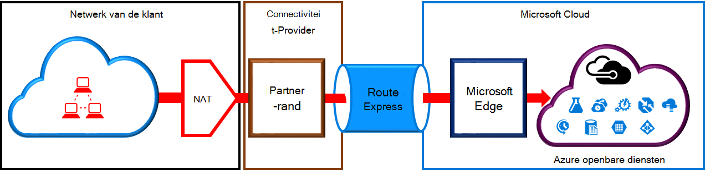
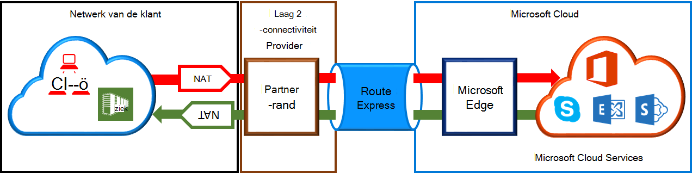

<properties
   pageTitle="Vereisten voor ExpressRoute circuits NAT | Microsoft Azure"
   description="Deze pagina bevat gedetailleerde vereisten voor het configureren en beheren van NAT voor ExpressRoute circuits."
   documentationCenter="na"
   services="expressroute"
   authors="cherylmc"
   manager="carmonm"
   editor=""/>
<tags
   ms.service="expressroute"
   ms.devlang="na"
   ms.topic="get-started-article"
   ms.tgt_pltfrm="na"
   ms.workload="infrastructure-services"
   ms.date="10/10/2016"
   ms.author="cherylmc"/>

# ExpressRoute NAT-vereisten

Als u wilt verbinding maken met Microsoft cloud services met behulp van ExpressRoute, moet u instellen en beheren van NAT-apparaten. Sommige providers connectiviteit aanbieden instellen en beheren van NAT als een beheerde service. Neem contact op met uw provider verbinding te zien als ze deze dienst aanbiedt. Als dit niet het geval is, u moet voldoen aan de vereisten die hieronder worden beschreven. 

Bekijk de pagina [ExpressRoute circuits en domeinen omleiden](expressroute-circuit-peerings.md) als u een overzicht van de verschillende domeinen van de routering. Om te voldoen aan openbare IP-adres voor openbare Azure en peering van Microsoft, is het raadzaam dat u NAT tussen uw netwerk en Microsoft instelt. Deze sectie bevat een gedetailleerde beschrijving van de NAT-infrastructuur die u moet instellen.

## Vereisten voor openbare peering Azure NAT

De Azure openbare peering pad kunt u verbinding maken met alle services die worden gehost in Azure via de openbare IP-adressen. Zoals vermeld in de [Veelgestelde vragen over ExpessRoute](expressroute-faqs.md) services en eventuele services die worden gehost door onafhankelijke softwareleveranciers op Microsoft Azure. Connectiviteit met Microsoft Azure services op openbare peering is altijd afkomstig van het netwerk in het Microsoft-netwerk. Verkeer dat bestemd is voor Microsoft Azure op openbare peering moet SNATed naar geldige openbare IPv4-adressen voordat ze het Microsoft-netwerk. In de volgende afbeelding geeft een hoog niveau beeld van hoe het NAT-apparaat kan worden ingesteld dat aan bovenstaande eis voldoen.

 

### IP NAT en de route-advertisements

U moet ervoor zorgen dat verkeer Azure openbare peering pad met geldige openbare IPv4-adres invoert. Microsoft moet kunnen verifiëren wie eigenaar is van de IPv4-NAT-adresgroep tegen een regionale routering Internet register (RIR) of een bewerkingsplan Internet-register (IR). Een controle wordt uitgevoerd op basis van het AS-nummer wordt met peered en de IP-adressen gebruikt voor het apparaat. Zie de pagina [ExpressRoute routering vereisten](expressroute-routing.md) voor meer informatie over routering registers.
 
Er zijn geen beperkingen voor de lengte van het NAT IP-voorvoegsel geadverteerd via deze peering. Als u de NAT-adresgroep bewaken en ervoor te zorgen dat u geen NAT sessies worden gezet.

>[AZURE.IMPORTANT] Het NAT IP-adresgroep die is geadverteerd naar Microsoft moet niet aangekondigd met het Internet. Dit wordt verbroken verbindingen met andere Microsoft-diensten.

## Vereisten voor Microsoft peering NAT

Het Microsoft peering pad kunt u verbinding maken met Microsoft cloud services die niet worden ondersteund door de Azure openbare peering pad. De lijst met services bevat Office 365-services, zoals Exchange Online, SharePoint Online, Skype voor Business en CRM Online. Microsoft verwacht voor de ondersteuning van bidirectionele verbinding op de peering van Microsoft. Verkeer dat bestemd is voor Microsoft cloud services moet SNATed naar geldige openbare IPv4-adressen voordat ze het Microsoft-netwerk. Verkeer dat bestemd is voor het netwerk van Microsoft cloud services moet zijn SNATed voordat ze uw netwerk binnenkomen. In de volgende afbeelding geeft een hoog beeld van hoe de NAT-instellingen voor Microsoft peering moet worden.
 
 

#### Verkeer dat afkomstig is uit het netwerk bestemd is voor Microsoft

- U moet ervoor zorgen dat verkeer het pad naar Microsoft peering met een geldig openbaar IPv4-adres invoert. Microsoft moet kunnen valideren van de eigenaar van de IPv4-NAT-adresgroep tegen de regionale routering internet register (RIR) of een bewerkingsplan internet-register (IR). Een controle wordt uitgevoerd op basis van het AS-nummer wordt met peered en de IP-adressen gebruikt voor het apparaat. Zie de pagina [ExpressRoute routering vereisten](expressroute-routing.md) voor meer informatie over routering registers.

- IP-adressen wordt gebruikt voor de Azure openbare peering setup en andere circuits ExpressRoute moeten niet aangekondigd aan Microsoft via het BGP-sessie. Er is geen beperking voor de lengte van het NAT IP-voorvoegsel geadverteerd via deze peering.

    >[AZURE.IMPORTANT] Het NAT IP-adresgroep die is geadverteerd naar Microsoft moet niet aangekondigd met het Internet. Dit wordt verbroken verbindingen met andere Microsoft-diensten.

#### Verkeer dat afkomstig is van Microsoft die bestemd is voor uw netwerk

- Bepaalde scenario's vereist is om verbinding met de service-endpoints in uw netwerk worden gehost. Een typisch voorbeeld van het scenario zou zijn verbindingen met AD FS-servers als host in het netwerk van Office 365. In dergelijke gevallen moet u passende voorvoegsels lekken uit uw netwerk in de peering van Microsoft. 

- U moet SNAT verkeer dat bestemd is voor IP-adressen binnen het netwerk van Microsoft. 

## Volgende stappen

- Raadpleeg de vereisten voor [Routering](expressroute-routing.md) en [QoS](expressroute-qos.md).
- Zie [ExpressRoute circuit inrichten van workflows en Staten circuit](expressroute-workflows.md)voor werkstroomgegevens.
- Configureer uw verbinding ExpressRoute.

    - [ExpressRoute circuits maken](expressroute-howto-circuit-classic.md)
    - [Routering configureren](expressroute-howto-routing-classic.md)
    - [Een VNet koppelen aan een ExpressRoute circuit](expressroute-howto-linkvnet-classic.md)

