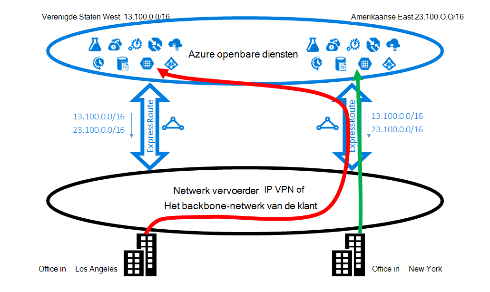
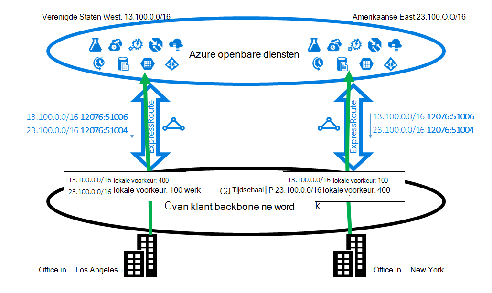
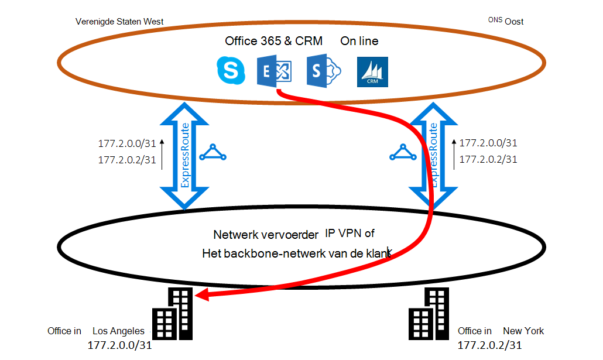
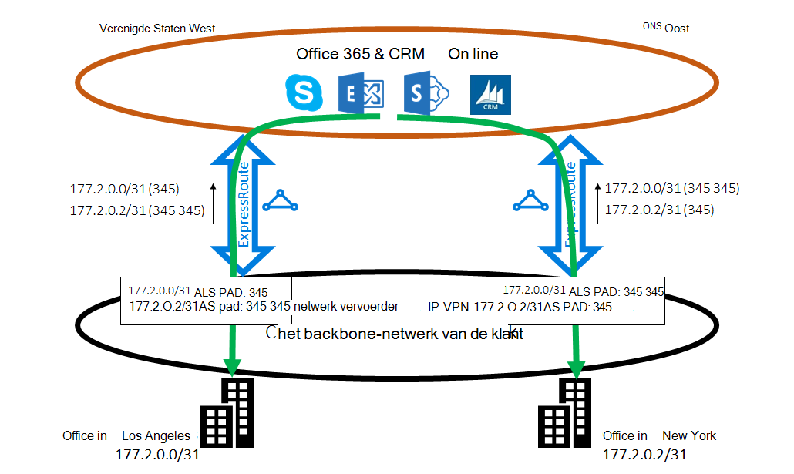

<properties
   pageTitle="ExpressRoute routering optimaliseren | Microsoft Azure"
   description="Deze pagina bevat informatie over het optimaliseren van routering wanneer een klant heeft meer dan één ExpressRoute circuits die verbinding tussen Microsoft en corp-netwerk van de klant."
   documentationCenter="na"
   services="expressroute"
   authors="charwen"
   manager="carmonm"
   editor=""/>
<tags
   ms.service="expressroute"
   ms.devlang="na"
   ms.topic="get-started-article"
   ms.tgt_pltfrm="na"
   ms.workload="infrastructure-services"
   ms.date="10/10/2016"
   ms.author="charwen"/>

# ExpressRoute routering optimaliseren
Wanneer er meerdere ExpressRoute circuits, hebt u meer dan één pad naar Microsoft. Hierdoor optimale routering kan gebeuren - dat wil zeggen, uw verkeer duurt een langer pad naar Microsoft en Microsoft om het netwerk te bereiken. Hoe langer het netwerkpad, hoe hoger de latentie. Latentie heeft directe invloed op de prestaties en ervaring van toepassing. In dit artikel wordt dit probleem illustreren en wordt uitgelegd hoe u een bewerkingsplan met behulp van de standaard routing technologieën optimaliseren.

## Niet-optimale routing voorbeeld 1
Laten we er op een probleem met de routering door een voorbeeld. Stel dat u hebt twee kantoren in de Verenigde Staten, een in Los Angeles en één in New York. De kantoren zijn aangesloten op een breed Area Network (WAN), uw eigen backbonenetwerk of uw serviceprovider IP VPN. U hebt twee ExpressRoute circuits, één in ons West en één in ons East, die ook zijn aangesloten op het WAN. Uiteraard hebt u twee paden verbinding maken met het Microsoft-netwerk. Nu Stel u Azure-implementatie (bijvoorbeeld Azure App Service) in ons Oost en West ons hebt. Uw bedoeling is verbinding maken met uw gebruikers in Los Angeles Azure ons West en uw gebruikers in New York naar Azure ons East omdat de service admin adverteert dat gebruikers van elke office-toegang de nabijgelegen Azure services voor een optimale ervaring tot. Helaas, het plan werkt goed voor de oostkust gebruikers, maar niet voor de gebruikers van de westkust. De oorzaak van het probleem is het volgende. Op elk circuit ExpressRoute adverteren we voor u zowel het voorvoegsel in Azure ons Oost (23.100.0.0/16) en het voorvoegsel in Azure ons West (13.100.0.0/16). Als u niet welk voorvoegsel uit welke regio is weet, bent u niet anders toepassen. Uw WAN-netwerk kan concluderen beide de voorvoegsels zijn dichter bij ons Oost dan ons West en daarom zowel office-gebruikers te routeren naar het circuit ExpressRoute in ons East. Uiteindelijk hebt u veel ontevreden gebruikers in het kantoor van Los Angeles.

### Oplossing: gebruik BGP gemeenschappen
Als wilt optimaliseren voor zowel office-gebruikers, moet u weten welk voorvoegsel van Azure ons West en die afkomstig is van Azure ons Oost. Wij coderen deze gegevens met behulp van [de Gemeenschap BGP waarden](expressroute-routing.md). We hebt een unieke waarde voor de Gemeenschap BGP toegewezen aan elke Azure regio, bijvoorbeeld voor ons Oost ' 12076:51004', '12076:51006' voor ons West. Als u weet welke voorvoegsel uit welke regio Azure is, kunt u configureren welke ExpressRoute circuit voorkeur moet worden. Omdat exchange routing info we het BGP gebruiken, kunt u lokale voorkeur BGP van invloed op de routering. In ons voorbeeld, kunt u een hogere voorkeurswaarde van de lokale voor 13.100.0.0/16 in ons West dan in ons East en zo een hogere voorkeurswaarde voor de lokale toewijzen aan 23.100.0.0/16 in ons East dan in ons West. Deze configuratie ervoor dat, wanneer beide paden naar Microsoft beschikbaar zijn, de gebruikers in Los Angeles het circuit ExpressRoute in ons verbinding maken met Azure ons West duurt dat uw gebruikers in New York de ExpressRoute in ons Oost naar Azure ons Oost worden West. Aan beide zijden wordt routering geoptimaliseerd. 

## Niet-optimale routing voorbeeld 2
Hier is een ander voorbeeld waarbij verbindingen van Microsoft krijgen een langer pad om uw netwerk te bereiken. In dit geval gebruikt u op ruimten Exchange servers en Exchange Online in een [hybride omgeving](https://technet.microsoft.com/library/jj200581%28v=exchg.150%29.aspx). De kantoren zijn verbonden met een WAN. De voorvoegsels van uw servers op gebouwen in beide uw kantoren aan Microsoft via de twee ExpressRoute circuits worden geadverteerd. Exchange Online initiëren verbindingen met de servers op gebouwen in dergelijke gevallen postbussen migreren. Helaas, de verbinding met uw kantoor in Los Angeles wordt doorgestuurd naar het circuit ExpressRoute in ons East vóór het doorlopen van het hele continent terug naar de westkust. De oorzaak van het probleem lijkt op het eerste item. Het Microsoft-netwerk kan niet zonder een aanwijzing zien welke klant voorvoegsel dicht bij ons Oost is en welke dicht bij ons West. Dit gebeurt op het verkeerde pad kiezen met uw kantoor in Los Angeles.

### Oplossing: gebruik als pad prepending
Er zijn twee oplossingen voor het probleem. De eerste is dat u het voorvoegsel op gebouwen te voor uw kantoor in Los Angeles, 177.2.0.0/31 op het circuit ExpressRoute in ons West adverteren en uw locatie op voor het kantoor in New York, 177.2.0.2/31 op het circuit ExpressRoute in ons Oost-voorvoegsel. Hierdoor is er slechts één pad voor Microsoft voor de verbinding met het kantoor. Er is geen dubbelzinnigheid en routering wordt geoptimaliseerd. Met dit ontwerp moet u denken aan uw failover-strategie. In het geval dat het pad naar Microsoft via ExpressRoute verbroken wordt, moet u om ervoor te zorgen dat Exchange Online wel verbinding met uw servers op gebouwen maken kunnen. 

De tweede oplossing is dat u voor het adverteren van de voorvoegsels van beide circuits ExpressRoute blijven en bovendien geeft u ons een tip van welk voorvoegsel waarvoor een van de kantoren lijkt. Omdat we BGP als pad prepending ondersteunt, kunt u het pad als voor het voorvoegsel beïnvloeden van routering configureren. U kunt in dit voorbeeld wordt het pad als voor de 172.2.0.0/31 in ons East verlengen zodat we zullen geven de voorkeur aan het circuit ExpressRoute in ons West voor verkeer dat bestemd is voor dit voorvoegsel (zoals ons netwerk denkt het pad naar dit voorvoegsel korter in het westen dat wordt). U kunt ook het pad als voor de 172.2.0.2/31 in ons West verlengen zodat we het circuit ExpressRoute in ons Oost gaat liever. Routering wordt geoptimaliseerd voor beide kantoren. Met dit ontwerp als één ExpressRoute circuit verbroken wordt, Exchange Online nog steeds bereikbaar via een andere ExpressRoute circuit en het WAN. 

>[AZURE.IMPORTANT] We verwijderen persoonlijke als getallen in het pad als voor de prefixen die op Microsoft Peering ontvangen. U wilt toevoegen als getallen in het AS pad naar het bewerkingsplan voor Microsoft Peering van invloed zijn op openbare.

>[AZURE.IMPORTANT] De hier gegeven voorbeelden zijn Microsoft en openbare peerings, ondersteunen we dezelfde mogelijkheden voor Private peering. Het pad als prepending werkt ook, binnen één enkele ExpressRoute circuit, met invloed op de selectie van de primaire en secundaire paden.
