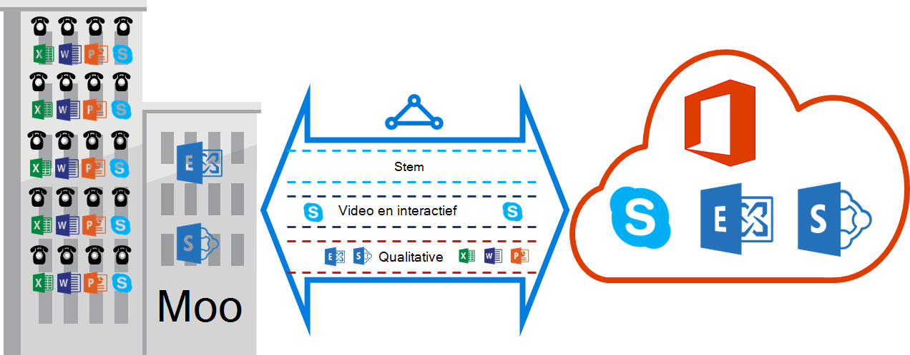

<properties
   pageTitle="QoS-vereisten voor ExpressRoute | Microsoft Azure"
   description="Deze pagina bevat gedetailleerde vereisten voor het configureren en beheren van QoS voor ExpressRoute circuits."
   documentationCenter="na"
   services="expressroute"
   authors="cherylmc"
   manager="carmonm"
   editor=""/>
<tags
   ms.service="expressroute"
   ms.devlang="na"
   ms.topic="get-started-article"
   ms.tgt_pltfrm="na"
   ms.workload="infrastructure-services"
   ms.date="10/10/2016"
   ms.author="cherylmc"/>

# ExpressRoute QoS-vereisten

Skype voor bedrijven heeft verschillende werkbelastingen waarvoor een gedifferentieerde behandeling voor QoS. Als u van plan bent voor het gebruik van voice diensten via ExpressRoute, moet u voldoen aan de vereisten die hieronder wordt beschreven.

>[AZURE.NOTE] QoS-vereisten zijn van toepassing op de peering alleen Microsoft. De DSCP-waarden in uw al het ontvangen netwerkverkeer op openbare peering Azure en Azure private peering worden ingesteld op 0. 

De volgende tabel bevat een lijst met DSCP-markeringen gebruikt door Skype voor bedrijven. Raadpleeg de [QoS voor Skype voor bedrijven beheren](https://technet.microsoft.com/library/gg405409.aspx) voor meer informatie.

| **Verkeer-klasse** | **Behandeling (DSCP-markering)** | **Skype voor Business werkbelasting** |
|---|---|---|
| **Stem** | EF (46) | Skype / Lync voice |
| **Interactieve** | AF41 (34) | Video |
|   | AF21 (18) | Toepassingen delen | 
| **Standaard** | AF11 (10) | Bestandsoverdracht|
|   | CS0 (0) | Nog iets| 

- U moet de werkbelasting classificeren en markeer de juiste DSCP-waarden. Volg de richtlijnen [hier](https://technet.microsoft.com/library/gg405409.aspx) over het instellen van DSCP-markeringen in het netwerk.

- U moet configureren en meerdere wachtrijen met QoS-ondersteuning in uw netwerk. Stem moet een klasse zijn zelfstandige en de behandeling EF is opgegeven in RFC 3246 ontvangen. 

- U kunt de wachtrijmechanisme, bandbreedte toewijzen per klasse van verkeer en congestie detectie beleid bepalen. Maar de DSCP-markering voor Skype voor Business werklast moet worden bewaard. Als u werkt met DSCP-markeringen niet wordt weergegeven, bijvoorbeeld AF31 (26), moet u deze DSCP-waarde op 0 herschrijven voordat het pakket wordt verzonden naar Microsoft. Microsoft stuurt alleen pakketten met DSCP-waarde weergegeven in de bovenstaande tabel is gemarkeerd. 

## Volgende stappen

- Raadpleeg de vereisten voor [Routering](expressroute-routing.md) en [NAT](expressroute-nat.md).
- Zie de volgende koppelingen voor het configureren van uw verbinding ExpressRoute.

    - [ExpressRoute circuits maken](expressroute-howto-circuit-classic.md)
    - [Routering configureren](expressroute-howto-routing-classic.md)
    - [Een VNet koppelen aan een ExpressRoute circuit](expressroute-howto-linkvnet-classic.md)
