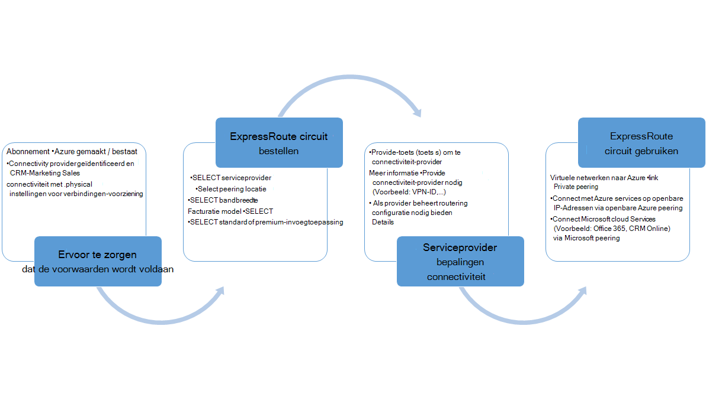

<properties
   pageTitle="Werkstromen voor het configureren van een circuit ExpressRoute | Microsoft Azure"
   description="Deze pagina helpt u bij de werkstromen voor het configureren van ExpressRoute circuit en peerings"
   documentationCenter="na"
   services="expressroute"
   authors="cherylmc"
   manager="carmonm"
   editor="" />
<tags
   ms.service="expressroute"
   ms.devlang="na"
   ms.topic="article" 
   ms.tgt_pltfrm="na"
   ms.workload="infrastructure-services"
   ms.date="10/10/2016"
   ms.author="cherylmc"/>

# ExpressRoute workflows voor circuit inrichten en Staten circuit

Deze pagina helpt u bij de service ingericht en configuratie van werkstromen voor circulatie op een hoog niveau.

De volgende afbeelding en bijbehorende stappen tonen de taken die u volgen moet om een ExpressRoute circuit ingericht end-to-end. 

1. Gebruik PowerShell om een ExpressRoute-circuit configureren. Volg de instructies in het artikel [circuits ExpressRoute maken](expressroute-howto-circuit-classic.md) voor meer informatie.

2. Connectiviteit van de volgorde van de serviceprovider. Dit proces verschilt. Neem contact op met uw provider verbinding voor meer informatie over het bestellen van connectiviteit.

3. Zorg ervoor dat het circuit is ingericht met succes door te controleren of de inrichting staat via PowerShell ExpressRoute-circuit. 

4. Routering domeinen te configureren. Als uw provider verbinding Layer 3 u beheerde configureert deze routering voor het circuit. Als uw provider verbinding alleen Layer 2-services biedt, moet u per richtlijnen beschreven op de pagina's voor [Routering van vereisten](expressroute-routing.md) en de [configuratie van routering](expressroute-howto-routing-classic.md) is routering.

    -  Enable private peering Azure - moet u deze peering verbinding maken met VMs / cloud services geïmplementeerd binnen de virtuele netwerken inschakelen.
    -  Enable Azure openbare peering - u moet inschakelen Azure openbare peering als u wilt verbinding maken met Azure services die worden gehost op openbare IP-adressen. Dit is een vereiste voor toegang tot bronnen Azure hebt u de standaardroutering voor Azure private peering inschakelen.
    -  Schakel Microsoft peering - moet u dit inschakelen op access Office 365 en CRM on line services. 
    
    >[AZURE.IMPORTANT] U moet ervoor zorgen dat u een aparte proxy gebruiken / edge verbinding maken met Microsoft dan de versie die u gebruikt voor het Internet. Met behulp van de rand voor het Internet en ExpressRoute veroorzaken asymmetrische Routering en veroorzaken storingen connectiviteit voor uw netwerk.

    

5. Virtuele netwerken koppelen aan circuits ExpressRoute - kunt u virtuele netwerken koppelen aan uw ExpressRoute circuit. Volg de instructies [voor het koppelen van VNets](expressroute-howto-linkvnet-arm.md) naar het circuit. Deze VNets kan kan zijn in het abonnement op Azure hetzelfde als het circuit ExpressRoute, of in een ander abonnement.

## ExpressRoute circuit Staten inrichten

Elk circuit ExpressRoute heeft twee statussen:

- Status van serviceprovider inrichten
- Status

Status vertegenwoordigt van Microsoft provisioning staat. Deze eigenschap is ingesteld op ingeschakeld wanneer u een circuit Expressroute maken

De inrichting staat voor connectiviteit provider vertegenwoordigt de staat aan de kant van de provider van de verbinding. Het kan zijn van *NotProvisioned*, *creëren*of *Provisioned*. Het circuit ExpressRoute moet in staat Provisioned te kunnen gebruiken.

### Mogelijke statussen van een circuit ExpressRoute

In deze sectie geeft een overzicht van de mogelijke statuswaarden voor een ExpressRoute circuit.

#### Bij het maken

Ziet u het ExpressRoute circuit in de volgende status als u het circuit ExpressRoute maken de PowerShell-cmdlet uitvoert.

    ServiceProviderProvisioningState : NotProvisioned
    Status                           : Enabled

#### Wanneer de provider van connectivity is bij het inrichten van het circuit

Ziet u het ExpressRoute circuit in de volgende staat als u de sleutel aan de provider van connectivity doorgeven en hebben ze het inrichtingsproces gestart.

    ServiceProviderProvisioningState : Provisioning
    Status                           : Enabled

#### Wanneer de provider verbinding tijdens het inrichtingsproces is voltooid

Ziet u het ExpressRoute circuit in de volgende staat als de provider verbinding tijdens het inrichtingsproces is voltooid.

    ServiceProviderProvisioningState : Provisioned
    Status                           : Enabled

Ingericht en ingeschakeld is de enige staat het circuit in te kunnen gebruiken. Als u een Layer 2-provider gebruikt, kunt u routering voor het circuit alleen wanneer in deze staat.

#### Wanneer de provider van connectivity het circuit is deprovisioning

Als u de serviceprovider naar het circuit ExpressRoute deprovision aangevraagd, ziet u het circuit is ingesteld op de volgende status als de serviceprovider het deprovisioning proces is voltooid.

    ServiceProviderProvisioningState : NotProvisioned
    Status                           : Enabled

U kunt opnieuw inschakelen als nodig is, of het uitvoeren van PowerShell-cmdlets voor het verwijderen van het circuit.  

>[AZURE.IMPORTANT] U voert de PowerShell-cmdlet om het circuit als het inrichten van de ServiceProviderProvisioningState of Provisioned, de bewerking mislukt te verwijderen. Neem met uw provider verbinding naar het circuit ExpressRoute eerst deprovision werken en verwijder vervolgens het circuit. Microsoft blijft het circuit factureren totdat u het verwijderen van het circuit de PowerShell-cmdlet uitvoert.

## Configuratie van routering sessiestatus

De inrichting staat BGP laat u weten als de sessie BGP is ingeschakeld op de rand van Microsoft. De staat moet u mogelijk de peering gebruiken zijn ingeschakeld.

Het is belangrijk dat de sessiestatus BGP vooral voor Microsoft peering controleren. Naast het BGP-aanbod staat, een andere provincie is *geadverteerd openbare voorvoegsels staat*genoemd. De aangekondigde openbare voorvoegsels staat moet niet *geconfigureerd* , zowel voor de sessie van BGP als het rondsturen werkt end-to-end. 

Als de geadverteerde prefix voor openbare status is ingesteld op een *validatie vereist* staat, is het BGP-sessie niet ingeschakeld, zoals de aangekondigde voorvoegsels komt niet overeen met het nummer van de AS in een van de registers van het bewerkingsplan. 

>[AZURE.IMPORTANT] Als de status van aangekondigde openbare voorvoegsels in staat *handmatig validatie* , u een support ticket openen met [Microsoft support](https://portal.azure.com/?#blade/Microsoft_Azure_Support/HelpAndSupportBlade) en bewijs leveren dat u de eigenaar van de IP-adressen langs geadverteerd met het nummer van de bijbehorende autonoom systeem.

## Volgende stappen

- Configureer uw verbinding ExpressRoute.

    - [ExpressRoute circuits maken](expressroute-howto-circuit-arm.md)
    - [Routering configureren](expressroute-howto-routing-arm.md)
    - [Een VNet koppelen aan een ExpressRoute circuit](expressroute-howto-linkvnet-arm.md)
