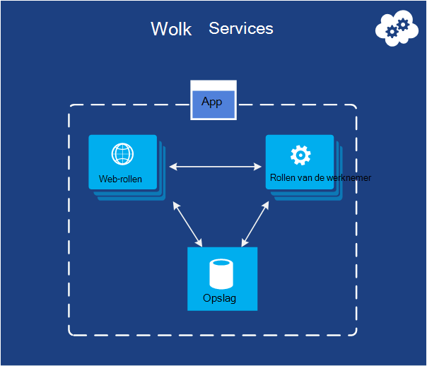
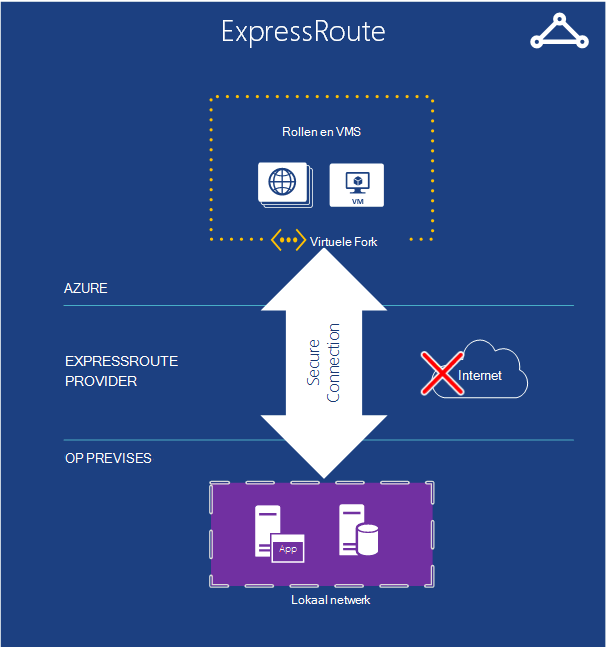
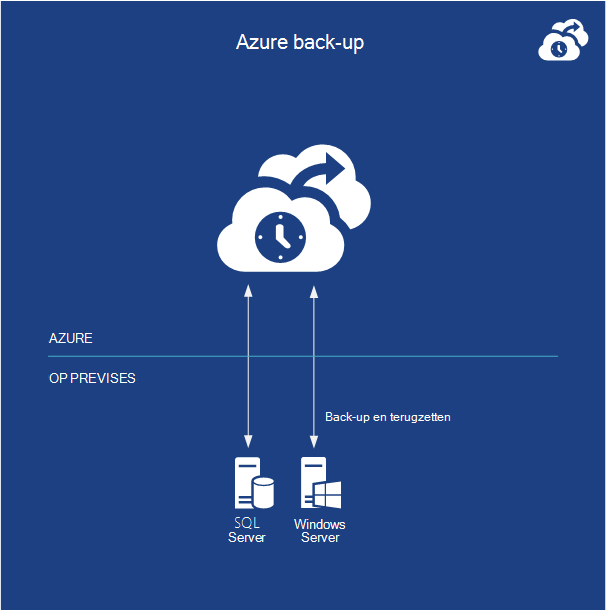

<properties
    pageTitle="Inleiding tot Microsoft Azure | Microsoft Azure"
    description="Nieuw in Microsoft Azure? Een eenvoudig overzicht van de services biedt met voorbeelden van hoe ze nuttig zijn."
    services=" "
    documentationCenter=".net"
    authors="rboucher"
    manager="carolz"
    editor=""/>

<tags
    ms.service="multiple"
    ms.workload="multiple"
    ms.tgt_pltfrm="na"
    ms.devlang="na"
    ms.topic="article"
    ms.date="06/30/2015"  
    ms.author="robb"/>

# Kennismaking met Microsoft Azure

Microsoft Azure is van Microsoft application platform voor de openbare cloud.  Het doel van dit artikel is geeft u een basis voor inzicht in de basisprincipes van Azure, zelfs als u niet over cloud weet computing.

**In dit artikel lezen**

Azure is voortdurend groeiende zodat u gemakkelijk naar overbelast raakt.  Beginnen met de basisservices die bovenaan in dit artikel en ga vervolgens naar extra services. Dat betekent niet dat u niet alleen de extra services zelf gebruiken, maar de basisservices vormen de kern van een toepassing wordt uitgevoerd in Azure.

**Feedback geven**

Uw feedback is belangrijk. Dit artikel geeft u een effectieve overzicht van Azure. Als dit niet het geval is, ons in de sectie opmerkingen onderaan de pagina. Geef enkele details over wat u verwacht te zien en het verbeteren van het artikel.  

## De onderdelen van Azure

Azure services worden gegroepeerd in categorieën in de Portal beheren en op verschillende visuele hulpmiddelen zoals de [Wat Is Azure Infographic](https://azure.microsoft.com/documentation/infographics/azure/) . De Portal Management wordt gebruikt voor het beheren van services voor de meeste (maar niet alle) in Azure.

In dit artikel gebruikt een **andere organisatie** te praten over de services die zijn gebaseerd op een vergelijkbare functie, en om belangrijke onderliggende services die deel van grotere bestanden uitmaken.  

   
 *Afbeelding: Azure biedt Internet toegankelijk toepassing uitgevoerd in Azure datacenters.*

## Beheerportal
Azure is een web-interface [Management Portal](http://manage.windowsazure.com) kunnen beheerders de toegang tot en beheer van meest, maar niet alle functies van Azure genoemd.  Microsoft brengt meestal de nieuwere UI portal in Bèta voor het intrekken van een ouder. De nieuwere versie wordt de ["Azure Preview Portal"](https://portal.azure.com/)genoemd.

Er is meestal een lange overlappen wanneer beide portals actief zijn. Terwijl core services wordt weergegeven in beide portals, mogelijk niet alle functionaliteit beschikbaar in beide zijn. Nieuwe services worden weergegeven in de nieuwere portal services eerste en ouder en functionaliteit kan alleen bestaan in de oudere versie.  Het bericht hier is dat als u iets niet in de oudere portal vinden controleert u de nieuwere versie en vice versa.

## Berekenen

Een van de belangrijkste dingen een cloud-platform is is toepassingen uitvoeren. Elk van de modellen Azure compute heeft zijn eigen rol te spelen.

U kunt deze technologieën afzonderlijk gebruiken of combineren wanneer dat nodig is voor het maken van de juiste basis voor uw toepassing. De aanpak die u kiest, hangt af van welke problemen u probeert op te lossen.

### Azure virtuele Machines

   
*Cijfer: Azure virtuele Machines geeft u volledige controle over de virtuele machine exemplaren in de cloud.*

De mogelijkheid voor het maken van een virtuele machine op de vraag, of van een standaard-installatiekopie of een die u opgeeft, kan zeer nuttig zijn. Deze aanpak, ook wel bekend als infrastructuur als Service (IaaS), is wat Azure virtuele Machines biedt. Figuur 2 toont een combinatie van hoe een virtuele Machine (VM) wordt uitgevoerd en het maken van een VHD.  

Maakt een VM, u moet opgeven welke VHD te gebruiken en de grootte van de VM.  Vervolgens betaalt u voor de tijd waarop de VM wordt uitgevoerd. Betaalt u per minuut en alleen terwijl deze wordt uitgevoerd, maar er een minimale opslag toeslag is voor de VHD beschikbaar te houden. Azure biedt een galerie van VHD's ("afbeeldingen" genoemd) met een opstartbaar besturingssysteem starten vanuit voorraad. Deze bevatten Microsoft en haar partners opties, zoals Windows Server en Linux, SQL Server, Oracle en nog veel meer. U bent vrij te maken van VHD's en afbeeldingen en vervolgens uploaden zelf. U kunt ook VHD's die alleen gegevens bevatten en er toegang toe in uw actieve VMs uploaden.

Waar de VHD afkomstig van is, kunt u eventuele wijzigingen tijdens het uitvoeren van een VM permanent opslaan. De volgende keer dat u een VM van VHD die maken oppakken dingen waar u gebleven was. De VHD's die back-de virtuele Machines worden opgeslagen in opslag Azure BLOB's, die we later over praten.  Dit betekent dat u redundantie zodat uw VMs won't verdwijnen als gevolg van hardware- en fouten ophalen. Het is ook mogelijk om de gewijzigde VHD van Azure kopiëren en vervolgens lokaal uitgevoerd.

Uw toepassing wordt uitgevoerd in een of meer virtuele Machines, anders hoe u hebt gemaakt voordat u besluit nu helemaal te maken.

Deze vrij algemeen benadering van cloud computing kan worden gebruikt om diverse problemen.

**Scenario's voor virtuele Machine**

1.  **Dev/Test** - u kunt ze gebruiken voor het maken van een goedkope ontwikkeling en test platform dat u af sluiten te wanneer u klaar bent met het. U kan ook maken en uitvoeren van toepassingen die alle talen en bibliotheken die u wilt gebruiken. Deze toepassingen kunnen u elk van de opties voor gegevens die Azure en u kunt ook gebruik van SQL Server of een ander DBMS, uitgevoerd in een of meer virtuele machines.
2.  **Toepassingen verplaatsen naar Azure (Lift-en-ploeg)** - "Lift-en-shift-verwijst naar de toepassing veel verplaatsen zoals u een vorkheftruck gebruiken zou om een groot object te verplaatsen.  U "tilt" de VHD vanuit uw lokale datacenter en 'shift' het naar Azure en er uit te voeren.  Normaal moet werken om te verwijderen van afhankelijkheden op andere systemen. Als er te veel, kan u optie 3 kiezen.  
3.  **Uitbreiden van uw Datacenter** - gebruik Azure VMs als uitbreiding van uw datacenter in ruimten met SharePoint of andere toepassingen. Daarom is het mogelijk te maken van Windows-domeinen in de cloud met behulp van Active Directory in Azure VMs. Azure Virtual Network (hoger vermelde) kunt u het lokale netwerk en het netwerk in Azure met elkaar verbinden.

### Web Apps

   
 *Afbeelding: Azure Web Apps een website-toepassing uitvoert in de cloud zonder de onderliggende webserver beheren.*

Een van de meest voorkomende dingen die mensen doen in de cloud wordt websites en webtoepassingen uitgevoerd. Azure virtuele Machines dit toestaat, maar nog steeds laat u met de verantwoordelijkheid van een of meer VMs en het onderliggende besturingssysteem beheren. Cloud services web rollen dit kunnen doen, maar implementeren en onderhouden van steeds administratief werk duurt.  Wat gebeurt er als u gewoon wilt een website waar iemand anders zorgt voor het administratieve werk voor u?

Dit is precies wat Web Apps biedt. Dit model compute biedt een web beheerde omgeving met behulp van de portal Management Azure als API's. Een bestaande website toepassing kunt verplaatsen naar Web Apps niet gewijzigd of kunt u een nieuw rechtstreeks in de cloud. Zodra een website wordt uitgevoerd, kunt u toevoegen of verwijder instanties dynamisch, vertrouwen op Azure Web Apps laden aanvragen over deze. Azure Apps biedt zowel een gedeelde opties, waar uw website wordt uitgevoerd op een virtuele machine met andere sites, en een standaard waarmee een site uit te voeren in een eigen VM. De standaard optie kunt u ook vergroten (rekenkracht) van uw instanties indien nodig.

Voor de ontwikkeling, Web Apps biedt ondersteuning voor .NET, PHP, Node.js, Java en Python en SQL-Database en MySQL (van ClearDB, een Microsoft-partner) voor de relationele opslag. Het biedt ook ingebouwde ondersteuning voor verschillende populaire toepassingen, waaronder WordPress, Joomla en Drupal. Het doel is om een betaalbare, schaalbare en grotendeels nuttig platform bieden voor het maken van websites en webtoepassingen in de openbare cloud.

**Web Apps-scenario 's**

Web Apps is nuttig voor bedrijven, ontwikkelaars en web ontwerp-agentschappen bedoeld. Het is een eenvoudig te beheren, schaalbare, zeer veilige en hoge beschikbaarheid-oplossing voor het uitvoeren van aanwezigheid websites voor bedrijven. Wanneer u voor het instellen van een Website, is het beste beginnen met Azure Web Apps en gaat u verder met de Cloud Services wanneer moet u een functie die niet beschikbaar is. Zie het einde van de sectie 'Berekenen' voor meer koppelingen waarmee u kunt kiezen tussen de opties.

### Cloud Services
   
*Afbeelding: Azure Cloud Services vormt een zeer schaalbare, aangepaste code uitvoeren op een Platform als een Service (PaaS)-omgeving*

Stel dat u wilt maken van een wolk toepassing die een groot aantal gelijktijdige gebruikers kan ondersteunen, hoeft niet veel beheer en nooit uitvalt. Mogelijk is een gevestigde softwareleverancier bijvoorbeeld die heeft besloten om in te spelen Software als Service (SaaS) door een versie van een van uw toepassingen in de cloud. Of u kunt een start maken van de toepassing van een consument die verwacht wordt snel groeien. Als u op Azure maakt, welk model uitvoering moet u gebruiken?

Azure Web Apps kunnen maken van dit soort webtoepassing, maar er zijn enkele beperkingen. U hebt geen beheerderstoegang, bijvoorbeeld, wat betekent dat u willekeurige software niet installeren. Azure virtuele Machines kunt u veel flexibiliteit, met inbegrip van beheerdersrechten, en natuurlijk kunt u een zeer schaalbare toepassingen bouwen, maar hebt u voor het verwerken van vele aspecten van de betrouwbaarheid en beheer. U wilt dat is een optie waarmee u het besturingselement dat u nodig hebt maar ook voert het grootste deel van het werk dat nodig is voor de betrouwbaarheid en beheer.

Dit is precies wat wordt geleverd door Azure Cloud Services. Deze technologie is expliciet ontworpen ter ondersteuning van schaalbare en betrouwbare en lage admin toepassingen en deze van een voorbeeld van wat is genoemd Platform als Service (PaaS). U kunt u een toepassing maken met de technologie die u, zoals C#, Java, PHP, Python, Node.js of iets anders kiest. De code vervolgens in virtuele machines (hierna aangeduid als exemplaren) wordt uitgevoerd met een versie van Windows Server.

Maar deze VMs zijn te onderscheiden van die u met Azure virtuele Machines maakt. Voor één ding, Azure zelf beheert ze doen zaken als operating systeempatches installeren en automatisch nieuwe rolt afbeeldingen hersteld. Dit betekent dat uw toepassing niet moet behouden staat in de web- of werknemer rol gevallen blijft; Deze moeten in plaats daarvan in een van de opties voor Azure gegevens in de volgende sectie wordt beschreven. Azure houdt ook toezicht op deze VMs, opnieuw een die is mislukt. U kunt instellen dat cloud-services automatisch meer of minder exemplaren maken in reactie op de vraag. Hiermee kunt u toegenomen gebruik worden verwerkt en vervolgens weer zodat u zo veel mogelijk worden niet betalen als er minder gebruik te schalen.

U hebt twee rollen te kiezen wanneer u een exemplaar maakt, zowel op basis van Windows Server. Het belangrijkste verschil tussen de twee is dat een exemplaar van een web-functie wordt uitgevoerd IIS, maar niet door een instantie van de rol van een werknemer. Beide op dezelfde wijze worden beheerd, en het is gebruikelijk om een toepassing te gebruiken. Een exemplaar van de rol van web kan bijvoorbeeld aanvragen van gebruikers te accepteren en vervolgens aan een exemplaar van de rol van werknemer voor verwerking door te geven. Als u wilt uw toepassing schalen omhoog of omlaag, kunt u dat Azure meer exemplaren van een rol maken of bestaande exemplaren afgesloten aanvragen. En net als Azure virtuele Machines, u bent betalen alleen voor de tijd dat elke website of werknemer rol is gestart.

**Cloud Services-scenario 's**

Cloud-Services zijn ideaal voor de ondersteuning van massale schaal uit als u nodig hebt u meer controle over het platform dan door Azure Web Apps, maar geen controle over het onderliggende besturingssysteem hoeft.

#### Een Compute Model kiezen
De pagina [Web-Apps Azure, Cloud Services en vergelijking van virtuele Machines](./app-service-web/choose-web-site-cloud-service-vm.md) bevat meer gedetailleerde informatie over het kiezen van een Compute model.

## Gegevensbeheer

Toepassingen moeten gegevens en verschillende soorten toepassingen moeten verschillende soorten gegevens. Azure biedt daarom op verschillende manieren opslaan en beheren van gegevens. Azure biedt veel opties voor opslag, maar alle zijn ontworpen voor zeer duurzame opslag.  Met een van de volgende opties zijn altijd 3 exemplaren van uw gegevens gesynchroniseerd via een Azure datacenter--6 als u toestaat dat Azure geo-redundantie met back-up op een ander datacenter ten minste 300 mijl weg.     

### In virtuele Machines
De mogelijkheid voor het uitvoeren van SQL Server of een ander DBMS in een VM met Azure virtuele Machines gemaakt is al vermeld. Realiseert zich dat deze optie is niet beperkt tot relationele systemen; bent u ook gratis NoSQL technologieën zoals MongoDB en Cassandra uitvoeren. Eenvoudige it-replicaties uitvoeren van uw eigen database is wat we gebruikt om in onze eigen datacenters- maar ook vereist verwerking van het beheer van die DBMS.  Azure verwerkt in de andere opties, meer of alle van de administratie voor u.

Nogmaals, de status van de virtuele Machine en eventuele aanvullende gegevensschijf u maakt of uploadt worden ondersteund door de blob-opslag (die we later over praten).  

### Azure SQL-Database
   

*Afbeelding: Azure SQL-Database biedt beheerde relationele database in de cloud.*

Azure biedt voor relationele opslag, de functie SQL-Database. Laat niet de naamgeving verkijk u. Dit is anders dan een standaard SQL-Database die door SQL Server wordt uitgevoerd op Windows Server.  

Voorheen SQL Azure, vindt Azure SQL-Database u alle belangrijke functies van een relationele database management systeem, inclusief atomische transacties gelijktijdige gegevenstoegang door meerdere gebruikers met de integriteit van de ANSI SQL-query's en een bekend programmeermodel. Access technologieën zoals SQL Server, SQL-Database kan worden benaderd met entiteit-Framework, ADO.NET, JDBC en andere bekende gegevens. Het ondersteunt ook de meeste van de T-SQL-taal, en SQL Server-hulpprogramma's zoals SQL Server Management Studio. Voor iedereen vertrouwd bent met SQL Server (of een andere relationele database), met behulp van SQL-Database is eenvoudig.

Maar de SQL-Database is niet alleen een DBMS in de cloud-it de PaaS-service. U nog steeds uw gegevens beheren en wie toegang heeft tot deze, maar SQL-Database zorgt voor de administratieve grunt werk, zoals het beheren van de infrastructuur van de hardware en de software en het besturingssysteem automatisch up-to-date houden. SQL-Database maakt tevens maximale beschikbaarheid, automatische back-ups, point-in-time herstelmogelijkheden en kopieën kunnen worden gerepliceerd tussen de geografische regio's.  

**Scenario's voor SQL-Database**

Als u een Azure-toepassing (met behulp van de compute-modellen) die relationele opslag maakt, kan de SQL-Database een goede optie zijn. Toepassingen die worden uitgevoerd buiten de cloud ook kunt deze service, dus er tal van andere scenario's zijn. Bijvoorbeeld gegevens die zijn opgeslagen in een SQL-Database toegankelijk is vanuit verschillende clientsystemen, waaronder desktops, laptops, tablets en telefoons. En omdat hiermee de ingebouwde hoge beschikbaarheid door middel van replicatie, SQL-Database via helpt uitvaltijd te minimaliseren.

### Tabellen
  

*Afbeelding: Azure tabellen kunt u platte NoSQL gegevens op te slaan.*

Deze functie wordt soms andere termen als onderdeel van een grotere functie met de naam 'Azure Storage' genoemd. Als u 'tabellen', 'Azure tabellen' of 'opslag tabellen' ziet, is het hetzelfde is.  

En niet worden verward met de naam: deze technologie biedt niet de relationele opslag. In feite is een voorbeeld van een NoSQL aanpak die een sleutel/waarde-archief genoemd. Azure tabellen kunnen een toepassing die de eigenschappen van verschillende typen, zoals tekenreeksen, gehele getallen en datums worden opgeslagen. Een toepassing kan een groep eigenschappen vervolgens ophalen door middel van een unieke sleutel voor die groep. Als u complexe bewerkingen zoals joins worden niet ondersteund, tabellen bieden snelle toegang tot getypte gegevens. Ze zijn ook zeer schaalbare, met een enkele tabel kunnen veel een terabyte aan gegevens bevatten. En de aanpassing van hun eenvoud, tabellen zijn gewoonlijk minder duur dan relationele SQL-Database-opslag.

**Scenario's voor tabellen**

Stel dat u wilt maken een Azure-toepassing die snelle toegang tot gegevens typt misschien heel wat, maar hoeft niet te complexe SQL-query's uitvoeren op deze gegevens. Stel bijvoorbeeld dat u maakt de toepassing van een consument die nodig zijn voor het opslaan van klantgegevens-profiel voor elke gebruiker. De app is het verstandig om zeer populair, dus moet u voor veel gegevens toestaan, maar u u niet veel met deze gegevens na het opslaan hebt, ophalen van deze vervolgens op eenvoudige manieren. Dit is precies het soort scenario waar Azure tabellen zinvol is.

### BLOB 's
    
*Afbeelding: Azure BLOB's biedt ongestructureerde binaire gegevens.*  

Azure BLOB's (opnieuw 'Blob Storage' en gewoon "Storage Blobs" zijn hetzelfde) is ontworpen voor het opslaan van binaire gegevens ongestructureerde. Net als bij tabellen BLOB's biedt goedkope opslag en een enkele blob kan 1TB (terabyte één) zijn. Azure toepassingen kunnen ook gebruikmaken van Azure stations waarmee BLOB's bieden permanente opslag voor een Windows-bestandssysteem in Azure-instantie gemonteerd. Ziet de toepassing gewone Windows-bestanden, maar de inhoud worden opgeslagen in een blob.

BLOB-opslag wordt gebruikt door vele andere Azure functies (inclusief virtuele Machines), zodat de werklast kan zeker te verwerken.

**Scenario's voor het BLOB 's**

Een toepassing die video, grote bestanden of andere binaire gegevens opgeslagen kan BLOB's voor eenvoudige, goedkope opslag gebruiken. BLOB's worden ook vaak gebruikt in combinatie met andere services, zoals Content Delivery Network, die we later over zal hebben.  

### Importeren / exporteren
  

*Afbeelding: Azure importeren / exporteren kunt u de mogelijkheid om het verzenden van een fysieke harde schijf of van Azure voor sneller en goedkoper grote hoeveelheden gegevens importeren of exporteren.*  

Soms wilt u een grote hoeveelheid gegevens verplaatsen naar Azure. Dat zou erg lang duren, misschien wel dagen en veel bandbreedte gebruiken. In deze gevallen kunt u Azure importeren/exporteren, zodat u kunt Bitlocker gecodeerde 3,5-inch SATA harde schijven rechtstreeks naar Azure datacenters waar Microsoft van de gegevens in de blob-opslag voor u overbrengen zal te verzenden.  Nadat het uploaden is voltooid, wordt in Microsoft de stations aan u geleverd.  U kunt ook grote hoeveelheden gegevens uit de Blob-opslag worden geëxporteerd naar harde schijven en is verzonden naar u per post aanvragen.

**Scenario's voor het importeren / exporteren**

- **Grote Data Migration** - wanneer er grote hoeveelheden gegevens (Terabytes) die u wilt uploaden naar Azure, de Import/Export service is vaak veel sneller en misschien wel goedkoper is dan dat het via het internet. Wanneer de gegevens eenmaal in BLOB's, kunt u deze verwerken in andere formulieren, zoals de opslag van de tabel of een SQL-Database.

- **Gearchiveerde Data Recovery** - u kunt importeren/exporteren hebt Microsoft overdracht grote hoeveelheden gegevens opgeslagen in Azure Blob-opslag naar een apparaat voor gegevensopslag die u verzendt en vervolgens hebben dat apparaat geleverd terug naar een locatie die u wenst. Omdat dit enige tijd duren zal, maar het is niet een goede optie voor herstel na storingen. Het is raadzaam voor gearchiveerde gegevens die u niet nodig snel toegang tot hebt.

### File-Service
    
*Afbeelding: Azure Bestandsservices biedt SMB \\ \\server\share paden voor toepassingen die worden uitgevoerd in de cloud.*

Op locatie, is het gebruikelijk om grote hoeveelheden van de opslag van bestanden toegankelijk zijn via de Server Message Block (SMB) protocol met behulp van een \\ \\Server\share-indeling. Azure heeft nu een service waarmee u dit protocol te gebruiken in de cloud. Toepassingen die worden uitgevoerd in Azure kunnen het delen van bestanden tussen een bekend bestandssysteem API's zoals ReadFile en WriteFile VMs gebruiken. Ook de bestanden ook toegankelijk via een REST-interface waarmee u toegang tot de shares op ruimten als u ook een virtuele netwerk tegelijkertijd. Azure bestanden is gebouwd op de blob-service, zodat neemt de dezelfde beschikbaarheid, duurzaamheid, schaalbaarheid en geo-redundantie in Azure opslag ingebouwd.

**Scenario's voor Azure-bestanden**

- **Bestaande toepassingen migreren naar de cloud** - haar makkelijker laat migreren op-ruimten naar de cloud-toepassingen die bestandsshares gebruiken voor het delen van gegevens tussen de onderdelen van de toepassing. Elke VM verbinding met de bestandsshare en vervolgens het kan lezen en schrijven van bestanden, net zoals het zou ten opzichte van een bestand op de locatie delen.

- **Instellingen van de toepassing gedeeld** - een gemeenschappelijk patroon voor gedistribueerde toepassingen is dat configuratiebestanden op een centrale locatie waar ze toegankelijk vanuit veel verschillende virtuele machines. Deze configuratiebestanden kunnen opgeslagen in een bestandsshare Azure en gelezen door alle toepassingsexemplaren. De instellingen kunnen ook worden beheerd via de REST-interface wereldwijd toegang tot de configuratiebestanden biedt.

- **Diagnostische delen** - u kunt opslaan en delen van de diagnostische bestanden zoals Logboeken, statistieken en crashdumps. Dat deze bestanden kan beschikbaar via de interface van de SMB en de REST toepassingen gebruiken een groot aantal analysehulpmiddelen voor het verwerken en analyseren van de diagnostische gegevens.

- **Test-Dev/Debug** - wanneer ontwikkelaars of beheerders op virtuele machines in de cloud werkt vaak moeten ze een reeks hulpprogramma's of hulpmiddelen. Installatie en distributie van deze hulpprogramma's op elke virtuele machine is tijdrovend. Azure-bestanden, kan een ontwikkelaar of beheerder hun favoriete programma's opslaan op een gedeeld bestand en verbinding vanaf een virtuele machine.

## Netwerken

Azure uitgevoerd vandaag in veel datacenters, verspreid over de hele wereld. Wanneer u een toepassing uitvoert of gegevens op te slaan, kunt u een of meer van deze datacenters te gebruiken. U kunt ook verbinding maken met deze datacenters op verschillende manieren met behulp van de onderstaande services.

### Virtueel netwerk
   

*Afbeelding: Virtuele netwerken biedt een particulier netwerk in de cloud, zodat u verschillende services met elkaar kunnen praten, of voor bedrijfsruimten bronnen als u een VPN cross-lokalen verbinding.*  

Een handig gebruik van een openbare cloud wordt deze behandeld als een uitbreiding van uw eigen datacenter.

Vervolgens (omdat het VMs kunt u op aanvraag maken, verwijderen en niet meer te betalen) wanneer deze niet meer nodig zijn, kunt u rekenkracht alleen wanneer u het hebt. En aangezien Azure virtuele Machines u maken met SharePoint, Active Directory en andere software bekend zijn op ruimten VMs kunt, deze benadering kunt werken met de toepassingen die u al hebt.

Als u dit echt nuttig, echter zou uw gebruikers moeten kunnen behandelen deze toepassingen alsof ze zijn uitgevoerd in uw eigen datacenter. Dit is precies wat Azure virtueel netwerk is toegestaan. Met behulp van een VPN-gateway-apparaat, kan een beheerder instellen van een virtueel particulier netwerk (VPN) tussen het lokale netwerk en de VMs die worden geïmplementeerd op een virtueel netwerk in Azure. Omdat u uw eigen v4 IP-adressen aan de cloud VMs toewijst, worden deze weergegeven op uw eigen netwerk. Gebruikers in uw organisatie toegang tot de toepassingen die VMs bevatten alsof ze lokaal uitvoert.

Zie voor meer informatie over het plannen en maken van een virtueel netwerk voor u [Virtueel netwerk](./virtual-network/virtual-networks-overview.md).

### Route Express

   

*Afbeelding: ExpressRoute maakt gebruik van een virtueel netwerk Azure, maar verbindingen via sneller speciale lijnen in plaats van het openbare Internet worden doorgestuurd.*  

Als u meer bandbreedte of beveiliging dan een Azure virtueel netwerk verbinding kan bieden, kunt u zoeken naar ExpressRoute. In sommige gevallen kunt ExpressRoute ook u geld besparen. U moet nog steeds een virtueel netwerk in Azure, maar de koppeling tussen uw site en Azure gereserveerde verbinding via het openbare Internet gaat gebruikt. Om deze service te gebruiken, moet u een overeenkomst met een aanbieder van het netwerk of een exchange-provider hebt.

Het instellen van een verbinding meer tijd vereist ExpressRoute plannen, zodat u wilt starten met een VPN website en migreren naar een ExpressRoute verbinding.

Zie voor meer informatie over ExpressRoute, [ExpressRoute technisch overzicht](./expressroute/expressroute-introduction.md).

### Beheer van netwerkverkeer

   

*Afbeelding: Azure verkeer Manager kunt u globale verkeer doorsturen naar uw service op basis van intelligente regels.*

Als uw Azure-toepassing wordt uitgevoerd in meerdere datacenters, kunt u Azure verkeer Manager gebruiken voor het routeren van verzoeken van gebruikers om op intelligente wijze verschillende exemplaren van de toepassing. Ook kunt u verkeer doorsturen naar services niet wordt uitgevoerd in Azure, zolang ze via het internet toegankelijk zijn.  

Een Azure toepassing met gebruikers in slechts een enkel deel van de wereld kan worden uitgevoerd in slechts één Azure datacenter. Een toepassing met gebruikers, verspreid over de hele wereld, is echter uit te voeren in meerdere datacenters, misschien zelfs al eerder. In dit tweede geval u een probleem geconfronteerd: hoe u op intelligente wijze gebruikers verwijzen naar toepassingsexemplaren? De meeste van de tijd, wilt u waarschijnlijk elke gebruiker toegang tot het datacenter die het dichtst bij haar, omdat waarschijnlijk haar de beste responstijd krijgt. Maar wat als dat exemplaar van de toepassing overbelaste of niet beschikbaar is? In dit geval zou het niet handig haar aanvraag automatisch naar een ander datacenter. Dit is precies wat wordt gedaan door Azure verkeer Manager.

De eigenaar van een toepassing bepaalt de regels die opgeeft hoe aanvragen van gebruikers moeten worden besteed aan datacenters en is gebaseerd op verkeer Manager om deze regels uit te voeren. Bijvoorbeeld, gebruikers kunnen gewoonlijk worden omgeleid naar de dichtstbijzijnde Azure datacenter, maar naar een andere wordt verzonden wanneer de responsietijd van het datacenter van hun standaard groter is dan de reactietijd van andere datacenters. Wereldwijd gedistribueerde toepassingen met veel gebruikers is hebben een ingebouwde service voor het verwerken van problemen zoals deze handig.

Verkeer manager Directory Name Service (DNS) gebruikt voor gebruikers van de route voor eindpunten, maar verder verkeer gaat via beheer van verkeer wanneer verbinding wordt gemaakt. Hierdoor blijft verkeer Manager wordt een knelpunt dat uw communicatie service kan vertragen.

## Services voor ontwikkelaars
Azure biedt een aantal hulpmiddelen voor ontwikkelaars en IT-Professional maken en onderhouden van toepassingen in de cloud.  

### Azure SDK
De eerste voorlopige versie van Azure ondersteund terug in 2008 alleen .NET development. Vandaag, echter, kunt u toepassingen Azure in vrijwel elke taal. Microsoft biedt momenteel taalspecifieke SDK voor .NET, Java, PHP, Node.js, Ruby en Python. Er is een algemene Azure SDK die basisondersteuning voor elke taal, zoals C++ biedt.  

Deze SDK's helpen u bij het samenstellen, implementeren en beheren van toepassingen Azure. Ze zijn beschikbaar van [www.microsoftazure.com](https://azure.microsoft.com/downloads/) of van GitHub en ze kunnen worden gebruikt met Visual Studio en Eclips. Azure biedt ook opdrachtregelprogramma's die ontwikkelaars met elke editor of ontwikkeling omgeving gebruiken kunnen, met inbegrip van hulpmiddelen voor het implementeren van toepassingen op Azure van Linux en Macintosh-systemen.

En helpt u Azure toepassingen bouwen, bieden deze SDK's ook het clientbibliotheken die u maakt software Azure services gebruikt. U kan bijvoorbeeld een toepassing worden gelezen en geschreven Azure BLOB's maken of maak een hulpprogramma waarmee Azure toepassingen via de Azure management interface implementeert.

### Visual Studio teamservices

Visual Studio Team Services is een marketing die betrekking hebben op een aantal services die u helpen bij het ontwikkelen van toepassingen in de Azure.

Voorkom verwarring - biedt geen een gehoste of Web-based versie van Visual Studio. Moet u toch uw lokale kopie van Visual Studio wordt uitgevoerd. Maar het biedt vele andere hulpprogramma's die zeer nuttig kunnen zijn.

Dit omvat een gehoste bronbeheersysteem Team Foundation-Service versiebeheer en artikeltracering werk biedt genoemd.  U kunt zelfs Git voor versiebeheer gebruiken als u dat wilt. En u kunt het bronbeheersysteem dat u per project gebruiken. Kunt u onbeperkt particuliere teamprojecten toegankelijk vanuit overal in de wereld.  

Visual Studio Team Services biedt een service voor het testen van belasting. Load-tests die zijn gemaakt in Visual Studio op VMs in de cloud kan worden uitgevoerd. U geeft het totale aantal gebruikers dat u wilt testen met laden en Visual Studio Team Services automatisch bepaalt hoeveel agenten nodig zijn, van de vereiste virtuele machines draaien en load tests uitvoeren. Als u een MSDN-abonnee bent, krijgt u duizenden gebruikers minuten load testen elke maand gratis.

Visual Studio Team Services biedt ook ondersteuning voor de ontwikkeling van flexibele met functies zoals continue integratie bouwt, kanbanborden en virtueel team kamers.

**Visual Studio Team Services-scenario 's**

Visual Studio Team Services is een goede optie voor bedrijven die wereldwijd samenwerken en niet al beschikken over de infrastructuur te doen. Instellingen ophalen in minuten, kiest u een bronbeheersysteem en start het schrijven van code en het bouwen van die dag.  Hulpprogramma's voor het team een plek voor coördinatie en samenwerking en de extra's bieden de analyse nodig is om te testen en afstemmen van uw toepassing snel.

Maar organisaties die al beschikken over een systeem van gebouwen nieuwe projecten in Visual Studio Team Services om te controleren of efficiënter kunnen testen.   

### Inzichten van toepassing

  

*Afbeelding: Toepassing inzichten monitoren prestaties en het gebruik van uw live web- of app.*

Wanneer u uw app - hebt gepubliceerd of deze wordt uitgevoerd op mobiele apparaten, desktops of webbrowsers - toepassing inzichten geeft aan hoe presteert en wat gebruikers ermee doen. Het blijft een aantal crashes en trage reactie, alert u als de cijfers onaanvaardbare drempelwaarden overschrijden, zodat je eventuele problemen wilt onderzoeken.

Bij het ontwikkelen van een nieuwe functie, plannen voor het meten van het succes met gebruikers. Door het analyseren van gebruikspatronen, begrijpen wat het beste werkt voor uw klanten en het verbeteren van uw app in elke ontwikkelingscyclus.

Deze wordt gehost in Azure, werkt inzichten toepassing voor een breed en groeien scala aan apps, zowel in- en uitschakelen Azure. J2EE- en ASP.NET web apps worden gedekt, als iOS, Android, OSX en Windows-toepassingen. Telemetrie wordt verzonden vanaf een SDK gebouwd met de app, worden geanalyseerd en worden weergegeven in de service Application inzichten in Azure.

Als u meer gespecialiseerde analytics wilt, telemetrie stream naar een database of exporteren naar Power BI of andere hulpprogramma's.

**Toepassingsscenario inzichten**

U ontwikkelt een app. Het is mogelijk een web app of een apparaat app of een apparaat app met back-end van een website.

* Afstemmen van de prestaties van uw app nadat het is gepubliceerd of tijdens het laden testen.  Toepassing inzichten telemetrie aggregaten uit de geïnstalleerde exemplaren en biedt u grafieken van responstijden, aanvraag uitzondering telt, afhankelijkheid responstijden en andere prestatie-indicatoren. Deze kunnen u afstemmen van de prestaties van uw app. Code om te rapporteren meer kunt u specifieke gegevens als u deze nodig hebt.
* Problemen opsporen en onderzoeken in uw live app. Ontvang berichten via e-mail als prestatie-indicatoren aanvaardbare drempelwaarden overschrijden. U kunt specifieke sessies, bijvoorbeeld voor een overzicht van de aanvraag die een uitzondering veroorzaakt onderzoeken.
* Gebruik voor de beoordeling van het succes van elke nieuwe functie bijhouden. Bij het ontwerpen van een nieuwe gebruiker verhaal wilt meten hoeveel wordt gebruikt en of gebruikers hun verwachte doelen bereiken. Toepassing inzichten geeft u elementaire gebruiksgegevens zoals weergaven van de webpagina en kunt u de code voor het bijhouden van de gebruikerservaring in meer detail.

### Automatisering
Niemand vindt het leuk om tijd steeds dezelfde handmatige processen doen verliezen. Azure automatisering biedt een manier om te maken, bewaken, beheren en implementeren van bronnen in uw Azure-omgeving.  

'Runbooks', die gebruikmaakt van Windows PowerShell workflows (versus gewoon normale PowerShell) achter de maakt gebruik van automatisering. Runbooks zijn bedoeld om te worden uitgevoerd zonder tussenkomst van de gebruiker. PowerShell werkstromen kunnen de status van een script op te slaan op de controlepunten langs de manier. Als er een storing optreedt, hoeft u een script start vanaf het begin. U kunt deze op het laatste controlepunt starten. Dit bespaart u veel werk wilt maken van het script verwerkt elke mogelijke fout.

**Scenario voor automatisering**

Azure automatisering is een goede keuze voor het automatiseren van handmatige, langdurige, lastige en vaak herhaalde taken in Azure.

### API-beheer

Maken en publiceren van Application Programmer Interfaces (API's) op het internet is een veelgebruikte methode bieden services aan toepassingen. Als deze services zijn resellable (bijvoorbeeld weergegevens), kan een organisatie andere derden toegang krijgen tot deze dezelfde diensten tegen betaling toegestaan. Als u naar meer partners schalen, moet u meestal te optimaliseren en de toegang beheren.  Sommige partners wellicht zelfs de gegevens in een andere indeling.

Azure API beheer eenvoudig organisaties voor het publiceren van API's met partners, werknemers en derden ontwikkelaars veilig en schaal. Het biedt een andere API endpoint en fungeert als proxy de werkelijke eindpunt aanroepen tijdens het leveren van services zoals caching, transformatie, bandbreedtebeperking, toegangsbeheer en aggregatie van analytics.

**Scenario's API voor beheer**

Stel dat uw bedrijf heeft een aantal apparaten dat alle worden teruggebeld naar een centrale service moet ophalen van gegevens, bijvoorbeeld een scheepvaartmaatschappij met apparaten in elke truck op de weg.  Het bedrijf wilt zeker een systeem opzetten voor het bijhouden van eigen vrachtwagens zodat het op betrouwbare wijze kan voorspellen en levertijden bijwerken. Weten hoeveel vrachtwagens heeft kan en op de juiste wijze te plannen.  Elke heftruck moet een apparaat dat wordt teruggebeld naar een centrale locatie met de plaatsing en de snelheid, en misschien meer.

Een klant van de scheepvaartmaatschappij zou waarschijnlijk ook profiteren van deze positie gegevens ophalen.  De klant kan gebruiken om te weten hoe ver de producten hebben om te reizen, waar ze blijven zitten, hoeveel ze betalen langs bepaalde routes (indien gecombineerd met wat ze hebben betaald om te verzenden). Als de scheepvaartmaatschappij deze gegevens al aggregeert, kunnen veel klanten betalen.  Maar de rederij moet een manier om klanten de gegevens. Zodra ze toegang aan klanten bieden, ze mogelijk geen controle over hoe vaak de gegevens wordt gevraagd. Ze moeten worden gegeven over wie toegang heeft tot welke gegevens. Al deze regels zou moeten worden ingebouwd in de externe API. Dit is waar de beheer-API kan helpen.  

## Identiteits- en toegangsbeheer

Werken met identiteit maakt deel uit van de meeste toepassingen. Weten wie de gebruiker is, kunt een toepassing die bepalen hoe het moet samenwerken met de gebruiker. Azure biedt services voor het bijhouden van identiteit ook integreren met identiteit winkels die u al gebruikt.

### Active Directory

Net als de meeste directoryservices Azure Active Directory wordt informatie opgeslagen over gebruikers en de organisaties waartoe ze behoren. Hiermee kan de gebruiker zich aanmeldt en vervolgens levert ze met tokens die kunnen deze toepassingen om hun identiteit te bewijzen. Daarnaast kunt u gegevens synchroniseren met Windows Server Active Directory uitgevoerd op een hoofdkwartier in uw lokale netwerk. De mechanismen en gegevensindelingen die worden gebruikt door Azure Active Directory niet identiek zijn met die van Windows Server Active Directory, zijn de functies die worden uitgevoerd vergelijkbaar.

Het is belangrijk te begrijpen dat Azure Active Directory voornamelijk voor gebruik door cloud-toepassingen ontworpen is. Het kan worden gebruikt door toepassingen op Azure, bijvoorbeeld, of op andere platforms wolk. Het wordt ook gebruikt door van het Microsoft cloud-toepassingen, zoals die in Office 365. Als u wilt dat uw datacenter uitbreiden naar de cloud met Azure virtuele Machines en Azure Virtual Network, echter Azure Active Directory is niet de juiste keuze. In plaats daarvan moet u Windows Server Active Directory uitvoeren in virtuele Machines.

Als u wilt dat toepassingen toegang krijgen tot de informatie die deze bevat, biedt Azure Active Directory een RESTful API Azure Active Directory-diagram genoemd. Deze API kunt toepassingen die worden uitgevoerd op elk platform toegang tot directory-objecten en de relaties tussen deze.  Bijvoorbeeld, een toegelaten toepassing deze API gebruiken voor meer informatie over een gebruiker, de groepen die hij behoort en andere informatie. Toepassingen kunnen ook relaties tussen gebruikers hun sociale grafiek-verhuur ze intelligenter werken met de verbindingen tussen mensen zien.

Een andere functie van deze service, Azure Active Directory-toegangsbeheer makkelijker om een toepassing te accepteren van identiteitsgegevens uit Facebook, Google, Windows Live ID en andere populaire id-providers. In plaats van de toepassing op het begrip van de diverse gegevensindelingen en protocollen die worden gebruikt door elk van deze providers vereisen, zet Access Control om ze allemaal in één algemene indeling. Ook kunt u een aanvraag accepteert aanmeldingen van een of meer Active Directory-domeinen. Bijvoorbeeld, een leverancier die een SaaS-toepassing Azure Active Directory-toegangsbeheer gebruiken om gebruikers in elk van haar klanten eenmalige aanmelding voor de toepassing.

Directory-services zijn een core onderbouw van computergebruik in bedrijven. Het hoeft niet verrassend dat ze ook belangrijk in de cloud zijn.

### Meerledige verificatie
   

*Afbeelding: Meerledige verificatie biedt de functionaliteit voor uw toepassing om te controleren of meer dan één vorm van identificatie*

Beveiliging is altijd belangrijk. Meerledige verificatie (MVR gesloten) kunt u ervoor zorgen dat alleen gebruikers zelf toegang hun accounts tot. MVR gesloten (ook bekend als 2-factor verificatie of '2FA') moet gebruikers twee van deze drie methoden van verificatie van de identiteit voor aanmeldingen van gebruikers en transacties.

- Iets dat u weet (meestal een wachtwoord)
- Iets dat u hebt (een vertrouwd apparaat dat is niet gemakkelijk worden gedupliceerd, net als een telefoon)
- Iets dat u (biometrie)

Dus wanneer een gebruiker zich aanmeldt, kunt u vragen ze ook hun identiteit verifiëren met een mobiele app, een telefoongesprek of een SMS-bericht in combinatie met hun wachtwoord. Azure Active Directory ondersteunt standaard het gebruik van wachtwoorden als verificatiemethode voor aanmeldingen van gebruikers. MVR gesloten met Azure AD of met aangepaste toepassingen en mappen kunt u met behulp van de SDK MFA. Ook kunt u deze met toepassingen voor ruimten met behulp van meerledige verificatie.

**Scenario's MVR gesloten**

Aanmelding bescherming op gevoelige accounts, zoals bank aanmeldingen en bron code toegang waarbij onbevoegde toegang een hoge financiële of intellectuele eigenschap kosten kan hebben.   

## Mobile

Als u een app voor een mobiel apparaat maakt, kunt Azure u gegevens opslaan in de cloud, verificatie van gebruikers en push-meldingen te verzenden zonder dat u hoeft te veel aangepaste code schrijven.

Terwijl u zeker de backend voor een mobiele app met behulp van virtuele Machines, Cloud-Services of Web Apps maken kunt, kunt u veel minder tijd voor het schrijven van onderliggende onderdelen van de service door middel van Azure services kunt besteden.

### Mobiele toepassingen

*Afbeelding: Mobiele Apps biedt functies die vaak door toepassingen die een raakvlak met mobiele apparaten nodig.*

Azure Mobile Apps biedt veel nuttige functies die u kunnen besparen tijd bij het maken van een back-end voor een mobiele toepassing. U kunt doen eenvoudige inrichting en het beheer van gegevens die zijn opgeslagen in een SQL-Database. U kunt opties voor het opslaan van extra gegevens zoals blob-opslag of MongoDB gebruiken met server-side code. Mobiele Apps biedt ondersteuning voor meldingen, maar in bepaalde gevallen u in plaats daarvan kennisgeving Hubs gebruiken kunt zoals hieronder wordt beschreven.  De service heeft ook een REST API die uw mobiele toepassing aanroepen kunt werk gedaan te krijgen. Mobiele Apps biedt ook de mogelijkheid voor het verifiëren van gebruikers via Microsoft en Active Directory en andere bekende identiteit aanbieders zoals Facebook, Twitter en Google.   

U kunt andere Azure diensten zoals Service Bus en werknemer rollen gebruiken en verbinding maken met systemen voor bedrijven. U kunt zelfs 3e partij invoegtoepassingen uit het archief Azure (zoals SendGrid voor e-mail) verbruiken extra functionaliteit bieden.

Native clientbibliotheken voor Android, iOS, HTML/JavaScript, Windows Phone en Windows Store gemakkelijker te ontwikkelen voor apps op alle belangrijke mobiele platforms. REST-API kunt u gegevens- en functionaliteit van mobiele Services gebruiken met toepassingen op verschillende platforms. Een mobiele service kan meerdere clienttoepassingen back zodat u een consistente gebruikersinterface tussen apparaten bieden kunt.

Omdat Azure al enorme schaal ondersteunt, kunt u het verkeer verwerken uw app steeds populairder.  Registratie en controle worden ondersteund om te helpen bij het oplossen van problemen en prestaties beheren.

### Melding Hubs

  

*Afbeelding: Melding Hubs biedt functies die vaak door toepassingen die een raakvlak met mobiele apparaten nodig.*

Terwijl u code schrijven kunt om te doen van meldingen in Mobile Apps in Azure, is kennisgeving Hubs geoptimaliseerd voor uitzending miljoenen van zeer persoonlijke push-meldingen binnen enkele minuten.  U hebt geen zorgen te maken over de details, zoals mobiele operator of de fabrikant van het apparaat. U kunt afzonderlijke of miljoenen gebruikers met een enkele API-aanroep op te richten.

Melding Hubs is ontworpen voor gebruik met een back-end. U kunt Azure mobiele Apps, een aangepaste back-end in de cloud op een willekeurige provider of een backend op gebouwen.

**Melding Hub-scenario 's** Als u een mobiele spel waar spelers Hiermee schakelt u heeft schrijft, moet u kan kennis speler 2, dat die speler 1 haar beurt klaar. Zo hoeft u, kunt u alleen mobiele Apps. Maar als u had 100.000 gebruikers uw spel spelen en u wilt verzenden, een tijdstip gevoelige gratis voor iedereen, Hubs melding een betere keuze is.

U kunt laatste nieuws, gebeurtenissen en meldingen van product-aankondiging voor miljoenen gebruikers met lage latentie sportartikelen verzenden. Ondernemingen kunnen hun werknemers over de nieuwe tijd gevoelige communicatie, zoals sales leads, kennis, zodat werknemers niet voortdurend controleren van e-mail of andere toepassingen die op de hoogte blijven. U kunt ook één-eenmalige-wachtwoorden nodig zijn voor een meerledige verificatie verzenden.

## Back-up
Elke onderneming moet een back-up en herstel van gegevens. Azure kunt u een back-up maken en terugzetten van uw toepassing in de cloud of op locatie. Azure biedt verschillende opties waarmee afhankelijk van het type back-up.

### Site herstellen

Azure-Site herstellen (voorheen Hyper-V herstel Manager) kunt u belangrijke toepassingen beveiligen door een coördinatie van de replicatie en herstel alle sites. Herstel van de site biedt de mogelijkheid om toepassingen op basis van Hyper-v, VMWare of SAN zelf secundaire site, de site van een hoster of Azure beschermen en te voorkomen dat de kosten en complexiteit van het maken en beheren van uw eigen secundaire locatie. Azure codeert gegevens en communicatie en hebt u de optie codering voor gegevens in rust te schakelen.

Het voortdurend wordt de status van uw services en helpt de ordelijke terugwinning van diensten in geval van een stroomstoring site op de primaire datacenter automatiseren. Virtuele machines kunnen op geregiseerde wijze worden gebracht om te helpen herstellen service snel, zelfs voor complexe werklast van meerdere lagen.

Herstel van de site werkt met bestaande technologieën zoals Hyper-V-Replica, System Center en SQL Server altijd op. Bekijk de [Azure Site-overzicht](site-recovery/site-recovery-overview.md) voor meer informatie.

### Azure back-up
  

*Afbeelding: Azure back-up back-ups van gegevens van Windows-Servers voor gebouwen in de cloud.*  

Azure back-up een back-up van gegevens voor bedrijfsruimten servers met Windows Server in de cloud. Rechtstreeks vanuit het back-upprogramma's in Windows Server 2012, Windows Server 2012 Essentials of System Center 2012 - Data Protection Manager kunt u uw back-ups beheren. U kunt ook een speciale reservekopie-agent gebruiken.

Gegevens is veiliger omdat back-ups voorafgaand aan de verzending worden gecodeerd en opgeslagen in gecodeerde Azure en beveiligd met een certificaat dat u wilt uploaden. De service gebruikt dezelfde gegevens overbodig en hoge beschikbaarheid bescherming in Azure opslag gevonden.  U kunt back-up van bestanden en mappen op gezette tijden of onmiddellijk, met volledige of incrementele back-ups. Nadat de back-up naar de cloud, kunnen geautoriseerde gebruikers eenvoudig back-ups naar een willekeurige server herstellen. Hij biedt ook een bedrijfsbewaarbeleid configureerbare gegevens, compressie van gegevens en gegevens overbrengen beperken zodat u de kosten voor het opslaan en overbrengen van gegevens kunt beheren.

**Scenario's voor back-up van Azure**

Als u al met Windows Server- of System Center, Azure back-up een natuurlijke oplossing is voor back-ups van uw bestandssysteem servers, virtuele machines en SQL Server-databases.  Het werkt met gecodeerde, verspreide en gecomprimeerde bestanden. Er zijn enkele beperkingen, moet u [controleren de minimumvereisten voor de back-up Azure](http://technet.microsoft.com/library/dn296608.aspx) eerst.

## Messaging en integratie

Ongeacht wat het doet, moet code regelmatig communiceren met andere code.  In sommige situaties, die nodig is, is standaard in de wachtrij berichten. In andere gevallen zijn de meer complexe interacties vereist. Azure biedt een aantal verschillende manieren om deze problemen op te lossen. Figuur 5 ziet u de opties.

### Wachtrijen

*Afbeelding: Wachtrijen toestaan losse verbinding tussen de onderdelen van een toepassing en schalen vergemakkelijken.*  

Queuing is een eenvoudig idee: een toepassing een bericht in een wachtrij geplaatst en dat uiteindelijk kan worden gelezen door een andere toepassing. Als uw toepassing gewoon deze eenvoudige service moet, zijn Azure wachtrijen de beste keuze.

Door de manier waarop die de Azure na verloop van tijd groeide, bieden Azure opslag wachtrijen en wachtrijen met Service Bus vergelijkbaar Queuing-services. De redenen waarom u zou willen gebruiken dan de andere worden behandeld in het vrij technisch papier [Azure wachtrijen en wachtrijen Bus - vergeleken en Contrasted](http://msdn.microsoft.com/library/azure/hh767287.aspx).  In veel gevallen zal werken.

**Wachtrij-scenario 's**

Een gemeenschappelijk gebruik van wachtrijen is vandaag waarmee een webpagina rol instantie communiceren met een exemplaar van de rol van werknemer binnen dezelfde toepassing Cloud Services.

Stel bijvoorbeeld dat u een Azure toepassing voor het delen van video maakt. De toepassing bestaat uit de PHP-code die wordt uitgevoerd in een web-functie waarmee gebruikers uploaden en bekijk video's, samen met de rol van een werknemer geïmplementeerd in C# worden geüploade video omgezet in diverse formaten.

Wanneer u een exemplaar van de rol van web krijgt een nieuwe video van een gebruiker, kan de video opslaan in een blob, vervolgens een bericht verzenden naar een rol werknemer via een wachtrij geeft u op waar u kunt vinden in deze nieuwe video. Een werknemer rol exemplaar niet van belang welke zal één en vervolgens het bericht in de wachtrij lezen en de vereiste vertalingen van video op de achtergrond uitvoeren.

Asynchrone verwerking kunt u een toepassing op deze manier structureren en ook zorgt dat de toepassing beter schaal, omdat het aantal exemplaren van web-functie en werknemer rol instanties onafhankelijk van elkaar kan worden gevarieerd. Kun je de grootte van de wachtrij als een trigger voor het schalen van het aantal rollen werknemer omhoog en omlaag. Te hoog en meer functies toe te voegen. Wanneer deze lagere ontvangt, kun je het aantal actieve rollen om geld te besparen.  

Zelfs als zij geen rollen web en werknemer, kunt u deze hetzelfde patroon tussen veel verschillende gedeelten van uw toepassing.  U kunt de onderdelen aan beide zijden van de wachtrij omhoog en omlaag als vraag schalen en verwerkingstijd vereist.

### Bus service
Of ze worden uitgevoerd in de cloud, in uw datacenter op een mobiel apparaat of ergens anders, moeten toepassingen werken. Het doel van Azure Service Bus is dat toepassingen die worden uitgevoerd vrijwel overal uitwisseling van gegevens.

De wachtrijen (één) die eerder zijn beschreven, biedt Bus Service naast ook op andere manieren van communicatie.

#### Service Bus Relay

*Afbeelding: Service Bus Relay maakt communicatie mogelijk tussen toepassingen op verschillende zijden van een firewall.*

Service Bus kan rechtstreekse communicatie via de relay-service biedt een veilige manier om te communiceren via een firewall. Relais Bus service kunnen toepassingen communiceren door het uitwisselen van berichten via een gehost in de wolk in plaats van lokaal eindpunt.

**Service Bus Relay-scenario 's**

Toepassingen die via de Service Bus communiceren mogelijk Azure toepassingen of software die wordt uitgevoerd op een andere cloud-platform. Ze kunnen ook toepassingen die worden uitgevoerd buiten de cloud, maar worden. Bijvoorbeeld, beschouw een luchtvaartmaatschappij die reserveringsservices op computers binnen het eigen datacenter implementeert. De luchtvaartmaatschappij moet deze services voor veel clients, inclusief in-kiosken in luchthavens, reservering agent terminals, openbaren en misschien zelfs klanten telefoons. Het kan Service Bus hiervoor gebruiken, losjes gekoppelde interactie tussen de verschillende toepassingen te maken.

#### Service Bus onderwerpen en abonnementen
   
 *Afbeelding: Service Bus onderwerpen kunnen meerdere apps om berichten en andere toepassingen voor een abonnement voor het ontvangen van berichten die voldoen aan bepaalde criteria voldoen.*

Service Bus biedt een mechanisme voor publiceren en abonneren onderwerpen en abonnementen. Met publish-subscribe, kan een toepassing berichten verzenden naar een onderwerp, terwijl andere toepassingen voor abonnementen op dit onderwerp maken kunnen. Hierdoor kan een-op-veel-communicatie tussen een reeks toepassingen, waardoor hetzelfde bericht worden gelezen door de geadresseerden.

**Service Bus onderwerpen en scenario's voor abonnementen**

Op elk gewenst moment instellen van waar er veel berichten van alle belangrijke maar verschillende downstream systemen hoeft alleen te luisteren naar verschillende subsets van deze communicatie, Service Bus onderwerp en abonnementen zijn een goede optie.

### BizTalk-Services
   
 *Afbeelding: BizTalk-Services biedt de mogelijkheid om te transformeren van XML-berichten opmaken in de cloud.*

Soms moet u communiceren met verschillende notaties voor messaging systemen. Het is gebruikelijk voor bedrijven andere database schema's en XML-indelingen, messaging, zelfs als een gemeenschappelijke standaard beschikbaar zijn. In plaats van een groot aantal aangepaste code schrijft, kunt u BizTalk Server op locatie voor de integratie van verschillende systemen.  Azure BizTalk-Services biedt hetzelfde type service, maar in de cloud. U kunt alleen wat u gebruikt en niet hoeft te schalen als u op het bedrijf zou moeten betalen.

**BizTalk Services-scenario 's**

Business-to-Business (B2B) interacties meestal dit soort vertaling is vereist.  Een bedrijf maken van vliegtuigen moet delen van de verschillende onderdelen leveranciers bestellen. Is er veel leveranciers van onderdelen.  Deze orders moeten worden geautomatiseerd om rechtstreeks vanuit het vliegtuig builders systemen van de systemen van leveranciers.  Geen van beide business wil veranderen hun core-systemen en -indelingen en is zeer onwaarschijnlijk dat deze indelingen dezelfde zijn. BizTalk-Services kunt berichten en vertalen van de nieuwe indelingen van beide manieren. De leverancier van het vliegtuig kan doen het werk om te zetten of de verschillende leveranciers kunnen, afhankelijk van wie wil meer controle en het bedrag van de vertaling nodig hebt.     

## Hulp berekenen
Azure biedt ondersteuning voor services die niet hoeven te worden uitgevoerd.  

### Scheduler

   
*Afbeelding: Azure Taakplanner kunt u taken wilt plannen op een bepaald moment voor een bepaalde duur.*

Toepassingen moeten soms alleen op een bepaalde tijd laten uitvoeren. U kunt op Azure, geld besparen met dit soort app in plaats van dat een toepassing alleen wachten op gegevens verwerken van 24 x 7 blijven uitvoeren. Azure Taakplanner kunt u plannen wanneer een toepassing moet worden uitgevoerd op basis van interval van tijd of een agenda. Betrouwbaar is en dat een proces wordt uitgevoerd zelfs als er storingen in netwerk, machine en data center wordt gecontroleerd. U de Scheduler REST-API gebruiken voor het beheren van deze acties.

Bij een geplande waarschuwing wordt Scheduler HTTP- of HTTPS-berichten verzendt naar een bepaald eindpunt of een bericht in een wachtrij voor de opslag kunt plaatsen.  Zo moet u uw toepassing op een eindpunt toegankelijk zijn of het controleren van een wachtrij opslag hebben. Zodra het bericht wordt opgehaald, kan deze welke actie geprogrammeerd om uitvoeren.

**Scenario's voor Taakplanner**

- Terugkerende acties van toepassing: als u bijvoorbeeld een service kan periodiek gegevens ophalen uit twitter en verzamelen van de gegevens in een gewone feed.
- Dagelijks onderhoud: logboek verwerken of weghalen, presterende back-ups en andere tijdelijk taken plannen.
- Taken die 's nachts worden uitgevoerd.
- Toepassingen op webservers uitvoeren, zoals dagelijks weghalen van Logboeken, back-ups en andere onderhoudstaken uitvoeren. Een beheerder kan back-up van haar database om 1 uur elke dag voor de volgende 9 maanden bijvoorbeeld kiezen.

De Taakplanner-API kunt u maken, bijwerken, verwijderen, weergeven en taak collecties en geplande taken beheren via programmacode.

## Prestaties

Prestaties is altijd belangrijk voor een toepassing. Toepassingen meestal steeds toegang hebben tot dezelfde gegevens. Een manier om prestaties te verbeteren is een kopie van de gegevens dichter naar de toepassing, het minimaliseren van de tijd die nodig is voor het ophalen van het houden. Azure biedt verschillende services om dit te doen.

### Azure Caching

   
 **Afbeelding: Een Azure toepassing kan gegevens in het geheugen in de cache en zelfs over veel werknemer rollen van verdelen**

Toegang tot gegevens die zijn opgeslagen in een van gegevensbeheer van Azure services SQL-Database, tabellen of BLOB's-is behoorlijk snel. Het is nog sneller nog toegang krijgen tot gegevens in het geheugen opgeslagen. Houden van een kopie in het geheugen van veelgebruikte gegevens verbeteren toepassingsprestaties hierdoor. Hiervoor kunt u in het geheugen opslaan in cache van Azure.

Een Cloud Services-toepassing kan gegevens opslaan in cache en vervolgens direct zonder toegang tot de permanente opslag op te halen. De cache kan worden gehouden binnen uw toepassing van VMs of worden geleverd door VMs die uitsluitend voor het in cache opslaan. In beide gevallen wordt de cache kan worden verspreid, met de gegevens erin verspreid over meerdere VMs in een datacenter Azure.

Azure heeft een aantal verschillende cache technologieën die na verloop van tijd zijn verschoven. In de volgorde waarin zij zijn vastgesteld, er is een gedeeld in de rol, beheerd en bestand Vgx. cache. Gedeelde cache is een oudere technologie en u nieuwe implementaties met deze niet moet maken. De Cache beheerd heeft dezelfde functies van de cache In rol, maar als een beheerde service buiten de Portal Azure Management. De Cache bestand Vgx. is in het afdrukvoorbeeld. De uitvoering bestand Vgx. heeft het grootste aantal functies en bij het schrijven van nieuwe code voor opslaan in cache wordt aanbevolen.

**Azure Cache-scenario 's**

Een toepassing die meerdere malen een productcatalogus leest kan profiteren van het gebruik van dit soort caching, bijvoorbeeld nadat de gegevens het moet beschikbaar sneller. De technologie ondersteunt ook vergrendelen, zodat deze met lezen/schrijven als alleen-lezen gegevens worden gebruikt. En ASP.NET-toepassingen kunnen de service gebruiken voor het opslaan van sessiegegevens met alleen een wijziging in de configuratie.

### Content Delivery Network
   
 **Afbeelding: Kopieën van een blob opgeslagen kunnen worden op andere locaties over de hele wereld.**

Stel dat u nodig hebt voor het opslaan van blob-gegevens die worden gebruikt door gebruikers over de hele wereld. Misschien is het een video van de laatste World Cup overeenkomen, bijvoorbeeld, of updates voor stuurprogramma's of een populaire e-book. Een kopie van de gegevens opslaan in meerdere Azure datacenters zal helpen, maar als er veel gebruikers zijn, is het waarschijnlijk niet voldoende. Voor nog hogere prestaties kunt u de CDN Azure.

De CDN heeft tientallen sites overal ter wereld, elk goed voor het opslaan van kopieën van Azure BLOB's. De eerste keer dat een gebruiker in een deel van de wereld toegang krijgt een bepaalde blob tot bevat informatie gekopieerd van een Azure datacenter in lokale opslag van CDN in die geografische spreiding. Hierna toegangen uit het deel van de wereld gebruiken de blob-kopie in het cachegeheugen van de CDN-ze niet hoeft te gaan naar de dichtstbijzijnde Azure datacenter. Het resultaat is sneller toegang tot gegevens die vaak worden bezocht door gebruikers overal ter wereld.

**CDN-scenario 's**

Het is gebruikelijk CDN met Media Services gebruiken om video te leveren over de hele wereld. Video is meestal groot en veel bandbreedte is vereist.  Media Services wordt gesproken over elders op deze pagina.

## BIG Data en grote berekenen

### HDInsight (Hadoop)
   
 **Afbeelding: HDInsight helpt bij het verwerken van grote hoeveelheden van grote hoeveelheden gegevens**

Voor vele jaren is het grootste deel van de analyse van gegevens uitgevoerd op relationele gegevens opgeslagen in een datawarehouse gebouwd met een relationele DBMS. Dit type van business analytics is nog steeds belangrijk en ze zal een lange tijd te komen. Maar wat gebeurt er als de gegevens die u wilt analyseren is zo groot dat relationele databases alleen kunnen niet verwerkt? En stel dat de gegevens niet relationele? Server worden vastgelegd in een datacenter, bijvoorbeeld of de historische gegevens van sensoren of iets anders kan zijn. In dergelijke gevallen hebt u wat een probleem met grote gegevens wordt genoemd. U moet een andere benadering.

De overheersende technologie vandaag voor het analyseren van big data is Hadoop. Een Apache open source project, deze technologie Hadoop Distributed bestand System (HDFS) met gegevens worden opgeslagen en vervolgens kan ontwikkelaars MapReduce taken voor het analyseren van deze gegevens maken. HDFS verspreidt gegevens over meerdere servers, en vervolgens wordt uitgevoerd de taak MapReduce op elkaar, zodat de gegevens van grote stukken worden verwerkt.

HDInsight is de naam van de Azure Apache Hadoop gebaseerde service. HDInsight kunt HDFS gegevens opslaan op het cluster en het verdelen over meerdere VMs. De logica van een taak MapReduce ook verspreid via de VMs. Net zoals met Hadoop voor gebouwen, gegevens verwerkte lokaal, de logica en de gegevens die werkt op in dezelfde VM zijn- en parallel voor betere prestaties. HDInsight kan ook opgeslagen in Azure opslag Vault (Luchtverzadigingswaarde), dat gebruikmaakt van BLOB's.  Luchtverzadigingswaarde kunt u geld besparen, omdat het verwijderen van het cluster HDInsight wanneer niet in gebruik maar de gegevens blijven bewaard in de cloud.

HDinsight biedt ondersteuning voor andere onderdelen van het Hadoop-ecosysteem, met inbegrip van de component en varken. Microsoft heeft ook onderdelen waarmee u gemakkelijker kunt werken met gegevens die worden geproduceerd door HDInsight met behulp van traditionele BI-hulpprogramma's, zoals de HiveODBC-adapter en Data Explorer die werken met Excel gemaakt.

### High-Performance Computing (grote berekenen)

Een van de meest aantrekkelijke manieren om een cloud-platform is high performance computing (HPC) en andere toepassingen 'Big berekenen' uit te voeren. Voorbeelden zijn speciale technische toepassingen die zijn ontwikkeld voor het gebruik van de industriestandaard Message Passing Interface (MPI), alsmede de zogenaamde embarrassingly parallelle toepassingen, dergelijke financiële risicomodellen.

De essentie van de grote berekenen wordt code uitgevoerd op meerdere computers tegelijk. Op Azure machines dit betekent dat met een groot aantal virtuele tegelijkertijd alle werkt parallel een probleem op te lossen. Hiervoor moet de andere manier tot bronnen en toepassingen, dat wil zeggen plannen, om hun werk verdelen over deze exemplaren. Gratis HPC-Pack van Microsoft en andere compute clusteroplossingen kunnen in Azure, profiteert van Azure compute-infrastructuur en capaciteit op verzoek toevoegen aan een cluster op ruimten berekenen of grote berekenen toepassingen uitvoeren volledig in de cloud uitvoeren.

Azure biedt een bereik van VM exemplaar formaten met verschillende configuraties van CPU cores, geheugen, schijf en andere kenmerken om te voldoen aan de eisen van de verschillende toepassingen. De recent inge-voerde A8 en A9 exemplaren werk voor veel berekenen intensieve belasting en parallelle MPI-toepassingen met name omdat ze een hoge snelheid, multicore-processors en grote hoeveelheden geheugen hebben. In bepaalde configuraties profiteren exemplaren van een lage latentie en hoge gegevensdoorvoer toepassingennetwerk in de cloud met externe directe geheugentoegang (RDMA) technologie voor maximale efficiëntie van parallelle MPI-toepassingen.

Azure biedt ook grote berekenen softwareontwikkelaars en partners een volledige set mogelijkheden compute, services, architectuur keuzen en ontwikkelingsprogramma's. Azure ondersteunt grote berekenen werkstromen met betrekking tot de gegevens van gespecialiseerde workflows en project en patronen die kunnen worden aangepast aan de duizenden planning berekenen cores.

## Media

   
 **Afbeelding: Mediaservices is een platform voor toepassingen die video en andere media aan clients over de hele wereld leveren.**

Video vormt een groot deel van de Internet-verkeer vandaag en dat percentage morgen nog groter worden. Maar het geven van video op het web is niet eenvoudig. Er zijn veel variabelen, zoals de coderingsalgoritme en de resolutie van het scherm van de gebruiker. Video ook vaak bursts van de vraag, zoals een Prikker zaterdag nacht wanneer veel mensen besluiten dat ze willen een film online bekijken.

Gezien de populariteit is, het een veilige wedden dat veel nieuwe toepassingen die video gebruik wordt gemaakt. Toch moet ze allemaal te kunnen oplossen van deze problemen, en elkaar oplossen van deze problemen op eigen maakt geen zin. Een betere benadering is een platform met algemene oplossingen voor vele toepassingen gebruik kunnen maken. En maken van dit platform in de cloud heeft duidelijke voordelen. Kan het zijn algemeen beschikbaar op een "pay-as-you-go"-basis en ook de variabiliteit in de vraag waarmee video-toepassingen vaak geconfronteerd kan verwerken.

Azure Media Services wordt dit probleem verholpen. Het biedt een set van cloud-onderdelen die het leven gemakkelijker maken voor mensen maken en uitvoeren van toepassingen met behulp van video en andere media.

Zoals in de afbeelding kunt zien, biedt Media Services een reeks onderdelen voor toepassingen die met video's en andere media werken. Het bevat bijvoorbeeld een media component voor het uploaden van video in Media Services (waar het opgeslagen in Azure BLOB's), een onderdeel codering verschillende video- en audio-indelingen ondersteunt een inhoudsbeveiliging onderdeel waarmee het beheer van digitale rechten, een onderdeel voor het invoegen van advertenties in een video-stream, onderdelen voor streaming en meer nemen. Microsoft-partners kunnen ook onderdelen voorzien door het platform en vervolgens Microsoft distribueren die onderdelen en in rekening brengen voor hun rekening hebben.

Toepassingen die gebruikmaken van dit platform kunnen worden uitgevoerd op Azure of elders. Bijvoorbeeld een bureaubladtoepassing voor een huis videoproductie kan laten de gebruikers video uploaden naar Media-Services, verwerkt het op verschillende manieren. Een cloud-gebaseerde content management service op Azure mogelijk ook afhankelijk zijn van Media Services voor het verwerken en distribueren van video. Overal waar het wordt uitgevoerd en wat het doet, kiest elke toepassing welke onderdelen u gebruiken moet, toegang hebben tot deze via RESTful interfaces.

Om te verdelen wat produceert, een toepassing gebruikt de Azure CDN, een ander CDN, of gewoon bits rechtstreeks verzenden naar gebruikers. Echter wordt er, video gemaakt met behulp van Media Services kan worden gebruikt door verschillende clientsystemen, waaronder Windows, Macintosh, HTML 5, iOS, Android, Windows Phone, Flash en Silverlight. Het doel is om het gemakkelijker te maken van moderne mediatoepassingen.

**Verwijzingen**

Download de [Poster van Azure Media Services]voor een meer visuele weergave van de werking van Media Services[Azure Media Services Poster].

## Commerce

De stijging van de Software als een Service transformeren, het maken van toepassingen. Het wordt ook transformeren hoe we toepassingen verkopen. Aangezien SaaS-applicatie in de cloud woont, is het zinvol dat de potentiële klanten online naar oplossingen. En deze wijziging wordt toegepast op gegevens over toepassingen. Waarom moet niet mensen zoeken naar de cloud verkrijgbare datasets? Microsoft heeft betrekking op beide van deze problemen met de [Azure Marketplace](https://azure.microsoft.com/marketplace/).

   
 **Afbeelding: Azure Marketplace en Azure winkel kunt u zoeken en kopen Azure toepassingen en commerciële datasets en deze gebruiken als onderdeel van uw toepassingen Azure.**

Het verschil tussen de twee is dat markt buiten de Azure Management Portal, maar de winkel is toegankelijk vanuit binnen de portal. Potentiële klanten kunnen worden gezocht naar Azure toepassingen die aan hun behoeften voldoen. Klanten kunnen zoeken voor commerciële datasets, met inbegrip van demografische gegevens, financiële gegevens en geografische gegevens. Als ze iets dat die ze graag wilt vinden, kunnen ze openen vanuit de leverancier, rechtstreeks via de website marktplaats of winkel locaties of in sommige gevallen vanaf de Portal beheren. Toepassingen kunnen ook gebruikmaken van de API Bing zoeken via de markt, omdat ze toegang hebben tot de resultaten van zoekacties op het web.

**Commerce-scenario 's**

SendGrid is een toepassing in het archief met Azure die het mogelijk maakt om e-mail te verzenden. Het biedt extra functionaliteit zoals statistieken en betrouwbare levering.  U kunt deze toepassing en verwante services kopen plaats probeert te bouwen van een dergelijke infrastructuur.  

## Aan de slag

U hebt de grote lijnen, is de volgende stap om te schrijven van uw eerste Azure toepassing. Kies uw taal, [de juiste SDK verkrijgen](/downloads/), en voor het gaat. Cloud computing is de nieuwe standaard--nu aan de slag.

[Azure Media Services Poster]: http://azure.microsoft.com/documentation/infographics/media-services/
