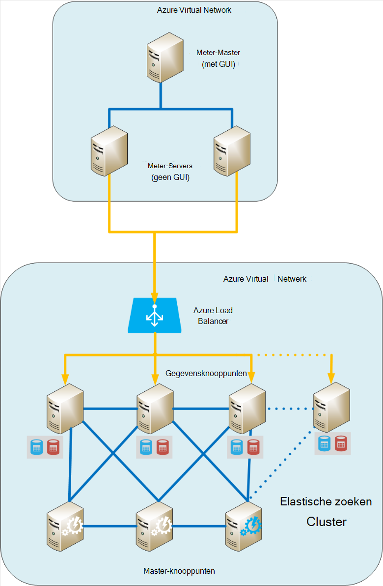
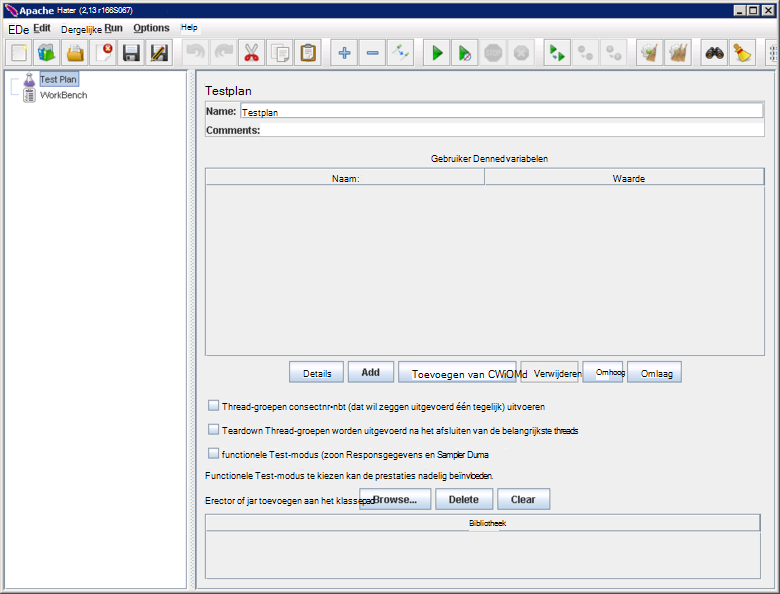
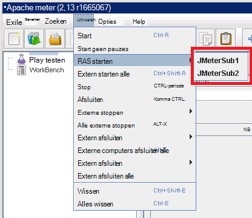
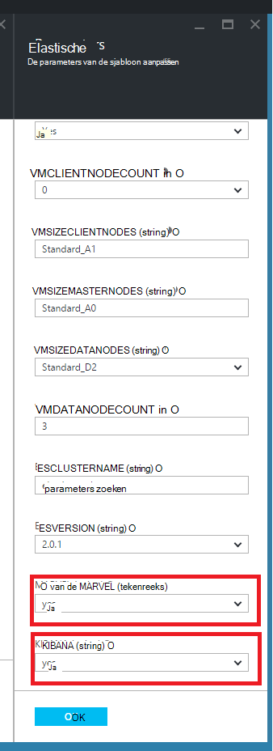
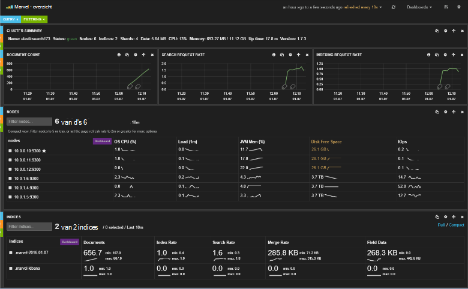
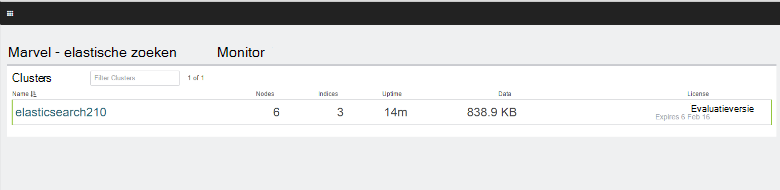
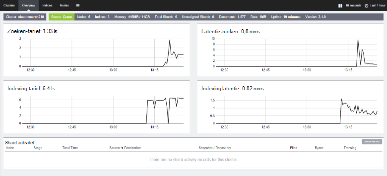

<properties
   pageTitle="Prestatietest omgeving voor Elasticsearch maken | Microsoft Azure"
   description="Het instellen van een omgeving voor het testen van de prestaties van een cluster Elasticsearch."
   services=""
   documentationCenter="na"
   authors="dragon119"
   manager="bennage"
   editor=""
   tags=""/>

<tags
   ms.service="guidance"
   ms.devlang="na"
   ms.topic="article"
   ms.tgt_pltfrm="na"
   ms.workload="na"
   ms.date="09/22/2016"
   ms.author="masashin"/>
   
# <a name="creating-a-performance-testing-environment-for-elasticsearch-on-azure"></a>Prestatietest omgeving voor Elasticsearch op Azure maken

[AZURE.INCLUDE [pnp-header](../../includes/guidance-pnp-header-include.md)]

Dit artikel maakt [deel uit van een serie](guidance-elasticsearch.md). 

Dit document wordt beschreven hoe u een omgeving voor het testen van de prestaties van een cluster Elasticsearch instellen. Deze configuratie is gebruikt voor het testen van de prestaties van gegevens via ingestie en query werkbelasting zoals beschreven in [afstemmen gegevens ingestie prestaties voor Elasticsearch op Azure][].

Het testproces prestaties gebruikt [Apache JMeter](http://jmeter.apache.org/), met de [standaardset](http://jmeter-plugins.org/wiki/StandardSet/) van Plug-ins geïnstalleerd in een master/slave-configuratie met behulp van een reeks speciale VMs (die geen deel uitmaakt van het cluster Elasticsearch) specifiek wordt geconfigureerd voor het doel. 

De [PerfMon Server Agent](http://jmeter-plugins.org/wiki/PerfMonAgent/) is geïnstalleerd op elk knooppunt Elasticsearch. De volgende secties vindt instructies voor het opnieuw maken van de testomgeving kunt u uw eigen prestaties testen met JMeter uitvoeren. Deze instructies wordt ervan uitgegaan dat u al een cluster Elasticsearch met knooppunten met elkaar verbonden via een virtueel netwerk van Azure hebt gemaakt. 

Houd er rekening mee dat de testomgeving ook wordt uitgevoerd als een set van Azure VMs beheerd met één Azure brongroep.

[Marvel](https://www.elastic.co/products/marvel) is ook geïnstalleerd en geconfigureerd zodat de interne aspecten van het cluster Elasticsearch moeten worden bewaakt en gemakkelijker worden geanalyseerd. Als de statistieken JMeter bleek een piek of een dieptepunt in prestaties, informatie beschikbaar via Marvel kan bijzonder waardevol zijn, om te helpen de oorzaak van de schommelingen.

De volgende afbeelding ziet u de structuur van het hele systeem. 



Houd rekening met de volgende punten:

- De kapitein JMeter VM wordt uitgevoerd Windows Server voor het milieu voor de console JMeter GUI. De VM JMeter model biedt de GUI (de *jmeter* toepassing) om een tester tests maken, testen en visualiseren van de resultaten. Deze VM coördinaten met de server JMeter VMs die daadwerkelijk de aanvragen die de tests te verzenden.

- De onderliggende VMs JMeter Ubuntu-Server (Linux) wordt uitgevoerd, er is geen vereiste GUI voor deze VMs. De server JMeter VMs de JMeter serversoftware (de *jmeter -* servertoepassing) voor het verzenden van aanvragen tot het cluster Elasticsearch uitvoeren.

- Speciale client knooppunten zijn niet gebruikt, maar specifieke basispagina knooppunten zijn.

- Het aantal gegevensknooppunten in het cluster kan variëren, afhankelijk van het scenario dat u wilt testen.

- Alle knooppunten in het cluster Elasticsearch uitvoeren Marvel prestaties in runtime in acht nemen, en de Server JMeter Agent voor het verzamelen van de meetgegevens voor latere analyse.

- Bij het testen van Elasticsearch 2.0.0 en later een van de gegevensknooppunten ook Kibana worden uitgevoerd. Dit wordt vereist door de versie van Marvel die wordt uitgevoerd op Elasticsearch 2.0.0 en hoger.

## <a name="creating-an-azure-resource-group-for-the-virtual-machines"></a>Een Azure bronnengroep voor de virtuele machines maken

De kapitein JMeter moet verbinding kunnen maken met de knooppunten in het cluster Elasticsearch voor het verzamelen van prestatiegegevens. Als de JMeter VNet van het cluster Elasticsearch VNet verschilt, vervolgens dit houdt in dat elk knooppunt Elasticsearch configureren met een openbaar IP-adres. Als dit is een probleem met de configuratie van uw Elasticsearch en rekening houden met het VMs JMeter in de dezelfde VNet als het cluster Elasticsearch implementeren met behulp van dezelfde resourcegroep, in welk geval kunt u weglaten deze eerste procedure.

Eerst [maakt u een resourcegroep](../resource-group-template-deploy-portal.md). Dit document wordt ervan uitgegaan dat de groep met de naam *JMeterPerformanceTest*. Als u wilt het VMs JMeter uitvoeren in de dezelfde VNet als het cluster Elasticsearch, gebruiken dezelfde resourcegroep als cluster in plaats van een nieuwe maken.

## <a name="creating-the-jmeter-master-virtual-machine"></a>De JMeter master virtuele machine maken

Volgende [een Windows VM maken](../virtual-machines/virtual-machines-windows-hero-tutorial.md) met behulp van de installatiekopie van *Windows Server 2008 R2 SP1* .  Het is raadzaam een VM-formaat met voldoende cores en het geheugen de prestatietests uitvoeren te selecteren. In het ideale geval is dit een computer met minimaal 2 cores en 3,5 GB RAM-geheugen (standaard A2 of groter).

<!-- TODO add info on why disabling diagnostics is positive --> 

Het is raadzaam de diagnostische gegevens uit te schakelen. Wanneer u de VM in de portal, dit gebeurt op het blad van de *Instellingen* in de sectie *controle* onder *Diagnostische gegevens*. De andere instellingen op de standaardwaarden laten staan.

Controleer of dat de VM en de bijbehorende bronnen zijn gemaakt door het [onderzoeken van de resourcegroep](../azure-portal/resource-group-portal.md#manage-resource-groups) in de portal. De resources moeten bestaan uit een VM, een beveiligingsgroep netwerk en een openbaar IP-adres met dezelfde naam en interface en opslag account waarvan de naam is gebaseerd op die van de VM.

## <a name="creating-the-jmeter-subordinate-virtual-machines"></a>De JMeter onderliggende virtuele machines maken

Nu [een Linux VM maken](../virtual-machines/virtual-machines-linux-quick-create-portal.md) met behulp van de *Ubuntu Server 14.04 LTS* -afbeelding.  Net als bij de master VM JMeter VM grootte met voldoende cores en het geheugen de prestatietests uitvoeren te selecteren. In het ideale geval is dit een computer met minimaal 2 cores en ten minste 3,5 GB RAM-geheugen (standaard A2 of groter).

Opnieuw, is het raadzaam de diagnostische gegevens uit te schakelen.

U kunt zoveel onderliggende VMs als u wilt maken. 

## <a name="installing-jmeter-server-on-the-jmeter-subordinate-vms"></a>JMeter-server installeren op de onderliggende VMs JMeter

De onderliggende VMs JMeter Linux uitvoert en standaard kunt u deze via een verbinding met extern bureaublad (RDP). In plaats daarvan kunt u op elke VM [gebruiken stopverf een opdrachtregel-venster te openen](../virtual-machines/virtual-machines-linux-mac-create-ssh-keys.md) .

Zodra u met een van de onderliggende VMs verbonden bent, gebruiken we Bash JMeter instellen.

Installeer eerst de Java Runtime Environment is vereist voor het uitvoeren van JMeter.

```bash
sudo add-apt-repository ppa:webupd8team/java
sudo apt-get update
sudo apt-get install oracle-java8-installer
```

Download nu de JMeter software geleverd als een zip-bestand.

```bash
wget http://apache.mirror.anlx.net/jmeter/binaries/apache-jmeter-2.13.zip
```

De opdracht unzip installeren en vervolgens gebruiken voor het uitbreiden van de software JMeter. De software wordt gekopieerd naar een map met de naam **apache-jmeter-2.13**.

```bash
sudo apt-get install unzip
unzip apache-jmeter-2.13.zip
```

Wijzigen in de *bin* -directory die de JMeter uitvoerbare bestanden en de programma's *jmeter-server* en *jmeter* uitvoerbaar maken.

```bash
cd apache-jmeter-2.13/bin
chmod u+x jmeter-server
chmod u+x jmeter
```

We moeten nu, bewerk het bestand `jmeter.properties` zich in de huidige map (Gebruik de teksteditor u meest vertrouwd met, zoals *vi* of *vim bent*). Zoek de volgende regels:

```yaml
...
client.rmi.localport=0
...
server.rmi.localport=4000
...
```

Opmerkingen bij (de voorloopspaties verwijderen \##-tekens) en deze regels wijzigen zoals hieronder, en sla het bestand op en sluit de editor:

```yaml
...
client.rmi.localport=4441
...
server.rmi.localport=4440
```

Voer nu de volgende opdrachten 4441 poort voor inkomend TCP-verkeer te openen (dit is de poort die u zojuist hebt geconfigureerd *jmeter-server* afluistert):

```bash
sudo iptables -A INPUT -m state --state NEW -m tcp -p tcp --dport 4441 -j ACCEPT
```

Download het zip-bestand met de standaard verzameling van Plug-ins voor JMeter (deze plug-ins bieden prestatiemeteritems) en pak vervolgens het bestand naar de map **apache-jmeter-2.13** . Ritsen van het bestand op deze locatie wordt de Plug-ins in de juiste map geplaatst.

Als u wordt gevraagd het licentiebestand wilt vervangen, typt u een (voor alle):

```bash
wget http://jmeter-plugins.org/downloads/file/JMeterPlugins-Standard-1.3.0.zip
unzip JMeterPlugins-Standard-1.3.0.zip
```

Gebruik `nohup` de JMeter-server op de achtergrond te starten. Het moet reageren door een proces-ID en een bericht dat aangeeft dat het een extern object heeft gemaakt en beginnen met het ontvangen van opdrachten weer te geven.  Voer de volgende opdracht in de map ~/apache-jmeter-2.13/bin. 

```bash
nohup jmeter-server &
```

> [AZURE.NOTE]Het serverprogramma JMeter wordt beëindigd als de VM afgesloten wordt. U moet verbinding maken met de VM en opnieuw handmatig opnieuw opstarten. Ook kunt u de opdracht *jmeter-server* automatisch bij het opstarten uitgevoerd door de volgende opdrachten voor het toevoegen van de `/etc/rc.local` (voordat de opdracht *exit 0* ):

```bash
sudo -u <username> bash << eoc
cd /home/<username>/apache-jmeter-2.13/bin
nohup ./jmeter-server &
eoc
```

Vervangen `<username>` met de aanmeldingsnaam van uw.

Kan nuttig zijn het terminalvenster om open te houden zodat u de voortgang van de JMeter-server controleren kunt tijdens de test wordt uitgevoerd.

U moet deze stappen herhalen voor elke onderliggende VM JMeter.

## <a name="installing-the-jmeter-server-agent-on-the-elasticsearch-nodes"></a>De Server JMeter Agent installeren op de knooppunten Elasticsearch

Deze procedure wordt ervan uitgegaan dat u login toegang tot de knooppunten Elasticsearch hebben. Als u het cluster met behulp van de Resource Manager-sjabloon hebt gemaakt, kunt u voor elk knooppunt in het vak sprong VM, zoals geïllustreerd in de sectie Elasticsearch topologie van [Elasticsearch uitgevoerd op Azure](guidance-elasticsearch-running-on-azure.md). U kunt verbinding maken met de sprong voor het stopverf ook. 

Van daaruit kunt u de *ssh* -opdracht aan te melden elk van de knooppunten in het cluster Elasticsearch.

Log in op een van de knooppunten Elasticsearch als beheerder.  Bij de opdrachtprompt Bash voert u de volgende opdrachten voor het maken van een map voor de serveragent JMeter houden en verplaatsen naar map:

```bash
mkdir server-agent
cd server-agent
```

Voer de volgende opdrachten de opdracht *unzip* installeren (als deze nog niet is geïnstalleerd), de JMeter Server Agent-software downloaden en unzip het:

```bash
sudo apt-get install unzip
wget http://jmeter-plugins.org/downloads/file/ServerAgent-2.2.1.zip
unzip ServerAgent-2.2.1.zip
```
 
Voer de volgende opdracht om de firewall configureren en inschakelen van TCP-verkeer via poort 4444 (dit is de poort die wordt gebruikt door de Server JMeter Agent):

```bash
sudo iptables -A INPUT -m state --state NEW -m tcp -p tcp --dport 4444 -j ACCEPT
```

Voer de volgende opdracht start de Server JMeter Agent op de achtergrond:

```bash
nohup ./startAgent.sh &
```

De Agent JMeter Server moet reageren met berichten met de mededeling dat het is gestart en op poort 4444 luistert.  Druk op Enter om te downloaden vanaf de opdrachtprompt en voer de volgende opdracht.

```bash
telnet <nodename> 4444
```

Vervangen `<nodename>` met de naam van het knooppunt. (Vindt u de naam van het knooppunt waarop de `hostname` opdracht.) Deze opdracht opent een Telnet-verbinding op poort 4444 op uw lokale computer. Deze verbinding kunt u controleren of de Server JMeter Agent correct uitgevoerd.

Als de Server JMeter Agent niet wordt uitgevoerd, ontvangt u het antwoord 

`*telnet: Unable to connect to remote host: Connection refused*.`

Als de Agent JMeter-Server wordt uitgevoerd en poort 4444 correct is geconfigureerd, ziet u het volgende antwoord:


> [AZURE.NOTE] De Telnet-sessie voorziet niet in een soort vragen zodra deze is aangesloten.

Typ de volgende opdracht in de Telnet-sessie:

``` 
test
```

Als de Server JMeter Agent is geconfigureerd en luistert goed, het moet aangeven dat de opdracht ontvangen en reageren met het bericht *Yep*.

> [AZURE.NOTE]U kunt typen in andere opdrachten ophalen van gegevens voor prestatiecontrole. Bijvoorbeeld de opdracht `metric-single:cpu:idle` geeft de huidige deel van de tijd dat de CPU niet-actief (dit is een momentopname). Ga naar de pagina [PerfMon Server Agent](http://jmeter-plugins.org/wiki/PerfMonAgent/) voor een volledige lijst met opdrachten. : Terug naar de methode aanroept hij Perfmon Server Agent. >>

Typ de volgende opdracht om de sessie af te sluiten en terug te keren naar de opdrachtprompt Bash in de Telnet-sessie:

``` 
exit
```

> [AZURE.NOTE]Als u met de JMeter ondergeschikte VMs, als u zich afmeldt of als deze computer afgesloten wordt en opnieuw opgestart de JMeter Server Agent moet handmatig opnieuw worden gestart met behulp van de `startAgent.sh` opdracht. Als u wilt dat de Server JMeter Agent automatisch wordt gestart, de volgende opdracht toevoegen aan het einde van de `/etc/rc.local` -bestand, voordat u de opdracht *exit 0* . 
> Vervangen `<username>` met uw aanmeldingsnaam:

```bash
sudo -u <username> bash << eoc
cd /home/<username>/server-agent
nohup ./startAgent.sh &
eoc
```

U kunt nu ofwel dit hele proces herhalen voor alle andere knooppunten in het cluster Elasticsearch of kunt u de `scp` opdracht ServerAgent map en de inhoud kopiëren naar alle andere knooppunten en gebruik de `ssh` opdracht JMeter Server Agent te starten zoals hieronder wordt weergegeven. Vervang e `<username>` met uw gebruikersnaam, en `<nodename>` met de naam van het knooppunt waarop u wilt kopiëren en de software (kan u worden gevraagd om uw wachtwoord als u elke opdracht uitvoeren):

```bash
scp -r \~/server-agent <username>@<nodename>:\~
ssh <nodename> sudo iptables -A INPUT -m state --state NEW -m tcp -p tcp --dport 4444 -j ACCEPT
ssh <nodename> -n -f 'nohup \~/server-agent/startAgent.sh'
```

## <a name="installing-and-configuring-jmeter-on-the-jmeter-master-vm"></a>Installeren en configureren van JMeter op de master VM JMeter

Klik in het portal voor Azure **resourcegroepen**. Klik op de bronnengroep met de JMeter-model en de onderliggende VMs in de blade **resourcegroepen** .  Klik op de **master VM JMeter**in de blade **resourcegroep** . Klik op **verbinding maken**in de blade virtuele machine op de werkbalk. Open het RDP-bestand wanneer u wordt gevraagd door de webbrowser. Windows maakt een verbinding met extern bureaublad voor uw VM.  Voer de gebruikersnaam en het wachtwoord voor de VM wanneer daarom wordt gevraagd.

In VM met Internet Explorer, gaat u naar de pagina [Java downloaden voor Windows](http://www.java.com/en/download/ie_manual.jsp) . Volg de instructies voor het downloaden en uitvoeren van het installatieprogramma voor Java.

Ga naar de pagina van [Apache JMeter downloaden](http://jmeter.apache.org/download_jmeter.cgi) en de met de meest recente binaire zip downloaden in de webbrowser. Sla het zip op een handige locatie op de VM.

Ga naar de site [Aangepast JMeter Plugins](http://jmeter-plugins.org/) en de standaard Set van Plug-ins downloaden. De zip opslaan in dezelfde map als het JMeter downloaden uit de vorige stap.

Ga in Windows Verkenner naar de map met de apache-jmeter -*xxx* zip-bestand, waarbij *xxx* staat voor de huidige versie van JMeter. Pak de bestanden in de huidige map.

Pak de bestanden in de JMeterPlugins-standaard -*yyy*ZIP-bestand, waarbij *yyy* de huidige versie van de Plug-ins, in de apache-jmeter -*xxx* -map. Hiermee wordt de Plug-ins in de juiste map voor JMeter toegevoegd. U kunt veilig de lib mappen samenvoegen en de licentie- en Leesmij-bestanden overschrijven als daarom wordt gevraagd.

Ga naar de apache-jmeter -**xxx/bin map en de jmeter.properties bewerken met Kladblok bestand.  In de `jmeter.properties` bestand, zoek de sectie *externe hosts en RMI configuratie*geëtiketteerd.  In deze sectie van het bestand de volgende regel vindt:

```yaml
remote_hosts=127.0.0.1
```

Wijzig deze regel en het IP-adres 127.0.0.1 met een door komma's gescheiden lijst van IP-adressen of hostnamen voor elk van de ondergeschikte servers JMeter vervangen. Bijvoorbeeld:

```yaml
remote_hosts=JMeterSub1,JMeterSub2
```

Zoek de volgende regel te verwijderen het `#` teken aan het begin van de regel en wijzigt u de waarde van de client.rmi.localport-instellingen:

```yaml
#client.rmi.localport=0
```

Aan:

```yaml
client.rmi.localport=4440
```

Sla het bestand op en sluit Kladblok af. 

In de Windows-werkbalk, klikt u op **Start**, klik op **Systeembeheer**en klik vervolgens op **Windows Firewall met geavanceerde beveiliging**.  In Windows Firewall met geavanceerde beveiliging-venster in het linkerdeelvenster met de rechtermuisknop op **Binnenkomende regels**en klik vervolgens op **Nieuwe regel**.

In de **Inkomende Wizard nieuwe regel**op de pagina **Regeltype** **poort**selecteren en klik vervolgens op **volgende**.  Selecteer op de pagina protocollen en poorten, **TCP**, selecteert u **specifieke lokale poorten**, typ in het tekst vak `4440-4444`, en klik op **volgende**.  Selecteer **de verbinding toestaan**op de pagina actie en klik op **volgende**. Laat alle opties ingeschakeld en klik op **volgende**op de pagina profiel.  Op de pagina naam in de **naam** in het tekstvak typt u *JMeter*, en klik op **Voltooien.**  Windows Firewall met geavanceerde beveiliging-venster sluit.

In Windows Verkenner, in de apache-jmeter -**xx/bin-map, dubbelklikt u op de *jmeter* batch-bestand om te beginnen de grafische interface van Windows. De gebruikersinterface moet worden weergegeven:



In de menubalk, klikt u op **uitvoeren**, klik op **RAS starten**en controleer of de twee onderliggende JMeter machines worden vermeld:



U bent nu klaar om te beginnen met het testen van de prestaties.

## <a name="installing-and-configuring-marvel"></a>Installeren en configureren van Marvel

De sjabloon Elasticsearch Quickstart voor Azure installeren en configureren van de juiste versie van Marvel automatisch als u de parameters voor MARVEL en KIBANA op true ('Ja') bij het maken van het cluster:



Als u Marvel aan een bestaand cluster toevoegt, moet u de installatie handmatig uitvoeren en het proces is afhankelijk van of u van Elasticsearch versie gebruikmaakt 1.7.x of 2.x, zoals beschreven in de volgende procedures.

### <a name="installing-marvel-with-elasticsearch-173-or-earlier"></a>Marvel met Elasticsearch 1,73 of eerder installeren

Als u met behulp van Elasticsearch 1.7.3 of eerder, de volgende stappen *op elk knooppunt* in het cluster uitvoeren:

- Log in op het knooppunt en verplaatsen naar de basismap Elasticsearch.  Op Linux, de typische basismap is `/usr/share/elasticsearch`.

-  Voer de volgende opdracht om te downloaden en installeren van de invoegtoepassing Marvel voor Elasticsearch:

```bash
sudo bin/plugin -i elasticsearch/marvel/latest
```

- Stop en start Elasticsearch op het knooppunt:

```bash
sudo service elasticsearch restart
```

- Om te controleren dat Marvel correct is geïnstalleerd, open een webbrowser en Ga naar de URL `http://<server>:9200/_plugin/marvel`. Vervangen `<server>` met de naam of het IP-adres van elke server Elasticsearch in het cluster.  Controleren of een pagina te zien hieronder wordt weergegeven:




### <a name="installing-marvel-with-elasticsearch-200-or-later"></a>Installeren van Marvel met Elasticsearch 2.0.0 of hoger

Als u met behulp van Elasticsearch 2.0.0 of later, de volgende taken *op elk knooppunt* in het cluster uitvoeren:

Log in op het knooppunt en verplaatsen naar de basismap Elasticsearch (meestal `/usr/share/elasticsearch`) de volgende opdrachten downloaden en installeren van de invoegtoepassing Marvel voor Elasticsearch:

```bash
sudo bin/plugin install license
sudo bin/plugin install marvel-agent
```

Stop en start Elasticsearch op het knooppunt:

```bash
sudo service elasticsearch restart
```

Vervang in de volgende procedure `<kibana-version>` met 4.2.2 als u Elasticsearch 2.0.0 of Elasticsearch 2.0.1 of 4.3.1 als Elasticsearch 2.1.0 of hoger.  Vervangen `<marvel-version>` met 2.0.0 als u Elasticsearch 2.0.0 of Elasticsearch 2.0.1 of 2.1.0 als Elasticsearch 2.1.0 of hoger.  De volgende taken uitvoeren *op een knooppunt* in het cluster:

Log in op het knooppunt en download de juiste versie van Kibana voor uw versie van Elasticsearch van de [Elasticsearch downloaden van de website](https://www.elastic.co/downloads/past-releases), wordt het pakket uitpakken:

```bash
wget https://download.elastic.co/kibana/kibana/kibana-<kibana-version>-linux-x64.tar.gz
tar xvzf kibana-<kibana-version>-linux-x64.tar.gz
```

Open poort 5601 om binnenkomende aanvragen te accepteren:

```bash
sudo iptables -A INPUT -m state --state NEW -m tcp -p tcp --dport 5601 -j ACCEPT
```

Ga naar de map Kibana config (`kibana-<kibana-version>-linux-x64/config`), bewerken de `kibana.yml` -bestand en voeg de volgende regel. Vervangen `<server>` met de naam of het IP-adres van een server Elasticsearch in het cluster:

```yaml
elasticsearch.url: "http://<server>:9200"
```

Verplaatsen naar de map Kibana bin (`kibana-<kibana-version>-linux-x64/bin`), en voer de volgende opdracht om de invoegtoepassing Marvel te integreren in Kibana:

```bash
sudo ./kibana plugin --install elasticsearch/marvel/<marvel-version>
```

Start Kibana:

```bash
sudo nohup ./kibana &
```

Als u wilt controleren of de installatie van Marvel, open een webbrowser en Ga naar de URL `http://<server>:5601/app/marvel`. Vervangen `<server>` met de naam of het IP-adres van de Kibana.

Controleer of dat een pagina te zien hieronder wordt weergegeven (de naam van het cluster waarschijnlijk verschillen van die in de afbeelding wordt weergegeven).



Klik op de koppeling die overeenkomt met het cluster (elasticsearch210 in de afbeelding hierboven). Een pagina te zien hieronder weergegeven:




[Optimaliseren gegevens ingestiedosiscoëfficiënten voor Elasticsearch op Azure]: guidance-elasticsearch-tuning-data-ingestion-performance.md  