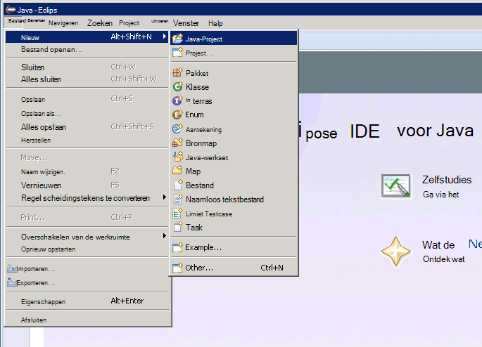
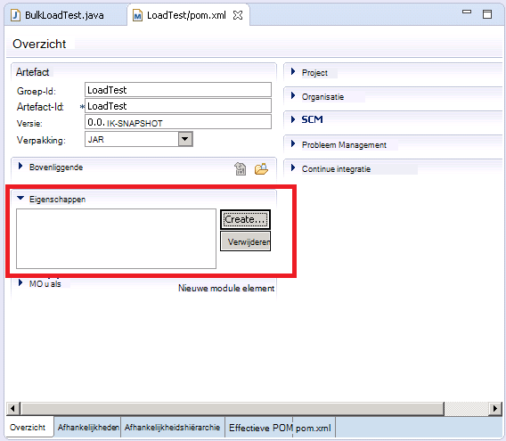

<properties
   pageTitle="Implementatie van een sampler JMeter JUnit Elasticsearch prestaties testen | Microsoft Azure"
   description="Het gebruik van een sampler JUnit te genereren en het uploaden van gegevens naar een cluster Elasticsearch."
   services=""
   documentationCenter="na"
   authors="dragon119"
   manager="bennage"
   editor=""
   tags=""/>

<tags
   ms.service="guidance"
   ms.devlang="na"
   ms.topic="article"
   ms.tgt_pltfrm="na"
   ms.workload="na"
   ms.date="09/22/2016"
   ms.author="masashin"/>
   
# Implementatie van een sampler JMeter JUnit Elasticsearch prestaties testen

[AZURE.INCLUDE [pnp-header](../../includes/guidance-pnp-header-include.md)]

Dit artikel maakt [deel uit van een serie](guidance-elasticsearch.md). 

Dit document wordt beschreven hoe u kunt maken en gebruiken van een JUnit sampler die kunt genereren en gegevens uploaden naar een cluster Elasticsearch als onderdeel van een testplan JMeter. Deze benadering biedt een zeer flexibele aanpak voor het laden van testen die grote hoeveelheden testgegevens zonder afhankelijk van externe gegevensbestanden kunt genereren.

> [AZURE.NOTE] De load-tests gebruikt voor de beoordeling van de prestaties van de opname van gegevens in [afstemmen gegevens ingestie prestaties voor Elasticsearch](guidance-elasticsearch-tuning-data-ingestion-performance.md) beschreven werden samengesteld op basis van deze aanpak. De details van de code voor JUnit worden in dat document beschreven.

De code voor JUnit is ontwikkelen Eclips (Mars) via testen gegevens ingestie prestaties en afhankelijkheden worden opgelost met behulp van Maven. De volgende procedures beschrijven het proces stap voor stap voor Eclips installeren, configureren van de Maven JUnit test maken en implementeren van deze test als een sampler aanvraag JUnit test JMeter.

> [AZURE.NOTE] Zie voor gedetailleerde informatie over de structuur en de configuratie van de testomgeving [maken een testomgeving prestaties voor Elasticsearch op Azure][].

## Installatievereisten

Op de ontwikkelcomputer moet u de [Java Runtime Environment](http://www.java.com/en/download/ie_manual.jsp) .
U moet ook de [Eclips IDE voor ontwikkelaars van Java](https://www.eclipse.org/downloads/index.php?show_instructions=TRUE)installeren.

> [AZURE.NOTE] Als u de basispagina JMeter-VM beschreven in [een testomgeving prestaties voor Elasticsearch op Azure maken][] als uw ontwikkelomgeving, download de Windows 32-bits versie van het installatieprogramma Eclips.

## Maken van een testproject JUnit voor tests Elasticsearch laden

De Eclips IDE starten als deze nog niet actief is, en sluit **de welkomstpagina** .  Klik in het menu **bestand** en klik op **Java-Project**.

Voer de naam van het project in het venster **Nieuwe Java-Project** , **Standaard gebruiken JRE**selecteren en klik op **Voltooien**.

Vouw het knooppunt met de naam van het project in het venster **Explorer pakket** . Controleer of hierin een map met de naam **src** en een verwijzing naar de Java Runtime Environment u hebt opgegeven.

Klik met de rechtermuisknop op de map **src** , klikt u op **Nieuw**en klik op **JUnit Test Case**.

In het venster **nieuwe JUnit Test Case** **test nieuwe Junit 4**selecteert, voer een naam voor het pakket (dit is hetzelfde als de naam van het project, hoewel de conventie met een kleine letter beginnen moet), een naam voor de klasse test en selecteer de opties die de Methodenstubs nodig voor de test te genereren. Laat het vak **klasse beproeven** leeg en klik op **Voltooien**.

Als het volgende in het dialoogvenster **nieuwe JUnit Test Case** wordt weergegeven, de optie de bibliotheek JUnit 4 toevoegen aan het pad maken en klik vervolgens op **OK**. 

Controleer of de overgebleven code voor de JUnit test, wordt gegenereerd en weergegeven in het venster van de editor voor Java.

In het **Pakket Explorer**met de rechtermuisknop op het knooppunt voor uw project, klikt u op **configureren**en klik vervolgens op **converteren naar Maven Project**.

> [AZURE.NOTE]Maven maakt u externe afhankelijkheden (zoals de Elasticsearch Java clientbibliotheken) eenvoudig te beheren met afhankelijk een project.

Klik in het dialoogvenster **nieuwe POM maken** in de vervolgkeuzelijst **verpakking** **jar**selecteren en klik op **Voltooien**.

Het deelvenster dat wordt weergegeven onder het project objectmodel (POM)-editor kan de waarschuwing weergeven "bouwpad bepaalt uitvoeringsomgeving J2SE 1.5. Er zijn geen JREs geïnstalleerd in de werkruimte die strikt compatibel met deze omgeving zijn", afhankelijk van welke versie van Java is geïnstalleerd op de ontwikkelcomputer. Als u een versie van Java die later is dan versie 1.5, u kunt deze waarschuwing gewoon negeren.

Vouw de **Eigenschappen** in de POM-editor en klik op **maken**.

Klik in het dialoogvenster **Eigenschap toevoegen** in het vak **naam** Typ *es.version*in het vak **waarde** typt *1.7.2*en klik op **OK**. Dit is de versie van de Elasticsearch Java client library gebruiken (deze versie in de toekomst kan worden vervangen en de versie als een POM-eigenschap te definiëren en het verwijzen naar deze eigenschap ergens anders in het project kunt u de versie moet snel worden gewijzigd.)

Klik op het tabblad **afhankelijkheden** op de basis van de POM-editor en klik vervolgens op **toevoegen** naast de lijst **afhankelijkheden** .

Typ in het dialoogvenster **Selecteer afhankelijkheid** in het vak **Groeps-Id** *org.elasticsearch*, typ in het vak **Id artefact** *elasticsearch*in het vak **versie** type * \${es.version}*, en klik vervolgens op **OK**. Informatie over de client-bibliotheek van Java Elasticsearch in de on line Maven centrale opslagplaats wordt bewaard en deze configuratie wordt automatisch gedownload de mediawisselaar en de bijbehorende afhankelijkheden wanneer het project wordt gebouwd.

Klik in het menu **bestand** , klikt u op **Alles opslaan**. Deze actie zal opslaan en bouwt het project, de afhankelijkheden die zijn opgegeven door de Maven te downloaden. Controleer of de map Maven afhankelijkheden wordt weergegeven in de Explorer-pakket. Vouw deze map om de jar-bestanden gedownload voor de ondersteuning van de bibliotheek Elasticsearch Java client weer te geven.

## Importeren van een bestaand JUnit testproject in Eclips

Deze procedure wordt ervan uitgegaan dat u een Maven-project dat is gemaakt met behulp van Eclips hebt gedownload.

Start de Eclips IDE. Klik in het menu **bestand** op **importeren**.

Vouw de map **Maven** in het venster **selecteren** , klikt u op **Bestaande Maven projecten**en klik op **volgende**.

Geef in het venster **Maven projecten** , de map met het project (de map met het bestand pom.xml), klikt u op **Alles selecteren**en klik vervolgens op **Voltooien**.

Vouw het knooppunt dat overeenkomt met uw project in het venster **Explorer pakket** . Controleer of het project bevat een map met de naam **src**. Deze map bevat de broncode van de JUnit test. Het project kan worden samengesteld en geïmplementeerd volgens de onderstaande instructies.

## Levert een JUnit test JMeter

Deze procedure wordt ervan uitgegaan dat u hebt gemaakt een project met de naam LoadTest met een JUnit Test-klasse met de naam `BulkLoadTest.java` die de configuratieparameters als één tekenreeks doorgegeven aan de constructor (dit is het mechanisme dat JMeter verwacht) accepteert.

Klik met de rechtermuisknop op het projectknooppunt in de IDE Eclips in **Explorer pakket**en klik vervolgens op **exporteren**.

Vouw het knooppunt **Java** uit in de **Wizard exporteren**op de pagina **selecteren** , klikt u op de **JAR-bestand**en klik op **volgende**.

Vouw op de pagina **JAR-specificatie** in het vak **Selecteer de resources voor het exporteren van** het project **.project**deselecteren en hef de selectie van **pom.xml**. Geef een bestandsnaam en locatie voor het oppervlak (moet verkrijgen de bestandsextensie JAR) in het **JAR-bestand** en klik op **Voltooien**.

Met behulp van Windows Verkenner kopiëren de JAR bestand dat u zojuist hebt gemaakt op de master JVM JMeter en opslaan in de apache-jmeter-2.13\\lib\\junit-map onder de map waarin u JMeter hebt geïnstalleerd (Zie de procedure "De JMeter master virtuele machine maken" in [een testomgeving prestaties voor Elasticsearch op Azure maken](guidance-elasticsearch-creating-performance-testing-environment.md) voor meer informatie.)

Terug naar Eclips, vouw het **Pakket Explorer** -venster en noteer alle JAR-bestanden en hun locaties in de map Maven afhankelijkheden voor het project weergegeven. Houd er rekening mee dat de bestanden in de volgende afbeelding wordt weergegeven is afhankelijk van welke versie van Elasticsearch gebruiken:

Met behulp van Windows Verkenner kopiëren elke JAR-bestand waarnaar wordt verwezen in de map Maven afhankelijkheden apache-jmeter-2.13\\lib\\junit-map op de master VM JMeter.

Als de lib\\junit map al oudere versies van deze JAR-bestanden bevat en deze verwijderen. Als u deze op zijn plaats laat vervolgens de JUnit test werkt mogelijk niet als verwijzingen omgezet in het verkeerde potten worden kunnen.

Stop op de master JMeter VM JMeter als momenteel wordt uitgevoerd.  JMeter starten.  In JMeter, met de rechtermuisknop op **Testplan**, klikt u op **toevoegen**klikt u op **Threads (gebruikers)**en klik vervolgens op de **Thread-groep**.

Onder het knooppunt **Testplan** met de rechtermuisknop op de **Thread-groep**, klikt u op **toevoegen**, **pipet**klikt u op en klikt u vervolgens op **Verzoek van JUnit**.

Selecteer op de pagina **Aanvraag JUnit** **zoeken voor JUnit4-aantekeningen (in plaats van JUnit-3)**. Selecteer uw klasse JUnit load test in de vervolgkeuzelijst **Classname** (deze wordt vermeld in de vorm van * &lt;pakket&gt;.&lt; klasse&gt;*), vervolgkeuzelijst, selecteer de JUnit test methode in de **Methode testen** (dit is de methode die het werk dat is gekoppeld aan de test uitvoert en moet zijn gemarkeerd met de *@test* aantekening in het project Eclips), en geef alle waarden moeten worden doorgegeven aan de constructor in het **Tekenreekslabel van de Constructor** . De details weergegeven in de volgende afbeelding zijn slechts voorbeelden. de **klassenaam** * *Testmethode*en * *Constructor tekenreekslabel** waarschijnlijk zal verschillen van die wordt weergegeven.

Als uw klasse niet wordt weergegeven in de vervolgkeuzelijst **Classname** , betekent dit waarschijnlijk dat het oppervlak is niet correct uitgevoerd of niet in de lib geplaatst is\\junit-map of een van de afhankelijke potten ontbreken in de lib\\junit-map. Als dit gebeurt, het project van de Eclips opnieuw exporteren en te garanderen dat u de **src** resource hebt geselecteerd, kopieert u het oppervlak naar de lib\\junit-map en controleer vervolgens of dat u alle van de afhankelijke potten van Maven gesorteerd naar de lib map hebt gekopieerd.

JMeter sluiten. Er is niet nodig om op te slaan van het testplan.  Kopieer het JAR-bestand met de klasse JUnit test met de /home/&lt;gebruikersnaam&gt;/apache-jmeter-2.13/lib/junit map op elk van de onderliggende VMs JMeter (*&lt;gebruikersnaam&gt; * is de naam van een gebruiker die de beheerder u hebt opgegeven tijdens het maken van de VM, Zie de procedure "De JMeter onderliggende virtuele machines maken" in [een testomgeving prestaties voor Elasticsearch op Azure maken](guidance-elasticsearch-creating-performance-testing-environment.md) voor meer informatie.)

Kopieer de afhankelijke JAR-bestanden vereist door de klasse JUnit test met de /home/&lt;gebruikersnaam&gt;/apache-jmeter-2.13/lib/junit map op elk van de onderliggende VMs JMeter. Zorg dat u eerst alle oudere versies van de JAR-bestanden uit deze map verwijderen.

U kunt de `pscp` hulpprogramma om bestanden te kopiëren vanaf een computer met Windows naar Linux.

[Prestatietest omgeving voor Elasticsearch op Azure maken]: guidance-elasticsearch-creating-performance-testing-environment.md
