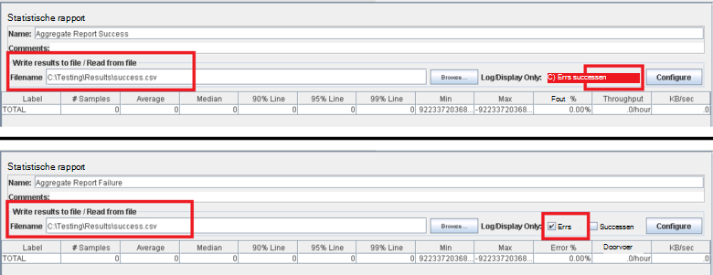

<properties
   pageTitle="Implementatie van een testplan JMeter voor Elasticsearch | Microsoft Azure"
   description="Het uitvoeren van prestaties Elasticsearch met JMeter wordt gecontroleerd."
   services=""
   documentationCenter="na"
   authors="dragon119"
   manager="bennage"
   editor=""
   tags=""/>

<tags
   ms.service="guidance"
   ms.devlang="na"
   ms.topic="article"
   ms.tgt_pltfrm="na"
   ms.workload="na"
   ms.date="09/22/2016"
   ms.author="masashin" />
   
# <a name="implementing-a-jmeter-test-plan-for-elasticsearch"></a>Implementatie van een testplan JMeter voor Elasticsearch

[AZURE.INCLUDE [pnp-header](../../includes/guidance-pnp-header-include.md)]

Dit artikel maakt [deel uit van een serie](guidance-elasticsearch.md). 

De proeven prestaties tegen Elasticsearch zijn geïmplementeerd met behulp van JMeter testplannen samen met de code van Java-JUnit test voor het uitvoeren van taken, zoals het uploaden van gegevens in het cluster wordt opgenomen. De code voor JUnit en testplannen worden beschreven in [afstemmen gegevens ingestie prestaties voor Elasticsearch op Azure][]en [afstemmen het samenvoegen van gegevens en de prestaties van query's voor Elasticsearch op Azure][].

Het doel van dit document is om samen te vatten de belangrijkste ervaring die is opgedaan bij het maken en uitvoeren van deze plannen te testen. De [Aanbevolen procedures voor JMeter](http://jmeter.apache.org/usermanual/best-practices.html) -pagina op de website van Apache JMeter bevat meer algemene advies over effectief gebruik van JMeter.

## <a name="implementing-a-jmeter-test-plan"></a>Implementatie van een testplan JMeter

De volgende lijst bevat een overzicht van de items die u overwegen moet bij het maken van een testplan JMeter:

- Maak een afzonderlijke thread-groep voor elke test die u wilt uitvoeren. Een test kan bevatten meerdere stappen, waaronder logic controllers, timers, vóór en na processors karakteriseren en luisteraars.

- Vermijd te veel threads in een thread-groep maken. JMeter mislukt met 'Onvoldoende geheugen', een uitzonderlijk groot aantal threads worden uitzonderingen. Het is beter om meer JMeter ondergeschikte servers toevoegen die elk een kleiner aantal threads, dan probeert uit te voeren van een groot aantal threads op één JMeter-server wordt uitgevoerd.


- Voor de beoordeling van de prestaties van het cluster door de invoegtoepassing [Perfmon Metrics verzamelaar](http://jmeter-plugins.org/wiki/PerfMon/) te integreren in het testplan. Dit is een JMeter-listener die als een van de standaard JMeter Plug-ins beschikbaar is. De onbewerkte gegevens opslaan in een reeks bestanden in de indeling met door komma's gescheiden waarden (CSV) en deze te verwerken wanneer de test voltooid is. Dit is efficiënter en minder belast dan poging tot het verwerken van de gegevens wordt JMeter oplegt. 


U kunt een hulpprogramma dat Excel importeert de gegevens en een reeks grafieken genereren voor analysedoeleinden.

Houd rekening met de volgende informatie vastleggen:

- CPU-gebruik voor elk knooppunt in het cluster Elasticsearch.

- Het aantal gelezen bytes per seconde van de schijf voor elk knooppunt.

- Indien mogelijk, het percentage van de CPU-tijd besteed aan het wachten op I/O moet worden uitgevoerd op elk knooppunt. Dit is niet altijd mogelijk voor Windows VMs, maar voor Linux kunt u een aangepaste metric (een EXEC metrisch) die wordt uitgevoerd met de volgende shellopdracht aanroepen van *vmstat* op een knooppunt maken:

```Shell
sh:-c:vmstat 1 5 | awk 'BEGIN { line=0;total=0;}{line=line+1;if(line&gt;1){total=total+\$16;}}END{print total/4}'
```

16 veld in de uitvoer van *vmstat* bevat de CPU-tijd besteed aan het wachten op I/O. Zie voor meer informatie over de werking van deze verklaring de [vmstat opdracht](http://linuxcommand.org/man_pages/vmstat8.html).

- Het aantal bytes van verzonden en ontvangen via het netwerk op elk knooppunt.

- Afzonderlijke statistische rapport listeners gebruiken voor het vastleggen van de prestaties en de frequentie van geslaagde en mislukte bewerkingen. Vastleggen van geslaagde en mislukte gegevens naar andere bestanden.



- Elk geval JMeter test zo eenvoudig mogelijk zodat u direct correleren prestaties met specifieke test acties houden. Voor test cases die complexe bedrijfslogica vereist, kunt u deze logica JUnit test encapsulating en de aanvraag JUnit sampler in JMeter gebruiken voor het uitvoeren van de test.

- Gebruik de HTTP-aanvraag sampler HTTP-bewerkingen uitvoeren, zoals GET, POST, PUT of verwijderen. U kunt bijvoorbeeld Elasticsearch zoekopdrachten uitvoeren met behulp van een query boeken en bieden de Querydetails in het vak *Hoofdtekst* :


- Voorzien van de herhaalbaarheid en hergebruik te vereenvoudigen, JMeter testplannen te testen. Vervolgens kunt u scripts voor het automatiseren van het uitvoeren van de testplannen.

## <a name="implementing-a-junit-test"></a>Implementatie van een JUnit test

U kunt complexe code opnemen in een testplan JMeter door een of meer JUnit tests te maken. U kunt een JUnit test schrijven met behulp van een Java geïntegreerde ontwikkelomgeving (IDE) zoals Eclips. [Implementatie van een sampler JMeter-JUnit Elasticsearch prestaties testen][] vindt u informatie over het instellen van een juiste development environment.

De volgende lijst bevat een overzicht van enkele aanbevolen procedures die u volgen moet bij het schrijven van de code voor JUnit test:

- Gebruik de constructor van de klasse test initialisatieparameters doorgeven in de test. JMeter kan een constructor die een enkele tekenreeks argument gebruiken. Parseren in de constructor dit argument in de afzonderlijke elementen, zoals in het volgende voorbeeld wordt getoond:

```Java
private String hostName = "";
private String indexName = "";
private String typeName = "";
private int port = 0;
private String clusterName = "";
private int itemsPerBatch = 0;

/\* JUnit test class constructor \*/
public ElasticsearchLoadTest2(String params) {
    /* params is a string containing a set of comma separated values for:
        hostName
        indexName
        typeName
        port
        clustername
        itemsPerBatch
    */

    /* Parse the parameter string into an array of string items */
    String delims = "\[ \]\*,\[ \]\*"; // comma surrounded by zero or more spaces
    String\[\] items = params.split(delims);

    /* Note: Parameter validation code omitted */

    /* Use the parameters to populate variables used by the test */
    hostName = items[0];
    indexName = items[1];
    typeName = items[2];
    port = Integer.parseInt(items[3]);
    clusterName = items[4];
    itemsPerBatch = Integer.parseInt(items[5]);

    if(itemsPerBatch == 0)
        itemsPerBatch = 1000;
}
```

- Vermijd i/o-bewerkingen of andere tijdrovende bewerkingen in de constructor of een setup-klasse test, omdat ze worden uitgevoerd telkens wanneer de JUnit test wordt uitgevoerd. (Dezelfde JUnit test kan worden uitgevoerd duizenden tijden voor elke proef uitgevoerd vanuit JMeter.)

- Overweeg het gebruik van eenmalige setup voor initialisatie dure test case.

- Als de test een groot aantal invoerparameters zijn vereist, test-configuratiegegevens worden opgeslagen in een afzonderlijk bestand en de locatie van dit bestand doorgeven aan de constructor.

- Vermijd harde codering paden in de code load test. Dit kunnen leiden tot storingen als gevolg van verschillen tussen operating systems zoals Windows en Linux.

- Bevestigingen gebruiken om aan te geven met fouten in JUnit test methoden, zodat u kunt ze met JMeter bijhouden en gebruik ze als een zakelijke maatstaven. Informatie over de oorzaak van de storing, indien mogelijk, doorgeven zoals in vet weergegeven in het volgende voorbeeld:

```Java
@Test
public void bulkInsertTest() throws IOException {
    ...
    BulkResponse bulkResponse = bulkRequest.execute().actionGet();
    assertFalse(
        bulkResponse.buildFailureMessage(), bulkResponse.hasFailures());
        ...
}
```


[Running Elasticsearch on Azure]: guidance-elasticsearch-running-on-azure.md
[Optimaliseren gegevens ingestiedosiscoëfficiënten voor Elasticsearch op Azure]: guidance-elasticsearch-tuning-data-ingestion-performance.md
[Implementatie van een Sampler JMeter-JUnit Elasticsearch prestaties testen]: guidance-elasticsearch-deploying-jmeter-junit-sampler.md
[Het samenvoegen van gegevens en de prestaties van query's voor Elasticsearch op Azure afstemmen]: guidance-elasticsearch-tuning-data-aggregation-and-query-performance.md
