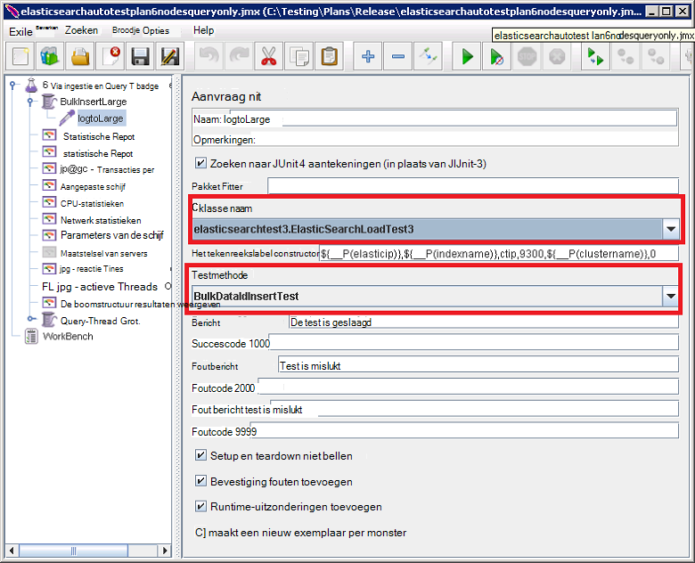

<properties
   pageTitle="Met de geautomatiseerde Elasticsearch prestatietests | Microsoft Azure"
   description="Beschrijving van hoe u de prestatietests in uw eigen omgeving uitvoeren kunt."
   services=""
   documentationCenter="na"
   authors="dragon119"
   manager="bennage"
   editor=""
   tags=""/>

<tags
   ms.service="guidance"
   ms.devlang="na"
   ms.topic="article"
   ms.tgt_pltfrm="na"
   ms.workload="na"
   ms.date="09/22/2016"
   ms.author="masashin"/>
   
# <a name="running-the-automated-elasticsearch-performance-tests"></a>De geautomatiseerde Elasticsearch prestatietests uitvoeren

[AZURE.INCLUDE [pnp-header](../../includes/guidance-pnp-header-include.md)]

Dit artikel maakt [deel uit van een serie](guidance-elasticsearch.md). 

Documenten [afstemmen gegevens ingestie prestaties voor Elasticsearch op Azure] en [afstemmen het samenvoegen van gegevens en de prestaties van query's voor Elasticsearch op Azure] beschrijven een aantal prestatietests die zijn uitgevoerd op een monster Elasticsearch cluster.

Deze tests zijn te worden uitgevoerd op een geautomatiseerde wijze script. Dit document wordt beschreven hoe u de tests in uw eigen omgeving kunt herhalen.

## <a name="prerequisites"></a>Vereisten

Automatische tests moeten de volgende items:

-  Een cluster Elasticsearch.

- Een JMeter omgeving opzetten door het [maken van een testomgeving prestaties voor Elasticsearch op Azure]document beschreven.

- [3.5.1 Python](https://www.python.org/downloads/release/python-351/) geïnstalleerd op de master JMeter VM.


## <a name="how-the-tests-work"></a>De werking van de proeven
De tests worden uitgevoerd met behulp van JMeter. Een masterserver JMeter een testplan geladen en wordt doorgegeven aan een reeks JMeter ondergeschikte servers die daadwerkelijk de tests worden uitgevoerd. De masterserver JMeter coördineert de ondergeschikte servers JMeter en worden de resultaten bij elkaar opgeteld.

De volgende testplannen zijn beschikbaar:

* [elasticsearchautotestplan3nodes.jmx](https://github.com/mspnp/azure-guidance/blob/master/ingestion-and-query-tests/templates/elasticsearchautotestplan3nodes.jmx). De test via ingestie uitgevoerd via een cluster 3-knooppunt.

* [elasticsearchautotestplan6nodes.jmx](https://github.com/mspnp/azure-guidance/blob/master/ingestion-and-query-tests/templates/elasticsearchautotestplan6nodes.jmx). De test van de opname via een 6-node cluster uitgevoerd.

* [elasticsearchautotestplan6qnodes.jmx](https://github.com/mspnp/azure-guidance/blob/master/ingestion-and-query-tests/templates/elasticsearchautotestplan6qnodes.jmx). De test via ingestie en query uitgevoerd via een 6-node cluster.

* [elasticsearchautotestplan6nodesqueryonly.jmx](https://github.com/mspnp/azure-guidance/blob/master/ingestion-and-query-tests/templates/elasticsearchautotestplan6nodesqueryonly.jmx). De query alleen test uitgevoerd via een 6-node cluster.


U kunt deze testplannen als basis voor uw eigen scenario's als u minder of meer knooppunten.

De testplannen gebruiken een aanvraag JUnit sampler te genereren en de testgegevens uploaden. Het testplan JMeter maakt deze sampler wordt uitgevoerd en de knooppunten Elasticsearch voor prestatiegegevens controleert.  

## <a name="building-and-deploying-the-junit-jar-and-dependencies"></a>Maken en implementeren van de JAR-JUnit en afhankelijkheden
Voordat u de prestatietests die u moet downloaden, compileren en de JUnit tests te vinden onder de map prestaties/junitcode implementeren. Deze tests wordt verwezen door het testplan JMeter. Zie de procedure "Een bestaand JUnit testproject importeren in Eclips" in het document [een sampler JMeter-JUnit voor het testen van de prestaties Elasticsearch implementeren]voor meer informatie.

Er zijn twee versies van de JUnit tests: 

- [Elasticsearch1.73](https://github.com/mspnp/azure-guidance/tree/master/ingestion-and-query-tests/junitcode/elasticsearch1.73). Deze code gebruiken voor het uitvoeren van de tests van de opname. Deze tests Elasticsearch 1,73 gebruiken.

- [Elasticsearch2](https://github.com/mspnp/azure-guidance/tree/master/ingestion-and-query-tests/junitcode/elasticsearch2). Deze code gebruiken voor het uitvoeren van de query testen. Deze tests Elasticsearch 2.1 en hoger gebruiken.

Het juiste Java (JAR) bestand samen met de rest van de afhankelijkheden kopiëren naar uw JMeter machines. Het proces wordt beschreven bij de [implementatie van een sampler JMeter-JUnit Elasticsearch prestaties testen][]. 

> **Belangrijk** Na de implementatie van een JUnit test, laden en de testplannen die verwijzen naar deze JUnit test en controleer of de groep van de thread BulkInsertLarge verwijst naar het juiste bestand voor JAR, JUnit klasse configureren met JMeter en testmethode:
> 
> 
> 
> De bijgewerkte testplannen opslaan voordat de tests worden uitgevoerd.

## <a name="creating-the-test-indexes"></a>De test-indexen maken
Elke test wordt uitgevoerd via de mond en/of query's op een enkele index opgegeven wanneer de test wordt uitgevoerd. U moet de index met behulp van de schema's die worden beschreven in de bijlagen bij de documenten [afstemmen gegevens ingestie prestaties voor Elasticsearch op Azure] en [afstemmen het samenvoegen van gegevens en de prestaties van query's voor Elasticsearch op Azure] maken en configureren volgens uw testscenario (doc-waarden ingeschakeld/uitgeschakeld, meerdere replica's, enzovoort.) Opmerking de testplannen ervan uit dat de index één type met de naam *ctip bevat*.

## <a name="configuring-the-test-script-parameters"></a>De test scriptparameters configureren
De volgende test script parameterbestanden kopiëren naar de server JMeter:

* [run.properties](https://github.com/mspnp/azure-guidance/blob/master/ingestion-and-query-tests/run.properties). Dit bestand geeft het aantal threads voor JMeter-test te gebruiken, de duur van de test (in seconden) het IP-adres van een knooppunt (of een load balancer in het cluster Elasticsearch) en de naam van het cluster:

  ```ini
  nthreads=3
  duration=300
  elasticip=<IP Address or DNS Name Here>
  clustername=<Cluster Name Here>
  ```
  
  Dit bestand bewerken en geef de juiste waarden voor uw test- en cluster.

* [query-config-win.ini](https://github.com/mspnp/azure-guidance/blob/master/ingestion-and-query-tests/query-config-win.ini) en [query-config-nix.ini](https://github.com/mspnp/azure-guidance/blob/master/ingestion-and-query-tests/query-config-nix.ini). Deze twee bestanden bevatten dezelfde informatie; het bestand *win* is geformatteerd voor Windows-bestandsnamen en paden en het bestand *nix* is opgemaakt voor Linux bestandsnamen en paden:

  ```ini
  [DEFAULT]
  debug=true #if true shows console logs.

  [RUN]
  pathreports=C:\Users\administrator1\jmeter\test-results\ #path where tests results are saved.
  jmx=C:\Users\administrator1\testplan.jmx #path to the JMeter test plan.
  machines=10.0.0.1,10.0.0.2,10.0.0.3 #IPs of the Elasticsearch data nodes separated by commas.
  reports=aggr,err,tps,waitio,cpu,network,disk,response,view #Name of the reports separated by commas.
  tests=idx1,idx2 #Elasticsearch index(es) name(s) to test, comma delimited if more than one.
  properties=run.properties #Name of the properties file.
  ```

  Dit bestand bewerken als de locaties van de onderzoekresultaten, de naam van het testplan JMeter uit te voeren, de IP-adressen van de Elasticsearch gegevensknooppunten u prestatiegegevens, verzamelen de rapporten met de ruwe gegevens die worden gegenereerd en de naam (of namen door komma's gescheiden) van de index(en) te beproeven, als meer dan één , testen, achter elkaar worden uitgevoerd. Als het bestand run.properties bevindt zich in een andere map of een map, geef het volledige pad naar dit bestand.

## <a name="running-the-tests"></a>De tests uitgevoerd

* Kopieer het bestand [query test.py](https://github.com/mspnp/azure-guidance/blob/master/ingestion-and-query-tests/query-test.py) JMeter server machine, in dezelfde map als de query-config-win.ini (query-config nix.ini) bestanden en run.properties.

* Zorg ervoor dat jmeter.bat (Windows) of jmeter.sh (Linux) op het uitvoerbaar pad voor uw omgeving.

* De query-test.py-script uitvoeren vanaf de opdrachtregel voor het uitvoeren van de tests:

  ```cmd
  py query-test.py
  ```

* Wanneer de test is voltooid, worden de resultaten opgeslagen als de set door komma's gescheiden (CSV)-bestanden die zijn opgegeven in het bestand query config win.ini (query-config-nix.ini waarden). U kunt Excel gebruiken om te analyseren en deze gegevens in een grafiek.


[Optimaliseren gegevens ingestiedosiscoëfficiënten voor Elasticsearch op Azure]: guidance-elasticsearch-tuning-data-ingestion-performance.md
[Het samenvoegen van gegevens en de prestaties van query's voor Elasticsearch op Azure afstemmen]: guidance-elasticsearch-tuning-data-aggregation-and-query-performance.md
[Prestatietest omgeving voor Elasticsearch op Azure maken]: guidance-elasticsearch-creating-performance-testing-environment.md
[Implementatie van een Sampler JMeter-JUnit Elasticsearch prestaties testen]: guidance-elasticsearch-deploying-jmeter-junit-sampler.md
