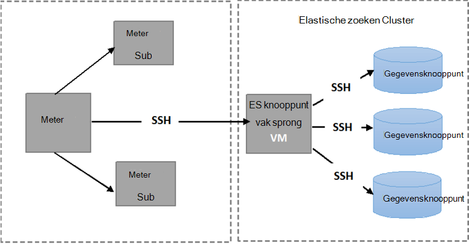
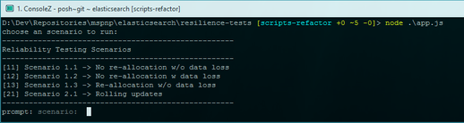

<properties
   pageTitle="Met de testcriteria Elasticsearch tolerantie | Microsoft Azure"
   description="Beschrijving van hoe u de tolerantie-tests in uw eigen omgeving uitvoeren kunt."
   services=""
   documentationCenter="na"
   authors="dragon119"
   manager="bennage"
   editor=""
   tags=""/>

<tags
   ms.service="guidance"
   ms.devlang="na"
   ms.topic="article"
   ms.tgt_pltfrm="na"
   ms.workload="na"
   ms.date="09/22/2016"
   ms.author="masashin"/>

# <a name="running-the-automated-elasticsearch-resiliency-tests"></a>De automatische Elasticsearch resiliency tests uitgevoerd

[AZURE.INCLUDE [pnp-header](../../includes/guidance-pnp-header-include.md)]

Dit artikel maakt [deel uit van een serie](guidance-elasticsearch.md).

In de [veerkracht configureren and recovery op Elasticsearch op Azure][elasticsearch-resilience-recovery], we een reeks tests die zijn uitgevoerd op een monster Elasticsearch cluster om te bepalen hoe goed het systeem gereageerd op sommige veelgebruikte formulieren van de fout en hoe goed deze hersteld beschreven. De tests zijn te worden uitgevoerd op een geautomatiseerde wijze script. Dit document wordt beschreven hoe u de tests in uw eigen omgeving kunt herhalen. 

De volgende scenario's zijn getest:

- **Storingen in knooppunten en opnieuw opstarten zonder verlies van gegevens**. Een gegevensknooppunt wordt gestopt en opnieuw gestart na 5 minuten.
Elasticsearch is geconfigureerd niet opnieuw toewijzen van ontbrekende shards in dit interval, zodat er geen extra I/O in shards navigeren is ontstaan. Als het knooppunt opnieuw is opgestart, wordt het herstelproces de shards op dat knooppunt weer up-to-date.

- **Storingen in knooppunten met verlies van kritieke gegevens**. Een gegevensknooppunt is gestopt en de gegevens die deze bevat om te simuleren onherstelbare schijffout is gewist. Het knooppunt wordt vervolgens opnieuw opgestart (na 5 minuten), effectief fungeert als een vervanging voor het oorspronkelijke knooppunt. Het herstelproces moet opnieuw samenstellen van de ontbrekende gegevens voor dit knooppunt en verhuizen shards gehouden op andere knooppunten kan inhouden.

- **Storingen in knooppunten en opnieuw opstarten zonder verlies van gegevens, maar met de shard Hertoewijzing**. Een gegevensknooppunt is gestopt en de shards die deze bevat naar andere knooppunten worden herverdeeld. Het knooppunt vervolgens opnieuw wordt gestart en meer Hertoewijzing treedt op als het cluster opnieuw.

- **Rolling updates**. Elk knooppunt in het cluster wordt gestopt en opnieuw gestart na een korte interval voor het simuleren van machines opnieuw worden opgestart nadat een software-update. Slechts één knooppunt is tegelijk gestopt.
Shards worden niet herverdeeld als een knooppunt niet actief is.

## <a name="prerequisites"></a>Vereisten

Automatische tests moeten de volgende items:

- Een cluster Elasticsearch.

- Een JMeter omgeving opzetten zoals beschreven door de [prestaties testen richtlijnen]. 

- De volgende toevoegingen op de JMeter master VM alleen geïnstalleerd.

    - Java Runtime 7.

    - Nodejs 4.x.x of hoger.

    - De Git opdrachtregelprogramma's.

## <a name="how-the-scripts-work"></a>Hoe werken de scripts

De testscripts zijn uit te voeren op de VM JMeter Master bestemd. Als u een test uit te voeren selecteert, voert u de scripts de volgende volgorde van bewerkingen:

1.  Start een JMeter testplan doorgeven van de parameters die u hebt opgegeven.

2.  Kopieer een script waarmee de bewerkingen die nodig zijn door de test voor een opgegeven VM in het cluster. Dit is een VM met een openbaar IP-adres of de VM *Jumpbox* als u het cluster via de [Azure Elasticsearch quickstart sjabloon](https://github.com/Azure/azure-quickstart-templates/tree/master/elasticsearch)hebt gemaakt.

3.  Het script uitvoeren op de VM (of Jumpbox).

De volgende afbeelding ziet u de structuur van de testomgeving en Elasticsearch cluster. Houd er rekening mee dat de testscripts secure shell (SSH) voor elk knooppunt in het cluster verschillende Elasticsearch bewerkingen uitvoeren zoals stoppen of opnieuw starten van een knooppunt wilt gebruiken.



## <a name="setting-up-the-jmeter-tests"></a>Instellen van de JMeter-tests

Voordat de test wordt uitgevoerd de veerkracht te compileren en de JUnit tests die zich bevindt in de map jmeter-tolerantie/tests te implementeren. Deze tests wordt verwezen door het testplan JMeter. Zie de procedure "Een bestaand JUnit testproject importeren in Eclips" bij de [implementatie van een sampler JMeter-JUnit Elasticsearch prestaties testen][]voor meer informatie.

Er zijn twee versies van de JUnit tests die in de volgende mappen:

- **Elasticsearch17.** Het project in deze map genereert het bestand Elasticsearch17.jar. Deze POTJES gebruiken voor het testen versies Elasticsearch 1.7.x

- **Elasticsearch20**. Het project in deze map genereert het bestand Elasticsearch20.jar. Deze POTJES gebruiken voor het testen van versie 2.0.0 Elasticsearch en hoger

Kopieer de juiste JAR-bestand met de rest van de afhankelijkheden op uw computers JMeter. Het proces wordt beschreven door de procedure "Deploying JMeter JUnit test" bij de [implementatie van een sampler JMeter-JUnit voor tests Elasticsearch prestaties].

## <a name="configuring-vm-security-for-each-node"></a>Configureren van de beveiliging voor elk knooppunt VM

De testscripts moeten een certificaat voor clientverificatie worden geïnstalleerd op elk knooppunt Elasticsearch in het cluster. Hierdoor kunnen de scripts worden automatisch uitgevoerd zonder dat wordt gevraagd naar een gebruikersnaam en wachtwoord ze verbinding maken met de verschillende VMs.

Start met het aanmelden bij een van de knooppunten in het cluster Elasticsearch (of de Jumpbox VM) en voert u de volgende opdracht om een verificatiesleutel genereren:

```Shell
ssh-keygen -t rsa
```

Wanneer verbonden met de Elasticsearch knooppunt (of Jumpbox), worden de volgende opdrachten voor elk knooppunt in hij Elasticsearch cluster uitgevoerd. Vervangen `<username>` met de naam van een geldige gebruiker op elke VM en vervangen `<nodename>` met de DNS-naam of het IP-adres van de host van het knooppunt Elasticsearch VM.
Houd er rekening mee dat u wordt gevraagd om het wachtwoord van de gebruiker bij het uitvoeren van deze opdrachten.
Zie voor meer informatie [SSH login zonder wachtwoord](http://www.linuxproblem.org/art_9.html):

```Shell
ssh <username>@<nodename> mkdir -p .ssh (
cat .ssh/id\_rsa.pub | ssh <username>*@<nodename> 'cat &gt;&gt; .ssh/authorized\_keys'
```

## <a name="downloading-and-configuring-the-test-scripts"></a>Downloaden en de testscripts configureren

De testscripts zijn beschikbaar in een Git repository. Gebruik de volgende procedure om te downloaden en de scripts configureren.

Op de JMeter master computer waar u de tests wilt uitvoeren, opent een venster Git bureaublad (Git Bash) en klonen van de bibliotheek met de scripts, als volgt:

```Shell
git clone https://github.com/mspnp/azure-guidance.git
```

Verplaatsen naar de map tolerantie voor tests en de volgende opdracht installeren de afhankelijkheden die zijn vereist voor het uitvoeren van de tests worden uitgevoerd:

```Shell
npm install
```

Als de JMeter-master wordt uitgevoerd op Windows, download [Plink](http://www.chiark.greenend.org.uk/~sgtatham/putty/download.html), is een opdrachtregel-interface voor de stopverf Telnet-client. De uitvoerbare Plink kopiëren naar de map tolerantie-tests/lib.

Als de kapitein JMeter op Linux wordt uitgevoerd, hoeft u niet te Plink downloaden maar moet u SSH tussen de kapitein JMeter en het knooppunt Elasticsearch of Jumpbox u door de stappen in de procedure volgen die wordt gebruikt zonder wachtwoord configureren "VM configureren voor elk knooppunt." 

Bewerken van de volgende configuratieparameters in de `config.js` bestand aan uw testomgeving en Elasticsearch cluster. Deze parameters gelden voor alle tests:

| Naam | Beschrijving | Standaardwaarde |
| ---- | ----------- | ------------- |
| `jmeterPath` | Lokaal pad naar JMeter. | `C:/apache-jmeter-2.13` |
| `resultsPath` | Relatieve directory waar het resultaat in het script wordt gedumpt. | `results` |
| `verbose` | Geeft aan of het script wordt de uitvoer in de uitgebreide modus of niet. | `true` |
| `remote` | Geeft aan of de JMeter tests uitgevoerd lokaal of op externe servers. | `true` |
| `cluster.clusterName` | De naam van het cluster Elasticsearch. | `elasticsearch` |
| `cluster.jumpboxIp`         | Het IP-adres van de machine Jumpbox.                 |-|
| `cluster.username`          | De beheerder die u hebt gemaakt bij het implementeren van het cluster. |-|
| `cluster.password`          | Het wachtwoord voor de admin-gebruiker.                        |-|
| `cluster.loadBalancer.ip`   | Het IP-adres van de taakverdeling Elasticsearch.    |-|
| `cluster.loadBalancer.url`  | Basis-URL van de taakverdeling.                          |-|

## <a name="running-the-tests"></a>De tests uitgevoerd

Verplaatsen naar de map resiliency tests en voer de volgende opdracht uit:

```Shell
node app.js
```

Het volgende menu moet worden weergegeven:



Voer het nummer van het scenario dat u wilt uitvoeren: `11`, `12`, `13` of `21`. 

Als u een scenario hebt geselecteerd, wordt de test wordt automatisch uitgevoerd. De resultaten worden opgeslagen als een set bestanden met door komma's gescheiden waarden (CSV) in een map gemaakt in de map voor de resultaten. Elke uitvoering heeft een eigen resultaten.
U kunt Excel gebruiken om te analyseren en deze gegevens in een grafiek.

[Running Elasticsearch on Azure]: guidance-elasticsearch-running-on-azure.md
[Tuning Data Ingestion Performance for Elasticsearch on Azure]: guidance-elasticsearch-tuning-data-ingestion-performance.md
[richtlijnen voor prestaties testen]: guidance-elasticsearch-creating-performance-testing-environment.md
[JMeter guidance]: guidance-elasticsearch-implementing-jmeter.md
[Considerations for JMeter]: guidance-elasticsearch-deploying-jmeter-junit-sampler.md
[Query aggregation and performance]: guidance-elasticsearch-query-aggregation-performance.md
[elasticsearch-resilience-recovery]: guidance-elasticsearch-configuring-resilience-and-recovery.md
[Resilience and Recovery Testing]: guidance-elasticsearch-running-automated-resilience-tests.md
[Implementatie van een Sampler JMeter-JUnit Elasticsearch prestaties testen]: guidance-elasticsearch-deploying-jmeter-junit-sampler.md
