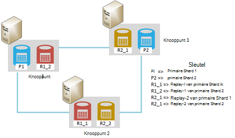
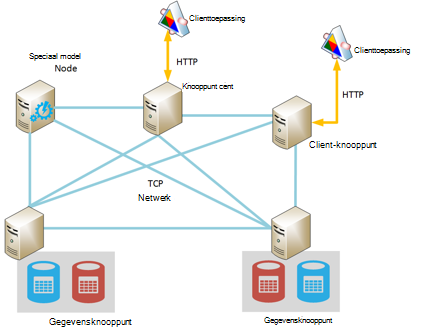
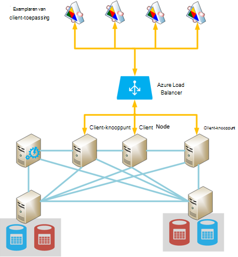
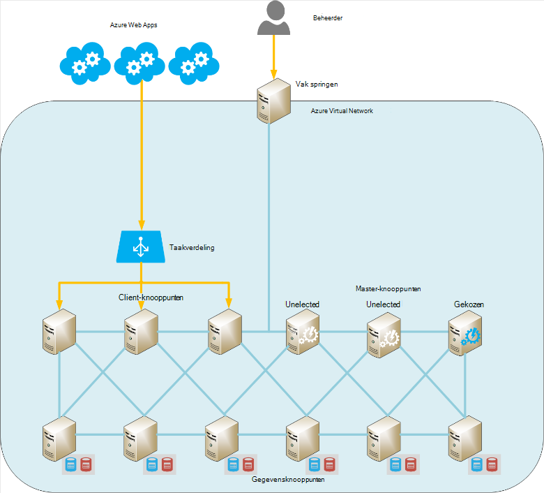
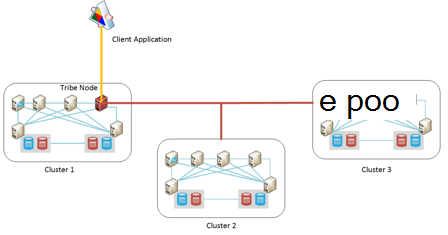

<properties
   pageTitle="Elasticsearch uitgevoerd op Azure | Microsoft Azure"
   description="Informatie over het installeren, configureren en uitvoeren van Elasticsearch op Azure."
   services=""
   documentationCenter="na"
   authors="dragon119"
   manager="bennage"
   editor=""
   tags=""/>

<tags
   ms.service="guidance"
   ms.devlang="na"
   ms.topic="article"
   ms.tgt_pltfrm="na"
   ms.workload="na"
   ms.date="09/22/2016"
   ms.author="masashin"/>

# <a name="running-elasticsearch-on-azure"></a>Elasticsearch uitgevoerd op Azure

[AZURE.INCLUDE [pnp-header](../../includes/guidance-pnp-header-include.md)]

Dit artikel maakt [deel uit van een serie](guidance-elasticsearch.md). 

## <a name="overview"></a>Overzicht

Dit document biedt een korte inleiding tot de algemene structuur van Elasticsearch en vervolgens wordt beschreven hoe u een Elasticsearch cluster met Azure kunt implementeren. Het perfectioneren van aanbevolen procedures voor het implementeren van een cluster Elasticsearch, concentreren op de verschillende prestaties en functionele eisen van het beheer van uw systeem en gezien hoe uw vereisten voor de configuratie en de topologie die u selecteert moeten station.

> [AZURE.NOTE] Deze instructies wordt ervan uitgegaan dat de enige elementaire kennis van [Elasticsearch][].

## <a name="the-structure-of-elasticsearch"></a>De structuur van Elasticsearch 

Elasticsearch is een document database zeer geoptimaliseerd om te fungeren als een zoekmachine. Documenten worden geserialiseerd in JSON-indeling. Gegevens worden bewaard in de indexen, geïmplementeerd met behulp van [Apache Lucene][], hoewel de details zijn geabstraheerd uit beeld en het is niet noodzakelijk volledig begrijpt, Lucene Elasticsearch kunt gebruiken.

### <a name="clusters-nodes-indexes-and-shards"></a>Clusters, knooppunten, indexen en shards

Elasticsearch implementeert een geclusterde architectuur die sharding gebruikt voor het verdelen van gegevens over meerdere knooppunten en replicatie van beschikbaarheid. Documenten worden opgeslagen in de indexen. De gebruiker kan opgeven welke velden in een document worden gebruikt om u te identificeren in een index of het systeem automatisch laten genereren een sleutelveld en waarden. De index wordt gebruikt voor het ordenen van documenten fysiek en is dat de aangever betekent voor het zoeken van documenten. 

Een index bestaat uit een set shards. Documenten zijn gelijkmatig verspreid over shards met een hash-mechanisme op basis van de waarden van de index en het aantal shards in de index. 

Indexen kunnen worden gerepliceerd. In dit geval wordt elke shard in de index gekopieerd. Elasticsearch zorgt ervoor dat elke oorspronkelijke shard voor een index (hierna aangeduid als "primaire shard") en de replica bevinden zich altijd op de verschillende knooppunten. Wanneer een document wordt toegevoegd of gewijzigd, schrijven alle bewerkingen worden uitgevoerd op de primaire shard eerste en vervolgens elke replica. 

In de volgende afbeelding ziet u de essentiële aspecten van een Elasticsearch cluster met drie knooppunten. Er is een index gemaakt die uit twee primaire shards met twee replica's voor elke shard (zes shards in alle bestaat).



*Een eenvoudige Elasticsearch-cluster met twee knooppunten voor primaire en twee sets van replica 's*

In dit cluster, bevinden primaire shard 1 en 2 van primaire shard zich in afzonderlijke knooppunten om de serverbelasting overheen. De replica's worden op dezelfde manier verdeeld. Als een enkel knooppunt mislukt, zijn de resterende knooppunten voldoende informatie zodat het systeem blijft werken. Indien nodig wordt Elasticsearch bevordering van een replica shard tot een primaire shard als de overeenkomstige primaire shard niet beschikbaar is.

### <a name="node-roles"></a>Knooppunt rollen

De knooppunten in een cluster Elasticsearch kunnen de volgende functies uitvoeren:

- Een **gegevensknooppunt** waarin een of meer shards die indexgegevens bevatten.

- Een **client-knooppunt** dat indexgegevens niet bezitten, maar die worden verwerkt door clienttoepassingen op het desbetreffende knooppunt binnenkomende aanvragen.
 
- Een **hoofdknooppunt** dat indexgegevens niet bezitten, maar die voert clusterbewerkingen, zoals het onderhoud van en de distributie van routeringsinformatie rond het cluster (de lijst van die knooppunten welke shards bevatten) om te bepalen welke knooppunten shards verplaatsen als knooppunten worden weergegeven en verdwijnen en coördineren van herstel na storingen in knooppunten beschikbaar zijn. Meerdere knooppunten kunnen worden geconfigureerd als modellen, maar slechts één daadwerkelijk worden gekozen voor het uitvoeren van de master-functies. Dit knooppunt is mislukt, een andere verkiezing vindt plaats als een van de andere in aanmerking komende master knooppunten worden gekozen en over te nemen.

> [AZURE.NOTE]De gekozen master node is essentieel voor het welzijn van het cluster. De andere knooppunten ping regelmatig om te zorgen dat deze nog beschikbaar is. Als de gekozen master node ook als een gegevensknooppunt fungeert, is er een kans dat het knooppunt bezet worden kan en mislukken om te reageren op deze pings. In dit geval de kapitein wordt geacht te zijn mislukt en een van de master knooppunten in plaats daarvan wordt gekozen. 

 In de volgende afbeelding ziet u een topologie met een mengsel van specifieke model, client- en gegevensknooppunten in een cluster Elasticsearch.



*Een Elasticsearch cluster met verschillende typen knooppunten*

### <a name="costs-and-benefits-of-using-client-nodes"></a>Kosten en baten van het gebruik van client-knooppunten

Wanneer een toepassing een query naar een cluster Elasticsearch indient, wordt het knooppunt waarop de toepassing wordt aangesloten leiding van het aanvraagproces. Het knooppunt de aanvraag doorgestuurd naar elk gegevensknooppunt en de resultaten van de verzamelde informatie wordt geretourneerd aan de toepassing worden verzameld. Als een query aggregaties en andere berekeningen moet, voert het knooppunt waarop de toepassing een verbinding maakt de noodzakelijke bewerkingen na het ophalen van de gegevens uit elk van de andere knooppunten. Dit proces spreiding/verzamelen kan aanzienlijke hoeveelheden verwerkings- en geheugenbronnen in beslag in beslag nemen.

Deze taken uitvoeren met behulp van speciale client knooppunten kan gegevensknooppunten te concentreren op het beheren en opslaan van gegevens. Het resultaat is dat veel scenario's voor complexe query's en aggregaties profiteren kunnen van speciale client-knooppunten. Echter, de gevolgen van het gebruik van speciale client knooppunten is waarschijnlijk afhankelijk van uw scenario, de werkdruk en het formaat van een cluster. 

> [AZURE.NOTE] Zie [Gegevenssamenvoeging afstemmen en prestaties van query's voor Elasticsearch op Azure][] voor meer informatie over het afstemmen.

### <a name="connecting-to-a-cluster"></a>Verbinding maken met een cluster

Elasticsearch beschrijft een serie van REST API's voor het bouwen van client-toepassingen en het verzenden van aanvragen naar een cluster. Als u met .NET Framework-toepassingen ontwikkelt, twee hogere niveaus API's zijn beschikbaar: [Elasticsearch.Net & NEST][].

Als u client-toepassingen met behulp van Java, kunt u de [Client-API knooppunt][] client dynamisch knooppunten maken en deze toevoegen aan het cluster. Maken van knooppunten dynamisch is handig als uw systeem gebruikmaakt van een relatief klein aantal verbindingen met lange levensduur. Client-knooppunten die zijn gemaakt met behulp van de API-knooppunt worden verstrekt aan het cluster (de details van die knooppunten bevatten welke shards) bewerkingsplan toewijzen door de master node. Deze informatie kunt de Java-toepassing rechtstreeks verbinden met de juiste knooppunten bij indexering of opvragen van gegevens, het aantal hops die nodig zijn kunnen bij het gebruik van andere API's te verminderen.

De kosten van deze benadering is de overhead van het inschrijven van de client-knooppunt in het cluster. Als een groot aantal knooppunten client weergegeven en snel verdwijnen, kan de gevolgen van het onderhoud en de toewijzing van cluster-Routering distribueren aanzienlijke worden.

In de volgende afbeelding ziet u een configuratie met een load balancer aanvragen doorsturen naar een reeks knooppunten client, hoewel het dezelfde strategie kan worden gebruikt om rechtstreeks verbinding maken met gegevensknooppunten als knooppunten van de client niet worden gebruikt.



*Exemplaren van client-toepassing verbinding te maken met een cluster Elasticsearch via de taakverdelingsvoorziening Azure*

> [AZURE.NOTE]U kunt de [Azure Load Balancer][] het cluster met het openbare Internet wordt blootgesteld, of kunt u een [interne taakverdeling][] als client-toepassingen en cluster bevinden zich geheel binnen de dezelfde Virtueel privénetwerk (VNet).

### <a name="node-discovery"></a>Knooppunt discovery

Elasticsearch is gebaseerd op peer-to-peer-communicatie, zodat de ontdekking van andere knooppunten in een cluster is een belangrijk onderdeel in de levenscyclus van een knooppunt. Knooppunt discovery kan nieuwe gegevensknooppunten dynamisch worden toegevoegd aan een cluster, wat op zijn beurt, kan het cluster schaalt transparant. Ook als een gegevensknooppunt niet reageren op aanvragen voor communicatie van andere knooppunten, kan een hoofdknooppunt besluiten dat de gegevensknooppunt is mislukt en nemen de nodige maatregelen om de shards die het bedrijf is naar andere knooppunten operationele gegevens toewijzen.

Elasticsearch knooppunt detectie wordt uitgevoerd met behulp van een discovery-module. De discovery-module is een invoegtoepassing die verschillende discovery-mechanisme gebruikt kan worden. De standaard discovery module ([Zen][]) zorgt ervoor dat een knooppunt dat u wilt zoeken naar andere knooppunten op hetzelfde netwerk ping-verzoeken. Als andere knooppunten reageert, ze roddels om uitwisseling van gegevens. Een hoofdknooppunt vervolgens distribueren shards naar het nieuwe knooppunt (als het een gegevensknooppunt) en het cluster opnieuw. De module Zen discovery verwerkt ook de verkiezing van de master en het protocol voor het opsporen van storingen in knooppunten.

Ook wanneer u Elasticsearch knooppunten als Azure virtuele machines (VMs), wordt multicast-berichten niet ondersteund. Om deze redenen, moet u de Zen ontdekking te gebruiken unicast-berichten bieden een lijst met geldige contactpersoon knooppunten in het configuratiebestand elasticsearch.yml configureren.

Als u een cluster Elasticsearch binnen een netwerk van Azure virtual host, kunt u opgeven dat de particuliere DHCP toegewezen IP-geadresseerd elk VM in het cluster moet blijven staan (statisch) toegewezen. Zen discovery unicast-berichten met deze statische IP-adressen kunt configureren. Als u met VMs dynamische IP-adressen, houd er rekening mee dat als een VM stopt en start u het kan worden toegewezen aan een nieuw IP-adres detectie moeilijker maken. U kunt de module Zen discovery omwisselen voor de [Azure Cloud Plugin][]voor het verwerken van dit scenario. Deze invoegtoepassing gebruikt de Azure-API voor het implementeren van de discovery-mechanisme, dat is gebaseerd op abonnementsinformatie Azure.

> [AZURE.NOTE]De huidige versie van de invoegtoepassing voor Azure Cloud moet u het certificaat beheer voor uw abonnement op Azure installeren in de Java keystore op het knooppunt Elasticsearch en geef de locatie en de referenties voor toegang tot de keystore in het bestand elasticsearch.yml. Dit bestand wordt vastgehouden in leesbare tekst, dus het is van essentieel belang dat u ervoor zorgt dat dit bestand is alleen toegankelijk door de account voor de service Elasticsearch. 
> 
> Ook deze aanpak mogelijk niet compatibel met Azure Resource Manager-implementaties. Om deze redenen verdient het gebruik van statische IP-adressen voor master knooppunten en deze knooppunten gebruiken voor het implementeren van Zen discovery unicast-berichten in het cluster. In de volgende configuratie (overgenomen uit het bestand elasticsearch.yml voor een knooppunt sample data) naar IP-adressen van de host verwijzen master knooppunten in het cluster:

```yaml
discovery.zen.ping.multicast.enabled: false  
discovery.zen.ping.unicast.hosts: ["10.0.0.10","10.0.0.11","10.0.0.12"]
```

## <a name="general-system-guidelines"></a>Algemeen stelsel-richtlijnen

Elasticsearch kunt uitvoeren op meerdere computers, variërend van een enkel laptop aan een cluster van high-end servers. Meer bronnen voor het geheugen, rekenkracht en snelle schijven die computergebruik zijn echter beschikbaar des te beter de prestaties. De volgende secties wordt beschreven elementaire hardware- en softwarevereisten voor het uitvoeren van Elasticsearch.

### <a name="memory-requirements"></a>Geheugenvereisten 

Elasticsearch pogingen voor het opslaan van gegevens in het geheugen voor snelheid. Een productieserver die host is een knooppunt voor een typische onderneming of commerciële implementatie van gemiddeld formaat op Azure moet tussen 14 en 28GB RAM-geheugen (D3 of D4 VMs) hebben. **Spreiding van de belasting over meer knooppunten dan maken knooppunten met meer geheugen** (Experimenten hebben aangetoond dat knooppunten groter met meer geheugen, vaak uitgebreide herstel bij een storing dit kan.) Echter, hoewel clusters maken met een zeer groot aantal kleine knooppunten kunt beschikbaarheid en doorvoer, deze ook escaleert de inspanning die betrokken zijn bij het beheren en onderhouden van een dergelijk systeem.

**50% van het beschikbare geheugen op een server aan de heap Elasticsearch toewijzen**. Als u Linux set de omgevingsvariabele ES_HEAP_SIZE voordat Elasticsearch wordt uitgevoerd. Ook als u Windows- of Linux gebruikt, kunt u de grootte van het geheugen in de `Xmx` en `Xms` parameters bij het starten van Elasticseach. Beide parameters ingesteld op dezelfde waarde om te voorkomen dat de Java Virtual Machine (JVM) formaat van de heap in runtime. Echter **niet meer dan 30 GB kan toewijzen**. Het resterende geheugen voor de bestandscache besturingssysteem gebruiken.

> [AZURE.NOTE]Elasticsearch maakt gebruik van de bibliotheek Lucene maken en beheren van indexen. Lucene structuren met een indeling op basis van een schijf en deze structuren in het cachegeheugen opslaan in de cache worden de prestaties aanzienlijk beter.

Houd er rekening mee dat de maximale opslagruimte voor optimale grootte voor Java op een 64-bits computer net boven 30GB is. Boven deze grootte die Java met behulp van een uitgebreide mechanisme activeren voor het verwijzen naar objecten op de heap, die meer geheugen nodig voor elk object en vermindert de prestaties. 

De standaard Java garbagecollector (gelijktijdige markeren en Sweep) kunnen ook onderliggende optimaal presteren als de heapgrootte hoger dan 30 GB is. Op dit moment beter geen overschakelen naar een andere garbage collector als Elasticsearch en Lucene alleen ten opzichte van de standaard getest zijn.

Te geheugen zoals swapping geheugen naar de schijf wordt ernstige invloed op de prestaties. Indien mogelijk uitschakelen volledig wisselen (de details zijn afhankelijk van het besturingssysteem). Als dit niet mogelijk is schakelt de instelling van de *mlockall* in het configuratiebestand Elasticsearch (elasticsearch.yml) als volgt:

```yaml
bootstrap.mlockall: true
```

Deze configuratie-instelling zorgt ervoor dat de JVM op het geheugen vergrendelen en voorkomen dat deze door het besturingssysteem wordt gewisseld.

### <a name="disk-and-file-system-requirements"></a>Systeemvereisten voor schijf- en bestandsbeheer

Ondersteund door de premium-opslagruimte voor het opslaan van shards gegevensschijven gebruiken. Houdt de maximale hoeveelheid gegevens verwacht in uw shards, hoewel het mogelijk later toe te voegen meer schijven is moeten schijven worden aangepast. U kunt een shard uitbreiden over meerdere schijven op een knooppunt.

> [AZURE.NOTE]Elasticsearch Hiermee comprimeert u de gegevens voor velden opgeslagen met behulp van het algoritme LZ4 en in hoger Elasticsearch 2.0 kunt u het compressietype. Het compressiealgoritme kunt u overschakelen naar DEFLATE zoals gebruikt door de hulpprogramma's voor *zip* en *gzip* . Deze compressie techniek kan veel meer bronnen, maar u het beste gebruiken voor gearchiveerde gegevens. Deze benadering kan helpen verkleinen index.

Het is niet noodzakelijk dat alle knooppunten in een cluster dezelfde schijfindeling en capaciteit hebben. Echter, een knooppunt met een erg grote schijfcapaciteit in vergelijking met de andere knooppunten in een cluster trekt meer gegevens en betere verwerkingscapaciteit voor het verwerken van deze gegevens nodig. Als gevolg daarvan het knooppunt kan worden 'hot' in vergelijking met andere knooppunten en dit kan op zijn beurt de prestaties beïnvloeden.

Gebruik indien mogelijk RAID 0 (striping). Andere vormen van RAID die pariteit en mirroring implementeren zijn niet nodig aangezien Elasticsearch een eigen oplossing met hoge beschikbaarheid in de vorm van replica's biedt.

> [AZURE.NOTE]Voor Elasticsearch 2.0.0, kan u ook striping op het softwareniveau van de implementeren door meerdere mappen op te geven in de *path.data* configuratie-instelling. Deze vorm van striping wordt niet langer ondersteund in Elasticsearch 2.0.0. In plaats daarvan verschillende shards kunnen worden toegerekend aan de verschillende paden, maar alle bestanden in een enkele shard worden geschreven naar hetzelfde pad. Als u striping vereist, moet u bij het besturingssysteem of de hardware stripe. 

Doorvoer van opslag, elke **VM moet hebben een speciale premie opslag account**maximaliseren.

De bibliotheek Lucene een groot aantal bestanden kunt gebruiken voor de opslag van indexgegevens en Elasticsearch een belangrijk aantal sockets voor communicatie tussen knooppunten en clients kunt openen. Zorg ervoor dat het besturingssysteem is geconfigureerd voor ondersteuning van een voldoende aantal descriptors bestand openen (maximaal 64000 zijn als er voldoende geheugen beschikbaar is). Houd er rekening mee dat de standaardconfiguratie voor veel Linux-distributies wordt het aantal geopend bestand descriptors tot 1024 beperkt, die is veel te klein.

Elasticsearch maakt gebruik van een combinatie van geheugen toegewezen (mmap) I/O en Java nieuwe I/O (NIO) gelijktijdige toegang tot gegevens en indexen te optimaliseren. Als u Linux gebruikt, moet u het besturingssysteem om ervoor te zorgen dat er onvoldoende virtueel geheugen beschikbaar met ruimte voor 256K geheugen toegewezen gebieden is configureren.

> [AZURE.NOTE]Veel Linux distributies standaard met behulp van de volledig reële scheduler voor queuing (CFQ) bij het rangschikken van gegevens naar schijf te schrijven. Deze planner is niet geoptimaliseerd voor SSD. U kunt het opnieuw configureren van het besturingssysteem voor het gebruik van de scheduler Nooperation of de scheduler deadline, die beide effectiever voor SSD zijn.

### <a name="cpu-requirements"></a>CPU-vereisten

Azure VMs zijn beschikbaar in verschillende configuraties van CPU, tussen 1 en 32 cores ondersteunen. Voor een gegevensknooppunt een goed uitgangspunt is een standaard DS serie VM en selecteer of de DS3 (4 cores) of D4 (8 cores) SKU's. De DS3 biedt ook 14GB RAM, terwijl de DS4 28GB bevat. 

De GS-serie (voor de premie opslag) en G-serie (voor standaardopslag) Xeon E5 V3-processors die nuttig kunnen zijn om de werklast die zwaar intensieve, zoals grootschalige aggregaties gebruiken. Ga naar [formaten voor virtuele machines][]voor de meest recente informatie.

### <a name="network-requirements"></a>Netwerkvereisten

Elasticsearch vereist een bandbreedte van tussen 1 en 10 Gbps, afhankelijk van de grootte en de volatiliteit van de clusters die worden geïmplementeerd. Elasticsearch Hiermee shards tussen knooppunten als meer knooppunten worden toegevoegd aan een cluster. Elasticsearch wordt ervan uitgegaan dat de tijd van de communicatie tussen alle knooppunten is ongeveer gelijk zijn en geen rekening met de relatieve locatie van shards gehouden op die knooppunten. Replicatie kan ook tot aanzienlijke netwerk I/O tussen shards leiden. Om deze redenen **geen clusters op knooppunten die in verschillende regio's zijn te maken**.

### <a name="software-requirements"></a>Softwarevereisten

U kunt Elasticsearch uitvoeren op Windows of op Linux. De Elasticsearch-service wordt geïmplementeerd als een bibliotheek Java jar en afhankelijk is van andere Java-bibliotheken die zijn opgenomen in het pakket Elasticsearch. Moet u de Java 7 (update 55 of hoger) of Java 8 (update 20 of hoger) JVM Elasticsearch uitvoeren.

> [AZURE.NOTE]Dan de parameters voor *Xmx* en *Xms* -geheugen (opgegeven als opdrachtregelopties voor de engine Elasticsearch – Zie [geheugenvereisten][]) niet de standaard JVM configuratie-instellingen wijzigen. Elasticsearch is ontworpen met behulp van de standaardwaarden; het wijzigen van deze veroorzaken Elasticsearch detuned en goed.

### <a name="deploying-elasticsearch-on-azure"></a>Elasticsearch op Azure implementeren

Hoewel het niet moeilijk om een enkel exemplaar van Elasticsearch implementeren, kan maken een aantal knooppunten en het installeren en configureren van Elasticsearch op elk item een tijdrovende en foutgevoelige proces zijn. Als u Elasticsearch uitgevoerd op Azure VMs overweegt, hebt u drie opties die u helpen kunnen bij het verminderen van de kans op fouten.

- De bronnenbeheerder Azure [sjabloon](https://azure.microsoft.com/marketplace/partners/elastic/elasticsearchelasticsearch/) gebruikt in Azure marketplace. Deze sjabloon is gemaakt door elastisch. U kunt commerciële uitbreidingen zoals schild, Marvel en Watcher toevoegen.

- Met behulp van de Azure quickstart- [sjabloon](https://github.com/Azure/azure-quickstart-templates/tree/master/elasticsearch) te maken van het cluster. Met deze sjabloon kunt maken van een cluster dat is gebaseerd op Windows Server 2012 of Ubuntu Linux 14.0.4. U kunt gebruik van experimentele functies als opslag Azure. Deze sjabloon wordt gebruikt voor het onderzoek en het testen van de taken in dit document.

- Met behulp van scripts die kunnen worden geautomatiseerd of zonder toezicht uitgevoerd. Scripts die u kunnen maken en implementeren van een cluster Elasticsearch zijn beschikbaar op de [GitHub opslagplaats][elasticsearch-scripts]

## <a name="cluster-and-node-sizing-and-scalability"></a>Cluster en knooppunt formaatgrepen en schaalbaarheid 

Elasticsearch kunnen een aantal verschillende implementatietopologieën voor, ter ondersteuning van uiteenlopende eisen en niveaus van de schaal. In deze sectie worden enkele algemene topologieën besproken en de overwegingen voor de implementatie van clusters op basis van deze topologieën beschrijft.

### <a name="elasticsearch-topologies"></a>Elasticsearch topologieën

In de volgende afbeelding ziet u een beginpunt voor het ontwerpen van een topologie Elasticsearch voor Azure:



*Startpunt voor het maken van een cluster Elasticsearch met Azure voorgesteld*

Deze topologie bevat zes gegevensknooppunten met drie client knooppunten en drie master knooppunten (slechts een hoofdknooppunt is gekozen, de andere twee zijn beschikbaar voor de verkiezing het gekozen model zou moeten mislukken). Elk knooppunt is geïmplementeerd als een aparte VM. Azure webtoepassingen worden doorgestuurd naar de knooppunten van de client via een taakverdeling. 

In dit voorbeeld wordt alle knooppunten en de webtoepassingen zich bevinden in hetzelfde virtuele netwerk waarmee ze effectief worden geïsoleerd van de buitenwereld. Als het cluster beschikbaar moet zijn extern (eventueel als onderdeel van een hybride oplossing met clients op ruimten), kunt u de taakverdelingsvoorziening Azure een openbaar IP-adres opgeven, maar moet u extra beveiligingsmaatregelen nemen om te voorkomen dat onbevoegde toegang tot het cluster. 

Optionele is ' springen ' het een VM is alleen beschikbaar voor beheerders. Deze VM heeft een verbinding met het virtuele netwerk, maar ook een naar buiten gericht netwerkverbinding om aanmelding als beheerder van een extern netwerk (deze aanmelding dienen te worden beschermd met een wachtwoord of certificaat) toe te staan. Een beheerder kan aanmelden bij het springen in en sluit vervolgens van daaruit rechtstreeks naar de knooppunten in het cluster. 

Alternatieve benaderingen zijn met behulp van een site naar site VPN tussen een organisatie en het virtuele netwerk of verbinding maakt met het virtuele netwerk via [ExpressRoute][] circuits. Deze mechanismen kunnen administratieve toegang tot het cluster zonder het cluster met het openbare internet bloot te stellen.

De gegevensknooppunten zijn te onderhouden VM beschikbaarheid, gegroepeerd in dezelfde set Azure beschikbaarheid. Ook de knooppunten van de client worden vastgehouden in een andere set van de beschikbaarheid en de master knooppunten worden opgeslagen in een derde beschikbaarheid.

Deze topologie is betrekkelijk eenvoudig te schalen om gewoon meer knooppunten van het juiste type toe te voegen en ervoor te zorgen dat ze worden geconfigureerd met dezelfde clusternaam in het bestand elasticsearch.yml. Client-knooppunten moet ook worden toegevoegd aan de groep back-end voor de taakverdeling Azure.

**Geo-locating clusters**

**Knooppunten in een cluster tussen de regio's niet worden verspreid als dit effect op de prestaties van de communicatie tussen knooppunten hebben kan** (Zie [vereisten][]). Gegevens geo zoeken dicht bij de gebruikers in verschillende regio's moet maken van meerdere clusters. In dit geval moet u overwegen hoe (of zelfs) om te synchroniseren van clusters. Mogelijke oplossingen zijn:

[Tribe knooppunten][] lijken op een knooppunt van de client, maar kan deel uitmaken van meerdere Elasticsearch clusters en ze Alles weergeven als één grote cluster. Gegevens nog steeds lokaal wordt beheerd door een cluster (updates worden niet doorgegeven buiten de grenzen van cluster), maar alle gegevens zichtbaar zijn. Een knooppunt tribe kunt zoeken, maken en beheren van documenten in een cluster. 

De primaire beperkingen zijn dat een knooppunt tribe kan niet worden gebruikt om een nieuwe index te maken en indexnamen uniek in alle clusters zijn moeten. Het is daarom belangrijk dat u rekening houden met hoe indexen worden genoemd bij het ontwerpen van clusters die zijn bestemd om te worden geopend vanuit de tribe-knooppunten.

Met behulp van dit mechanisme, elk cluster kan de gegevens bevatten die waarschijnlijk door de lokale client-toepassingen worden gebruikt, maar deze clients nog steeds toegang tot en externe gegevens maar met uitgebreide latentie mogelijk wijzigen. De onderstaande figuur toont een voorbeeld van deze topologie. De tribe-knooppunt in het Cluster 1 geselecteerd. de andere clusters kunnen ook tribe knooppunten hebben, hoewel deze niet in het diagram worden weergegeven:



*Een clienttoepassing toegang tot meerdere clusters door middel van een knooppunt tribe*

In dit voorbeeld wordt de clienttoepassing verbinding maakt met de tribe-knooppunt in het Cluster 1 (kan zich bevinden in hetzelfde gebied), maar dit knooppunt is geconfigureerd om te kunnen toegang tot Cluster 2 en 3 van de Cluster, die zich mogelijk in verschillende regio's. De clienttoepassing kan aanvragen voor het ophalen of wijzigen van gegevens in een of meer clusters kunt verzenden.

> [AZURE.NOTE]Tribe knooppunten moeten multicast-discovery verbinding maken met clusters die een beveiligingsprobleem kunnen opleveren. Zie de sectie [discovery knooppunt][] voor meer informatie.

- Geo-replicatie tussen clusters te implementeren. In deze benadering worden de wijzigingen in elk cluster verwerkt in in de buurt van real-time met clusters die zich in andere datacenters. Invoegtoepassingen van derden zijn beschikbaar voor Elasticsearch die dit ondersteunen, zoals de [PubNub wijzigingen Plugin][].

- Met behulp van de [momentopname Elasticsearch en Restore-module][]. Als de gegevens zeer langzaam bewegende zijn en alleen door een cluster wordt gewijzigd, kunt u overwegen snapshots te nemen van een periodieke kopie van de gegevens en zet deze momentopnamen in andere clusters (momentopnamen kunnen worden opgeslagen in Azure Blob-opslag als u de [Invoegtoepassing voor Azure Cloud][]hebt geïnstalleerd). Deze oplossing werkt echter niet geschikt voor snel veranderende gegevens of als de gegevens kunnen worden gewijzigd in meer dan één cluster.

**Kleinschalige topologieën**

Grootschalige topologieën met clusters van specifieke knooppunten master, client en gegevens zijn mogelijk niet geschikt is voor elk scenario. Als u een kleinschalige productie of een systeem voor de ontwikkeling, rekening houden met het 3-node cluster weergegeven in de onderstaande figuur.

Client-toepassingen aansluiten rechtstreeks op een beschikbare gegevens van de knooppunten in het cluster. Het cluster bevat drie shards geëtiketteerd P1-P3 (voor groei) plus geëtiketteerd R1 R3 replica's. Drie knooppunten kunt Elasticsearch shards en replica's distribueren zodat als een willekeurig knooppunt mislukt geen gegevens verloren gaan.


*Een 3-node cluster met 3 shards en replica 's*

Als u een installatie voor de ontwikkeling op een zelfstandige computer kunt u een cluster met één knooppunt dat als de master-, client- en opslag fungeert. U kunt ook meerdere knooppunten op dezelfde computer als een cluster met meer dan één exemplaar van Elasticsearch starten door te starten. In de volgende afbeelding ziet u een voorbeeld.


*Een ontwikkeling-configuratie met meerdere Elasticsearch knooppunten op dezelfde computer*

Houd er rekening mee dat geen van deze zelfstandige configuraties worden aanbevolen voor een productie-omgeving als ze busbehoud veroorzaken kunnen, tenzij de ontwikkelcomputer een aanzienlijke hoeveelheid geheugen en verschillende snelle schijven heeft. Bovendien bieden zij dat een hoge beschikbaarheid garandeert. Als de computer niet werkt, zijn alle knooppunten verloren gaan.

### <a name="scaling-a-cluster-and-data-nodes"></a>De knooppunten van een cluster- en schalen

Elasticsearch in twee dimensies kunt schalen: verticaal (met behulp van groter, krachtiger systemen) en horizontaal (de belasting spreiden over machines).

**Elasticsearch gegevensknooppunten verticaal schalen**

Als u een cluster Elasticsearch host via Azure VMs, overeenkomen elk knooppunt met een VM. De limiet van de verticale schaalbaarheid voor een knooppunt wordt grotendeels geregeld door de SKU van de VM en de algehele beperkingen toegepast op de accounts van individuele opslag en Azure abonnementen. 

Deze beperkingen in detail worden beschreven in de pagina [abonnement Azure service grenzen, quota's en beperkingen](../azure-subscription-service-limits.md) , maar wat betreft het bouwen van een cluster Elasticsearch is, de items in de volgende lijst worden de meest relevante. 

- Elke account opslag is beperkt tot 20.000 IOP's. Elke VM in het cluster kan gebruikmaken van een speciale (bij voorkeur premium) opslag account.

- Het aantal gegevensknooppunten in een virtueel netwerk. Als u geen van de bronnenbeheerder Azure gebruikmaakt, er is een limiet van 2048 VM exemplaren per virtueel netwerk. Dit kan een beperking zijn terwijl dit voldoende is voor veel gevallen hebt u een zeer grote configuratie met duizenden knooppunten moet bewijzen.

- Het aantal accounts opslag per abonnement per regio. U kunt maximaal 100 opslag accounts per abonnement Azure maken in elke regio. Opslag rekeningen worden gebruikt voor het opslaan van virtuele schijven en elke account opslag heeft een limiet van 500TB aan ruimte.

- Het aantal cores per abonnement. De standaardlimiet is 20 cores per abonnement, maar dit kan worden verhoogd tot 10.000 cores met een verzoek om een verhoging van via een support ticket. 

- De hoeveelheid geheugen per VM-grootte. Kleinere grootte VMs beperkte hoeveelheid beschikbaar geheugen (3,5 GB hebben D1-machines en D2 machines hebben 7 GB). Deze machines zijn mogelijk niet geschikt voor de scenario's waarvoor Elasticsearch voor het opslaan van grote hoeveelheden gegevens voor goede prestaties (aggregeren van gegevens of analyse van een groot aantal documenten tijdens de opname van de gegevens, bijvoorbeeld).

- Het maximum aantal schijven per VM-grootte. Deze beperking kan de grootte en de prestaties van een cluster. Minder schijven betekent dat minder gegevens kunnen worden gehouden, en kan de prestaties verminderen door minder schijven beschikbaar voor striping.

- Het aantal domeinen bijwerken / domeinen per set beschikbaarheid fault. Als u met bronbeheer Azure VMs maakt, kan elke set beschikbaarheid maximaal 3 fout met betrekking tot domeinen en domeinen 20 update worden toegewezen. Deze beperking kan gevolgen hebben voor de veerkracht van een grote cluster die is ondergaan vaak rolling updates.

Bovendien moet u waarschijnlijk niet overwegen VMs met meer dan 64GB geheugen. Zoals beschreven in de sectie [geheugen nodig][], niet meer dan 30 GB RAM op elke VM JVM toewijzen en u ervoor dat het besturingssysteem gebruik van het resterende geheugen voor i/o-buffer.

Met deze beperkingen in gedachten, moet u altijd de virtuele schijven voor het VMs in een cluster verspreid over opslag rekeningen te verminderen de kans op i/o-beperken. In een zeer grote cluster moet u de logische infrastructuur ontwerpen en splitsen in afzonderlijke partities voor functionele. Zo mogelijk moet u het cluster opgesplitst over abonnementen, hoewel dit proces kan leiden tot verdere complicaties vanwege de noodzaak van virtuele netwerken.

**Een cluster Elasticsearch schalen horizontaal**

Het maximum aantal horizontale schaalbaarheid is intern binnen Elasticsearch bepaald door het aantal shards gedefinieerd voor elke index. In eerste instantie veel shards kunnen worden toegewezen aan hetzelfde knooppunt in een cluster, maar als het gegevensvolume extra groeit knooppunten kunnen worden toegevoegd en shards kan worden verdeeld over deze knooppunten. In theorie alleen als het aantal knooppunten het aantal shards bereikt het systeem niet meer horizontaal schalen.

Met een verticale schaling, zijn er enkele problemen beschreven waarmee u rekening houden moet wanneer die uitvoering van horizontale schaal, met inbegrip van:

- Het maximum aantal VMs waarmee u verbinding in een virtueel netwerk van Azure maken kunt. Dit kan de horizontale schaalbaarheid voor een zeer grote cluster beperken. Kunt u een cluster van knooppunten die reeksen van meer dan één virtueel netwerk te omzeilen deze limiet, maar deze aanpak tot verminderde prestaties door het ontbreken van de plaats van elk knooppunt met haar collega's leiden kan.

- Het aantal schijven per VM-grootte. Verschillende reeksen en SKU's ondersteuning voor verschillende aantallen aangesloten schijven.
Daarnaast kunt u ook overwegen de tijdelijke opslag die deel uitmaakt van de VM voor een beperkte hoeveelheid snellere gegevensopslag, hoewel er tolerantie en herstel gevolgen waarmee u rekening moet houden (Zie [configureren veerkracht en -herstel op Elasticsearch op Azure] [ elasticsearch-resilience-recovery] voor meer informatie). De D-reeks, DS serie Dv2-serie en GS serie VMs SSD voor tijdelijke opslag gebruiken.

Kunt u ook met behulp van de [Virtuele Machine schaal stelt] [ vmss] starten en stoppen van VMs zoals eist bepaalt. Deze benadering kan echter niet zijn geschikt voor een cluster Elasticsearch om de volgende redenen:

- Deze benadering is het meest geschikt voor stateless VMs. Telkens wanneer u toevoegen of verwijderen van een knooppunt uit een cluster Elasticsearch shards worden opnieuw toegewezen aan procesgroepen de serverbelasting en dit proces kan genereren aanzienlijke hoeveelheden netwerkverkeer en schijf i/o- en gegevenssnelheden ingestie systeemprestaties kunt. U moet beoordelen of deze overhead is de moeite waard het voordeel van de extra verwerkingstijd en geheugen middelen die beschikbaar komen door VMs meer dynamisch starten.

- VM opstarten onmiddellijk niet het geval, en het kan enkele minuten duren voordat aanvullende VMs beschikbaar komen of ze zijn afgesloten. Op deze manier schalen mag alleen worden gebruikt voor het verwerken van duurzame veranderingen in de vraag.

- Na het horizontaal schalen, eigenlijk moet u rekening houden met schalen terug? Een VM verwijderen uit een cluster Elasticsearch is een intensief proces van resource vereisen dat Elasticsearch herstelt de shards en replica's die op dat VM bevinden zich en voegt u deze toe op een of meer van de resterende knooppunten. Verschillende VMs verwijderen op hetzelfde moment kan de integriteit van het cluster, waardoor het moeilijk herstel in gevaar brengen. Bovendien veel Elasticsearch implementaties blijven groeien, maar de aard van de gegevens zodanig is dat doorgaans niet kleiner in omvang. Het is mogelijk handmatig verwijderen van documenten en documenten kunnen ook worden geconfigureerd met een TTL (time met live) na dat ze verlopen en verwijderd, maar in de meeste gevallen is het waarschijnlijk dat de eerder toegewezen ruimte snel worden hergebruikt door nieuwe of gewijzigde documenten. Fragmentatie in een index kan optreden wanneer documenten worden verwijderd of gewijzigd, in dat geval kunt u de HTTP-Elasticsearch [optimaliseren][] API (Elasticsearch 2.0.0 en eerder) of het [Samenvoegen van Force][] API (2.1.0 Elasticsearch en hoger) defragmentatie uitvoeren.

### <a name="determining-the-number-of-shards-for-an-index"></a>Bepaling van het aantal shards voor een index

Het aantal knooppunten in een cluster kan variëren in de tijd, maar het aantal shards in een index wordt vastgesteld nadat de index is gemaakt. Toevoegen of verwijderen van shards moeten indexeren van de gegevens – een proces van een nieuwe index maken met het vereiste aantal shards en vervolgens de gegevens uit de oude index te kopiëren naar de nieuwe (u kunt aliassen gebruiken om gebruikers van het feit dat gegevens opnieuw zijn geïndexeerd kastje – [afstemmen het samenvoegen van gegevens en de prestaties van query's voor Elasticsearch op Azure][] Zie voor meer informatie).
Daarom is het belangrijk om te bepalen van het aantal shards die u vaak nodig voor het maken van de eerste index in het cluster. U kunt de volgende stappen uit om vast te stellen van dit nummer kunt uitvoeren:

- Maak een cluster met één knooppunt met behulp van dezelfde hardwareconfiguratie die u wilt implementeren in de productie.

- Maak een index die overeenkomt met de structuur die u wilt gebruiken in de productie. Deze index geeft een enkel shard en geen replica's.

- Een bepaalde hoeveelheid van realistische productiegegevens aan de index toevoegen.

- Uitvoeren van gangbare query's, aggregaties en andere werkbelasting op de index en de doorvoer en de reactie tijd meet.

- Als de doorvoer en de reactie tijd binnen aanvaardbare grenzen, herhaalt u de procedure vanaf stap 3 (meer gegevens toevoegen).

- Wanneer u de capaciteit van de shard (responstijden en doorvoer start steeds onaanvaardbare) is bereikt, maak een notitie van het volume van de documenten.

- Extrapolatie van de capaciteit van een enkel shard aan het verwachte aantal documenten in de productie voor de berekening van het vereiste aantal shards (Neem een marge van fout in deze berekeningen extrapolatie is een nauwkeurige wetenschap).

> [AZURE.NOTE]Houd er rekening mee dat elke shard wordt geïmplementeerd als een index Lucene verbruikt geheugen en processorkracht bestandsingangen. De meer shards hebt, hoe meer van deze bronnen die u nodig.

Bovendien maken meer shards kan verhogen schaalbaarheid (afhankelijk van uw werkbelasting en scenario) en gegevensdoorvoer ingestie kunt verhogen en de efficiëntie van veel query's kan worden verlaagd. Standaard wordt een query elke shard die wordt gebruikt door een index (u kunt [aangepaste routering][] dit gedrag wijzigen als u welke gegevens die u nodig hebt zich weet op shards) ondervragen. 

Deze bewerking kan alleen genereren een schatting van het aantal shards en het volume van de documenten die worden verwacht in de productie is niet bekend. In dit geval moet u het oorspronkelijke volume (Zie boven) en de voorspelde groei bepalen. Maak een voldoende aantal shards die de groei van de gegevens voor de periode totdat u bereid bent te indexeren van de database kan worden verwerkt. 

Andere strategieën gebruikt voor scenario's zoals het beheer van gebeurtenissen en logboekregistratie omvatten het gebruik van indexen rolling.
Een nieuwe index maken voor de gegevens per dag ingenomen en toegang krijgen tot deze index via een alias die dagelijks wordt overgeschakeld naar de meest recente index. Deze benadering kunt u gemakkelijker leeftijd van oude gegevens (u kunt indexen met gegevens die niet langer nodig is verwijderen) en houdt de omvang van de gegevens te beheren.

Houd rekening met het aantal knooppunten niet overeen met het aantal shards. Bijvoorbeeld als u 50 shards maakt, kunt u ze in eerste instantie verspreid over 10 knooppunten en voegt u meer knooppunten wilt schalen van het systeem uit als het volume van werk toeneemt. Vermijd het maken van een uitzonderlijk groot aantal shards op een klein aantal knooppunten (1000 shards verspreid over 2 knooppunten, bijvoorbeeld). Hoewel het systeem in theorie tot 1000 knooppunten met deze configuratie schalen kan, actief zijn op een enkel knooppunt risico's die de prestaties van het knooppunt crippling 500 shards.

> [AZURE.NOTE]Voor systemen die gegevens ingestie dik, kunt u overwegen een priemgetal van shards. De standaardalgoritme dat Elasticsearch wordt gebruikt voor het rondsturen van documenten shards produceren een meer zelfs in dit geval spreiden.

### <a name="security"></a>Beveiliging

Standaard er Elasticsearch implementeert minimale beveiliging en geen middel van verificatie en machtiging. Deze aspecten moeten het onderliggende besturingssysteem en netwerk configureren en gebruiken van Plug-ins en hulpprogramma's van derden. Voorbeelden zijn [schild][]en [Guard zoeken][].

> [AZURE.NOTE]Schild is een invoegtoepassing die door elastische voor verificatie, codering van gegevens, op rollen gebaseerde toegangscontrole, IP-filtering en controle. Mogelijk het onderliggende besturingssysteem verder implementeren van beveiligingsmaatregelen, zoals schijf-codering configureren.

In een productieomgeving, moet u overwegen hoe:

- Onbevoegde toegang voorkomen tot het cluster.
- Identificatie en verificatie van gebruikers.
- Toestaan dat de bewerkingen die gebruikers geverifieerde kunnen uitvoeren.
- Het cluster beveiligen tegen rogue of schadelijke bewerkingen.
- De gegevens te beschermen tegen toegang door onbevoegden.
- Voldoen aan wettelijke voorschriften voor de beveiliging van commerciële gegevens (indien van toepassing).

### <a name="securing-access-to-the-cluster"></a>Toegang tot het cluster beveiligen

Elasticsearch is een netwerkservice. De knooppunten in een cluster Elasticsearch luisteren naar binnenkomende clientaanvragen met behulp van HTTP, en communiceren met elkaar met behulp van een TCP-kanaal. U moet maatregelen treffen om te voorkomen dat onbevoegde clients of services kan aanvragen verzenden via het HTTP- en TCP-paden. U kunt de volgende items. 

- Netwerk-beveiligingsgroepen wilt beperken van de inkomende en uitgaande netwerkverkeer voor een virtueel netwerk of VM naar bepaalde poorten alleen definiëren.

- Wijzig de standaardpoorten voor client web access (9200) en de programmatische toegang (9300). Gebruik een firewall op elk knooppunt te beschermen tegen schadelijk internetverkeer.

- Afhankelijk van de locatie en de verbindingen van clients, plaatst u het cluster in een particuliere subnet met geen rechtstreekse toegang tot het Internet. Alle aanvragen via een bastionhost of proxy voldoende harde ter bescherming van het cluster als het cluster moet buiten het subnet worden blootgesteld, worden gerouteerd.

Als u directe toegang tot de knooppunten, gebruikt een proxyserver [nginx](http://nginx.org/en/) configureren en HTTPS-verificatie moet opgeven.

> [AZURE.NOTE]Met behulp van een proxyserver zoals nginx, u kunt ook de toegang beperken tot de functionaliteit. Zo kunt u nginx om alleen aanvragen toestaan om de \_eindpunt zoeken als u wilt voorkomen dat clients andere handelingen kunt verrichten.

Als u meer uitgebreide netwerk-beveiliging vereist, gebruikt u de afscherming of Guard Search plugins.

### <a name="identifying-and-authenticating-users"></a>Identificatie en verificatie van gebruikers

Alle aanvragen die worden uitgevoerd door clients met het cluster, moeten worden geverifieerd. U moet bovendien voorkomen dat onbevoegde knooppunten lid worden van het cluster deze kunnen bieden een backdoor in het systeem dat verificatie wordt omzeild.

Elasticsearch plugins beschikbaar zijn die kunnen verschillende typen verificatie uitvoeren met inbegrip van:

- **HTTP-basisverificatie**. Gebruikersnamen en wachtwoorden worden opgenomen in elke aanvraag. Alle aanvragen moeten worden gecodeerd via SSL/TLS of een gelijkwaardig beschermingsniveau.

- **LDAP en Active Directory-integratie**. Deze aanpak vereist dat clients rollen in LDAP of AD groepen zijn toegewezen.

- **Native-verificatie**. Binnen het cluster Elasticsearch zelf gedefinieerde identiteiten gebruikt.

- **TLS-verificatie**. TLS-verificatie gebruiken in een cluster voor het verifiëren van alle knooppunten.

- **IP-filtering**. Gebruik IP-filtering om te voorkomen dat clients van niet-geautoriseerde subnetten verbinden en ook voorkomen dat de knooppunten van deze subnetten die lid worden van het cluster.

### <a name="authorizing-client-requests"></a>Clientaanvragen machtigen

Vergunning is afhankelijk van de invoegtoepassing voor Elasticsearch gebruikt om deze service te bieden. Een invoegtoepassing waarmee u basisverificatie meestal biedt bijvoorbeeld functies die het niveau van verificatie, bepalen dat een invoegtoepassing die gebruikmaakt van LDAP of AD wordt meestal clients aan rollen te koppelen en vervolgens toegangsrechten aan deze rollen toewijzen. Als u een invoegtoepassing, moet u de volgende punten overwegen:

- Moet u voor het beperken van de bewerkingen die een client kan uitvoeren? Bijvoorbeeld een client moet kunnen controleren van de status van het cluster, of maken en indexen verwijderen?

- De client moet worden beperkt tot bepaalde indexen? Dit is handig in een multitenant: geen koppelteken per style guide. >> situatie waar huurders kunnen worden toegewezen aan hun eigen specifieke set van indexen, en deze indexen niet toegankelijk voor andere huurders moeten worden.

- De client moet kunnen lezen en schrijven van gegevens naar een index? Een client mogelijk voor het zoeken en ophalen van gegevens met behulp van een index, maar moeten worden voorkomen door het toevoegen of verwijderen van gegevens van die index, bijvoorbeeld uitvoeren.

Op dit moment bereik de meeste security plugins van bewerkingen op het niveau van de cluster- of, en niet op subsets van documenten in indexen. Dit is omwille van de efficiëntie. Het is daarom niet eenvoudig te verzoeken om specifieke documenten binnen een enkele index te beperken. Als u dit niveau van granulatie, documenten opslaan in afzonderlijke indexen en aliassen die groep indexen niet samen gebruiken. 

Bijvoorbeeld in een systeem personeel als gebruiker A is vereist voor toegang tot alle documenten die informatie over werknemers in afdeling X bevatten en C-gebruiker heeft toegang nodig tot alle documenten die informatie over de medewerkers in beide afdelingen bevatten gebruiker B is vereist voor toegang tot alle documenten die informatie over werknemers in afdeling Y bevatten, twee indexen maken (voor afdeling X en Y-afdeling) , en een alias die verwijst naar beide indexen. Gebruiker A lezen toegang geven tot de eerste index en gebruiker B leestoegang tot de tweede index C gebruiker leestoegang tot beide indexen door middel van de alias. Zie [Index Faking per gebruiker met aliassen][]voor meer informatie.

### <a name="protecting-the-cluster"></a>Het cluster beveiligen

Het cluster kan worden kwetsbaar voor misbruik als het niet goed is beveiligd. 

**Uitschakelen van dynamische query uitvoeren van scripts in Elasticsearch** query omdat ze tot beveiligingsrisico's leiden kunnen. Gebruik van eigen scripts in plaats van query scripts. een eigen script is een invoegtoepassing voor Elasticsearch in Java geschreven en gecompileerd in een JAR-bestand.

Dynamische query uitvoeren van scripts is nu standaard uitgeschakeld. niet opnieuw inschakelen het tenzij u beschikt over een zeer goede reden om dit te doen.

**Voorkom bloot - queryreeks zoekopdrachten voor gebruikers** als dit soort zoeken kunnen gebruikers concurrerende bronintensief query's kan uitvoeren. Deze zoekopdrachten kunnen ernstige problemen van invloed op de prestaties van het cluster en het systeem bloot aan DOS-aanvallen kunnen weergeven. Query-tekenreeks zoeken kan bovendien mogelijk persoonlijke informatie openbaren.

**Voorkomen dat bewerkingen van veel geheugen verbruikt** als deze kan leiden tot-geheugen uitzonderingen waardoor Elasticsearch mislukt op een knooppunt. Langdurige intensieve bewerkingen van resources kunnen ook worden gebruikt voor het implementeren van DOS-aanvallen. Voorbeelden zijn:

Vermijd Search-aanvragen dat moeten worden geladen zeer grote velden in het geheugen (als een query sorteren, scripts of facetten van deze velden), zoals:

- Deze query meerdere indexen tegelijk gezocht.

- Zoeken en ophalen van een groot aantal velden. Deze zoekopdrachten kunnen geheugen van de uitlaatgassen door veroorzaakt een enorme hoeveelheid gegevens in de cache worden opgeslagen. De gegevenscache veld onbeperkte omvang is, maar u kunt de eigenschappen van [indices.fielddata.cache.*](https://www.elastic.co/guide/en/elasticsearch/reference/current/modules-fielddata.html) instellen in het configuratiebestand elasticsearch.yml te beperken, de beschikbare middelen. U kunt ook het [veld gegevens stroomonderbreker][] om te voorkomen dat gegevens in de cache van een enkel veld van vermoeiend geheugen en de [aanvraag stroomonderbreker][] stoppen van afzonderlijke query's geheugen te belasten. De kosten van de instelling van deze parameters is de verhoogde kans op sommige query's mislukken of time-out in te stellen.
 
> [AZURE.NOTE][Doc][] -waarden kunt beperken de geheugenvereisten van indexen door veldgegevens op schijf opslaan in plaats van laden in het geheugen. Dit kan helpen verminderen de kans op de uitputting van het geheugen op een knooppunt, maar met een vermindering van de snelheid.

> Elasticsearch wordt altijd aangenomen dat er onvoldoende geheugen beschikbaar voor de huidige werkbelasting. Als dit niet het geval is, kan de service Elasticsearch vastlopen. Elasticsearch biedt eindpunten die informatie over het gebruik (de HTTP- [cat API's geven][]) en moet u deze informatie zorgvuldig controleren.

**Nog te lang voor een segment in uitvoering geheugen leegmaken**. Dit kan bufferruimte in het geheugen van de uitlaatgassen.
Als nodig, [configureert de translog][] te verlagen van de drempelwaarden waarmee wordt geleegd naar de schijf.

Het **maken van indexen met grote hoeveelheden metagegevens**. Een index met documenten met een grote variatie in veldnamen kan veel geheugen in beslag nemen. Zie [Explosie toewijzen][]voor meer informatie.
  
De definitie van een langdurige of query intensieve bewerking is sterk scenario specifiek. De werklast die meestal door een cluster wordt verwacht mogelijk een volledig ander profiel van de werklast van de andere. Om te bepalen welke bewerkingen zijn onaanvaardbaar is veel onderzoek en het testen van uw toepassingen vereist.

Actie moet ondernemen, detecteren en schadelijke activiteiten te stoppen voordat zij tot gevolg hebben dat significante schade of verlies van gegevens.
U kunt overwegen een bewaking en melding beveiligingssysteem dat snel detecteren kan ongebruikelijke patronen van gegevens benaderen en waarschuwingen te verhogen wanneer bijvoorbeeld aanvragen voor aanmelding van gebruikers mislukt, onverwachte knooppunten aan of verwijderd uit het cluster of bewerkingen zijn duurt langer dan verwacht. Hulpmiddelen die deze taken omvatten Elasticearch [Watcher][].

### <a name="protecting-the-data"></a>Bescherming van de gegevens

U kunt gegevens inflight beveiligen met SSL/TLS, maar Elasticsearch beschikt niet over een ingebouwde vorm van gegevenscodering voor informatie die is opgeslagen op schijf. Houd er rekening mee dat deze informatie wordt bewaard in een gewone schijfbestanden en elke gebruiker met toegang tot deze bestanden mogelijk de gegevens die ze, bijvoorbeeld bevatten door deze te kopiëren naar hun eigen cluster in gevaar brengen. Houd rekening met de volgende punten:

- De bestanden die door Elasticsearch wordt gebruikt voor de gegevens beveiligen. Staan geen willekeurige lees- of schrijftoegang tot identiteiten dan de service Elasticsearch.

- De gegevens in deze bestanden met behulp van een EFS worden gecodeerd.

> [AZURE.NOTE]Azure biedt nu ondersteuning voor schijf-codering voor Linux en Windows VMs. Zie voor meer informatie [Azure schijf codering voor Windows en Linux IaaS VMs voorbeeld][].

### <a name="meeting-regulatory-requirements"></a>Voldoen aan wettelijke voorschriften

Regelgeving voornamelijk betrekking hebben op het controleren van bewerkingen om een geschiedenis van gebeurtenissen, onderhouden en ervoor te zorgen dat de privacy van deze bewerkingen om te voorkomen dat ze worden gecontroleerd (replay) door een extern bureau. In het bijzonder, moet u overwegen hoe:

- Alle aanvragen traceren (geslaagd of niet), en alle pogingen om toegang te krijgen tot het systeem.

- Codering van de communicatie in het cluster, alsmede de communicatie van knooppunt tot knooppunt door het cluster worden uitgevoerd door clients aangebracht. SSL/TLS te nemen voor alle clustercommunicatie. Elasticsearch ondersteunt ook pluggable versleuteling als uw organisatie beschikt over voorschriften verschillen van die beschikbaar zijn via SSL/TLS.

- Alle controlegegevens veilig opslaan. Het volume van de controle-informatie kan groeien zeer snel en krachtig om te voorkomen dat de manipulatie van controle-informatie moet worden beschermd.

- Veilig controlegegevens archiveren.

### <a name="monitoring"></a>Monitoring

Controle is belangrijk, zowel op het niveau van het besturingssysteem en op het niveau van Elasticsearch.

U kunt uitvoeren met het toezicht op het niveau van het besturingssysteem met behulp van specifieke hulpprogramma's voor besturingssystemen. Onder Windows bevat dit items zoals Performance Monitor met de juiste prestatiemeteritems terwijl onder Linux kunt u hulpprogramma's zoals *vmstat*, *iostat*en *boven*. De belangrijke items controleren op het niveau van het besturingssysteem zijn CPU-gebruik, i/o-schijfvolumes wachttijden schijf i/o- en netwerkverkeer.
CPU-gebruik door het proces Elasticsearch hoog moet zijn in een cluster goed afgestemd Elasticsearch, en schijf I/O wachttijden minimaal moet zijn.

Op het softwareniveau van de, moet u de doorvoer en de reactie tijd van deze aanvragen, alsmede de details van de aanvragen die niet controleren. Elasticsearch biedt een aantal API's die u gebruiken kunt om te controleren van de prestaties van de verschillende aspecten van een cluster. De twee belangrijkste API's zijn *_cluster/gezondheids* - en *_nodes/stats*. *_Cluster/gezondheid* API kan worden gebruikt om een momentopname van de algehele gezondheid van het cluster, evenals bieden gedetailleerde informatie voor elke index, zoals in het volgende voorbeeld wordt getoond:

`GET _cluster/health?level=indices`

De uitvoer van het voorbeeld hieronder is gegenereerd met behulp van deze API:

```json
{
    "cluster_name": "elasticsearch",
    "status": "green",
    "timed_out": false,
    "number_of_nodes": 6,
    "number_of_data_nodes": 3,
    "active_primary_shards": 10,
    "active_shards": 20,
    "relocating_shards": 0,
    "initializing_shards": 0,
    "unassigned_shards": 0,
    "delayed_unassigned_shards": 0,
    "number_of_pending_tasks": 0,
    "number_of_in_flight_fetch": 0,
    "indices": {
        "systwo": {
            "status": "green",
            "number_of_shards": 5,
            "number_of_replicas": 1,
            "active_primary_shards": 5,
            "active_shards": 10,
            "relocating_shards": 0,
            "initializing_shards": 0,
            "unassigned_shards": 0
        },
        "sysfour": {
            "status": "green",
            "number_of_shards": 5,
            "number_of_replicas": 1,
            "active_primary_shards": 5,
            "active_shards": 10,
            "relocating_shards": 0,
            "initializing_shards": 0,
            "unassigned_shards": 0
        }
    }
}
```

Dit cluster bevat twee indexen met de naam *systwo* en *sysfour*. Belangrijke statistische gegevens om te controleren op elke index zijn de status, active_shards en unassigned_shards. De status moeten groen zijn, het aantal active_shards moet overeenkomen met de number_of_shards en number_of_replicas en unassigned_shards moeten nul zijn. 

Als de status rood is, onderdeel van de index ontbreekt of is beschadigd. U kunt dit controleren als de instelling van de *active_shards* lager dan *number_of_shards* - (*number_of_replicas* + 1 is) en unassigned_shards niet nul is. Houd er rekening mee dat de status van geel geeft aan dat een index in een overgangsstatus als het resultaat van het toevoegen van meer replica's of shards wordt verplaatst. De status moet overschakelen naar groen wanneer de overgang is voltooid. 

Als het gele voor een langere periode of wijzigingen in rood blijft, moet u zoeken om te zien of alle belangrijke i/o-gebeurtenissen (zoals een schijf of netwerk storing) op het niveau van het besturingssysteem zijn opgetreden.

De \_knooppunten/stats API genereert uitgebreide informatie over elk knooppunt in het cluster:

`GET _nodes/stats`

De uitvoer gegenereerd bevat details over de manier waarop indexen worden opgeslagen op elk knooppunt (met inbegrip van de grootte en het aantal documenten), afgewerkte presterende indexering, query's, zoeken, samenvoegen, caching, besturingssysteem en verwerken informatie, statistieken over de JVM (inclusief garbage collectie prestaties), tijd- en thread-toepassingen. Zie de [Afzonderlijke knooppunten controleren][]voor meer informatie.

Als een aanzienlijk deel van de Elasticsearch aanvragen met foutberichten van *EsRejectedExecutionException mislukken* , is Elasticsearch mislukt bij het werk worden verzonden weg te houden. In dit geval moet u het knelpunt veroorzaakt Elasticsearch vallen achter te identificeren. Houd rekening met de volgende items:

- Als het knelpunt is het gevolg van een beperking van de resource, zoals onvoldoende geheugen toegewezen aan de JVM veroorzaakt een uitzonderlijk groot aantal garbagecollections, kunt bij het toewijzen van extra resources (in dit geval de JVM gebruiken meer geheugen, tot 50% van de beschikbare ruimte op het knooppunt – Zie [geheugenvereisten][]configureren).

- Als het cluster wordt weergegeven als grote I/O wachttijden en het samenvoegen statistieken die zijn verzameld voor een index met behulp van de \_API knooppunt/stats grote waarden bevatten en vervolgens de index schrijven dik is. Terugkeren naar de punten die optreedt in [resources optimaliseren voor indexing-bewerkingen](guidance-elasticsearch-tuning-data-ingestion-performance.md#optimizing-resources-for-indexing-operations) voor het afstemmen van de prestaties van indexing.

- Throttle clienttoepassingen die ingestie van gegevensbewerkingen uitvoert en bepalen welk effect dit op de prestaties heeft. Als deze aanpak aanzienlijke verbetering bevat, kunt u op peil houden van de gashendel of door de belasting voor schrijven zware indexen spreiden over meer knooppunten horizontaal schalen.
Voor meer informatie Zie [afstemmen gegevens ingestiedosiscoëfficiënten voor Elasticsearch op Azure][].

- Als de statistieken zoeken voor een index blijkt dat query's lang duurt en vervolgens overwegen hoe de query's worden geoptimaliseerd. U kunt de waarden *query_time_in_millis* en *query_total* , gemeld door de zoekstatistieken gebruiken voor het berekenen van de algemene richtlijnen voor query-efficiëntie; de vergelijking *query_time_in_millis* / *query_total* krijgt u een gemiddelde tijd voor elke query.

### <a name="tools-for-monitoring-elasticsearch"></a>Hulpprogramma's voor het controleren van Elasticsearch

Er zijn tal van hulpprogramma's beschikbaar voor het uitvoeren van dagelijkse controle op Elasticsearch in productie. Deze hulpprogramma's gebruiken meestal de onderliggende Elasticsearch APIs om informatie te verzamelen en de details te presenteren op een manier die eenvoudiger te nemen dan de onbewerkte gegevens. Gangbare voorbeelden zijn [Elasticsearch Head][], [Bigdesk][], [Kopf][]en [Marvel][].

Elasticsearch-hoofd, Bigdesk en Kopf uitvoeren als plugins voor de software Elasticsearch. Meer recente versies van Marvel kunnen onafhankelijk uitvoeren, maar moet [Kibana][] een gegevens vastleggen en hosting-omgeving. Het voordeel van Marvel met Kibana is kunt implementeren in een aparte omgeving uit het cluster Elasticsearch controleren zodat u problemen met Elasticsearch die mogelijk niet als de controleprogramma's als onderdeel van de software Elasticsearch verkennen. Bijvoorbeeld als Elasticsearch herhaaldelijk mislukt of is erg traag, zal hulpprogramma's die worden uitgevoerd als Elasticsearch plugins ook worden beïnvloed, en de diagnose moeilijker maken.

Op het niveau van het besturingssysteem, kunt u hulpprogramma's zoals de functie Log Analytics van [Azure Operations Management Suite][] of [Azure diagnostiek met Azure Portal][] voor het vastleggen van prestatiegegevens voor VMs Elasticsearch knooppunten die als host fungeert. Een andere benadering is het gebruik van [Logstash][] prestaties vastleggen en gegevens registreren, deze gegevens worden opgeslagen in een aparte Elasticsearch cluster (gebruik niet hetzelfde cluster die u gebruikt of de toepassing), en vervolgens de gegevens visualiseren met Kibana. Zie voor meer informatie [Microsoft Azure diagnostische gegevens met ELK][].

### <a name="tools-for-testing-elasticsearch-performance"></a>Hulpprogramma's voor het testen van Elasticsearch prestaties

Andere hulpprogramma's zijn beschikbaar als u de benchmarks Elasticsearch of onderwerpen van een cluster van prestaties testen. Deze hulpprogramma's zijn bedoeld om te worden gebruikt in een ontwikkel- of test omgeving in plaats van productie.
Voorbeeld van een veelgebruikte is [Apache JMeter][].

JMeter is gebruikt voor het uitvoeren van benchmarking en andere belasting beschreven proeven in documenten die zijn gerelateerd aan deze richtlijnen. [Maken van een testomgeving prestaties voor Elasticsearch op Azure][] beschrijft in detail hoe JMeter is geconfigureerd en worden gebruikt.

[Running Elasticsearch on Azure]: guidance-elasticsearch-running-on-azure.md
[Optimaliseren gegevens ingestiedosiscoëfficiënten voor Elasticsearch op Azure]: guidance-elasticsearch-tuning-data-ingestion-performance.md
[Prestatietest omgeving voor Elasticsearch op Azure maken]: guidance-elasticsearch-creating-performance-testing-environment.md
[Implementing a JMeter Test Plan for Elasticsearch]: guidance-elasticsearch-implementing-jmeter-test-plan.md
[Deploying a JMeter JUnit Sampler for Testing Elasticsearch Performance]: guidance-elasticsearch-deploying-jmeter-junit-sampler.md
[Het samenvoegen van gegevens en de prestaties van query's voor Elasticsearch op Azure afstemmen]: guidance-elasticsearch-tuning-data-aggregation-and-query-performance.md
[Configuring Resilience and Recovery on Elasticsearch on Azure]: guidance-elasticsearch-configuring-resilience-and-recovery.md
[Running the Automated Elasticsearch Resiliency Tests]: guidance-elasticsearch-configuring-resilience-and-recovery

[Apache JMeter]: http://jmeter.apache.org/
[Apache Lucene]: https://lucene.apache.org/
[Azure schijf codering voor Windows en Linux IaaS VMs-voorbeeld]: ../azure-security-disk-encryption.md
[Azure Load Balancer]: ../load-balancer/load-balancer-overview.md
[ExpressRoute]: ../expressroute/expressroute-introduction.md
[interne taakverdeling]:  ../load-balancer/load-balancer-internal-overview.md
[Formaten voor virtuele Machines]: ../virtual-machines/virtual-machines-linux-sizes.md

[Geheugenvereisten]: #memory-requirements
[Netwerkvereisten]: #network-requirements
[Knooppunt Discovery]: #node-discovery
[Query Tuning]: #query-tuning

[elasticsearch-scripts]: https://github.com/mspnp/azure-guidance/tree/master/scripts/ps
[A Highly Available Cloud Storage Service with Strong Consistency]: http://blogs.msdn.com/b/windowsazurestorage/archive/2011/11/20/windows-azure-storage-a-highly-available-cloud-storage-service-with-strong-consistency.aspx
[Azure Cloud Plugin]: https://www.elastic.co/blog/azure-cloud-plugin-for-elasticsearch
[Azure diagnostiek met Azure Portal]: https://azure.microsoft.com/blog/windows-azure-virtual-machine-monitoring-with-wad-extension/
[Azure Operations Management Suite]: https://www.microsoft.com/server-cloud/operations-management-suite/overview.aspx
[Azure Quickstart Templates]: https://azure.microsoft.com/documentation/templates/
[Bigdesk]: http://bigdesk.org/
[CAT-API 's]: https://www.elastic.co/guide/en/elasticsearch/reference/1.7/cat.html
[de translog configureren]: https://www.elastic.co/guide/en/elasticsearch/reference/current/index-modules-translog.html
[aangepaste routering]: https://www.elastic.co/guide/en/elasticsearch/reference/current/mapping-routing-field.html
[Doc-waarden]: https://www.elastic.co/guide/en/elasticsearch/guide/current/doc-values.html
[Elasticsearch]: https://www.elastic.co/products/elasticsearch
[Elasticsearch hoofd]: https://mobz.github.io/elasticsearch-head/
[Elasticsearch.Net & NEST]: http://nest.azurewebsites.net/
[elasticsearch-resilience-recovery]: guidance-elasticsearch-configuring-resilience-and-recovery.md
[Elasticsearch momentopname en module herstellen]: https://www.elastic.co/guide/en/elasticsearch/reference/current/modules-snapshots.html
[Faking Index per gebruiker met aliassen]: https://www.elastic.co/guide/en/elasticsearch/guide/current/faking-it.html
[veld gegevens stroomonderbreker]: https://www.elastic.co/guide/en/elasticsearch/reference/current/circuit-breaker.html#fielddata-circuit-breaker
[Force samenvoegen]: https://www.elastic.co/guide/en/elasticsearch/reference/2.1/indices-forcemerge.html
[gossiping]: https://en.wikipedia.org/wiki/Gossip_protocol
[Kibana]: https://www.elastic.co/downloads/kibana
[Kopf]: https://github.com/lmenezes/elasticsearch-kopf
[Logstash]: https://www.elastic.co/products/logstash
[Explosie van toewijzing]: https://www.elastic.co/blog/found-crash-elasticsearch#mapping-explosion
[Marvel]: https://www.elastic.co/products/marvel
[Diagnostische gegevens Microsoft Azure met ELK]: http://aka.ms/AzureDiagnosticsElk
[Controle van de afzonderlijke knooppunten.]: https://www.elastic.co/guide/en/elasticsearch/guide/current/_monitoring_individual_nodes.html#_monitoring_individual_nodes
[nginx]: http://nginx.org/en/
[Node-Client API]: https://www.elastic.co/guide/en/elasticsearch/client/java-api/current/client.html
[Optimaliseren]: https://www.elastic.co/guide/en/elasticsearch/reference/1.7/indices-optimize.html
[PubNub wijzigingen Plugin]: http://www.pubnub.com/blog/quick-start-realtime-geo-replication-for-elasticsearch/
[aanvraag stroomonderbreker]: https://www.elastic.co/guide/en/elasticsearch/reference/current/circuit-breaker.html#request-circuit-breaker
[Guard zoeken]: https://github.com/floragunncom/search-guard
[Schild]: https://www.elastic.co/products/shield
[Transport Client API]: https://www.elastic.co/guide/en/elasticsearch/client/java-api/current/transport-client.html
[tribe-knooppunten]: https://www.elastic.co/blog/tribe-node
[vmss]: https://azure.microsoft.com/documentation/services/virtual-machine-scale-sets/
[Watcher]: https://www.elastic.co/products/watcher
[Zen]: https://www.elastic.co/guide/en/elasticsearch/reference/current/modules-discovery-zen.html
