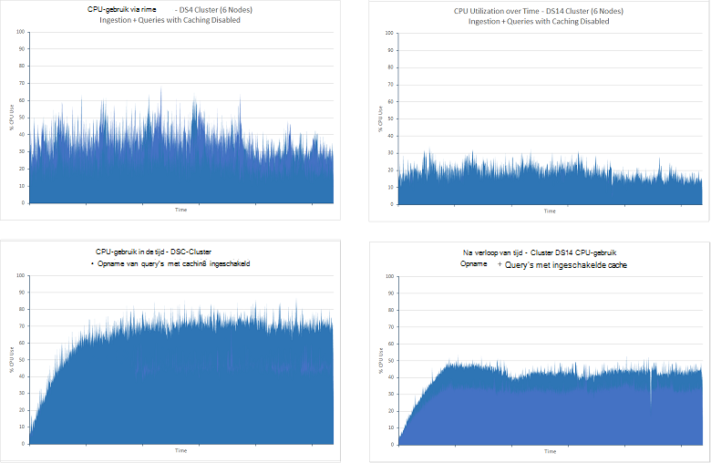

<properties
   pageTitle="Aggregatie- en prestaties met Elasticsearch op Azure tuning | Microsoft Azure"
   description="Een overzicht van overwegingen bij het optimaliseren van de prestaties van query's en zoeken voor Elasticsearch."
   services=""
   documentationCenter="na"
   authors="dragon119"
   manager="bennage"
   editor=""
   tags=""/>

<tags
   ms.service="guidance"
   ms.devlang="na"
   ms.topic="article"
   ms.tgt_pltfrm="na"
   ms.workload="na"
   ms.date="09/22/2016"
   ms.author="masashin"/>
   
# <a name="tuning-data-aggregation-and-query-performance-with-elasticsearch-on-azure"></a>Aggregatie- en prestaties met Elasticsearch op Azure afstemmen

[AZURE.INCLUDE [pnp-header](../../includes/guidance-pnp-header-include.md)]

Dit artikel maakt [deel uit van een serie](guidance-elasticsearch.md). 

De voornaamste reden voor het gebruik van Elasticsearch is het zoeken naar gegevens ondersteunen. Gebruikers moeten kunnen de informatie die zij zoeken snel vinden. Het systeem moet bovendien kunnen gebruikers vragen van de gegevens, zoeken naar correlaties en komen tot conclusies die kunnen zakelijke beslissingen te nemen. Deze verwerking is wat gegevens van informatie onderscheidt.

Dit document bevat een overzicht van de opties die u overwegen kunt bij het bepalen van de beste manier voor het optimaliseren van uw systeem voor query- en prestaties.

Alle aanbevelingen van de prestaties zijn grotendeels op de scenario's die van toepassing zijn op uw situatie, afhankelijk van de omvang van de gegevens die u indexeert, en de snelheid waarmee toepassingen en gebruikers uw gegevens opvragen. De resultaten van elke wijziging moet grondig worden getest in de configuratie of indexing structuur met behulp van uw eigen gegevens en de werklast voor de beoordeling van de voordelen voor uw specifieke scenario's. Dit document beschrijft ook een aantal benchmarks die zijn uitgevoerd voor een specifieke scenario geïmplementeerd met behulp van verschillende configuraties te dien einde. De aanpak voor de beoordeling van de prestaties van uw eigen systemen, kunt u aanpassen. De details van deze tests worden beschreven in het [aanhangsel](#appendix-the-query-and-aggregation-performance-test).

## <a name="index-and-query-performance-considerations"></a>Overwegingen voor index- en prestaties

Deze sectie worden enkele algemene factoren die u moet denken over wanneer ontwerpen deze behoefte aan ondersteuning voor snel zoeken en zoeken indexen.

### <a name="storing-multiple-types-in-an-index"></a>Verschillende typen op te slaan in een index

Een index Elasticsearch kan meerdere itemtypen bevatten. Het is wellicht beter om te voorkomen dat deze aanpak en een afzonderlijke index maken voor elk type. Houd rekening met de volgende punten:

- Verschillende typen mogelijk verschillende analyzers opgeven en het is niet altijd duidelijk welke Elasticsearch moet worden gebruikt als een query wordt uitgevoerd op het indexniveau van de en niet op het niveau van soort analyzer. [Type Gotchas voorkomen](https://www.elastic.co/guide/en/elasticsearch/guide/current/mapping.html#_avoiding_type_gotchas) Zie voor meer informatie.

- Shards voor indexen die meerdere typen bevatten waarschijnlijk groter zijn dan die voor de indexen die één type bevatten. De grotere een shard, meer inspanning vereist is door Elasticsearch gegevens bij het uitvoeren van query's.

- Als er een significant verschil wordt gevonden tussen hoeveelheden voor de typen gegevens, kan informatie voor één type zeer worden verdeeld over veel shards waardoor de doelmatigheid van zoekopdrachten waarmee u deze gegevens op te halen.

    

    ***De gevolgen van het delen van een index tussen typen*** 

    In het bovenste gedeelte van het diagram wordt dezelfde index gedeeld door de documenten van het type A en type B. Er zijn veel meer documenten van het type A dan type die b. zoekt een type betrekking hebben op alle vier shards opvragen. Het onderste gedeelte van het diagram illustreert het effect als aparte indexen worden gemaakt voor elk type. In dit geval vereist zoekt u naar een type slechts toegang tot twee shards.

- Kleine shards kunnen meer gelijkmatig verdeelde dan grote shards, waardoor het gemakkelijker voor Elasticsearch aan de belasting over de knooppunten verspreid worden.

- Verschillende typen mogelijk verschillende aanhoudperiode. Kan het moeilijk zijn oude gegevens die shards met actieve gegevens deelt archiveren.


Onder bepaalde omstandigheden een index delen in verschillende typen kan echter worden efficiënt als:

- Zoekopdrachten span regelmatig typen op dezelfde positie gehouden.

- De typen hebben slechts een klein aantal documenten elke. Onderhouden van een afzonderlijke set shards voor elk type kan resulteren in een aanzienlijke overhead in dit geval.


### <a name="optimizing-index-types"></a>Index typen optimaliseren

Een index Elasticsearch bevat een kopie van de oorspronkelijke JSON-documenten die zijn gebruikt voor het vullen. Deze informatie wordt bewaard de [* \_bron*](https://www.elastic.co/guide/en/elasticsearch/reference/current/mapping-source-field.html#mapping-source-field) van elk item geïndexeerde veld. Deze gegevens niet kan worden gezocht, maar standaard wordt geretourneerd door de * *get* - en* aanvragen. Dit veld wordt echter overhead in rekening worden gebracht en opslag, zodat shards groter en verhoging van het volume van de I/O uitgevoerd in beslag neemt. U kunt uitschakelen de * \_bron* op basis van per type:

```http
PUT my_index
{
  "mappings": {
    "my_type": {
      "_source": {
        "enabled": false
      }
    }
  }
}
```
Als u dit veld uitschakelt, verwijdert ook de mogelijkheid om de volgende bewerkingen uitvoeren:

- Gegevens in de index wordt bijgewerkt met de *update* API.

- Uitvoeren van zoekopdrachten die gemarkeerde gegevens ophalen.

- Opnieuw indexeren van een index van Elasticsearch naar een andere.

- Toewijzingen of analyse-instellingen wijzigen.

- Query's voor foutopsporing door het oorspronkelijke document te bekijken.


### <a name="reindexing-data"></a>Gegevens opnieuw indexeren

Het aantal shards beschikbaar voor een index bepaalt uiteindelijk de capaciteit van de index. U kunt een eerste (en weloverwogen) inschatting van hoeveel shards vereist zal zijn, maar altijd rekening met uw document opnieuw indexeren strategie vooraf. In veel gevallen opnieuw indexeren is mogelijk een beoogde taak gegevens groeit. U kunt niet toewijzen van een groot aantal shards aan een index in eerste instantie voor search optimalisatie, maar nieuwe shards toewijzen als het volume van de gegevens wordt vergroot. In andere gevallen opnieuw indexeren mogelijk moeten worden uitgevoerd op meer ad hoc basis als de schattingen over de groei naar volume gegevens gewoon blijken te kloppen.

> [AZURE.NOTE] Opnieuw indexeren niet mogelijk voor gegevens die snel veroudert. In dit geval kan een toepassing een nieuwe index maken voor elke periode. Voorbeelden zijn prestatielogboeken of gegevens die kunnen worden opgeslagen in een nieuwe index elke dag controleren.

<!-- -->

Effectief indexeren betrekking heeft op een nieuwe index te maken van de gegevens in de oude en de oude index wordt vervolgens verwijderd. Dit proces kan enige tijd duren als een index te groot is, en moet u ervoor zorgen dat de gegevens gedurende deze periode doorzoekbaar blijft. Om deze reden moet u een [alias voor elke index](https://www.elastic.co/guide/en/elasticsearch/reference/current/indices-aliases.html)maken en query's gegevens via deze alias moeten ophalen. Tijdens het opnieuw indexeren, houden de alias die verwijst naar de oude index en Ga om te verwijzen naar de nieuwe index zodra het indexeren is voltooid. Deze aanpak is ook handig voor toegang tot gegevens op basis van tijd dat een nieuwe index elke dag maakt. Voor toegang tot de huidige gegevens gebruikt u een alias die over naar de nieuwe index rolt wanneer deze wordt gemaakt.

### <a name="managing-mappings"></a>Toewijzingen beheren

Toewijzingen Elasticsearch gebruikt om te bepalen hoe de gegevens die in elk veld in een document voorkomt te interpreteren. Elk type heeft zijn eigen toewijzing waarin effectief een schema voor dat type. Elasticsearch gebruikt deze informatie voor het genereren van omgekeerde indexen voor elk veld in de documenten in een type. In een document heeft elk veld een gegevenstype (zoals *tekenreeksen*, *datum*of *lange*) en een waarde. De toewijzingen voor een index kunt u opgeven wanneer de index wordt gemaakt of ze door Elasticsearch worden afgeleid wanneer nieuwe documenten worden toegevoegd aan een type. Echter rekening houden met de volgende punten:

- Toewijzingen dynamisch gegenereerde kunnen fouten afhankelijk van hoe de velden worden geïnterpreteerd wanneer documenten worden toegevoegd aan een index veroorzaken. Bijvoorbeeld 1 document kan een veld dat een getal bevat een bevatten en oorzaken Elasticsearch toe te voegen een koppeling die dat aangeeft dit veld is *lang*. Als een volgende document is toegevoegd in welk veld een niet-numerieke gegevens bevat, dan zal mislukken. In dit geval moet een veld waarschijnlijk hebben is geïnterpreteerd als een reeks wanneer het eerste document is toegevoegd. Deze toewijzing op te geven wanneer de index wordt gemaakt, kan helpen om dergelijke problemen te voorkomen.

- Ontwerp uw documenten om te voorkomen dat uitzonderlijk groot toewijzingen gegenereerd als dit kunt aanzienlijke overhead toevoegen tijdens het uitvoeren van zoekopdrachten, veel geheugen in beslag nemen en ook voor zorgen query's dat worden uitgevoerd om gegevens te zoeken. Een consistente naamgeving van velden in de documenten met hetzelfde type vast. Bijvoorbeeld geen veldnamen gebruiken zoals 'Voornaam', 'Voornaam' en 'Voornaam' in verschillende documenten. Gebruik dezelfde veldnaam in elk document. Probeer ook geen waarden als sleutels gebruiken (dit is een gemeenschappelijke aanpak in de kolom familie databases, maar kan leiden tot Ondoelmatigheden en fouten met Elasticsearch.) Zie [Explosie toewijzen](https://www.elastic.co/blog/found-crash-elasticsearch#mapping-explosion)voor meer informatie.

- Gebruik *not_analyzed* om te voorkomen dat tokeniseren waar nodig. Bijvoorbeeld als een document bevat een veld met de naam *gegevens* die in het bezit van de waarde "ABC-DEF" u mogelijk probeer te zoeken naar alle documenten die overeenkomen met deze waarde als volgt:

  ```http
  GET /myindex/mydata/_search
  {
    "query" : {
      "filtered" : {
        "filter" : {
          "term" : {
            "data" : "ABC-DEF"
          }
        }
      }
    }
  }
  ```

 Deze zoekopdracht wordt echter niet het verwachte resultaat door de manier waarop de tekenreeks ABC-DEF is ge? exeerd wanneer deze wordt geïndexeerd. Dit wordt effectief gesplitst in twee tokens, ABC en DEF, met een afbreekstreepje. Deze functie is ontworpen voor de ondersteuning van volledige tekst zoeken, maar als u wilt dat de tekenreeks die moet worden geïnterpreteerd als een enkel item atomaire tokeniseren moet worden uitgeschakeld wanneer het document wordt toegevoegd aan de index. U kunt een toewijzing zoals deze:

  ```http
  PUT /myindex
  {
    "mappings" : {
      "mydata" : {
        "properties" : {
          "data" : {
            "type" : "string",
            "index" : "not_analyzed"
          }
        }
      }
    }
  }
  ```

  Zie voor meer informatie de [Exacte waarden zoeken](https://www.elastic.co/guide/en/elasticsearch/guide/current/_finding_exact_values.html#_term_filter_with_text).


### <a name="using-doc-values"></a>Met behulp van doc-waarden

Veel query's en aggregaties vereisen dat gegevens moeten worden gesorteerd als onderdeel van de zoekbewerking. Sorteren is vereist dat een of meer voorwaarden toewijzen aan een lijst met documenten. Om dit proces, laden Elasticsearch alle waarden voor een veld dat wordt gebruikt als sleutel voor sorteren in het geheugen. Deze informatie wordt *fielddata*genoemd. De bedoeling is dat fielddata in het geheugen opslaan in de cache wordt het systeem minder I/O en mogelijk sneller dan herhaaldelijk dezelfde gegevens te lezen van de schijf. Als er een veld kan hoog de kardinaliteit van de fielddata in het geheugen bewaren echter veel opslagruimte, mogelijk invloed op de mogelijkheid andere gelijktijdige bewerkingen uit te voeren of zelfs opgevist opslag Elasticsearch storing veroorzaakt verbruiken.

Als een alternatieve benadering ondersteunt Elasticsearch ook *doc-waarden*. De waarde van een document is vergelijkbaar met een artikel van fielddata in het geheugen, behalve dat het wordt opgeslagen op schijf en wanneer de gegevens worden opgeslagen in een index gemaakt (fielddata is vervaardigd dynamisch wanneer een query wordt uitgevoerd.) Doc-waarden niet veel ruimte heap en nuttig zijn voor query's die sorteren of statistische gegevens over die velden een zeer groot aantal unieke waarden kunnen bevatten. Bovendien kunt het minder druk op de heap worden gecompenseerd met de prestatieverschillen tussen het ophalen van gegevens van schijf en uit het geheugen te lezen. Garbage collector is waarschijnlijk minder vaak optreden en andere gelijktijdige bewerkingen die gebruikmaken van geheugen zijn minder waarschijnlijk worden gedaan.

U- of doc-waarden op basis van een index met behulp van het kenmerk *doc_values* per eigenschap uitschakelen, zoals in het volgende voorbeeld wordt getoond:

```http
PUT /myindex
{
  "mappings" : {
    "mydata" : {
      "properties" : {
        "data" : {
          ...
          "doc_values": true
        }
      }
    }
  }
}
```
> [AZURE.NOTE] Doc-waarden zijn standaard met Elasticsearch vanaf versie 2.0.0.

De exacte gevolgen van doc-waarden is waarschijnlijk zeer specifiek zijn voor uw eigen gegevens- en scenario's, dus bereid te verrichten prestaties testen om vast te stellen hun nut. Bedenk dat waarden die niet met velden geanalyseerde string werken doc. Voor meer informatie Zie [Doc-waarden](https://www.elastic.co/guide/en/elasticsearch/guide/current/doc-values.html#doc-values).

### <a name="using-replicas-to-reduce-query-contention"></a>Replica's via te verminderen van query bronconflicten

Er is een gemeenschappelijke strategie te verhogen de prestaties van query's veel replica's van elke index maken. Gegevens ophalen van bedrijfsactiviteiten kunnen worden voldaan door het ophalen van gegevens uit een replica. Echter deze strategie kan ernstige gevolgen hebben de prestaties van de opname bewerkingen, dient met zorg in scenario's met betrekking gemengde werklasten tot worden gebruikt. Deze strategie is bovendien alleen van voordeel als replica's zijn verdeeld over de knooppunten en onderling niet concurreren voor resources met primaire shards die deel van dezelfde index uitmaken. Houd er rekening mee dat het mogelijk is te vergroten of verkleinen van het aantal replica's van een index dynamisch.

### <a name="using-the-shard-request-cache"></a>Met behulp van de cache shard aanvraag

Elasticsearch kunt cache van de lokale gegevens aangevraagd door query's op elke shard in het geheugen. Dit kunnen zoeken en ophalen van dezelfde gegevens sneller uitvoeren, gegevens uit de opslag van geheugen in plaats van een schijf kunnen worden gelezen. Het cachen van gegevens op deze manier kan dus prestaties van bepaalde zoekbewerkingen, ten koste van vermindering van de hoeveelheid geheugen die beschikbaar is voor andere taken die gelijktijdig wordt uitgevoerd. Er is ook het risico dat gegevens uit de cache betekend is verouderd. De gegevens in de cache ongeldig wordt alleen gemaakt wanneer de shard wordt vernieuwd en de gegevens zijn gewijzigd. De frequentie van vernieuwingen wordt geregeld door de waarde van de instelling *serienummer vernieuwingsinterval* van de index.

De aanvraag voor een index caching is standaard uitgeschakeld, maar kunt u deze als volgt inschakelen:

```http
PUT /myindex/_settings
{
  "index.requests.cache.enable": true
}
```

De aanvraag shard cache is het meest geschikt voor informatie die nog tamelijk statisch, zoals historische of als de registratie van gegevens.

### <a name="using-client-nodes"></a>Met behulp van client-knooppunten

Alle query's worden verwerkt door het knooppunt dat eerst de aanvraag ontvangt. Dit knooppunt verder verzoeken verzendt naar alle andere knooppunten met shards voor de indexcijfers wordt opgevraagd en worden vervolgens de resultaten voor het retourneren van de reactie bij elkaar opgeteld. Als een query moet het aggregeren van gegevens of het uitvoeren van complexe berekeningen, is het eerste knooppunt verantwoordelijk voor het uitvoeren van de juiste verwerking. Als uw systeem moet een relatief klein aantal complexe query's ondersteunen, kunt u het maken van een groep van client knooppunten te verlichten de werklast van de gegevensknooppunten. Omgekeerd, als uw systeem is voor het verwerken van een groot aantal eenvoudige query's, indienen deze verzoeken rechtstreeks naar de gegevensknooppunten en een taakverdeling met het gelijkmatig verdelen van de aanvragen.

### <a name="tuning-queries"></a>Query's afstemmen

Tips voor het maximaliseren van de prestaties van query's Elasticsearch worden samengevat door de volgende punten:

- Query's met jokertekens, zoveel mogelijk vermijden.

- Als hetzelfde veld onderworpen aan de volledige tekst zoeken en exact overeenkomen is, kunt opslaan van de gegevens voor het veld in formulieren geanalyseerd en nonanalyzed. Uitvoeren van volledige-tekstzoekacties tegen het veld geanalyseerd en exact overeenkomen met de nonanalyzed het veld.

- Retourneert alleen de gegevens nodig. Als u grote documenten hebt, maar een toepassing alleen nodig informatie in een subset van de velden, het resultaat deze subset van query's in plaats van hele documenten. Deze strategie kunt verminderen de bandbreedtevereisten netwerk van het cluster.

- Waar mogelijk, moet u filters gebruiken in plaats van query's bij het zoeken naar gegevens. Een filter bepaalt alleen of een document overeenkomt met een bepaald criterium voldoen dat u een query berekent ook hoe dicht een overeenkomst een document is (score). Intern, de waarden die zijn gegenereerd door een filter worden opgeslagen als een bitmap die geschikt is voor elk document aangeeft match/Nee en ze kunnen worden opgeslagen in Elasticsearch. Als het dezelfde filtercriterium vervolgens optreedt, kunt u de bitmap wordt opgehaald uit de cache en gebruikt voor het ophalen van de overeenkomstige documenten snel. Voor meer informatie, Zie de [Interne werking van het Filter](https://www.elastic.co/guide/en/elasticsearch/guide/current/_finding_exact_values.html#_internal_filter_operation).

- *Bool* filters gebruiken voor het uitvoeren van statische vergelijkingen en *en*, *of*en *niet* de filters alleen gebruiken voor dynamisch berekende filters, zoals die met betrekking tot het uitvoeren van scripts of de *geo -\* * filters.

- Als een query *bool* filters met *en* *of combineert*of *niet* met *geo -* * filters, plaatst u de *en*/*of*/*niet geo-** filters laatst zodat ze op de kleinst mogelijke voor gegevensverzameling werken.

    Op deze manier gebruiken een *post_filter* dure filter bewerkingen uitvoeren. Laatst worden deze filters uitgevoerd.

- Aggregaties gebruiken in plaats van facetten. Voorkomen dat de berekening van aggregaten die worden geanalyseerd of hebben veel van de mogelijke waarden.

    > **Opmerking**: in versie 2.0.0 Elasticsearch facetten zijn verwijderd.

- De *Kardinaliteit* samenvoeging plaats van de samenvoeging van *value_count* gebruiken, tenzij uw toepassing vereist een exact aantal overeenkomende objecten. Een exacte telling kunt snel verouderd raken en vele toepassingen vereisen alleen een redelijke benadering.

- Vermijd het uitvoeren van scripts. Scripts in query's en filters kunnen erg duur zijn en de resultaten niet in de cache opgeslagen. Langdurige scripts zoeken threads voor onbepaalde tijd, veroorzaakt door de volgende aanvragen in de wachtrij kunnen worden gebruikt. Als de wachtrij vol, verdere aanvragen afgewezen.

## <a name="testing-and-analyzing-aggregation-and-search-performance"></a>Testen en aggregatie- en Prestatie-analyse

Deze sectie beschrijft de resultaten van een reeks tests die zijn uitgevoerd tegen verschillende cluster en index-configuraties. Twee typen tests zijn uitgevoerd, als volgt:

- * *De *opname en de query* testen **. Deze test wordt gestart met een lege index die is gevuld als de test wordt voorafgegaan door het uitvoeren van bulk insert-bewerkingen (1000 documenten toegevoegd elke bewerking). Op hetzelfde moment, zijn een aantal query's die zijn ontworpen om te zoeken naar documenten die worden toegevoegd tijdens de voorafgaande periode van 15 minuten en genereert aggregaties 5 tweede tussenpozen herhaald. Deze test is meestal mag worden uitgevoerd gedurende 24 uur om de effecten van een uitdagende werkbelasting die grootschalige gegevens via de mond met realtime-query's in de buurt.

- **De *query alleen-* **testen. Deze test is vergelijkbaar met de *via ingestie en query* , behalve dat het deel van de opname wordt weggelaten en de index op elk knooppunt wordt vooraf ingevuld met 100 miljoen documenten testen. Een aangepaste set query's wordt uitgevoerd; het beperken van de documenten die zijn toegevoegd in de laatste 15 minuten tijdselement is verwijderd omdat de gegevens nu statische. De proeven worden uitgevoerd voor 90 minuten, er is minder tijd nodig om een patroon prestaties als gevolg van het vaste bedrag van de gegevens te bepalen.

---

Elk document in de index had hetzelfde schema. Deze tabel bevat een overzicht van de velden in het schema:

Naam                          | Type         | Notities |
  ----------------------------- | ------------ | -------------------------------------------------------- |
  Organisatie                  | Tekenreeks      | De test genereert 200 unieke organisaties. |
  CustomField1 - CustomField5   |Tekenreeks       |Dit zijn de vijf reeks velden die zijn ingesteld op een lege tekenreeks.|
  DateTimeRecievedUtc           |Tijdstempel    |De datum en tijd waarop het document is toegevoegd.|
  Host                          |Tekenreeks       |Dit veld is ingesteld op een lege tekenreeks.|
  HttpMethod                    |Tekenreeks       |Dit veld is ingesteld op een van de volgende waarden: "Boeken", "GET", "Plaats".|
  HttpReferrer                  |Tekenreeks       |Dit veld is ingesteld op een lege tekenreeks.|
  HttpRequest                   |Tekenreeks       |Dit veld wordt gevuld met willekeurige tekst tussen 10 en 200 tekens bevatten.|
  HttpUserAgent                 |Tekenreeks       |Dit veld is ingesteld op een lege tekenreeks.|
  HttpVersion                   |Tekenreeks       |Dit veld is ingesteld op een lege tekenreeks.|
  Organisatienaam              |Tekenreeks       |Dit veld is ingesteld op dezelfde waarde als het veld organisatie.|
  SourceIp                      |IP           |Dit veld bevat een IP-adres de ' oorsprong ' van de gegevens. |
   SourceIpAreaCode              |Lange         |Dit veld is ingesteld op 0.|
  SourceIpAsnNr                 |Tekenreeks       |Dit veld is ingesteld op ' AS\#\#\#\#\#".|
  SourceIpBase10                |Lange         |Dit veld is ingesteld op 500.|
  SourceIpCountryCode           |Tekenreeks       |Dit veld bevat de landcode van een 2-teken. |
  SourceIpCity                  |Tekenreeks       |Dit veld bevat een tekenreeks die een stad in een land. |
  SourceIpLatitude              |Getal met dubbele precisie       |Dit veld bevat een willekeurige waarde.|
  SourceIpLongitude             |Getal met dubbele precisie       |Dit veld bevat een willekeurige waarde.|
  SourceIpMetroCode             |Lange         |Dit veld is ingesteld op 0.|
  SourceIpPostalCode            |Tekenreeks       |Dit veld is ingesteld op een lege tekenreeks.|
  SourceLatLong                 |Geo-punt   |Dit veld is ingesteld op een willekeurige geo-punt.|
  Bronpoort                    |Tekenreeks       |Dit veld wordt gevuld met de reeksaanduiding van een willekeurig getal.|
  TargetIp                      |IP           |Dit wordt gevuld met een willekeurig IP-adres in het bereik van 0.0.100.100-255.9.100.100.|
  SourcedFrom                   |Tekenreeks       |Dit veld is ingesteld op de tekenreeks 'MonitoringCollector'.|
  TargetPort                    |Tekenreeks       |Dit veld wordt gevuld met de reeksaanduiding van een willekeurig getal.|
  Classificatie                        |Tekenreeks       |Dit veld wordt gevuld met een van de 20 verschillende tekenreekswaarden die willekeurig worden geselecteerd.|
  UseHumanReadableDateTimes     |Boole-waarde      |Dit veld is ingesteld op false.|
 
De volgende query's zijn als batch uitgevoerd door elke herhaling van de proeven. De namen cursief worden gebruikt om te verwijzen naar deze query's in de rest van dit document. Opmerking: de tijd-criterium (documenten die zijn toegevoegd in de laatste 15 minuten) is weggelaten uit de *query alleen* tests:

- Hoeveel documenten met elke waarde *beoordeling* zijn ingevoerd in de laatste 15 minuten (*beoordeling door Count*)? 

- Hoeveel documenten zijn toegevoegd in elk interval van 5 minuten gedurende de laatste 15 minuten (*aantal na verloop van tijd*)?

- Hoeveel documenten van elke waarde *score* zijn toegevoegd voor elk land in de laatste 15 minuten (*treffers per land*)?

- Welke 15 organisaties optreden de meeste vaak in documenten die zijn toegevoegd in de laatste 15 minuten (*Top 15 organisaties*)?

- Hoeveel verschillende organisaties optreden in documenten die worden toegevoegd in de laatste 15 minuten (*aantal unieke organisaties*)?

- Hoeveel documenten zijn toegevoegd in de laatste 15 minuten (*Totaal aantal treffers count*)?

- Hoeveel verschillende *SourceIp* -waarden voorkomen in documenten die zijn toegevoegd in de laatste 15 minuten (*het aantal unieke IP*)?


De definitie van de index en de details van de query's worden beschreven in het [aanhangsel](#appendix-the-query-and-aggregation-performance-test).

De tests zijn ontworpen om de gevolgen van de volgende variabelen:

- Het **type schijf**. Tests zijn uitgevoerd op een cluster knooppunt 6 van D4 VMs met standaard opslag (harde schijven) en herhaald op een cluster 6-knooppunt van de DS4 VMs premium opslag (SSD).

- **Grootte van de machine - verticaal schalen**. Tests zijn uitgevoerd op een 6-node cluster met DS3 VMs (aangegeven als *kleine* cluster), herhaald op een cluster van VMs DS4 (), de *gemiddelde* cluster en herhaald op een cluster van machines DS14 ( *grote* cluster). De volgende tabel bevat een overzicht van de belangrijkste kenmerken van elke SKU VM:

 Cluster | VM SKU        | Aantal kernen | Aantal gegevensschijven | RAM-GEHEUGEN (GB) |
---------|---------------|-----------------|----------------------|----------|
 Kleine   | Standaard DS3  | 4               | 8                    | 14       |
 Gemiddeld  | Standaard DS4  | 8               | 16                   | 28       |
 Grote   | Standaard DS14 | 16              | 32                   | 112      |

- **Clustergrootte - schalen**. Tests werden uitgevoerd in clusters van DS14 VMs met 1, 3 en 6 knooppunten.

- **Aantal replica's index**. Tests werden uitgevoerd met behulp van indexen met replica's 1 en 2 geconfigureerd.

- **Doc-waarden**. In eerste instantie werden de tests uitgevoerd met de index instellen van *doc_values* is ingesteld op *true* (de standaardwaarde). Geselecteerde tests werden herhaald met *doc_values* ingesteld op *false*.

- **In de cache opslaan**. Tests zijn uitgevoerd met de shard aanvraag cache ingeschakeld op de index.

- **Aantal shards**. Tests werden herhaald met verschillende nummers van shards vast te stellen of query's efficiënter uitgevoerd via indexen met minder, grotere shards of meer, kleinere shards.


## <a name="performance-results---disk-type"></a>Prestatieresultaten - schijftype

Prestaties van de schijf is geëvalueerd door de test *via ingestie en een query* uit te voeren op het cluster 6-knooppunt van D4 VMs (met harde schijven) en op het cluster 6-knooppunt van de DS4 VMs (met SSD). De configuratie van Elasticsearch in beide clusters is hetzelfde. De gegevens is verspreid over 16 schijven op elk knooppunt, en elk knooppunt heeft 14GB RAM-geheugen toegewezen aan de Java virtual machine (JVM) met Elasticsearch, het resterende geheugen (ook 14GB) voor besturingssysteem gebruik is gegeven. Elke test wordt uitgevoerd gedurende 24 uur. Deze periode is geselecteerd, zodat de gevolgen van het toenemende aantal gegevens is gebleken en dat het systeem stabiel te houden. In de volgende tabel bevat een overzicht van de resultaten van de markering van de reactietijden van de verschillende bewerkingen die bestaat uit de test.

 Cluster | Bewerking/query            | Gemiddelde reactietijd (ms) |
---------|----------------------------|----------------------------|
 D4      | Opname                  | 978                        |
         | Aantal op waardering            | 103                        |
         | Tijd te tellen            | 134                        |
         | Aantal treffers per land            | 199                        |
         | Top 15 organisaties       | 137                        |
         | Het aantal unieke organisaties | 139                        |
         | Het aantal unieke IP-            | 510                        |
         | Telling van totaal aantal treffers           | 89                         |
 DS4     | Opname                  | 511                        |
         | Aantal op waardering            | 187                        |
         | Tijd te tellen            | 411                        |
         | Aantal treffers per land            | 402                        |
         | Top 15 organisaties       | 307                        |
         | Het aantal unieke organisaties | 320                        |
         | Het aantal unieke IP-            | 841                        |
         | Telling van totaal aantal treffers           | 236                        |

Het lijkt op het eerste gezicht dat het cluster DS4 uitgevoerd query's minder goed dan het cluster D4, soms verdubbelen (of slechter) de responstijd. Dit vertelt niet het hele verhaal wel. De volgende tabel bevat het nummer van de opname bewerkingen wordt uitgevoerd door elk cluster (Vergeet niet dat elke bewerking 1000 documenten laadt):

 Cluster | Item opname |
---------|---------------------------|
 D4      | 264769                    |
 DS4     | 503157                    |

Het cluster DS4 is bijna tweemaal zoveel gegevens dan het cluster D4 geladen tijdens de test. Daarom bij de analyse van de reactietijden voor elke bewerking, moet u ook rekening houden met hoeveel documenten elke query is gescand en hoeveel documenten worden geretourneerd. Dynamische afbeeldingen zijn als het volume van de documenten in de index voortdurend groeit. U kan 503137 door het 264769 (het nummer van de opname bewerkingen wordt uitgevoerd door elk cluster) te verdelen en vermenigvuldigt u het resultaat met de gemiddelde responstijd voor elke query die wordt uitgevoerd door het cluster D4 een vergelijkende informatie te geven als dit het bedrag van de I/O die gelijktijdig worden uitgevoerd door de bewerking van de opname wordt genegeerd. In plaats daarvan te meten van de fysieke hoeveelheid gegevens worden geschreven naar en gelezen van de schijf als u de test gaat door. Het testplan JMeter bevat deze informatie voor elk knooppunt. De samengevatte resultaten zijn:

 Cluster | Gemiddelde aantal bytes geschreven/gelezen door elke bewerking |
---------|----------------------------------------------|
 D4      | 13471557                                     |
 DS4     | 24643470                                     |

Deze gegevens geeft aan dat de cluster DS4 kunnen opbrengen een i/o-koers ongeveer 1,8 keer die van het cluster D4. Gezien het feit dat de aard van de schijven, met uitzondering van alle andere bronnen zijn hetzelfde, het verschil moet mogelijk te maken met behulp van SSD in plaats van harde schijven.

Om te helpen deze conclusie rechtvaardigen, de volgende grafieken illustreren hoe de I/O na verloop van tijd werd uitgevoerd door elk cluster:


<!-- -->

***Activiteit van de schijf voor de clusters D4 en DS4***

De grafiek voor het cluster D4 geeft aanzienlijke variatie, vooral tijdens de eerste helft van de test. Dit was waarschijnlijk door bandbreedteregeling op de i/o-snelheid verminderen. De query's in de eerste fasen van de test kan worden snel uitgevoerd omdat er weinig gegevens te analyseren. De schijven in het cluster D4 zijn daarom waarschijnlijk worden die dicht bij hun invoer/uitvoer-bewerkingen per tweede capaciteit (IOP's), hoewel elke i/o-bewerking kan niet worden veel gegevens retourneert. De DS4-cluster, kan ondersteuning voor een hogere snelheid van IOP's en heeft niet dezelfde mate van beperking lijden, de i/o-tarieven zijn regelmatiger. Ter ondersteuning van deze theorie, het volgende paar van grafieken laten zien hoe de CPU is geblokkeerd door de schijf I/O na verloop van tijd (de schijf de wachttijd in de grafieken weergegeven is de verhouding van de tijd dat de CPU die wachten op I/O):


***CPU, schijf i/o-wachttijden voor de clusters D4 en DS4***

Het is belangrijk om te weten dat er twee overheersende redenen voor i/o-bewerkingen voor het blokkeren van de CPU zijn:

- Het i/o-subsysteem kan lezen of schrijven van gegevens naar of van de schijf.

- Het i/o-subsysteem kan worden verminderd door de hostomgeving. Azure schijven geïmplementeerd met behulp van harde schijven hebben een maximale capaciteit van 500 IOP's en SSD hebben een maximale doorvoer van 5000 IOP's.


Voor het cluster D4 de hoeveelheid tijd besteed aan het wachten op I/O tijdens de eerste helft van de test is afgestemd nauw op omgekeerde wijze met de grafiek met de i/o-tarieven. Perioden van weinig I/O overeenkomen met tijdvakken van heel wat tijd de processor besteedt aan geblokkeerde, zijn de I/O wordt verminderd. Als u meer gegevens aan het cluster toegevoegd, de wijzigingen van de situatie en in de tweede helft van de pieken van de test in i/o-wachttijden corresponderen met pieken in het i/o-doorvoer. Op dit moment wordt de CPU geblokkeerd bij het uitvoeren van echte I/O. Nogmaals, is de wachttijd voor I/O met het cluster DS4 veel gelijkmatiger. Elke piek komt overeen met een overeenkomstige piek in i/o-prestaties in plaats van een dieptepunt, dit houdt in dat er is weinig of geen bandbreedteregeling plaatsvindt.

Er is een andere factor om te overwegen. Het cluster D4 gegenereerd tijdens de test 10584 ingestie fouten, en 21 query. De test op het cluster DS4 geproduceerd zonder fouten.

## <a name="performance-results---scaling-up"></a>Prestatieresultaten - verticaal schalen

Scale-up getest door het uitvoeren van tests tegen clusters van DS3, DS4 en DS14 VMs 6-knooppunt. Deze SKU's zijn geselecteerd, omdat een VM DS4 tweemaal zoveel CPU cores en geheugen als een DS3 biedt en een machine DS14 de CPU-bronnen opnieuw verdubbelt terwijl de vier keer de hoeveelheid geheugen. In de volgende tabel worden de belangrijkste aspecten van elke SKU vergeleken:

 SKU  | \#CPU-kernen | Geheugen (GB) | Max schijf IOP 's | Maximale bandbreedte (in MB/s)|
------|-------------|-------------|---------------|--------------|
 DS3  | 4           | 14          | 12,800| 128 |
 DS4  | 8           | 28          | 25,600| 256 |
 DS14 | 16          | 112         | 50.000| 512 |

De volgende tabel bevat een overzicht van de resultaten van de tests uitgevoerd op de kleine (DS3), Gemiddeld (DS4) en grote (DS14)-clusters. Elke VM gebruikt SSD voor de gegevens. Elke test wordt uitgevoerd gedurende 24 uur.

De tabel geeft het aantal aanvragen voor elk type query (storingen zijn niet inbegrepen). Het aantal aanvragen voor elk type query geprobeerd is ongeveer hetzelfde tijdens een uitvoering van de test. Dit komt doordat het testplan JMeter één exemplaar van elke query (telling door beoordeling, tijd te tellen treffers per land, Top 15 organisaties, unieke aantal organisaties, het aantal unieke IP- en Totaaltelling treffers) samen in één apparaat bekend als een *transactie testen voert* (deze transactie is onafhankelijk van de taak die wordt uitgevoerd door een aparte thread ingestie bewerking uitvoert). Elke herhaling van het testplan wordt een transactie met één test uitgevoerd. Het aantal testtransacties voltooid is derhalve een maatregel van de reactietijd van de langzaamste query in elke transactie.

| Cluster      | Bewerking/query            | Het aantal aanvragen | Gemiddelde reactietijd (ms) |
|--------------|----------------------------|--------------------|----------------------------|
| Klein (DS3)  | Opname                  | 207284             | 3328                       |
|              | Aantal op waardering            | 18444              | 268                        |
|              | Tijd te tellen            | 18444              | 340                        |
|              | Aantal treffers per land            | 18445              | 404                        |
|              | Top 15 organisaties       | 18439              | 323                        |
|              | Het aantal unieke organisaties | 18437              | 338                        |
|              | Het aantal unieke IP-            | 18442              | 468                        |
|              | Telling van totaal aantal treffers           | 18428              | 294   
|||||
| Normaal (DS4) | Opname                  | 503157             | 511                        |
|              | Aantal op waardering            | 6958               | 187                        |
|              | Tijd te tellen            | 6958               | 411                        |
|              | Aantal treffers per land            | 6958               | 402                        |
|              | Top 15 organisaties       | 6958               | 307                        |
|              | Het aantal unieke organisaties | 6956               | 320                        |
|              | Het aantal unieke IP-            | 6955               | 841                        |
|              | Telling van totaal aantal treffers           | 6958               | 236                        |
|||||
| Groot (DS14) | Opname                  | 502714             | 511                        |
|              | Aantal op waardering            | 7041               | 201                        |
|              | Tijd te tellen            | 7040               | 298                        |
|              | Aantal treffers per land            | 7039               | 363                        |
|              | Top 15 organisaties       | 7038               | 244                        |
|              | Het aantal unieke organisaties | 7037               | 283                        |
|              | Het aantal unieke IP-            | 7037               | 681                        |
|              | Telling van totaal aantal treffers           | 7038               | 200                        |

In deze afbeeldingen ziet dat voor deze test, de prestaties van het cluster DS4 en DS14 zijn redelijk vergelijkbaar. De reactietijden voor de querybewerkingen voor het cluster DS3 verschijnen ook in eerste instantie fotoprinters vergelijken en het aantal querybewerkingen is ver boven de waarden voor het cluster DS4 en DS14. Een moet ook nemen echter sterk bericht van de opname snelheid en de daaruit voortvloeiende aantal documenten wordt gezocht. In het cluster DS3 ingestie veel meer wordt beperkt en aan het einde van de test uit de database alleen ongeveer 40% van de documenten die in worden gelezen door elk van de twee clusters. Dit kan het gevolg zijn van de verwerkingscapaciteit, netwerk en schijf bandbreedte die beschikbaar is voor een DS3 VM in vergelijking met een DS4 of DS14 VM. Gezien het feit dat een VM DS4 tweemaal zoveel bronnen die beschikbaar zijn als een DS3 VM heeft en een DS14 tweemaal (viermaal voor geheugen) de bronnen van een VM DS4, één vraag blijft: Waarom is het verschil tussen de DS4 en DS14 clusters ingestie tarieven aanzienlijk kleiner zijn dan tussen de DS3 en DS4 clusters? Dit kan het gevolg zijn van het netwerkgebruik en bandbreedte grenzen van VMs Azure. De onderstaande grafieken geven deze gegevens voor alle drie de clusters:


**Voor het uitvoeren van de test via ingestie en query DS3, DS4 en DS14-clusters van netwerk in gebruik** 

<!-- -->

De grenzen van de beschikbare netwerkbandbreedte met Azure VMs worden niet gepubliceerd en kunnen variëren, maar het feit dat de netwerkactiviteit lijkt te zijn gedaald, vlakte het uit op een gemiddelde van ongeveer 2.75GBps voor zowel de DS4 en DS14 tests stelt voor dat een dergelijke limiet is bereikt en de primaire factor bij het beperken van doorvoer is geworden. In het geval van het cluster DS3 is de activiteit op het netwerk aanzienlijk lager zodat de lagere prestaties waarschijnlijk meer als gevolg van beperkingen in de beschikbaarheid van andere bronnen.

Voor het isoleren van de gevolgen van de opname bewerkingen en illustreren hoe prestaties van query's als knooppunten schalen varieert, is een reeks tests alleen query uitgevoerd met behulp van de knooppunten hetzelfde. De volgende tabel bevat een overzicht van de resultaten op elk cluster:

> [AZURE.NOTE] U moet geen vergelijking gemaakt met de prestaties en het aantal aanvragen dat is uitgevoerd door query's in de *query alleen* test die door de test *via ingestie en een query* uitvoeren. Dit komt doordat de query's zijn gewijzigd en de omvang van de betrokken documenten verschilt.

| Cluster      | Bewerking/query            | Het aantal aanvragen | Gemiddelde reactietijd van Ttme (ms) |
|--------------|----------------------------|--------------------|----------------------------|
| Klein (DS3)  | Aantal op waardering            | 464                | 11758                      |
|              | Tijd te tellen            | 464                | 14699                      |
|              | Aantal treffers per land            | 463                | 14075                      |
|              | Top 15 organisaties       | 464                | 11856                      |
|              | Het aantal unieke organisaties | 462                | 12314                      |
|              | Het aantal unieke IP-            | 461                | 19898                      |
|              | Telling van totaal aantal treffers           | 462                | 8882  
|||||
| Normaal (DS4) | Aantal op waardering            | 1045               | 4489                       |
|              | Tijd te tellen            | 1045               | 7292                       |
|              | Aantal treffers per land            | 1053               | 7564                       |
|              | Top 15 organisaties       | 1055               | 5066                       |
|              | Het aantal unieke organisaties | 1051               | 5231                       |
|              | Het aantal unieke IP-            | 1051               | 9228                       |
|              | Telling van totaal aantal treffers           | 1051               | . 2180                       |
|||||
| Groot (DS14) | Aantal op waardering            | 1842               | 1927                       |
|              | Tijd te tellen            | 1839               | 4483                       |
|              | Aantal treffers per land            | 1838               | 4761                       |
|              | Top 15 organisaties       | 1842               | 2117                       |
|              | Het aantal unieke organisaties | . 1837               | 2393                       |
|              | Het aantal unieke IP-            | . 1837               | 7159                       |
|              | Telling van totaal aantal treffers           | . 1837               | 642                        |

Deze tijd, de ontwikkeling van de gemiddelde responstijden via verschillende clusters is duidelijker. Netwerkgebruik ruim onder de 2.75GBps die eerder door de DS4 en DS14 clusters (die waarschijnlijk het netwerk in de tests via ingestie en query verzadigd) vereist is en de 1.5GBps voor het cluster DS3. Het is in feite dichter bij 200MBps in alle gevallen zoals aangegeven door de onderstaande grafieken:


***Netwerk voor de DS3, DS4 en DS14 clusters uitvoeren van de query alleen-lezen-test*** 

De beperkende factor in de DS3 en DS4 clusters nu lijkt CPU-gebruik bijna 100% voor veel van de tijd is. In de DS14 cluster het CPU-gebruik het gemiddelde van iets meer dan 80%. Dit is nog steeds hoog, maar worden de voordelen van meer CPU-cores beschikbaar duidelijk gemarkeerd. De volgende afbeelding ziet u de gebruikspatronen CPU voor de DS3 en DS4 DS14 clusters.


***CPU-gebruik voor het uitvoeren van de query alleen test DS3 en DS14-clusters*** 

## <a name="performance-results---scaling-out"></a>Prestatieresultaten - schalen

Tests zijn uitgevoerd met behulp van DS14 clusters met 1, 3 en 6 knooppunten ter illustratie van hoe het systeem die afhankelijk zijn van het aantal knooppunten. Alleen deze keer, de *query alleen* test werd uitgevoerd met behulp van 100 miljoen documenten en voor 90 minuten uitgevoerd:

| Cluster | Bewerking/query            | Het aantal aanvragen | Gemiddelde reactietijd (ms) |
|---------|----------------------------|--------------------|----------------------------|
| Knooppunt 1  | Aantal op waardering            | 288                | 6216                       |
|         | Tijd te tellen            | 288                | 28933                      |
|         | Aantal treffers per land            | 288                | 29455                      |
|         | Top 15 organisaties       | 288                | 9058                       |
|         | Het aantal unieke organisaties | 287                | 19916                      |
|         | Het aantal unieke IP-            | 284                | 54203                      |
|         | Telling van totaal aantal treffers           | 287                | 3333                       |
|||||
| 3 knooppunten | Aantal op waardering            | 1194               | 3427                       |
|         | Tijd te tellen            | 1194               | 5381                       |
|         | Aantal treffers per land            | 1191               | 6840                       |
|         | Top 15 organisaties       | 1196               | 3819                       |
|         | Het aantal unieke organisaties | 1190               | 2938                       |
|         | Het aantal unieke IP-            | 1189               | 12516                      |
|         | Telling van totaal aantal treffers           | 1191               | 1272                       |
|||||
| 6-knooppunten | Aantal op waardering            | 1842               | 1927                       |
|         | Tijd te tellen            | 1839               | 4483                       |
|         | Aantal treffers per land            | 1838               | 4761                       |
|         | Top 15 organisaties       | 1842               | 2117                       |
|         | Het aantal unieke organisaties | . 1837               | 2393                       |
|         | Het aantal unieke IP-            | . 1837               | 7159                       |
|         | Telling van totaal aantal treffers           | . 1837               | 642                        |

Het aantal knooppunten is een belangrijk verschil in de prestaties van query's van het cluster, hoewel in een niet-lineaire manier. Het cluster 3 knooppunt wordt ongeveer 4 maal zoveel query's als cluster met één knooppunt, terwijl het knooppunt 6 cluster 6 maal zoveel verwerkt. Om uitleg over deze nonlinearity, de volgende grafieken wordt aangegeven hoe de CPU is wordt verbruikt door de drie clusters:


***CPU-gebruik voor de 1, 3 en 6-knooppunten bevatten de query alleen de test uit te voeren***

De clusters met één knooppunt en 3 knooppunten zijn CPU-gebonden, hoewel het CPU-gebruik hoog is in het cluster 6-node extra verwerkingscapaciteit beschikbaar is. Andere factoren zijn in dit geval waarschijnlijk de doorvoer worden beperkt. Dit kan worden bevestigd door testen met 9 en 12 knooppunten die zou waarschijnlijk verder extra verwerkingscapaciteit.

De gegevens in bovenstaande tabel laat ook zien hoe de gemiddelde responstijden voor de query's variëren. Dit is het artikel dat is meest informatieve bij het testen van hoe een systeem voor specifieke typen query wordt geschaald. Zoekopdrachten zijn duidelijk veel efficiënter wanneer meer knooppunten dan andere spanning. Mogelijk is de verhouding tussen het aantal knooppunten en het aantal documenten in het verhogen van het cluster, elk cluster 100 miljoen documenten opgenomen. Bij het uitvoeren van zoekopdrachten met betrekking tot het aggregeren van gegevens wordt Elasticsearch verwerkt en de gegevens die worden opgehaald als onderdeel van de samenvoeging in het geheugen op elk knooppunt van de buffer. Als er meer knooppunten, is er minder gegevens worden opgehaald, buffer, en verwerken op elk knooppunt.

## <a name="performance-results---number-of-replicas"></a>Prestatieresultaten - aantal replica 's

De *opname- en query* -tests zijn uitgevoerd tegen een index met een enkele replica. De tests werden herhaald op 6 knooppunt DS4 en DS14 clusters met behulp van een index die is geconfigureerd met twee replica's. Alle tests uitgevoerd voor 24 uur. In de onderstaande tabel toont de vergelijkende resultaten voor één en twee replica's:

| Cluster | Bewerking/query            | Gemiddelde reactietijd (ms) - 1 replica | Gemiddelde reactietijd (ms) - 2 replica 's | % verschil in responstijd |
|---------|----------------------------|----------------------------------------|-----------------------------------------|-------------------------------|
| DS4     | Opname                  | 511                                    | 655                                     | + 28%                          |
|         | Aantal op waardering            | 187                                    | 168                                     | -10%                          |
|         | Tijd te tellen            | 411                                    | 309                                     | -25%                          |
|         | Aantal treffers per land            | 402                                    | 562                                     | + 40%                          |
|         | Top 15 organisaties       | 307                                    | 366                                     | + 19%                          |
|         | Het aantal unieke organisaties | 320                                    | 378                                     | + 18%                          |
|         | Het aantal unieke IP-            | 841                                    | 987                                     | + 17%                          |
|         | Telling van totaal aantal treffers           | 236                                    | 236                                     | + 0%                           |
||||||
| DS14    | Opname                  | 511                                    | 618                                     | + 21%                          |
|         | Aantal op waardering            | 201                                    | 275                                     | + 37%                          |
|         | Tijd te tellen            | 298                                    | 466                                     | + 56%                          |
|         | Aantal treffers per land            | 363                                    | 529                                     | + 46%                          |
|         | Top 15 organisaties       | 244                                    | 407                                     | + 67%                          |
|         | Het aantal unieke organisaties | 283                                    | 403                                     | + 42%                          |
|         | Het aantal unieke IP-            | 681                                    | 823                                     | + 21%                          |
|         | Telling van totaal aantal treffers           | 200                                    | 221                                     | + 11%                          |

De opname snelheid verlaagd als het aantal replica's verhoogd. Deze worden verwacht als Elasticsearch meer exemplaren van elk document schrijft, het genereren van extra disk I/O.  Dit wordt weerspiegeld door de grafieken voor het cluster DS14 voor indexen met 1 en 2 replica's in de onderstaande afbeelding weergegeven. In het geval van de index met 1 replica is de gemiddelde koers voor de i/o-16896573 bytes per seconde. Voor de index met 2 replica's was de gemiddelde koers voor de i/o-33986843 bytes per seconde, via twee keer zoveel.


***Schijf i/o-tarieven voor knooppunten met 1 en 2 replica's uitvoeren van de test via ingestie en query***

| Cluster | Query                      | Gemiddelde reactietijd (ms) - 1 replica | Gemiddelde reactietijd (ms) - 2 replica 's |
|---------|----------------------------|----------------------------------------|-----------------------------------------|
| DS4     | Aantal op waardering            | 4489                                   | 4079                                    |
|         | Tijd te tellen            | 7292                                   | 6697                                    |
|         | Aantal treffers per land            | 7564                                   | 7173                                    |
|         | Top 15 organisaties       | 5066                                   | 4650                                    |
|         | Het aantal unieke organisaties | 5231                                   | 4691                                    |
|         | Het aantal unieke IP-            | 9228                                   | 8752                                    |
|         | Telling van totaal aantal treffers           | . 2180                                   | 1909                                    |
|||||
| DS14    | Aantal op waardering            | 1927                                   | 2330                                    |
|         | Tijd te tellen            | 4483                                   | 4381                                    |
|         | Aantal treffers per land            | 4761                                   | 5341                                    |
|         | Top 15 organisaties       | 2117                                   | 2560                                    |
|         | Het aantal unieke organisaties | 2393                                   | 2546                                    |
|         | Het aantal unieke IP-            | 7159                                   | 7048                                    |
|         | Telling van totaal aantal treffers           | 642                                    | 708                                     |

Deze resultaten tonen een verbetering in de gemiddelde responstijd voor het cluster DS4, maar een verhoging voor het cluster DS14. Als u wilt deze resultaten interpreteren, moet u ook het aantal query's die worden uitgevoerd door elke test overwegen:

| Cluster | Query                      | Het nummer wordt uitgevoerd - 1 replica | Het nummer wordt uitgevoerd - 2 replica 's |
|---------|----------------------------|------------------------------|-------------------------------|
| DS4     | Aantal op waardering            | 1054                         | 1141                          |
|         | Tijd te tellen            | 1054                         | 1139 beschermlak                          |
|         | Aantal treffers per land            | 1053                         | 1138                          |
|         | Top 15 organisaties       | 1055                         | 1141                          |
|         | Het aantal unieke organisaties | 1051                         | 1136                          |
|         | Het aantal unieke IP-            | 1051                         | 1135                          |
|         | Telling van totaal aantal treffers           | 1051                         | 1136                          |
|||||
| DS14    | Aantal op waardering            | 1842                         | 1718                          |
|         | Tijd te tellen            | 1839                         | 1716                          |
|         | Aantal treffers per land            | 1838                         | 1714                          |
|         | Top 15 organisaties       | 1842                         | 1718                          |
|         | Het aantal unieke organisaties | . 1837                         | 1712                          |
|         | Het aantal unieke IP-            | . 1837                         | 1712                          |
|         | Telling van totaal aantal treffers           | . 1837                         | 1712                          |

Deze gegevens ziet u dat het aantal query's die worden uitgevoerd door het cluster DS4 verhoogd met de daling van de gemiddelde responstijd, maar ook het omgekeerde van het cluster DS14 true is. Een belangrijke factor is dat het CPU-gebruik van de DS4 in de proeven 1 replica en 2 cluster is ongelijkmatig verdeeld. Sommige knooppunten tentoongesteld bijna 100% gebruikt, terwijl anderen extra verwerkingscapaciteit hadden. De verbetering van de prestaties is waarschijnlijk de mogelijkheid betere verwerking op de knooppunten van het cluster te verdelen. De volgende afbeelding toont de variatie in CPU verwerking tussen het licht en meest intensief gebruikte VMs (knooppunten 4 en 3):


***CPU-gebruik voor de minst gebruikte en meest gebruikte knooppunten in het uitvoeren van de test alleen query-DS4-cluster***

Voor het cluster DS14 was dit niet het geval. CPU-gebruik voor beide tests op alle knooppunten lager is en de beschikbaarheid van een tweede replica van een voordeel, en meer van een overhead is geworden:


***CPU-gebruik voor de minst gebruikte en meest gebruikte knooppunten in het cluster DS14 is de test alleen-query uit te voeren***

Deze resultaten tonen de noodzaak van het systeem zorgvuldig benchmark als u besluit het gebruik van meerdere replica's. U moet altijd ten minste één replica van elke index (tenzij u bereid bent te verlies van gegevens als een knooppunt uitvalt), maar extra replica's kunnen opleggen van een last op het systeem voor weinig voordeel, afhankelijk van de werkbelasting en de beschikbare hardwarebronnen voor het cluster.

## <a name="performance-results---doc-values"></a>Prestatieresultaten - doc-waarden

De *opname- en query* -tests zijn uitgevoerd met doc-waarden ingeschakeld, veroorzaakt door Elasticsearch voor het opslaan van gegevens die worden gebruikt voor het sorteren van de velden op de schijf. De tests werden herhaald met doc-waarden die zijn uitgeschakeld, zodat Elasticsearch fielddata dynamisch geconstrueerd en in het cachegeheugen opgeslagen. Alle tests uitgevoerd voor 24 uur. In de onderstaande tabel vergelijkt de reactietijden voor tests uitvoeren op clusters van 6 knooppunten ontwikkeld met D4, DS4 en DS14 VMs (D4 een cluster wordt gebruikt reguliere harde schijven, terwijl de DS4 en DS14 clusters met SSD).

| Cluster | Bewerking/query            | Gemiddelde reactietijd (ms) - doc-waarden ingeschakeld | Gemiddelde reactietijd (ms) - waarden van doc uitgeschakeld | % verschil in responstijd |
|---------|----------------------------|-------------------------------------------------|--------------------------------------------------|-------------------------------|
| D4      | Opname                  | 978                                             | 835                                              | -15%                          |
|         | Aantal op waardering            | 103                                             | 132                                              | + 28%                          |
|         | Tijd te tellen            | 134                                             | 189                                              | + 41%                          |
|         | Aantal treffers per land            | 199                                             | 259                                              | + 30%                          |
|         | Top 15 organisaties       | 137                                             | 184                                              | + 34%                          |
|         | Het aantal unieke organisaties | 139                                             | 197                                              | + 42%                          |
|         | Het aantal unieke IP-            | 510                                             | 604                                              | + 18%                          |
|         | Telling van totaal aantal treffers           | 89                                              | 134                                              | + 51%                          |
||||||
| DS4     | Opname                  | 511                                             | 581                                              | + 14%                          |
|         | Aantal op waardering            | 187                                             | 190                                              | + 2%                           |
|         | Tijd te tellen            | 411                                             | 409                                              | -0.5%                         |
|         | Aantal treffers per land            | 402                                             | 414                                              | + 3%                           |
|         | Top 15 organisaties       | 307                                             | 284                                              | -7%                           |
|         | Het aantal unieke organisaties | 320                                             | 313                                              | -2%                           |
|         | Het aantal unieke IP-            | 841                                             | 955                                              | + 14%                          |
|         | Telling van totaal aantal treffers           | 236                                             | 281                                              | + 19%                          |
||||||
| DS14    | Opname                  | 511                                             | 571                                              | + 12%                          |
|         | Aantal op waardering            | 201                                             | 232                                              | + 15%                          |
|         | Tijd te tellen            | 298                                             | 341                                              | + 14%                          |
|         | Aantal treffers per land            | 363                                             | 457                                              | + 26%                          |
|         | Top 15 organisaties       | 244                                             | 338                                              | + 39%                          |
|         | Het aantal unieke organisaties | 283                                             | 350                                              | + 24%                          |
|         | Het aantal unieke IP-            | 681                                             | 909                                              | + 33%                          |
|         | Telling van totaal aantal treffers           | 200                                             | 245                                              | + 23%                          |

De volgende tabel worden vergeleken met het nummer van de opname bewerkingen wordt uitgevoerd door de tests:

| Cluster | Item opname - doc-waarden ingeschakeld | Item opname - doc waarden uitgeschakeld | % verschil in \number van de opname |
|---------|----------------------------------------------|-----------------------------------------------|-----------------------------------------|
| D4      | 264769                                       | 408690                                        | + 54%                                    |
| DS4     | 503137                                       | 578237                                        | + 15%                                    |
| DS14    | 502714                                       | 586472                                        | + 17%                                    |

De verbeterde opname die optreden bij doc-waarden als er minder gegevens worden geschreven naar de schijf, zoals het invoegen van documenten uitgeschakeld. Verbeterde prestaties is vooral merkbaar bij de D4 VM harde schijven voor de opslag van gegevens gebruikt. In dit geval de responstijd voor ingestie bewerkingen ook verlaagd met 15% (Zie de eerste tabel in deze sectie). Dit kan door de verminderde druk op de harde schijven die waarschijnlijk waren actief dicht bij hun grenzen IOP's in de test met doc waarden is ingeschakeld, ziet de proef van het Type schijf voor meer informatie. De volgende grafiek vergelijkt de i/o-prestaties van de VMs D4 met doc waarden ingeschakeld (opgeslagen op schijf) en doc-waarden (waarden die in het geheugen bewaard) is uitgeschakeld:


***Activiteit van de schijf voor het cluster D4 met doc-waarden ingeschakeld en uitgeschakeld***

Daarentegen weergeven de waarden voor ingestie voor de VMs SSD met een kleine toename in het aantal documenten, maar ook een toename van de reactietijd van de opname bewerkingen. Met één of twee kleine uitzonderingen zijn de reactietijden van de query ook slechter. De SSD's waarschijnlijk dicht bij hun grenzen IOP's worden uitgevoerd met doc-waarden ingeschakeld, zodat wijzigingen in de prestaties waarschijnlijk vanwege verhoogd activiteit en de overhead voor het beheer van de heap JVM verwerken. Dit is duidelijk het CPU-gebruik vergelijken met doc-waarden ingeschakeld en uitgeschakeld. Het volgende diagram worden deze gegevens voor het cluster DS4, waarbij het CPU-gebruik van de meeste verplaatst van de band met 30% - 40% doc-waarden ingeschakeld om de band met 40% - 50% doc-waarden uitgeschakeld (het cluster DS14 bleek een soortgelijke trend):


***CPU-gebruik voor het cluster DS4 doc-waarden ingeschakeld en uitgeschakeld***

Om te onderscheiden van de gevolgen van doc-waarden voor de prestaties van query's gegevens opname, paren van de query alleen tests uitgevoerd voor de DS4 en DS14 clusters met doc-waarden ingeschakeld en uitgeschakeld. In de volgende tabel bevat een overzicht van de resultaten van deze tests:

| Cluster | Bewerking/query            | Gemiddelde reactietijd (ms) - doc-waarden ingeschakeld | Gemiddelde reactietijd (ms) - waarden van doc uitgeschakeld | % verschil in responstijd |
|---------|----------------------------|-------------------------------------------------|--------------------------------------------------|-------------------------------|
| DS4     | Aantal op waardering            | 4489                                            | 3736                                             | -16%                          |
|         | Tijd te tellen            | 7293                                            | 5459                                             | -25%                          |
|         | Aantal treffers per land            | 7564                                            | 5930                                             | -22%                          |
|         | Top 15 organisaties       | 5066                                            | 3874                                             | -14%                          |
|         | Het aantal unieke organisaties | 5231                                            | 4483                                             | -2%                           |
|         | Het aantal unieke IP-            | 9228                                            | 9474                                             | + 3%                           |
|         | Telling van totaal aantal treffers           | . 2180                                            | 1218                                             | -44%                          |
||||||
| DS14    | Aantal op waardering            | 1927                                            | 2144                                             | + 11%                          |
|         | Tijd te tellen            | 4483                                            | 4337                                             | -3%                           |
|         | Aantal treffers per land            | 4761                                            | 4840                                             | + 2%                           |
|         | Top 15 organisaties       | 2117                                            | 2302                                             | + 9%                           |
|         | Het aantal unieke organisaties | 2393                                            | 2497                                             | + 4%                           |
|         | Het aantal unieke IP-            | 7159                                            | 7639                                             | + 7%                           |
|         | Telling van totaal aantal treffers           | 642                                             | 633                                              | -1%                           |

Houd er rekening mee dat, met ingang Elasticsearch 2.0, doc-waarden zijn standaard ingeschakeld. In de proeven die betrekking hebben op het cluster DS4, weergegeven heeft een positieve algehele, terwijl het omgekeerde meestal voor de DS14 cluster geldt (de twee gevallen waarin prestaties beter met uitgeschakeld doc-waarden zijn zijn zeer kleine) uitschakelen van doc-waarden.

Voor het cluster DS4 is CPU-gebruik in beide gevallen bijna 100% voor de duur van beide tests aangegeven dat het cluster CPU-gebonden is. Echter, het aantal query's verwerkt daalde van 7369 tot 5894 (20%). Vergeet niet dat als doc-waarden zijn uitgeschakeld Elasticsearch dynamisch fielddata in het geheugen genereert, en dit CPU-capaciteit neemt. Deze configuratie is de snelheid van de schijf I/O maar toegenomen stress op CPU's al dicht bij de maximale mogelijkheden met verminderd, dus in dit geval zijn query's sneller met waarden van doc uitgeschakeld maar er zijn minder van hen.

In de tests DS14 met en zonder waarden doc CPU is activiteit hoog, maar niet 100%. Het aantal query's uitgevoerd iets hoger is (ongeveer 4%) in de tests met doc-waarden ingeschakeld:

| Cluster | Query                      | Het nummer wordt uitgevoerd - ingeschakeld doc-waarden | Nummer uitgevoerd - doc waarden uitgeschakeld |
|---------|----------------------------|---------------------------------------|----------------------------------------|
| DS4     | Aantal op waardering            | 1054                                  | 845                                    |
|         | Tijd te tellen            | 1054                                  | 844                                    |
|         | Aantal treffers per land            | 1053                                  | 842                                    |
|         | Top 15 organisaties       | 1055                                  | 846                                    |
|         | Het aantal unieke organisaties | 1051                                  | 839                                    |
|         | Het aantal unieke IP-            | 1051                                  | 839                                    |
|         | Telling van totaal aantal treffers           | 1051                                  | 839  
|||||                                  |
| DS14    | Aantal op waardering            | 1772                                  | 1842                                   |
|         | Tijd te tellen            | 1772                                  | 1839                                   |
|         | Aantal treffers per land            | 1770                                  | 1838                                   |
|         | Top 15 organisaties       | 1773                                  | 1842                                   |
|         | Het aantal unieke organisaties | 1769                                  | . 1837                                   |
|         | Het aantal unieke IP-            | 1768                                  | . 1837                                   |
|         | Telling van totaal aantal treffers           | 1769                                  | . 1837                                   |

## <a name="performance-results---shard-request-cache"></a>Prestatieresultaten - shard aanvraag cache

U kunt zien welke gevolgen de indexgegevens cache in het geheugen van elk knooppunt prestaties, de *query- en ingestiedosiscoëfficiënten* test werd uitgevoerd op een DS4 en een DS14 6-node cluster met index caching ingeschakeld - Zie de sectie [de aanvraag shard cache](#using-the-shard-request-cache) voor meer informatie. De resultaten zijn vergeleken met die zijn gegenereerd door de eerdere tests met dezelfde index, maar met index cache uitgeschakeld. In de volgende tabel bevat een overzicht van de resultaten. Houd er rekening mee dat de gegevens heeft zijn ingeperkt tot alleen de eerste 90 minuten van de test, op dit moment de vergelijkende trend zichtbaar is en u doorgaat met de test waarschijnlijk niet eventuele aanvullende inzichten overgedragen zou:

| Cluster | Bewerking/query            | Gemiddelde reactietijd (ms) - index-cache is uitgeschakeld | Gemiddelde reactietijd (ms) - index-cache ingeschakeld | % verschil in responstijd |
|---------|----------------------------|---------------------------------------------------|--------------------------------------------------|-------------------------------|
| DS4     | Opname                  | 504                                               | 3260                                             | + % 547                         |
|         | Aantal op waardering            | 218                                               | 273                                              | + 25%                          |
|         | Tijd te tellen            | 450                                               | 314                                              | -30%                          |
|         | Aantal treffers per land            | 447                                               | 397                                              | -11%                          |
|         | Top 15 organisaties       | 342                                               | 317                                              | -7%                           |
|         | Het aantal unieke organisaties | 370                                               | 324                                              | -12 %%                         |
|         | Het aantal unieke IP-            | 760                                               | 355                                              | -53%                          |
|         | Telling van totaal aantal treffers           | 258                                               | 291                                              | + 12%                          |
||||||
| DS14    | Opname                  | 503                                               | 3365                                             | + 569%                         |
|         | Aantal op waardering            | 234                                               | 262                                              | + 12%                          |
|         | Tijd te tellen            | 357                                               | 298                                              | -17%                          |
|         | Aantal treffers per land            | 416                                               | 383                                              | -8%                           |
|         | Top 15 organisaties       | 272                                               | 324                                              | -7%                           |
|         | Het aantal unieke organisaties | 330                                               | 321                                              | -3%                           |
|         | Het aantal unieke IP-            | 674                                               | 352                                              | -48%                          |
|         | Telling van totaal aantal treffers           | 227                                               | 292                                              | + 29%                          |

Deze gegevens worden twee punten van belang:

-  Gegevenssnelheden ingestie lijken aanzienlijk worden verminderd door de index in cache plaatsen.

-  Cache index kan niet noodzakelijkerwijs de reactietijd van alle soorten query worden verbeterd en een nadelig effect op bepaalde statistische bewerkingen zoals uitgevoerd door de query's tellen door classificatie en Totaaltelling van het aantal treffers.
 

Om te begrijpen waarom het systeem dit gedrag vertoont, moet u rekening houden met het aantal query's die worden uitgevoerd in elk geval tijdens de test wordt uitgevoerd. De volgende tabel bevat een overzicht van deze gegevens:

| Cluster | Bewerking/query            | Operations/query's tellen - index cache uitgeschakeld | Operations/query's tellen - index cache ingeschakeld |
|---------|----------------------------|-------------------------------------------------|------------------------------------------------|
| DS4     | Opname                  | 38611                                           | 13232                                          |
|         | Aantal op waardering            | 524                                             | 18704                                          |
|         | Tijd te tellen            | 523                                             | 18703                                          |
|         | Aantal treffers per land            | 522                                             | 18702                                          |
|         | Top 15 organisaties       | 521                                             | 18706                                          |
|         | Het aantal unieke organisaties | 521                                             | 18700                                          |
|         | Het aantal unieke IP-            | 521                                             | 18699                                          |
|         | Telling van totaal aantal treffers           | 521                                             | 18701                                          |
||||                                        |
| DS14    | Opname                  | 38769                                           | 12835                                          |
|         | Aantal op waardering            | 528                                             | 19239                                          |
|         | Tijd te tellen            | 528                                             | 19239                                          |
|         | Aantal treffers per land            | 528                                             | 19238                                          |
|         | Top 15 organisaties       | 527                                             | 19240                                          |
|         | Het aantal unieke organisaties | 524                                             | 19234                                          |
|         | Het aantal unieke IP-            | 524                                             | 19234                                          |
|         | Telling van totaal aantal treffers           | 527                                             | 19236                                          |

U kunt zien dat hoewel de opname snelheid als caching is ingeschakeld ongeveer 1/3 van die is als caching is uitgeschakeld, het aantal query's uitgevoerd verhoogd met een factor van 34. Query's niet meer zoveel schijf I/O oplopen en had geen concurrentie voor schijfbronnen. Dit komt tot uiting in de grafieken vergelijken de i/o-activiteit voor alle vier de gevallen in de onderstaande afbeelding:


***Schijf i/o-activiteit voor de test via ingestie en query met index cache uitgeschakeld en ingeschakeld***

De daling van de schijf I/O betekende ook dat de CPU besteed minder tijd wachten op I/O te voltooien. Dit wordt geïllustreerd door de volgende figuur:


***CPU-tijd besteed aan het wachten op schijf I/O voor het voltooien van de test via ingestie en query met index cache uitgeschakeld en ingeschakeld***

De vermindering van de schijf die i/o wordt bedoeld dat een veel groter deel van het verwerken van query's van gegevens tijd kan besteden aan Elasticsearch in het geheugen bewaard. Deze CPU-gebruik, duidelijk als u naar de CPU-gebruik voor alle vier de gevallen kijkt wordt verhoogd. De grafieken hieronder tonen hoe meer CPU-gebruik is ontstaan met ingeschakelde cache:



***CPU-gebruik voor de opname en de query testen met index cache uitgeschakeld en ingeschakeld***

Het volume van het netwerk I/O in beide scenario's voor de duur van de tests is grotendeels identiek. De tests zonder caching bleek een geleidelijke afbraak tijdens de testperiode, maar langer, 24 uur per dag wordt uitgevoerd van deze tests is gebleken dat deze statistieken zijn gedaald, uit op ongeveer 2.75GBps vlakte. De onderstaande afbeelding ziet u deze gegevens voor de DS4-clusters (de gegevens voor de clusters DS14 is vergelijkbaar):


***Netwerkverkeer volumes voor de test via ingestie en query met index cache uitgeschakeld en ingeschakeld***

Zoals beschreven in de test [schaalt](#performance-results-scaling-up) , de beperkingen op de netwerkbandbreedte met Azure VMs worden niet gepubliceerd en kunnen variëren, maar de gematigde niveaus van activiteit van CPU- en adviseert netwerkgebruik mogelijk de beperkende factor in dit scenario.

Caching is natuurlijk meer geschikt voor scenario's waarin gegevens niet vaak veranderen. Markeer de impact van de cache in dit scenario wordt de *query alleen* tests werden uitgevoerd met ingeschakelde cache. De resultaten worden hieronder weergegeven (deze tests uitgevoerd voor 90 minuten en de indexen beproeven 100 miljoen documenten opgenomen):

| Cluster | Query                      | Gemiddelde reactietijd (ms) | Aantal query's uitvoeren |
|---------|----------------------------|----------------------------|-------------------------|
|         |                            | **Cache is uitgeschakeld**         | **Cache ingeschakeld**       |
| DS4     | Aantal op waardering            | 4489                       | 210                     |
|         | Tijd te tellen            | 7292                       | 211                     |
|         | Aantal treffers per land            | 7564                       | 231                     |
|         | Top 15 organisaties       | 5066                       | 211                     |
|         | Het aantal unieke organisaties | 5231                       | 211                     |
|         | Het aantal unieke IP-            | 9228                       | 218                     |
|         | Telling van totaal aantal treffers           | . 2180                       | 210                     |
|         |                            |                            |                         |
| DS14    | Aantal op waardering            | 1927                       | 211                     |
|         | Tijd te tellen            | 4483                       | 219                     |
|         | Aantal treffers per land            | 4761                       | 236                     |
|         | Top 15 organisaties       | 2117                       | 212                     |
|         | Het aantal unieke organisaties | 2393                       | 212                     |
|         | Het aantal unieke IP-            | 7159                       | 220                     |
|         | Telling van totaal aantal treffers           | 642                        | 211                     |

De variantie in de prestaties van de tests noncached is vanwege het verschil in de beschikbare middelen tussen de DS4 en DS14 VMs. In beide gevallen van de test in de cache is de gemiddelde responstijd aanzienlijk afnamen als gegevens rechtstreeks uit het geheugen wordt opgehaald. Het is ook vermeldenswaardig dat de reactietijden voor de DS4 in de cache en DS14 cluster tests ondanks de verschillen met de noncached resultaten vergelijkbaar zijn. Er is ook weinig verschil tussen de reactietijden voor elke query binnen elke test, nemen zij alle ongeveer 220ms. De schijf i/o- en CPU-gebruik voor beide clusters zijn zeer laag als één keer alle gegevens in het geheugen is weinig i/o- of verwerking is vereist. De snelheid van het netwerk I/O is vergelijkbaar met die van de uncached tests, waarin wordt bevestigd dat netwerkbandbreedte mogelijk een beperkende factor in deze test. De volgende grafieken geven deze gegevens voor het cluster DS4. Het profiel van het cluster DS14 is vergelijkbaar:


***Schijf i/o- en CPU-gebruik van netwerk in gebruik voor de query alleen de test met index caching ingeschakeld***

De cijfers in de bovenstaande tabel wordt voorgesteld dat de architectuur DS14 weinig voordeel geeft over het gebruik van de DS4. In feite, het aantal monsters dat is gegenereerd door het cluster DS14 is ongeveer 5% lager zijn dan die van het cluster DS4, maar dit kan ook het gevolg zijn van netwerkbeperkingen die na verloop van tijd kunnen verschillen.

## <a name="performance-results---number-of-shards"></a>Prestatieresultaten - aantal shards

Het doel van deze test is om te bepalen of het aantal shards voor een index gemaakt invloed op de prestaties van query's van die index.

Afzonderlijke proeven eerder bleek dat de shard-configuratie van een index invloed op de snelheid van de opname van de gegevens hebben kan. De proeven worden uitgevoerd om te bepalen van de prestaties van query's een soortgelijke methodologie wordt gevolgd, maar zijn beperkt tot een cluster 6-knooppunt uitvoert op hardware DS14. Deze aanpak helpt te minimaliseren van het aantal variabelen, zodat eventuele verschillen in prestaties vanwege het grote aantal shards.

De *query alleen -* test is uitgevoerd met kopieën van dezelfde index met 7, 13, 23, 37 en 61 primaire shards geconfigureerd. De index bevat 100 miljoen documenten en had een enkele replica, het aantal shards in het cluster wordt verdubbeld. Elke test uitgevoerd voor 90 minuten. De volgende tabel bevat een overzicht van de resultaten. De gemiddelde reactietijd is de responstijd voor de testtransactie JMeter die de volledige set van query's omvat uitgevoerd door elke herhaling van de test weergegeven. Zie de opmerking in de sectie [prestatieresultaten - verticaal schalen](#performance-results-scaling-up) voor meer informatie:

| Aantal shards          | Indeling shard (shards per knooppunt, met inbegrip van replica's) | Aantal query's uitvoeren | Gemiddelde reactietijd (ms) |
|---------------------------|----------------------------------------------------|-----------------------------|------------------------|
| 7 (14 inclusief replica's) | 3-2-2-2-2-3                                        | 7461                        | 40524                  |
| 13 (26)                   | 5-4-5-4-4-4                                        | 7369                        | 41055                  |
| 23 (46)                   | 7-8-8-7-8-8                                        | 14193                       | 21283                  |
| 37 (74)                   | 13-12-12-13-12-12                                  | 13399                       | 22506                  |
| 61 (122)                  | 20-21-20-20-21-20                                  | 14743                       | 20445                  |

Deze resultaten geven aan dat er een groot verschil in prestaties tussen de shard 13(26) cluster en de cluster 23,(46) shard, doorvoer bijna verdubbeld en Halveer responstijden. Dit is waarschijnlijk te wijten aan de configuratie van het VMs en de structuren die gebruikmaakt van Elasticsearch search-aanvragen te verwerken. Search-aanvragen in de wachtrij geplaatst en elke zoekopdracht wordt uitgevoerd door een thread één zoeken. Het aantal zoeken threads die zijn gemaakt door een knooppunt Elasticsearch is een functie van het aantal processors op de computer die als host fungeert voor het knooppunt. De resultaten suggereren dat met slechts 4 of 5 shards op een knooppunt verwerkingscapaciteit zijn niet volledig gebruik wordt. Dit wordt ondersteund door het CPU-gebruik tijdens het uitvoeren van deze test. De volgende afbeelding is een momentopname van Marvel genomen tijdens het uitvoeren van de test 13(26) shard:


***CPU-gebruik voor de test alleen-query op de cluster 7(14) shard***

Vergelijk deze getallen met die van de 23(46) shard test:


***CPU-gebruik voor de test alleen-query op de cluster 23(46) shard***

CPU-gebruik is in de test van de shard 23(46) veel hoger. Elk knooppunt bevat shards 7 of 8. De DS14-architectuur biedt 16 processors en Elasticsearch beter kan misbruik maken van dit aantal kernen met de extra shards. De cijfers in de bovenstaande tabel wordt voorgesteld dat het aantal shards voorbij dit punt verhogen de prestaties mogelijk verbeterd enigszins, maar u moet deze cijfers tegen de extra belasting van het onderhouden van een groot aantal shards offset. Deze tests impliceren dat het optimale aantal shards per knooppunt de helft van het aantal processorcores op elk knooppunt beschikbaar is. Vergeet echter niet dat deze resultaten zijn bereikt, als alleen het uitvoeren van query's. Als het systeem gegevens worden geïmporteerd, moet u ook overwegen hoe sharding kan effect hebben op de prestaties van gegevensbewerkingen ingestie. 

## <a name="summary"></a>Samenvatting

Elasticsearch biedt verschillende opties waarmee u kunt indexen structureren en afstemmen om grootschalige polymorfische bewerkingen ondersteunen. Dit document bevat enkele algemene configuraties en technieken die u kunt optimaliseren van uw database query ter samengevat. U moet herkennen er is een verhouding tussen het optimaliseren van een database om te ondersteunen in plaats van ondersteunende inslikken van grote hoeveelheden gegevens snel kunt ophalen. Wat goed is voor het uitvoeren van een query kan ook een nadelige invloed op de insert-bewerkingen en vice versa hebben. In een systeem dat is blootgesteld aan gemengde werklasten, moet u bepalen waar de balans is en de systeemparameters dienovereenkomstig aanpassen.

Ook de toepasbaarheid van de verschillende configuraties en technieken kan variëren, afhankelijk van de structuur van de gegevens en de beperkingen (of anders) van de hardware het systeem is gebouwd op. Veel van de tests die in dit document illustreren welke gevolgen de selectie van het hardwareplatform doorvoer, en ook hoe sommige strategieën in bepaalde gevallen nuttig, maar in andere gevallen nadelig kunnen zijn. Belangrijk punt is het begrijpen van de beschikbare opties en voert u strenge benchmarking bepalen de meest optimale combinatie met uw eigen gegevens.

Let op dat een Elasticsearch database is niet noodzakelijkerwijs een statisch object. Het zal waarschijnlijk blijven groeien en de structuur van de gegevens gebruikte strategieën moet regelmatig worden herzien. Het kan bijvoorbeeld nodig zijn om te schalen, schaalt of gegevens met extra shards te indexeren. Als het systeem in omvang en complexiteit toeneemt, moet hiervoor prestaties om ervoor te zorgen dat je nog steeds voldoet aan de eventuele Sla's die gegarandeerd voor uw klanten voortdurend te testen.

## <a name="appendix-the-query-and-aggregation-performance-test"></a>Aanhangsel: de query en samenvoeging prestatietest

Deze bijlage beschrijft de prestatietest uitgevoerd op het cluster Elasticsearch. De tests zijn uitgevoerd met behulp van JMeter uitgevoerd op een aparte set van VMs. Details van de configuratie van de testomgeving worden beschreven in het [maken van een prestatietest omgeving voor Elasticsearch op Azure](guidance-elasticsearch-creating-performance-testing-environment.md). Als u wilt uw eigen tests uitvoeren, kunt u uw eigen JMeter testplan handmatig volgens de richtsnoeren in deze bijlage, of kunt u de geautomatiseerde testscripts beschikbaar afzonderlijk. Zie voor meer informatie [de geautomatiseerde Elasticsearch prestatietests uitvoeren](guidance-elasticsearch-running-automated-performance-tests.md).

De werkbelasting van de query gegevens de set van query's die hieronder worden beschreven bij het uitvoeren van een grootschalige uploaden van documenten tegelijkertijd uitgevoerd. Het doel van deze belasting is voor het simuleren van een productie-omgeving waarin nieuwe gegevens voortdurend wordt toegevoegd tijdens zoekacties worden uitgevoerd. De query's zijn voor het ophalen van alleen de meest recente gegevens uit documenten die zijn toegevoegd in de afgelopen 15 minuten gestructureerd.

Elk document is opgeslagen in een enkele index met de naam *idx*en had het type *document*. U kunt de volgende HTTP-aanvraag om de index te maken. De instellingen voor *number_of_replicas* en *number_of_shards* variëren van de waarden weergegeven in veel van de tests. Ook voor de tests die worden gebruikt voor fielddata in plaats van doc-waarden, elke eigenschap is gemarkeerd met het kenmerk *"doc_values": false*.

**Belangrijk**: de index verwijderd en opnieuw gemaakt voor elke proef worden uitgevoerd. 

``` http
PUT /idx
{  
    "settings" : {
        "number_of_replicas": 1,
        "refresh_interval": "30s",
        "number_of_shards": "5",
        "index.translog.durability": "async"    
    },
    "doc": {
        "mappings": {
            "event": {
                "_all": {
                    "enabled": false
                },
                "_timestamp": {
                    "enabled": true,
                    "store": true,
                    "format": "date_time"
                },
                "properties": {
                    "Organization": {
                        "type": "string",
                        "index": "not_analyzed"
                    },
                    "CustomField1": {
                        "type": "string",
                        "index": "not_analyzed"
                    },
                    "CustomField2": {
                        "type": "string",
                        "index": "not_analyzed"
                    },
                    "CustomField3": {
                        "type": "string",
                        "index": "not_analyzed"
                    },
                    "CustomField4": {
                        "type": "string",
                        "index": "not_analyzed"
                    },
                    "CustomField5": {
                        "type": "string",
                        "index": "not_analyzed"
                    },
                    "DateTimeReceivedUtc": {
                        "type": "date",
                        "format": "dateOptionalTime"
                    },
                    "Host": {
                        "type": "string",
                        "index": "not_analyzed"
                    },
                    "HttpMethod": {
                        "type": "string",
                        "index": "not_analyzed"
                    },
                    "HttpReferrer": {
                        "type": "string",
                        "index": "not_analyzed"
                    },
                    "HttpRequest": {
                        "type": "string",
                        "index": "not_analyzed"
                    },
                    "HttpUserAgent": {
                        "type": "string",
                        "index": "not_analyzed"
                    },
                    "HttpVersion": {
                        "type": "string",
                        "index": "not_analyzed"
                    },
                    "OrganizationName": {
                        "type": "string",
                        "index": "not_analyzed"
                    },
                    "SourceIp": {
                        "type": "ip"
                    },
                    "SourceIpAreaCode": {
                        "type": "long"
                    },
                    "SourceIpAsnNr": {
                        "type": "string",
                        "index": "not_analyzed"
                    },
                    "SourceIpBase10": {
                        "type": "long"
                    },
                    "SourceIpCity": {
                        "type": "string",
                        "index": "not_analyzed"
                    },
                    "SourceIpCountryCode": {
                        "type": "string",
                        "index": "not_analyzed"
                    },
                    "SourceIpLatitude": {
                        "type": "double"
                    },
                    "SourceIpLongitude": {
                        "type": "double"
                    },
                    "SourceIpMetroCode": {
                        "type": "long"
                    },
                    "SourceIpPostalCode": {
                        "type": "string",
                        "index": "not_analyzed"
                    },
                    "SourceIpRegion": {
                        "type": "string",
                        "index": "not_analyzed"
                    },
                    "SourceLatLong": {
                        "type": "geo_point",
                        "doc_values": true,
                        "lat_lon": true,
                        "geohash": true
                    },
                    "SourcePort": {
                        "type": "string",
                        "index": "not_analyzed"
                    },
                    "SourcedFrom": {
                        "type": "string",
                        "index": "not_analyzed"
                    },
                    "TargetIp": {
                        "type": "ip"
                    },
                    "TargetPort": {
                        "type": "string",
                        "index": "not_analyzed"
                    },
                    "Rating": {
                        "type": "string",
                        "index": "not_analyzed"
                    },
                    "UseHumanReadableDateTimes": {
                        "type": "boolean"
                    }
                }
            }
        }
    }
}
```

De volgende query's zijn uitgevoerd door de test:
* Hoeveel documenten met elke waarde beoordeling zijn ingevoerd in de laatste 15 minuten?

  ```http
  GET /idx/doc/_search
  {
    "query": {
      "bool": {
        "must": [
          {
            "range": {
              "DateTimeReceivedUtc": {
                "gte": "now-15m",
                "lte": "now"
              }
            }
          }
        ],
        "must_not": [],
        "should": []
      }
    },
    "from": 0,
    "size": 0,
    "aggs": {
      "2": {
        "terms": {
          "field": "Rating",
          "size": 5,
          "order": {
            "_count": "desc"
          }
        }
      }
    }
  }
  ```

* Hoeveel documenten zijn toegevoegd in elk interval van 5 minuten gedurende de laatste 15 minuten?

  ```http
  GET /idx/doc/_search
  {
    "query": {
      "bool": {
        "must": [
          {
            "range": {
              "DateTimeReceivedUtc": {
                "gte": "now-15m",
                "lte": "now"
              }
            }
          }
        ],
        "must_not": [],
        "should": []
      }
    },
    "from": 0,
    "size": 0,
    "sort": [],
    "aggs": {
      "2": {
        "date_histogram": {
          "field": "DateTimeReceivedUtc",
          "interval": "5m",
          "time_zone": "America/Los_Angeles",
          "min_doc_count": 1,
          "extended_bounds": {
            "min": "now-15m",
            "max": "now"
          }
        }
      }
    }
  }
  ```

* Hoeveel documenten van elke waarde van de score zijn toegevoegd voor elk land in de laatste 15 minuten?

  ```HTTP
  GET /idx/doc/_search
  {
    "query": {
      "filtered": {
        "query": {
          "query_string": {
            "query": "*",
            "analyze_wildcard": true
          }
        },
        "filter": {
          "bool": {
            "must": [
              {
                "query": {
                  "query_string": {
                    "query": "*",
                    "analyze_wildcard": true
                  }
                }
              },
              {
                "range": {
                  "DateTimeReceivedUtc": {
                    "gte": "now-15m",
                    "lte": "now"
                  }
                }
              }
            ],
            "must_not": []
          }
        }
      }
    },
    "size": 0,
    "aggs": {
      "2": {
        "terms": {
          "field": "Rating",
          "size": 5,
          "order": {
            "_count": "desc"
          }
        },
        "aggs": {
          "3": {
            "terms": {
              "field": "SourceIpCountryCode",
              "size": 15,
              "order": {
                "_count": "desc"
              }
            }
          }
        }
      }
    }
  }
  ```

* Welke organisaties 15 vooral optreden in documenten die zijn toegevoegd in de laatste 15 minuten?

  ```http
  GET /idx/doc/_search
  {
    "query": {
      "filtered": {
        "query": {
          "query_string": {
            "query": "*",
            "analyze_wildcard": true
          }
        },
        "filter": {
          "bool": {
            "must": [
              {
                "query": {
                  "query_string": {
                    "query": "*",
                    "analyze_wildcard": true
                  }
                }
              },
              {
                "range": {
                  "DateTimeReceivedUtc": {
                    "gte": "now-15m",
                    "lte": "now"
                  }
                }
              }
            ],
            "must_not": []
          }
        }
      }
    },
    "size": 0,
    "aggs": {
      "2": {
        "terms": {
          "field": "Organization",
          "size": 15,
          "order": {
            "_count": "desc"
          }
        }
      }
    }
  }
  ```

* Hoeveel verschillende organisaties optreden in documenten die worden toegevoegd in de laatste 15 minuten?

  ```http
  GET /idx/doc/_search
  {
    "query": {
      "filtered": {
        "query": {
          "query_string": {
            "query": "*",
            "analyze_wildcard": true
          }
        },
        "filter": {
          "bool": {
            "must": [
              {
                "query": {
                  "query_string": {
                    "query": "*",
                    "analyze_wildcard": true
                  }
                }
              },
              {
                "range": {
                  "DateTimeReceivedUtc": {
                    "gte": "now-15m",
                    "lte": "now"
                  }
                }
              }
            ],
            "must_not": []
          }
        }
      }
    },
    "size": 0,
    "aggs": {
      "2": {
        "cardinality": {
          "field": "Organization"
        }
      }
    }
  }
  ```

* Hoeveel documenten zijn toegevoegd in de laatste 15 minuten?

  ```http
  GET /idx/doc/_search
  {
    "query": {
      "filtered": {
        "query": {
          "query_string": {
            "query": "*",
            "analyze_wildcard": true
          }
        },
        "filter": {
          "bool": {
            "must": [
              {
                "query": {
                  "query_string": {
                    "analyze_wildcard": true,
                    "query": "*"
                  }
                }
              },
              {
                "range": {
                  "DateTimeReceivedUtc": {
                    "gte": "now-15m",
                    "lte": "now"
                  }
                }
              }
            ],
            "must_not": []
          }
        }
      }
    },
    "size": 0,
    "aggs": {}
  }
  ```

* Hoeveel verschillende SourceIp-waarden voorkomen in documenten die zijn toegevoegd in de laatste 15 minuten?

  ```http
  GET /idx/doc/_search
  {
    "query": {
      "filtered": {
        "query": {
          "query_string": {
            "query": "*",
            "analyze_wildcard": true
          }
        },
        "filter": {
          "bool": {
            "must": [
              {
                "query": {
                  "query_string": {
                    "query": "*",
                    "analyze_wildcard": true
                  }
                }
              },
              {
                "range": {
                  "DateTimeReceivedUtc": {
                    "gte": "now-15m",
                    "lte": "now"
                  }
                }
              }
            ],
            "must_not": []
          }
        }
      }
    },
    "size": 0,
    "aggs": {
      "2": {
        "cardinality": {
          "field": "SourceIp"
        }
      }
    }
  }
  ```
