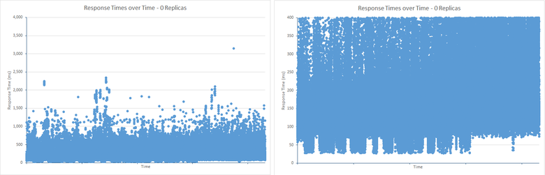

<properties
   pageTitle="Optimaliseren gegevens ingestiedosiscoëfficiënten voor Elasticsearch op Azure | Microsoft Azure"
   description="Hoe kan ik prestaties gegevens ingestie met Elasticsearch op Azure."
   services=""
   documentationCenter="na"
   authors="dragon119"
   manager="bennage"
   editor=""
   tags=""/>

<tags
   ms.service="guidance"
   ms.devlang="na"
   ms.topic="article"
   ms.tgt_pltfrm="na"
   ms.workload="na"
   ms.date="09/22/2016"
   ms.author="masashin"/>

# <a name="tuning-data-ingestion-performance-for-elasticsearch-on-azure"></a>Optimaliseren gegevens ingestiedosiscoëfficiënten voor Elasticsearch op Azure

[AZURE.INCLUDE [pnp-header](../../includes/guidance-pnp-header-include.md)]

Dit artikel maakt [deel uit van een serie](guidance-elasticsearch.md). 

## <a name="overview"></a>Overzicht

Een belangrijk aspect bij het maken van een zoekdatabase is het bepalen van de beste manier om de structuur van het systeem om de consumptie van doorzoekbare gegevens snel en efficiënt. De overwegingen omtrent deze eis betreffen niet alleen de keuze van de infrastructuur waarop u het systeem wilt implementeren, maar ook verschillende optimalisaties die u kunt gebruiken om ervoor te zorgen dat het systeem altijd up-to-date met de verwachte niveaus toestroom van gegevens. 

Dit document beschrijft de implementatie en configuratie opties waarmee u rekening houden moet voor de uitvoering van een cluster Elasticsearch die een grote hoeveelheid gegevens ingestie verwacht. Dit document beschrijft ook de resultaten van de benchmarking van verschillende configuraties met behulp van een eenvoudig grote hoeveelheden gegevens via ingestie werkbelasting voor effen gegevens ter illustratie. De details van de werkbelasting worden in het [aanhangsel](#appendix-the-bulk-load-data-ingestion-performance-test) aan het einde van dit document beschreven.

Het doel van de benchmarks is niet voor het genereren van absolute prestaties cijfers voor het uitvoeren van Elasticsearch of zelfs aan te bevelen een bepaalde topologie, maar in plaats daarvan ter illustratie van de methoden die u gebruiken kunt voor de beoordeling van prestaties, gegevensknooppunten aanpassen en implementeren van clusters die aan uw eigen prestatie-eisen kunnen voldoen. 

Wanneer het formaat van uw eigen systemen, is het belangrijk dat het grondig op basis van uw eigen werklasten prestaties testen. Verzamel telemetrie waarmee u informatie over de hardwareconfiguratie optimaal te gebruiken en de horizontale schaal factoren waarmee u rekening moet houden. U moet met name:

- Houd rekening met de grootte van de nettolading verzonden en niet alleen het aantal items in elke aanvraag bulk insert. Een kleiner aantal grote bulkitems in elke aanvraag kan meer dan een groter getal, afhankelijk van de resource beschikbaar is voor het verwerken van elke aanvraag optimaal zijn.

U kunt controleren dat de effecten van de bulk insert aanvraag variëren met behulp van [Marvel](https://www.elastic.co/products/marvel), met behulp van de *readbytes*/*writebytes* I/O items met [JMeter](https://jmeter.apache.org/)en besturingssysteem, hulpprogramma's zoals *iostat* en *vmstat* op Ubuntu. 

- Prestaties testen en verzamel telemetrie verwerking maatregel CPU en i/o-wachttijden schijf latentie, doorvoer en responstijden. Deze informatie kan helpen om potentiële knelpunten te identificeren en beoordelen van de kosten en voordelen van het gebruik van de premie opslag. Houd er rekening mee dat gebruik van CPU- en mogelijk zelfs op alle knooppunten, afhankelijk van de manier waarop shards en de replica's zijn verdeeld over de cluster (aantal knooppunten kunnen bevatten meer shards dan anderen).

- Rekening houden met hoe het aantal gelijktijdige aanvragen voor uw werkbelasting worden verdeeld over de cluster en de beoordeling van de gevolgen van het gebruik van verschillende nummers van knooppunten voor het verwerken van de werklast.

- Overwegen hoe de werkbelasting kunnen groeien als het bedrijf groeit. Beoordeling van de gevolgen van deze groei van de kosten van het VMs en de opslag die wordt gebruikt door de knooppunten.

- Dat met behulp van een cluster met een groter aantal knooppunten met vaste schijven is waarschijnlijk voordeliger als uw scenario een groot aantal aanvragen vereist en de infrastructuur van de schijf bijhoudt doorvoer die voldoet aan uw service level agreements (Sla) worden herkend. Echter, waardoor het aantal knooppunten kan leiden tot overhead in de vorm van een extra knooppunt tussen communicatie en synchronisatie.

- Begrijpen dat een hoger aantal cores per knooppunt meer verkeer schijf genereert als u meer documenten kunnen worden verwerkt. In dat geval gebruik van de schijf om te beoordelen of het i/o-subsysteem kan een knelpunt geworden en de voordelen van de premie opslag bepalen meten.

- Testen en analyseren van het e-mailverkeer met een hoger aantal knooppunten met minder cores versus minder knooppunten met meer cores. Houd er rekening mee dat de verhoging van het aantal replica's de vereisten op het cluster escaleert en moet u knooppunten toevoegen.

- U kunt dat tijdelijke schijven mogelijk dat indexen moeten vaker worden teruggevorderd.

- Meet het volumegebruik opslag voor de beoordeling van de capaciteit en het gebruik van opslag. Bijvoorbeeld, in ons scenario we 1,5 miljard documenten opgeslagen met 350GB opslag.

- De overdracht van uw werkbelasting meten en bedenken hoe dicht u waarschijnlijk tot de totale i/o-overdracht limiet voor een bepaalde opslagruimte account waarin u de virtuele schijven hebt gemaakt.

## <a name="node-and-index-design"></a>Knooppunt- en ontwerp

In een systeem dat via ingestie van grootschalige gegevens moet ondersteunen, vraagt u de volgende vragen:

- **Zijn de gegevens snel bewegende of tamelijk statisch?** Hoe meer dynamische gegevens, hoe groter het onderhoud overhead voor Elasticsearch. Als de gegevens worden gerepliceerd, wordt elke replica synchroon blijven. Gegevens die slechts een beperkte levensduur heeft of die gemakkelijk kan worden gereconstrueerd snel bewegende nuttig replicatie helemaal uitschakelen. Deze optie is besproken in de sectie [Tuning grootschalige gegevens via ingestie.](#tuning-large-scale-data-ingestion)

- **Hoe up-to-date u hoeft de gegevens ontdekt door te zoeken?** Elasticsearch buffers te onderhouden, zo veel mogelijk gegevens in het geheugen geplaatst. Dit betekent dat niet alle wijzigingen onmiddellijk beschikbaar voor search-aanvragen zijn. Het proces wordt zichtbaar maken en de wijzigingen permanent met Elasticsearch wordt beschreven in de [Wijzigingen permanent maken](https://www.elastic.co/guide/en/elasticsearch/guide/current/translog.html#translog). 

    De snelheid waarmee gegevens zichtbaar wordt beheerst door de *vernieuwen\_interval* van de relevante index instellen. Dit interval is standaard ingesteld op 1 seconde. Niet elke situatie vereist echter vernieuwingen dit snel optreden. Indexen voor het vastleggen van logboekgegevens kunnen bijvoorbeeld moet omgaan met een snelle en voortdurende toestroom van informatie die moet snel worden ingenomen, maar hoeft niet de informatie onmiddellijk beschikbaar zijn voor query's. In dit geval overwegen vermindering van de frequentie van vernieuwingen. Deze functie wordt ook beschreven in de sectie [Tuning grootschalige gegevens via ingestie.](#tuning-large-scale-data-ingestion)

- **Hoe snel zijn de gegevens waarschijnlijk groeien?** Capaciteit van de index wordt bepaald door het aantal shards opgegeven wanneer de index wordt gemaakt. Opgeven als u wilt toestaan voor de groei, een voldoende aantal shards (de standaardwaarde is vijf). Als de index wordt ingesteld op één knooppunt, alle vijf shards, bevindt zich op dat knooppunt, maar als het gegevensvolume extra groeit knooppunten kunnen worden toegevoegd en Elasticsearch dynamisch shards verspreidt over knooppunten. Elke shard heeft echter een overhead. Alle zoekopdrachten in een index wordt alle shards, query, zodat u een groot aantal shards voor een kleine hoeveelheid gegevens gegevens ophaalacties vertraagt kan (te voorkomen dat het scenario [shards Kagillion](https://www.elastic.co/guide/en/elasticsearch/guide/current/kagillion-shards.html) ).

    Sommige werklasten (zoals het aanmelden) maken een nieuwe index elke dag en als u ziet dat het aantal shards onvoldoende voor de omvang van de gegevens is, moet u het maken van de volgende index (bestaande indexen worden niet beïnvloed). Als u bestaande gegevens over meer shards verdelen moet, vervolgens wordt één optie de informatie opnieuw indexeren. Een nieuwe index maken met de juiste configuratie en kopieer de gegevens naar het. Dit proces kan doorzichtig worden gemaakt voor toepassingen met behulp van [index-aliassen](https://www.elastic.co/guide/en/elasticsearch/reference/current/indices-aliases.html).

- **Moeten gegevens tussen gebruikers in een multitenancy scenario worden gepartitioneerd?** U kunt afzonderlijke indexen voor elke gebruiker maken, maar dit kan erg duur zijn als elke gebruiker alleen een gemiddelde hoeveelheid gegevens. In plaats daarvan kunt u [gedeelde indexen](https://www.elastic.co/guide/en/elasticsearch/guide/current/shared-index.html) te maken en te verzenden naar de gegevens per gebruiker met [aliassen op basis van filters](https://www.elastic.co/guide/en/elasticsearch/guide/current/faking-it.html) . Als u wilt dat de gegevens voor een gebruiker samen in de dezelfde shard, overschrijven de configuratie van routering standaard voor de index en de route op basis van een kenmerk ter identificatie van de gebruiker.

- **Gegevens lang of tijdelijk is?** Als u een set van VMs Azure een Elasticsearch cluster implementeren, kunt u tijdelijke gegevens opslaan op een lokale bron systeemschijf in plaats van een aangesloten station.
Met behulp van een SKU VM dat gebruik maakt van een SSD-technologie voor de bron schijf, kan de i/o-prestaties verbeteren. Alle gegevens gehouden op de bron schijf is echter tijdelijk en gaan mogelijk verloren als de VM opnieuw wordt opgestart (Zie de sectie als de gegevens in een tijdelijk station worden verloren bij het [begrijpen van de tijdelijke schijf op Microsoft Azure virtuele Machines](http://blogs.msdn.com/b/mast/archive/2013/12/07/understanding-the-temporary-drive-on-windows-azure-virtual-machines.aspx) voor meer informatie). Als u bewaren van gegevens opnieuw wordt opgestart wilt, diskettes gegevens om deze gegevens en koppel deze aan de VM.

- **Hoe actief zijn de gegevens?** Azure VHD's zijn als het bedrag van de activiteit lezen/schrijven groter is dan de opgegeven parameters (momenteel 500 invoer/uitvoer-bewerkingen per seconde (IOP's) voor een schijf die is gekoppeld aan een standaard laag VM en 5000 IOP's voor een schijf van de premie opslag) te beperken. 

    Te verminderen de kans op een beperking van de i/o-prestaties verbeteren, kunt u meerdere gegevensschijven voor elke VM maken en configureren van Elasticsearch stripe gegevens over deze schijven, zoals beschreven in de [systeemvereisten voor schijf- en bestandsbeheer](guidance-elasticsearch-running-on-azure.md#disk-and-file-system-requirements).

    Moet u een hardwareconfiguratie, die helpt bij het minimaliseren van het nummer van de schijf I/O leesbewerkingen door ervoor te zorgen dat voldoende geheugen beschikbaar voor cachegegevens die veel worden gebruikt is. Dit wordt beschreven in de sectie [geheugenvereisten](guidance-elasticsearch-running-on-azure.md#memory-requirements) van Elasticsearch uitgevoerd op Azure.

- **Wat voor soort werkbelasting elk knooppunt moet ondersteunen?** Elasticsearch profiteert van geheugen om cachegegevens in (in de vorm van de bestandssysteemcache) te hebben en voor de heap JVM zoals beschreven in de sectie [geheugenvereisten](guidance-elasticsearch-running-on-azure.md#memory-requirements) van Elasticsearch uitgevoerd op Azure. 

    De hoeveelheid geheugen, het aantal CPU-kernen en het aantal beschikbare schijven worden ingesteld door de SKU van de virtuele machine. Zie [Virtuele Machines prijzen](http://azure.microsoft.com/pricing/details/virtual-machines/) op de Azure-website voor meer informatie.

### <a name="virtual-machine-options"></a>Opties voor virtuele machine

U kunt inrichten VMs in Azure met behulp van een aantal verschillende SKU's. De bronnen die beschikbaar zijn voor een Azure VM afhankelijk van SKU hebt geselecteerd. Elke SKU biedt een andere combinatie van cores, geheugen en opslag. U moet een geschikte grootte van VM, maar die ook rendabel zal blijken dat de verwachte werklast worden verwerkt.
Start met een configuratie die voldoen aan uw huidige behoeften (benchmarking om te testen, zoals verderop in dit document uitvoeren). U kunt later een cluster schalen door meer VMs met Elasticsearch knooppunten toe te voegen.

[Formaten voor virtuele Machines](../virtual-machines/virtual-machines-linux-sizes.md) op de website van Azure worden de verschillende opties en SKU's beschikbaar voor VMs.

U moet overeenkomen met de grootte en de bronnen van een VM aan de rol die knooppunten waarop de VM wordt uitgevoerd.

Voor een gegevensknooppunt:

- Toewijzen van maximaal 30 GB of 50% van het beschikbare RAM-geheugen op de Java heap, het laagst is. Laat de rest aan het besturingssysteem moet worden gebruikt voor het in cache opslaan van bestanden. Als u Linux gebruikt, kunt u de hoeveelheid geheugen toe te wijzen aan de heap Java door de ES\_HEAP\_variabele grootte voordat Elasticsearch wordt uitgevoerd. Ook als u Windows- of Linux, kunt u bepalen geheugengrootte met de parameters *Xmx* en *Xms* bij het starten van Elasticsearch.

    Afhankelijk van de werklast, minder grote VMs mogelijk niet zo effectief voor prestaties met behulp van een groter aantal VMs matig formaat. U moet tests uit die de wisselwerking tussen de extra netwerkverkeer en onderhoud betrokken versus de kosten van het verhogen van het aantal cores beschikbaar en de schijf minder bewering op elk knooppunt kunt meten.

- Premium opslag gebruiken voor het opslaan van Elasticsearch. Dit wordt besproken in meer detail in de sectie [Opties voor opslag](#storage-options) .

- Gebruik meerdere schijven van dezelfde grootte en stripe gegevens op deze schijven. De SKU van het VMs is bepalend voor het maximum aantal gegevensschijven die u kunt koppelen. Zie [systeemvereisten voor schijf- en bestandsbeheer](guidance-elasticsearch-running-on-azure.md#disk-and-file-system-requirements)voor meer informatie.

- Een SKU multicore-processor met ten minste 2 cores, bij voorkeur 4 of meer gebruiken. 

Voor een client-knooppunt:

- Wijs niet schijfopslag voor Elasticsearch gegevens, specifieke clients gegevens niet opslaan op schijf.

- Zorg ervoor dat voldoende geheugen beschikbaar is voor werklasten verwerken. Bulk insert aanvragen worden gelezen in het geheugen voordat de gegevens worden verzonden naar de verschillende gegevensknooppunten en de resultaten van aggregaties en query's in het geheugen worden samengevoegd voordat het wordt geretourneerd naar de clienttoepassing. Uw eigen werklasten benchmark en geheugengebruik controleren met behulp van een hulpprogramma voor Marvel of [JVM informatie](https://www.elastic.co/guide/en/elasticsearch/guide/current/_monitoring_individual_nodes.html#_jvm_section) geretourneerd via het *knooppunt* statistieken/API (`GET _nodes/stats`) voor de beoordeling van de optimale voorwaarden.  In het bijzonder, controleren de *heap\_gebruikt\_%* metric voor elk knooppunt en het doel te houden van de heapgrootte onder de 75% van de beschikbare ruimte.

- Ervoor zorgen dat voldoende CPU-kernen ontvangen en de verwachte omvang van de aanvragen te verwerken.
Aanvragen in de wachtrij voor verwerking worden ontvangen en het volume van de artikelen die in de wachtrij kunnen worden geplaatst, is afhankelijk van het aantal processor-cores op elk knooppunt. U kunt de lengte van de wachtrij controleren met behulp van de gegevens in de [Threadpool informatie](https://www.elastic.co/guide/en/elasticsearch/guide/current/_monitoring_individual_nodes.html#_threadpool_section) geretourneerd via het knooppunt/stats API. 

    Als het aantal *afgewezen* voor een wachtrij geeft aan dat aanvragen worden wordt geweigerd, betekent dit dat het cluster knelpunt wordt gestart. Dit kan worden veroorzaakt door CPU-bandbreedte, maar kan ook worden veroorzaakt door andere factoren zoals gebrek aan geheugen of een trage i/o-prestaties, dus deze informatie gebruiken in combinatie met andere statistieken om te bepalen van de oorzaak.

    Client-knooppunten al kunnen dan niet nodig, afhankelijk van de werkbelasting. Gegevens via ingestie werklasten meestal niet profiteren van het gebruik van specifieke clients, terwijl sommige zoekopdrachten en aggregaties sneller kunnen uitvoeren. Zorg ervoor dat u kunt uw eigen scenario's benchmark.

    Client knooppunten zijn vooral handig voor toepassingen die gebruikmaken van de Transport-API-Client verbinding maken met het cluster. Ook kunt u het knooppunt Client-API die dynamisch wordt gemaakt van een specifieke client die voor de toepassing, de middelen van de host-omgeving van toepassing. Als uw toepassingen gebruikmaken van de Client-API knooppunt vervolgens niet mogelijk voor uw cluster bevat vooraf geconfigureerde speciale client-knooppunten. 
    
    Echter zijn er rekening mee houden dat een knooppunt dat is gemaakt met behulp van de API-Client knooppunt een eersteklas lid van het cluster is en als zodanig deel van het netwerk zo levensecht mogelijk met andere knooppunten uitmaakt. Starten en stoppen van client knooppunten kunnen maken onnodig lawaai vaak voor het gehele cluster.

Voor een master knooppunt:

- Wijs niet schijfopslag voor Elasticsearch gegevens, specifieke basispagina knooppunten gegevens niet opslaan op schijf.

- CPU-vereisten moet minimaal zijn.

- Geheugen is afhankelijk van de grootte van het cluster. Informatie over de status van het cluster blijft in het geheugen behouden. De hoeveelheid geheugen die nodig is voor kleine clusters is minimaal, maar voor een grote, zeer actieve cluster wanneer indexen worden gemaakt vaak en shards verplaatsen, het bedrag van de informatie over de status kan aanzienlijk groeien. Controleer de JVM heapgrootte om te bepalen of u wilt meer geheugen toevoegen.

> [AZURE.NOTE]Voor betrouwbaarheid, cluster, altijd meerdere basispagina knooppunten te maken en configureren van de resterende knooppunten om te voorkomen dat de mogelijkheid van een gesplitste hersenen optreedt. In het ideale geval moet er een oneven aantal knooppunten master. In dit onderwerp wordt meer gedetailleerd beschreven in [veerkracht configureren and recovery op Elasticsearch op Azure][].

### <a name="storage-options"></a>Opties voor opslag

Er zijn een aantal opties voor opslag beschikbaar op Azure VMs met verschillende e-mailverkeer op het gebied van kosten, prestaties, beschikbaarheid en herstel, moet u zorgvuldig overwegen.

Houd er rekening mee moet u Elasticsearch gegevens op gegevensschijven met speciale opslaan.  Dit helpt te verminderen met een conflict met het besturingssysteem en zorg ervoor dat grote hoeveelheden Elasticsearch I/O niet besturingssysteem functies voor i/o-bronnen beconcurreren beroepsvervoerders.

Azure schijven zijn beperkingen van de prestaties. Als u vindt dat een cluster periodieke bursts van activiteit ondergaat kunnen i/o-aanvragen worden beperkt. Om dit te voorkomen, afstemmen van uw ontwerp voor een evenwicht tussen de documentgrootte in Elasticsearch ten opzichte van de omvang van de aanvragen kunnen worden ontvangen door elke schijf.

Op basis van de standaard opslag-schijven ondersteunen een voor maximale aanvraagsnelheid van 500 IOP's dat schijven op basis van de premie opslag op maximaal 5.000 IOP's, afhankelijk van de grootte van de gegevensschijven kunnen werken. Premium schijven zijn alleen beschikbaar voor de DS en GS serie van VMs. De maximale schijfruimte IOP's door VM-grootte, Zie [formaten voor virtuele machines in Azure](../virtual-machines/virtual-machines-linux-sizes.md). Prestaties van de premie opslag wordt bepaald door de grootte van de VM met schijfclusters grootte. Zie voor meer informatie [Premium-opslag: krachtige opslag voor een standaardwerkbelasting Azure Virtual Machine](../storage/storage-premium-storage.md).

**Permanente gegevensschijven**

Permanente gegevensschijven zijn VHD's die worden ondersteund door Azure opslag. Als de VM na een storing opnieuw worden gemaakt moet, kunnen de bestaande VHD's eenvoudig worden gekoppeld aan de nieuwe VM. VHD's kunnen worden gemaakt op basis van de standaard opslag (media centrifugeren) of premium-opslag (SSD). Als u gebruik wenst te SSD moeten maken met de DS serie VMs of beter. DS machines kosten hetzelfde als de overeenkomstige D-serie VMs, maar als u extra betalen voor het gebruik van de premie opslag.

In gevallen waarin de maximale doorvoersnelheid per schijf ontoereikend zijn om de verwachte werklast, kunt u ofwel meerdere gegevensschijven maken en kunt Elasticsearch [stripe gegevens over deze schijven](guidance-elasticsearch-running-on-azure.md#disk-and-file-system-requirements)of systeemniveau [RAID 0 striping met virtuele schijven](../virtual-machines/virtual-machines-linux-configure-raid.md)implementeert.

> [AZURE.NOTE]In Microsoft is gebleken dat met behulp van RAID 0 met name nuttig is voor het vloeiend maken van de i/o-effecten van *spiky* werklast die frequente bursts van activiteit te genereren.

Gebruik premium lokaal redundante (of lokaal voor redundante low-end of QA werklasten) opslag voor de opslag rekening houden de schijven; repliceren van verschillende regio's en zones is niet vereist voor een hoge beschikbaarheid van Elasticsearch. 

**Tijdelijke schijven**

Permanente schijven op basis van SSD moet VMs die ondersteuning bieden voor premium opslag maken. Dit heeft een implicatie prijs. Met behulp van de lokale tijdelijke schijf voor gegevensopslag Elasticsearch is een voordelige oplossing voor matig formaat knooppunten tot 800 GB opslagruimte vereisen. Op de standaard-D-series VMs, worden tijdelijke schijven geïmplementeerd met behulp van SSD die veel betere prestaties en veel lagere latentie dan gewone schijven bieden

Wanneer u Elasticsearch, de prestaties kan worden gelijk aan premium-opslag zonder – Zie de sectie [problemen met latentie schijf adressering](#addressing-disk-latency-issues) voor meer informatie.

De grootte van de VM beperkt de hoeveelheid ruimte in de tijdelijke opslag, zoals beschreven in het blogbericht [Prestatieverwachtingen van de D-reeks](https://azure.microsoft.com/blog/d-series-performance-expectations/).

Bijvoorbeeld, een standaard\_D1 VM biedt 50GB van tijdelijke opslag, een standaard\_D2 VM heeft tijdelijke opslag van 100GB en een standaard\_VM D14 800GB tijdelijke ruimte biedt. Voor clusters waarin knooppunten slechts deze hoeveelheid ruimte nodig, zijn met behulp van een VM D-serie met tijdelijke opslag voordelige.

De hogere doorvoer beschikbaar voor tijdelijke opslag tegen de tijd en kosten die betrokken zijn bij het herstellen van deze gegevens na het starten van een machine moeten worden gesaldeerd. De inhoud van de tijdelijke schijf gaan verloren als de VM wordt verplaatst naar een andere host-server, als de host wordt bijgewerkt, of als de host een hardwarestoring optreedt. Als de gegevens zelf een beperkte levensduur heeft kan dit gegevensverlies toelaatbare zijn. Voor langduriger gegevens, kan het mogelijk zijn om een index opnieuw maken of de ontbrekende gegevens herstellen vanaf een back-up. Het is mogelijk om de kans op gegevensverlies te minimaliseren door het gebruik van replica's op andere VMs gehouden.

> [AZURE.NOTE]Gebruik geen **enkel** VM voor van kritieke productiegegevens. Als het knooppunt mislukt, alle gegevens is niet beschikbaar. Ervoor zorgen dat de gegevens worden gerepliceerd op ten minste één andere knooppunt essentiële informatie.

**Azure-bestanden**

De [Azure File Service](http://blogs.msdn.com/b/windowsazurestorage/archive/2014/05/12/introducing-microsoft-azure-file-service.aspx) biedt toegang tot gedeelde bestanden met Azure opslag. Op Azure VMs kunt u bestandsshares die u vervolgens kunt koppelen. Meerdere VMs kunnen de bestandsshare dezelfde koppelen zodat ze toegang hebben tot dezelfde gegevens.

Voor betere prestaties is het niet raadzaam dat u bestandsshares gebruiken voor die Elasticsearch gegevens bevatten die u niet hoeft te worden verdeeld over de knooppunten, regelmatige gegevensschijven zijn meer geschikt voor dit doel. Gedeelde bestanden kunnen worden gebruikt voor het maken van Elasticsearch [schaduwindexen replica](https://www.elastic.co/guide/en/elasticsearch/reference/current/indices-shadow-replicas.html). Deze functie is echter momenteel experimentele en moet op dit moment niet worden geïmplementeerd in een productieomgeving. Om deze reden schaduwindexen worden niet beschouwd als verder in deze handleiding.

**Netwerkopties**

Azure een gedeeld netwerk schema geïmplementeerd. Gebruik van dezelfde hardware rekken VMs concurreren voor netwerkbronnen. Daarom de beschikbare netwerkbandbreedte kan variëren afhankelijk van het tijdstip van de dag en het dagelijks werk op dezelfde fysieke netwerkinfrastructuur delen VMs-cyclus. U hebt weinig controle over deze factoren. Het is belangrijk te begrijpen dat de prestaties van het netwerk kunnen schommelen in de tijd, dus de verwachtingen van de gebruiker ook op Westers ingesteld.

## <a name="scaling-up-nodes-to-support-large-scale-data-ingestion"></a>Knooppunten voor de ondersteuning van grootschalige gegevens ingestie verticaal schalen

Ontwikkelen Elasticsearch clusters met redelijk gematigde hardware, kan en vervolgens schalen of schaalt groeit het volume van de gegevens en het aantal aanvragen wordt verhoogd. Met Azure, u schaal-up door te voeren op een groter en duurder VMs, of u kunt schalen met behulp van extra kleiner en goedkoper VMs. 

U kunt ook een combinatie van beide strategieën uitvoeren. Er is geen standaardoplossing voor alle oplossing voor alle scenario's voor de beoordeling van de beste manier om een bepaalde situatie u bereid zijn moet om de prestaties van een reeks tests.

Deze sectie heeft betrekking op de schaal-up-benadering, horizontaal te schalen wordt besproken in de sectie [van schaal: conclusies](#scaling-out-conclusions).
Deze sectie beschrijft de resultaten van een reeks benchmarks die zijn uitgevoerd op een set Elasticsearch clusters met VMs met verschillende capaciteiten. De clusters zijn aangewezen als kleine, middelgrote en grote. De volgende tabel bevat een overzicht van de resources die zijn toegewezen aan de VMs in elk cluster.

| Cluster | VM SKU      | Aantal kernen | Aantal gegevensschijven | RAM-GEHEUGEN  |
|---------|-------------|-----------------|----------------------|------|
| Kleine   | Standaard D2 | 2               | 4                    | 7GB  |
| Gemiddeld  | Standaard D3 | 4               | 8                    | 14GB |
| Grote   | Standaard D4 | 8               | 16                   | 28GB |

Elk cluster Elasticsearch gegevensknooppunten 3 opgenomen. Deze gegevensknooppunten verwerkt aanvragen van clients, alsmede de verwerking afhandelen. Client afzonderlijke knooppunten zijn niet gebruikt omdat ze weinig voordeel met de gegevens via ingestie scenario gebruikt door de tests die worden aangeboden. Het cluster bevat ook drie master knooppunten, waarvan er één werd verkozen door Elasticsearch voor het coördineren van het cluster.

De tests werden uitgevoerd met behulp van Elasticsearch 1.7.3. De tests werden aanvankelijk uitgevoerd op Ubuntu Linux 14.0.4-clusters en vervolgens herhaald met Windows Server 2012. De details van de werklast door de tests uitgevoerd worden beschreven in het [aanhangsel](#appendix-the-bulk-load-data-ingestion-performance-test).

### <a name="data-ingestion-performance--ubuntu-linux-1404"></a>Gegevens via ingestie prestaties: Ubuntu Linux 14.0.4

De volgende tabel bevat een overzicht van de resultaten van de proeven gedurende twee uur voor elke configuratie uitgevoerd:

| Configuratie | Aantal voorbeelden | Gemiddelde reactietijd (ms) | Doorvoer (bewerkingen/sec.) |
|---------------|--------------|----------------------------|---------------------------|
| Kleine         | 67057        | 636                        | 9.3                       |
| Gemiddeld        | 123482       | 692                        | 17,2 inch                      |
| Grote         | 197085       | 839                        | 27,4                      |

De doorvoer en aantal monsters verwerkt voor de drie configuraties in de verhouding, bij benadering 1:2 zijn: 3. De bronnen die beschikbaar zijn in het geheugen, CPU-kernen en schijven wel de verhouding 1:2:4. Was het gevoelen waard de Prestatiedetails op een laag niveau van van de knooppunten in het cluster om na te gaan waarom dit kan bijvoorbeeld het geval zijn. Deze informatie kan helpen om te bepalen of er zijn grenzen schaalt en beter rekening te houden met schalen. 

### <a name="determining-limiting-factors-network-utilization"></a>Factoren bepalen beperken: gebruik van het netwerk

Elasticsearch is afhankelijk van voldoende bandbreedte ter ondersteuning van de toestroom van aanvragen van clients, alsmede de synchronisatiegegevens die tussen knooppunten in het cluster loopt hebben. Als gemarkeerde eerder, hebt u slechts beperkte controle over de beschikbaarheid van bandbreedte, die afhankelijk is van vele variabelen, zoals het datacenter in gebruik en de huidige netwerkbelasting van andere delen van de netwerkinfrastructuur VMs. Het is echter nog steeds waard netwerkactiviteiten voor elk cluster om te controleren of het volume van het verkeer is niet overmatig te onderzoeken. Het volgende diagram ziet u een vergelijking van het netwerkverkeer door knooppunt 2 in elk van de clusters (de volumes voor de andere knooppunten in een cluster is vergelijkbaar) ontvangen.


Het gemiddelde aantal ontvangen bytes per seconde voor knooppunt 2 in elk type clusterconfiguratie gedurende de periode van twee uur waren als volgt:

| Configuratie | Gemiddeld aantal ontvangen bytes per seconde |
|---------------|--------------------------------------|
| Kleine         | 3993640.3                            |
| Gemiddeld        | 7311689.9                            |
| Grote         | 11893874.2                           |

De tests zijn uitgevoerd, terwijl het systeem werd uitgevoerd in de **stationaire toestand**. In situaties waar indexeren opnieuw of knooppunt herstellen zich voordoet, genereren gegevensoverdrachten tussen knooppunten die primaire en replica shards aanzienlijk netwerkverkeer. De gevolgen van dit proces worden meer beschreven in het document [veerkracht configureren and recovery op Elasticsearch op Azure][].

### <a name="determining-limiting-factors-cpu-utilization"></a>Bepaling van het beperken van factoren: CPU-gebruik

De frequentie waarmee aanvragen worden verwerkt ten minste gedeeltelijk wordt beheerst door de beschikbare verwerkingscapaciteit. Elasticsearch accepteert bulk insert aanvragen op de meeste wachtrij invoegen. Elk knooppunt heeft een set van bulk invoegen wachtrijen die worden bepaald door het aantal processors beschikbaar. Standaard is er één wachtrij voor elke processor en elke wachtrij kan maximaal 50 uitstaande aanvragen bevatten voordat ze zullen worden afgewezen. 

Toepassingen moeten aanvragen verzenden met een snelheid die niet leidt de wachtrijen tot aan overspill. Het aantal items in elke wachtrij op elk gewenst moment is het verstandig om een functie van de frequentie waarmee aanvragen worden verzonden door de client-toepassingen en de snelheid waarmee deze dezelfde aanvragen zijn opgehaald en verwerkt door Elasticsearch. Om deze reden heeft een belangrijk statistisch gegeven betrekking heeft op het tarief van de fout wordt samengevat in de volgende tabel vastgelegd.

| Configuratie | Alle monsters | Aantal fouten  | Foutfrequentie |
|---------------|---------------|--------------|------------|
| Kleine         | 67057         | 0            | 0,00%      |
| Gemiddeld        | 123483        | 1            | % 0.0008    |
| Grote         | 200702        | 3617         | 1,8%      |

Elke fout wordt veroorzaakt door de volgende Java-uitzondering:

```
org.elasticsearch.action.support.replication.TransportShardReplicationOperationAction$PrimaryPhase$1@75a30c1b]; ]
[219]: index [systembase], type [logs], id [AVEAioKb2TRSNcPa_8YG], message [RemoteTransportException[[esdatavm2][inet[/10.0.1.5:9300]][indices:data/write/bulk[s]]]; nested: EsRejectedExecutionException[rejected execution (queue capacity 50)
```

Verhoging van het aantal wachtrijen en/of de lengte van elke wachtrij kan verminderen het aantal fouten, maar deze aanpak kan alleen hoofd met bursts van korte duur. Tijdens het uitvoeren van een continue reeks gegevens ingestie taken hierdoor vertragen het punt waarop fouten gestart die gewoon. Bovendien is deze wijziging wordt de gegevensdoorvoer niet verbeterd en is waarschijnlijk schadelijk voor de reactietijd van toepassingen zoals aanvragen langer gewacht alvorens te worden verwerkt.

De structuur van de index standaard van 5 shards met 1 replica (10 shards in alle) resulteert in een bescheiden sprake is van onevenredige taakverdeling tussen de knooppunten in een cluster twee knooppunten bevat drie shards terwijl het andere knooppunt vier bevat. Het drukste knooppunt is waarschijnlijk het item dat het meest doorvoer beperkt is de reden waarom dit knooppunt is geselecteerd in elk geval. 

De volgende reeks grafieken illustreren het CPU-gebruik voor het drukste knooppunt in een cluster.


Voor kleine, middelgrote en grote clusters, is de gemiddelde CPU-gebruik voor deze knooppunten 75.01% 64.93% en % 64.64. Zelden wordt gebruik daadwerkelijk druk op 100%, en gebruik afneemt als de grootte van de knooppunten en de beschikbare CPU power beschikbaar wordt verhoogd. CPU-capaciteit is daarom onwaarschijnlijk dat een factor die de prestaties van het cluster groot beperken.

### <a name="determining-limiting-factors-memory"></a>Bepaling van het beperken van factoren: geheugen

Geheugengebruik is een ander belangrijk aspect dat van invloed kan uitoefenen op de prestaties. Elasticsearch is 50% van het beschikbare geheugen toegewezen voor de proeven. Dit is in overeenstemming met de [aanbevelingen beschreven](https://www.elastic.co/guide/en/elasticsearch/guide/current/heap-sizing.html#_give_half_your_memory_to_lucene). Terwijl de tests zijn uitgevoerd, is de JVM voor overtollige garbage collectie activiteit (vermelding van gebrek aan geheugen) gecontroleerd. In alle gevallen de heapgrootte is stabiel en de JVM lage garbage collectie activiteit tentoongesteld. Het screenshot hieronder toont een momentopname van Marvel, markeren de sleutel JVM statistieken gedurende een korte periode tijdens de test is uitgevoerd op de grote cluster.


***JVM geheugen en garbage collectie activiteit op het grote cluster.***

### <a name="determining-limiting-factors-disk-io-rrates"></a>Bepaling van het beperken van factoren: schijf-i/o-rRates

De resterende fysieke functie op de server die de prestaties mogelijk beperken is de prestaties van de schijf-i/o-subsysteem. De onderstaande grafiek vergelijkt de schijfactiviteit in bytes dat is geschreven voor de drukste knooppunten in een cluster.

 

De volgende tabel ziet u het gemiddelde aantal bytes per seconde voor knooppunt 2 in elk type clusterconfiguratie gedurende de periode van twee uur worden geschreven:

| Configuratie | Gemiddeld aantal geschreven bytes per seconde |
|---------------|-------------------------------------|
| Kleine         | 25502361.94                         |
| Gemiddeld        | 48856124.5                          |
| Grote         | 88137675.46                         |

Het volume van de gegevens die geschreven wordt verhoogd met het aantal aanvragen dat door een cluster wordt verwerkt, maar de i/o-tarieven zijn binnen de grenzen van Azure opslag (schijven die zijn gemaakt met behulp van Azure opslag kunnen ondersteunen een duurzame tarieven 10s-100s van MB/s, Standard of Premium opslag wordt gebruikt). Onderzoek van de hoeveelheid tijd besteed aan het wachten op schijf I/O helpt om uit te leggen waarom de schijfdoorvoer is ruim onder het theoretische maximum. De onderstaande tabel en grafieken weergeven deze statistieken voor de dezelfde drie knooppunten:

> [AZURE.NOTE]De wachttijd van de schijf wordt gemeten door het controleren van het percentage van de CPU-tijd gedurende welke processors worden geblokkeerd, wachten op i/o-bewerkingen zijn voltooid.


| Configuratie | Gemiddelde wachttijd CPU (%) |
|---------------|--------------------------------|
| Kleine         | 21.04                          |
| Gemiddeld        | 14.48                          |
| Grote         | 15.84                          |

Deze gegevens geeft aan dat een aanzienlijk deel van de CPU-tijd (tussen 16% en 21%) wordt besteed, wachten op schijf I/O te voltooien. Dit is de mogelijkheid van Elasticsearch aanvragen te verwerken en opslaan van gegevens beperken.

Tijdens de test uitvoert, de grote cluster meer dan **vijf honderd miljoen documenten werden**ingevoegd. Zodat de test om door te gaan, bleek dat de wachttijd aanzienlijk verhoogd wanneer de database bevat meer dan zes honderd miljoen documenten. De redenen voor dit probleem niet volledig zijn onderzocht, maar door schijf fragmentatie veroorzaakt grotere schijf latentie. 

Het vergroten van het cluster via meer knooppunten kan helpen verlichten van de gevolgen van dit probleem. In extreme gevallen mogelijk voor het defragmenteren van een schijf dat buitensporige i/o-maal wordt weergegeven. Echter een grote schijf defragmenteren duren aanzienlijk (mogelijk meer dan 48 uur voor een 2TB VHD-station) en gewoon formatteren van het station en Elasticsearch shards replica de ontbrekende gegevens herstellen zodat een meer rendabele benadering kunnen worden.

### <a name="addressing-disk-latency-issues"></a>Adressering problemen met latentie schijf

De tests werden aanvankelijk uitgevoerd met behulp van VMs geconfigureerd met standaard schijven. Een normale schijf is gebaseerd op de media draait en kan daardoor roterende latentie en andere knelpunten die de i/o-tarieven kunnen beperken. Azure biedt ook premium opslag die schijven worden gemaakt met behulp van SSD-apparaten. Deze apparaten hebben geen roterende latentie en als gevolg hiervan moeten bieden verbeterde i/o-snelheden. 

In de volgende tabel worden de resultaten van de vaste schijven te vervangen door de schijven in het cluster groot premium vergeleken (de standaard VMs D4 in het grote cluster zijn vervangen door standaard DS4 VMs; het aantal cores, geheugen en schijven identiek is in beide gevallen is het enige verschil is dat de DS4 VMs SSD gebruikt).

| Configuratie    | Aantal voorbeelden | Gemiddelde reactietijd (ms) | Doorvoer (bewerkingen/sec.) |
|------------------|--------------|----------------------------|---------------------------|
| Groot - standaard | 197085       | 839                        | 27,4                      |
| Groot - Premium  | 255985       | 581                        | 35,6                      |

Responstijden aanzienlijk beter zijn wat resulteert in een gemiddelde doorvoer veel dichter naar 4 x die van de kleine cluster. Dit is meer in overeenstemming met de beschikbare bronnen op een standaard DS4 VM. Gemiddelde CPU-gebruik op het drukste knooppunt in het cluster (in dit geval knooppunt 1) verhoogd als het besteed minder tijd wachten op I/O te voltooien:


De vermindering van de wachttijd van de schijf wordt zichtbaar wanneer u rekening houden met de volgende grafiek waaruit blijkt dat voor het drukste knooppunt dit gegeven tot ongeveer 1% gemiddeld daalde:


Er is een prijs te betalen voor deze verbetering, echter. Het aantal fouten van ingestie verhoogd met een factor 10-35797 (12,3%). Nogmaals, de meeste van deze fouten zijn het resultaat van de bulkimportbewerking invoegen overflowing wachtrij. Gezien het feit dat de hardware nu uitgevoerd veel capaciteit wordt, mogelijk meer knooppunten toevoegen of beperken van de snelheid van de bulk INSERT ter vermindering van het volume van de fouten. Deze problemen worden verderop in dit document besproken.

### <a name="testing-with-ephemeral-storage"></a>Testen met tijdelijke opslag

Dezelfde tests werden herhaald op een cluster van D4 VMs tijdelijke opslag. Tijdelijke opslag is op D4 VMs geïmplementeerd als een enkel 400GB SSD. Het aantal monsters verwerkt, responstijd en doorvoer zijn allemaal vergelijkbaar met de cijfers gerapporteerd voor het cluster op basis van VMs DS14 met premium-opslagruimte.

| Configuratie                     | Aantal voorbeelden | Gemiddelde reactietijd (ms) | Doorvoer (bewerkingen/sec.) |
|-----------------------------------|--------------|----------------------------|---------------------------|
| Groot - Premium                   | 255985       | 581                        | 35,6                      |
| Groot-standaard (tijdelijke schijf) | 255626       | 585                        | 35,5                      |

De fout is ook vergelijkbaar (33862 fouten uit 289488 aanvragen in totaal – 11,7%).

De volgende grafieken tonen het CPU-gebruik en schijf wachten statistieken voor het drukste knooppunt in het cluster (knooppunt 2 dit keer):


! [] (media/guidance-elasticsearch/data-ingestion-image13.png

In dit geval in termen van prestaties is alleen, kan het gebruik van tijdelijke opslag worden overwogen een meer rendabele oplossing dan het gebruik van de premie opslag.

### <a name="data-ingestion-performance--windows-server-2012"></a>Gegevens via ingestie prestaties: Windows Server 2012

Dezelfde tests werden herhaald met een set Elasticsearch clusters met knooppunten waarop Windows Server 2012. Het doel van deze tests was vast te stellen welke effecten, indien van toepassing, de keuze van het besturingssysteem op de prestaties van het cluster hebben kan.

Ter illustratie van de schaalbaarheid van Elasticsearch in Windows ziet in de volgende tabel u de doorvoer en reactie tijden voor kleine, middelgrote en grote clusterconfiguraties bereikt. Houd er rekening mee dat deze tests al zijn uitgevoerd met Elasticsearch geconfigureerd voor het gebruik van tijdelijke opslag van SSD-technologie, zoals de tests met Ubuntu was dat de schijf latentie waarschijnlijk een essentiële factor is in het bereiken van maximale prestaties:

| Configuratie | Aantal voorbeelden | Gemiddelde reactietijd (ms) | Doorvoer (bewerkingen/sec.) |
|---------------|--------------|----------------------------|---------------------------|
| Kleine         | 90295        | 476                        | 12,5                      |
| Gemiddeld        | 169243       | 508                        | 23.5                      |
| Grote         | 257115       | 613                        | 35,6                      |

Deze resultaten geven aan hoe Elasticsearch wordt geschaald met de VM-grootte en de beschikbare bronnen op Windows.

De volgende tabellen worden de resultaten voor de grote cluster op Ubuntu en Windows vergeleken:

| Besturingssysteem | Aantal voorbeelden | Gemiddelde reactietijd (ms) | Doorvoer (bewerkingen/sec.) | Fout rente (%) |
|------------------|--------------|----------------------------|---------------------------|----------------|
| Ubuntu           | 255626       | 585                        | 35,5                      | 11,7           |
| Windows          | 257115       | 613                        | 35,6                      | 7.2            |

De doorvoer is consistent met die voor de grote clusters van Ubuntu, hoewel de responstijd iets hoger is. Dit kan worden verklaard door de lagere snelheid van de fout (fouten sneller dan een geslaagde bewerkingen worden gerapporteerd, zodat een lagere reactietijd hebt).

Het CPU-gebruik gemeld door de controlehulpprogramma's van Windows is net iets hoger dan die van Ubuntu. U dient echter directe vergelijkingen van de afmetingen zoals deze besturingssystemen met uiterste voorzichtigheid vanwege de manier waarop verschillende besturingssystemen deze statistieken verslag te behandelen. Informatie over wachttijden voor CPU-tijd besteed aan het wachten op I/O schijf is bovendien niet beschikbaar zijn op dezelfde manier als voor Ubuntu. Het belangrijkste is dat de CPU-gebruik hoog was, die aangeeft dat de gebruikte wachten op I/O tijd laag was:


### <a name="scaling-up-conclusions"></a>Verticaal schalen: conclusies

Prestaties voor een goed afgestemde ingebouwde belichtingsmeter cluster Elasticsearch is waarschijnlijk equivalent voor Windows en Ubuntu, en dat deze tarieven-up in een vergelijkbaar patroon voor beide systemen. Voor de beste prestaties **premie opslag voor die Elasticsearch gegevens gebruiken**.

## <a name="scaling-out-clusters-to-support-large-scale-data-ingestion"></a>Clusters voor de ondersteuning van grootschalige gegevens ingestie horizontaal schalen

Horizontaal schalen is de gratis aanpak voor het verticaal schalen onderzochte in de vorige sectie. Een belangrijke functie van Elasticsearch is de inherente horizontale schaalbaarheid in de software ingebouwd. De omvang van een cluster is gewoon een kwestie van meer knooppunten toe te voegen. U hoeft niet alle handmatige bewerkingen indexen verdelen of shards als deze taken automatisch worden verwerkt, maar er een aantal opties beschikbaar zijn die u gebruiken kunt om dit proces te beïnvloeden. 

Meer knooppunten toe te voegen kunt u de prestaties verbeteren door het spreiden van de belasting over meer machines. Als u meer knooppunten toevoegt, moet u mogelijk ook rekening te houden met het indexeren van gegevens om het aantal beschikbare shards verhogen. U kunt dit proces tot op zekere hoogte voorrang nemen op door het maken van indexen met meer shards dan er in eerste instantie beschikbare knooppunten zijn. Als verdere knooppunten worden toegevoegd, kunnen de shards worden gedistribueerd.

Niet alleen profiteren van de horizontale schaalbaarheid van Elasticsearch, zijn er andere redenen voor het implementeren van de indexen die meer shards dan knooppunten hebt. Elke shard wordt geïmplementeerd als een afzonderlijke gegevensstructuur (een [Lucene](https://lucene.apache.org/) -index) en heeft een eigen interne mechanismen voor handhaving van de consistentie en het afhandelen van gelijktijdigheid. Maken van meerdere shards kunt verhogen parallellisme binnen een knooppunt en kan de prestaties verbeteren. 

Echter, goede prestaties tijdens schalen afwegen. Meer knooppunten en shards die een cluster bevat, meer inspanning is vereist voor het synchroniseren van de werkzaamheden van het cluster die doorvoer kan afnemen. Er is een optimale configuratie wordt gemaximaliseerd ingestie prestaties en de overhead van het onderhoud tot een minimum beperken voor een bepaalde werkbelasting. Deze configuratie is sterk afhankelijk van de aard van de werkbelasting en het cluster. met name het volume, de grootte en de inhoud van de documenten, de frequentie waarmee opname vindt plaats en de hardware waarop het systeem wordt uitgevoerd.  

Deze sectie bevat een overzicht van de resultaten van onderzoek naar het formaat van clusters die bestemd zijn voor de ondersteuning van de belasting die wordt gebruikt door de eerder beschreven prestatietests. Dezelfde test is uitgevoerd op clusters met VMs op basis van de grote VM formaat (standaard D4 met 8 processor-cores gegevensschijven 16 en 28GB RAM) actieve Ubuntu Linux 14.0.4, maar met verschillende nummers van de knooppunten en shards geconfigureerd. De resultaten zijn niet bedoeld om definitieve worden als ze alleen voor een bepaald scenario gelden, maar ze kunnen fungeren als een goed uitgangspunt bij het analyseren van de horizontale schaalbaarheid van clusters en genereren van nummers voor de optimale verhouding van shards met knooppunten die voldoen aan uw eigen vereisten.

### <a name="baseline-results--3-nodes"></a>Resultaten van de basislijn – 3 knooppunten

Als u een afbeelding van de basislijn, is de prestatietest voor ingestie van gegevens uitvoeren op een cluster knooppunt 3 met 5 shards en 1 replica. Dit is de standaardconfiguratie voor een index Elasticsearch. In deze configuratie Elasticsearch 2 primaire shards 2 knooppunten worden verdeeld en de resterende primaire shard is opgeslagen op het derde knooppunt. In de volgende tabel bevat een overzicht van de doorvoer van ingestie bulkbewerkingen per seconde en het aantal documenten dat met succes zijn opgeslagen door de test.

> [AZURE.NOTE] In de tabellen die in deze sectie volgt, wordt de verdeling van de primaire shards weergegeven als een nummer voor elk knooppunt gescheiden door streepjes. De lay-out 5 shard 3-knooppunt wordt bijvoorbeeld beschreven als 2-2-1. De indeling van de replica shards is niet opgenomen. Zij zal een soortgelijk programma aan de primaire shards volgen.

| Configuratie | Aantal documenten | Doorvoer (bewerkingen/sec.)   | Shard lay-out |
|---------------|----------------|-----------------------------|--------------|
| 5 shards      | 200560412      | 27.86                       | 2-2-1        |

### <a name="6-node-results"></a>6-knooppunt resultaten

De test werd herhaald op een cluster knooppunt 6. Het doel van deze tests is om te proberen te gaan nauwkeuriger de gevolgen van het opslaan van meer dan één shard op een knooppunt.

| Configuratie | Aantal documenten | Doorvoer (bewerkingen/sec.)   | Shard lay-out |
|---------------|----------------|-----------------------------|--------------|
| 4 shards      | 227360412      | 31.58                       | 1-1-0-1-1-0  |
| 7 shards      | 268013252      | 37.22                       | 2-1-1-1-1-1  |
| 10 shards     | 258065854      | 35.84                       | 1-2-2-2-1-2  |
| 11 shards     | 279788157      | 38.86                       | 2-2-2-1-2-2  |
| shards 12     | 257628504      | 35.78                       | 2-2-2-2-2-2  |
| shards 13     | 300126822      | 41.68                       | 2-2-2-2-2-3  |

Deze resultaten worden weergegeven om aan te geven de volgende trends:

* Meer shards per knooppunt doorvoersnelheid verbetert. Met het kleine aantal shards per knooppunt gemaakt voor deze tests, werd dit verschijnsel verwacht, om redenen die eerder zijn beschreven.

* Een oneven aantal shards resulteert in betere prestaties dan een even getal. De redenen *voor deze zijn minder duidelijk, maar mogelijk is de routing-algoritme met Elasticsearch beter kunnen de gegevens in dit geval over shards verdelen leidt tot een meer gelijkmatige belasting per knooppunt* .

Als u wilt deze hypothesen werden verschillende verdere tests uitgevoerd met een groter aantal shards. Op advies van de Elasticsearch, werd besloten een aantal prime shards gebruiken voor elke test als dit een redelijke verdeling van de oneven nummers voor het bereik in kwestie.

| Configuratie | Aantal documenten | Doorvoer (bewerkingen/sec.)   | Shard lay-out      |
|---------------|----------------|-----------------------------|-------------------|
| shards 23     | 312844185      | 43.45                       | 4-4-4-3-4-4       |
| 31 shards     | 309930777      | 43.05                       | 5-5-5-5-6-5       |
| 43 shards     | 316357076      | 43.94                       | 8-7-7-7-7-7       |
| 61 shards     | 305072556      | 42.37                       | 10-11-10-10-10-10 |
| shards 91     | 291073519      | 40.43                       | 15-15-16-15-15-15 |
| 119 shards    | 273596325      | 38.00                       | 20-20-20-20-20-19 |

Deze resultaten voorgesteld dat een punt storten op ongeveer 23 shards is bereikt. Na dit punt veroorzaakt waardoor het aantal shards een kleine afname in prestaties (de doorvoer voor 43 shards is mogelijk een afwijking).

### <a name="9-node-results"></a>9 knooppunten resultaten

De tests werden herhaald gebruik van een cluster met 9 knooppunten, opnieuw met een priemgetal van shards.

| Configuratie | Aantal documenten | Doorvoer (bewerkingen/sec.)   | Shard lay-out               |
|---------------|----------------|-----------------------------|----------------------------|
| shards 17     | 325165364      | 45.16                       | 2-2-2-2-2-2-2-2-1          |
| 19 shards     | 331272619      | 46.01                       | 2-2-2-2-2-2-2-2-3          |
| shards 29     | 349682551      | 48.57                       | 3-3-3-4-3-3-3-4-3          |
| 37 shards     | 352764546      | 49,00                       | 4-4-4-4-4-4-4-4-5          |
| shards 47     | 343684074      | 47.73                       | 5-5-5-6-5-5-5-6-5          |
| shards 89     | 336248667      | 46.70                       | 10-10-10-10-10-10-10-10-9  |
| 181 shards    | 297919131      | 41.38                       | 20-20-20-20-20-20-20-20-21 |

Deze resultaten bleek een soortgelijk patroon, met een punt storten ongeveer 37 shards.

### <a name="scaling-out-conclusions"></a>Horizontaal te schalen: conclusies

Met behulp van een ruwe extrapolatie, de resultaten van de tests 6 en 9 knooppunten aangegeven dat dit specifieke scenario het ideale aantal shards prestaties maximaliseren 4n +/-1 was, waarbij n het aantal knooppunten is. Dit *kan* het zijn een functie van het aantal bulk insert threads beschikbaar, die op zijn beurt is afhankelijk van het aantal CPU cores, de gedachte wordt als volgt (Zie [Meerdere documenten patronen](https://www.elastic.co/guide/en/elasticsearch/guide/current/distrib-multi-doc.html#distrib-multi-doc) voor details):

- Elke bulk insert-aanvraag verzonden door de clienttoepassing wordt ontvangen door een enkele gegevensknooppunt.

- Het gegevensknooppunt maakt een nieuwe aanvraag van bulk insert voor elke primaire shard beïnvloed door de oorspronkelijke aanvraag en stuurt deze door naar de andere knooppunten gelijktijdig.

- Als elke primaire shard is geschreven, wordt een ander verzoek verzonden naar elke replica voor dat shard. De primaire shard wacht op de aanvraag verzonden naar de replica te voltooien voordat u voltooit.

Standaard maakt Elasticsearch een bulk insert-thread voor elke beschikbare CPU core in een VM. Voor de D4 VMs die met deze test wordt gebruikt, elke CPU 8 cores opgenomen, dus voeg bulk 8 threads zijn gemaakt. De index gebruikt 4 (in één geval 5) omspannen primaire shards op elk knooppunt, maar er ook 4 (5 zijn) replica's op elk knooppunt. Invoegen van gegevens in deze shards en replica's kan maximaal 8 threads op elk knooppunt op verzoek die overeenkomt met het aantal beschikbare verbruiken. Verhogen of verminderen van het aantal shards mogelijk threading inefficiënties threads zijn mogelijk nog niet vervuld of aanvragen in de wachtrij geplaatst. Echter zonder meer experimenten is dit slechts een theorie en het is niet mogelijk om definitieve.

De tests geïllustreerd ook een belangrijk punt. In dit scenario ingestie gegevensdoorvoer waardoor het aantal knooppunten kan verbeteren, maar de resultaten niet noodzakelijkerwijs schalen lineair. Verdere proeven met clusters van 12 en 15-knooppunt het punt kan geven op welke schaal uit brengt weinig extra voordeel. Als dit aantal knooppunten niet voldoende opslagruimte, mogelijk terug naar de schaal van de strategie en meer of grotere schijven op basis van de premie opslag gebruiken.

> [AZURE.IMPORTANT] De verhouding tussen 4n +/-1 worden pas van kracht als een magische formule die altijd voor elk cluster werkt. Er zijn minder of meer CPU-beschikbare kernen, kan de optimale shard configuratie afwijken. De bevindingen zijn gebaseerd op een bepaalde werkbelasting die alleen gegevens via ingestie. Voor de werklast die ook een combinatie van query's en aggregaties kunnen de resultaten zijn zeer uiteenlopende.

> Bovendien gebruikt de gegevens via ingestie werklast een enkele index. In veel gevallen is de gegevens waarschijnlijk worden verspreid over meerdere indexen leidt tot verschillende patronen of het gebruik van de resource.

> Het belangrijkste van deze oefening is om te begrijpen van de methode die wordt gebruikt in plaats van de resultaten verkregen. U moet worden voorbereid voor het uitvoeren van uw eigen schaalbaarheid beoordeling op basis van uw eigen werklasten verkrijgen van informatie die het meest van toepassing is op uw eigen scenario.

## <a name="tuning-large-scale-data-ingestion"></a>Grootschalige gegevens ingestie afstemmen

Elasticsearch is uiterst configureerbaar met veel schakelopties en -instellingen kunt u de prestaties optimaliseren voor gebruik op specifieke gevallen en scenario's. Deze sectie worden enkele veelvoorkomende voorbeelden. Let erop dat de flexibiliteit die Elasticsearch in dit verband biedt wordt geleverd met een waarschuwing, het is heel eenvoudig detune Elasticsearch en prestaties erger maken. Zorg bij het afstemmen, slechts één tegelijk wijzigen en de gevolgen van eventuele wijzigingen om ervoor te zorgen dat ze niet schadelijk voor uw systeem altijd meet.

### <a name="optimizing-resources-for-indexing-operations"></a>Bronnen voor indexing bewerkingen optimaliseren

De volgende lijst bevat enkele punten die u wanneer overwegen moet een Elasticsearch cluster voor ondersteuning van grootschalige gegevens ingestie afstemmen. De eerste twee items zijn meestal direct duidelijk gevolgen hebben voor de prestaties terwijl de rest meer marginale, afhankelijk van de werkbelasting zijn:

*  Nieuwe documenten toevoegen aan een index alleen zichtbaar voor zoeken wanneer de index wordt vernieuwd. Vernieuwen van een index is geen erg efficiënte bewerking zodat deze wordt alleen periodiek uitgevoerd in plaats van elk document wordt gemaakt. Het standaardvernieuwingsinterval is 1 seconde. Als u bulkbewerkingen uitvoeren wilt, moet u overwegen vernieuwingen van de index tijdelijk uit te schakelen. De index instellen *vernieuwen\_interval* op -1.

    ```http
    PUT /my_busy_index
    {
        "settings" : {
            "refresh_interval": -1
        }
    }
    ```

    Een vernieuwing handmatig activeren met behulp van de [* \_vernieuwen*](https://www.elastic.co/guide/en/elasticsearch/reference/current/indices-refresh.html) API aan het einde van de bewerking de gegevens om zichtbaar te maken. [Gebruik van Bulk Indexing](https://www.elastic.co/guide/en/elasticsearch/reference/current/indices-update-settings.html#bulk) Zie voor meer informatie. Nadere gegevens over de [gevolgen van het wijzigen van het vernieuwingsinterval op ingestie van gegevens](#the-impact-of-changing-the-index-refresh-interval-on-data-ingestion-performance) worden verderop beschreven.

* Als een index wordt gerepliceerd, elke bewerking indexeren (document maken, bijwerken of verwijderen), wordt herhaald op de replica shards zoals die in de primaire shard plaatsvinden. Overweeg replicatie tijdens bulkbewerkingen importeren uit te schakelen en opnieuw wanneer het importproces voltooid is:

    ```http
    PUT /my_busy_index
    {
        "settings" : {
            "number_of_replicas": 0
        }
    }
    ```

    Wanneer u replicatie opnieuw inschakelen, voert Elasticsearch byte voor byte netwerkoverdracht van gegevens uit de index aan elke replica. Dit is efficiënter dan het herhalende document document door op elk knooppunt in het indexeringsproces. Het risico is dat gegevens van het primaire knooppunt mislukt tijdens het uitvoeren van de bulkimport verloren kunnen gaan, maar herstel mogelijk gewoon een kwestie van het importeren opnieuw te starten. De [gevolgen van de replicatie van de gegevens via de mond](#the-impact-of-replicas-on-data-ingestion-performance) wordt later in meer detail beschreven.

* Elasticsearch pogingen om de bronnen die beschikbaar is tussen die vereist zijn voor het uitvoeren van query's en die vereist zijn voor de ingesting gegevens in balans. Hierdoor kan deze gegevens via ingestie prestaties (bandbreedteregeling gebeurtenissen worden vastgelegd in het logboek Elasticsearch) beperken. Deze beperking is bedoeld om te voorkomen dat een groot aantal Indexsegmenten tegelijkertijd worden gemaakt waarvoor samenvoegen en op te slaan op schijf, een proces dat alle bronnen in beslag kan nemen. Als uw systeem momenteel niet van query's uitvoeren is, kunt u gegevens via ingestie bandbreedtebeperking kunt uitschakelen. Hierdoor moet indexeren voor optimale prestaties. U schakelt als volgt beperken voor een hele cluster:

    ```http
    PUT /_cluster/settings
    {
        "transient" : {
            "indices.store.throttle.type": "none"
        }
    }
    ```

    Stel het type van de vertragingsfactor van het cluster terug naar *'samenvoegen'* wanneer de opname is voltooid. Ook dat uitschakelen van bandbreedtebeperking kan leiden tot instabiliteit van het cluster, dus voor zorgen dat er procedures die het cluster kunt herstellen indien nodig.

* Elasticsearch reserveert een deel van de heapgeheugen voor het indexeren van bewerkingen, de rest wordt meestal gebruikt in query's en zoekopdrachten. Het doel van deze buffers is minder van schijf-i/o-bewerkingen, met als doel minder, grotere schrijft dan meer, kleinere schrijfbewerkingen uitvoert. Het aantal toegewezen heapgeheugen is 10%. Als u bij het indexeren van een grote hoeveelheid gegevens kan deze waarde onvoldoende zijn. Voor systemen die ondersteuning bieden voor ingestie van grote hoeveelheden gegevens, kun je maximaal 512MB geheugen voor elke actieve shard in het knooppunt. Bijvoorbeeld als u Elasticsearch op D4 VMs (28GB RAM-geheugen) en 50% van het beschikbare geheugen hebt toegewezen aan de JVM (14GB), vervolgens 1,4 GB niet beschikbaar voor gebruik door het indexeren van bewerkingen. Als een knooppunt 3 actieve shards bevat, zijn deze configuratie is waarschijnlijk genoeg. Echter als een knooppunt meer shards dan deze bevat, rekening houden met de waarde van de *indices.memory.index\_buffer\_grootte* parameter in het configuratiebestand elasticsearch.yml. Zie [Prestatieoverwegingen voor Elasticsearch indexeren](https://www.elastic.co/blog/performance-considerations-elasticsearch-indexing)voor meer informatie.

    Bij het toewijzen van meer dan 512MB per actieve shard zal waarschijnlijk niet sneller indexeren en daadwerkelijk kunnen zijn schadelijk als minder geheugen beschikbaar voor het uitvoeren van andere taken. Ook Let meer opslagruimte ruimte toewijzen voor index-buffers verwijdert u geheugen voor andere bewerkingen, zoals het zoeken en het aggregeren van gegevens en kan vertragen van de query.

* Elasticsearch beperkt het aantal threads (de standaardwaarde is 8) die in een shard gelijktijdig indexing bewerkingen kunt uitvoeren. Als een knooppunt slechts een klein aantal shards bevat, vervolgens kunt u het verhogen van de *index\_gelijktijdige* instellen voor een index die is onderworpen aan een groot aantal bewerkingen indexeren of het doel van een massaal invoegen is als volgt:

    ```http
    PUT /my_busy_index
    {
        "settings" : {
            "index_concurrency": 20
        }
    }
    ```

* U kunt als u een groot aantal bewerkingen voor indexing en bulk gedurende een korte periode van tijd, verhoog het aantal *index* en *bulk* beschikbare threads in de thread-groep en de grootte van de wachtrij *bulk invoegen* voor elk gegevensknooppunt uitbreiden. Hierdoor kan meer aanvragen in de wachtrij en niet wordt verwijderd. Voor meer informatie Zie [Thread Pool](https://www.elastic.co/guide/en/elasticsearch/reference/current/modules-threadpool.html). Als u aanhoudende hoge niveaus van gegevens via ingestie, wordt vergroten van het aantal threads in bulk niet aanbevolen. In plaats daarvan maakt u extra knooppunten en sharding verdelen de indexering op deze knooppunten. Ook kunt u serie bulk insert batches verzenden in plaats van parallel als dit zal fungeren als een natuurlijke bandbreedtebeperking die de kans op fouten als gevolg van een massaal verkleint invoegen overflowing wachtrij.

### <a name="the-impact-of-changing-the-index-refresh-interval-on-data-ingestion-performance"></a>Vernieuwingsinterval van de gevolgen van het wijzigen van de index van de gegevens via de mond

Het vernieuwingsinterval bepaalt de snelheid waarmee gegevens geconsumeerde zichtbaar voor query's en aggregaties maar frequente vernieuwingen kunnen effect hebben op de prestaties van gegevensbewerkingen ingestie. Het standaardvernieuwingsinterval is 1 seconde. U kunt uitschakelen volledig vernieuwd, maar toch afhankelijk van de werkbelasting. U kunt experimenteren met verschillende intervallen probeert en tot oprichting van de sweet spot dat opname prestaties tegen de behoefte om up-to-date informatie te presenteren.

Als u bijvoorbeeld de invloed van is de prestatietest voor ingestie van gegevens een Elasticsearch cluster dat bestaat uit 7 shards verspreid over 3 gegevensknooppunten herhaald. De index was een afzonderlijke replica. Elk gegevensknooppunt is gebaseerd op een VM D4 (28GB RAM, 8 processorcores) met behulp van SSD-backed tijdelijke opslag voor de gegevens. Elke test uitgevoerd voor 1 uur.

In deze test, is de vernieuwingsfrequentie ingesteld op de standaardwaarde van 1 seconde. De volgende tabel ziet de gegevensdoorvoer en de reactie tijden voor deze test in vergelijking met een aparte uitvoering waar de vernieuwingsfrequentie is verminderd tot eenmaal om de 30 seconden.

| Vernieuwingsfrequentie | Aantal voorbeelden | Gemiddelde responstijd – geslaagde bewerkingen (ms) | Doorvoer: geslaagde bewerkingen (bewerkingen/sec.) |
|--------------|--------------|----------------------------------------------------|---------------------------------------------------|
| 1 seconde     | 93755        | 460                                                | 26,0                                              |
| 30 seconden   | 117758       | 365                                                | 32,7                                              |

In deze test neer te zetten van de vernieuwingsfrequentie heeft geresulteerd in een verbetering van 18% in doorvoer en een verlaging van 21% van de gemiddelde responstijd. De volgende grafieken gegenereerd met behulp van Marvel, illustreren de belangrijkste reden voor dit verschil. De onderstaande figuren bevatten de activiteit voor het samenvoegen van index die is opgetreden met het interval voor vernieuwen ingesteld op 1 seconde en 30 seconden. 

Index samenvoegingen worden uitgevoerd om te voorkomen dat het aantal Indexsegmenten in het geheugen te talrijk geworden. Een 1 seconde interval voor vernieuwen een groot aantal kleine segmenten die worden samengevoegd, worden vaak genereert moeten dat een 30 seconde interval voor vernieuwen genereert minder grote segmenten die meer optimaal kunnen worden samengevoegd.


***Index samenvoegen activiteit voor de vernieuwingsfrequentie van een index van 1 seconde***


***Index samenvoegen activiteit voor de vernieuwingsfrequentie van een index van 30 seconden***

### <a name="the-impact-of-replicas-on-data-ingestion-performance"></a>De impact van de replica's van de gegevens via de mond

Replica's zijn een essentieel onderdeel van een robuuste cluster en zonder gebruik van risico u dat gegevens verloren gaan als een knooppunt uitvalt. Echter, replica's vergroot de hoeveelheid schijf en netwerk I/O wordt uitgevoerd en schadelijk voor de snelheid waarmee gegevens wordt ingenomen. Om redenen die eerder zijn beschreven, kan het nuttig zijn replica's tijdelijk uitschakelen voor de duur van de bewerkingen van grootschalige gegevens uploaden.

Gegevens via ingestie prestatietests werden herhaald met drie configuraties:

* Met behulp van een cluster met geen replica's.

* Met behulp van een cluster met 1 replica.

* Met behulp van een cluster met 2 replica's.

In alle gevallen is het cluster 7 shards verspreid over 3 knooppunten bevat en op VMs configureren zoals beschreven in de vorige reeks tests uitgevoerd. De index voor de test gebruikt een vernieuwingsinterval van 30 seconden.

In de volgende tabel bevat een overzicht van de responstijden en de productie van elke test ter vergelijking:

| Configuratie | Aantal voorbeelden | Gemiddelde responstijd – geslaagde bewerkingen (ms) | Doorvoer: geslaagde bewerkingen (bewerkingen/sec.) | Gegevensfouten opname |
|---------------|--------------|----------------------------------------------------|---------------------------------------------------|--------------------------|
| 0 replica 's    | 215451       | 200                                                | 59.8                                              | 0                        |
| 1 replica     | 117758       | 365                                                | 32,7                                              | 0                        |
| 2 replica 's    | 94218        | 453                                                | 26.1                                              | 194262                   |


De daling van de prestaties als het aantal replica's toeneemt, is duidelijk, maar ziet ook het grote aantal fouten in de derde test ingestie. De berichten die zijn gegenereerd door deze fouten aangegeven dat ze werden door de bulk insert wachtrij overflowing veroorzaakt door aanvragen afgewezen. Deze afwijzingen zeer snel is opgetreden, is de reden waarom het nummer is groot.

> [AZURE.NOTE] De resultaten van de derde proef Benadruk het belang van het gebruik van een strategie voor intelligente opnieuw tijdelijke fouten zoals dit — invoegen weer af voor een korte periode dat de wachtrij bulk insert te corrigeren alvorens nogmaals te proberen het merendeel herhalen bewerking.

De volgende sets van grafieken vergelijken de reactietijden tijdens de proeven. In elk geval die de eerste grafiek ziet u de algehele responstijden, terwijl de tweede grafiek wilt inzoomen op de reactietijden voor de snelste bewerkingen (Let erop dat de schaal van de eerste grafiek 10 maal die van de tweede is). U kunt zien hoe het profiel van de reactietijden is afhankelijk van de drie tests.

Met geen replica's heeft de meeste bewerkingen tussen 75ms en 750ms met de snelste reactietijd van ongeveer 25 MS:



Met 1 replica is het meest bewoonde operationele responstijd in het bereik van 125ms-1250ms. De snelste antwoorden duurde ongeveer 75ms, hoewel er minder van deze snelle antwoorden dan in het geval van 0 replica's zijn. Er zijn ook veel meer antwoorden die veel langer is dan de meest voorkomende gevallen, die 1250ms duurde:


Met 2 replica's, het meest ingevulde reactie tijdsbereik is 200 MS-1500ms maar er zijn veel minder resultaten onder het minimum bereik dan in de test 1 replica. Het patroon van de resultaten boven de bovengrens waren echter zeer vergelijkbaar met die van de test 1 replica. Dit is waarschijnlijk te wijten aan de gevolgen van de bulk insert wachtrij overflowing (meer dan een lengte van 50 aanvragen de wachtrij). Het extra werk nodig is om te onderhouden 2 replica's zorgt ervoor dat de wachtrij steeds vaker overloopt opname bewerkingen uit met buitensporige responstijden voorkomen. Bewerkingen worden snel afgewezen in plaats van het nemen van een lange periode van tijd, mogelijk veroorzaakt door time-out uitzonderingen of invloed op de reactietijd van toepassingen (dit is het doel van het mechanisme voor bulk insert wachtrij):


Met behulp van Marvel, ziet u het effect van het aantal replica's in de wachtrij bulk-index. De onderstaande figuur ziet de gegevens van Marvel die laat zien hoe de bulk invoegen wachtrij gevuld tijdens de test. De gemiddelde wachtrijlengte is rond 40 aanvragen, maar periodieke bursts veroorzaakt overloop en aanvragen als gevolg hiervan werden afgewezen:


***Wachtrijgrootte bulk-index en het aantal aanvragen dat is afgewezen met 2 replica's.***

U moet dit vergelijken met de volgende afbeelding geeft de resultaten van een enkele replica. De engine Elasticsearch kon om aanvragen te verwerken snel genoeg om de gemiddelde wachtrijlengte voor ongeveer 25 en op geen enkel punt heeft lengte van de wachtrij groter is dan 50 aanvragen zodat er geen werk is geweigerd.


***Wachtrijgrootte bulk-index en het aantal aanvragen dat is afgewezen met 1 replica.***

## <a name="best-practices-for-clients-sending-data-to-elasticsearch"></a>Aanbevolen procedures voor het verzenden van gegevens naar Elasticsearch clients

Veel aspecten van de prestaties betreft niet alleen intern in het systeem, maar met de manier waarop het systeem wordt gebruikt door client-toepassingen. Elasticsearch biedt tal van functies die kunnen worden gebruikt door het proces ingestie van gegevens; genereren van unieke id's voor documenten, ziet zelfs met behulp van scripts om de gegevens te transformeren, zoals deze is opgeslagen en uitvoeren van de documentenanalyse u enkele voorbeelden. Deze functies die alle aan de belasting op de motor Elasticsearch en in veel gevallen toevoegen kunnen echter efficiënter worden uitgevoerd door clienttoepassingen voor verzending. 

> [AZURE.NOTE] Deze lijst van beste praktijken vooral verband met de nieuwe gegevens wijzigen in plaats van bestaande gegevens al zijn opgeslagen in een index ingesting. Ingestie werklasten worden uitgevoerd zoals toevoegen door Elasticsearch, dat gegevens worden aangebracht als verwijderen/toevoegen bewerkingen worden uitgevoerd. Dit komt omdat de documenten in een index zijn onveranderbaar zijn, zodat het wijzigen van een document betrekking heeft op het hele document te vervangen door een nieuwe versie. U kunt een aanvraag HTTP plaatsen voor het overschrijven van een bestaand document uitvoeren of kunt u de Elasticsearch *bijwerken* API die abstracts van een query voor het ophalen van een bestaand document, worden de wijzigingen samengevoegd en voert een PUT voor het opslaan van het nieuwe document.

Let op toepassing van de volgende procedures waar nodig:

* Analyse van de tekst voor de van indexvelden die niet hoeven te worden geanalyseerd uitschakelen. Analyse heeft betrekking op tokens tekst als u query's naar specifieke termen zoeken kunnen. Het kan echter een CPU-intensieve taak, dus wees voorzichtig. Als u logboekgegevens opslaat Elasticsearch gebruikt, kan het zijn nuttig voor het gedetailleerd logboekberichten om complexe zoekopdrachten basisvormen. Andere velden, zoals die welke foutcodes of id's moeten waarschijnlijk niet worden ge? exeerd (hoe vaak weet u waarschijnlijk voor het aanvragen van de details van alle berichten waarvan foutcode bevat een "3", example?) met de volgende code analyse voor de velden *naam* en *hostip* in het type van de *Logboeken* van de *systembase* -index wordt uitgeschakeld.

    ```http
    PUT /systembase
    {
        "settings" : {
            ...
        },
        "logs" : {
            ...
            "name": {
                "type": "string",
                "index" : "not_analyzed"
            },
            "hostip": {
                "type": "string",
                "index" : "not_analyzed"
            },
            ...
        }
    }
    ```

* Schakel het veld *_all* van een index als niet vereist is. De * \_alle* veld worden de waarden van de andere velden in het document voor analyse en indexering. Het is handig voor het uitvoeren van query's die op een willekeurig veld in een document kunnen koppelen. Als clients worden verwacht voor het vergelijken van velden met de naam, zodat * \_alle* CPU en opslag overhead gewoon in rekening worden gebracht. In het volgende voorbeeld ziet u het uitschakelen van de * \_alle* -veld voor het type *Logboeken* in de index *systembase* .

    ```http
    PUT /systembase
    {
        "settings" : {
            ...
        },
        "logs" : {
            "_all": {
                "enabled" : false
            },
            ...,
        ...
        }
    }
    ```

    Houd er rekening mee dat u dat een selectieve versie van maken kunt * \_alle* die alleen gegevens uit specifieke velden bevat. Zie voor meer informatie [Disabling de \_alle](https://www.elastic.co/guide/en/elasticsearch/reference/current/mapping-all-field.html#disabling-all-field).

* Dynamische toewijzingen in indexen voorkomen. Dynamische toewijzing is een krachtige functie, maar nieuwe velden toevoegen aan een bestaande index moet u niet alleen de wijzigingen in de indexstructuur op knooppunten en de index worden vergrendeld tijdelijk kan veroorzaken. Dynamische toewijzing kan ook leiden tot een explosie van het aantal velden en de daaruit voortvloeiende omvang van de metagegevens van de index als dit niet zorgvuldig worden gebruikt. Op zijn beurt resulteert dit in hogere opslagvereisten en I/O, zowel voor de ingesting van gegevens en bij het uitvoeren van query's. Beide van deze problemen is van invloed op prestaties. Overweeg dynamische toewijzing uit te schakelen en de structuren van de index expliciet definiëren. Zie [Dynamische veld toewijzen](https://www.elastic.co/guide/en/elasticsearch/reference/current/dynamic-field-mapping.html#dynamic-field-mapping)voor meer informatie.

* Begrijpen hoe verdeel het werk aan tegenstrijdige eisen voldoen. U moet altijd rekening houden dat gegevens ingestie een significante invloed kan hebben op de prestaties van andere gelijktijdige bewerkingen, zoals het uitvoeren van query's gebruikers. Plotselinge bursts ingestie van gegevens kan worden en als het systeem probeert te verbruiken alle gegevens die direct aankomen dat de toestroom tarieven te verlagen naar een nieuwe query. Elasticsearch probeert te voorkomen dat deze situatie voorkomen door het reguleren van de snelheid waarmee deze worden verwerkt door ingestie aanvragen via de bulk wachtrij invoegen (Zie de sectie [Beperkende factoren vaststellen: CPU-gebruik](#determining-limiting-factors-cpu-utilization) voor meer informatie), maar dit mechanisme moet echt worden beschouwd als een laatste redmiddel. Afgewezen aanvragen, dat loopt u het risico dat gegevens verloren gaan als uw toepassingscode kan niet worden verwerkt. In plaats daarvan kunt u overwegen een patroon zoals [laden Levelling op basis van wachtrijen](https://msdn.microsoft.com/library/dn589783.aspx) de snelheid bepaald waarmee gegevens worden doorgegeven aan Elasticsearch.

* Zorg ervoor dat het cluster voldoende middelen voor het verwerken van de werklast, vooral als u indexen met meerdere replica's zijn geconfigureerd.

* Gebruik de bulk API voor het uploaden van grote hoeveelheden documenten invoegen. Grootte bulk aanvragen op de juiste manier. Soms grotere batches niet betere prestaties, en kunnen leiden tot Elasticsearch threads en andere bronnen worden overbelast, andere bewerkingen gelijktijdig te vertragen. De documenten in een batch bulk insert in het geheugen bij het knooppunt coördinerende plaats terwijl de bewerking wordt uitgevoerd. De fysieke grootte van elke batch is belangrijker dan het aantal documenten. Er is geen vaste regel dat wat de ideale batchgrootte vormt Hoewel Elasticsearch documentatie aangeraden tussen 5 en 15 MB gebruiken als een startpunt voor uw eigen onderzoek wijst. Testen om te bepalen van de optimale batchgrootte voor uw eigen scenario's en werkbelasting mix prestaties verrichten.

* Zorg ervoor dat aanvragen voor het invoegen van grote hoeveelheden worden verdeeld over de knooppunten plaats bestemd is voor één knooppunt. Om alle aanvragen aan een enkel knooppunt kan geheugen uitputting veroorzaken zoals elke bulk insert-aanvraag wordt verwerkt, is opgeslagen in het geheugen in het knooppunt. Netwerklatentie kunnen ook worden bereikt als de aanvragen worden omgeleid naar andere knooppunten.

* Elasticsearch maakt gebruik van een quorum dat bestaat uit een meerderheid van de primaire en replica knooppunten bij het schrijven van gegevens. Totdat het quorum succes rapporteert een schrijfbewerking niet voltooid. Deze aanpak zorgt ervoor dat gegevens niet worden geschreven als een meerderheid van de knooppunten zijn niet beschikbaar als gevolg van een gebeurtenis netwerk partitie (fout). Met behulp van een quorum kan de prestaties verminderen van schrijfbewerkingen. U kunt schrijven op basis van het quorum uitschakelen door de parameter *consistentie* op *één* bij het schrijven van gegevens. In het volgende voorbeeld wordt een nieuw document wordt toegevoegd, maar is voltooid zodra het schrijven naar de primaire shard is voltooid.

    ```http
    PUT /my_index/my_data/104?consistency=one
    {
        "name": "Bert",
        "age": 23
    }
    ```

    Houd er rekening mee dat net als bij asynchrone replicatie uitschakelen schrijven op basis van het quorum tot inconsistenties tussen de primaire shard en elk van de replica's leiden kan.

* Wanneer u quorum, wacht Elasticsearch als onvoldoende knooppunten beschikbaar zijn voordat er wordt bepaald dat een schrijfbewerking moet worden geannuleerd, omdat een quorum niet kan worden bereikt. Deze wachtperiode wordt bepaald door de time-out voor query-parameter (de standaardinstelling is 1 minuut). U kunt deze instelling wijzigen met behulp van de time-out voor query-parameter. In het volgende voorbeeld wordt een nieuw document gemaakt en wordt gewacht tot een maximum van 5 seconden voor het quorum te reageren voordat een annulering:

    ```http
    PUT /my_index/my_data/104?timeout=5s
    {
        "name": "Sid",
        "age": 27
    }
    ```

    Elasticsearch kunt u uw eigen versie nummers [extern gegenereerd](https://www.elastic.co/guide/en/elasticsearch/reference/current/docs-index_.html#_version_types).

* Houd rekening met het uitschakelen van de * \_bron* veld van een index. Dit veld bevat een kopie van het oorspronkelijke JSON-document waarmee u een document is opgeslagen. Opslaan in dit veld wordt het systeem extra opslagkosten en de schijf I/O. Maar deze kosten randnummer afhankelijk van de documentstructuur kunnen worden en ook moet u er rekening mee houden dat het uitschakelen van de * \_bron* veld voorkomt dat een client kunnen de volgende bewerkingen uitvoeren:

    * Update-API gebruiken voor het wijzigen van een document.
    * De vlucht het markeren van wijzigingen bij het uitvoeren van query's uitvoeren.
    * Gegevens opnieuw indexeren.
    * Foutopsporing in query's en aggregaties door het oorspronkelijke document te bekijken.

    In het volgende voorbeeld wordt de * \_bron* -veld voor het type *Logboeken* in de index *systembase* .

  ```http
  PUT /systembase
  {
        "settings" : {
            ...
        },
        "logs" : {
            "_source": {
                "enabled": false
            },
            ...,
        ...
        }
  }
  ```

## <a name="general-guidelines-for-conducting-data-ingestion-performance-testing-with-elasticsearch"></a>Algemene richtsnoeren voor de uitvoering van gegevens via ingestie prestaties testen met Elasticsearch

De volgende punten selecteert u de items die u moet overwegen wanneer Prestatietesten uitvoeren met Elasticsearch en analyseren van de resultaten.

* Prestaties testen is per definitie tijdrovend en kostbaar. Verzamel minimaal statistieken die overdracht op schijf en netwerk, CPU-gebruik, wachttijden CPU en schijf latentie (indien mogelijk meten). Dit kunt u snel feedback geven over uw inspanning test met goed rendement van investering.

* Maak gebruik van de scriptfunctionaliteit van de belasting testen hulpmiddel voor het verzamelen van statistieken die anders niet beschikbaar. Linux heeft bijvoorbeeld een groot aantal betrouwbare prestatiestatistieken verzamelen met behulp van hulpprogramma's zoals *vmstat* en *iostat*. U kunt scripts met JMeter gebruiken voor het vastleggen van deze gegevens als onderdeel van een testplan.

* Prestaties engineering is grotendeels over het analyseren van statistieken op basis van betrouwbare en herhaalbare gegevens. Stop niet op hoog niveau maatstaven die niet de nodige inzichten geven. Lees de gegevens en maak een dev ops proces met een snelle Feedbacklus technische prestaties. Bekijk altijd de trends en laatste resultaten/configuraties te vergelijken statistieken. Hierdoor genereert u gegevens die u goed begrijpt regelmatig is herhaalbare met uw werkbelasting, en dat is het mogelijk voor de beoordeling van de gevolgen van wijzigingen in de configuratie en implementatie.

* Gebruik een hulpprogramma zoals Marvel clusters en knooppunten prestaties tijdens het testen om meer inzicht krijgen controleren. JMeter kan gelden voor het vastleggen van onbewerkte gegevens voor latere analyse kunt, maar met behulp van Marvel geeft u een real-time geven voor hoe de prestaties is hoog en de mogelijke oorzaken van storingen en langzaam keuzelijsten. Veel load test-programma's bieden bovendien geen zicht op de binnenste prestatiemetingen van Elasticsearch. Gebruik en vergelijk indexing doorvoersnelheden, samenvoegen segment telt garbage collector (GC), statistieken en tijden die beschikbaar zijn in de indexstatistieken te beperken. Herhaal deze analyse op een regelmatige basis.

* De load test hulpprogramma statistieken van knooppunt statistieken in Marvel (schijf en netwerk verkeer, CPU-gebruik, geheugen en thread pool gebruik) te begrijpen van het patroon van de correlatie tussen de cijfers gerapporteerd door de infrastructuur en specifieke Elasticsearch statistieken vergelijken.

* Als algemene regel *één knooppunt een shard* beschouwen als de basislijn voor de prestaties testen en evalueren van toepassing kosten door knooppunten toe te voegen. Echter niet afhankelijk van volledig extrapoleren prestaties op basis van een klein aantal knooppunten en shards. Kosten voor synchronisatie en communicatie in het cluster kunnen onvoorspelbare effecten, hoe groter het aantal knooppunten en shards hebben.

* Bekijk de toewijzing shard op knooppunten de statistieken vergelijken. Sommige knooppunten hebben minder replica's en shards die wordt gemaakt van een gebrek aan evenwicht van brongebruik.

* Als u load tests uitvoert, vergroot u het aantal threads dat door het hulpprogramma gebruikt voor het verzenden van werk aan het cluster totdat er fouten optreden. Toewijsbare doorvoer in de test, kunt u overwegen te onderhouden van uw test niveau onder de verwachte belasting. Als de snelheid van de fout het maximum overschrijdt, worden fouten kosten backend bronnen als gevolg van herstel in rekening gebracht. In deze gevallen zal onvermijdelijk doorvoer afnemen.

* Om te simuleren hoe uw systeem reageert op een onverwacht groot burst van activiteit, kunt u uitvoeren van tests die een fout snelheid die hoger is dan de verwachte piekbelasting genereren. Hierdoor krijgt u doorvoer cijfers niet alleen in termen van capaciteit, maar ook de kosten van herstel.

* Een aantal documenten gebruikt voor de beoordeling van het profiel van de prestaties en recyclen van documenten na uw werkbelasting patronen. U kunt dat meer documenten zijn toegevoegd, het profiel van de prestaties kan worden gewijzigd.

* Zich bewust zijn van de SLA's van IOP's en transfer tarieven-limiet voor de opslag die u gebruikt. Verschillende opslagtypen (SSD-technologie, media centrifugeren) hebben verschillende overdrachtsnelheden.

* Houd er rekening mee dat CPU-prestaties, niet alleen omdat de schijf en netwerk activiteiten kunt neerzetten, maar omdat de back-end-toepassingen kunt vergrendelen en communicatie mechanismen met gedistribueerde verwerking onderbenutting van de processor kunnen veroorzaken.

* Uitvoeren van prestatietests voor ten minste twee uur (niet een paar minuten). Indexeren kan de prestaties beïnvloeden op manieren die niet onmiddellijk zichtbaar kunnen zijn. Bijvoorbeeld JVM garbage collectie statistieken en samenvoegingen indexing kunnen de prestaties profiel wijzigen na verloop van tijd.

* Overweeg hoe index vernieuwingen mogelijk grote gevolgen ingestie gegevensdoorvoer en beperking van een cluster.

## <a name="summary"></a>Samenvatting

Het is belangrijk te begrijpen hoe u uw oplossing geschaald als de volumes van gegevens en het aantal aanvragen toeneemt. Elasticsearch op Azure kunt verticale en horizontale schaal. U kunt uitvoeren op grotere VMs met meer bronnen en kunt u een cluster Elasticsearch distribueren in een netwerk van VMs. Het bereik van opties kan verwarrend zijn. Het voordeliger is om een cluster implementeren op een groot aantal kleine VMs, op een cluster met een klein aantal grote VMs of ergens in het midden? Ook hoeveel shards elke index bevat en wat het gebruik van systeembronnen zijn inzake de opname van de gegevens ten opzichte van de prestaties van query's? De manier waarop shards zijn verdeeld over de knooppunten kan een belangrijke invloed hebben op de gegevensdoorvoer via ingestie. Met behulp van meer shards minder van een interne conflict dat zich in een shard voordoet, maar dit voordeel met de overhead die op een cluster met behulp van veel shards kan opleggen moeten worden gesaldeerd. Effectief antwoord op deze vragen, moet u voorbereid voor het testen van uw systeem om de meest geschikte strategie vast te stellen.

Werkbelasting van gegevens via de mond is de prestaties van de schijf-i/o-subsysteem een kritieke factor. Met behulp van SSD kan stimuleren doorvoer door de schijf latentie van schrijfbewerkingen te verminderen. Als u geen grote hoeveelheden schijfruimte op een knooppunt, overweeg het gebruik van standaard VMs met tijdelijke opslag in plaats van duurdere VMs die ondersteuning bieden voor opslag van de premie.

## <a name="appendix-the-bulk-load-data-ingestion-performance-test"></a>Aanhangsel: de bulk laden gegevens ingestie prestatietest

Deze bijlage beschrijft de prestatietest uitgevoerd op het cluster Elasticsearch. De tests zijn uitgevoerd met behulp van JMeter uitgevoerd op een aparte set van VMs. Details van de configuratie van de testomgeving worden beschreven in het [maken van een prestatietest omgeving voor Elasticsearch op Azure][]. Als u wilt uw eigen tests uitvoeren, kunt u handmatig uw eigen JMeter testplan maken of kunt u de geautomatiseerde testscripts beschikbaar afzonderlijk. Zie [de geautomatiseerde Elasticsearch prestatietests uitvoeren][] voor meer informatie.

De werkbelasting van de opname gegevens uitgevoerd een grootschalige uploaden van documenten met behulp van de bulk insert-API. Het doel van deze index is voor het simuleren van een opslagplaats ontvangen van logboekgegevens voor systeemgebeurtenissen voor de volgende zoek- en analyse. Elk document is opgeslagen in een enkele index met de naam *systembase*en had de type- *Logboeken*. Alle documenten had hetzelfde vaste schema beschreven door de volgende tabel:

| Veld         | Gegevenstype            | Voorbeeld                           |
|---------------|---------------------|-----------------------------------|
| @timestamp    | datum/tijd            | 2013-12-11T08:01:45.000Z          |
| naam          | tekenreeks              | Checkout.Payment                  |
| Bericht       | tekenreeks              | Binnenkomende request-bericht          |
| severityCode  | geheel getal             | 1                                 |
| ernst      | tekenreeks              | Info                              |
| hostnaam      | tekenreeks              | sixshot                           |
| hostip        | tekenreeks (IP-adres) | adres 10.0.0.4                          |
| PID           | int                 | 123                               |
| TID           | int                 | 4325                              |
| toepassings-id         | tekenreeks (uuid)       | {00000000-0000-0000-000000000000} |
| appName       | tekenreeks              | mytestapp                         |
| appVersion    | tekenreeks              | 0.1.0.1234                        |
| type          | int                 | 5                                 |
| subtype       | int                 | 1                                 |
| correlationId | GUID                | {00000000-0000-0000-000000000000} |
| OS            | tekenreeks              | Linux                             |
| Versie_besturing     | tekenreeks              | 4.1.1                             |
| parameters    | [ ]                | {sleutel: waarde, sleutel:}             |

U kunt de volgende aanvraag om de index te maken. De *nummer\_van\_replica's*, *vernieuwen\_interval*, en *nummer\_van\_shards* instellingen variëren van de waarden weergegeven in veel van de tests.

> [AZURE.IMPORTANT] De index verwijderd en opnieuw gemaakt voor elke test uitvoeren.

```http
PUT /systembase
{
    "settings" : {
        "number_of_replicas": 1,
        "refresh_interval": "30s",
        "number_of_shards": "5"
    },
    "logs" : {
        "properties" : {
            "@timestamp": {
            "type": "date",
            "index" : "not_analyzed"
            },
            "name": {
                "type": "string",
                "index" : "not_analyzed"
            },
            "message": {
                "type": "string",
                "index" : "not_analyzed"
            },
            "severityCode": {
                "type": "integer",
                "index" : "not_analyzed"
            },
            "severity": {
                "type": "string",
                "index" : "not_analyzed"
            },
            "hostname": {
                "type": "string",
                "index" : "not_analyzed"
            },
            "hostip": {
                "type": "string",
                "index" : "not_analyzed"
            },
            "pid": {
                "type": "integer",
                "index" : "not_analyzed"
            },
            "tid": {
                "type": "integer",
                "index" : "not_analyzed"
            },
            "appId": {
                "type": "string",
                "index" : "not_analyzed"
            },
            "appName": {
                "type": "string",
                "index" : "not_analyzed"
            },
            "appVersion": {
                "type": "integer",
                "index" : "not_analyzed"
            },
            "type": {
                "type": "integer",
                "index" : "not_analyzed"
            },
            "subtype": {
                "type": "integer",
                "index" : "not_analyzed"
            },
            "correlationId": {
                "type": "string",
                "index" : "not_analyzed"
            },
            "os": {
                "type": "string",
                "index" : "not_analyzed"
            },
            "osVersion": {
                "type": "string",
                "index" : "not_analyzed"
            },
            "parameters": {
                "type": "string",     
                "index" : "not_analyzed"
            }
        }
    }
}
```

Elke partij bulk insert 1000 documenten opgenomen. Elk document is gegenereerd op basis van een combinatie van willekeurige waarden voor de *severityCode*, *hostname* *hostip*, *pid*, *tid*, *appName*, *appVersion*, *type*en *subtype* *correlationId* velden en een willekeurige selectie van tekst uit een vaste set van voorwaarden voor de velden *naam*, *bericht*, de *ernst*, *os*, *Versie_besturing*, *parameters*, *data1*en *data2* . Het aantal client-toepassing voor het uploaden van gegevens is zorgvuldig te maximaliseren succes invoervolume geselecteerd. Tests uitgevoerd voor twee uur om het cluster te vereffenen en de invloed van een tijdelijke storingen in de resultaten. Sommige tests geüpload in deze tijd bijna 1,5 miljard documenten.

De gegevens is dynamisch gegenereerd met behulp van een aangepaste aanvraag sampler voor JUnit die is toegevoegd aan de groep van een thread in een testplan JMeter. De code voor JUnit is gemaakt met behulp van de sjabloon JUnit test case in de IDE Eclips.

> [AZURE.NOTE] Zie [een sampler JMeter-JUnit Elasticsearch prestaties testen][]voor meer informatie over het maken van een JUnit test voor JMeter.

Het volgende fragment toont de code van Java voor het testen van Elasticsearch 1.7.3. Houd er rekening mee dat de klasse JUnit test in het volgende voorbeeld wordt met de naam *ElasticsearchLoadTest2*:

```java
/* Java */
package elasticsearchtest2;

    import static org.junit.Assert.*;

    import org.junit.*;

    import java.util.*;

    import java.io.*;

    import org.elasticsearch.action.bulk.*;
    import org.elasticsearch.common.transport.*;
    import org.elasticsearch.client.transport.*;
    import org.elasticsearch.common.settings.*;
    import org.elasticsearch.common.xcontent.*;

    public class ElasticsearchLoadTest2 {

        private String [] names={"checkout","order","search","payment"};
        private String [] messages={"Incoming request from code","incoming operation succeeded with code","Operation completed time","transaction performed"};
        private String [] severity={"info","warning","transaction","verbose"};
        private String [] apps={"4D24BD62-20BF-4D74-B6DC-31313ABADB82","5D24BD62-20BF-4D74-B6DC-31313ABADB82","6D24BD62-20BF-4D74-B6DC-31313ABADB82","7D24BD62-20BF-4D74-B6DC-31313ABADB82"};

        private String hostname = "";
        private String indexstr = "";
        private String typestr = "";
        private int port = 0;
        private int itemsPerInsert = 0;
        private String clustername = "";
        private static Random rand=new Random();

        @Before
        public void setUp() throws Exception {
        }

        public ElasticsearchLoadTest2(String paras) {
        \* Paras is a string containing a set of comma separated values for:
            hostname
            indexstr
            typestr
            port
            clustername
            node
            itemsPerInsert
        */

            // Note: No checking/validation is performed

            String delims = "[ ]*,[ ]*"; // comma surrounded by zero or more spaces
            String[] items = paras.split(delims);

            hostname = items[0];
            indexstr = items[1];
            typestr = items[2];
            port = Integer.parseInt(items[3]);
            clustername = items[4];
            itemsPerInsert = Integer.parseInt(items[5]);

            if (itemsPerInsert == 0)
                itemsPerInsert = 1000;
            }

        @After
        public void tearDown() throws Exception {
        }

        @Test
        public void BulkBigInsertTest() throws IOException {

            Settings settings = ImmutableSettings.settingsBuilder().put("cluster.name", clustername).build();

            TransportClient client;
            client = new TransportClient(settings);

            try {
                client.addTransportAddress(new InetSocketTransportAddress(hostname, port));
                BulkRequestBuilder bulkRequest = client.prepareBulk();
                Random random = new Random();
                char[] exmarks = new char[12000];
                Arrays.fill(exmarks, 'x');
                String dataString = new String(exmarks);

                for(int i=1; i &lt; itemsPerInsert; i++){
                    random.nextInt(10);
                    int host=random.nextInt(20);

                    bulkRequest.add(client.prepareIndex(indexstr, typestr).setSource(XContentFactory.jsonBuilder().startObject()
                        .field("@timestamp", new Date())
                        .field("name", names[random.nextInt(names.length)])
                        .field("message", messages[random.nextInt(messages.length)])
                        .field("severityCode", random.nextInt(10))
                        .field("severity", severity[random.nextInt(severity.length)])
                        .field("hostname", "Hostname"+host)
                        .field("hostip", "10.1.0."+host)
                        .field("pid",random.nextInt(10))
                        .field("tid",random.nextInt(10))
                        .field("appId", apps[random.nextInt(apps.length)])
                        .field("appName", "application" + host)
                        .field("appVersion", random.nextInt(5))
                        .field("type", random.nextInt(6))
                        .field("subtype", random.nextInt(6))
                        .field("correlationId", UUID.randomUUID().toString())
                        .field("os", "linux")
                        .field("osVersion", "14.1.5")
                        .field("parameters", "{key:value,key:value}")
                        .field("data1",dataString)
                        .field("data2",dataString)
                    .endObject()));
                }

                BulkResponse bulkResponse = bulkRequest.execute().actionGet();
                assertFalse(bulkResponse.hasFailures());
            }
            finally {
                client.close();
            }
        }

        @Test
        public void BulkDataInsertTest() throws IOException {
            Settings settings = ImmutableSettings.settingsBuilder().put("cluster.name", clustername).build();

            TransportClient client;
            client = new TransportClient(settings);

            try {
                client.addTransportAddress(new InetSocketTransportAddress(hostname, port));
                BulkRequestBuilder bulkRequest = client.prepareBulk();

                for(int i=1; i&lt; itemsPerInsert; i++){
                    rand.nextInt(10);
                    int host=rand.nextInt(20);

                    bulkRequest.add(client.prepareIndex(indexstr, typestr).setSource(XContentFactory.jsonBuilder().startObject()
                        .field("@timestamp", new Date())
                        .field("name", names[rand.nextInt(names.length)])
                        .field("message", messages[rand.nextInt(messages.length)])
                        .field("severityCode", rand.nextInt(10))
                        .field("severity", severity[rand.nextInt(severity.length)])
                        .field("hostname", "Hostname" + host)
                        .field("hostip", "10.1.0."+host)
                        .field("pid",rand.nextInt(10))
                        .field("tid",rand.nextInt(10))
                        .field("appId", apps[rand.nextInt(apps.length)])
                        .field("appName", "application"+host)
                        .field("appVersion", rand.nextInt(5))
                        .field("type", rand.nextInt(6))
                        .field("subtype", rand.nextInt(6))
                        .field("correlationId", UUID.randomUUID().toString())
                        .field("os", "linux")
                        .field("osVersion", "14.1.5")
                        .field("parameters", "{key:value,key:value}")
                    .endObject()));
                }

                BulkResponse bulkResponse = bulkRequest.execute().actionGet();
                assertFalse(bulkResponse.hasFailures());
            }
            finally {
                client.close();
            }
        }
    }
```

De persoonlijke *String* arrays *namen*, *berichten*, *ernst*en *apps* bevatten waarden die artikelen worden willekeurig geselecteerd uit een kleine set. De overige gegevensitems voor elk document worden gegenereerd tijdens runtime.

De constructor die *de tekenreeksparameter* vanuit JMeter is aangeroepen en de waarden worden doorgegeven in de tekenreeks worden opgegeven als onderdeel van de aanvraag JUnit sampler. Voor deze test JUnit de parameter *String* naar verwachting bevatten de volgende informatie:

* **Host-naam**. Dit is de naam of het IP-adres van de Azure taakverdeling. Verdeling van de belasting wordt geprobeerd het verzoek over de gegevensknooppunten in het cluster te verdelen. Als u niet met een load balancer kunt u het adres van een knooppunt in het cluster, maar alle aanvragen doorgestuurd naar dat knooppunt en die kan leiden tot het een knelpunt.

* **Indexstr**. Dit is de naam van de index die aan de gegevens die zijn gegenereerd door de JUnit test wordt toegevoegd. Als u de index hebt gemaakt zoals hierboven beschreven, moet deze waarde *systembase*.

* **Typestr**. Dit is het type in de index waar de gegevens worden opgeslagen. Als u de index hebt gemaakt zoals hierboven beschreven, moet deze waarde *Logboeken*.

* **Poort**. Dit is de poort verbinding maakt met op de host. In de meeste gevallen moet dit worden ingesteld op 9300 (de poort die wordt gebruikt door Elasticsearch om te luisteren naar clientaanvragen API, 9200 poort alleen wordt gebruikt voor HTTP-verzoeken).

* **Clusternaam**. Dit is de naam van het cluster Elasticsearch is die de index bevat.

* **ItemsPerInsert**. Dit is een numerieke parameter die aangeeft hoe documenten toe te voegen in elke batch bulk insert. De batch standaard is 1000.

U geeft de gegevens voor de constructor-tekenreeks in de JUnit pagina gebruikt voor het configureren van het bemonsteringsapparaat JUnit in JMeter. De volgende afbeelding ziet u een voorbeeld:


De methoden *BulkInsertTest* en *BigBulkInsertTest* voert de werkelijke hoeveelheid werk voor het genereren en het uploaden van de gegevens. Beide methoden zijn zeer vergelijkbaar. Ze verbinding maken met het cluster Elasticsearch en maak vervolgens een reeks documenten (zoals bepaald door de parameter *ItemsPerInsert* constructor string). De documenten worden toegevoegd aan de index met de API Elasticsearch Bulk. Het verschil tussen de twee methoden is dat de tekenreeks *data1* en *data2* velden in elk document worden weggelaten uit het uploaden in de *BulkInsertTest* -methode, maar worden gevuld met 12000 tekenreeksen in de methode *BigBulkInsertTest* . Houd er rekening mee dat u welke van deze methoden uit te voeren met behulp van de *Testmethode* -vak op de pagina aanvraag JUnit in JMeter selecteert (gemarkeerd in de vorige afbeelding).

> [AZURE.NOTE] De hier gepresenteerde voorbeeldcode gebruikt de Elasticsearch 1.7.3 Transport Client-bibliotheek. Als u Elasticsearch 2.0.0 of hoger, u de juiste bibliotheek voor de geselecteerde versie gebruiken moet. Zie de pagina [Transport-Client](https://www.elastic.co/guide/en/elasticsearch/client/java-api/2.0/transport-client.html) op de website van Elasticsearch voor meer informatie over de Transport-clientbibliotheek Elasticsearch 2.0.0.

[Veerkracht en herstel configureren op Elasticsearch op Azure]: guidance-elasticsearch-configuring-resilience-and-recovery.md
[Prestatietest omgeving voor Elasticsearch op Azure maken]: guidance-elasticsearch-creating-performance-testing-environment.md
[De geautomatiseerde Elasticsearch prestatietests uitvoeren]: guidance-elasticsearch-running-automated-performance-tests.md
[Implementatie van een Sampler JMeter-JUnit Elasticsearch prestaties testen]: guidance-elasticsearch-deploying-jmeter-junit-sampler.md
