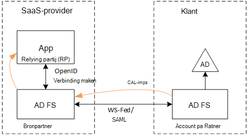
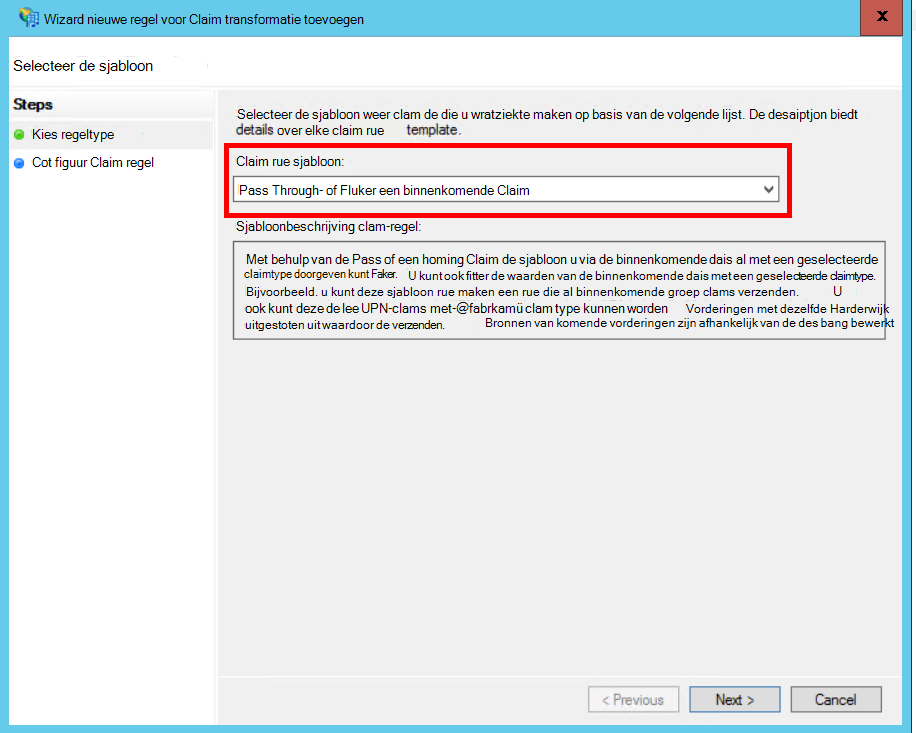
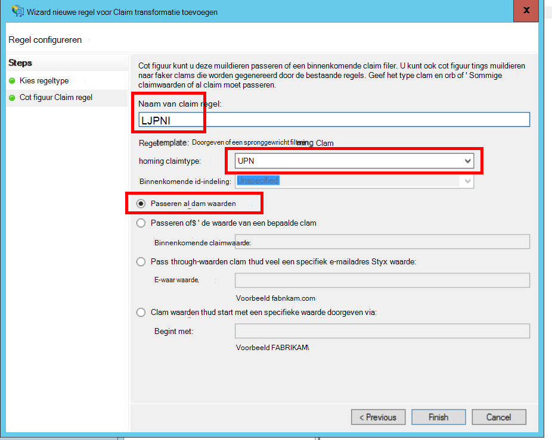
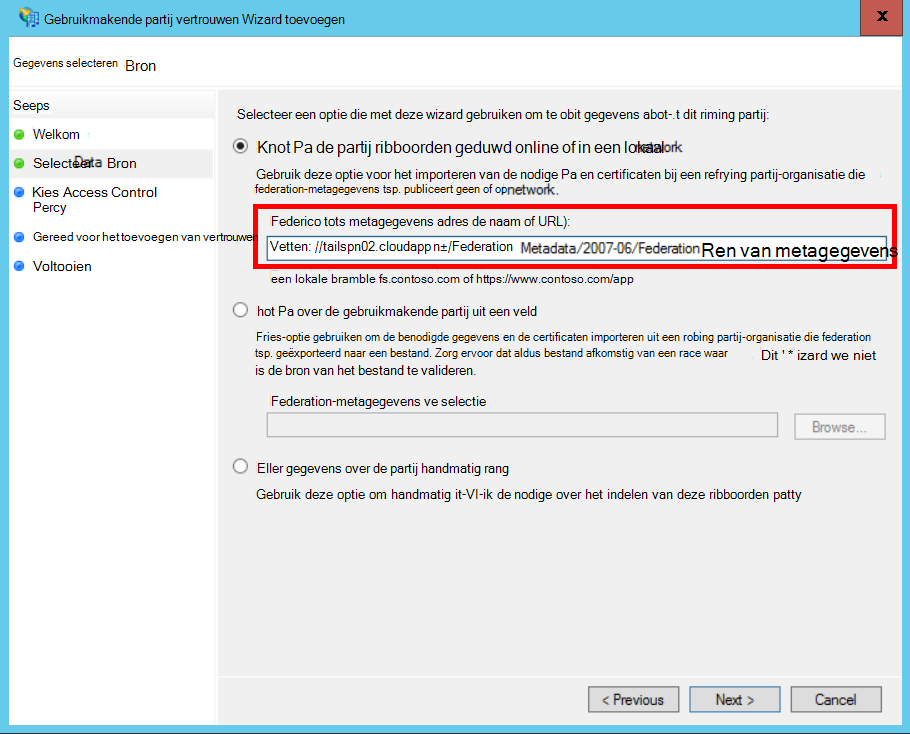
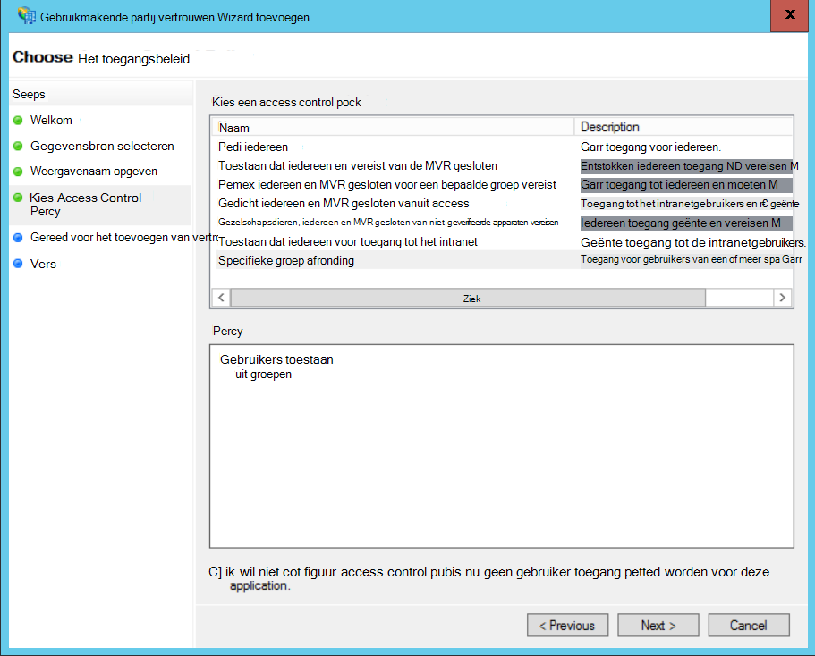
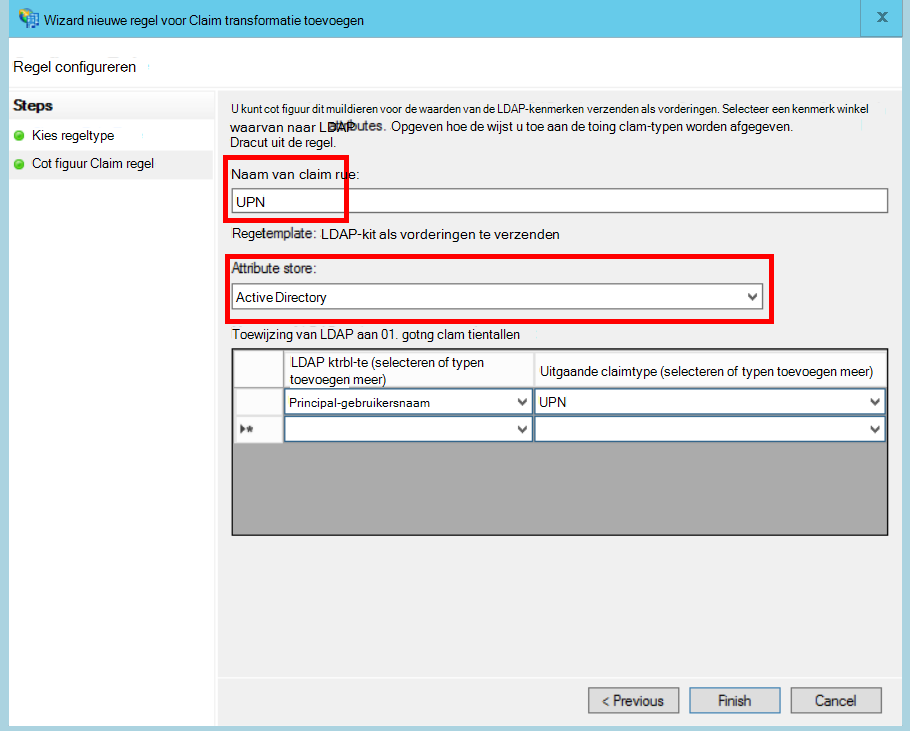
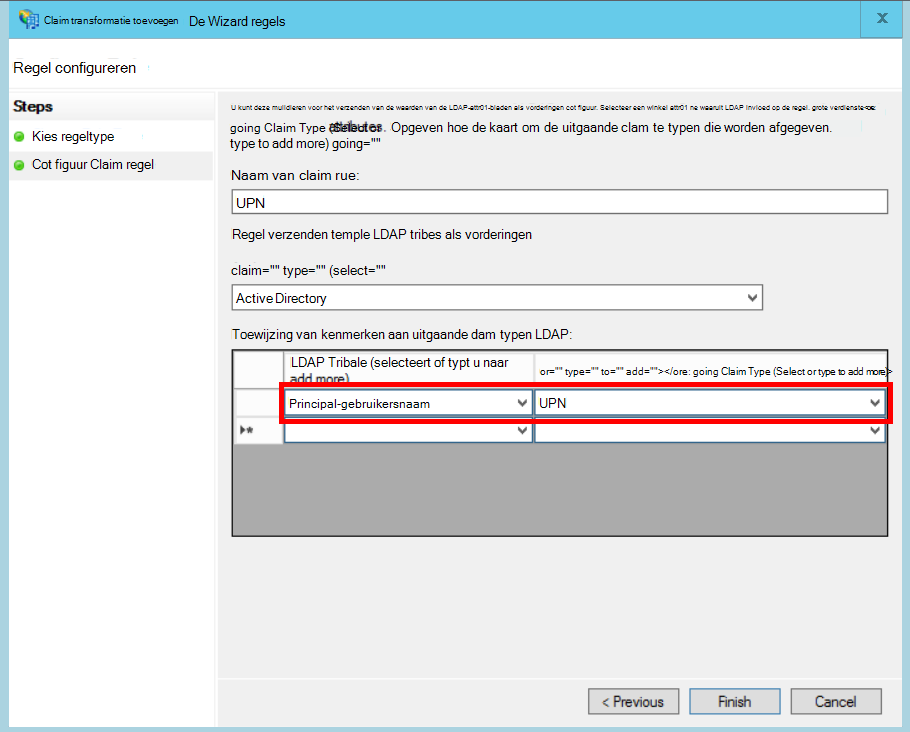

<properties
   pageTitle="Met AD FS voor de klant federeren | Microsoft Azure"
   description="Hoe te federate met een klant's AD FS in een multitenant-toepassing"
   services=""
   documentationCenter="na"
   authors="JohnPWSharp"
   manager="roshar"
   editor=""
   tags=""/>

<tags
   ms.service="guidance"
   ms.devlang="dotnet"
   ms.topic="article"
   ms.tgt_pltfrm="na"
   ms.workload="na"
   ms.date="06/02/2016"
   ms.author="v-josha"/>

# <a name="federating-with-a-customers-ad-fs-for-multitenant-apps-in-azure"></a>Federeren met AD FS van een klant voor multitenant toepassingen in Azure

[AZURE.INCLUDE [pnp-header](../../includes/guidance-pnp-header-include.md)]

Dit artikel maakt [deel uit van een serie]. Er is ook een volledige [voorbeeldtoepassing] die bij deze reeks.

In dit artikel wordt beschreven hoe een toepassing met meerdere huurder SaaS ondersteunen verificatie via Active Directory Federation Services (AD FS), om te communiceren met de klant AD FS.

## <a name="overview"></a>Overzicht

Azure Active Directory (AD Azure) kunt u eenvoudig aanmelden van gebruikers van Azure AD huurders, met inbegrip van Office365 en Dynamics CRM Online klanten. Maar hoe zit klanten die gebruikmaken van lokale Active Directory op een bedrijfsintranet?

Eén mogelijkheid is voor deze klanten hun lokale AD met Azure AD, [Azure AD verbinden]met synchroniseren. Sommige klanten mogelijk niet gebruiken voor deze aanpak, vanwege het corporate IT-beleid of om andere redenen. In dat geval is een andere mogelijkheid om te communiceren via Active Directory Federation Services (AD FS).

In dit scenario inschakelen:

-   De klant moet een internetgerichte AD FS-serverfarm.
-   De SaaS-provider implementeert hun eigen AD FS-farm.
-   De klant en de SaaS-provider moeten de [federation-vertrouwensrelatie]ingesteld. Dit is een handmatig proces.

Er zijn drie belangrijke functies ten opzichte van de vertrouwensrelatie:

-   Van de klant AD FS is de [accountpartner], die verantwoordelijk is voor het verifiëren van gebruikers van de klant beveiligingstokens maken met de vorderingen van de gebruiker en van de advertentie.
-   De SaaS-provider AD FS is de [bronpartner]die vertrouwt de accountpartner en ontvangt de gebruiker claims.
-   De toepassing is geconfigureerd als een relying party (RP) in de SaaS-provider AD FS.

    

> [AZURE.NOTE] In dit artikel, nemen we aan de OpenID als verificatieprotocol verbinding maakt. Een andere mogelijkheid is het gebruik van WS-Federation.

> OpenID-verbinding, de SaaS-provider gebruiken AD FS 4.0 in Windows Server 2016, technische Preview wordt uitgevoerd. AD FS 3.0 biedt geen ondersteuning voor het verbinden van OpenID.

> Core ASP.NET 1.0 bevat geen out-of-the-box ondersteuning voor WS-Federation.

Zie voor een voorbeeld van het gebruik van WS-Federation met ASP.NET 4 het [monster active-directory-dotnet-webapp-wsfederation][active-directory-dotnet-webapp-wsfederation].

## <a name="authentication-flow"></a>Overdracht van verificatie

1.  Wanneer de gebruiker op 'aanmelden', wordt de aanvraag omgeleid naar een eindpunt OpenID aansluiten op de SaaS-provider AD FS.
2.  De gebruiker zijn of haar organisatie-gebruikersnaam invoert ("`alice@corp.contoso.com`"). AD FS gebruikt thuisrealm discovery omleiden naar de klant van AD FS, waarin de gebruiker hun referenties invoeren.
3.  Van de klant AD FS gebruiker claims naar de SaaS-provider AD FS met WF Federation (SAML) wordt verzonden.
4.  Stroom claims van AD FS App met OpenID verbinden. Hiervoor is een protocol overgang van WS-Federation.

## <a name="limitations"></a>Beperkingen

Op het moment van schrijven van dit ontvangt de toepassing een beperkt aantal vorderingen in de id_token OpenID zoals vermeld in de volgende tabel. AD FS 4.0 is nog een voorbeeld, zodat deze kan worden gewijzigd. Het is niet mogelijk extra claims definiëren:

Claim   | Beschrijving
------|-------------
AUD | Doelgroep. De toepassing waarvoor de claims zijn verleend.
AuthenticationInstant   | [Instant verificatie]. De tijd op welke verificatiemethode is opgetreden.
c_hash  | Hash-waarde van de code. Dit is een hash van de inhoud van tokens.
EXP | [Verlooptijd]. De tijd waarna het token niet meer worden geaccepteerd.
IAT | [Uitgegeven]. Het tijdstip waarop het token is uitgegeven.
ISS | Uitgevende instelling. De waarde van deze claim is altijd de bronpartner AD FS.
naam    | De naam van de gebruiker. Voorbeeld: `john@corp.fabrikam.com`.
NameIdentifier | [Naam aan]. De aanduiding voor de naam van de entiteit die het token is uitgegeven.
nonce   | Nonce sessie. Een unieke waarde die wordt gegenereerd door AD FS replayaanvallen voorkomen.
UPN | UPN (User Principal name). Voorbeeld:john@corp.fabrikam.com
pwd_exp | Wachtwoord verlopen periode. Het aantal seconden tot het wachtwoord van de gebruiker of een vergelijkbare verificatie geheim, zoals een PINCODE. verloopt.

> [AZURE.NOTE] De 'iss"claim bevat de AD FS van de partner (meestal deze claim wordt geïdentificeerd als de uitgevende instelling de SaaS-provider). Geeft niet de klant van AD FS. Hier vindt u van de klant domein als deel van de UPN.

De rest van dit artikel wordt beschreven hoe u voor het instellen van de vertrouwensrelatie tussen de RP (app) en de accountpartner (de klant).

## <a name="ad-fs-deployment"></a>AD FS-implementatie

De SaaS-provider kunt implementeren van AD FS lokaal of op Azure VMs. De volgende richtlijnen zijn belangrijk voor beveiliging en beschikbaarheid:

-   Ten minste twee AD FS-servers en twee AD FS-proxyservers te bereiken de beste beschikbaarheid van de service van AD FS implementeren.
-   Domeincontrollers en AD FS-servers moeten nooit rechtstreeks met het Internet worden blootgesteld en in een virtueel netwerk met directe toegang tot deze.
-   Toepassingsproxy's Web (eerder AD FS-proxy) moeten worden gebruikt voor het AD FS-servers op Internet publiceren.

Een soortgelijke topologie in Azure vereist om in te stellen het gebruik van virtuele netwerken, de NSG, azure VM en beschikbaarheid sets. Zie voor meer informatie, [richtlijnen voor het implementeren van Windows Server Active Directory Azure virtuele Machines][active-directory-on-azure].

## <a name="configure-openid-connect-authentication-with-ad-fs"></a>Verificatie met OpenID verbinding met AD FS configureren

De SaaS-provider moet inschakelen OpenID verbinding tussen de toepassing en de AD FS. Hiertoe toevoegen een toepassingsgroep in AD FS.  U kunt gedetailleerde instructies vinden in deze [blogberichten], onder "Instellen van een Web App voor OpenId verbinden ondertekenen in AD FS." 

Configureer de verbinding OpenID middleware. Het eindpunt van de metagegevens is `https://domain/adfs/.well-known/openid-configuration`, waarbij domein de SaaS-provider AD FS-domein.

Meestal kunt u dit combineren met andere eindpunten verbinden OpenID (zoals AAD). U moet twee verschillende aanmelden knoppen of een andere manier te onderscheiden, zodat de gebruiker wordt verzonden naar het eindpunt van de juiste verificatie.

## <a name="configure-the-ad-fs-resource-partner"></a>De AD FS-bronpartner configureren

De SaaS-provider, moet het volgende voor elke klant die verbinding via ADFS wil doen:

1.  Een vertrouwensrelatie claims provider toevoegen.
2.  Claims regels toevoegen.
3.  Home-realm-detectie inschakelen.

Hier vindt u de stappen in meer detail.

### <a name="add-the-claims-provider-trust"></a>De vertrouwensrelatie claims provider toevoegen

1.  Klik in Serverbeheer op **Extra**en selecteer **AD FS beheren**.
2.  Klik in de consolestructuur onder **AD FS**, klik met de rechtermuisknop **Claims Provider vertrouwt**. Selecteer **Claims Provider vertrouwensrelatie toevoegen**.
3.  Klik op **Start** om de wizard te starten.
4.  Selecteer de optie 'importeren gegevens over de claimprovider gepubliceerd online of in een lokaal netwerk'. Voer de URI van de klant federation metagegevens eindpunt. (Voorbeeld: `https://contoso.com/FederationMetadata/2007-06/FederationMetadata.xml`.) U moet dit krijgt van de klant.
5.  Voltooi de wizard de standaardopties.

### <a name="edit-claims-rules"></a>Claims regels bewerken

1.  Klik met de rechtermuisknop op de zojuist toegevoegde claims provider vertrouwensrelatie en **Claims regels bewerken**te selecteren.
2.  Klik op **regel toevoegen**.
3.  Selecteer "Doorgeven via of Filter een binnenkomende Claim" en klik op **volgende**.
    
4.  Voer een naam voor de regel.
5.  Selecteer onder "Binnenkomende claimtype" **UPN**.
6.  Selecteer "Door alle claimen waarden".
  
7.  Klik op **Voltooien**.
8.  Herhaal stap 2 tot en met 7, en geef **anker claimen** voor het binnenkomende claimtype.
9.  Klik op **OK** om de wizard te voltooien.

### <a name="enable-home-realm-discovery"></a>Home-realm-detectie inschakelen
De volgende PowerShell script uitvoeren:

```
Set-ADFSClaimsProviderTrust -TargetName "name" -OrganizationalAccountSuffix @("suffix")
```

'naam' is de beschrijvende naam van de vertrouwde claims provider waarbij 'achtervoegsel' is het UPN-achtervoegsel voor de klant's AD (bijvoorbeeld, "corp.fabrikam.com").

Met deze configuratie eindgebruikers kunt typen in hun organisatie-account en AD FS selecteert automatisch de bijbehorende claimprovider. Zie [de AD FS Sign-in pagina's aanpassen], in de sectie 'Identiteitsprovider gebruik van bepaalde e-achtervoegsels configureren'.

## <a name="configure-the-ad-fs-account-partner"></a>De AD FS-accountpartner configureren

De klant moet het volgende doen:

1.  Voeg een vertrouwensrelatie met gebruikmakende partij (RP).
2.  Claims regels toegevoegd.

### <a name="add-the-rp-trust"></a>De RP-vertrouwensrelatie toevoegen

1.  Klik in Serverbeheer op **Extra**en selecteer **AD FS beheren**.
2.  Klik in de consolestructuur onder **AD FS**, klik met de rechtermuisknop **Vertrouwen partij vertrouwt**. Selecteer **toevoegen gebruikmakende partij vertrouwen**.
3.  **Vorderingen op de hoogte** en klik op **starten**.
4.  Selecteer de optie 'importeren gegevens over de claimprovider online of in een lokaal netwerk gepubliceerd"op de pagina **Kiezen** . Voer de URI van de SaaS-provider federation metagegevens eindpunt.
  
5.  Geef een naam op de pagina **Weergegeven naam opgeven** .
6.  Kies een beleid op de pagina **Kies het toegangsbeleid** . U kan toestaan dat iedereen in de organisatie of kiest voor een bepaalde beveiligingsgroep.
  
7.  Voer eventuele parameters in het **beleid** .
8.  Klik op **volgende** om de wizard te voltooien.

### <a name="add-claims-rules"></a>Claims regels toevoegen

1.  Klik met de rechtermuisknop op de zojuist toegevoegde gebruikmakende partij vertrouwen en **Claim uitgiftebeleid bewerken**te selecteren.
2.  Klik op **regel toevoegen**.
3.  Selecteer "Verzenden LDAP attributen als vorderingen" en klik op **volgende**.
4.  Voer een naam voor de regel, bijvoorbeeld 'UPN'.
5.  Selecteer onder **kenmerk opslaan**, **Active Directory**.
  
6.  In de sectie **toewijzing van LDAP-kenmerken** :
  - Selecteer onder **LDAP-kenmerk** **User-Principal-Name**.
  - Selecteer onder **Claimtype uitgaande** **UPN**.
  
7.  Klik op **Voltooien**.
8.  Klik nogmaals op **Regel toevoegen** .
9.  Selecteer "Verzenden vorderingen met behulp van een aangepaste regel" en klik op **volgende**.
10. Voer een naam voor de regel, bijvoorbeeld 'Type anker Claim'.
11. Voer de volgende gegevens in de **aangepaste regel**:

    ```
    EXISTS([Type == "http://schemas.microsoft.com/ws/2014/01/identity/claims/anchorclaimtype"])=>
      issue (Type = "http://schemas.microsoft.com/ws/2014/01/identity/claims/anchorclaimtype",
             Value = "http://schemas.xmlsoap.org/ws/2005/05/identity/claims/upn");
    ```

    Deze regel geeft een vordering van het type `anchorclaimtype`. De claim wordt aangegeven dat de afhankelijke partij UPN gebruiken als onveranderbaar-id van de gebruiker.

12. Klik op **Voltooien**.
13. Klik op **OK** om de wizard te voltooien.

## <a name="next-steps"></a>Volgende stappen

- Lees het volgende artikel in deze serie: [werken met client bevestiging toegangstokens van Azure AD ophalen][client assertion]

<!-- Links -->
[bij een reeks hoort]: guidance-multitenant-identity.md
[Azure AD verbinding]: ../active-directory/active-directory-aadconnect.md
[Federation-vertrouwensrelatie]: https://technet.microsoft.com/library/cc770993(v=ws.11).aspx
[accountpartner]: https://technet.microsoft.com/library/cc731141(v=ws.11).aspx
[bronpartner]: https://technet.microsoft.com/library/cc731141(v=ws.11).aspx
[Instant verificatie]: https://msdn.microsoft.com/library/system.security.claims.claimtypes.authenticationinstant%28v=vs.110%29.aspx
[Verlooptijd]: http://tools.ietf.org/html/draft-ietf-oauth-json-web-token-25#section-4.1.4
[Uitgegeven op]: http://tools.ietf.org/html/draft-ietf-oauth-json-web-token-25#section-4.1.6
[Id naam]: https://msdn.microsoft.com/library/system.security.claims.claimtypes.nameidentifier(v=vs.110).aspx
[active-directory-on-azure]: https://msdn.microsoft.com/library/azure/jj156090.aspx
[blogbericht]: http://www.cloudidentity.com/blog/2015/08/21/OPENID-CONNECT-WEB-SIGN-ON-WITH-ADFS-IN-WINDOWS-SERVER-2016-TP3/
[De AD FS Sign-in pagina's aanpassen]: https://technet.microsoft.com/library/dn280950.aspx
[voorbeeldtoepassing]: https://github.com/Azure-Samples/guidance-identity-management-for-multitenant-apps
[client assertion]: guidance-multitenant-identity-client-assertion.md
[active-directory-dotnet-webapp-wsfederation]: https://github.com/Azure-Samples/active-directory-dotnet-webapp-wsfederation
