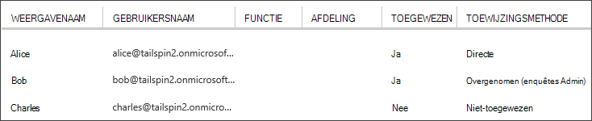

<properties
   pageTitle="Toepassingsrollen | Microsoft Azure"
   description="Het uitvoeren van verificatie met toepassingsrollen"
   services=""
   documentationCenter="na"
   authors="MikeWasson"
   manager="roshar"
   editor=""
   tags=""/>

<tags
   ms.service="guidance"
   ms.devlang="dotnet"
   ms.topic="article"
   ms.tgt_pltfrm="na"
   ms.workload="na"
   ms.date="02/16/2016"
   ms.author="mwasson"/>

#  <a name="application-roles-in-multitenant-applications"></a>De rollen van de toepassing in multitenant-toepassingen

[AZURE.INCLUDE [pnp-header](../../includes/guidance-pnp-header-include.md)]

Dit artikel maakt [deel uit van een serie]. Er is ook een volledige [voorbeeldtoepassing] die bij deze reeks.

Toepassingsrollen worden gebruikt om machtigingen aan gebruikers toewijzen. Bijvoorbeeld [Tailspin enquêtes] [ Tailspin] toepassing definieert de volgende rollen:

- Beheerder. Kan alle CRUD bewerkingen uitvoeren op een enquête die bij deze huurder hoort.
- Maker. Maak nieuwe enquêtes.
- Lezer. Alle onderzoeken die tot de huurder die behoren kan worden gelezen.

U kunt zien dat rollen uiteindelijk in machtigingen, tijdens de [verificatie omgezet krijgen]. Maar de eerste vraag is hoe u kunt toewijzen en beheren van rollen. We drie mogelijkheden geïdentificeerd:

-   [Azure AD App rollen](#roles-using-azure-ad-app-roles)
-   [Azure AD beveiligingsgroepen](#roles-using-azure-ad-security-groups)
-   [Rol van Toepassingsbeheer](#roles-using-an-application-role-manager).

## <a name="roles-using-azure-ad-app-roles"></a>Rollen met Azure AD App rollen

Dit is de benadering die we hebben gebruikt in de app Tailspin enquêtes.

In deze benadering definieert de SaaS-provider de Toepassingsrollen toevoegen aan het manifest van de toepassing. Nadat een klant zich aanmeldt, wijst gebruikers toe aan de rollen van een beheerder voor het AD-directory van de klant. Wanneer een gebruiker zich aanmeldt, zijn claims toegewezen gebruikersrollen verzonden.

> [AZURE.NOTE] De klant heeft Azure AD Premium, de admin een beveiligingsgroep kunt toewijzen aan een rol als leden van de groep neemt de rol van de app. Dit is een handige manier voor het beheren van rollen, omdat de Groepseigenaar van de niet hoeft te worden van een AD-beheerder.

Voordelen van deze benadering:

-   Eenvoudig programmeermodel.
-   Rollen zijn specifiek voor de toepassing. De rol van claims voor één toepassing worden niet verzonden naar een andere toepassing.
-   Als de klant verwijdert u de toepassing van de huurder AD, verdwijnen de rollen.
-   Eventuele extra machtigingen voor Active Directory, dan het lezen van het profiel van de gebruiker nodig niet voor de toepassing.

Nadelen:

- Klanten zonder Azure AD premie toewijzen niet beveiligingsgroepen aan rollen. Voor deze klanten, moeten alle gebruikerstoewijzingen worden uitgevoerd door een beheerder AD.
- Als u een back-end web API die van de web app losstaat, toepast niet op het web API roltoewijzingen voor de web app. Zie voor meer discussie van dit punt [een backend Securing web-API].

### <a name="implementation"></a>Implementatie

**De rollen definiëren.** De SaaS-provider verklaart de app rollen in het [manifest van de toepassing]. Hier is bijvoorbeeld de post manifest voor de toepassing van de onderzoeken:

```
"appRoles": [
  {
    "allowedMemberTypes": [
      "User"
    ],
    "description": "Creators can create Surveys",
    "displayName": "SurveyCreator",
    "id": "1b4f816e-5eaf-48b9-8613-7923830595ad",
    "isEnabled": true,
    "value": "SurveyCreator"
  },
  {
    "allowedMemberTypes": [
      "User"
    ],
    "description": "Administrators can manage the Surveys in their tenant",
    "displayName": "SurveyAdmin",
    "id": "c20e145e-5459-4a6c-a074-b942bbd4cfe1",
    "isEnabled": true,
    "value": "SurveyAdmin"
  }
],
```

De `value` eigenschap wordt weergegeven in de rol van claim. De `id` eigenschap is de unieke id voor de opgegeven rol. Genereert altijd een nieuwe GUID-waarde voor `id`.

**Gebruikers toewijzen**. Als een nieuwe klant zich aanmeldt, wordt de toepassing is geregistreerd in AD-pachter van de klant. Op dit moment toewijzen een beheerder AD voor de huurder die gebruikers aan rollen.

> [AZURE.NOTE] Zoals eerder opgemerkt, kunnen klanten met Azure AD Premium beveiligingsgroepen ook toewijzen aan rollen.

De volgende schermafdruk van het portal voor Azure staan drie gebruikers. Alice is rechtstreeks toegewezen aan een rol. Bob overgenomen een rol als lid van een beveiligingsgroep met de naam 'Enquêtes Admin', die is toegewezen aan een functie. Charles is niet toegewezen aan een rol.



> [AZURE.NOTE] U kunt ook kan de toepassing rollen toewijzen via programmering, Azure AD Graph API gebruiken.  Dit vereist echter dat de toepassing op het verkrijgen van schrijftoegang voor AD-directory van de klant. Een toepassing met die machtigingen kan doen veel verkleinen &mdash; de klant is de app om fouten maken hun directory niet te vertrouwen. Veel klanten wellicht niet bereid zijn dit toegangsniveau verlenen.

**Claims rol krijgen**. Wanneer een gebruiker zich aanmeldt, de toepassing van de gebruiker toegewezen rol(len) ontvangt een vordering met type `http://schemas.microsoft.com/ws/2008/06/identity/claims/role`.  

Een gebruiker kan meerdere rollen of geen rol hebben. In uw code vergunning niet wordt ervan uitgegaan dat de gebruiker heeft precies één rol claimen. In plaats daarvan code schrijven die controleert of de claimwaarde van een bepaalde aanwezig is:

```csharp
if (context.User.HasClaim(ClaimTypes.Role, "Admin")) { ... }
```

## <a name="roles-using-azure-ad-security-groups"></a>Rollen met Azure AD beveiligingsgroepen

In deze benadering worden rollen AD-beveiligingsgroepen voorgesteld. De toepassing wordt toegewezen machtigingen aan gebruikers op basis van de lidmaatschappen van beveiligingsgroepen.

Voordelen:

-   Voor klanten die geen Azure AD Premium, hierdoor de klant met behulp van beveiligingsgroepen beheren roltoewijzingen.

Nadelen:

- Complexiteit. Omdat elke huurder vorderingen van de andere groep worden verzonden, de app moet bijhouden van welke toepassingsrollen beveiligingsgroepen met voor iedere huurder.
- Als de klant de toepassing van hun AD huurder wordt verwijderd, worden de beveiligingsgroepen in hun directory AD links.

### <a name="implementation"></a>Implementatie

Stel in het manifest van de toepassing, de `groupMembershipClaims` eigenschap 'SecurityGroup'. Dit is nodig om groepclaims lidmaatschap van AAD.

```
{
   // ...
   "groupMembershipClaims": "SecurityGroup",
}
```

Als een nieuwe klant zich aanmeldt, geeft de toepassing de opdracht maken van beveiligingsgroepen voor de functies die nodig zijn voor de toepassing van de klant. De klant moet de groepsobject-id's invoeren in de toepassing. De toepassing wordt opgeslagen in een tabel die groeps-id's aan rollen van toepassing per huurder toewijst.

> [AZURE.NOTE] Ook de toepassing kan de groepen maken via programmacode, Azure AD Graph API gebruiken.  Dit is minder foutgevoelig. Echter, moet de toepassing verkrijgen 'lezen en schrijven alle groepen' machtigingen voor AD-map van de klant. Veel klanten wellicht niet bereid zijn dit toegangsniveau verlenen.

Wanneer een gebruiker zich aanmeldt:

1.  Groepen van de gebruiker ontvangt de toepassing als vorderingen. De waarde van elke claim is de object-ID van een groep.
2.  Azure AD beperkt het aantal groepen in het token wordt verzonden. Als het aantal groepen deze limiet overschrijdt, stuurt AD Azure een speciale "overschot" claim. Als de claim die aanwezig is, moet de toepassing de API Azure AD grafiek als u alle groepen waartoe de gebruiker behoort opvragen. Zie voor meer informatie [vergunning in Cloud-toepassingen met behulp van AD groepen] onder de sectie "Groepen beweren overschot".
3.  De toepassing zoekt u de object-id's in een eigen database, zoekt u de bijbehorende toepassingsrollen toe te wijzen aan de gebruiker.
4.  De toepassing wordt de waarde van een aangepaste claim toegevoegd aan de UPN die de toepassingsrol van. Bijvoorbeeld: `survey_role` = "SurveyAdmin".

Autorisatiebeleid gebruik de claim aangepaste rol claimen niet de groep.

## <a name="roles-using-an-application-role-manager"></a>Met behulp van de functie van manager, een toepassing rollen

Met deze methode worden toepassingsrollen niet opgeslagen in Azure AD helemaal. In plaats daarvan de roltoewijzingen voor elke gebruiker in de toepassing worden opgeslagen in een eigen DB &mdash; , bijvoorbeeld met behulp van de **RoleManager** -klasse in ASP.NET-identiteit.

Voordelen:

-   De app heeft volledige controle over de rollen en toewijzingen.

Nadelen:

- Complexer en moeilijker te onderhouden.
- Niet AD beveiligingsgroepen gebruiken voor het beheren van roltoewijzingen.
- Gebruikersinformatie wordt opgeslagen in de database van de toepassing, waar het kan niet meer synchroon met AD-directory van de huurder, wanneer gebruikers worden toegevoegd of verwijderd.   

Er zijn vele bestaande voorbeelden van deze aanpak. Zie bijvoorbeeld [een ASP.NET-MVC app met verificatie en SQL DB maken en implementeren met Azure App-Service].

## <a name="next-steps"></a>Volgende stappen

- Lees het volgende artikel in deze serie: [rol- en resource vergunning in multitenant toepassingen][vergunning]

<!-- Links -->
[Tailspin]: guidance-multitenant-identity-tailspin.md
[bij een reeks hoort]: guidance-multitenant-identity.md
[autorisatie]: guidance-multitenant-identity-authorize.md
[Een back-end web API beveiligen]: guidance-multitenant-identity-web-api.md
[Een ASP.NET-MVC app met verificatie en SQL DB maken en implementeren met Azure App Service]: ../app-service-web/web-sites-dotnet-deploy-aspnet-mvc-app-membership-oauth-sql-database.md
[manifest van de toepassing]: ../active-directory/active-directory-application-manifest.md
[voorbeeldtoepassing]: https://github.com/Azure-Samples/guidance-identity-management-for-multitenant-apps
