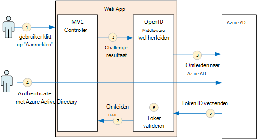
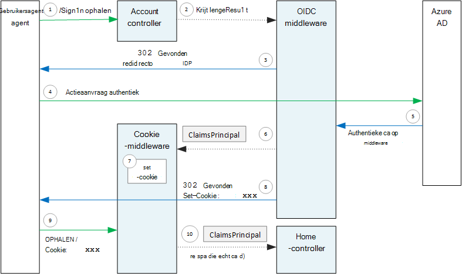

<properties
   pageTitle="Verificatie in toepassingen multitenant | Microsoft Azure"
   description="Hoe een multitenant toepassing gebruikers uit Azure Active Directory kan verifiëren"
   services=""
   documentationCenter="na"
   authors="MikeWasson"
   manager="roshar"
   editor=""
   tags=""/>

<tags
   ms.service="guidance"
   ms.devlang="dotnet"
   ms.topic="article"
   ms.tgt_pltfrm="na"
   ms.workload="na"
   ms.date="05/23/2016"
   ms.author="mwasson"/>

# <a name="authentication-in-multitenant-apps-using-azure-ad-and-openid-connect"></a>Verificatie in de multitenant apps, met Azure AD en OpenID verbinden

[AZURE.INCLUDE [pnp-header](../../includes/guidance-pnp-header-include.md)]

Dit artikel maakt [deel uit van een serie](guidance-multitenant-identity.md). Er is ook een volledige [voorbeeldtoepassing] die bij deze reeks.

In dit artikel wordt beschreven hoe een multitenant-toepassing kunt verifiëren van gebruikers van Azure Active Directory (AD Azure), OpenID verbinden (OIDC) gebruikt om te verifiëren.

## <a name="overview"></a>Overzicht

Onze [referentie-implementatie](guidance-multitenant-identity-tailspin.md) is een toepassing van ASP.NET Core 1.0. De toepassing gebruikt de ingebouwde OpenID verbinding middleware voor het uitvoeren van de stroom OIDC verificatie. In het volgende diagram ziet u wat er gebeurt wanneer de gebruiker zich, op een hoog niveau aanmeldt.



1.  De gebruiker klikt op de knop 'aanmelden' in de app. Deze actie wordt uitgevoerd door een MVC-controller.
2.  De controller MVC geeft als resultaat een **ChallengeResult** -actie.
3.  De middleware onderschept de **ChallengeResult** en maakt een 302 antwoord dat wordt de gebruiker omgeleid naar de aanmeldingspagina van Azure AD.
4.  De gebruiker wordt geverifieerd met Azure Active Directory.
5.  Een ID-token verzendt Azure AD naar de toepassing.
6.  De middleware valideert het ID-token. Op dit moment wordt de gebruiker nu geverifieerd in de toepassing.
7.  De middleware wordt de gebruiker omgeleid naar de toepassing.

## <a name="register-the-app-with-azure-ad"></a>De app met Azure Active Directory registreren

De SaaS-provider registreert zodat OpenID verbinding maken met de toepassing binnen hun eigen AD Azure huurder.

Volg de stappen in de [Integratie van toepassingen met Azure Active Directory](../active-directory/active-directory-integrating-applications.md)in de sectie [een toepassing toe te voegen](../active-directory/active-directory-integrating-applications.md#adding-an-application)de toepassing.

In de pagina **configureren** :

-   Let op de client-ID.
-   Selecteer **Ja**onder **toepassing meerdere huurder is**.
-   **Antwoord URL** ingesteld op een URL waar Azure AD stuurt de verificatiereactie. U kunt de basis-URL van uw app.
  - Opmerking: Het URL-pad kan van alles zijn, zolang de hostnaam overeenkomt met de geïmplementeerde app.
  - U kunt meerdere URL's voor antwoord instellen. Tijdens de ontwikkeling, kunt u een `localhost` voor het uitvoeren van de app lokaal adres.
-   Genereren van een client geheim: onder **toetsen**, klik op de vervolgkeuzelijst **Selecteer duur** en pick 1 of 2 jaar zegt. De sleutel zijn zichtbaar wanneer u op **Opslaan**klikt. Zorg ervoor dat de waarde, omdat deze niet weer wordt weergegeven wanneer u de configuratiepagina opnieuw laden.

## <a name="configure-the-auth-middleware"></a>De middleware verificatie configureren

In deze sectie wordt beschreven hoe de middleware verificatie in ASP.NET Core 1.0 voor multitenant-verificatie met OpenID verbinding configureren.

Toevoegen in uw Opstartklasse de middleware OpenID verbinding:

```csharp
app.UseOpenIdConnectAuthentication(options =>
{
    options.AutomaticAuthenticate = true;
    options.AutomaticChallenge = true;
    options.ClientId = [client ID];
    options.Authority = "https://login.microsoftonline.com/common/";
    options.CallbackPath = [callback path];
    options.PostLogoutRedirectUri = [application URI];
    options.SignInScheme = CookieAuthenticationDefaults.AuthenticationScheme;
    options.TokenValidationParameters = new TokenValidationParameters
    {
        ValidateIssuer = false
    };
    options.Events = [event callbacks];
});
```

> [AZURE.NOTE] Zie [Startup.cs](https://github.com/Azure-Samples/guidance-identity-management-for-multitenant-apps/blob/master/src/Tailspin.Surveys.Web/Startup.cs).

Zie voor meer informatie over de opstartklasse [Starten van de toepassing](https://docs.asp.net/en/latest/fundamentals/startup.html) in de documentatie van ASP.NET Core 1.0.

De volgende middleware-opties instellen:

- **ClientId**. Van de toepassing client-ID, die u kreeg toen u de toepassing geregistreerd in Azure AD.
- **Autoriteit**. Voor een multitenant toepassing deze optie instellen op `https://login.microsoftonline.com/common/`. Dit is de URL voor het gemeenschappelijke eindpunt Azure AD, waarmee gebruikers vanuit elke huurder Azure AD aan te melden. Zie voor meer informatie over de algemene eindpunt [dit blogbericht](http://www.cloudidentity.com/blog/2014/08/26/the-common-endpoint-walks-like-a-tenant-talks-like-a-tenant-but-is-not-a-tenant/).
- Stel in **TokenValidationParameters**, **ValidateIssuer** op false. Dit betekent dat de app zijn verantwoordelijk voor het valideren van de waarde van de uitgevende instelling in de ID-token. (De middleware valideert nog steeds de token zelf.) Zie voor meer informatie over het valideren van de uitgevende instelling, [de validatie van de uitgevende instelling](guidance-multitenant-identity-claims.md#issuer-validation).
- **CallbackPath**. Stel dit gelijk aan het pad in de antwoord-URL die u hebt geregistreerd in Azure AD. Als het antwoord op de URL is bijvoorbeeld `http://contoso.com/aadsignin`, **CallbackPath** dient te worden `aadsignin`. Als u deze optie niet instelt, wordt de standaardwaarde is `signin-oidc`.
- **PostLogoutRedirectUri**. Geef een URL wilt omleiden van gebruikers na het afmelden. Dit moet een pagina waarmee anonieme aanvragen &mdash; meestal de introductiepagina.
- **SignInScheme**. Deze optie instellen op `CookieAuthenticationDefaults.AuthenticationScheme`. Deze instelling betekent dat nadat de gebruiker is geverifieerd, de vorderingen van de gebruiker lokaal in een cookie opgeslagen worden. Deze cookie is hoe de gebruiker is aangemeld blijft tijdens de browsersessie.
- **Gebeurtenissen.** Retouraanroepen gebeurtenis; Zie [verificatie-gebeurtenissen](#authentication-events).

De middleware Cookie-verificatie ook toevoegen aan de pijpleiding. Deze middleware is verantwoordelijk voor de vorderingen van de gebruiker om een cookie te schrijven en vervolgens de cookie te lezen tijdens het laden van volgende pagina.

```csharp
app.UseCookieAuthentication(options =>
{
    options.AutomaticAuthenticate = true;
    options.AutomaticChallenge = true;
    options.AccessDeniedPath = "/Home/Forbidden";
});
```

## <a name="initiate-the-authentication-flow"></a>De verificatie-stroom start

Begin de stroom verificatie in ASP.NET MVC, een **ChallengeResult** van de contoller te retourneren:

```csharp
[AllowAnonymous]
public IActionResult SignIn()
{
    return new ChallengeResult(
        OpenIdConnectDefaults.AuthenticationScheme,
        new AuthenticationProperties
        {
            IsPersistent = true,
            RedirectUri = Url.Action("SignInCallback", "Account")
        });
}
```

Hierdoor wordt de middleware antwoord 302 (gevonden) die leidt naar het eindpunt van de verificatie.

## <a name="user-login-sessions"></a>Gebruikersaanmeldingssessies

Zoals gezegd, wanneer de gebruiker eerst ondertekent, schrijft de middleware Cookie-verificatie vorderingen van de gebruiker aan een cookie. Daarna, HTTP-aanvragen worden geverifieerd door het lezen van de cookie.

Standaard schrijft de middleware cookie een [sessiecookie][session-cookie], welke haalt verwijderd zodra de gebruiker de browser sluit. De volgende keer dat de gebruiker vervolgens de site bezoekt, hebben ze opnieuw inloggen. Echter, als u **IsPersistent** op true in de **ChallengeResult instelt**, de middleware schrijft een permanente cookie, zodat de gebruiker is aangemeld blijft na het sluiten van de browser. U kunt de cookie verloopt; Zie [Opties voor Controlling cookie][cookie-options]. Permanente cookies zijn handiger voor de gebruiker, maar is mogelijk niet geschikt voor bepaalde toepassingen (zeg, de toepassing van een bank) waar u wilt dat de gebruiker aan te melden telkens.

## <a name="about-the-openid-connect-middleware"></a>Over het verbinden van OpenID middleware

De meeste van de protocoldetails, de middleware OpenID verbinding in ASP.NET wordt verborgen. Deze sectie bevat informatie over de uitvoering die nuttig zijn kunnen voor het begrijpen van de stroom van het protocol.

Ten eerste onderzoeken we de stroom van de verificatie voor ASP.NET (niet de details van de stroom OIDC protocol tussen de app en Azure AD). In het volgende diagram ziet u het proces.



In dit diagram zijn er twee MVC controllers. De controller Account aanmelden verzoeken verwerkt en de controller thuis dient van de introductiepagina.

Hier ziet u het verificatieproces:

1. De gebruiker klikt op de knop "Aanmelden" en de browser een GET-verzoek verzendt. Bijvoorbeeld: `GET /Account/SignIn/`.
2. De account controller geeft als resultaat een `ChallengeResult`.
3. De middleware OIDC retourneert een HTTP 302-antwoord, omleiden naar Azure AD.
4. De browser stuurt de verificatieaanvraag naar Azure AD
5. De gebruiker zich aanmeldt bij AD Azure, en Azure AD terug stuurt een verificatiereactie.
6. De middleware OIDC maakt een hoofdsom van vorderingen en wordt doorgegeven aan de middleware Cookie-verificatie.
7. De cookie middleware serialiseert de hoofdsom van vorderingen en wordt een cookie ingesteld.
8. De middleware OIDC leidt tot callback-URL van de toepassing.
10. De browser volgt de omleiding, de cookie in de aanvraag te verzenden.
11. De middleware cookie deserializes de cookie een principal vorderingen en stelt `HttpContext.User` gelijk is aan de aangever vorderingen. De aanvraag wordt doorgestuurd naar een domeincontroller MVC.

### <a name="authentication-ticket"></a>Verificatieticket

Als de verificatie slaagt, maakt de OIDC middleware een verificatieticket met een hoofdsom van vorderingen die in het bezit van de vorderingen van de gebruiker. Toegang tot het ticket in de gebeurtenis **AuthenticationValidated** of **TicketReceived** .

> [AZURE.NOTE] Totdat de volledige verificatie stroom is voltooid, `HttpContext.User` wel een anonieme principal, _niet_ de geverifieerde gebruiker. De anonieme principal heeft een collectie leeg vorderingen. Nadat de verificatie is voltooid en de omleidingen app de cookie middleware deserializes verificatiecookie en sets `HttpContext.User` aan een principal claims die de geverifieerde gebruiker vertegenwoordigt.

### <a name="authentication-events"></a>Verificatiegebeurtenissen

Tijdens het verificatieproces verhoogt de middleware OpenID verbinding maken met een reeks gebeurtenissen:

- **RedirectToAuthenticationEndpoint**. Wordt aangeroepen direct voordat de middleware wordt omgeleid naar het eindpunt van de verificatie. U kunt deze gebeurtenis de omleidings-URL wijzigen Als u bijvoorbeeld aanvraagparameters toevoegen. Zie [de admin-prompt toestemming toe te voegen](guidance-multitenant-identity-signup.md#adding-the-admin-consent-prompt) voor een voorbeeld.

- **AuthorizationResponseReceived**. Nadat de middleware de verificatiereactie ontvangt van de identiteitsprovider (IDP), maar voordat de middleware evalueert het antwoord genoemd.  

- **AuthorizationCodeReceived**. Met de code van de vergunning genoemd.

- **TokenResponseReceived**. Wordt aangeroepen nadat de middleware een token van de IDP krijgt. Geldt alleen voor autorisatie code stroom.

- **AuthenticationValidated**. Wordt aangeroepen nadat de middleware het ID-token valideert. De toepassing heeft nu een reeks gevalideerde claims over de gebruiker. U kunt deze gebeurtenis gebruiken voor het uitvoeren van extra validatie op de vorderingen of vorderingen transformeren. Zie [werken met vorderingen](guidance-multitenant-identity-claims.md).

- **UserInformationReceived**. Als de middleware afkomstig is het profiel van de gebruiker info eindpunt genoemd. Geldt alleen voor autorisatie code stroom en alleen wanneer `GetClaimsFromUserInfoEndpoint = true` in de opties van middleware.

- **TicketReceived**. Wordt aangeroepen wanneer de verificatie is voltooid. Dit is de laatste gebeurtenis, ervan uitgaande dat de verificatie is geslaagd. Wanneer deze gebeurtenis plaatsvindt, moet de gebruiker is aangemeld in de app.

- **AuthenticationFailed**. Genoemd als de verificatie mislukt. Gebruik deze gebeurtenis om verificatie storingen te verhelpen &mdash; bijvoorbeeld door te leiden naar een foutpagina.

Stel de optie **gebeurtenissen** op de middleware wilt retouraanroepen opgeven voor deze gebeurtenissen. Er zijn twee verschillende manieren declareren de gebeurtenis-handlers: Inline met lambdas, of in een klasse die is afgeleid van **OpenIdConnectEvents**.

In line met lambdas:

```csharp
app.UseOpenIdConnectAuthentication(options =>
{
    // Other options not shown.

    options.Events = new OpenIdConnectEvents
    {
        OnTicketReceived = (context) =>
        {
             // Handle event
             return Task.FromResult(0);
        },
        // other events
    }
});
```

Die voortvloeien uit **OpenIdConnectEvents**:

```csharp
public class SurveyAuthenticationEvents : OpenIdConnectEvents
{
    public override Task TicketReceived(TicketReceivedContext context)
    {
        // Handle event
        return base.TicketReceived(context);
    }
    // other events
}

// In Startup.cs:
app.UseOpenIdConnectAuthentication(options =>
{
    // Other options not shown.

    options.Events = new SurveyAuthenticationEvents();
});
```

De tweede aanpak wordt aanbevolen als uw gebeurtenis callbacks alle belangrijke logica, hebben zodat dit niet meer uw Opstartklasse. Onze referentie-implementatie worden gebruikt voor deze benadering; Zie [SurveyAuthenticationEvents.cs](https://github.com/Azure-Samples/guidance-identity-management-for-multitenant-apps/blob/master/src/Tailspin.Surveys.Web/Security/SurveyAuthenticationEvents.cs).

### <a name="openid-connect-endpoints"></a>OpenID eindpunten verbinden

Azure AD ondersteunt [OpenID verbinding Discovery](https://openid.net/specs/openid-connect-discovery-1_0.html), waarin de identiteitsprovider (IDP) geeft als een JSON metagegevensdocument van een [bekende eindpunt resultaat](https://openid.net/specs/openid-connect-discovery-1_0.html#ProviderConfig). De metagegevensdocument bevat informatie zoals:

-   De URL van het eindpunt van de vergunning. Dit is waar de app voor de verificatie van de gebruiker wordt omgeleid.
-   De URL van het eindpunt "sessie beëindigen", waar de app gaat u naar de gebruiker afmelden.
-   De URL voor de handtekeningsleutels waarmee de client wordt gebruikt voor het valideren van de OIDC-tokens die wordt opgehaald uit de IDP.

Standaard weet de middleware OIDC hoe deze metagegevens ophalen. De **autoriteit** de optie instellen in de middleware en de middleware wordt de URL voor de metagegevens. (U kunt de URL voor metagegevens negeren door de optie **MetadataAddress** .)

### <a name="openid-connect-flows"></a>OpenID verbinding stromen

Standaard gebruikt de OIDC middleware hybride stroom formuliermodus post antwoord.

-   _Hybride stroom_ betekent dat de client krijgt een token ID en een autorisatiecode in de dezelfde ommetje naar de server van de vergunning.
-   _Formulier boeken antwoord modus_ betekent dat vergunning maakt de server een HTTP-POST-aanvraag verzendt de id-token en de autorisatie code App. De waarden zijn formulier urlencoded (content-type = "application/x-1-800-www-Dell-form-urlencoded").

Wanneer de OIDC middleware wordt omgeleid naar het eindpunt van de vergunning, wordt de omleidings-URL bevat alle van de queryreeks-parameters die nodig zijn voor OIDC. Hybride overdracht:

-   client_id. Deze waarde is ingesteld in de optie **ClientId**
-   scope = "openid profiel", wat betekent dat een aanvraag voor OIDC is en we willen dat het profiel van de gebruiker.
-   response_type = "id_token code". Hiermee geeft u de hybride stroom.
-   response_mode = "form_post". Hiermee geeft u de post-antwoordformulier.

Als u een andere stroom, stelt u de eigenschap **ResponseType** van de opties. Bijvoorbeeld:

```csharp
app.UseOpenIdConnectAuthentication(options =>
{
    options.ResponseType = "code"; // Authorization code flow

    // Other options
}
```

## <a name="next-steps"></a>Volgende stappen

- Lees het volgende artikel in deze serie: [werken met identiteiten in multitenant-toepassingen op basis van claims][claims]


[claims]: guidance-multitenant-identity-claims.md
[cookie-options]: https://docs.asp.net/en/latest/security/authentication/cookie.html#controlling-cookie-options
[session-cookie]: https://en.wikipedia.org/wiki/HTTP_cookie#Session_cookie
[voorbeeldtoepassing]: https://github.com/Azure-Samples/guidance-identity-management-for-multitenant-apps
