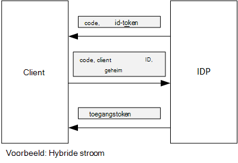

<properties
   pageTitle="Met bevestiging van client access tokens ophalen van Azure AD | Microsoft Azure"
   description="Het gebruik van client-bevestiging toegangstokens ophalen uit Azure Active Directory."
   services=""
   documentationCenter="na"
   authors="MikeWasson"
   manager="roshar"
   editor=""
   tags=""/>

<tags
   ms.service="guidance"
   ms.devlang="dotnet"
   ms.topic="article"
   ms.tgt_pltfrm="na"
   ms.workload="na"
   ms.date="05/23/2016"
   ms.author="mwasson"/>

# <a name="using-client-assertion-to-get-access-tokens-from-azure-ad"></a>Met behulp van bevestiging van de client access tokens ophalen van Azure AD

[AZURE.INCLUDE [pnp-header](../../includes/guidance-pnp-header-include.md)]

Dit artikel maakt [deel uit van een serie]. Er is ook een volledige [voorbeeldtoepassing] die bij deze reeks.

## <a name="background"></a>Achtergrond

Als u autorisatie code stroom of hybride stroom in verbinding OpenID, wisselt de client een code van de vergunning voor een toegangstoken. Tijdens deze stap wordt heeft de client zichzelf verifiëren met de server.



Er is een manier om de client te verifiëren met behulp van een geheim van de client. Dat hoe de [Tailspin enquêtes] [ Surveys] toepassing standaard geconfigureerd.

Hier volgt een voorbeeld van de aanvraag van de client naar de IDP, vraagt een toegangstoken. Opmerking de `client_secret` parameter.

```
POST https://login.microsoftonline.com/b9bd2162xxx/oauth2/token HTTP/1.1
Content-Type: application/x-www-form-urlencoded

resource=https://tailspin.onmicrosoft.com/surveys.webapi
  &client_id=87df91dc-63de-4765-8701-b59cc8bd9e11
  &client_secret=i3Bf12Dn...
  &grant_type=authorization_code
  &code=PG8wJG6Y...
```

Het geheim is gewoon een tekenreeks, zodat u niet op de waarde lekken. De beste manier is om het geheim van de client van het besturingselement. Wanneer u op Azure implementeren, slaat u het geheim in een [instelling app][configure-web-app].

Iedereen met toegang tot de Azure abonnement kan echter de instellingen app bekijken. Bovendien is er altijd een komen om geheimen te controleren in het besturingselement (bijvoorbeeld in een implementatie van scripts), ze delen via e-mail, enzovoort.

Voor extra beveiliging kunt u [bevestiging van de client] in plaats van een geheim van de client. Met de bevestiging van de client gebruikt de client een x.509-certificaat aan te tonen dat de tokenaanvraag afkomstig is van de client. Dit certificaat is geïnstalleerd op de webserver. Deze worden over het algemeen gemakkelijker toegang te beperken tot het certificaat, dan ervoor te zorgen dat niemand per ongeluk een geheim van de client blijkt. Zie voor meer informatie over het configureren van certificaten in een web app [Met behulp van certificaten in Azure Websites toepassingen][using-certs-in-websites]

Dit is een bevestiging van de client met tokenaanvraag:

```
POST https://login.microsoftonline.com/b9bd2162xxx/oauth2/token HTTP/1.1
Content-Type: application/x-www-form-urlencoded

resource=https://tailspin.onmicrosoft.com/surveys.webapi
  &client_id=87df91dc-63de-4765-8701-b59cc8bd9e11
  &client_assertion_type=urn:ietf:params:oauth:client-assertion-type:jwt-bearer
  &client_assertion=eyJhbGci...
  &grant_type=authorization_code
  &code= PG8wJG6Y...
```

Merk op dat de `client_secret` niet langer gebruikt. In plaats daarvan de `client_assertion` parameter bevat een JWT token dat is ondertekend met een certificaat. De `client_assertion_type` parameter geeft het type bevestiging &mdash; in dit geval JWT token. De JWT token is geverifieerd door de server. Als het token JWT ongeldig is, wordt een fout geretourneerd door de tokenaanvraag.

> [AZURE.NOTE] X.509-certificaten zijn niet de enige vorm van bevestiging van de client; We richten ons op het hier omdat het wordt ondersteund door AD Azure.

## <a name="using-client-assertion-in-the-surveys-application"></a>In de toepassing onderzoeken met behulp van client-bevestiging

In dit gedeelte ziet u hoe de enquêtes Tailspin toepassing configureren voor bevestiging van de client te gebruiken. In deze stappen, genereert u een zelf-ondertekend certificaat dat geschikt is voor ontwikkeling, maar niet voor productiedoeleinden.

1. Voer de PowerShell script [/Scripts/Setup-KeyVault.ps1] [ Setup-KeyVault] als volgt:

    ```
    .\Setup-KeyVault.ps -Subject [subject]
    ```

    Voor de `Subject` parameter, voer een naam, bijvoorbeeld 'surveysapp'. Het script een zelfondertekend certificaat wordt gegenereerd en opgeslagen in het certificaatarchief van de "huidige gebruiker/persoonlijk".

2. De uitvoer van het script is een fragment JSON. Dit toevoegen aan het manifest van de toepassing van het web app als volgt:

    1. Meld u aan bij de [Azure management portal] [ azure-management-portal] en Ga naar de map Azure AD.

    2. Klik op **toepassingen**.

    3. Selecteer de toepassing onderzoeken.

    4.  Op **Het Manifest beheren** en selecteer **Manifest downloaden**.

    5.  Het manifest JSON-bestand in een teksteditor openen. Plak de uitvoer van het script in de `keyCredentials` eigenschap. Het ziet er ongeveer als volgt:

        ```    
        "keyCredentials": [
            {
              "type": "AsymmetricX509Cert",
              "usage": "Verify",
              "keyId": "29d4f7db-0539-455e-b708-....",
              "customKeyIdentifier": "ZEPpP/+KJe2fVDBNaPNOTDoJMac=",
              "value": "MIIDAjCCAeqgAwIBAgIQFxeRiU59eL.....
            }
          ],
         ```

    6.  Sla uw wijzigingen naar het bestand JSON.

    7.  Ga terug naar de portal. Klik op **Beheren Manifest** > **Manifest uploaden** en de JSON-bestand uploaden.

3. Voer de volgende opdracht om de blauwdruk van het certificaat.

    ```
    certutil -store -user my [subject]
    ```

    waarbij `[subject]` is de waarde die u hebt opgegeven voor het onderwerp in het PowerShell-script. De vingerafdruk wordt vermeld onder "Cert-Hash(sha1)". Verwijdert de spaties tussen de hexadecimale getallen.

4. Uw geheimen app bijwerken. In Solution Explorer met de rechtermuisknop op het Tailspin.Surveys.Web-project en selecteer **Gebruiker geheimen beheren**. Een vermelding toevoegen voor "Asymmetric' onder 'AzureAd', zoals hieronder wordt weergegeven:

    ```
    {
      "AzureAd": {
        "ClientId": "[Surveys application client ID]",
        // "ClientSecret": "[client secret]",  << Delete this entry
        "PostLogoutRedirectUri": "https://localhost:44300/",
        "WebApiResourceId": "[App ID URI of your Survey.WebAPI application]",
        // new:
        "Asymmetric": {
          "CertificateThumbprint": "[certificate thumbprint]",  // Example: "105b2ff3bc842c53582661716db1b7cdc6b43ec9"
          "StoreName": "My",
          "StoreLocation": "CurrentUser",
          "ValidationRequired": "false"
        }
      },
      "Redis": {
        "Configuration": "[Redis connection string]"
      }
    }
    ```

    U moet instellen `ValidationRequired` op false, omdat het certificaat niet door een hoofd-CA-instantie een ondertekend is. In productie, een certificaat gebruikt dat is ondertekend door een Certificeringsinstantie en `ValidationRequired` op true.

    Verwijder ook de vermelding voor `ClientSecret`, omdat het niet nodig met de bewering van de client is.

5. Zoek de code die wordt geregistreerd in de Startup.cs, de `ICredentialService`. Opmerkingen bij de regel die gebruikmaakt van `CertificateCredentialService`, en het commentaar van de regel die gebruikmaakt van `ClientCredentialService`:

    ```csharp
    // Uncomment this:
    services.AddSingleton<ICredentialService, CertificateCredentialService>();
    // Comment out this:
    //services.AddSingleton<ICredentialService, ClientCredentialService>();
    ```

Tijdens de runtime leest de webtoepassing het certificaat uit het certificaatarchief. Het certificaat moet worden geïnstalleerd op dezelfde computer als de web app.

## <a name="next-steps"></a>Volgende stappen

- Lees het volgende artikel in deze serie: [Azure sleutel kluis geheimen toepassing beveiligen met behulp van][key vault]


<!-- Links -->
[configure-web-app]: ../app-service-web/web-sites-configure.md
[azure-management-portal]: https://manage.windowsazure.com
[bevestiging van de client]: https://tools.ietf.org/html/rfc7521
[key vault]: guidance-multitenant-identity-keyvault.md
[Setup-KeyVault]: https://github.com/Azure-Samples/guidance-identity-management-for-multitenant-apps/blob/master/scripts/Setup-KeyVault.ps1
[Surveys]: guidance-multitenant-identity-tailspin.md
[using-certs-in-websites]: https://azure.microsoft.com/blog/using-certificates-in-azure-websites-applications/
[bij een reeks hoort]: guidance-multitenant-identity.md
[voorbeeldtoepassing]: https://github.com/Azure-Samples/guidance-identity-management-for-multitenant-apps
