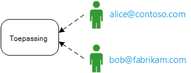
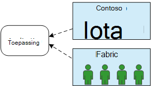
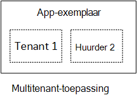
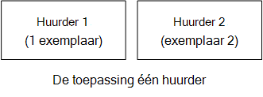
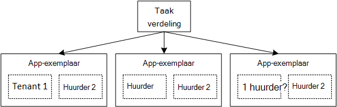

<properties
   pageTitle="Identiteitsbeheer voor multitenant toepassingen | Microsoft Azure"
   description="Inleiding tot identiteitsbeheer in multitenant-toepassingen"
   services=""
   documentationCenter="na"
   authors="MikeWasson"
   manager="roshar"
   editor=""
   tags=""/>

<tags
   ms.service="guidance"
   ms.devlang="dotnet"
   ms.topic="article"
   ms.tgt_pltfrm="na"
   ms.workload="na"
   ms.date="06/02/2016"
   ms.author="mwasson"/>

# Identiteitsbeheer voor multitenant toepassingen in Microsoft Azure-Inleiding

[AZURE.INCLUDE [pnp-header](../../includes/guidance-pnp-header-include.md)]

Dit artikel maakt [deel uit van een serie]. Er is ook een volledige [voorbeeldtoepassing] die bij deze reeks.

Stel dat u bij het schrijven van een onderneming SaaS-toepassing worden gehost in de wolk. Natuurlijk heeft de toepassing gebruikers:

Maar deze gebruikers deel uitmaken van organisaties:

Voorbeeld: Tailspin verkoopt abonnementen op de SaaS-toepassing. Contoso en Fabrikam moet u zich aanmelden voor de app. Wanneer Alice (`alice@contoso`) tekens in de toepassing moet weten dat Alice deel van Contoso uitmaakt.

- Lisa _moet_ hebben toegang tot gegevens van Contoso.
- Lisa _niet moet_ hebben toegang tot gegevens van Fabrikam.

Deze instructies wordt beschreven hoe u gebruikersidentiteiten in een multitenant-toepassing met [Azure Active Directory] beheren[ AzureAD] (Azure AD) voor het verwerken van verificatie- en.

## Wat is multitenancy?

Een _huurder_ is een groep gebruikers. De huurder is in een SaaS-toepassing een abonnee of de klant van de toepassing. _Multitenancy_ is een architectuur waarin meerdere huurders dezelfde fysieke instantie van de toepassing delen. Hoewel huurders fysieke bronnen (zoals VMs of opslag) delen, elke huurder deze eigenschap haalt een eigen logische van de app.

Application data is meestal gedeeld door de gebruikers binnen een huurder, maar niet met andere huurders.

Vergelijk deze architectuur met één huurder-architectuur, waarbij elke huurder een apart fysiek exemplaar heeft. Voeg in een architectuur met één huurder huurders door nieuwe exemplaren van de app draaien.

### Multitenancy en horizontale schaal

Voor de schaal in de cloud, is het gebruikelijk om toe te voegen meer fysieke exemplaren. Dit staat bekend als _Horizontaal schalen_ of _Horizontaal schalen_. U kunt een web app. Als u wilt meer verkeer verwerken, kunt u meer VMs-server toevoegen en ze achter een taakverdeling. Elke VM wordt uitgevoerd een afzonderlijk fysiek exemplaar van de web app.

Een verzoek kan worden doorgestuurd naar een willekeurig exemplaar. Het systeem werkt samen als één logische exemplaar. U kunt een VM verwijderen of draaien van een nieuwe VM zonder ze te activeren. Elk fysiek exemplaar met meerdere huurder is in deze architectuur en schalen door meer exemplaren toe te voegen. Als één exemplaar uitvalt, moet het de huurder geen invloed op.

## Identiteit in een multitenant-app

In een multitenant app gebruikers in het kader van de huurder rekening moet houden.

**Verificatie**

- Gebruikers inloggen op de app met de referenties van de organisatie. Ze hoeft te maken van nieuwe profielen voor de app.
- Gebruikers binnen dezelfde organisatie uitmaken deel van de huurder hetzelfde.
- Wanneer een gebruiker zich aanmeldt, weet de toepassing welke huurder waartoe de gebruiker behoort.

**Autorisatie**

- Machtigen van de acties van een gebruiker (bijvoorbeeld een resource bekijken), moet de app rekening huurder van de gebruiker.
- Gebruikers kunnen worden toegewezen aan de rollen binnen de toepassing, bijvoorbeeld 'Admin' of 'Standaardgebruiker'. Roltoewijzingen moeten worden beheerd door de klant, niet door de SaaS-provider.

**Voorbeeld.** Alice, een werknemer bij Contoso, gaat naar de toepassing in haar browser en klikt op de knop "Aanmelden". Zij wordt omgeleid naar een loginscherm waar ze haar zakelijke referenties (gebruikersnaam en wachtwoord voert). Op dit punt, zij is aangemeld bij de app als `alice@contoso.com`. De toepassing ook weet dat Alice een admin-gebruiker voor deze toepassing. Omdat ze een admin, kan ze een overzicht van alle resources die bij Contoso horen. Bronnen van Fabrikam, kunt ze echter niet weergeven omdat ze een admin alleen binnen haar huurder is.

In deze richtsnoeren, zullen we specifiek met Azure AD voor identiteitsbeheer.

- We ervan uitgaan dat de klant hun gebruikersprofielen worden opgeslagen in Azure AD (met inbegrip van Office365 en Dynamics CRM huurders)
- Klanten met lokale Active Directory (AD) kunt [verbinden met Azure AD] [ ADConnect] hun lokale AD met Azure Active Directory synchroniseren.

Als een klant met lokale AD niet kan Azure AD verbinden (als gevolg van beleid voor IT-bedrijven of andere redenen), de SaaS provider met de klant communiceren kan de's AD via Active Directory Federation Services (AD FS). Deze optie wordt beschreven in [Federating met een klant van AD FS].

Deze richtsnoeren rekening geen met andere aspecten van multitenancy zoals partitioneren van gegevens, per huurder configuratie, enzovoort.

## Volgende stappen

- Lees het volgende artikel in deze serie: [enquêtes over de Tailspin toepassing][tailpin]

<!-- Links -->
[ADConnect]: ../active-directory/active-directory-aadconnect.md
[AzureAD]: https://azure.microsoft.com/documentation/services/active-directory/
[bij een reeks hoort]: guidance-multitenant-identity.md
[Met AD FS voor de klant federeren]: guidance-multitenant-identity-adfs.md
[voorbeeldtoepassing]: https://github.com/Azure-Samples/guidance-identity-management-for-multitenant-apps
[tailpin]: guidance-multitenant-identity-tailspin.md
