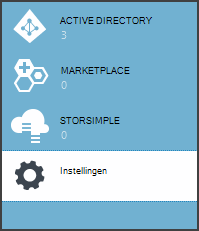
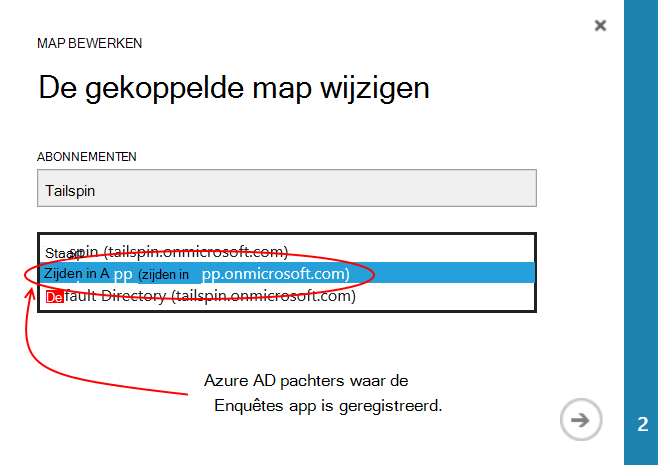
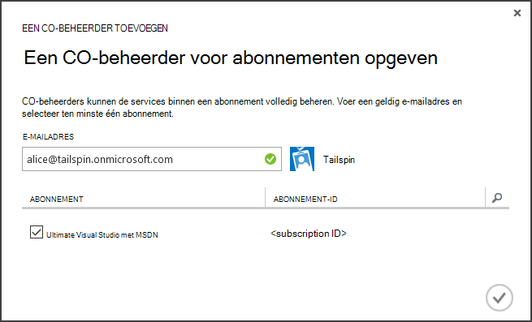
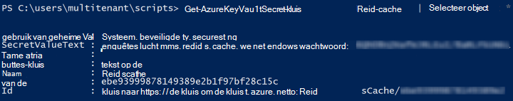

<properties
   pageTitle="Met sleutel kluis beschermen toepassing geheimen | Microsoft Azure"
   description="Hoe een gebruik van de sleutel kluis service voor het opslaan van toepassing geheimen"
   services=""
   documentationCenter="na"
   authors="MikeWasson"
   manager="roshar"
   editor=""
   tags=""/>

<tags
   ms.service="guidance"
   ms.devlang="dotnet"
   ms.topic="article"
   ms.tgt_pltfrm="na"
   ms.workload="na"
   ms.date="02/16/2016"
   ms.author="mwasson"/>

# <a name="using-azure-key-vault-to-protect-application-secrets"></a>Met behulp van Azure sleutel kluis geheimen toepassing beveiligen

[AZURE.INCLUDE [pnp-header](../../includes/guidance-pnp-header-include.md)]

Dit artikel maakt [deel uit van een serie]. Er is ook een volledige [voorbeeldtoepassing] die bij deze reeks.

## <a name="overview"></a>Overzicht

Is het gebruikelijk om toepassingsinstellingen die gevoelig zijn en moeten worden beschermd, zoals:

- Tekenreeksen voor een databaseverbinding
- Wachtwoorden
- Cryptografische sleutels

Als een optimale beveiliging moet u nooit deze geheime gegevens opslaan in het besturingselement. Te gemakkelijk te lekken &mdash; zelfs als de bron code repository privé is. En het wordt niet alleen om geheimhouding van de algemene openbare. Voor grotere projecten kunt u beperken welke ontwikkelaars en marktdeelnemers toegang hebben tot de geheimen van de productie. (Instellingen voor test- of omgevingen verschillen.)

Een veiligere optie voor het opslaan van deze geheimen in [Azure sleutel kluis]is[KeyVault]. Sleutel kluis is een wolk gehoste service voor het beheer van cryptografische sleutels en andere geheimen. In dit artikel ziet u hoe u de sleutel kluis gebruiken voor het opslaan van configuratie-instellingen voor u app.

In de [Onderzoeken Tailspin] [ Surveys] -toepassing de volgende instellingen zijn geheim:

- De verbindingsreeks.
- De verbindingsreeks bestand Vgx..
- Het geheim van de client voor de webtoepassing.

Geheimen configuratie opslaan in een kluis met sleutel, de enquêtes toepassing implementeert een aangepaste configuratie-provider in het Core 1.0 van ASP.NET- [configuratiesysteem]aangehaakt[configuration]. De aangepaste provider leest configuratie-instellingen van sleutel kluis bij het opstarten.

De enquêtes-toepassing laadt configuratie-instellingen op de volgende plaatsen:

- Het bestand appsettings.json
- De [geheimen van de gebruiker opgeslagen] [ user-secrets] (ontwikkelomgeving voor het testen van;)
- De hosting-omgeving (app instellingen in Azure web apps)
- Sleutel kluis

Elk van deze overschrijvingen van de vorige taak, zodat alle instellingen opgeslagen in een kluis met sleutel voorrang.

> [AZURE.NOTE] De configuratie sleutel kluis voorziening is standaard uitgeschakeld. Het niet nodig voor de toepassing lokaal uitgevoerd. U zou deze inschakelen in een productie-implementatie.

> De sleutel kluis provider wordt niet ondersteund voor .NET Core, omdat hiervoor de [Microsoft.Azure.KeyVault] [ Microsoft.Azure.KeyVault] pakket.

Tijdens het opstarten wordt de toepassing leest de instellingen van elke configuratie geregistreerde provider en deze worden gebruikt voor het vullen van een sterk getypeerde options-object. (Zie voor meer informatie, [met behulp van opties en van configuratieobjecten][options].)

## <a name="implementation"></a>Implementatie

De [KeyVaultConfigurationProvider] [ KeyVaultConfigurationProvider] klasse een provider van configuratie die wordt geplaatst in het Core 1.0 van ASP.NET- [configuratiesysteem]is[configuration].

Gebruik de `KeyVaultConfigurationProvider`, roept de `AddKeyVaultSecrets` extension methode in de klasse starten:

```csharp
    var builder = new ConfigurationBuilder()
        .SetBasePath(appEnv.ApplicationBasePath)
        .AddJsonFile("appsettings.json");

    if (env.IsDevelopment())
    {
        builder.AddUserSecrets();
    }
    builder.AddEnvironmentVariables();
    var config = builder.Build();

    // Add key vault configuration:
    builder.AddKeyVaultSecrets(config["AzureAd:ClientId"],
        config["KeyVault:Name"],
        config["AzureAd:Asymmetric:CertificateThumbprint"],
        Convert.ToBoolean(config["AzureAd:Asymmetric:ValidationRequired"]),
        loggerFactory);
```

Merk op dat `KeyVaultConfigurationProvider` sommige configuratie-instellingen die moeten worden opgeslagen in een van de andere bronnen van de configuratie is vereist.

Wanneer de toepassing wordt gestart, `KeyVaultConfigurationProvider` een lijst van de geheimen in de sleutel kluis. Voor elke geheim, wordt er gezocht naar een label met de naam 'ConfigKey'. De waarde van het label is de naam van de configuratie-instelling.

> [AZURE.NOTE] [Tags] [ key-tags] zijn optioneel metagegevens opgeslagen met een sleutel. Tags worden hier gebruikt omdat de namen van sleutels mag geen dubbele punt (:) bevatten.

```csharp
var kvClient = new KeyVaultClient(GetTokenAsync);
var secretsResponseList = await kvClient.GetSecretsAsync(_vault, MaxSecrets, token);
foreach (var secretItem in secretsResponseList.Value)
{
    //The actual config key is stored in a tag with the Key "ConfigKey"
    // because ':' is not supported in a shared secret name by Key Vault.
    if (secretItem.Tags != null && secretItem.Tags.ContainsKey(ConfigKey))
    {
        var secret = await kvClient.GetSecretAsync(secretItem.Id, token);
        Data.Add(secret.Tags[ConfigKey], secret.Value);
    }
}
```

> [AZURE.NOTE] Zie [KeyVaultConfigurationProvider.cs].

## <a name="setting-up-key-vault-in-the-surveys-app"></a>Instellen van een sleutel kluis in de app enquêtes

Voorwaarden:

- De [Azure Resource Manager-Cmdlets]installeren[azure-rm-cmdlets].
- De toepassing van de enquêtes configureren zoals wordt beschreven in [de toepassing onderzoeken][readme].

Hoofdstappen:

1. Een admin-gebruiker in de huurder instellen.
2. Instellen van een clientcertificaat.
3. Maak een sleutel kluis.
4. Configuratie-instellingen toevoegen aan uw sleutel kluis.
5. Opmerkingen bij de code waarmee de sleutel kluis.
6. Gebruiker-geheimen van de toepassing bijwerken.

### <a name="set-up-an-admin-user"></a>Een admin-gebruiker instellen

> [AZURE.NOTE] U maakt een sleutel kluis, moet u een account die uw Azure abonnement kunt beheren. Bovendien moet elke toepassing die u wilt machtigen om te lezen uit de sleutel kluis in de huurder dezelfde als die account geregistreerd.

In deze stap zorgt u ervoor dat u een sleutel kluis terwijl aangemeld als een gebruiker van de pachter kunt maken waar de app enquêtes is geregistreerd.

Wijzig eerst de map die is gekoppeld aan uw abonnement op Azure.

1. Log in op de [Azure management portal][azure-management-portal]

2. Klik op **Instellingen**.

    

3. Selecteer uw abonnement Azure.

4. Klik op **Map bewerken** onder aan de portal.

    

5. In 'De gekoppelde map wijzigen', selecteer de Azure AD huurder waar de toepassing van de enquêtes is geregistreerd,

    

6. Klik op de pijl en het dialoogvenster voltooien.

Maak een admin-gebruiker binnen de Azure AD huurder waar de toepassing van de enquêtes is geregistreerd.

1. Meld u aan bij de [Azure management portal][azure-management-portal].

2. Selecteer de Azure AD huurder waar uw toepassing is geregistreerd.

3. Klik op **gebruikers** > **gebruiker toevoegen**.

4. In het dialoogvenster **Gebruiker toevoegen** , moet u de gebruiker toewijzen aan de rol Admin globale.

De admin-gebruiker toevoegen als beheerder van een collega voor uw abonnement op Azure.

1. Meld u aan bij de [Azure management portal][azure-management-portal].

2. Klik op **Instellingen** en selecteert u uw abonnement op Azure.

3. Klik op **Administrators**

4. Klik op **toevoegen** onder aan de portal.

5. Voer het e-mailadres van de admin-gebruiker die u eerder hebt gemaakt.

6. Schakel het selectievakje in voor het abonnement.

7. Klik op de knop ingeschakeld om het dialoogvenster.




### <a name="set-up-a-client-certificate"></a>Een clientcertificaat instellen

1. Voer de PowerShell script [/Scripts/Setup-KeyVault.ps1] [ Setup-KeyVault] als volgt:
    ```
    .\Setup-KeyVault.ps1 -Subject <<subject>>
    ```
    Voor de `Subject` parameter, voer een naam, bijvoorbeeld 'surveysapp'. Het script een zelfondertekend certificaat wordt gegenereerd en opgeslagen in het certificaatarchief van de "huidige gebruiker/persoonlijk".

2. De uitvoer van het script is een fragment JSON. Dit toevoegen aan het manifest van de toepassing van het web app als volgt:

    1. Meld u aan bij de [Azure management portal] [ azure-management-portal] en Ga naar de map Azure AD.

    2. Klik op **toepassingen**.

    3. Selecteer de toepassing onderzoeken.

    4.  Op **Het Manifest beheren** en selecteer **Manifest downloaden**.

    5.  Het manifest JSON-bestand in een teksteditor openen. Plak de uitvoer van het script in de `keyCredentials` eigenschap. Het ziet er ongeveer als volgt:
    ```
            "keyCredentials": [
                {
                  "type": "AsymmetricX509Cert",
                  "usage": "Verify",
                  "keyId": "29d4f7db-0539-455e-b708-....",
                  "customKeyIdentifier": "ZEPpP/+KJe2fVDBNaPNOTDoJMac=",
                  "value": "MIIDAjCCAeqgAwIBAgIQFxeRiU59eL.....
                }
              ],
    ```          
    6.  Sla uw wijzigingen naar het bestand JSON.

    7.  Ga terug naar de portal. Klik op **Beheren Manifest** > **Manifest uploaden** en de JSON-bestand uploaden.

3. Het dezelfde JSON-fragment toevoegen aan het manifest van de toepassing van het web API (Surveys.WebAPI).

4. Voer de volgende opdracht om de blauwdruk van het certificaat.
    ```
    certutil -store -user my [subject]
    ```
    waarbij `[subject]` is de waarde die u hebt opgegeven voor het onderwerp in het PowerShell-script. De vingerafdruk wordt vermeld onder "Cert-Hash(sha1)". Verwijdert de spaties tussen de hexadecimale getallen.

Gebruikt u de vingerafdruk later.

### <a name="create-a-key-vault"></a>Maak een sleutel kluis

1. Voer de PowerShell script [/Scripts/Setup-KeyVault.ps1] [ Setup-KeyVault] als volgt:

    ```
    .\Setup-KeyVault.ps1 -KeyVaultName <<key vault name>> -ResourceGroupName <<resource group name>> -Location <<location>>
    ```

    Wanneer u wordt gevraagd om referenties, log in als de gebruiker Azure AD dat u eerder hebt gemaakt. Het script maakt een nieuwe bronnengroep en een nieuwe sleutel kluis binnen die groep.

    Opmerking: voor de - parameter locatie kunt u de volgende PowerShell-opdracht om een lijst met geldige regio's:

    ```
    Get-AzureRmResourceProvider -ProviderNamespace "microsoft.keyvault" | Where-Object { $_.ResourceTypes.ResourceTypeName -eq "vaults" } | Select-Object -ExpandProperty Locations
    ```

2. Voer SetupKeyVault.ps opnieuw, met de volgende parameters:

    ```
    .\Setup-KeyVault.ps1 -KeyVaultName <<key vault name>> -ApplicationIds @("<<web app client ID>>", "<<web API client ID>>")
    ```

    waar

    - naam sleutel kluis = de naam die u de sleutel kluis in de vorige stap hebt gegeven.
    - Web app client-ID = de client-ID voor de webtoepassing enquêtes.
    - Web-api-client-ID = de client-ID voor de toepassing van de Surveys.WebAPI.

    Voorbeeld:
    ```
    .\Setup-KeyVault.ps1 -KeyVaultName tailspinkv -ApplicationIds @("f84df9d1-91cc-4603-b662-302db51f1031", "8871a4c2-2a23-4650-8b46-0625ff3928a6")
    ```

    > [AZURE.NOTE] U krijgt de client id's uit de [portal Azure management][azure-management-portal]. Selecteer de huurder Azure AD, selecteert u de toepassing en klik op **configureren**.

    Dit script geeft toestemming voor de web app en web API geheimen ophalen van uw sleutel kluis. Zie [aan de slag met Azure sleutel kluis] [ authorize-app] voor meer informatie.

### <a name="add-configuration-settings-to-your-key-vault"></a>Configuratie-instellingen toevoegen aan uw sleutel kluis

1. SetupKeyVault.ps als volgt uitgevoerd:

    ```
    .\Setup-KeyVault.ps1 -KeyVaultName <<key vault name> -KeyName RedisCache -KeyValue "<<Redis DNS name>>.redis.cache.windows.net,password=<<Redis access key>>,ssl=true" -ConfigName "Redis:Configuration"
    ```
    waar

    - naam sleutel kluis = de naam die u de sleutel kluis in de vorige stap hebt gegeven.
    - Bestand DNS-naam Vgx. = de DNS-naam van het exemplaar van uw bestand Vgx. cache.
    - Bestand Vgx. toegangstoets toegangstoets voor uw exemplaar van de cache bestand Vgx. =.

    Deze opdracht voegt een geheim aan uw sleutel kluis. Het geheim is een naam/waarde-paar plus een label:

    -   Naam van de sleutel wordt niet gebruikt door de toepassing, maar moet uniek zijn binnen de sleutel kluis.
    -   De waarde is de waarde van de configuratieoptie in dit geval het bestand Vgx. verbindingsreeks.
    -   het label 'ConfigKey' bevat de naam van de sleutel.

2. Op dit moment is het een goed idee om te testen of u de sleutel kluis-geheimen met succes opgeslagen. De volgende PowerShell-opdracht uitvoeren:

    ```
    Get-AzureKeyVaultSecret <<key vault name>> RedisCache | Select-Object *
    ```
    De geheime waarde plus sommige metagegevens moet worden weergegeven in de uitvoer:

    

3. Voer SetupKeyVault.ps opnieuw om de verbindingsreeks toevoegen:

    ```
    .\Setup-KeyVault.ps1 -KeyVaultName <<key vault name> -KeyName ConnectionString -KeyValue <<DB connection string>> -ConfigName "Data:SurveysConnectionString"
    ```

    waarbij `<<DB connection string>>` is de waarde van de verbindingsreeks.

    Voor het testen van de lokale database, de verbindingsreeks van het bestand Tailspin.Surveys.Web/appsettings.json te kopiëren. Als u dat doet, zorg ervoor dat de dubbele backslash wijzigen ("\\\\") in een enkele backslash. De dubbele backslash is een escape-teken in de JSON-bestand.

    Voorbeeld:

    ```
    .\Setup-KeyVault.ps1 -KeyVaultName mykeyvault -KeyName ConnectionString -KeyValue "Server=(localdb)\MSSQLLocalDB;Database=Tailspin.SurveysDB;Trusted_Connection=True;MultipleActiveResultSets=true" -ConfigName "Data:SurveysConnectionString"
    ```

### <a name="uncomment-the-code-that-enables-key-vault"></a>Opmerkingen bij de code waarmee de sleutel kluis

1. Open de Tailspin.Surveys oplossing.

2. In [Tailspin.Surveys.Web/Startup.cs][web-startup], zoek het volgende codeblok en deze opmerking verwijderen.

    ```csharp
    //#if DNX451
    //            _configuration = builder.Build();
    //            builder.AddKeyVaultSecrets(_configuration["AzureAd:ClientId"],
    //                _configuration["KeyVault:Name"],
    //                _configuration["AzureAd:Asymmetric:CertificateThumbprint"],
    //                Convert.ToBoolean(_configuration["AzureAd:Asymmetric:ValidationRequired"]),
    //                loggerFactory);
    //#endif
    ```

3. In [Tailspin.Surveys.WebAPI/Startup.cs][web-api-startup], zoek het volgende codeblok en deze opmerking verwijderen.

    ```csharp
    //#if DNX451
    //            var config = builder.Build();
    //            builder.AddKeyVaultSecrets(config["AzureAd:ClientId"],
    //                config["KeyVault:Name"],
    //                config["AzureAd:Asymmetric:CertificateThumbprint"],
    //                Convert.ToBoolean(config["AzureAd:Asymmetric:ValidationRequired"]),
    //                loggerFactory);
    //#endif
    ```

4. In [Tailspin.Surveys.Web/Startup.cs][web-startup], zoek de code die u registreert de `ICredentialService`. Opmerkingen bij de regel die gebruikmaakt van `CertificateCredentialService`, en het commentaar van de regel die gebruikmaakt van `ClientCredentialService`:

    ```csharp
    // Uncomment this:
    services.AddSingleton<ICredentialService, CertificateCredentialService>();
    // Comment out this:
    //services.AddSingleton<ICredentialService, ClientCredentialService>();
    ```

    Deze wijziging wordt de web app gebruiken [Client bevestiging] [ client-assertion] OAuth toegangstokens ophalen. Met de bevestiging van de client hoeft u niet een geheim OAuth-client. Ook kunt u het geheim van de client in een kluis met sleutel opslaan. Echter, sleutel kluis en bevestiging van client gebruik van een client certificaat, als sleutel kluis, is een goede gewoonte om client bewering ook inschakelen.

### <a name="update-the-user-secrets"></a>De geheimen van de gebruiker bijwerken

In Solution Explorer met de rechtermuisknop op het Tailspin.Surveys.Web-project en selecteer **Gebruiker geheimen beheren**. In het bestand secrets.json verwijdert u de bestaande JSON en plakken in het volgende:

    ```
    {
      "AzureAd": {
        "ClientId": "[Surveys web app client ID]",
        "PostLogoutRedirectUri": "https://localhost:44300/",
        "WebApiResourceId": "[App ID URI of your Surveys.WebAPI application]",
        "Asymmetric": {
          "CertificateThumbprint": "[certificate thumbprint. Example: 105b2ff3bc842c53582661716db1b7cdc6b43ec9]",
          "StoreName": "My",
          "StoreLocation": "CurrentUser",
          "ValidationRequired": "false"
        }
      },
      "KeyVault": {
        "Name": "[key vault name]"
      }
    }
    ```

De vermeldingen in [vierkante haken] vervangen door de juiste waarden.

- `AzureAd:ClientId`: De client-ID van de toepassing van de enquêtes.
- `AzureAd:WebApiResourceId`: De App ID URI die u hebt opgegeven tijdens het maken van de toepassing van de Surveys.WebAPI in Azure AD.
- `Asymmetric:CertificateThumbprint`: De vingerafdruk van het certificaat dat u eerder hebt wanneer u het clientcertificaat hebt gemaakt.
- `KeyVault:Name`: De naam van de sleutel kluis.

> [AZURE.NOTE] `Asymmetric:ValidationRequired`false is omdat het certificaat dat u eerder hebt gemaakt niet is ondertekend door een basiscertificeringsinstantie (CA). In productie, een certificaat gebruikt dat is ondertekend door een basiscertificeringsinstantie en `ValidationRequired` op true.

Sla het bestand bijgewerkt secrets.json.

Vervolgens in de Solution Explorer met de rechtermuisknop op het Tailspin.Surveys.WebApi-project en selecteer **Gebruiker geheimen beheren**. Verwijder de bestaande JSON en plakken in het volgende:

```
{
  "AzureAd": {
    "ClientId": "[Surveys.WebAPI client ID]",
    "WebApiResourceId": "https://tailspin5.onmicrosoft.com/surveys.webapi",
    "Asymmetric": {
      "CertificateThumbprint": "[certificate thumbprint]",
      "StoreName": "My",
      "StoreLocation": "CurrentUser",
      "ValidationRequired": "false"
    }
  },
  "KeyVault": {
    "Name": "[key vault name]"
  }
}
```

Vervangen door de vermeldingen in [vierkante haken] en sla het bestand secrets.json.

> [AZURE.NOTE] Zorg ervoor dat de client-ID gebruikt voor de toepassing van de Surveys.WebAPI, niet de toepassing onderzoeken voor het web API.


<!-- Links -->
[authorize-app]: ../key-vault/key-vault-get-started.md/#authorize
[azure-management-portal]: https://manage.windowsazure.com/
[azure-rm-cmdlets]: https://msdn.microsoft.com/library/mt125356.aspx
[client-assertion]: guidance-multitenant-identity-client-assertion.md
[configuration]: https://docs.asp.net/en/latest/fundamentals/configuration.html
[KeyVault]: https://azure.microsoft.com/services/key-vault/
[KeyVaultConfigurationProvider]: https://github.com/Azure-Samples/guidance-identity-management-for-multitenant-apps/blob/master/src/Tailspin.Surveys.Configuration.KeyVault/KeyVaultConfigurationProvider.cs
[key-tags]: https://msdn.microsoft.com/library/azure/dn903623.aspx#BKMK_Keytags
[Microsoft.Azure.KeyVault]: https://www.nuget.org/packages/Microsoft.Azure.KeyVault/
[options]: https://docs.asp.net/en/latest/fundamentals/configuration.html#using-options-and-configuration-objects
[readme]: https://github.com/Azure-Samples/guidance-identity-management-for-multitenant-apps/blob/master/docs/running-the-app.md
[Setup-KeyVault]: https://github.com/Azure-Samples/guidance-identity-management-for-multitenant-apps/blob/master/scripts/Setup-KeyVault.ps1
[Surveys]: guidance-multitenant-identity-tailspin.md
[user-secrets]: http://go.microsoft.com/fwlink/?LinkID=532709
[web-startup]: https://github.com/Azure-Samples/guidance-identity-management-for-multitenant-apps/blob/master/src/Tailspin.Surveys.Web/Startup.cs
[web-api-startup]: https://github.com/Azure-Samples/guidance-identity-management-for-multitenant-apps/blob/master/src/Tailspin.Surveys.WebAPI/Startup.cs
[bij een reeks hoort]: guidance-multitenant-identity.md
[KeyVaultConfigurationProvider.cs]: https://github.com/Azure-Samples/guidance-identity-management-for-multitenant-apps/blob/master/src/Tailspin.Surveys.Configuration.KeyVault/KeyVaultConfigurationProvider.cs
[voorbeeldtoepassing]: https://github.com/Azure-Samples/guidance-identity-management-for-multitenant-apps
