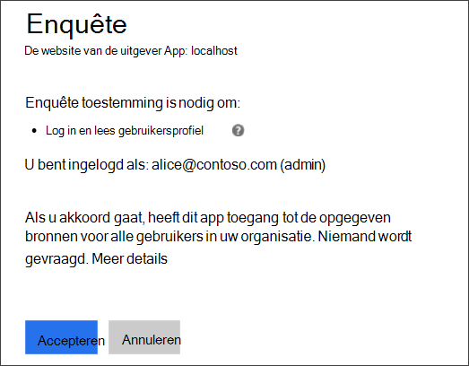
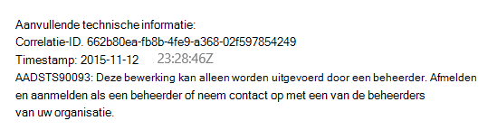
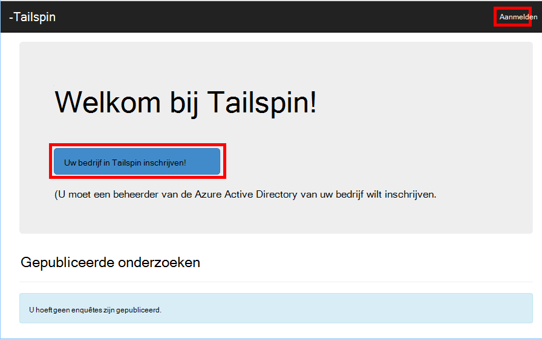
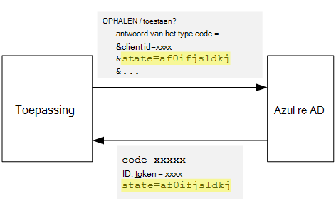
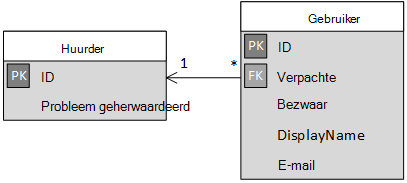

<properties
   pageTitle="Aanmelding en pachters onboarding in multitenant toepassingen | Microsoft Azure"
   description="Het on-board huurders in een multitenant-toepassing"
   services=""
   documentationCenter="na"
   authors="MikeWasson"
   manager="roshar"
   editor=""
   tags=""/>

<tags
   ms.service="guidance"
   ms.devlang="dotnet"
   ms.topic="article"
   ms.tgt_pltfrm="na"
   ms.workload="na"
   ms.date="05/23/2016"
   ms.author="mwasson"/>

# <a name="sign-up-and-tenant-onboarding-in-a-multitenant-application"></a>Aanmelding en pachters onboarding in een multitenant-toepassing

[AZURE.INCLUDE [pnp-header](../../includes/guidance-pnp-header-include.md)]

Dit artikel maakt [deel uit van een serie]. Er is ook een volledige [voorbeeldtoepassing] die bij deze reeks.

In dit artikel wordt beschreven hoe u voor het implementeren van een _aanmelding_ verwerken in een toepassing met meerdere huurder, zodat een klant zich aanmelden met hun organisatie voor de toepassing.
Er zijn verschillende redenen voor het implementeren van een aanmeldingsproces:

-   Kan een beheerder AD toestemming voor de gehele organisatie van de klant om de toepassing te gebruiken.
-   Betaling per creditcard of andere klantgegevens verzamelen.
-   Een eenmalige huurder setup die nodig is voor uw toepassing uitvoeren.

## <a name="admin-consent-and-azure-ad-permissions"></a>Admin toestemming en Azure AD machtigingen

Om te verifiëren met Azure Active Directory, moet een toepassing toegang tot de map van de gebruiker. De toepassing moet ten minste een machtiging om het profiel van de gebruiker. De eerste keer dat een gebruiker zich aanmeldt, ziet Azure AD u een pagina met instemming dat de gevraagde machtigingen. Door te klikken op **accepteren**, geeft de gebruiker het recht aan de toepassing.

Standaard wordt toestemming verleend op basis van per gebruiker. Elke gebruiker die zich aanmeldt, ziet de pagina toestemming. Azure AD ondersteunt echter ook _admin toestemming_, waarmee een beheerder AD toe te staan voor de hele organisatie.

Wanneer de stroom admin toestemming wordt gebruikt, wordt de pagina toestemming staat AD admin verlenen van toestemming voor de gehele huurder:



Nadat de beheerder op **accepteren**klikt, andere gebruikers binnen de dezelfde huurder kunnen aanmelden en Azure AD het scherm toestemming wordt overgeslagen.

Alleen een beheerder AD kunt admin toestemming geven, omdat zij toestemming voor de gehele organisatie verleent. Als een beheerder probeert te verifiëren met de stroom admin toestemming, wordt een fout weergegeven in Azure AD:



Als de toepassing extra machtigingen op een later moment, moet de klant opnieuw aanmelden en instemming met de bijgewerkte machtigingen.  

## <a name="implementing-tenant-sign-up"></a>Uitvoering van de huurder-aanmelding

Voor het [Onderzoeken van Tailspin] [ Tailspin] toepassing, hebben we verschillende vereisten voor het aanmeldingsproces gedefinieerd:

-   Een huurder moet aanmelden voordat gebruikers zich kunnen aanmelden.
-   Aanmelding wordt de stroom admin toestemming gebruikt.
-   Aanmelding wordt de huurder van de gebruiker toegevoegd aan de database van de toepassing.
-   Nadat een huurder zich aanmeldt, ziet de toepassing een pagina onboarding.

In dit gedeelte bekijken we via onze implementatie van het aanmeldingsproces.
Het is belangrijk te begrijpen dat 'aanmelden' versus 'aanmelden' is een concept van toepassing. Tijdens de verificatie-stroom weet Azure AD intrinsiek niet of de gebruiker is bezig het aanmelden. Is het aan de toepassing voor het bijhouden van de context.

Als een anonieme gebruiker de toepassing onderzoeken bezoekt, de gebruiker twee knoppen weergegeven: een aan te melden en een "uw bedrijf inschrijven" is (aanmelden).



Deze knoppen worden acties in de klasse [AccountController] aangeroepen.

De `SignIn` actie geeft als resultaat een **ChallegeResult**, waardoor de middleware OpenID verbinding omleiden naar het eindpunt van de verificatie. Dit is de standaard manier om trigger verificatie in ASP.NET Core 1.0.  

```csharp
[AllowAnonymous]
public IActionResult SignIn()
{
    return new ChallengeResult(
        OpenIdConnectDefaults.AuthenticationScheme,
        new AuthenticationProperties
        {
            IsPersistent = true,
            RedirectUri = Url.Action("SignInCallback", "Account")
        });
}
```

Vergelijk nu de `SignUp` actie:

```csharp
[AllowAnonymous]
public IActionResult SignUp()
{
    // Workaround for https://github.com/aspnet/Security/issues/546
    HttpContext.Items.Add("signup", "true");

    var state = new Dictionary<string, string> { { "signup", "true" }};
    return new ChallengeResult(
        OpenIdConnectDefaults.AuthenticationScheme,
        new AuthenticationProperties(state)
        {
            RedirectUri = Url.Action(nameof(SignUpCallback), "Account")
        });
}
```

Net als `SignIn`, de `SignUp` actie resulteert ook in een `ChallengeResult`. Maar nu we een stukje informatie staat op de `AuthenticationProperties` in de `ChallengeResult`:

-   aanmelden bij: een Boole-vlag die aangeeft dat de gebruiker het aanmeldingsproces is begonnen.

De informatie staat in `AuthenticationProperties` wordt toegevoegd aan de parameter [state] OpenID verbinding, die tijdens de verificatie stroom-retouren.



Nadat de gebruiker worden geverifieerd in Azure AD en wordt teruggeleid naar de toepassing, bevat de verificatieticket de status. Om ervoor te zorgen dat de waarde "aanmelden" blijft bestaan over de volledige verificatie stroom gebruiken we dit feit.

## <a name="adding-the-admin-consent-prompt"></a>De admin-prompt toestemming toe te voegen

In Azure AD, de stroom admin toestemming door een parameter 'prompt' toe te voegen aan de query in de verificatieaanvraag geactiveerd:

```
/authorize?prompt=admin_consent&...
```

De toepassing onderzoeken wordt gevraagd tijdens de `RedirectToAuthenticationEndpoint` gebeurtenis. Deze gebeurtenis wordt direct aangeroepen voordat de middleware wordt omgeleid naar het eindpunt van de verificatie.

```csharp
public override Task RedirectToAuthenticationEndpoint(RedirectContext context)
{
    if (context.IsSigningUp())
    {
        context.ProtocolMessage.Prompt = "admin_consent";
    }

    _logger.RedirectToIdentityProvider();
    return Task.FromResult(0);
}
```

> [AZURE.NOTE] Zie [SurveyAuthenticationEvents.cs].

Het instellen van` ProtocolMessage.Prompt` de middleware is de parameter 'prompt' toevoegen aan de verificatieaanvraag wordt aangegeven.

Houd er rekening mee dat de vraag is alleen nodig tijdens het aanmelden. Gewone aanmelden moet niet opnemen. U onderscheid maken tussen hen, we controleren of de `signup` waarde in de verificatiestatus. De volgende extensie-methode controleert deze voorwaarde:

```csharp
internal static bool IsSigningUp(this BaseControlContext context)
{
    Guard.ArgumentNotNull(context, nameof(context));

    string signupValue;
    object obj;
    // Check the HTTP context and convert to string
    if (context.HttpContext.Items.TryGetValue("signup", out obj))
    {
        signupValue = (string)obj;
    }
    else
    {
        // It's not in the HTTP context, so check the authentication ticket.  If it's not there, we aren't signing up.
        if ((context.AuthenticationTicket == null) ||
            (!context.AuthenticationTicket.Properties.Items.TryGetValue("signup", out signupValue)))
        {
            return false;
        }
    }

    // We have found the value, so see if it's valid
    bool isSigningUp;
    if (!bool.TryParse(signupValue, out isSigningUp))
    {
        // The value for signup is not a valid boolean, throw                
        throw new InvalidOperationException($"'{signupValue}' is an invalid boolean value");
    }

    return isSigningUp;
}
```

> [AZURE.NOTE] Zie [BaseControlContextExtensions.cs].

> [AZURE.NOTE] Opmerking: Deze code bevat een oplossing voor een bekende bug in ASP.NET Core 1.0 RC1. In de `RedirectToAuthenticationEndpoint` gebeurtenis, er is geen manier om de verificatie-eigenschappen met de status 'aanmelden'. Als tijdelijke oplossing, de `AccountController.SignUp` methode wordt ook de status 'aanmelden' in de `HttpContext`. Dit werkt omdat de `RedirectToAuthenticationEndpoint` gebeurt voordat de omleiding, dus we nog steeds dezelfde hebben `HttpContext`.

## <a name="registering-a-tenant"></a>Registreren van een huurder

De toepassing onderzoeken worden enkele gegevens over elke huurder en gebruiker opgeslagen in de database van de toepassing.



In de tabel huurder is IssuerValue de waarde van de vordering van de uitgevende instelling voor de huurder. Voor Azure AD, dit is `https://sts.windows.net/<tentantID>` en biedt een unieke waarde per huurder.

Wanneer een nieuwe huurder zich aanmeldt, de toepassing van de enquêtes schrijft een huurder record aan de database. Dit gebeurt in de `AuthenticationValidated` gebeurtenis. (Niet doen voordat deze gebeurtenis, omdat de ID-token won't nog gevalideerd zodat u de claimwaarden kan niet vertrouwt. Zie [verificatie].

Hier ziet u de relevante code uit de enquêtes-toepassing:

```csharp
public override async Task AuthenticationValidated(AuthenticationValidatedContext context)
{
    var principal = context.AuthenticationTicket.Principal;
    var userId = principal.GetObjectIdentifierValue();
    var tenantManager = context.HttpContext.RequestServices.GetService<TenantManager>();
    var userManager = context.HttpContext.RequestServices.GetService<UserManager>();
    var issuerValue = principal.GetIssuerValue();
    _logger.AuthenticationValidated(userId, issuerValue);

    // Normalize the claims first.
    NormalizeClaims(principal);
    var tenant = await tenantManager.FindByIssuerValueAsync(issuerValue)
        .ConfigureAwait(false);

    if (context.IsSigningUp())
    {
        // Originally, we were checking to see if the tenant was non-null, however, this would not allow
        // permission changes to the application in AAD since a re-consent may be required.  Now we just don't
        // try to recreate the tenant.
        if (tenant == null)
        {
            tenant = await SignUpTenantAsync(context, tenantManager)
                .ConfigureAwait(false);
        }

        // In this case, we need to go ahead and set up the user signing us up.
        await CreateOrUpdateUserAsync(context.AuthenticationTicket, userManager, tenant)
            .ConfigureAwait(false);
    }
    else
    {
        if (tenant == null)
        {
            _logger.UnregisteredUserSignInAttempted(userId, issuerValue);
            throw new SecurityTokenValidationException($"Tenant {issuerValue} is not registered");
        }

        await CreateOrUpdateUserAsync(context.AuthenticationTicket, userManager, tenant)
            .ConfigureAwait(false);
    }
}
```

> [AZURE.NOTE] Zie [SurveyAuthenticationEvents.cs].

Deze code doet het volgende:

1.  Controleer of uitgever-waarde van de huurder al in de database is. Als de huurder niet heeft aangemeld, `FindByIssuerValueAsync` geeft null als resultaat.
2.  Als de gebruiker aanmeldt zich:
  1.    De huurder aan de database toevoegen (`SignUpTenantAsync`).
  2.    De geverifieerde gebruiker toevoegen aan de database (`CreateOrUpdateUserAsync`).
3.  Voer anders de normale stroom-in:
  1.    Als de uitgever van de huurder niet in de database gevonden is, betekent dit dat de huurder niet is geregistreerd en de klant moet aanmelden. In dat geval genereert een uitzondering als u wilt dat de verificatie mislukt.
  2.    Anders maakt u een databaserecord voor deze gebruiker, als er nog een (`CreateOrUpdateUserAsync`).

Hier is de [SignUpTenantAsync] -methode die door de huurder worden toegevoegd aan de database.

```csharp
private async Task<Tenant> SignUpTenantAsync(BaseControlContext context, TenantManager tenantManager)
{
    Guard.ArgumentNotNull(context, nameof(context));
    Guard.ArgumentNotNull(tenantManager, nameof(tenantManager));

    var principal = context.AuthenticationTicket.Principal;
    var issuerValue = principal.GetIssuerValue();
    var tenant = new Tenant
    {
        IssuerValue = issuerValue,
        Created = DateTimeOffset.UtcNow
    };

    try
    {
        await tenantManager.CreateAsync(tenant)
            .ConfigureAwait(false);
    }
    catch(Exception ex)
    {
        _logger.SignUpTenantFailed(principal.GetObjectIdentifierValue(), issuerValue, ex);
        throw;
    }

    return tenant;
}
```

Hier volgt een overzicht van de volledige aanmelding stroom in de toepassing onderzoeken:

1.  De gebruiker klikt op de knop **Aanmelden** .
2.  De `AccountController.SignUp` actie een challege resultaat.  De verificatiestatus bevat de waarde 'aanmelden'.
3.  In de `RedirectToAuthenticationEndpoint` gebeurtenis, voegen de `admin_consent` vragen.
4.  De middleware OpenID verbinding wordt omgeleid naar Azure AD en de gebruiker wordt geverifieerd.
5.  In de `AuthenticationValidated` gebeurtenis, zoekt u de status "aanmelden".
6.  De huurder aan de database toevoegen.

## <a name="next-steps"></a>Volgende stappen

- Lees het volgende artikel in deze serie: [Toepassingsrollen in multitenant-toepassingen][app roles]


<!-- Links -->
[app roles]: guidance-multitenant-identity-app-roles.md
[Tailspin]: guidance-multitenant-identity-tailspin.md
[bij een reeks hoort]: guidance-multitenant-identity.md
[AccountController]: https://github.com/Azure-Samples/guidance-identity-management-for-multitenant-apps/blob/master/src/Tailspin.Surveys.Web/Controllers/AccountController.cs
[staat]: http://openid.net/specs/openid-connect-core-1_0.html#AuthRequest
[SurveyAuthenticationEvents.cs]: https://github.com/Azure-Samples/guidance-identity-management-for-multitenant-apps/blob/master/src/Tailspin.Surveys.Web/Security/SurveyAuthenticationEvents.cs
[BaseControlContextExtensions.cs]: https://github.com/Azure-Samples/guidance-identity-management-for-multitenant-apps/blob/master/src/Tailspin.Surveys.Web/Security/BaseControlContextExtensions.cs
[Verificatie]: guidance-multitenant-identity-authenticate.md
[SignUpTenantAsync]: https://github.com/Azure-Samples/guidance-identity-management-for-multitenant-apps/blob/master/src/Tailspin.Surveys.Web/Security/SurveyAuthenticationEvents.cs
[voorbeeldtoepassing]: https://github.com/Azure-Samples/guidance-identity-management-for-multitenant-apps
