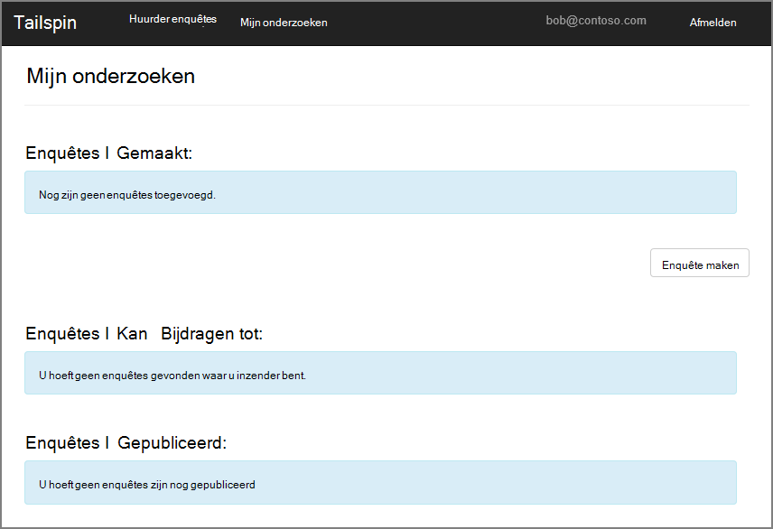
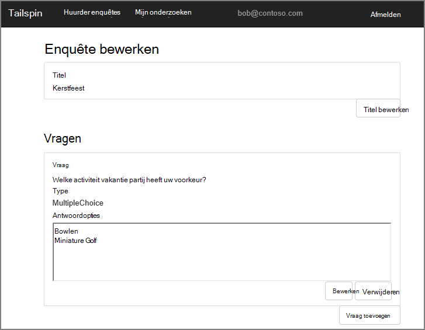
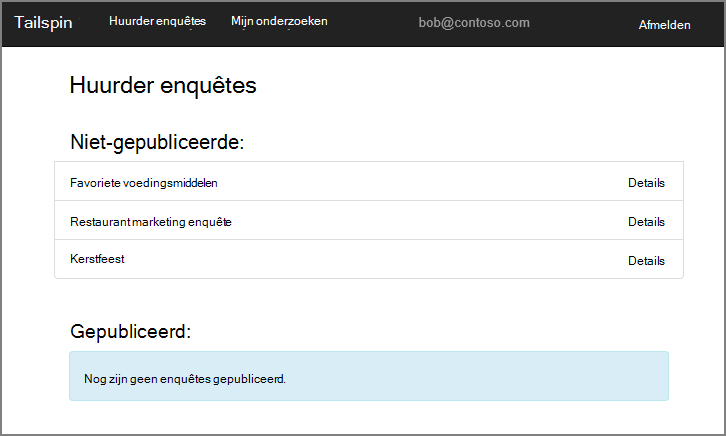
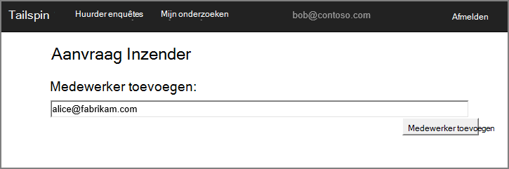
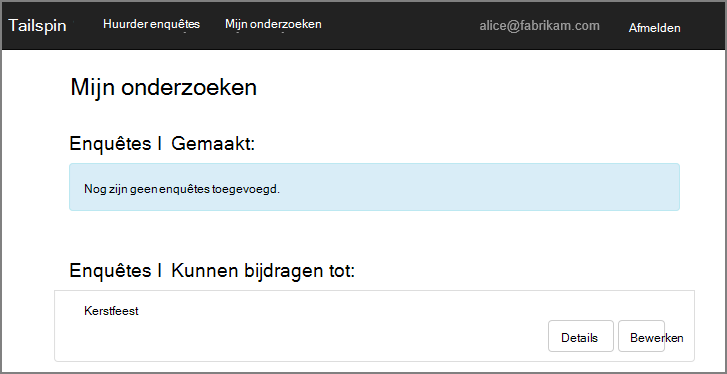
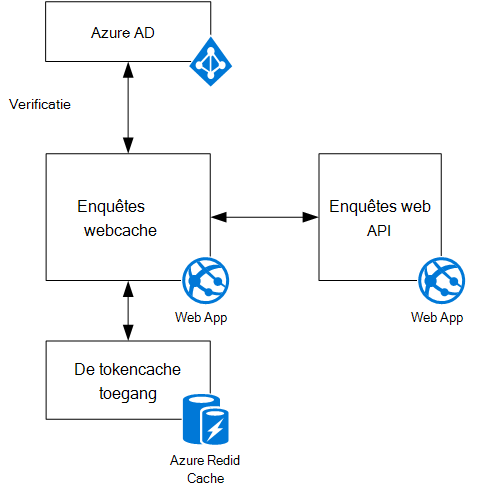

<properties
   pageTitle="Over de toepassing van de enquêtes Tailspin | Microsoft Azure"
   description="Tailspin enquêtes: overzicht"
   services=""
   documentationCenter="na"
   authors="MikeWasson"
   manager="roshar"
   editor=""
   tags=""/>

<tags
   ms.service="guidance"
   ms.devlang="dotnet"
   ms.topic="article"
   ms.tgt_pltfrm="na"
   ms.workload="na"
   ms.date="05/23/2016"
   ms.author="mwasson"/>

# Over de toepassing van Tailspin enquêtes

[AZURE.INCLUDE [pnp-header](../../includes/guidance-pnp-header-include.md)]

Dit artikel maakt [deel uit van een serie]. Er is ook een volledige [voorbeeldtoepassing] die bij deze reeks.

Tailspin is een fictief bedrijf dat een SaaS-toepassing met de naam enquêtes ontwikkelt. Deze toepassing kan organisaties maken en publiceren van online enquêtes.

- Een organisatie kan inschrijven voor de toepassing.
- Nadat de organisatie is geregistreerd, kunnen gebruikers zich aanmelden in de toepassing met hun organisatie-referenties.
- Gebruikers kunnen maken, bewerken en publiceren van enquêtes.

> [AZURE.NOTE] Zie de [toepassing onderzoeken uitvoeren]om te beginnen met de toepassing.

## Gebruikers kunnen maken, bewerken en weergeven van enquêtes

Een geverifieerde gebruiker kan alle onderzoeken die hij of zij heeft gemaakt of heeft de rechten van een Inzender om te bekijken en nieuwe enquêtes maken. U ziet dat de gebruiker is aangemeld met zijn organisatie-identiteit, `bob@contoso.com`.

Deze schermafbeelding ziet u de pagina enquête bewerken:

Gebruikers kunnen ook alle enquêtes gemaakt door andere gebruikers binnen de dezelfde huurder bekijken.

## Enquête eigenaren kunnen medewerkers uitnodigen

Wanneer een gebruiker een enquête maakt, kan hij of zij de inzenders van de enquête dat andere mensen uitnodigen. Inzenders kunnen bewerken van de enquête, maar kan niet verwijderen of publiceren.  

Een gebruiker toevoegen medewerkers van andere huurders, waardoor cross-huurder bronnen te delen. In dit screenshot, Robert (`bob@contoso.com`) is Alice toevoegen (`alice@fabrikam.com`) als medewerker op een enquête die Bob gemaakt.

Wanneer Lisa zich aanmeldt, ziet ze de enquête vermeld onder "Onderzoeken ik kan bijdragen aan".

Houd er rekening mee dat Lisa in haar eigen huurder, niet als gast van de pachter Contoso ondertekent. Alice Inzender machtigingen alleen voor dat onderzoek heeft &mdash; zij geen andere inventarisaties van de pachter Contoso bekijken.

## Architectuur

De enquêtes toepassing bestaat uit een web-front-end en een web API backend. Beide worden geïmplementeerd met behulp van [ASP.NET Core 1.0].

De webtoepassing gebruikt Azure Active Directory (AD Azure) om gebruikers te verifiëren. De webtoepassing wordt ook Azure AD voor OAuth 2 toegangstokens voor de Web-API aanroept. Toegangstokens worden in Azure bestand Vgx. Cache opgeslagen. De cache kan meerdere instanties delen de dezelfde tokencache (bijvoorbeeld in een server-farm).

## Volgende stappen

- Lees het volgende artikel in deze serie: [verificatie bij multitenant-toepassingen, met Azure Active Directory en OpenID verbinding][authentication]

<!-- Links -->

[authentication]: guidance-multitenant-identity-authenticate.md
[bij een reeks hoort]: guidance-multitenant-identity.md
[De toepassing van de enquêtes]: https://github.com/Azure-Samples/guidance-identity-management-for-multitenant-apps/blob/master/docs/running-the-app.md
[Core ASP.NET 1.0]: https://docs.asp.net/en/latest/
[voorbeeldtoepassing]: https://github.com/Azure-Samples/guidance-identity-management-for-multitenant-apps
