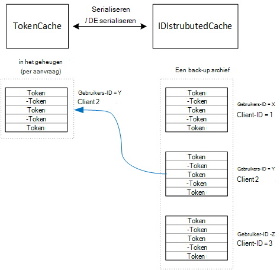

<properties
   pageTitle="Access tokens in een multitenant toepassing caching | Microsoft Azure"
   description="Toegangstokens gebruikt om een back-end Web API aan te roepen in cache opslaan"
   services=""
   documentationCenter="na"
   authors="MikeWasson"
   manager="roshar"
   editor=""
   tags=""/>

<tags
   ms.service="guidance"
   ms.devlang="dotnet"
   ms.topic="article"
   ms.tgt_pltfrm="na"
   ms.workload="na"
   ms.date="02/16/2016"
   ms.author="mwasson"/>


# <a name="caching-access-tokens-in-a-multitenant-application"></a>Toegangstokens in een multitenant toepassing caching

[AZURE.INCLUDE [pnp-header](../../includes/guidance-pnp-header-include.md)]

Dit artikel maakt [deel uit van een serie]. Er is ook een volledige [voorbeeldtoepassing] die bij deze reeks.

Het is relatief duur voor een OAuth toegang token, aangezien er een HTTP-aanvraag naar het eindpunt van de token. Het is daarom goed naar de cache tokens zoveel mogelijk. De [Bibliotheek van Azure AD verificatie] [ ADAL] (ADAL) verkregen uit Azure Active Directory de tokens vernieuwen tokens in cache opgeslagen.

ADAL biedt een standaardimplementatie tokencache. Echter deze tokencache is bedoeld voor native clienttoepassingen en is _niet_ geschikt voor web-apps:

-   Het is een statische exemplaar, niet thread-safe.
-   Het niet wordt geschaald naar grote aantallen gebruikers, aangezien tokens van alle gebruikers in dezelfde woordenboek.
-   Het kan niet worden gedeeld met de webservers in een farm.

In plaats daarvan een aangepaste tokencache dat is afgeleid van het ADAL te nemen `TokenCache` klasse maar geschikt is voor een server-omgeving en biedt het wenselijk niveau van isolatie tussen tokens voor verschillende gebruikers.

De `TokenCache` klasse slaat een woordenlijst van tokens, geïndexeerd door de uitgevende instelling, bron-ID van client en gebruiker. Een aangepaste tokencache moet deze woordenlijst schrijven naar een archief drager, zoals een bestand Vgx. cache.

In de toepassing Tailspin enquêtes, de `DistributedTokenCache` klasse implementeert de tokencache. Deze implementatie maakt gebruik van de [IDistributedCache] [ distributed-cache] ASP.NET Core 1.0 worden onttrokken. Op die manier een `IDistributedCache` uitvoering kan worden gebruikt als een archief voor back-ups.

-   De enquêtes app standaard in een cache bestand Vgx..
-   Voor een single-instance webserver, kunt u de ASP.NET-Core 1.0- [cache in het geheugen][in-memory-cache]. (Dit is ook een goede optie voor het uitvoeren van de app lokaal tijdens ontwikkeling.)

> [AZURE.NOTE] De cache bestand Vgx. wordt momenteel niet ondersteund voor .NET Core.

`DistributedTokenCache`de cachegegevens worden opgeslagen als sleutel/waarde-paren in het archief met back-ups. De sleutel is de gebruikers-ID, plus de client-ID, zodat de opslag van back-ups bevat de cachegegevens van afzonderlijke voor elke unieke combinatie van user-client.



De opslag van back-ups is door de gebruiker gepartitioneerd. Voor elke HTTP-aanvraag, de tokens voor die gebruiker worden gelezen uit de opslag van back-ups en geladen in de `TokenCache` woordenlijst. Bestand Vgx. wordt gebruikt als de opslag van back-ups, een exemplaar van elke server in een server-farm leest/schrijft naar de cache van de als deze aanpak wordt aangepast aan veel gebruikers.

## <a name="encrypting-cached-tokens"></a>Coderen van tokens in de cache

Tokens worden gevoelige gegevens omdat ze toegang tot de bronnen van de gebruiker. (Bovendien, in tegenstelling tot het wachtwoord van een gebruiker, u niet alleen opslaan een hash van het token.) Het is daarom essentieel zijn voor het beveiligen van tokens kunnen worden achterhaald. Het bestand Vgx. met reservebatterij is beveiligd met een wachtwoord, maar als iemand het wachtwoord heeft verkregen, kunnen zij alle de cache toegangstokens ophalen. Om die reden, de `DistributedTokenCache` alles wat naar het archief met back-ups geschreven worden gecodeerd. Codering uitgevoerd met behulp van de ASP.NET-Core 1.0 [gegevensbescherming] [ data-protection] API's.

> [AZURE.NOTE] Als u op Azure-websites, de coderingssleutels zijn back-up naar de netwerkopslag en gesynchroniseerd op alle computers (Zie [Key Management][key-management]). Standaard sleutels niet zijn gecodeerd wanneer in Azure websites wordt uitgevoerd, maar u kunt [een x.509-certificaat-codering inschakelen][x509-cert-encryption].


## <a name="distributedtokencache-implementation"></a>DistributedTokenCache uitvoering

De [DistributedTokenCache] [ DistributedTokenCache] klasse is afgeleid van het ADAL [TokenCache] [ tokencache-class] klasse.

In de constructor, de `DistributedTokenCache` klasse wordt gemaakt van een sleutel voor de huidige gebruiker en laadt de cache uit de opslag van back-ups:

```csharp
public DistributedTokenCache(
    ClaimsPrincipal claimsPrincipal,
    IDistributedCache distributedCache,
    ILoggerFactory loggerFactory,
    IDataProtectionProvider dataProtectionProvider)
    : base()
{
    _claimsPrincipal = claimsPrincipal;
    _cacheKey = BuildCacheKey(_claimsPrincipal);
    _distributedCache = distributedCache;
    _logger = loggerFactory.CreateLogger<DistributedTokenCache>();
    _protector = dataProtectionProvider.CreateProtector(typeof(DistributedTokenCache).FullName);
    AfterAccess = AfterAccessNotification;
    LoadFromCache();
}
```

De sleutel wordt gemaakt door het samenvoegen van de gebruikers-ID en id van de client. Deze zijn afkomstig uit de vorderingen die zijn gevonden in de `ClaimsPrincipal`:

```csharp
private static string BuildCacheKey(ClaimsPrincipal claimsPrincipal)
{
    string clientId = claimsPrincipal.FindFirstValue("aud", true);
    return string.Format(
        "UserId:{0}::ClientId:{1}",
        claimsPrincipal.GetObjectIdentifierValue(),
        clientId);
}
```

Lees de om cachegegevens te laden, de geserialiseerde blob uit de reservekopie en call `TokenCache.Deserialize` de blob omzetten in cache-gegevens.

```csharp
private void LoadFromCache()
{
    byte[] cacheData = _distributedCache.Get(_cacheKey);
    if (cacheData != null)
    {
        this.Deserialize(_protector.Unprotect(cacheData));
    }
}
```

Wanneer het ADAL toegang krijgen tot de cache, wordt een `AfterAccess` gebeurtenis. Als de cachegegevens is gewijzigd, de `HasStateChanged` de eigenschap is ingesteld op true. In dat geval werken de winkel back-ups om de wijziging weer te geven en stel de `HasStateChanged` op false.

```csharp
public void AfterAccessNotification(TokenCacheNotificationArgs args)
{
    if (this.HasStateChanged)
    {
        try
        {
            if (this.Count > 0)
            {
                _distributedCache.Set(_cacheKey, _protector.Protect(this.Serialize()));
            }
            else
            {
                // There are no tokens for this user/client, so remove the item from the cache.
                _distributedCache.Remove(_cacheKey);
            }
            this.HasStateChanged = false;
        }
        catch (Exception exp)
        {
            _logger.WriteToCacheFailed(exp);
            throw;
        }
    }
}
```

TokenCache verzonden twee andere gebeurtenissen:

- `BeforeWrite`. Vlak voordat het ADAL worden geschreven naar de cache genoemd. U kunt dit gebruiken voor het implementeren van een gelijktijdigheidsstrategie voor
- `BeforeAccess`. Wordt aangeroepen direct voordat ADAL wordt gelezen uit de cache. Hier kunt u de cache als u de meest recente versie opnieuw laden.

In ons geval besloten we niet aan deze twee gebeurtenissen afhandelen.

- Schrijven voor gelijktijdigheid, laatste wins. Dat is OK, omdat de tokens worden opgeslagen, afzonderlijk voor elke gebruiker + client, zodat een conflict zou alleen gebeuren als de gebruiker had twee gelijktijdige login sessies.
- Om te lezen laden we de cache van elke aanvraag. Aanvragen worden korte levensduur. Als de cache wordt gewijzigd in die tijd, gewoon de volgende aanvraag door de nieuwe waarde.

## <a name="next-steps"></a>Volgende stappen

- Lees het volgende artikel in deze serie: [Federating met een klant van AD FS voor multitenant toepassingen in Azure][adfs]

<!-- links -->
[ADAL]: https://msdn.microsoft.com/library/azure/jj573266.aspx
[adfs]: guidance-multitenant-identity-adfs.md
[data-protection]: https://docs.asp.net/en/latest/security/data-protection/index.html
[distributed-cache]: https://docs.asp.net/en/latest/fundamentals/distributed-cache.html
[DistributedTokenCache]: https://github.com/Azure-Samples/guidance-identity-management-for-multitenant-apps/blob/master/src/Tailspin.Surveys.TokenStorage/DistributedTokenCache.cs
[key-management]: https://docs.asp.net/en/latest/security/data-protection/configuration/default-settings.html
[in-memory-cache]: https://docs.asp.net/en/latest/fundamentals/caching.html
[tokencache-class]: https://msdn.microsoft.com/library/azure/microsoft.identitymodel.clients.activedirectory.tokencache.aspx
[x509-cert-encryption]: https://docs.asp.net/en/latest/security/data-protection/implementation/key-encryption-at-rest.html#x-509-certificate
[bij een reeks hoort]: guidance-multitenant-identity.md
[voorbeeldtoepassing]: https://github.com/Azure-Samples/guidance-identity-management-for-multitenant-apps
