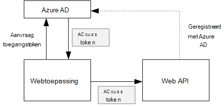
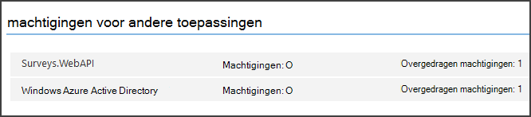

<properties
   pageTitle="Een back-end web API in een multitenant-toepassing beveiligen | Microsoft Azure"
   description="Het beveiligen van een back-end web API"
   services=""
   documentationCenter="na"
   authors="MikeWasson"
   manager="roshar"
   editor=""
   tags=""/>

<tags
   ms.service="guidance"
   ms.devlang="dotnet"
   ms.topic="article"
   ms.tgt_pltfrm="na"
   ms.workload="na"
   ms.date="06/02/2016"
   ms.author="mwasson"/>

# <a name="securing-a-backend-web-api-in-a-multitenant-application"></a>Een back-end web API in een multitenant-toepassing beveiligen

[AZURE.INCLUDE [pnp-header](../../includes/guidance-pnp-header-include.md)]

Dit artikel maakt [deel uit van een serie]. Er is ook een volledige [voorbeeldtoepassing] die bij deze reeks.

De toepassing [Tailspin enquêtes] gebruikt een back-end web API voor het beheren van bewerkingen op enquêtes CRUD. Bijvoorbeeld wanneer een gebruiker op 'Mijn enquêtes', verzendt de webtoepassing een HTTP-aanvraag naar de web-API:

```
GET /users/{userId}/surveys
```

Het web API retourneert een JSON-object:

```
{
  "Published":[],
  "Own":[
    {"Id":1,"Title":"Survey 1"},
    {"Id":3,"Title":"Survey 3"},
    ],
  "Contribute": [{"Id":8,"Title":"My survey"}]
}
```

Het web API kan geen anonieme aanvragen, zodat de web app moet worden geverifieerd met 2 OAuth aan toonder tokens.

> [AZURE.NOTE] Dit is een scenario van server naar server. De toepassing maakt geen AJAX oproepen aan de API van de browserclient.

Er zijn twee belangrijkste mogelijke benaderingen:

- Gebruikersidentiteit wordt overgedragen. De webtoepassing verifieert de identiteit van de gebruiker.
- Toepassings-id. De webtoepassing wordt geverifieerd met de client-ID, met behulp van OAuth2 client referenties stroom.

De toepassing van Tailspin implementeert overgedragen gebruikersidentiteit. Hier volgen de belangrijkste verschillen:

**Overgedragen gebruikersidentiteit**

- Het token aan toonder is verzonden naar het web API bevat de identiteit van de gebruiker.
- Het web API maakt autorisatiebeslissingen op basis van de identiteit van de gebruiker.
- De webtoepassing moet de foutafhandeling 403 (niet toegestaan) via het web API, als de gebruiker niet is gemachtigd een actie uit te voeren.
- Normaal gesproken kunt de webtoepassing nog steeds u sommige autorisatiebeslissingen te nemen die gevolgen hebben voor de gebruikersinterface, zoals het weergeven of verbergen van elementen van de gebruikersinterface).
- De web-API kan mogelijk worden gebruikt door niet-vertrouwde clients, zoals een JavaScript-toepassing of een native clienttoepassing.

**Toepassings-id**

- Het web API krijgt geen informatie over de gebruiker.
- Het web API uitvoeren niet van een vergunning op basis van de identiteit van de gebruiker. Alle autorisatiebeslissingen worden gemaakt door de webtoepassing.  
- De web-API kan niet worden gebruikt door een niet-vertrouwde client (JavaScript of native clienttoepassing).
- Deze aanpak is mogelijk iets eenvoudiger te implementeren, omdat er geen steekhoudende in de Web-API.

In beide benadering moet de webtoepassing een toegangstoken op dat de referenties die nodig zijn voor het web API aanroepen ophalen.

- Het token heeft overgedragen gebruikersidentiteit, afkomstig zijn van de IDP die een token voor de gebruiker kan uitgeven.

- Een toepassing kan ophalen van het token van de IDP of hosten van een eigen server token voor clientreferenties van de. (Maar niet een token server helemaal schrijven; gebruik van een uitgebreid geteste kader zoals [IdentityServer3].) Als u verificatie met Azure AD, is het sterk aanbevolen om het toegangstoken van Azure AD, zelfs met client referenties stroom.

De rest van dit artikel wordt ervan uitgegaan dat de toepassing wordt geverifieerd met Azure Active Directory.



## <a name="register-the-web-api-in-azure-ad"></a>Het web API in Azure AD registreren

Voor Azure AD token voor het web API aan toonder uitgeven moet, u sommige dingen in Azure AD configureren.

1. [Het web API in Azure AD registreren].

2. De client-ID van het web app toevoegen aan het manifest van de toepassing web API in de `knownClientApplications` eigenschap. Zie [de Toepassingsmanifesten bijwerken].

3. [De web application machtigen het web API aanroepen].

  U kunt twee typen machtigingen instellen in de Portal Management Azure: "Machtigingen" voor toepassings-id (client referenties stroom) of "Overgedragen machtigingen" voor gedelegeerde gebruikersidentiteit.

  

## <a name="getting-an-access-token"></a>Een toegangstoken ophalen

Voordat u het web API aanroept, wordt de webtoepassing een token in Azure AD. In een toepassing .NET gebruikt u de [Azure AD verificatie bibliotheek (ADAL) voor .NET][ADAL].

De toepassing wisselt in de stroom van 2 OAuth vergunning code, een code van de vergunning voor een toegangstoken. De volgende code wordt een ADAL aan het toegangstoken. Deze code wordt aangeroepen tijdens het `AuthorizationCodeReceived` gebeurtenis.

```csharp
// The OpenID Connect middleware sends this event when it gets the authorization code.   
public override async Task AuthorizationCodeReceived(AuthorizationCodeReceivedContext context)
{
    string authorizationCode = context.ProtocolMessage.Code;
    string authority = "https://login.microsoftonline.com/" + tenantID
    string resourceID = "https://tailspin.onmicrosoft.com/surveys.webapi" // App ID URI
    ClientCredential credential = new ClientCredential(clientId, clientSecret);

    AuthenticationContext authContext = new AuthenticationContext(authority, tokenCache);
    AuthenticationResult authResult = await authContext.AcquireTokenByAuthorizationCodeAsync(
        authorizationCode, new Uri(redirectUri), credential, resourceID);

    // If successful, the token is in authResult.AccessToken
}
```

Hier vindt u de verschillende parameters die nodig zijn:

- `authority`. Afgeleid van de huurder-ID van de gebruiker ingelogd. (Niet de huurder-ID van de SaaS-provider)  
- `authorizationCode`. de verificatie-code die u terug van de IDP gekregen.
- `clientId`. De webtoepassing client-ID.
- `clientSecret`. Geheim van de client de webtoepassing.
- `redirectUri`. De omleiding URI die u instelt voor de OpenID verbinden. Dit is waar de IDP belt terug met het token.
- `resourceID`. De App ID URI van het web API, die u gemaakt wanneer u het web API geregistreerd in Azure AD
- `tokenCache`. Een object dat de toegangstokens caches. Zie [Token-caching].

Als `AcquireTokenByAuthorizationCodeAsync` slaagt, ADAL slaat het token. Later kun je het token van de cache door het aanroepen van AcquireTokenSilentAsync:

```csharp
AuthenticationContext authContext = new AuthenticationContext(authority, tokenCache);
var result = await authContext.AcquireTokenSilentAsync(resourceID, credential, new UserIdentifier(userId, UserIdentifierType.UniqueId));
```

waarbij `userId` is van de gebruiker object-ID die is gevonden in de `http://schemas.microsoft.com/identity/claims/objectidentifier` claimen.

## <a name="using-the-access-token-to-call-the-web-api"></a>Het toegangstoken via het web API aanroepen

Zodra u het token hebt, het in de vergunning-header van de HTTP-aanvragen naar het web verzenden API.

```
Authorization: Bearer xxxxxxxxxx
```

De koptekst van de vergunning de volgende extensie-methode van de toepassing onderzoeken ingesteld op een HTTP-verzoek met de klasse **HttpClient** .

```csharp
public static async Task<HttpResponseMessage> SendRequestWithBearerTokenAsync(this HttpClient httpClient, HttpMethod method, string path, object requestBody, string accessToken, CancellationToken ct)
{
    var request = new HttpRequestMessage(method, path);
    if (requestBody != null)
    {
        var json = JsonConvert.SerializeObject(requestBody, Formatting.None);
        var content = new StringContent(json, Encoding.UTF8, "application/json");
        request.Content = content;
    }

    request.Headers.Authorization = new AuthenticationHeaderValue("Bearer", accessToken);
    request.Headers.Accept.Add(new MediaTypeWithQualityHeaderValue("application/json"));

    var response = await httpClient.SendAsync(request, ct);
    return response;
}
```

> [AZURE.NOTE] Zie [HttpClientExtensions.cs].

## <a name="authenticating-in-the-web-api"></a>Verificatie in de web-API

Het web API heeft voor het verifiëren van de token aan toonder. In ASP.NET Core 1.0, kunt u de [Microsoft.AspNet.Authentication.JwtBearer] [ JwtBearer] pakket. Dit pakket biedt middleware waarmee de toepassing OpenID verbinden aan toonder tokens ontvangen.

De middleware registreren in uw web API `Startup` klasse.

```csharp
app.UseJwtBearerAuthentication(options =>
{
    options.Audience = "[app ID URI]";
    options.Authority = "https://login.microsoftonline.com/common/";
    options.TokenValidationParameters = new TokenValidationParameters
    {
        //Instead of validating against a fixed set of known issuers, we perform custom multi-tenant validation logic
        ValidateIssuer = false,
    };
    options.Events = new SurveysJwtBearerEvents();
});
```

> [AZURE.NOTE] Zie [Startup.cs].

- **Doelgroep**. Stel deze aan de App-ID URL voor het web-API die u hebt gemaakt bij het registreren van het web API met Azure Active Directory.
- **Autoriteit**. Voor een multitenant toepassing deze optie instellen op `https://login.microsoftonline.com/common/`.
- **TokenValidationParameters**. Instellen voor een toepassing multitenant, **ValidateIssuer** op false. Dit betekent dat de toepassing van de uitgevende instelling worden gevalideerd.
- **Gebeurtenissen** is een klasse die is afgeleid van **JwtBearerEvents**.

### <a name="issuer-validation"></a>Validatie van de uitgevende instelling

Valideren van de tokenuitgever in de **JwtBearerEvents.ValidatedToken** -gebeurtenis. De uitgevende instelling wordt in de claim 'iss' verzonden.

In de toepassing onderzoeken verwerken niet het web API [huurder aanmelding]. Daarom wordt alleen gecontroleerd of de uitgevende instelling zich al in de database van de toepassing. Als dit niet het geval is, het genereert een uitzondering, waardoor de verificatie mislukt.

```csharp
public override async Task ValidatedToken(ValidatedTokenContext context)
{
    var principal = context.AuthenticationTicket.Principal;
    var tenantManager = context.HttpContext.RequestServices.GetService<TenantManager>();
    var userManager = context.HttpContext.RequestServices.GetService<UserManager>();
    var issuerValue = principal.GetIssuerValue();
    var tenant = await tenantManager.FindByIssuerValueAsync(issuerValue);

    if (tenant == null)
    {
        // the caller was not from a trusted issuer - throw to block the authentication flow
        throw new SecurityTokenValidationException();
    }
}
```

> [AZURE.NOTE] Zie [SurveysJwtBearerEvents.cs].

U kunt ook de gebeurtenis **ValidatedToken** [vorderingen transformatie]te doen. Houd er rekening mee dat de claims rechtstreeks afkomstig is van Azure AD, dus als de webtoepassing alle vorderingen transformaties heeft, die niet zichtbaar zijn in het token aan toonder die het web API ontvangt.

## <a name="authorization"></a>Autorisatie

Zie [rol- en resource autorisatie]voor een algemene discussie van een vergunning[Authorization]. 

De middleware JwtBearer omgaat met de antwoorden van de vergunning. Bijvoorbeeld om een controller actie aan geverifieerde gebruikers beperken, gebruikt u de atrribute **[machtigen]** en **JwtBearerDefaults.AuthenticationScheme** als de verificatiemethode opgeven:

```csharp
[Authorize(ActiveAuthenticationSchemes = JwtBearerDefaults.AuthenticationScheme)]
```

Hiermee wordt een statuscode 401 geretourneerd als de gebruiker niet is geverifieerd.

Om een controller actie beperkt door het beleid voor authorizaton, geef de naam van het beleid in het kenmerk **[machtigen]** :

```csharp
[Authorize(Policy = PolicyNames.RequireSurveyCreator)]
```

Hiermee wordt een statuscode 401 teruggestuurd als de gebruiker niet is geverifieerd en 403 als de gebruiker is geverifieerd, maar mag niet. Het beleid tijdens het opstarten als volgt registreren:

```csharp
public void ConfigureServices(IServiceCollection services)
{
    services.AddAuthorization(options =>
    {
        options.AddPolicy(PolicyNames.RequireSurveyCreator,
            policy =>
            {
                policy.AddRequirements(new SurveyCreatorRequirement());
                policy.AddAuthenticationSchemes(JwtBearerDefaults.AuthenticationScheme);
            });
    });
}
```

## <a name="next-steps"></a>Volgende stappen

- Lees het volgende artikel in deze serie: [toegangstokens voor opslaan in cache in een multitenant-toepassing][token cache]

<!-- links -->
[ADAL]: https://msdn.microsoft.com/library/azure/jj573266.aspx
[JwtBearer]: https://www.nuget.org/packages/Microsoft.AspNet.Authentication.JwtBearer
[bij een reeks hoort]: guidance-multitenant-identity.md
[Tailspin enquêtes]: guidance-multitenant-identity-tailspin.md
[IdentityServer3]: https://github.com/IdentityServer/IdentityServer3
[Het web API in Azure AD registreren]: https://github.com/Azure-Samples/guidance-identity-management-for-multitenant-apps/blob/master/docs/running-the-app.md#register-the-surveys-web-api
[De Toepassingsmanifesten bijwerken]: https://github.com/Azure-Samples/guidance-identity-management-for-multitenant-apps/blob/master/docs/running-the-app.md#update-the-application-manifests
[De web application machtigen het web API aanroepen]: https://github.com/Azure-Samples/guidance-identity-management-for-multitenant-apps/blob/master/docs/running-the-app.md#give-the-web-app-permissions-to-call-the-web-api
[Token-caching]: guidance-multitenant-identity-token-cache.md
[HttpClientExtensions.cs]: https://github.com/Azure-Samples/guidance-identity-management-for-multitenant-apps/blob/master/src/Tailspin.Surveys.Common/HttpClientExtensions.cs
[Startup.cs]: https://github.com/Azure-Samples/guidance-identity-management-for-multitenant-apps/blob/master/src/Tailspin.Surveys.WebAPI/Startup.cs
[huurder-aanmelding]: guidance-multitenant-identity-signup.md
[SurveysJwtBearerEvents.cs]: https://github.com/Azure-Samples/guidance-identity-management-for-multitenant-apps/blob/master/src/Tailspin.Surveys.WebAPI/SurveyJwtBearerEvents.cs
[transformatie van vorderingen]: guidance-multitenant-identity-claims.md#claims-transformations
[Authorization]: guidance-multitenant-identity-authorize.md
[voorbeeldtoepassing]: https://github.com/Azure-Samples/guidance-identity-management-for-multitenant-apps
[token cache]: guidance-multitenant-identity-token-cache.md
