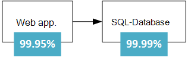
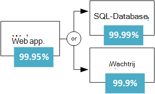
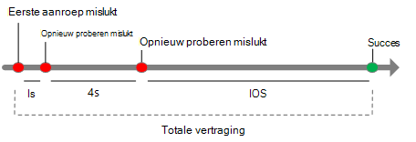
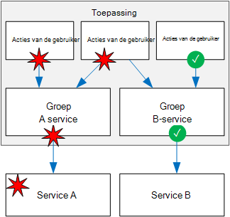
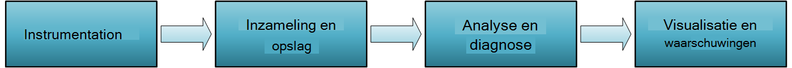

<properties
   pageTitle="Robuuste toepassingen ontwerpen | Microsoft Azure"
   description="Het robuuste toepassingen maken in Azure, voor hoge beschikbaarheid en disaster recovery."
   services=""
   documentationCenter="na"
   authors="MikeWasson"
   manager="christb"
   editor=""
   tags=""/>

<tags
   ms.service="guidance"
   ms.devlang="na"
   ms.topic="article"
   ms.tgt_pltfrm="na"
   ms.workload="na"
   ms.date="08/18/2016"
   ms.author="mwasson"/>
   
# Ontwerpen van robuuste toepassingen voor Azure

In een gedistribueerd systeem fouten gebeurt. Hardware kan mislukken. Het netwerk kan fouten van voorbijgaande aard zijn. Zelden een volledige service of regio een onderbreking kan optreden, maar ook die moeten worden gepland voor. 

Bouwen van een betrouwbare toepassing in de cloud is anders dan het bouwen van een betrouwbare toepassing bij een onderneming.  Terwijl in het verleden u mogelijk hebt gekocht hoger-end hardware te vergroten, in een cloud-omgeving moet schalen uit in plaats van omhoog. Kosten voor cloud-omgevingen worden met behulp van de hardware van de grondstoffen laag gehouden. In plaats van dat zich richt op het voorkomen van fouten en het optimaliseren van 'gemiddelde tijd tussen storingen', in deze nieuwe omgeving wordt de focus verplaatst "verstaan tijd om te herstellen." Het doel is om het minimaliseren van de impact van een fout.

Dit artikel geeft een overzicht van hoe u robuuste toepassingen in Microsoft Azure. Deze begint met een definitie van het begrip, *tolerantie* en verwante begrippen. Vervolgens wordt een proces voor het bereiken van de tolerantie, met behulp van een gestructureerde benadering gedurende de looptijd van een toepassing op de distributie en het gebruik van ontwerp en implementatie beschreven.

## Wat is tolerantie?

**Tolerantie** is de mogelijkheid om te herstellen na storingen en blijven functioneren. Het is niet over fouten *te vermijden* , maar *reageert* op storingen op een manier die downtime of gegevensverlies voorkomt. Het doel van de tolerantie is om terug te keren de toepassing volledig functioneren na een storing.

Twee belangrijke aspecten van tolerantie zijn hoge beschikbaarheid en noodherstel.

- **Hoge beschikbaarheid** (HA) is de mogelijkheid van de toepassing in orde zijn, zonder aanzienlijke uitvaltijd blijven uitvoeren. Door "gezonde staat" verstaan we de toepassing is responsief en kunnen gebruikers verbinding maken met de toepassing en ermee.  

- **Noodherstel** (DR) is de mogelijkheid om te herstellen van zeldzame maar belangrijke incidenten: tijdelijke, schaal fouten, zoals onderbrekingen die geldt voor een hele regio. Herstel na noodgevallen bevat gegevensback-ups en archivering en handmatige interventies, zoals een database terugzetten vanaf back-up kan bevatten. 

Een manier om na te denken over HA versus DR is dat Dr. Watson wordt gestart wanneer de impact van een fout met betrekking tot de mogelijkheid van het ontwerp HA afgehandeld overschrijdt. Bijvoorbeeld zal verschillende VMs achter een load balancer plaatsen zorgen voor beschikbaarheid als een VM mislukt, maar niet als ze allemaal op hetzelfde moment niet. 

Bij het ontwerpen van toepassingen zijn robuuste die u moet begrijpen de vereisten voor beschikbaarheid. Hoeveel uitvaltijd is acceptabel? Dit is deels afhankelijk van de kosten. Hoeveel kost inbegrepen uw bedrijf? Hoeveel moet u investeren in hoge mate beschikbaar maken van de toepassing Ook moet u definiëren wat het betekent voor de toepassing beschikbaar is. Bijvoorbeeld, is de toepassing 'down' als een klant een order kunt indienen, maar het systeem kan niet worden verwerkt in de normale periode?

Een andere algemene term is **bedrijfscontinuïteit** (BC), de mogelijkheid voor het uitvoeren van essentiële bedrijfsfuncties tijdens en na een ramp. BC omvat de volledige werking van het bedrijf, met inbegrip van fysieke faciliteiten, mensen, communicatie, vervoer, en IT. In dit artikel, we alleen gericht zijn op de cloud-toepassingen, maar veerkracht planning moet worden uitgevoerd in het kader van algemene voorschriften voor BC. 

## Proces te verwezenlijken tolerantie

Tolerantie is een invoegtoepassing. Het moet in het systeem is ontworpen en geplaatst in de werkwijze. Dit is een algemeen model uit te voeren:

1.  **Definiëren** de eisen aan de beschikbaarheid op basis van bedrijfsbehoeften

2.  **Ontwerp** van de toepassing voor meer herstellingsvermogen. Beginnen met een architectuur die bewezen volgt en vervolgens mislukken punten in die architectuur te identificeren.

3.  Strategieën **implementeren** op te sporen en te herstellen na storingen. 

4.  **Test** de implementatie door fouten te simuleren en die gedwongen failover. 

5.  **Implementeren** van de toepassing naar de productie met behulp van een betrouwbare, herhaalbare processen. 

6.  **Monitor** van de toepassing fouten opsporen. U kunt controle van het systeem meten van de gezondheid van de toepassing en reageren op incidenten, indien nodig. 

7.  **Reageren** als er incidenten waarvoor handmatige interventies.

In de rest van dit artikel besproken elk van deze stappen in meer detail.

## Uw flexibele vereisten definiëren

Flexibele planning begint met de zakelijke vereisten. Hier volgen enkele methoden voor de tolerantie in deze termen denken.

### Ontleden door werkbelasting

Veel cloud oplossingen bestaan uit meerdere werklasten. De term "belasting" in deze context betekent een aparte mogelijkheid of een taak kan logisch worden gescheiden van andere taken, in termen van business logica en gegevens opslagvereisten computergebruik. Een e-commerce-app kan bijvoorbeeld de volgende belasting:

- Bladeren en zoeken van een productcatalogus.

- Maken en bijhouden van orders.

- Aanbevelingen weergeven.

Deze werkbelasting mogelijk verschillende vereisten voor beschikbaarheid, schaalbaarheid, consistentie van de gegevens, noodherstel, enzovoort. Nogmaals, dit zijn zakelijke beslissingen te nemen.

Bedenk ook gebruikspatronen. Zijn er bepaalde kritieke perioden wanneer het systeem moet beschikbaar zijn? Bijvoorbeeld kan niet een btw-aangifte-service omlaag rechts voordat de termijn voor indiening; een video streaming service moet blijven tijdens een groot Sportevenement; enzovoort. Tijdens de kritieke perioden wellicht overbodig implementaties tussen verschillende regio's, zodat de toepassing mislukken kan als er één gebied is mislukt. Een implementatie met meerdere regio is duurder, zodat minder belangrijke momenten u de toepassing in een bepaalde regio uitvoert kunt.  

### RTO en vrijgegeven Productieorder

Twee belangrijke parameters rekening te houden met zijn herstel tijd doelstelling en herstel punt doelstelling:

- **Herstel tijd doelstelling** (RTO) is de maximaal acceptabele tijd die een toepassing kan na een incident niet beschikbaar zijn. Als de RTO 90 minuten is, moet u de toepassing actief binnen 90 minuten vanaf het begin van een ramp te herstellen zijn. Hebt u een zeer lage RTO, kunt u een tweede implementatie voortdurend worden uitgevoerd op stand-by te beschermen tegen een regionale stroomstoring mogelijk houden.

- **Herstel punt doelstelling** (Vrijgegeven Productieorder) is de maximale duur van het verlies van gegevens die tijdens een noodsituatie aanvaardbaar is. Bijvoorbeeld, als u gegevens opslaan in één database met geen replicatie naar andere databases, per uur back-ups maakt, kunt u verliezen een uur lang van gegevens. 

RTO en vrijgegeven Productieorder zijn zakelijke vereisten. Een andere veelvoorkomende metric is **ondertussen herstellen** (MTTR), de gemiddelde tijd die nodig is om te herstellen na een storing van de-toepassing. MTTR is een empirische feit over een systeem. Als MTTR de RTO overschrijdt, kan veroorzaken een storing in het systeem een verstoring van de onaanvaardbare zakelijke omdat het niet mogelijk om te herstellen van het systeem binnen de gedefinieerde RTO. 

### Sla 's

In Azure, het [Service Level Agreement] [ sla] (SLA) beschrijving van Microsofts toezeggingen voor beschikbaarheid en connectiviteit. Als de SLA voor een bepaalde service 99,9% is, betekent dit dat u de service beschikbaar te zijn 99,9% van de tijd kunt verwachten.

> [AZURE.NOTE] De SLA Azure bevat ook bepalingen voor het verkrijgen van een creditcard service als de SLA niet wordt voldaan, samen met specifieke definities van "beschikbaarheid" voor elke service. Dit aspect van de SLA fungeert als een handhavingsbeleid. 

In de oplossing moet u uw eigen doel Sla's voor elke werkbelasting definiëren. Een SLA maakt het mogelijk om reden over de architectuur en de vraag of de architectuur voldoet aan de eisen. Bijvoorbeeld, als een werkbelasting 99,99% uptime vereist, maar is afhankelijk van een service met een SLA 99,9%, die service niet één punt van de storing in het systeem. Een vorm van genoegdoening is een terugval pad als de service niet meer werkt of andere maatregelen om te herstellen na een storing in de service. 

De volgende tabel bevat de cumulatieve inbegrepen voor de verschillende niveaus van de SLA. 

| SLA     | Uitvaltijd per week | Uitvaltijd per maand | Downtime per jaar |
|---------|-------------------|--------------------|-------------------|
| 99%     | 1.68 uren        | 7,2 uur          | 3,65 dagen         |
| 99,9%   | 10.1 minuten      | 43,2 minuten       | 8.76 uren        |
| 99.95%  | 5 minuten         | 21,6 minuten       | 4,38 uren        |
| 99,99%  | 1.01 minuten      | 4.32 minuten       | 52.56 minuten     |
| 99,999% | 6 seconden         | 25.9 seconden       | 5.26 minuten      |

Hogere mate van beschikbaarheid is natuurlijk beter alles identieke onderdelen zouden bevatten. Maar als u streven naar meer 9s, de kosten en complexiteit te bereiken dat niveau van beschikbaarheid groeit. Een uptime van 99,99% zet op ongeveer 5 minuten van de totale downtime per maand. Is het waard de extra complexiteit en kosten vijf 9s bereiken? Het antwoord is afhankelijk van de zakelijke vereisten. 

Hier zijn enkele andere overwegingen bij het definiëren van een SLA:

- Voor vier 9 van (99,99%), vertrouwen u waarschijnlijk niet op handmatige interventie te herstellen na storingen. De toepassing moet zichzelf diagnose en zelfreparerende. 

- Meer dan vier 9 van, is het moeilijk voor het detecteren van storingen snel genoeg om te voldoen aan de SLA.

- Het venster dat de SLA wordt gemeten ten opzichte van denken. Hoe kleiner het venster, hoe kleiner de toleranties. Het zinvol waarschijnlijk niet voor het definiëren van de SLA in uptime uur of per dag. 

### Samengestelde Sla 's

U kunt een App Service web app die u naar Azure SQL-Database schrijft. Op het moment van schrijven van dit hebben deze Azure services de volgende Sla's:

- App Service Web Apps = 99.95%

- SQL-Database = 99,99%

Wat is de maximale uitval die u verwacht van deze toepassing? Als de service mislukt, mislukt de hele toepassing. In het algemeen is de kans dat elke service mislukt is onafhankelijk, dus de samengestelde SLA voor deze toepassing 99.95% x 99,99 is % = 99.94%. Die lager is dan de afzonderlijke Sla's, dat is niet verwonderlijk, omdat een toepassing die afhankelijk van meerdere services is heeft meer potentiële fout punten. 

Aan de andere kant kunt u de samengestelde SLA verbeteren door onafhankelijke fallback paden maken. Als bijvoorbeeld SQL-Database niet beschikbaar is, plaatst u transacties in een wachtrij, kunnen later worden verwerkt.

Met dit ontwerp is de toepassing nog steeds beschikbaar, zelfs als er geen verbinding met de database maken. Echter niet als de database en de wachtrij niet op hetzelfde moment. De verwachte percentage van de tijd voor een gelijktijdige storing is 0,0001 × 0,001, waardoor u de samengestelde SLA voor deze gecombineerde pad  

- Database of wachtrij = 1,0 &minus; (0,0001 &times; 0,001) = 99,99999%

De totale samengestelde SLA is:

- Web-app en (database of wachtrij) 99.95% = &times; % 99,99999 = ~99.95%

Maar er zijn en nadelen aan deze benadering. De toepassingslogica complexer is, u betaalt voor de wachtrij en kunnen er problemen met gegevens consistent te houden.

**SLA voor implementaties met meerdere regio**. Een andere HA techniek is de toepassing in meer dan één gebied implementeren en gebruiken van Azure verkeer Manager worden uitgevoerd indien de aanvrage niet in een regio. Voor de implementatie van een twee-regio, de samengestelde SLA als volgt berekend. 

Laat *N* worden de samengestelde SLA voor de toepassing is geïmplementeerd in een regio. De verwachte kans op die de toepassing niet tegelijkertijd in beide regio's is (1 &minus; N) &times; (1 &minus; N). Daarom

- SLA voor beide regio's gecombineerd = 1 &minus; (1 &minus; N) (1 &minus; N) = N + (1 &minus; N) N

Ten slotte moet factor de [SLA voor verkeer Manager][tm-sla]. Vanaf wanneer dit artikel is geschreven, wordt de SLA voor verkeer Manager SLA 99,99%.

- Samengestelde SLA 99,99% = &times; (SLA gecombineerd voor beide regio's)

Een meer gedetailleerde informatie is dat storing worden overgenomen niet onmiddellijk wordt uitgevoerd, hetgeen kan leiden tot enkele downtime tijdens een failover. [Beheer van netwerkverkeer eindpunt controle en failover]Zie[tm-failover].

Het nummer van de berekende SLA een basislijn nuttig is, maar het hele verhaal niet duidelijk over de beschikbaarheid. Een toepassing kan vaak zonder problemen als een niet-kritieke pad niet afnemen. U kunt een toepassing waarin een catalogus van boeken. Als de toepassing niet van de miniatuur van de dekking ophalen, kan het een aanduiding voor de afbeelding weergegeven. In dat geval wordt daalt de afbeelding niet niet uptime van de toepassing, hoewel dit van invloed op de gebruikerservaring.  

## Ontwerpen voor meer herstellingsvermogen

U moet een analyse op modus (FMA) uitvoeren tijdens de ontwerpfase. Het doel van een volledige Postbustoegang is mogelijk potentiële risico identificeren en definiëren hoe de toepassing reageert op deze storingen.

- Hoe wordt de toepassing dit soort fout gedetecteerd?

- Hoe de toepassing reageert op dit type fout?

- Hoe wordt u melden en controleren van dergelijke storingen? 

Zie voor meer informatie over het proces van volledige Postbustoegang, met specifieke aanbevelingen voor Azure, [richtlijnen Azure tolerantie: analyse op modus][fma].

### Voorbeeld van de identiteit van failure modes en detectie strategie

**Punt van mislukken:** Bellen naar een externe webservice / API.

| Storingsconditie | Detectie van strategie |
|--------------|--------------------|
| Service is niet beschikbaar | HTTP-5xx |
| Bandbreedtebeperking | HTTP 429 (te veel aanvragen) | 
| Verificatie | HTTP 401 (geverifieerd) | 
| Trage reactie | Time-out voor aanvraag |

## Flexibele strategieën

Deze sectie bevat een overzicht van enkele gemeenschappelijke strategieën van de tolerantie. De meeste hiervan zijn niet beperkt tot een bepaalde technologie. De beschrijvingen in deze sectie zijn bedoeld om samen te vatten van het idee achter elke techniek, met koppelingen naar verder lezen.

### Tijdelijke fouten opnieuw

Fouten van voorbijgaande aard kunnen worden veroorzaakt door de momentele verlies van de verbinding met het netwerk, een decoratieve databaseverbinding of een time-out voor wanneer een service bezet is. Vaak kan een tijdelijke storing worden opgelost door simpelweg de aanvraag opnieuw. Voor veel Azure services implementeert de client-SDK automatische pogingen, op een manier die transparant voor de aanvrager; Zie [specifieke richtlijnen voor services opnieuw][retry-service-specific guidance].

Nieuwe pogingen wordt toegevoegd aan de totale vertraging. Te veel mislukte aanvragen kunnen ook leiden tot een knelpunt, zoals verzameld in behandeling zijnde aanvragen in de wachtrij. Deze geblokkeerde aanvragen mogelijk houdt kritieke systeembronnen, zoals geheugen, threads, databaseverbindingen, enzovoort, die trapsgewijs fouten kunnen veroorzaken. Verhoog de vertraging tussen nieuwe pogingen om dit te voorkomen, en beperken van het totale aantal mislukte aanvragen.

Zie voor meer informatie, [Patroon opnieuw][retry-pattern].

### Taakverdeling tussen de instanties

Schaalbaarheid moet een wolk toepassing kunnen geschaald uit door meer exemplaren toe te voegen. Tolerantie, verbeterd deze benadering ook omdat beschadigde exemplaren van rotatie kunnen worden genomen.  

Bijvoorbeeld:

- Twee of meer VMs achter een load balancer plaatsen. De taakverdeling worden alle VMs-verkeer. Zie [meerdere VMs op Azure voor schaalbaarheid en beschikbaarheid uitgevoerd][ra-multi-vm].

- Schaal van een app Azure App Service voor meerdere exemplaren. App-Service automatisch laden saldi tussen exemplaren. Zie [eenvoudige webtoepassing][ra-basic-web].

- [Azure verkeer] beheer[ tm] voor het verkeer verdelen over een aantal eindpunten.

### Gegevens repliceren

Repliceren van gegevens is een algemene strategie voor de verwerking van tijdelijke storingen in een gegevensarchief. Veel opslagtechnologieën bieden ingebouwde replicatie, waaronder Azure SQL-Database, DocumentDB en Cassandra Apache.  

Het is belangrijk rekening houden met zowel het lezen en schrijven van paden. Afhankelijk van de technologie voor gegevensopslag wellicht u meerdere replica's beschrijfbare of een enkele beschrijfbare replica en meerdere alleen-lezen-replica's. 

Voor de hoogst mogelijke beschikbaarheid kunnen replica's in meerdere regio's worden geplaatst. Dit verhoogt echter de vertragingstijd in als u wilt de gegevens repliceren. Replicatie tussen de regio's wordt gewoonlijk gedaan asynchroon, dat betekent dat een model van de uiteindelijke algehele consistentie en verlies van gegevens als een replica niet. 

### Netjes afnemen

Als een service niet meer werkt en er geen failover-pad is, de toepassing mogelijk zonder problemen, op een manier waarmee u nog steeds een aanvaardbare gebruikerservaring nadelig beïnvloeden. Bijvoorbeeld:

- Plaats een werkitem in een wachtrij, kunnen later worden uitgevoerd. 

- Een geschatte waarde retourneren 

- Gebruik de gegevens lokaal in de cache. 

- De gebruiker een foutbericht weergegeven. (Deze optie is beter dan de toepassing reageert op verzoeken.)

### Grote aantallen gebruikers beperken

Een klein aantal gebruikers maken soms buitensporige belasting. Die een invloed kunnen hebben op andere gebruikers, waardoor de algehele beschikbaarheid van uw toepassing.

Wanneer een enkele client een uitzonderlijk groot aantal aanvragen, kan de toepassing de client voor een bepaalde periode beperken. In die periode bandbreedteregeling weigert de toepassing sommige of alle van de aanvragen van deze client (afhankelijk van de exacte bandbreedteregeling strategie). De drempel voor bandbreedteregeling kan afhankelijk zijn van de service-laag van de klant. 

Beperking betekent niet dat de client is noodzakelijkerwijs bedoelingen handelt. Het betekent alleen dat de client de service-quotum overschreden.  In sommige gevallen kan een consument voortdurend overschrijden hun quota of anders gedragen zich slecht. In dat geval kunt u verder gaan en blokkeren van de gebruiker. Dit wordt gewoonlijk gedaan door een API-sleutel of een IP-adresbereik te blokkeren.

Zie voor meer informatie, [Bandbreedtebeperking patroon][throttling-pattern].

### Gebruik een stroomonderbreker  

Het patroon stroomonderbreker kunt voorkomen dat een toepassing herhaaldelijk probeert een bewerking die waarschijnlijk zal mislukken. De analogie is een fysieke stroomonderbreker, een schakelaar die de elektrische stroom wanneer een circuit overbelast is onderbroken.

De hoofdschakelaar loopt de aanroepen van een service. Het kent drie statussen:

- **Gesloten**. Dit is de normale status. De hoofdschakelaar stuurt verzoeken naar de service en een teller het aantal recente fouten bijgehouden. Als het aantal fouten hoger is dan een drempel binnen een bepaalde periode, schakelt u de hoofdschakelaar aan de Open staat. 

- **Open**. In deze staat mislukt de hoofdschakelaar onmiddellijk alle aanvragen zonder het aanroepen van de service. De toepassing moet een pad met Beperkende factoren, zoals het lezen van gegevens van een replica of gewoon een fout wordt geretourneerd naar de gebruiker te gebruiken. Wanneer de hoofdschakelaar te openen, wordt een timer. Als de timer verloopt, wordt de hoofdschakelaar op de Half open staat.

- **Half open**. De hoofdschakelaar kunt in deze staat een beperkt aantal aanvragen gaan via de service. Ze worden voltooid, wordt uitgegaan van de service worden hersteld als de hoofdschakelaar schakelt terug naar de status afgesloten. Anders wordt hersteld naar de status Open. De Half Open staat wordt voorkomen dat een service herstellen plotseling wordt overstelpt met aanvragen.

Voor meer informatie Zie [Stroomonderbreker patroon][circuit-breaker-pattern].

### Gebruik laden herverdeling vloeiend op pieken in het verkeer

Toepassingen kunnen plotselinge pieken in het verkeer, welke services op de backend kunnen overstelpen optreden. Als een back-end-service kan niet snel genoeg op aanvragen reageert, mogelijk tot gevolg hebben dat de aanvragen in de wachtrij (back-up), of ervoor zorgen dat de service de toepassing beperken.

Om dit te voorkomen, kunt u een wachtrij als buffer. Als er een nieuw werkitem in plaats van de backend-service onmiddellijk, wachtrijen voor de toepassing een werkitem worden asynchroon uitgevoerd. De wachtrij fungeert als een buffer die maakt Vloeiend om pieken in de belasting. 

Zie voor meer informatie [op basis van wachtrijen laden bij het herverdelen patroon][load-leveling-pattern].

### Isoleren van kritieke bronnen 

Fouten in een subsysteem kunnen soms trapsgewijs storingen veroorzaken in andere onderdelen van de toepassing. Dit kan gebeuren als er een storing ervoor zorgt dat bepaalde bronnen, zoals threads of sockets niet te krijgen binnen een redelijke termijn, leidt tot uitputting van bronnen vrijgemaakt. 

Om dit te voorkomen, kunt u een systeem partitioneren in geïsoleerde groepen, zodat een storing in één partitie niet buiten werking stelt het gehele systeem. Deze techniek wordt soms het patroon schot genoemd.

Voorbeelden:

- Een database--bijvoorbeeld door de huurder--partitioneren en een aparte groep van exemplaren van de web server voor elke partitie toewijzen.  
- Gebruik afzonderlijke Threadgroepen aanroepen naar verschillende services te isoleren. Dit helpt voorkomen dat trapsgewijze fouten als een van de services mislukt. Zie voor een voorbeeld, de Netflix [bibliotheek Hystrix][hystrix].

- [Containers] gebruiken[ containers] te beperken, de beschikbare bronnen voor een bepaalde subsysteem. 

### Compensatie transacties van toepassing 

Een compenserende transactie is een transactie die de effecten van een andere voltooide transactie ongedaan.

In een gedistribueerd systeem, kan het lastig zeer sterke transactionele consistentie te bereiken. Compensatie transacties zijn een manier om de consistentie te bereiken met behulp van een reeks kleinere, afzonderlijke transacties die bij elke stap ongedaan worden gemaakt kan.

Een klant kan bijvoorbeeld als u wilt een reis boeken, een auto, een hotelkamer en een vlucht reserveren. Als deze stappen mislukt, mislukt de hele bewerking. In plaats van het gebruik van één gedistribueerde transactie voor de hele bewerking, kunt u een compenserende transactie voor elke stap. Bijvoorbeeld, om het ongedaan maken van de reservering van een auto, u de reservering annuleren. Voordat u de hele bewerking voltooien, voert een coördinator elke stap. Als een stap mislukt, geldt de coördinator compensatie transacties ongedaan maken van de stappen die zijn voltooid. 

Zie voor meer informatie, [Transactie patroon veredelingsproducten][compensating-transaction-pattern]. 

## Testen voor meer herstellingsvermogen

In het algemeen testen niet u tolerantie op dezelfde manier als u functionaliteit testen (door uit te voeren controles enzovoort). In plaats daarvan moet u testen hoe de werkbelasting van de end-to-end uitvoert onder storingen die per definitie niet alle van de tijd gebeuren.

Testen is onderdeel van een iteratief proces. De toepassing testen, meten van de resultaten, analyseren en corrigeren van fouten die tot gevolg hebben, en herhaal het proces.

**Storing injectie testen**. Test de tolerantie van het systeem op storingen, starten de werkelijke storingen of door ze te simuleren. Hier volgen enkele algemene storing scenario's te testen:

- VM exemplaren afgesloten.

- Processen crashen.

- Verlopen certificaten.

- Toegangstoetsen wijzigen.

- Afsluiten van de DNS-service op domeincontrollers.

- Beperken van beschikbare systeembronnen, zoals het RAM of het aantal threads.

- Schijven ontkoppelen.

- Implementeer een VM.

De tijden herstel meten en controleren of ze voldoen aan uw zakelijke behoeften. Combinaties van storingen op te sporen, ook testen. Zorg ervoor dat fouten niet trapsgewijs en in een geïsoleerde manier worden verwerkt.

Dit is een andere reden waarom het is belangrijk voor het analyseren van mogelijke fouten tijdens de ontwerpfase. De resultaten van die analyse moet de ingangen in uw testplan.

**Load testen**. Test de toepassing met een hulpprogramma zoals [Visual Studio Team Services] geladen[ vsts] of [Apache JMeter] [ jmeter] Load testen is cruciaal voor het identificeren van fouten die alleen gebeuren onder belasting, zoals de backend-database worden overweldigd of service beperken. Test voor piekbelasting, productie, of synthetische gegevens die zo veel mogelijk productiegegevens wordt gebruikt. Het doel is om te zien hoe de toepassing werkt onder realistische omstandigheden.   

## Robuuste implementatie

Zodra een toepassing op de productie is geïmplementeerd, worden updates een mogelijke bron van fouten. In het ergste geval een slechte update kan leiden tot uitvaltijd. Om dit te voorkomen, moet het implementatieproces voorspelbare en herhaalbare. Implementatie omvat Azure resources inrichten, toepassingscode implementeert en configuratie-instellingen toe te passen. Een update kan betrekking hebben op alle drie of een subset. 

Het cruciale punt is dat handmatige implementaties gevoelig voor de fout zijn. Dus is het raadzaam om een geautomatiseerd, idempotency is ingeschakeld proces dat op aanvraag uitvoeren en opnieuw uitvoeren als er iets mislukt. 

- Resourcemanager-sjablonen gebruiken voor het automatiseren van Azure middelen wordt ingericht.

- Gebruik [Configuratie van Azure automatisering gewenst] [ dsc] (DSC) voor het configureren van VMs.

- Gebruik een geautomatiseerde implementatieproces voor toepassingscode.

Twee begrippen met betrekking tot robuuste implementatie zijn *infrastructuur als code* en *onveranderbare infrastructuur*.

- **Infrastructuur als code** is de praktijk van het creëren en configureren van infrastructuur met behulp van code. Infrastructuur als code mag een declaratieve aanpak of een dwingende aanpak (of een combinatie van beide) gebruiken. Resource Manager sjablonen zijn een voorbeeld van een declaratieve aanpak. PowerShell scripts zijn een voorbeeld van een aanpak van cruciaal belang.

- **Onveranderbare infrastructuur** is het beginsel dat u infrastructuur beter niet wijzigen nadat deze is geïmplementeerd voor de productie. Anders krijgt u in een staat waar ad hoc wijzigingen hebt doorgevoerd, zodat u weet precies wat er gewijzigd en moeilijk te reden over het systeem. 

Een andere vraag is het verwijderen van een update. Technieken, zoals blauw-groen-implementatie het beste of kokospalm releases die push-updates in hoge mate bepaald te minimaliseren van de mogelijke gevolgen van een slechte implementatie.

- [Blauw-groen-implementatie] [ blue-green] is een techniek waarbij u een update in een afzonderlijke productie-omgeving van de actieve toepassing implementeren. Valideren van de implementatie, schakelt u de verkeersroutering naar de bijgewerkte versie. Azure App Service Web Apps kan bijvoorbeeld dit met [sleuven staging][staging-slots]. 

- [Kokospalm releases] [ canary-release] zijn vergelijkbaar met blauw-groen-implementatie. In plaats van alle verkeer overschakelt naar de bijgewerkte versie, rol van de update voor een klein percentage van de gebruikers, door een deel van het verkeer voor de nieuwe implementatie. Als er een probleem is, uitgesteld en terugkeren naar de oude installatie. Route anders meer verkeer naar de nieuwe versie, totdat het 100% van het verkeer.

Welke benadering u neemt, zorg ervoor dat u naar de laatst bekende goede-implementatie terugkeren kunt in het geval de nieuwe versie niet werkt. Ook als er fouten optreden, moet het mogelijk te bepalen van de toepassingslogboeken welke versie de fout heeft veroorzaakt. 

## Bewaking en diagnose

Bewaking en diagnose zijn cruciaal voor meer herstellingsvermogen. Als iets niet lukt, moet u weten dat het niet en u inzicht te krijgen in de oorzaak van de storing moet. 

Een gedistribueerd systeem voor grootschalige monitoring vormt een belangrijke uitdaging. Een toepassing die wordt uitgevoerd op een paar dozijn VMs denken--is het niet praktisch om te melden in elke VM, één voor één en bekijk de logboekbestanden, probeert een probleem op te lossen. Bovendien is het aantal exemplaren van de VM waarschijnlijk niet statisch. VMs toegevoegd en verwijderd als de schaal van de toepassing in-en uitchecken, en af en toe een exemplaar kan mislukken en moet door de service. Bovendien een typische wolk toepassing kan meerdere gegevensopslagplaatsen (Azure opslag, SQL-Database, DocumentDB, cache bestand Vgx.) gebruiken en actie van een enkele gebruiker meerdere subsystemen kan beslaan. 

U kunt het proces van bewaking en diagnostiek beschouwen als een pijpleiding met verschillende etappes:

- **Instrumentation**. De onbewerkte gegevens voor de bewaking en diagnostiek is afkomstig uit verschillende bronnen, met inbegrip van toepassingen, web server logs, OS prestatiemeteritems, logboeken en diagnostische gegevens die zijn ingebouwd in de Azure platform. Meest Azure services hebben een diagnose functie die u gebruiken kunt om de oorzaak van problemen te berekenen.

- **Inzameling en opslag**. De onbewerkte gegevens kunnen worden gehouden op verschillende locaties en met verschillende indelingen (traceerlogboeken application Performance tellers, IIS-logboeken). Deze verschillende bronnen worden verzameld, geconsolideerd en aan betrouwbare opslag plaatsen.

- **Analyse en diagnose**. Nadat de gegevens worden samengevoegd, kan dat worden geanalyseerd, om het oplossen van problemen en het bieden van een algemeen overzicht van de gezondheid van de toepassing.

- **Visualisatie en waarschuwingen**. In dit stadium, telemetriegegevens gepresenteerd op zodanige wijze dat een exploitant snel, trends of problemen herkennen kunt. Voorbeeld van de dashboards opnemen of meldingen per e-mail.  

Controle is anders dan foutdetectie. Bijvoorbeeld uw toepassing een tijdelijk kan detecteren fout en probeer het opnieuw, waardoor er geen downtime. Maar het moet ook de bewerking opnieuw, zodat u kunt de snelheid van de fout, om een volledig beeld van de gezondheid van de toepassing controleren. 

Toepassingslogboeken zijn een belangrijke bron van diagnostische gegevens. Hier volgen enkele aanbevelingen voor het bijhouden van toepassing:

- Meld u bij de productie. Anders verliest u inzicht op de zeer tijden wanneer u het het meest nodig hebt.

- De gebeurtenissen op de grenzen van services. Een correlatie-ID die voorbij de servicegrenzen van de doorloopt bevatten. Als X transactie via meerdere services en een van hen mislukt loopt, de correlatie-ID kunt u pinpoint waarom de transactie is mislukt.

- Gebruik semantische logging, ook wel gestructureerd vastleggen. Ongestructureerde logboeken maken het moeilijk voor het automatiseren van het verbruik en de analyse van de logboekgegevens die nodig is op de schaal van de wolk.

- Asynchrone logboekregistratie gebruiken. Anders wordt het registratie-systeem zelf kan leiden tot de toepassing, door te verzoeken om een back-up, veroorzaken ze wachten op een gebeurtenis vastleggen blokkeren.

- Registratie van toepassing is niet hetzelfde als controle. Controle kan worden gedaan voor naleving of wettelijke redenen. Als zodanig controlerecords moeten zijn voltooid en is niet acceptible om eventuele tijdens het verwerken van transacties. Als een toepassing controleren, moet dit gescheiden worden gehouden van diagnostische gegevens vastleggen. 

Zie voor meer informatie over het controleren en diagnostische gegevens van [richtsnoeren voor bewaking en diagnose][monitoring-guidance].

## Fout bij het handmatig antwoorden

Vorige gedeelten de nadruk ligt op geautomatiseerde herstelstrategieën die essentieel zijn voor een hoge beschikbaarheid. Echter, soms handmatige tussenkomst nodig is.

- **Waarschuwingen**. Controleer uw toepassing voor waarschuwingstekens waarvoor interventie proactief. Bijvoorbeeld, als u ziet dat SQL-Database of DocumentDB consequent bandbreedte regelen voor uw toepassing, mogelijk moet u vergroot de capaciteit van uw database of query's te optimaliseren. In dit voorbeeld, hoewel de toepassing de bandbreedteregeling fouten transparant verwerken kan, moet uw telemetrie nog verhogen een waarschuwing, zodat u kunt volgen.  

- **Handmatige failover**. Sommige systemen kunnen niet automatisch een failover en vereisen een handmatige failover. 

- **Operationele gereedheid testen**. Als uw toepassing niet een secundaire regio, moet u een operationele gereedheid test uitvoeren voordat u niet terug naar de primaire regio. De test moet controleren of de primaire regio gezond en klaar om te ontvangen van verkeer opnieuw.

- **Consistentie van de gegevens controleren**. Als een fout in een gegevensarchief gebeurt, kunnen er inconsistenties wanneer de winkel weer beschikbaar, vooral als de gegevens is gerepliceerd. 

- **Terugzetten van back-up**. Bijvoorbeeld als er een stroomstoring regionale SQL-Database, kunt u de geo-herstel de database van de meest recente back-up.

Document en test het calamiteitenplan. Zijn schriftelijke procedures voor handmatige stappen als handmatige failover, gegevens terugzetten uit back-ups, enzovoort. 

## Samenvatting

In dit artikel wordt gekeken naar tolerantie vanuit een holistische perspectief, enkele van de unieke uitdagingen van de wolk worden benadrukt. Deze omvatten de gedistribueerde aard van cloud computing, het gebruik van de hardware van de grondstoffenprijzen en de aanwezigheid van transience netwerkfouten.

Hier volgen de belangrijkste te nemen van dit artikel:

- Tolerantie leidt tot een hogere mate van beschikbaarheid en een lagere gemiddelde tijd om te herstellen na storingen. 

- Belangengroepen tolerantie in de cloud is een andere set van technieken van traditionele op ruimten oplossingen vereist. 

- Tolerantie treedt niet per ongeluk. Het moet worden ontworpen en uitgevoerd vanaf het begin.

- Tolerantie voor raakt elk deel van de levenscyclus van toepassing, van planning en codering aan bewerkingen.

- Test- en monitor!

## Volgende stappen

- [Controlelijst voor tolerantie] [ resiliency-checklist] bevat een aanbevelingen die u van plan bent voor verschillende storingsmodi die kan optreden.

- [Foutanalyse modus] [ fma] (FMA) is een proces voor het bouwen van tolerantie in een systeem, door het identificeren van mogelijke fouten. Als uitgangspunt voor uw volledige Postbustoegang proces bevat dit artikel een catalogus van potentiële storingen op te sporen en hun beperkingen. 

- U vindt hier aanvullende informatie: [technische richtsnoeren Azure tolerantie](../resiliency/resiliency-technical-guidance.md) 

<!-- links -->

[blue-green]: http://martinfowler.com/bliki/BlueGreenDeployment.html
[canary-release]: http://martinfowler.com/bliki/CanaryRelease.html
[circuit-breaker-pattern]: https://msdn.microsoft.com/library/dn589784.aspx
[compensating-transaction-pattern]: https://msdn.microsoft.com/library/dn589804.aspx
[containers]: https://en.wikipedia.org/wiki/Operating-system-level_virtualization
[dsc]: https://azure.microsoft.com/documentation/articles/automation-dsc-overview/
[fma]: guidance-resiliency-failure-mode-analysis.md
[hystrix]: http://techblog.netflix.com/2012/11/hystrix.html
[jmeter]: http://jmeter.apache.org/
[load-leveling-pattern]: https://msdn.microsoft.com/library/dn589783.aspx
[monitoring-guidance]: https://azure.microsoft.com/documentation/articles/best-practices-monitoring/
[ra-basic-web]: https://azure.microsoft.com/documentation/articles/guidance-web-apps-basic/
[ra-multi-vm]: https://azure.microsoft.com/documentation/articles/guidance-compute-multi-vm/
[resiliency-checklist]: guidance-resiliency-checklist.md
[retry-pattern]: https://msdn.microsoft.com/library/dn589788.aspx
[retry-service-specific guidance]: https://azure.microsoft.com/documentation/articles/best-practices-retry-service-specific/
[sla]: https://azure.microsoft.com/support/legal/sla/
[staging-slots]: https://azure.microsoft.com/documentation/articles/guidance-web-apps-basic/
[throttling-pattern]: https://msdn.microsoft.com/library/dn589798.aspx
[tm]: https://azure.microsoft.com/services/traffic-manager/
[tm-failover]: https://azure.microsoft.com/documentation/articles/traffic-manager-monitoring/
[tm-sla]: https://azure.microsoft.com/support/legal/sla/traffic-manager/v1_0/
[vsts]: https://www.visualstudio.com/features/vso-cloud-load-testing-vs.aspx
