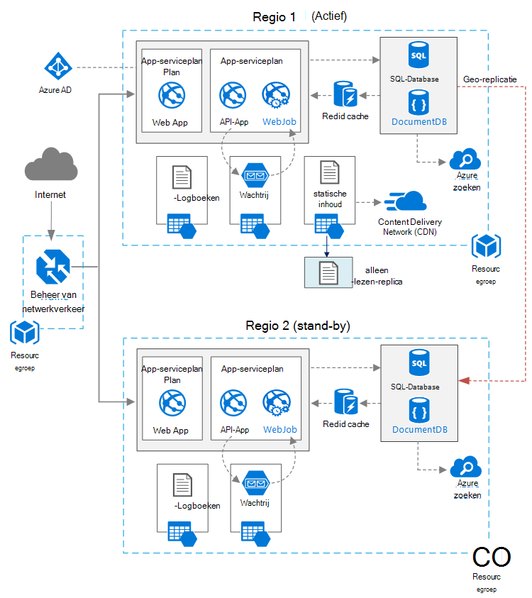

<properties
   pageTitle="Webtoepassing met hoge beschikbaarheid | Azure referentiearchitectuur | Microsoft Azure"
   description="Aanbevolen architectuur voor webtoepassing met hoge beschikbaarheid, uitgevoerd in Microsoft Azure."
   services="app-service,app-service\web,sql-database" 
   documentationCenter="na"
   authors="MikeWasson"
   manager="roshar"
   editor=""
   tags=""/>

<tags
   ms.service="guidance"
   ms.devlang="na"
   ms.topic="article"
   ms.tgt_pltfrm="na"
   ms.workload="na"
   ms.date="06/27/2016"
   ms.author="mwasson"/>

# <a name="azure-reference-architecture-web-application-with-high-availability"></a>Azure referentiearchitectuur: webtoepassing met hoge beschikbaarheid

[AZURE.INCLUDE [pnp-RA-branding](../../includes/guidance-pnp-header-include.md)]

In dit artikel wordt een aanbevolen architectuur voor een webtoepassing met hoge beschikbaarheid, uitgevoerd op Microsoft Azure. De architectuur is gebaseerd op [Azure referentiearchitectuur: verbeteren van de schaalbaarheid in een webtoepassing][guidance-web-apps-scalability].

## <a name="architecture-diagram"></a>Architectuurdiagram



Deze architectuur is gebaseerd op die in de [schaalbaarheid in een webtoepassing van][guidance-web-apps-scalability]. De belangrijkste verschillen zijn:

- **Primaire en secundaire gebieden**. Deze architectuur gebruikt twee regio's een hogere mate van beschikbaarheid. De toepassing wordt gedistribueerd naar alle regio's. Tijdens normale bewerkingen wordt netwerkverkeer doorgestuurd naar de primaire regio. Maar als dat niet beschikbaar is, verkeer wordt doorgestuurd naar de secundaire regio. Voor meer informatie over failover Zie [failover beheren](#managing-failover-and-failback).

- **Azure verkeer Manager**. [Verkeer Manager] [ traffic-manager] stuurt binnenkomende aanvragen naar de primaire regio. Als de toepassing uitvoert die regio niet beschikbaar is, wordt beheer van netwerkverkeer overgenomen door de secundaire regio. 

- **Geo-replicatie** van SQL-Database en DocumentDB.

## <a name="recommendations"></a>Aanbevelingen

### <a name="regional-pairing"></a>Regionale koppelen

Elke regio Azure is gekoppeld aan een andere regio binnen de dezelfde Geografie. Kies in het algemeen gebieden in het regionale paar (bijvoorbeeld Oost-VS 2 en Central US). De voordelen hiervan zijn:

- Als er een groot onderhoud, krijgt herstel van ten minste één regio van elk paar voorrang.
- Geplande Azure systeemupdates worden uitgerold naar gepaarde regio's opeenvolgend, om mogelijke uitvaltijd tot een minimum.
- In de meeste gevallen zich paren binnen de dezelfde Geografie, om te voldoen aan de hand van vestigingsplaats gegevens.

Zorg er wel voor beide regio's ondersteunen alle Azure services die nodig zijn voor uw toepassing. Zie [Services per regio][services-by-region]. Zie voor meer informatie over regionale paren [Business continuïteit en disaster recovery (BCDR): Azure gekoppeld regio's][regional-pairs].

### <a name="resource-groups"></a>Resourcegroepen

Rekening houden met de regio voor primaire, secundaire regio en verkeer Manager in aparte [bronnengroepen]te plaatsen[resource groups]. Hiermee kunt u het beheer van de middelen die worden ingezet voor elke regio als één collectie &mdash; u kunt ze afzonderlijk te implementeren, verwijderen van de installatie, enzovoort. 

### <a name="traffic-manager"></a>Beheer van netwerkverkeer

**Routering.** Beheer van verkeer ondersteunt verschillende [routeringsalgoritmen][tm-routing]. De in dit artikel beschreven scenario voor het bewerkingsplan wordt gebruikt _prioriteit_ (voorheen _failover_ routing). Met deze instelling wordt verzonden verkeer alle aanvragen op het gebied van de primaire tenzij het eindpunt voor dat gebied onbereikbaar wordt. Op dat moment overgenomen deze automatisch door de secundaire regio. Zie [methode configureren van failover-][tm-configure-failover].

**Sonde voor de gezondheid.** Verkeer wordt een sonde HTTP (of HTTPS) gebruikt voor het controleren van de beschikbaarheid van elk eindpunt. De sonde wordt verkeer Manager een test doorslaggevend voor storing worden overgenomen op de secundaire regio. Het werkt door het verzenden van een aanvraag naar een opgegeven URL-pad. Als er een niet-200 antwoord binnen een time-outperiode, mislukt de sonde. Na vier mislukte aanvragen, verkeer Manager markeert het eindpunt, zoals verslechterd en overgenomen door het andere eindpunt. Zie voor meer informatie [verkeer Manager eindpunt controle en failover][tm-monitoring].

Beste, een eindpunt van de gezondheid van sonde die de algehele gezondheid van de toepassing rapporteert maken en dit eindpunt voor de gezondheid sonde te gebruiken. Kritieke afhankelijkheden, zoals de App Service apps, Storage queue en SQL-Database te controleren of het eindpunt. De sonde kan anders een eindpunt 'gezonde' rapporteren als essentiële onderdelen van de toepassing daadwerkelijk lukt niet. 

Aan de andere kant, hoeft u de sonde gezondheid lagere prioriteit services controleren. Bijvoorbeeld, als een e-maildienst uitvalt, de toepassing kunt overschakelen naar een tweede provider of gewoon later verzenden e-mailberichten. De toepassing niet moet waarschijnlijk failover in die situatie. Zie voor meer informatie, [Gezondheid eindpunt Monitoring patroon][health-endpoint-monitoring-pattern].
  
### <a name="sql-database"></a>SQL-Database

[Actieve Geo-replicatie] gebruikt[ sql-replication] een secundair leesbaar maken in een andere regio. U kunt maximaal vier leesbaar secundaire servers hebben. Als uw primaire database mislukt, of gewoon moet worden verbroken, kunt u op een van de secundaire databases. Actieve Geo-replicatie kan worden geconfigureerd voor een database in een groep met elastische database.

### <a name="documentdb"></a>DocumentDB

DocumentDB ondersteunt geo-replicatie tussen de regio's. Één gebied is aangewezen als beschrijfbaar en de andere replica's alleen-lezen zijn. 

Als er een stroomstoring regionale, kunt u niet door het selecteren van een andere regio op het gebied van het schrijven. De DocumentDB client SDK worden automatisch verzonden schrijven aanvragen op het huidige gebied schrijven, zodat u niet hoeft bij te werken nadat failover is uitgevoerd de configuratie van de client. Zie voor meer informatie, [gegevens verdelen wereldwijd met DocumentDB][docdb-geo]. 

> [AZURE.NOTE] Alle replica's deel uitmaken van dezelfde bronnengroep.

### <a name="storage"></a>Opslag

Gebruiken voor opslag van Azure, [geo-redundante opslag leestoegang] [ ra-grs] (RA-GRS). Met RA GRS opslag, worden de gegevens gerepliceerd naar een secundaire regio. U hebt alleen-lezen toegang tot de gegevens in de secundaire regio, door middel van een afzonderlijke eindpunt. Als er een stroomstoring regionale of ramp, kan het team Azure opslag voor het uitvoeren van een geo-failover naar de secundaire regio bepalen. Er is geen klant actie vereist voor deze failover.

Voor de opslag van de wachtrij, een back-wachtrij te maken in de secundaire regio. Tijdens een overname, kan de app de back-wachtrij gebruiken totdat de primaire regio weer beschikbaar is. Op die manier de toepassing kan nog steeds nieuwe aanvragen verwerken. 

## <a name="availability-considerations"></a>Overwegingen met betrekking tot beschikbaarheid

Een architectuur met meerdere regio kan bieden hogere beschikbaarheid dan het implementeren van een bepaalde regio. Als er een stroomstoring regionale invloed heeft op het gebied van de primaire, kunt u failover uitvoeren naar de secundaire regio. Deze architectuur kan ook helpen als een afzonderlijke subsysteem van de toepassing mislukt.  
     
Er zijn diverse algemene benaderingen voor het bereiken van hoge beschikbaarheid in datacenters:      
- Actief/passief met hot stand-by. Verkeer wordt één regio, terwijl de andere wacht op stand-by. De toepassing wordt geïmplementeerd en uitgevoerd in de secundaire regio. U kan starten met een kleiner aantal exemplaar in het midden van de secundaire gegevensbron en vervolgens schaalt wanneer dat nodig is. 

- Actief/passief met koude stand-by. Het hetzelfde, maar een toepassing is niet gedistribueerd totdat die nodig zijn voor failover. Deze aanpak kost minder worden uitgevoerd, maar wordt over het algemeen meer storingstijd tijdens een storing. 

- Actief/actief. Beide regio's actief zijn en gelijkmatig verdeeld tussen hen. Als één gegevenscentrum niet beschikbaar is, is uit de queryrotatie gehaald. 

Dit artikel is gericht op actieve/passieve met hot stand-by met [Azure verkeer Manager] [ traffic-manager] route-verkeer naar de regio. 

### <a name="traffic-manager"></a>Beheer van netwerkverkeer

Beheer van verkeer wordt automatisch overgenomen als de primaire regio niet beschikbaar is. Bij het beheer van netwerkverkeer wordt overgenomen, is er een periode wanneer clients de toepassing, dit kan enkele minuten niet bereikbaar. Twee factoren zijn van invloed op de totale duur:

- De sonde gezondheid moet worden gedetecteerd dat het primaire gegevenscentrum niet bereikbaar is geworden.

- DNS-servers moeten de DNS-records in de cache voor het IP-adres, dat afhankelijk van de DNS-time-to-live (TTL is) bijwerken. De standaard-TTL is 300 seconden (5 minuten), maar u kunt deze waarde configureren wanneer u het verkeer Manager profiel maakt.

Zie voor meer informatie [Over het beheer van netwerkverkeer controleren][tm-monitoring]. 

Beheer van netwerkverkeer is een mogelijke fout in het systeem. Als de service mislukt, hebben clients geen toegang tot uw toepassing tijdens de uitvaltijd. Bekijk de [SERVICEOVEREENKOMST verkeer Manager][tm-sla], en bepalen of met behulp van beheer van verkeer alleen voldoet aan uw zakelijke vereisten voor hoge beschikbaarheid. Als dit niet het geval is, kunt u een andere oplossing voor het beheer van verkeer toe te voegen als een failback-bewerking. Als de Azure verkeer Manager-service niet, wijzigt u uw CNAME-records in DNS om te verwijzen naar het andere verkeer management-service. (Deze stap handmatig moet worden uitgevoerd en de toepassing niet beschikbaar totdat u de wijzigingen in DNS worden doorgegeven). 

### <a name="sql-database"></a>SQL-Database

De doelstelling van herstel punt (vrijgegeven Productieorder) en de verwachte hersteltijd (invoegen) voor SQL-Database zijn beschreven [hier][sql-rpo]. 

### <a name="storage"></a>Opslag

RA GRS opslag biedt duurzame opslag, maar het is belangrijk te begrijpen wat er kan gebeuren tijdens een stroomstoring: 

- Als u een opslag is uitgevallen, zal er een periode wanneer er geen schrijftoegang tot de gegevens. Toch kunt u lezen vanaf het secundaire eindpunt tijdens de onderbreking.

- Als een regionale stroomstoring of ramp heeft gevolgen voor de primaire locatie en de gegevens kunnen niet worden hersteld, kan de Azure Storage team voor het uitvoeren van een geo-failover naar de secundaire regio bepalen. 

- Gegevensreplicatie naar het secundaire regio wordt asynchroon uitgevoerd. Als een geo-failover wordt uitgevoerd, dus kunnen gegevens verloren gaan mogelijk, als de gegevens uit de primaire regio kan niet worden hersteld.

- Tijdelijke fouten, zoals een netwerkstoring activeert een failover opslag niet. Ontwerp uw toepassing veerkrachtig op fouten van voorbijgaande aard zijn. Mogelijke oplossingen:

    - Lezen van de secundaire.

    - Tijdelijk overschakelen naar een andere rekening van opslag voor nieuwe schrijfbewerkingen (bijvoorbeeld op berichten). 

    - Gegevens van de secundaire kopiëren naar een andere account voor opslag.

    - Verminderde functionaliteit bieden totdat het systeem niet meer terug.

Zie voor meer informatie [Wat te doen als een Azure opslag uitgevallen][storage-outage].

## <a name="managing-failover-and-failback"></a>Beheren, failover en failback

### <a name="traffic-manager"></a>Beheer van netwerkverkeer

Beheer van verkeer wordt automatisch overgenomen als de primaire regio niet beschikbaar is. Standaard zal ook automatisch mislukken terug, zodra de primaire regio weer beschikbaar is.

We raden echter aan handmatig failback uitvoeren in plaats van automatisch weer anders. Alvorens terug, controleert u of alle subsystemen voor toepassing in orde. Anders kunt u een situatie waarin de toepassing heen en weer tussen datacenters draait. 

Als u wilt voorkomen dat automatische failback, verlaagt u de prioriteit van de primaire regio handmatig na een failover-gebeurtenis. Stel dat de primaire regio prioriteit 1 is en de secundaire prioriteit 2. Nadat failover is uitgevoerd, zodanig dat de primaire regio prioriteit 3, om te voorkomen dat automatische failback. Wanneer u klaar om terug te schakelen bent, moet u de prioriteit teruggezet op 1.

De volgende opdrachten werken de prioriteit.

**PowerShell** 

```bat
$endpoint = Get-AzureRmTrafficManagerEndpoint -Name <endpoint> -ProfileName <profile> -ResourceGroupName <resource-group> -Type AzureEndpoints
$endpoint.Priority = 3
Set-AzureRmTrafficManagerEndpoint -TrafficManagerEndpoint $endpoint
```

Zie voor meer informatie, [Azure verkeer Manager-Cmdlets][tm-ps].

**Azure CLI**

```bat
azure network traffic-manager endpoint set --name <endpoint> --profile-name <profile> --resource-group <resource-group> --type AzureEndpoints --priority 3
```    

### <a name="sql-database"></a>SQL-Database

Als de primaire database mislukt, voert u een handmatige failover naar de secundaire database. Zie [herstellen van een Azure SQL-Database of een failover naar een secundair][sql-failover]. Totdat u failover, blijft de secundaire database alleen-lezen. 


<!-- links -->

[azure-sql-db]: https://azure.microsoft.com/en-us/documentation/services/sql-database/
[docdb-geo]: ../documentdb/documentdb-distribute-data-globally.md
[guidance-web-apps-scalability]: guidance-web-apps-scalability.md
[health-endpoint-monitoring-pattern]: https://msdn.microsoft.com/library/dn589789.aspx
[ra-grs]: ../storage/storage-redundancy.md#read-access-geo-redundant-storage
[regional-pairs]: ../best-practices-availability-paired-regions.md
[resource groups]: ../resource-group-overview.md
[services-by-region]: https://azure.microsoft.com/en-us/regions/#services
[sql-failover]: ../sql-database/sql-database-disaster-recovery.md
[sql-replication]: ../sql-database/sql-database-geo-replication-overview.md
[sql-rpo]: ../sql-database/sql-database-business-continuity.md#sql-database-business-continuity-features
[storage-outage]: ../storage/storage-disaster-recovery-guidance.md
[tm-configure-failover]: ../traffic-manager/traffic-manager-configure-failover-routing-method.md
[tm-monitoring]: ../traffic-manager/traffic-manager-monitoring.md
[tm-ps]: https://msdn.microsoft.com/en-us/library/mt125941.aspx
[tm-routing]: ../traffic-manager/traffic-manager-routing-methods.md
[tm-sla]: https://azure.microsoft.com/en-us/support/legal/sla/traffic-manager/v1_0/
[traffic-manager]: https://azure.microsoft.com/en-us/services/traffic-manager/
