<properties
    pageTitle="Hadoop clusters in HDInsight met de Azure portal beheren | Microsoft Azure"
    description="Informatie over het beheren van HDInsight Service. Maken van een cluster van HDInsight, de interactieve JavaScript-console openen en open de opdrachtenconsole Hadoop."
    services="hdinsight"
    documentationCenter=""
    tags="azure-portal"
    authors="mumian"
    manager="jhubbard"
    editor="cgronlun"/>

<tags
    ms.service="hdinsight"
    ms.workload="big-data"
    ms.tgt_pltfrm="na"
    ms.devlang="na"
    ms.topic="article"
    ms.date="09/14/2016"
    ms.author="jgao"/>

# Hadoop clusters in het HDInsight beheren via de portal voor Azure

[AZURE.INCLUDE [selector](../../includes/hdinsight-portal-management-selector.md)]

Met de [Azure portal][azure-portal], Hadoop-clusters maken in Azure, HDInsight, Hadoop gebruikerswachtwoord wijzigen en Remote Desktop Protocol (RDP) inschakelen, zodat u toegang hebt tot de opdrachtenconsole Hadoop op het cluster.

De informatie in dit artikel geldt alleen voor HDInsight venster gebaseerde clusters. Klik op de knop voor tabselectie hierboven voor meer informatie over het beheren van Linux gebaseerde clusters.

Klik op de knop voor tabselectie voor informatie over het maken van clusters van Hadoop in HDInsight met andere hulpprogramma's. 

**Vereisten**

Voordat u dit artikel hebt u het volgende:

- **Azure een abonnement**. Zie [Azure krijg gratis proefperiode](https://azure.microsoft.com/documentation/videos/get-azure-free-trial-for-testing-hadoop-in-hdinsight/).
- Een container Azure Blob-opslag **opslag azure rekening** - HDInsight van een cluster gebruikt als het standaardbestandssysteem. Zie voor meer informatie over hoe Azure Blob-opslag een naadloze ervaring met HDInsight clusters biedt [Met Azure Blob-opslag met HDInsight](hdinsight-hadoop-use-blob-storage.md). Zie voor meer informatie over het maken van een account Azure opslag [een opslag-Account maken](../storage/storage-create-storage-account.md).

##Open de Portal

1. Aanmelden bij [https://portal.azure.com](https://portal.azure.com).
2. Na het openen van het portaal kunt u:

    - Klik op **Nieuw** in het linkermenu een nieuw cluster maken:
    
        
    - Klik op **HDInsight Clusters** in het linkermenu.
    
        

    Als **HDInsight** in het linkermenu niet wordt weergegeven, klikt u op **Bladeren**. 

    

##Clusters maken

Zie [clusters maken HDInsight](hdinsight-provision-clusters.md#create-using-the-preview-portal)voor de instructies maken met behulp van de Portal.

HDInsight werkt met een brede Hadoop-onderdelen. Zie [welke versie van Hadoop is in Azure HDInsight](hdinsight-component-versioning.md)voor de lijst van de onderdelen die zijn geverifieerd en wordt ondersteund. U kunt de HDInsight aanpassen met behulp van een van de volgende opties:

- Scriptactie gebruiken voor het uitvoeren van aangepaste scripts die een cluster te wijzigen van de configuratie van het cluster of aangepaste onderdelen, zoals Giraph of Solr installeren kunnen aanpassen. Voor meer informatie Zie [cluster van HDInsight aanpassen met behulp van de actie Script](hdinsight-hadoop-customize-cluster.md).
- De parameters cluster aanpassing in de SDK voor .NET HDInsight of Azure PowerShell gebruiken tijdens het maken van het cluster. Deze wijzigingen in de configuratie vervolgens via de levensduur van het cluster, blijven behouden en worden niet beïnvloed door het cluster knooppunt reimages die Azure platform regelmatig voor onderhoud uitvoert. Zie voor meer informatie over het gebruik van de parameters cluster aanpassing [clusters HDInsight maken](hdinsight-provision-clusters.md).
- Sommige native Java-onderdelen, zoals Mahout en trapsgewijs, kunnen als JAR-bestanden op het cluster worden uitgevoerd. Deze JAR-bestanden kunnen gedistribueerd naar Azure Blob-opslag en ingediend bij HDInsight clusters via mechanismen van Hadoop project indienen. Voor meer informatie Zie [verzenden Hadoop projecten via programmacode](hdinsight-submit-hadoop-jobs-programmatically.md).

    >[AZURE.NOTE] Hebt u problemen met JAR-bestanden met clusters HDInsight implementeren of JAR-bestanden op HDInsight clusters aan te roepen, neem dan contact op met [Microsoft Support](https://azure.microsoft.com/support/options/).

    > Trapsgewijs wordt niet ondersteund door HDInsight en komt niet in aanmerking voor Microsoft Support. Zie voor een lijst met ondersteunde onderdelen, [Wat is er nieuw in de cluster-versies die door HDInsight?](hdinsight-component-versioning.md).

De installatie van aangepaste software die op het cluster met behulp van verbinding met extern bureaublad wordt niet ondersteund. Niet alle bestanden opslaan op de stations van het hoofd knooppunt als ze niet verloren als u nodig hebt om de clusters opnieuw te maken. U wordt aangeraden de bestanden opslaan op Azure Blob-opslag. BLOB-opslag is permanent.

##Een lijst en clusters weergeven

1. Aanmelden bij [https://portal.azure.com](https://portal.azure.com).
2. Klik op **HDInsight Clusters** in het linkermenu.
3. Klik op de naam van het cluster. Als de cluster-lijst te lang is, kunt u het filter boven aan de pagina.
4. Dubbelklik op een cluster uit de lijst wilt weergeven van de details.

    **Menu's en essentials**:

    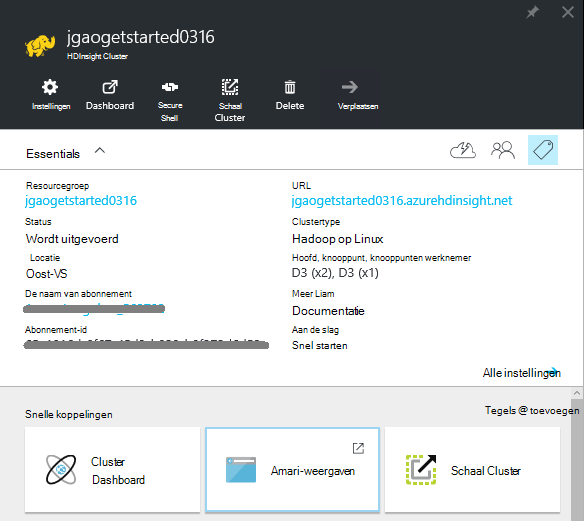
    
    - Als u wilt aanpassen in het menu, klik met de rechtermuisknop op het menu en klik vervolgens op **aanpassen**.
    - **Instellingen** en **Alle instellingen**: het blad van de **Instellingen** voor het cluster waarmee u toegang tot de gedetailleerde configuratiegegevens van het cluster weergegeven.
    - **Dashboard**, **Cluster Dashboard** en **URL: dit zijn alle manieren toegang krijgen tot het cluster dashboard, Ambari Web is voor Linux gebaseerde clusters. - **Secure Shell **: bevat de instructies voor de verbinding met het cluster via Secure Shell (SSH) verbinding.
    - **Cluster schaal**: Hiermee kunt u het aantal knooppunten van de werknemer voor dit cluster wijzigen.
    - **Verwijderen**: Hiermee verwijdert u het cluster.
    - **Quickstart ()**: hierin wordt informatie weergegeven die u aan de slag met HDInsight.
    - **Gebruikers ()**: Hiermee kunt u machtigingen instellen voor _beheer van portal_ van dit cluster voor andere gebruikers op uw abonnement Azure.
    
        > [AZURE.IMPORTANT] Dit _alleen_ van invloed op toegang en machtigingen voor dit cluster in Azure portal en heeft geen invloed op wie kan verbinding maken met of taken aan het cluster HDInsight.
    - **Codes ()**: Tags kunt u instellen van sleutel/waarde-paren voor het definiëren van een aangepaste taxonomie van de cloud-services. U kan bijvoorbeeld een sleutel met de naam __project__maken en een gemeenschappelijke waarde vervolgens gebruiken voor alle services die zijn gekoppeld aan een specifiek project.
    - **Ambari weergaven**: koppelingen naar de website Ambari.
    
    > [AZURE.IMPORTANT] U moet voor het beheren van de services van het cluster HDInsight Ambari Web of de API Ambari REST gebruiken. Zie voor meer informatie over het gebruik van Ambari, [clusters van HDInsight beheren met behulp van Ambari](hdinsight-hadoop-manage-ambari.md).

    **Gebruik**:
    
    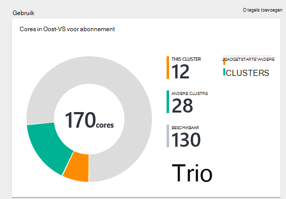
    
5. Klik op **Instellingen**.

    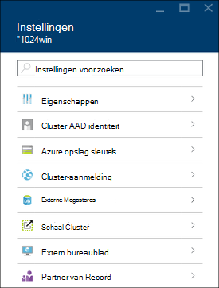

    - **Eigenschappen**: de eigenschappen van het cluster.
    - **Cluster AAD identiteit**: 
    - **Azure opslag sleutels**: de standaardaccount voor de opslag en de sleutel te bekijken. De opslag-account is de configuratie tijdens het maken van cluster.
    - **Cluster-aanmelding**: cluster HTTP gebruikersnaam en wachtwoord te wijzigen.
    - **Externe Metastores**: de metastores component en Oozie weergeven. De metastores kan alleen worden geconfigureerd tijdens het maken van het cluster.
    - **Cluster schaal**: stijging en daling van het aantal knooppunten in het servercluster werknemer.
    - **Extern bureaublad**: inschakelen en uitschakelen van extern bureaublad (RDP) toegang en de gebruikersnaam met RDP configureren.  De RDP-naam moet verschillen van de HTTP-gebruikersnaam.
    - **Partner van Record**:
    
    > [AZURE.NOTE] Dit is een algemene lijst van beschikbare instellingen; niet alle zijn aanwezig voor alle clustertypen.

6. Klik op **Eigenschappen**:

    De lijsten van de eigenschappen van het volgende:
    
    - **Hostnaam**: naam van het Cluster.
    - **De cluster-URL**.
    - **Status**: zijn afgebroken, geaccepteerd, ClusterStorageProvisioned, AzureVMConfiguration, HDInsightConfiguration, operationeel is, wordt uitgevoerd, fout, te verwijderen, verwijderd, time-out, DeleteQueued, DeleteTimedout, DeleteError, PatchQueued, CertRolloverQueued, ResizeQueued, ClusterCustomization
    - **Regio**: Azure locatie. Zie voor een lijst met ondersteunde Azure locaties, de vervolgkeuzelijst voor **de regio** op [HDInsight prijzen](https://azure.microsoft.com/pricing/details/hdinsight/).
    - **Gegevens gemaakt**.
    - **Besturingssysteem**: **Windows** of **Linux**.
    - **Type**: Hadoop, HBase, Storm, Wek. 
    - **Versie**. [HDInsight](hdinsight-component-versioning.md) versies
    - **Abonnement**: naam van abonnement.
    - **Abonnement-ID**.
    - De **primaire gegevensbron**. De Azure Blob storage-account gebruikt als het bestandssysteem standaard Hadoop.
    - **Werknemer knooppunten prijzen laag**.
    - **Hoofd knooppunt prijzen laag**.

##Verwijderen van clusters

Een cluster verwijderen verwijdert de standaardaccount voor opslag of opslag van gekoppelde accounts. U kunt het cluster opnieuw maken met dezelfde rekeningen voor de opslag en de metastores dezelfde.

1. Aanmelden bij de [Portal][azure-portal].
2. Klik op **Alles zoeken** in het menu links, klik op **HDInsight Clusters**, de naam van het cluster.
3. Klik in het bovenste menu op **verwijderen** en volg de instructies.

Zie ook [clusters onderbreken/afsluiten](#pauseshut-down-clusters).

##Schaal clusters
Het cluster functie schalen kunt u het aantal knooppunten van werknemer die wordt gebruikt door een cluster wordt uitgevoerd in Azure HDInsight zonder het cluster opnieuw maken.

>[AZURE.NOTE] Alleen clusters met 3.1.3 versie HDInsight of hoger worden ondersteund. Als u niet zeker van de versie van het cluster bent, kunt u de pagina eigenschappen controleren.  Zie de [lijst weergeven en de clusters](#list-and-show-clusters).

De gevolgen van het wijzigen van het aantal gegevensknooppunten voor elk cluster wordt ondersteund door HDInsight:

- Hadoop

    U kunt het aantal knooppunten in een cluster Hadoop zonder invloed op alle taken of in behandeling wordt uitgevoerd met werknemer naadloos verhogen. Nieuwe taken kunnen ook worden verzonden terwijl de bewerking uitgevoerd wordt. Storingen in een bewerking voor het schalen zodat het cluster altijd functioneel is blijft probleemloos verwerkt.

    Wanneer u een cluster Hadoop verkleind doordat er minder gegevens knooppunten, worden enkele van de services in het cluster opnieuw gestart. Hierdoor worden alle actieve en openstaande taken aan het einde van de schaal bewerking mislukt. U kunt de taken echter opnieuw indienen nadat de bewerking voltooid is.

- HBase

    U kunt naadloos toevoegen of verwijderen van knooppunten aan het cluster HBase terwijl deze wordt uitgevoerd. Regionale Servers in evenwicht zijn automatisch binnen enkele minuten om de schaal bewerking te voltooien. U kunt echter ook handmatig de regionale servers verdelen door in de headnode van het cluster en het uitvoeren van de volgende opdrachten vanaf een opdrachtprompt:

        >pushd %HBASE_HOME%\bin
        >hbase shell
        >balancer

    Zie voor meer informatie over het gebruik van de shell HBase]
- Storm

    U kunt naadloos toevoegen of gegevensknooppunten aan het cluster Storm verwijderen terwijl deze wordt uitgevoerd. Maar na een succesvolle afronding van de bewerking schalen, moet u opnieuw de topologie.

    Opnieuw kan worden uitgevoerd op twee manieren:

    * Storm web UI
    * Gereedschap opdrachtregelinterface (CLI)

    Raadpleeg de [Apache Storm-documentatie](http://storm.apache.org/documentation/Understanding-the-parallelism-of-a-Storm-topology.html) voor meer informatie.

    De webgebruikersinterface Storm is beschikbaar op de cluster HDInsight:

    

    Hier volgt een voorbeeld van het gebruik van de opdracht CLI opnieuw de topologie Storm uit te:

        ## Reconfigure the topology "mytopology" to use 5 worker processes,
        ## the spout "blue-spout" to use 3 executors, and
        ## the bolt "yellow-bolt" to use 10 executors

        $ storm rebalance mytopology -n 5 -e blue-spout=3 -e yellow-bolt=10

**Voor het schalen van clusters**

1. Aanmelden bij de [Portal][azure-portal].
2. Klik op **Alles zoeken** in het menu links, klik op **HDInsight Clusters**, de naam van het cluster.
3. Klik op **Instellingen** in het bovenste menu en klik op **Schaal Cluster**.
4. **Nummer van werknemer knooppunten**invoeren. De limiet voor het aantal clusterknooppunt varieert per Azure abonnementen. Neem contact op met voor facturering om de limiet te verhogen.  De kostengegevens wordt aangepast aan de wijzigingen in het aantal knooppunten.

    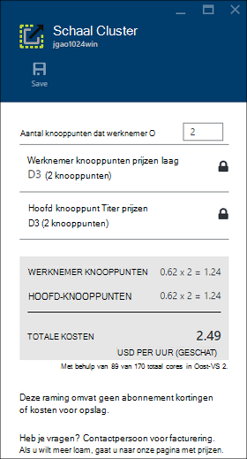

##Pause/afsluiten van clusters

De meeste taken Hadoop zijn batchtaken die slechts af en toe is uitgevoerd. Voor de meeste clusters van Hadoop zijn er grote perioden dat het cluster niet wordt gebruikt voor verwerking. Uw gegevens worden opgeslagen in Azure-opslag met HDInsight, zodat u een cluster veilig verwijderen kunt wanneer het niet in gebruik.
Er zijn ook in rekening gebracht voor een cluster HDInsight, zelfs wanneer deze niet in gebruik. Aangezien de kosten voor het cluster vele malen meer dan de kosten voor opslag zijn, is het zinvol economische clusters verwijderen wanneer ze niet in gebruik zijn.

Er zijn veel verschillende manieren kunt u tijdens het programmeren:

- Gebruiker Azure Data Factory. Zie [Azure HDInsight gekoppelde Service](../data-factory/data-factory-compute-linked-services.md) en [Transformeren en analyseren met Azure Data Factory](../data-factory/data-factory-data-transformation-activities.md) voor op-verzoek en zelf gedefinieerde HDInsight gekoppeld.
- Azure PowerShell gebruiken.  Zie [de vluchtgegevens vertraging analyseren](hdinsight-analyze-flight-delay-data.md).
- Azure CLI gebruiken. Zie [HDInsight beheren van clusters met Azure CLI](hdinsight-administer-use-command-line.md).
- HDInsight .NET SDK gebruiken. Zie [taken Hadoop indienen](hdinsight-submit-hadoop-jobs-programmatically.md).

Zie de [HDInsight prijzen](https://azure.microsoft.com/pricing/details/hdinsight/)voor de prijsinformatie. Zie voor informatie over het verwijderen van een cluster vanaf de Portal [verwijderen van clusters](#delete-clusters)

##Cluster-gebruikersnaam wijzigen

Een HDInsight-cluster kan twee gebruikersaccounts hebben. De gebruikersaccount HDInsight cluster wordt gemaakt tijdens het maken. Ook kunt u een account voor toegang tot het cluster via RDP RDP. Zie [Extern bureaublad inschakelen](#connect-to-hdinsight-clusters-by-using-rdp).

**De HDInsight cluster gebruikersnaam en het wachtwoord wijzigen**

1. Aanmelden bij de [Portal][azure-portal].
2. Klik op **Alles zoeken** in het menu links, klik op **HDInsight Clusters**, de naam van het cluster.
3. Klik op **Instellingen** in het bovenste menu en klik vervolgens op **Aanmelding Cluster**.
4. Als **Cluster aanmelding** is ingeschakeld, moet u Klik op **uitschakelen**en klik vervolgens op **inschakelen** voordat u de gebruikersnaam en het wachtwoord kunt wijzigen...
4. De **Aanmeldingsnaam van de Cluster** en/of het **Aanmeldingswachtwoord Cluster**wijzigen en klik vervolgens op **Opslaan**.

    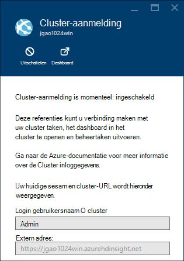

##Toegang verlenen/intrekken

HDInsight clusters hebben de volgende HTTP-webservices (al deze diensten hebben RESTful eindpunten):

- ODBC
- JDBC
- Ambari
- Oozie
- Templeton

Deze services worden standaard verleend om toegang te krijgen. U kunt intrekken/subsidie de toegang van de portal Azure.

>[AZURE.NOTE] Door de toegang verlenen/intrekken, stelt u de cluster-gebruikersnaam en wachtwoord.

**Voor HTTP-services webtoegang verlenen/intrekken**

1. Aanmelden bij de [Portal][azure-portal].
2. Klik op **Alles zoeken** in het menu links, klik op **HDInsight Clusters**, de naam van het cluster.
3. Klik op **Instellingen** in het bovenste menu en klik vervolgens op **Aanmelding Cluster**.
4. Als **Cluster aanmelding** is ingeschakeld, moet u Klik op **uitschakelen**en klik vervolgens op **inschakelen** voordat u de gebruikersnaam en het wachtwoord kunt wijzigen...
6. **Cluster Login gebruikersnaam** en **Wachtwoord voor Cluster-aanmelding**, voert u de gebruikersnaam en het wachtwoord (respectievelijk) voor het cluster.
7. Klik op **Opslaan**.

    

##De standaard opslag-account zoeken

Elk cluster HDInsight heeft een standaardaccount voor opslag. De standaardaccount voor de opslag en de sleutels voor een cluster wordt weergegeven onder **Instellingen voor**/**Eigenschappen**/**Azure opslag sleutels**. Zie de [lijst weergeven en de clusters](#list-and-show-clusters).

    
##Zoeken naar de resourcegroep 

In de modus Azure Resource Manager wordt elk cluster HDInsight gemaakt met een resourcegroep Azure. De Azure resourcegroep waartoe een cluster wordt weergegeven in:

- De cluster-lijst heeft een kolom **Resourcegroep** .
- **Essentieel** deel van het cluster.  

Zie de [lijst weergeven en de clusters](#list-and-show-clusters).
   
##Open de HDInsight Query console

De console HDInsight Query bevat de volgende functies:

- **Galerie aan de slag**: als u wilt gebruiken in de galerie, Zie [Informatie over Hadoop met behulp van de galerie Azure HDInsight Getting Started](hdinsight-learn-hadoop-use-sample-gallery.md).
- **Component Editor**: A GUI web-interface voor het verzenden van taken van de component.  Zie [component uitvoeren van query's met behulp van de Console van de Query](hdinsight-hadoop-use-hive-query-console.md).

    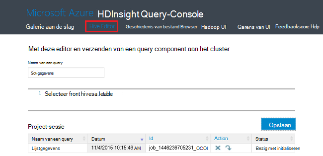

- **Geschiedenis**: Monitor Hadoop taken.  

    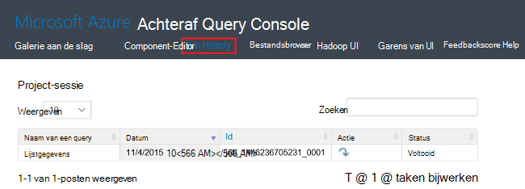

    Klik op **Naam van een Query** om de eigenschappen van taak, **Taak Query**, inclusief details weer te geven en ** uitvoer van de taak. U kunt zowel de query als de uitvoer ook downloaden op uw werkstation.

- **Bestandsbrowser**: bladeren door de standaardaccount voor opslag en de opslag van gekoppelde accounts.

    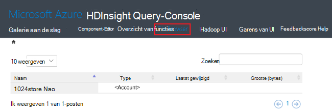

    Op het screenshot, de **<Account>** type geeft aan dat het item is een account Azure opslag.  Klik op de naam van de account om te bladeren in de bestanden.
    
- **Hadoop UI**.

    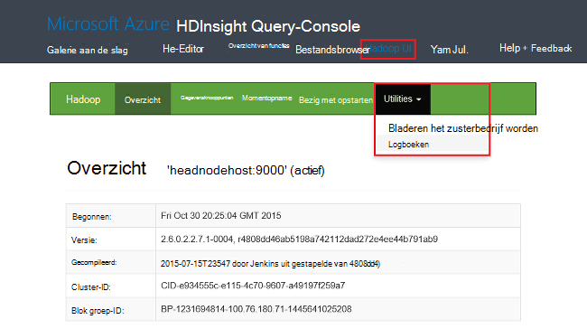
    
    Van **Hadoop UI*, door bestanden bladeren en controleren van Logboeken. 

- **Garens UI**.

    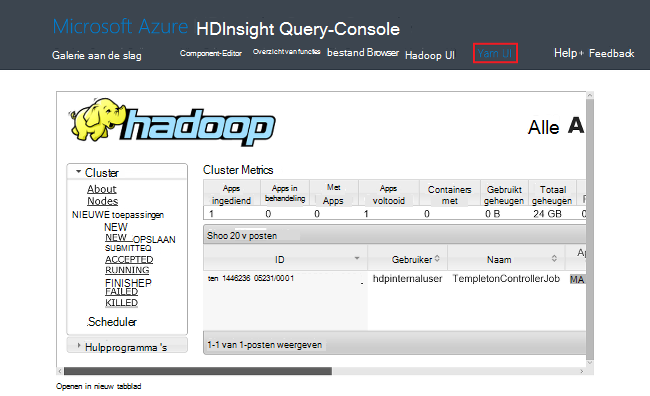

##Component-query's uitvoeren

Taken voor component uit de Portal wordt uitgevoerd, klikt u op **Editor component** in de console HDInsight Query. Zie [console openen HDInsight Query](#open-hdinsight-query-console).

##Taken van de monitor

Klik op **Geschiedenis** in de HDInsight Query console voor het controleren van de taken van de Portal. Zie [console openen HDInsight Query](#open-hdinsight-query-console).

##Door bestanden bladeren

Als u bestanden die zijn opgeslagen in de standaard opslag-account en de opslag van gekoppelde accounts, klikt u op **Bestandsbrowser** in de console HDInsight Query. Zie [console openen HDInsight Query](#open-hdinsight-query-console).

U kunt ook het hulpprogramma **het bestandssysteem** van de **Hadoop UI** in de console HDInsight.  Zie [console openen HDInsight Query](#open-hdinsight-query-console).

##Gebruik van het cluster beeldscherm

De sectie van het __Gebruik__ van de cluster HDInsight blade wordt informatie weergegeven over het aantal cores beschikbaar om uw abonnement voor gebruik met HDInsight, alsook het aantal cores aan dit cluster en hoe ze worden toegewezen voor de knooppunten binnen dit cluster toegewezen. Zie de [lijst weergeven en de clusters](#list-and-show-clusters).

> [AZURE.IMPORTANT] U moet voor het controleren van de services van het cluster HDInsight Ambari Web of de API Ambari REST gebruiken. Zie voor meer informatie over het gebruik van Ambari [HDInsight beheren van clusters met Ambari](hdinsight-hadoop-manage-ambari.md)

##Hadoop UI openen

Raadpleeg Logboeken controleren van het cluster en het bestandssysteem, klikt u op **Hadoop UI** in de console HDInsight Query. Zie [console openen HDInsight Query](#open-hdinsight-query-console).

##Garens UI openen

Gebruikersinterface van garens, klik op **Garens UI** in de console HDInsight Query. Zie [console openen HDInsight Query](#open-hdinsight-query-console).

##Verbinding maken met clusters via RDP

De referenties voor het cluster dat u hebt opgegeven bij het maken van geven toegang tot de services op het cluster, maar niet aan het cluster zelf via Extern bureaublad. U kunt toegang tot extern bureaublad inschakelen wanneer u een cluster inrichten of nadat een cluster wordt ingericht. Zie [cluster HDInsight maken](hdinsight-provision-clusters.md)voor de instructies over het inschakelen van extern bureaublad te maken.

**Extern bureaublad inschakelen**

1. Aanmelden bij de [Portal][azure-portal].
2. Klik op **Alles zoeken** in het menu links, klik op **HDInsight Clusters**, de naam van het cluster.
3. Klik op **Instellingen** in het bovenste menu en klik op **Extern bureaublad**.
4. Voer **Verloopt op** **Extern bureaublad-gebruikersnaam** en **Wachtwoord voor extern bureaublad**en klik vervolgens op **inschakelen**.

    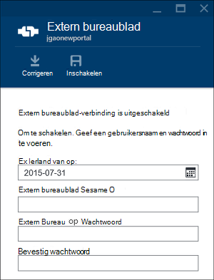

    De standaardwaarden voor verloopt op een week is.
> [AZURE.NOTE] U kunt ook de HDInsight .NET SDK extern bureaublad inschakelen in een cluster. De methode **EnableRdp** gebruiken voor het object HDInsight client op de volgende wijze: **client. EnableRdp (clusternaam, locatie, "rdpuser", "rdppassword", DateTime.Now.AddDays(6))**. Op dezelfde manier als u wilt uitschakelen van extern bureaublad op het cluster, kunt u **client. DisableRdp (clusternaam, locatie)**. Zie [HDInsight.NET SDK Reference](http://go.microsoft.com/fwlink/?LinkId=529017)voor meer informatie over deze methoden. Dit is alleen van toepassing op HDInsight clusters met Windows.

**Verbinding maken met een cluster via RDP**

1. Aanmelden bij de [Portal][azure-portal].
2. Klik op **Alles zoeken** in het menu links, klik op **HDInsight Clusters**, de naam van het cluster.
3. Klik op **Instellingen** in het bovenste menu en klik op **Extern bureaublad**.
4. Klik op **verbinding maken** en volg de instructies. Als de verbinding is uitgeschakeld, moet u deze eerst inschakelen. Zorg ervoor dat de extern bureaublad-gebruikersnaam en het wachtwoord.  U kunt de Cluster gebruikersreferenties niet gebruiken.

##Openen vanaf de opdrachtregel Hadoop

Verbinding maken met het cluster met behulp van extern bureaublad en het gebruik van de opdrachtregel Hadoop, moet u eerst ingeschakeld toegang tot het cluster extern bureaublad zoals beschreven in de vorige sectie.

**Een opdrachtregel Hadoop openen**

1. Verbinding maken met het cluster met behulp van extern bureaublad.
8. Dubbelklik op de **opdrachtregel Hadoop**op het bureaublad.

    ![HDI. HadoopCommandLine][image-hadoopcommandline]

    Zie voor meer informatie over opdrachten Hadoop [Hadoop opdrachten verwijzing](http://hadoop.apache.org/docs/current/hadoop-project-dist/hadoop-common/CommandsManual.html).

In de vorige afbeelding heeft de naam van de map het versienummer Hadoop is ingesloten. Het versienummer kan op basis van de versie van de Hadoop-onderdelen geïnstalleerd op het cluster gewijzigd. U kunt omgevingsvariabelen Hadoop om te verwijzen naar deze mappen. Bijvoorbeeld:

    cd %hadoop_home%
    cd %hive_home%
    cd %hbase_home%
    cd %pig_home%
    cd %sqoop_home%
    cd %hcatalog_home%
    
##Volgende stappen
In dit artikel, kunt u het maken van een HDInsight-cluster met behulp van de Portal en het openen van het opdrachtregelprogramma Hadoop hebt geleerd. Voor meer informatie, Zie de volgende artikelen:

* [HDInsight met Azure PowerShell beheren](hdinsight-administer-use-powershell.md)
* [HDInsight met Azure CLI beheren](hdinsight-administer-use-command-line.md)
* [HDInsight clusters maken](hdinsight-provision-clusters.md)
* [Hadoop taken programmatisch verzenden](hdinsight-submit-hadoop-jobs-programmatically.md)
* [Aan de slag met Azure HDInsight](hdinsight-hadoop-linux-tutorial-get-started.md)
* [Welke versie van Hadoop is in Azure HDInsight?](hdinsight-component-versioning.md)

[azure-portal]: https://portal.azure.com
[image-hadoopcommandline]: ./media/hdinsight-administer-use-management-portal/hdinsight-hadoop-command-line.png "Hadoop vanaf de opdrachtregel"
