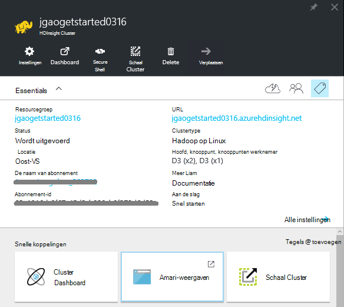
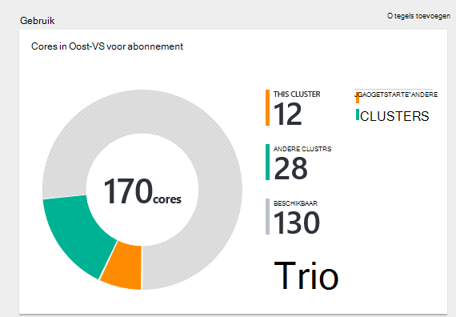
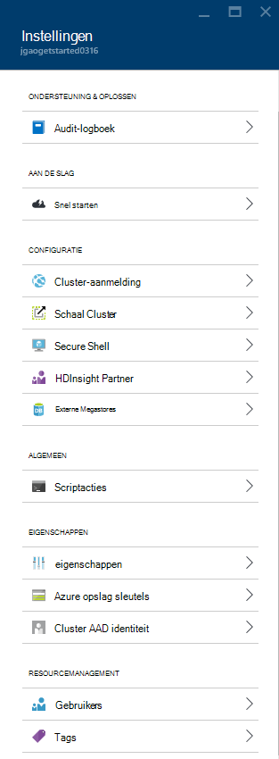
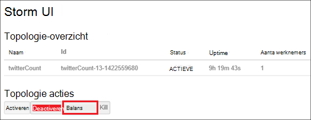
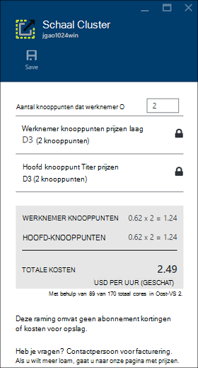
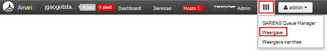

<properties
    pageTitle="Beheren Hadoop Linux gebaseerde clusters in HDInsight met Azure portal | Microsoft Azure"
    description="Informatie over het maken en beheren van HDInsight Linux gebaseerde clusters met behulp van de portal Azure."
    services="hdinsight"
    documentationCenter=""
    authors="mumian"
    manager="jhubbard"
    editor="cgronlun"
    tags="azure-portal"/>

<tags
    ms.service="hdinsight"
    ms.workload="big-data"
    ms.tgt_pltfrm="na"
    ms.devlang="na"
    ms.topic="article"
    ms.date="08/10/2016"
    ms.author="jgao"/>

#Hadoop clusters in het HDInsight beheren via de portal voor Azure

[AZURE.INCLUDE [selector](../../includes/hdinsight-portal-management-selector.md)]

Met de [Azure portal][azure-portal], kunt u op basis van Linux-clusters in Azure HDInsight beheren. Het tabblad selector gebruiken voor informatie over het maken van clusters van Hadoop in HDInsight met andere hulpprogramma's. 

**Vereisten**

Voordat u dit artikel hebt u het volgende:

- **Azure een abonnement**. Zie [Azure krijg gratis proefperiode](https://azure.microsoft.com/documentation/videos/get-azure-free-trial-for-testing-hadoop-in-hdinsight/).

##Open de Portal

1. Aanmelden bij [https://portal.azure.com](https://portal.azure.com).
2. Na het openen van het portaal kunt u:

    - Klik op **Nieuw** in het linkermenu een nieuw cluster maken:
    
        
    - Klik op **HDInsight Clusters** in het linkermenu om de bestaande clusters
    
        

        Als **HDInsight** in het linkermenu niet wordt weergegeven, klikt u op **Bladeren**en klik op **HDInsight-Clusters**.

        

##Clusters maken

[AZURE.INCLUDE [delete-cluster-warning](../../includes/hdinsight-delete-cluster-warning.md)]

HDInsight werkt met een brede Hadoop-onderdelen. Zie [welke versie van Hadoop is in Azure HDInsight](hdinsight-component-versioning.md)voor de lijst van de onderdelen die zijn geverifieerd en wordt ondersteund. Zie voor de algemene cluster maken informatie [maken Hadoop clusters in het HDInsight](hdinsight-hadoop-provision-linux-clusters.md). 

##Een lijst en clusters weergeven

1. Aanmelden bij [https://portal.azure.com](https://portal.azure.com).
2. Klik op **HDInsight Clusters** in het linkermenu om de bestaande clusters.
3. Klik op de naam van het cluster. Als de cluster-lijst te lang is, kunt u het filter boven aan de pagina.
4. Dubbelklik op een cluster uit de lijst wilt weergeven van de details.

    **Menu's en essentials**:

    
    
    - **Instellingen** en **Alle instellingen**: het blad van de **Instellingen** voor het cluster waarmee u toegang tot de gedetailleerde configuratiegegevens van het cluster weergegeven.
    - **Dashboard**, **Cluster Dashboard** en ** URL: dit zijn alle manieren toegang krijgen tot het cluster dashboard, Ambari Web is voor Linux gebaseerde clusters.
    - **Secure Shell**: bevat de instructies voor de verbinding met het cluster via Secure Shell (SSH) verbinding.
    - **Cluster schaal**: Hiermee kunt u het aantal knooppunten van de werknemer voor dit cluster wijzigen.
    - **Verwijderen**: Hiermee verwijdert u het cluster.
    - **Quickstart ()**: hierin wordt informatie weergegeven die u aan de slag met HDInsight.
    - **Gebruikers ()**: Hiermee kunt u machtigingen instellen voor _beheer van portal_ van dit cluster voor andere gebruikers op uw abonnement Azure.
    
        > [AZURE.IMPORTANT] Dit _alleen_ van invloed op toegang en machtigingen voor dit cluster in Azure portal en heeft geen invloed op wie kan verbinding maken met of taken aan het cluster HDInsight.
    - **Codes ()**: Tags kunt u instellen van sleutel/waarde-paren voor het definiëren van een aangepaste taxonomie van de cloud-services. U kan bijvoorbeeld een sleutel met de naam __project__maken en een gemeenschappelijke waarde vervolgens gebruiken voor alle services die zijn gekoppeld aan een specifiek project.
    - **Ambari weergaven**: koppelingen naar de website Ambari.
    
    > [AZURE.IMPORTANT] U moet voor het beheren van de services van het cluster HDInsight Ambari Web of de API Ambari REST gebruiken. Zie voor meer informatie over het gebruik van Ambari, [clusters van HDInsight beheren met behulp van Ambari](hdinsight-hadoop-manage-ambari.md).

    **Gebruik**:
    
    
    
5. Klik op **Instellingen**.

    

    - **Controlelogboeken**:
    - **Quick Start**: hierin wordt informatie weergegeven die u aan de slag met HDInsight.
    - **Cluster schaal**: stijging en daling van het aantal knooppunten in het servercluster werknemer.
    - **Secure Shell**: bevat de instructies voor de verbinding met het cluster via Secure Shell (SSH) verbinding.
    - **HDInsight Partner**: de huidige HDInsight Partner toevoegen of verwijderen.
    - **Externe Metastores**: de metastores component en Oozie weergeven. De metastores kan alleen worden geconfigureerd tijdens het maken van het cluster.
    - **Scriptacties**: scripts uitvoeren Bash op het cluster.
    - **Eigenschappen**: de eigenschappen van het cluster.
    - **Azure opslag sleutels**: de standaardaccount voor de opslag en de sleutel te bekijken. De opslag-account is de configuratie tijdens het maken van cluster.
    - **Cluster AAD identiteit**: 
    - **Gebruikers**: Hiermee kunt u machtigingen instellen voor _beheer van portal_ van dit cluster voor andere gebruikers op uw abonnement Azure.
    - **Tags**: Tags kunt u instellen van sleutel/waarde-paren voor het definiëren van een aangepaste taxonomie van de cloud-services. U kan bijvoorbeeld een sleutel met de naam __project__maken en een gemeenschappelijke waarde vervolgens gebruiken voor alle services die zijn gekoppeld aan een specifiek project.
    
    > [AZURE.NOTE] Dit is een algemene lijst van beschikbare instellingen; niet alle zijn aanwezig voor alle clustertypen.

6. Klik op **Eigenschappen**:

    De eigenschappen zijn:
    
    - **Hostnaam**: naam van het Cluster.
    - **De cluster-URL**.
    - **Status**: zijn afgebroken, geaccepteerd, ClusterStorageProvisioned, AzureVMConfiguration, HDInsightConfiguration, operationeel is, wordt uitgevoerd, fout, te verwijderen, verwijderd, time-out, DeleteQueued, DeleteTimedout, DeleteError, PatchQueued, CertRolloverQueued, ResizeQueued, ClusterCustomization
    - **Regio**: Azure locatie. Zie voor een lijst met ondersteunde Azure locaties, de vervolgkeuzelijst voor **de regio** op [HDInsight prijzen](https://azure.microsoft.com/pricing/details/hdinsight/).
    - **Gegevens gemaakt**.
    - **Besturingssysteem**: **Windows** of **Linux**.
    - **Type**: Hadoop, HBase, Storm, Wek. 
    - **Versie**. [HDInsight](hdinsight-component-versioning.md) versies
    - **Abonnement**: naam van abonnement.
    - **Abonnement-ID**.
    - **Standaardgegevensbron**: het bestandssysteem standaard cluster.
    - **Werknemer knooppunten prijzen laag**.
    - **Hoofd knooppunt prijzen laag**.

##Verwijderen van clusters

Een cluster verwijderen verwijdert de standaardaccount voor opslag of opslag van gekoppelde accounts. U kunt het cluster opnieuw maken met dezelfde rekeningen voor de opslag en de metastores dezelfde. Het verdient aanbeveling om een nieuwe standaard Blob-container gebruiken wanneer u het cluster opnieuw maken.

1. Aanmelden bij de [Portal][azure-portal].
2. Klik op **Alles zoeken** in het menu links, klik op **HDInsight Clusters**, de naam van het cluster.
3. Klik in het bovenste menu op **verwijderen** en volg de instructies.

Zie ook [clusters onderbreken/afsluiten](#pauseshut-down-clusters).

##Schaal clusters
Het cluster functie schalen kunt u het aantal knooppunten van werknemer die wordt gebruikt door een cluster wordt uitgevoerd in Azure HDInsight zonder het cluster opnieuw maken.

>[AZURE.NOTE] Alleen clusters met 3.1.3 versie HDInsight of hoger worden ondersteund. Als u niet zeker van de versie van het cluster bent, kunt u de pagina eigenschappen controleren.  Zie de [lijst weergeven en de clusters](#list-and-show-clusters).

De gevolgen van het wijzigen van het aantal gegevensknooppunten voor elk cluster wordt ondersteund door HDInsight:

- Hadoop

    U kunt het aantal knooppunten in een cluster Hadoop zonder invloed op alle taken of in behandeling wordt uitgevoerd met werknemer naadloos verhogen. Nieuwe taken kunnen ook worden verzonden terwijl de bewerking uitgevoerd wordt. Storingen in een bewerking voor het schalen zodat het cluster altijd functioneel is blijft probleemloos verwerkt.

    Wanneer u een cluster Hadoop verkleind doordat er minder gegevens knooppunten, worden enkele van de services in het cluster opnieuw gestart. Hierdoor worden alle actieve en openstaande taken aan het einde van de schaal bewerking mislukt. U kunt de taken echter opnieuw indienen nadat de bewerking voltooid is.

- HBase

    U kunt naadloos toevoegen of verwijderen van knooppunten aan het cluster HBase terwijl deze wordt uitgevoerd. Regionale Servers in evenwicht zijn automatisch binnen enkele minuten om de schaal bewerking te voltooien. U kunt echter ook handmatig de regionale servers verdelen door in de headnode van het cluster en het uitvoeren van de volgende opdrachten vanaf een opdrachtprompt:

        >pushd %HBASE_HOME%\bin
        >hbase shell
        >balancer

    Zie voor meer informatie over het gebruik van de shell HBase]
- Storm

    U kunt naadloos toevoegen of gegevensknooppunten aan het cluster Storm verwijderen terwijl deze wordt uitgevoerd. Maar na een succesvolle afronding van de bewerking schalen, moet u opnieuw de topologie.

    Opnieuw kan worden uitgevoerd op twee manieren:

    * Storm web UI
    * Gereedschap opdrachtregelinterface (CLI)

    Raadpleeg de [Apache Storm-documentatie](http://storm.apache.org/documentation/Understanding-the-parallelism-of-a-Storm-topology.html) voor meer informatie.

    De webgebruikersinterface Storm is beschikbaar op de cluster HDInsight:

    

    Hier volgt een voorbeeld van het gebruik van de opdracht CLI opnieuw de topologie Storm uit te:

        ## Reconfigure the topology "mytopology" to use 5 worker processes,
        ## the spout "blue-spout" to use 3 executors, and
        ## the bolt "yellow-bolt" to use 10 executors

        $ storm rebalance mytopology -n 5 -e blue-spout=3 -e yellow-bolt=10

**Voor het schalen van clusters**

1. Aanmelden bij de [Portal][azure-portal].
2. Klik op **Alles zoeken** in het menu links, klik op **HDInsight Clusters**, de naam van het cluster.
3. Klik op **Instellingen** in het bovenste menu en klik op **Schaal Cluster**.
4. **Nummer van werknemer knooppunten**invoeren. De limiet voor het aantal clusterknooppunt varieert per Azure abonnementen. Neem contact op met voor facturering om de limiet te verhogen.  De kostengegevens wordt aangepast aan de wijzigingen in het aantal knooppunten.

    

##Pause/afsluiten van clusters

De meeste taken Hadoop zijn batchtaken die slechts af en toe is uitgevoerd. Voor de meeste clusters van Hadoop zijn er grote perioden dat het cluster niet wordt gebruikt voor verwerking. Uw gegevens worden opgeslagen in Azure-opslag met HDInsight, zodat u een cluster veilig verwijderen kunt wanneer het niet in gebruik.
Er zijn ook in rekening gebracht voor een cluster HDInsight, zelfs wanneer deze niet in gebruik. Aangezien de kosten voor het cluster vele malen meer dan de kosten voor opslag zijn, is het zinvol economische clusters verwijderen wanneer ze niet in gebruik zijn.

Er zijn veel verschillende manieren kunt u tijdens het programmeren:

- Gebruiker Azure Data Factory. Zie [maken op afroep Hadoop Linux gebaseerde clusters in Azure Data Factory met HDInsight](hdinsight-hadoop-create-linux-clusters-adf.md) voor het maken van diensten op aanvraag-HDInsight is gekoppeld.
- Azure PowerShell gebruiken.  Zie [de vluchtgegevens vertraging analyseren](hdinsight-analyze-flight-delay-data.md).
- Azure CLI gebruiken. Zie [HDInsight beheren van clusters met Azure CLI](hdinsight-administer-use-command-line.md).
- HDInsight .NET SDK gebruiken. Zie [taken Hadoop indienen](hdinsight-submit-hadoop-jobs-programmatically.md).

Zie de [HDInsight prijzen](https://azure.microsoft.com/pricing/details/hdinsight/)voor de prijsinformatie. Zie voor informatie over het verwijderen van een cluster vanaf de Portal [verwijderen van clusters](#delete-clusters)

##Wachtwoorden wijzigen

Een HDInsight-cluster kan twee gebruikersaccounts hebben. De HDInsight van gebruikersaccount (ook cluster HTTP-gebruikersaccount) en de SSH-gebruikersaccount worden gemaakt tijdens het maken. U kunt de Ambari web UI de cluster account gebruikersnaam en wachtwoord scriptacties wijzigen van de SSH-gebruikersaccount wijzigen

###Het wachtwoord van de cluster wijzigen

De Ambari Web interface kunt u het wachtwoord van de Cluster worden gewijzigd. Ambari aangemeld, moet u het bestaande cluster gebruikersnaam en wachtwoord.

> [AZURE.NOTE] Als u het wachtwoord van de cluster-gebruikersaccount (admin) wijzigt, hierdoor script acties uitgevoerd tegen dit cluster worden uitgevoerd. Als er geen vastgelegde scriptacties die werknemer doelknooppunten, mislukken deze wanneer u knooppunten aan het cluster via het formaat van de bewerkingen toevoegen. Zie voor meer informatie over scriptacties [aanpassen HDInsight clusters met scriptacties](hdinsight-hadoop-customize-cluster-linux.md).

1. Aanmelden bij de on line Ambari gebruikersinterface met behulp van de referenties van de gebruiker HDInsight cluster. De standaardgebruikersnaam is **admin**. De URL is **https://&lt;HDInsight Clusternaam > azurehdinsight.net**.
2. **Admin** in het bovenste menu op en klik vervolgens op "Ambari beheren". 
3. Klik op **gebruikers**in het linkermenu.
4. Klik op de **beheerder**.
5. Klik op **wachtwoord wijzigen**.

Ambari wijzigt vervolgens het wachtwoord op alle knooppunten in het cluster.

###De gebruiker SSH wachtwoord wijzigen

1. Met behulp van een teksteditor de volgende opslaan als een bestand met de naam __changepassword.sh__.

    > [AZURE.IMPORTANT] Hebt u een editor die LF als het einde van de regel gebruikt. Als de editor CRLF gebruikt, vervolgens werkt het script niet.
    
        #! /bin/bash
        USER=$1
        PASS=$2

        usermod --password $(echo $PASS | openssl passwd -1 -stdin) $USER

2. Upload het bestand naar een locatie die toegankelijk is vanuit een HDInsight met een HTTP- of HTTPS-adres. Bijvoorbeeld een openbaar bestand opslaan zoals OneDrive of Azure Blob-opslag. De URI (http- of HTTPS-adres,) opslaan in het bestand, als dit nodig is in de volgende stap.

3. Selecteer het cluster HDInsight en selecteer __alle instellingen__vanuit de portal Azure. Selecteer in de blade __Instellingen__ __Scriptacties__.

4. Selecteer het blad __Scriptacties__ __Nieuwe indienen__. Voer de volgende gegevens in het blad van __de actie script indienen__ .

  	| Veld | Waarde |
  	| ----- | ----- |
  	| Naam | Ssh wachtwoord wijzigen |
  	| Bash script URI | De URI naar het bestand changepassword.sh |
  	| Knooppunten (hoofd, werknemer, Nimbus, Supervisor, Zookeeper, enz.) | ✓ voor alle knooppunten weergegeven |
  	| Parameters | Voer de naam van de gebruiker SSH en vervolgens het nieuwe wachtwoord. Er moet één spatie tussen de gebruikersnaam en het wachtwoord.
  	| Deze scriptactie aanhouden... | Laat dit veld uitgeschakeld.

5. Selecteer __maken__ om het script te passen. Zodra het script is voltooid, kunt u verbinding maken met het cluster via SSH met het nieuwe wachtwoord zal zijn.

##Toegang verlenen/intrekken

HDInsight clusters hebben de volgende HTTP-webservices (al deze diensten hebben RESTful eindpunten):

- ODBC
- JDBC
- Ambari
- Oozie
- Templeton

Deze services worden standaard verleend om toegang te krijgen. U kunt intrekken/subsidie de toegang met behulp van [De CLI Azure](hdinsight-administer-use-command-line.md#enabledisable-http-access-for-a-cluster) en [Azure PowerShell](hdinsight-administer-use-powershell.md#grantrevoke-access).

##De abonnement-ID zoeken

**Uw Azure abonnement-id's zoeken**

1. Aanmelden bij de [Portal][azure-portal].
2. Klik op **Alles zoeken** in het menu links en klik op **abonnementen**. Elk abonnement een naam heeft en een ID.

Elk cluster is gebonden aan een Azure-abonnement. De abonnement-ID wordt weergegeven op het cluster **essentiële** naast elkaar. Zie de [lijst weergeven en de clusters](#list-and-show-clusters).

##Zoeken naar de resourcegroep 

In de modus ARM wordt elk cluster HDInsight gemaakt met een resourcegroep Azure. De Azure resourcegroep waartoe een cluster wordt weergegeven in:

- De cluster-lijst heeft een kolom **Resourcegroep** .
- **Essentieel** deel van het cluster.  

Zie de [lijst weergeven en de clusters](#list-and-show-clusters).

##De standaard opslag-account zoeken

Elk cluster HDInsight heeft een standaardaccount voor opslag. De standaardaccount voor de opslag en de sleutels voor een cluster wordt weergegeven onder **Instellingen voor**/**Eigenschappen**/**Azure opslag sleutels**. Zie de [lijst weergeven en de clusters](#list-and-show-clusters).

##Component-query's uitvoeren

U component taak rechtstreeks vanuit de portal Azure kan niet worden uitgevoerd, maar u kunt de component-weergave op de Ambari Web UI.

**Voor het uitvoeren van de component query's Ambari component weergeven**

1. Aanmelden bij de on line Ambari gebruikersinterface met behulp van de referenties van de gebruiker HDInsight cluster. Het defaut gebruikersnaam is **admin**. De URL is **https://&lt;HDInsight Clusternaam > azurehdinsight.net**.
2. Open component weergeven zoals in de volgende schermafdruk:  

    
3. Klik op **Query** in het bovenste menu.
4. Een component query invoeren in **Query Editor**en klik vervolgens op **uitvoeren**.

##Taken van de monitor

Zie [clusters met behulp van de gebruikersinterface voor het Ambari Web HDInsight beheren](hdinsight-hadoop-manage-ambari.md#monitoring).

##Door bestanden bladeren

De Azure portal kunt u de inhoud van de standaardcontainer bladeren.

1. Aanmelden bij [https://portal.azure.com](https://portal.azure.com).
2. Klik op **HDInsight Clusters** in het linkermenu om de bestaande clusters.
3. Klik op de naam van het cluster. Als de cluster-lijst te lang is, kunt u het filter boven aan de pagina.
4. Klik op **Instellingen**.
5. Blade **Instellingen** , klik op **Azure opslag sleutels**.
6. Klik op de naam van de standaard opslag.
7. Klik op de tegel **BLOB's** .
8. Klik op de naam van de container.

##Gebruik van het cluster beeldscherm

De sectie van het __Gebruik__ van de cluster HDInsight blade wordt informatie weergegeven over het aantal cores beschikbaar om uw abonnement voor gebruik met HDInsight, alsook het aantal cores aan dit cluster en hoe ze worden toegewezen voor de knooppunten binnen dit cluster toegewezen. Zie de [lijst weergeven en de clusters](#list-and-show-clusters).

> [AZURE.IMPORTANT] U moet voor het controleren van de services van het cluster HDInsight Ambari Web of de API Ambari REST gebruiken. Zie voor meer informatie over het gebruik van Ambari [HDInsight beheren van clusters met Ambari](hdinsight-hadoop-manage-ambari.md)

##Verbinding maken met een cluster

Zie [component met Hadoop in HDInsight met SSH gebruiken](hdinsight-hadoop-use-hive-ssh.md#ssh).
    
##Volgende stappen
In dit artikel, kunt u het maken van een HDInsight-cluster met behulp van de Portal en het openen van het opdrachtregelprogramma Hadoop hebt geleerd. Voor meer informatie, Zie de volgende artikelen:

* [HDInsight met Azure PowerShell beheren](hdinsight-administer-use-powershell.md)
* [HDInsight met Azure CLI beheren](hdinsight-administer-use-command-line.md)
* [HDInsight clusters maken](hdinsight-provision-clusters.md)
* [Gebruik de component in HDInsight](hdinsight-use-hive.md)
* [Varken in HDInsight gebruiken](hdinsight-use-pig.md)
* [Sqoop in HDInsight gebruiken](hdinsight-use-sqoop.md)
* [Aan de slag met Azure HDInsight](hdinsight-hadoop-linux-tutorial-get-started.md)
* [Welke versie van Hadoop is in Azure HDInsight?](hdinsight-component-versioning.md)

[azure-portal]: https://portal.azure.com
[image-hadoopcommandline]: ./media/hdinsight-administer-use-portal-linux/hdinsight-hadoop-command-line.png "Hadoop vanaf de opdrachtregel"
