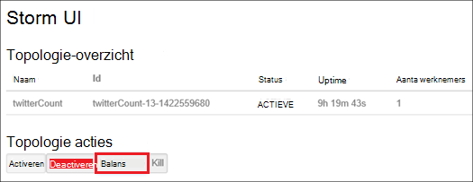

<properties
    pageTitle="Hadoop clusters in HDInsight met PowerShell beheren | Microsoft Azure"
    description="Informatie over de beheertaken uitvoeren voor clusters Hadoop in HDInsight met Azure PowerShell."
    services="hdinsight"
    editor="cgronlun"
    manager="jhubbard"
    tags="azure-portal"
    authors="mumian"
    documentationCenter=""/>

<tags
    ms.service="hdinsight"
    ms.workload="big-data"
    ms.tgt_pltfrm="na"
    ms.devlang="na"
    ms.topic="article"
    ms.date="08/10/2016"
    ms.author="jgao"/>

# Hadoop clusters in HDInsight met Azure PowerShell beheren

[AZURE.INCLUDE [selector](../../includes/hdinsight-portal-management-selector.md)]

Azure PowerShell is een krachtige scriptomgeving kunt u de implementatie en het beheer van uw werkbelasting in Azure te automatiseren. In dit artikel leert u hoe beheren Hadoop clusters in Azure HDInsight met een lokale console Azure PowerShell met behulp van Windows PowerShell. Zie voor een overzicht van de HDInsight PowerShell-cmdlets, [HDInsight cmdlet referentie][hdinsight-powershell-reference].

**Vereisten**

Voordat u dit artikel hebt u het volgende:

- **Azure een abonnement**. Zie [Azure krijg gratis proefperiode](https://azure.microsoft.com/documentation/videos/get-azure-free-trial-for-testing-hadoop-in-hdinsight/).

##Azure PowerShell installeren

[AZURE.INCLUDE [upgrade-powershell](../../includes/hdinsight-use-latest-powershell.md)]

Als u hebt geïnstalleerd dat Azure PowerShell versie 0.9 x, moet u deze verwijderen voordat u een nieuwere versie installeert.

De versie van het geïnstalleerde PowerShell controleren:

    Get-Module *azure*
    
Uitvoeren om de oudere versie verwijderen, programma's en onderdelen in het Configuratiescherm. 

##Clusters maken

Zie [maken van Linux gebaseerde clusters in HDInsight met Azure PowerShell](hdinsight-hadoop-create-linux-clusters-azure-powershell.md)

##Lijst met clusters
Gebruik de volgende opdracht om alle clusters in het huidige abonnement:

    Get-AzureRmHDInsightCluster

##Cluster weergeven

Gebruik de volgende opdracht als u details wilt weergeven van een specifiek cluster in het huidige abonnement:

    Get-AzureRmHDInsightCluster -ClusterName <Cluster Name>

##Verwijderen van clusters

Gebruik de volgende opdracht om een cluster te verwijderen:

    Remove-AzureRmHDInsightCluster -ClusterName <Cluster Name>

U kunt ook een cluster verwijderen door het verwijderen van de resourcegroep met het cluster. Let op: Hiermee verwijdert u alle bronnen in de groep met inbegrip van de standaardaccount voor opslag.

    Remove-AzureRmResourceGroup -Name <Resource Group Name>
            
##Schaal clusters
Het cluster functie schalen kunt u het aantal knooppunten van werknemer die wordt gebruikt door een cluster wordt uitgevoerd in Azure HDInsight zonder het cluster opnieuw maken.

>[AZURE.NOTE] Alleen clusters met 3.1.3 versie HDInsight of hoger worden ondersteund. Als u niet zeker van de versie van het cluster bent, kunt u de pagina eigenschappen controleren.  Zie de [lijst weergeven en de clusters](hdinsight-administer-use-portal-linux.md#list-and-show-clusters).

De gevolgen van het wijzigen van het aantal gegevensknooppunten voor elk cluster wordt ondersteund door HDInsight:

- Hadoop

    U kunt het aantal knooppunten in een cluster Hadoop zonder invloed op alle taken of in behandeling wordt uitgevoerd met werknemer naadloos verhogen. Nieuwe taken kunnen ook worden verzonden terwijl de bewerking uitgevoerd wordt. Storingen in een bewerking voor het schalen zodat het cluster altijd functioneel is blijft probleemloos verwerkt.

    Wanneer u een cluster Hadoop verkleind doordat er minder gegevens knooppunten, worden enkele van de services in het cluster opnieuw gestart. Hierdoor worden alle actieve en openstaande taken aan het einde van de schaal bewerking mislukt. U kunt de taken echter opnieuw indienen nadat de bewerking voltooid is.

- HBase

    U kunt naadloos toevoegen of verwijderen van knooppunten aan het cluster HBase terwijl deze wordt uitgevoerd. Regionale Servers in evenwicht zijn automatisch binnen enkele minuten om de schaal bewerking te voltooien. U kunt echter ook handmatig de regionale servers verdelen door aanmelden bij de headnode van het cluster en de volgende opdrachten uitvoeren vanaf een opdrachtprompt:

        >pushd %HBASE_HOME%\bin
        >hbase shell
        >balancer

- Storm

    U kunt naadloos toevoegen of gegevensknooppunten aan het cluster Storm verwijderen terwijl deze wordt uitgevoerd. Maar na een succesvolle afronding van de bewerking schalen, moet u opnieuw de topologie.

    Opnieuw kan worden uitgevoerd op twee manieren:

    * Storm web UI
    * Gereedschap opdrachtregelinterface (CLI)

    Raadpleeg de [Apache Storm-documentatie](http://storm.apache.org/documentation/Understanding-the-parallelism-of-a-Storm-topology.html) voor meer informatie.

    De webgebruikersinterface Storm is beschikbaar op de cluster HDInsight:

    

    Hier volgt een voorbeeld van het gebruik van de opdracht CLI opnieuw de topologie Storm uit te:

        ## Reconfigure the topology "mytopology" to use 5 worker processes,
        ## the spout "blue-spout" to use 3 executors, and
        ## the bolt "yellow-bolt" to use 10 executors

        $ storm rebalance mytopology -n 5 -e blue-spout=3 -e yellow-bolt=10

Om de grootte van de cluster Hadoop met Azure PowerShell, moet u de volgende opdracht uitvoeren vanaf een clientcomputer:

    Set-AzureRmHDInsightClusterSize -ClusterName <Cluster Name> -TargetInstanceCount <NewSize>
    

##Toegang verlenen/intrekken

HDInsight clusters hebben de volgende HTTP-webservices (al deze diensten hebben RESTful eindpunten):

- ODBC
- JDBC
- Ambari
- Oozie
- Templeton

Deze services worden standaard verleend om toegang te krijgen. U kunt intrekken/subsidie de toegang. Intrekken:

    Revoke-AzureRmHDInsightHttpServicesAccess -ClusterName <Cluster Name>

Verlenen:

    $clusterName = "<HDInsight Cluster Name>"

    # Credential option 1
    $hadoopUserName = "admin"
    $hadoopUserPassword = "<Enter the Password>"
    $hadoopUserPW = ConvertTo-SecureString -String $hadoopUserPassword -AsPlainText -Force
    $credential = New-Object System.Management.Automation.PSCredential($hadoopUserName,$hadoopUserPW)

    # Credential option 2
    #$credential = Get-Credential -Message "Enter the HTTP username and password:" -UserName "admin"
    
    Grant-AzureRmHDInsightHttpServicesAccess -ClusterName $clusterName -HttpCredential $credential

>[AZURE.NOTE] Door de toegang verlenen/intrekken, stelt u de cluster-gebruikersnaam en wachtwoord.

Dit kan ook worden gedaan via de Portal. [HDInsight beheren met behulp van de portal Azure]Zie[hdinsight-admin-portal].

##HTTP-referenties van de gebruiker bijwerken

Het is dezelfde procedure als [toegang verlenen/intrekken HTTP](#grant/revoke-access). Als het cluster is de HTTP-toegang is verleend, moet u eerst het intrekken.  En vervolgens toegang met nieuwe HTTP-gebruikersreferenties.

##De standaard opslag-account zoeken

De volgende Powershell script laat zien hoe u de naam van de standaard opslag en de sleutel standaard opslag-account voor een cluster.

    $clusterName = "<HDInsight Cluster Name>"
    
    $cluster = Get-AzureRmHDInsightCluster -ClusterName $clusterName
    $resourceGroupName = $cluster.ResourceGroup
    $defaultStorageAccountName = ($cluster.DefaultStorageAccount).Replace(".blob.core.windows.net", "")
    $defaultBlobContainerName = $cluster.DefaultStorageContainer
    $defaultStorageAccountKey = (Get-AzureRmStorageAccountKey -ResourceGroupName $resourceGroupName -Name $defaultStorageAccountName)[0].Value
    $defaultStorageAccountContext = New-AzureStorageContext -StorageAccountName $defaultStorageAccountName -StorageAccountKey $defaultStorageAccountKey 

##Zoeken naar de resourcegroep

In de modus Resource Manager hoort elk cluster HDInsight bij een Azure resourcegroep.  De resourcegroep zoeken:

    $clusterName = "<HDInsight Cluster Name>"
    
    $cluster = Get-AzureRmHDInsightCluster -ClusterName $clusterName
    $resourceGroupName = $cluster.ResourceGroup

##Taken verzenden

**MapReduce-taken**

Zie [voorbeelden van Hadoop MapReduce uitvoeren in Windows-gebaseerde HDInsight](hdinsight-run-samples.md).

**Taken van de component** 

Zie [component uitvoeren van query's met PowerShell](hdinsight-hadoop-use-hive-powershell.md).

**Varken taken**

Zie [varkens voeren taken met PowerShell](hdinsight-hadoop-use-pig-powershell.md).

**Sqoop taken**

Zie [Sqoop voor gebruik met HDInsight](hdinsight-use-sqoop.md).

**Oozie taken**

Zie [Oozie voor gebruik met Hadoop definiëren en uitvoeren van een workflow in HDInsight](hdinsight-use-oozie.md).

##Gegevens uploaden naar Azure Blob-opslag
Zie het [uploaden van gegevens naar HDInsight][hdinsight-upload-data].

## Zie ook
* [HDInsight-cmdlet documentatie][hdinsight-powershell-reference]
* [HDInsight beheren via de portal voor Azure][hdinsight-admin-portal]
* [Beheren met behulp van een opdrachtregel-interface HDInsight][hdinsight-admin-cli]
* [HDInsight clusters maken][hdinsight-provision]
* [Gegevens uploaden naar HDInsight][hdinsight-upload-data]
* [Hadoop taken programmatisch verzenden][hdinsight-submit-jobs]
* [Aan de slag met Azure HDInsight][hdinsight-get-started]

[azure-purchase-options]: http://azure.microsoft.com/pricing/purchase-options/
[azure-member-offers]: http://azure.microsoft.com/pricing/member-offers/
[azure-free-trial]: http://azure.microsoft.com/pricing/free-trial/

[hdinsight-get-started]: hdinsight-hadoop-linux-tutorial-get-started.md
[hdinsight-provision]: hdinsight-provision-clusters.md
[hdinsight-provision-custom-options]: hdinsight-provision-clusters.md#configuration
[hdinsight-submit-jobs]: hdinsight-submit-hadoop-jobs-programmatically.md

[hdinsight-admin-cli]: hdinsight-administer-use-command-line.md
[hdinsight-admin-portal]: hdinsight-administer-use-management-portal.md
[hdinsight-storage]: hdinsight-hadoop-use-blob-storage.md
[hdinsight-use-hive]: hdinsight-use-hive.md
[hdinsight-use-mapreduce]: hdinsight-use-mapreduce.md
[hdinsight-upload-data]: hdinsight-upload-data.md
[hdinsight-flight]: hdinsight-analyze-flight-delay-data.md

[hdinsight-powershell-reference]: https://msdn.microsoft.com/library/dn858087.aspx

[powershell-install-configure]: powershell-install-configure.md

[image-hdi-ps-provision]: ./media/hdinsight-administer-use-powershell/HDI.PS.Provision.png
