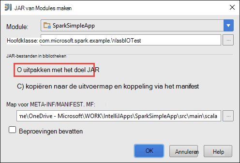
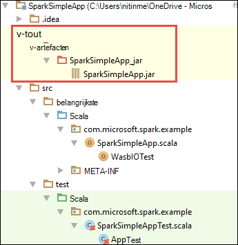

<properties
    pageTitle="Zelfstandige scala toepassingen uitvoeren op clusters HDInsight Spark maken | Microsoft Azure"
    description="Informatie over het maken van een zelfstandige toepassing uitvoeren op clusters HDInsight Spark Spark."
    services="hdinsight"
    documentationCenter=""
    authors="nitinme"
    manager="jhubbard"
    editor="cgronlun"
    tags="azure-portal"/>

<tags
    ms.service="hdinsight"
    ms.workload="big-data"
    ms.tgt_pltfrm="na"
    ms.devlang="na"
    ms.topic="article"
    ms.date="10/28/2016"
    ms.author="nitinme"/>

# Een zelfstandige toepassing uit te voeren op een cluster op HDInsight Linux Apache Spark Scala maken

Dit artikel bevat stapsgewijze richtlijnen over het ontwikkelen van zelfstandige Spark toepassingen geschreven in Scala met Maven met IntelliJ IDEE. Het artikel Apache Maven gebruikt als het systeem bouwen en begint met een bestaande Maven archetype voor Scala geleverd door IntelliJ IDEE.  Op hoog niveau omvatten het maken van een Scala toepassing in IntelliJ IDEE de volgende stappen uit:

* Maven gebruiken als het systeem opbouwen.
* Update Project Object Model (POM) bestand Spark module afhankelijkheden kunt oplossen.
* Schrijf uw toepassing in Scala.
* Genereert een jar-bestand dat kan worden ingediend bij HDInsight Spark clusters.
* Voer de toepassing op motoren cluster met behulp van Livius.

>[AZURE.NOTE] HDInsight biedt ook een hulpprogramma IntelliJ IDEE plugin te vereenvoudigen het proces van het maken en indienen van een cluster HDInsight Spark op Linux-toepassingen. Voor meer informatie, Zie [Gebruik HDInsight extra Plugin voor IntelliJ IDEE te maken en een aanvraag indienen](hdinsight-apache-spark-intellij-tool-plugin.md).

**Vereisten**

* Een abonnement op Azure. Zie [Azure krijg gratis proefperiode](https://azure.microsoft.com/documentation/videos/get-azure-free-trial-for-testing-hadoop-in-hdinsight/).
* Een cluster van Apache Spark op HDInsight Linux. Zie [clusters in Azure HDInsight Apache Spark maken](hdinsight-apache-spark-jupyter-spark-sql.md)voor instructies.
* Oracle Java Development kit. Vanaf [hier](http://www.oracle.com/technetwork/java/javase/downloads/jdk8-downloads-2133151.html)kunt u deze installeren.
* Een Java IDE. In dit artikel wordt een IntelliJ IDEE 15.0.1. Vanaf [hier](https://www.jetbrains.com/idea/download/)kunt u deze installeren.

## Scala plugin voor IntelliJ IDEE installeren

Als IntelliJ IDEE installatie niet niet gevraagd voor het inschakelen van de invoegtoepassing Scala, IntelliJ IDEE starten en doorloop de volgende stappen uit om de invoegtoepassing te installeren:

1. Start IntelliJ IDEE en vanaf het Welkom-scherm, klikt u op **configureren** en klik op **invoegtoepassingen**.

    

2. In het volgende scherm klikt u op **de invoegtoepassing installeren JetBrains** vanaf de linkerbenedenhoek. Scala zoekt in de **JetBrains Plugins bladeren** in het dialoogvenster dat wordt geopend en klik op **installeren**.

    

3. Als de invoegtoepassing is geïnstalleerd, klikt u op de **knop opnieuw IntelliJ IDEE** om de IDE opnieuw te starten.

## Een zelfstandige Scala project maken

1. Start IntelliJ IDEE en maak een nieuw project. De volgende opties in het dialoogvenster Nieuw project en klik op **volgende**.

    

    * **Maven** selecteren als het projecttype.
    * Een **Project-SDK**opgeven. Klik op Nieuw en navigeer naar de map Java installeren meestal `C:\Program Files\Java\jdk1.8.0_66`.
    * Selecteer de optie **maken van archetype** .
    * Selecteer in de lijst van archetypes, **org.scala, tools.archetypes:scala, archetype, eenvoudig**. Dit zal de juiste mapstructuur te maken en downloaden van de standaard vereiste afhankelijkheden Scala programma schrijven.

2. Relevante waarden opgeven voor de **groeps-id**, **ArtifactId**en **versie**. Klik op **volgende**.

3. In het volgende dialoogvenster waarin u Maven basismap en andere instellingen opgeven, accepteer de standaardinstellingen en klik op **volgende**.

4. Geef een naam en locatie in het laatste dialoogvenster en klik vervolgens op **Voltooien**.

5. Verwijder het bestand **MySpec.Scala** op **src\test\scala\com\microsoft\spark\example**. U hebt niet nodig voor de toepassing.

6. Indien nodig wijzigen de standaard bron- en -bestanden. Ga in het linkerdeelvenster in het IntelliJ IDEE naar **src\main\scala\com.microsoft.spark.example**. Met de rechtermuisknop op de **App.scala**op **refactoring**, klik op naam wijzigen bestand, en bieden de nieuwe naam voor de toepassing in het dialoogvenster en **refactoring**klikt u op.

      

7. In de volgende stappen werkt de pom.xml de afhankelijkheden voor de toepassing van de vonk Scala definiëren. Voor deze afhankelijkheden worden gedownload en automatisch opgelost, moet u Maven dienovereenkomstig.

    

    1. Klik op **Instellingen**in het menu **bestand** .
    2. Navigeer in het dialoogvenster **Instellingen** te **bouwen, uitvoering, implementatie** > **Extra bouwen** > **Maven** > **importeren**.
    3. Selecteer de optie voor het **importeren van Maven projecten automatisch**.
    4. Klik op **toepassen**en klik vervolgens op **OK**.

8. Werk het bronbestand Scala als uw toepassingscode opnemen. Open en de bestaande voorbeeldcode vervangen door de volgende code en sla de wijzigingen. Deze code leest de gegevens van de HVAC.csv (beschikbaar op alle HDInsight Spark clusters), worden de rijen met slechts één cijfer in de zesde kolom en schrijft u de uitvoer naar de **/HVACOut** onder de standaard opslag container voor het cluster.

        package com.microsoft.spark.example

        import org.apache.spark.SparkConf
        import org.apache.spark.SparkContext

        /**
          * Test IO to wasb
          */
        object WasbIOTest {
          def main (arg: Array[String]): Unit = {
            val conf = new SparkConf().setAppName("WASBIOTest")
            val sc = new SparkContext(conf)

            val rdd = sc.textFile("wasbs:///HdiSamples/HdiSamples/SensorSampleData/hvac/HVAC.csv")

            //find the rows which have only one digit in the 7th column in the CSV
            val rdd1 = rdd.filter(s => s.split(",")(6).length() == 1)

            rdd1.saveAsTextFile("wasbs:///HVACout")
          }
        }

9. De pom.xml bijwerken.

    1.  In `<project>\<properties>` de volgende toevoegen:

            <scala.version>2.10.4</scala.version>
            <scala.compat.version>2.10.4</scala.compat.version>
            <scala.binary.version>2.10</scala.binary.version>

    2. In `<project>\<dependencies>` de volgende toevoegen:

            <dependency>
              <groupId>org.apache.spark</groupId>
              <artifactId>spark-core_${scala.binary.version}</artifactId>
              <version>1.4.1</version>
            </dependency>

    Pom.xml wijzigingen opslaan.

10. Het JAR-bestand maken. IntelliJ IDEE kunt maken van het oppervlak als een artefact van een project. Voer de volgende stappen.

    1. Klik in het menu **bestand** op **Projectstructuur**.
    2. Klik in het dialoogvenster **Projectstructuur** **artefacten** op en klik vervolgens op het plusteken. **JAR-**Klik in het dialoogvenster Pop- en klik op **uit de modules met afhankelijkheden**.

        

    3. Klik in het dialoogvenster **Maken JAR van Modules** op het weglatingsteken ( ) ten opzichte van de **Belangrijkste klasse**.

    4. Selecteer in de klasse die standaard wordt weergegeven en klik op **OK**in het dialoogvenster **Selecteer Main klasse** .

        

    5. Zorg ervoor dat de optie om uit te **pakken naar het doel JAR** is geselecteerd in het dialoogvenster **Maken JAR van Modules** en klik op **OK**. Hiermee maakt u een enkele POTJES met alle afhankelijkheden.

        

    6. Het tabblad uitvoer-indeling worden de potten die geleverd als onderdeel van het Maven-project worden. U kunt selecteren en verwijderen die op die de toepassing Scala heeft geen directe afhankelijkheid. Voor de toepassing die u hier kunt u alle behalve de laatste een (**SparkSimpleApp compileren uitvoer**). Selecteer de potten wilt verwijderen en klik vervolgens op het pictogram **verwijderen** .

        

        Zorg ervoor dat **bouwen op merk** is ingeschakeld, die ervoor zorgt dat het oppervlak wordt gemaakt telkens wanneer het project wordt gemaakt of bijgewerkt. Klik op **toepassen** en klik vervolgens op **OK**.

    7. In de menubalk, klikt u op **maken**en klik vervolgens op **Project maken**. U kunt ook klikken op **Artefacten bouwen** om het oppervlak te maken. Het oppervlak van de uitvoer is gemaakt met de **\out\artifacts**.

        

## Voer de toepassing op het cluster Spark

De toepassing op het cluster worden uitgevoerd, moet u het volgende doen:

* **Het oppervlak van de toepassing voor de opslag van Azure blob kopiëren** die is gekoppeld aan het cluster. [**AzCopy**](../storage/storage-use-azcopy.md), een hulpprogramma voor de opdrachtregel, kunt u dat doen. Er zijn veel ook andere clients die u kunt gebruiken voor het uploaden van gegevens. U vindt meer informatie over deze bij het [uploaden van gegevens voor Hadoop projecten in HDInsight](hdinsight-upload-data.md).

* **Gebruik hier een taak voor de toepassing op afstand indienen** met het cluster vonk. Clusters van motoren op HDInsight omvat hier dat toegang biedt tot REST eindpunten Spark taken op afstand indienen. Zie [indienen Spark taken op afstand met behulp van Livius met clusters van motoren op HDInsight](hdinsight-apache-spark-livy-rest-interface.md)voor meer informatie.

## Zie ook

* [Overzicht: Apache Spark op Azure HDInsight](hdinsight-apache-spark-overview.md)

### Scenario 's

* [Motoren met BI: interactieve gegevensanalyse Spark in HDInsight met BI-hulpprogramma's uitvoeren](hdinsight-apache-spark-use-bi-tools.md)

* [Motoren met Machine Learning: Spark in HDInsight voor het analyseren van gebouw temperatuur met behulp van HVAC-gegevens gebruiken](hdinsight-apache-spark-ipython-notebook-machine-learning.md)

* [Motoren met Machine Learning: gebruik Spark in HDInsight te voorspellen resultaten van levensmiddelen controle](hdinsight-apache-spark-machine-learning-mllib-ipython.md)

* [Spark Streaming: Gebruik Spark in HDInsight voor het bouwen van real-time streaming toepassingen](hdinsight-apache-spark-eventhub-streaming.md)

* [Website logboekanalyse met vonkontsteking in HDInsight](hdinsight-apache-spark-custom-library-website-log-analysis.md)

### Maken en uitvoeren van toepassingen

* [Taken op afstand uitvoeren op een vonk cluster met behulp van Livius](hdinsight-apache-spark-livy-rest-interface.md)

### Hulpprogramma's en -extensies

* [HDInsight extra Plugin voor IntelliJ IDEE maken en indienen van Spark Scala applicatons gebruiken](hdinsight-apache-spark-intellij-tool-plugin.md)

* [Gebruik HDInsight extra Plugin voor IntelliJ IDEE Spark toepassingen op afstand fouten opsporen](hdinsight-apache-spark-intellij-tool-plugin-debug-jobs-remotely.md)

* [Zeppelin notitieblokken gebruiken met een cluster motoren op HDInsight](hdinsight-apache-spark-use-zeppelin-notebook.md)

* [Kernels die beschikbaar zijn voor de laptop in een cluster voor HDInsight Jupyter](hdinsight-apache-spark-jupyter-notebook-kernels.md)

* [Externe-pakketten gebruiken met Jupyter-laptops](hdinsight-apache-spark-jupyter-notebook-use-external-packages.md)

* [Jupyter op uw computer installeren en verbinding maken met een cluster HDInsight Spark](hdinsight-apache-spark-jupyter-notebook-install-locally.md)

### Bronnen beheren

* [Bronnen voor het cluster Apache Spark in Azure HDInsight beheren](hdinsight-apache-spark-resource-manager.md)

* [Spoor en foutopsporing taken die worden uitgevoerd op een cluster van Apache Spark in HDInsight](hdinsight-apache-spark-job-debugging.md)
