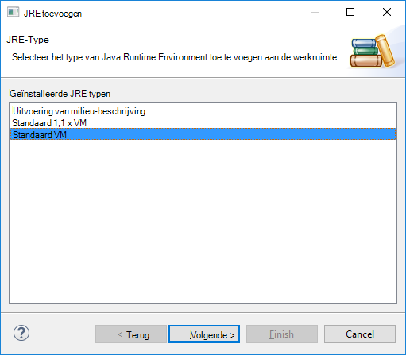

 <properties
    pageTitle="Spark Scala toepassingen met extra HDInsight in Azure Toolkit voor Eclips maken | Microsoft Azure"
    description="Informatie over het maken van een zelfstandige toepassing uitvoeren op clusters HDInsight Spark Spark."
    services="hdinsight"
    documentationCenter=""
    authors="nitinme"
    manager="jhubbard"
    editor="cgronlun"
    tags="azure-portal"/>

<tags
    ms.service="hdinsight"
    ms.workload="big-data"
    ms.tgt_pltfrm="na"
    ms.devlang="na"
    ms.topic="article"
    ms.date="08/30/2016"
    ms.author="nitinme"/>

# HDInsight's in Azure Toolkit voor Eclips Spark om toepassingen te maken voor HDInsight Spark Linux cluster gebruiken

Dit artikel bevat stapsgewijze richtlijnen over het ontwikkelen van Spark-toepassingen die zijn geschreven in Scala en in te dienen om een HDInsight Spark cluster met behulp van extra HDInsight voor Eclips in Azure Toolkit. U kunt de hulpprogramma's in een aantal verschillende manieren:

* Voor de ontwikkeling en het indienen van een cluster HDInsight Spark Scala Spark
* Toegang tot de clusterbronnen Azure HDInsight vonk
* Voor het ontwikkelen en uitvoeren van een toepassing Scala Spark lokaal

>[AZURE.IMPORTANT] Dit hulpprogramma kan worden gebruikt voor het maken en indienen van aanvragen voor een cluster HDInsight Spark op Linux alleen.

##Vereisten

* Een abonnement op Azure. Zie [Azure krijg gratis proefperiode](https://azure.microsoft.com/documentation/videos/get-azure-free-trial-for-testing-hadoop-in-hdinsight/).

* Een cluster van Apache Spark op HDInsight Linux. Zie [clusters in Azure HDInsight Apache Spark maken](hdinsight-apache-spark-jupyter-spark-sql.md)voor instructies.

* Oracle Java Development kit versie 7 en 8. 
    * **Java SDK 7** wordt gebruikt voor de opstelling van Spark projecten zoals de clusters HDInsight Java versie 7-ondersteuning. Java SDK 7 kunt u downloaden vanaf [hier](http://www.oracle.com/technetwork/java/javase/downloads/jdk7-downloads-1880260.html).
    * **Java SDK 8** wordt Eclips IDE runtime gebruikt. U kunt downloaden vanaf [hier](http://www.oracle.com/technetwork/java/javase/downloads/jdk8-downloads-2133151.html).

* Eclips IDE. In dit artikel wordt een Eclips Neon. Vanaf [hier](https://www.eclipse.org/downloads/)kunt u deze installeren.

* Scala IDE voor Eclips. 
    * **Als u Eclips IDE geïnstalleerd hebt**, kunt u de invoegtoepassing Scala IDE toevoegen **gaat** -> **Nieuwe SoftWare installeren**, en [http://download.scala-ide.org/sdk/lithium/e44/scala211/stable/site](http://download.scala-ide.org/sdk/lithium/e44/scala211/stable/site) als bron voor het downloaden van de Plugin voor Eclips Scala toevoegen. 
    * **Als u nog geen Eclips IDE is geïnstalleerd**, kunt u Scala IDE rechtstreeks vanaf [hier](http://scala-ide.org/download/sdk.html)installeren. U kunt downloaden van het ZIP-bestand van deze koppeling, pak deze Navigeer naar de map **/eclipse** en **eclipse.exe** -bestand vervolgens van daaruit uitvoeren.
    
    >[AZURE.NOTE] De stappen in dit document zijn gebaseerd op gebruik Eclips IDE met Scala-invoegtoepassing geïnstalleerd.

* Spark SDK. U kunt downloaden vanaf [hier](http://go.microsoft.com/fwlink/?LinkID=723585&clcid=0x409).

* Clipse e (fx) installeren vanaf [https://www.eclipse.org/efxclipse/install.html](https://www.eclipse.org/efxclipse/install.html).

## HDInsight's installeren in Azure Toolkit voor Eclips

HDInsight hulpmiddelen voor Eclips beschikbaar is als onderdeel van de Toolkit Azure voor Eclips. Zie [de Azure Toolkit voor Eclips installeren](../azure-toolkit-for-eclipse-installation.md)voor instructies voor het installeren van de Toolkit Azure.

## Meld u aan bij uw abonnement Azure

1. Start de Eclips IDE en open de Verkenner Azure. Klik op **Weergave weergeven** en klikt u op **andere**in het menu **venster** in de IDE. **In het dialoogvenster dat wordt geopend, vouw **Azure**en **Azure Explorer**op.**

    

2. Klik met de rechtermuisknop op het knooppunt **Azure** in **Azure Explorer**en klik vervolgens op **Abonnementen beheren**.

3. Klik op **aanmelden** en voer uw Azure referenties in het dialoogvenster **Abonnementen beheren** .

    

4. Nadat u bent aangemeld, worden het dialoogvenster **Abonnementen beheren** de Azure abonnementen die zijn gekoppeld aan de referenties. Klik op **sluiten** in het dialoogvenster.

5. Vouw op het tabblad Azure Explorer **HDInsight** overzicht van de clusters HDInsight Spark onder uw abonnement.

    

6. Verder kunt u een naam clusterknooppunt als u resources (bijvoorbeeld opslag rekeningen) die is gekoppeld aan het cluster wilt uitvouwen.

    

## Een Scala van Spark-project voor een cluster HDInsight Spark instellen

1. **Vanuit de werkruimte Eclips IDE, klikt u op **bestand**en klik vervolgens op **Project**.** 

2. Vouw **HDInsight**uit in de wizard **Nieuw Project** , **motoren op HDInsight (Scala)**selecteren en klik op **volgende**.

    

3. In het dialoogvenster **Nieuw HDInsight Scala Project** invoeren/selecteren waarden zoals aangegeven in de onderstaande afbeelding en klik vervolgens op **volgende**.

    

    * Voer een naam voor het project.
    * In het vak **JRE** moet **dat gebruiken een uitvoeringsomgeving JRE** is ingesteld op **JavaSE 1.7**.
    * Zorg ervoor dat Spark SDK is ingesteld op de locatie waar u de SDK hebt gedownload. De koppeling naar de locatie is opgenomen in de [voorwaarden](#prerequisites) eerder in dit onderwerp. U kunt de SDK ook downloaden via de koppeling in dit dialoogvenster worden opgenomen zoals in de bovenstaande afbeelding.    

4. In het volgende dialoogvenster, klikt u op het tabblad **bibliotheken** en dubbelklik vervolgens op **Systeembibliotheek JRE [JavaSE-1,7]**.

    

5. Controleer of de **Dat omgeving** is ingesteld op **JavaSE-1.7(jdk1.7.0_79)**in **Bibliotheek bewerken** in het dialoogvenster. Volg de onderstaande stappen als dit niet beschikbaar als optie.

    1. Selecteer de optie **Alternatieve JRE** en of er **JavaSE-1.7(jdk1.7.0_79)** beschikbaar is.
    2. Als dit niet het geval is, klikt u op de knop **JREs geïnstalleerd** .

          

    3. Klik op **toevoegen**in het dialoogvenster **JREs geïnstalleerd** .

            

    4. Klik in het dialoogvenster **Type JRE** **Standaard VM**selecteren en klik op **volgende**

            

    5. Map, klik op in het dialoogvenster **Definitie van JRE** en navigeer naar de locatie voor de installatie JDK 7, en selecteert u de hoofdmap voor **jdk1.7.0_79**.

            

    6. Klik op **Voltooien**. Selecteer de zojuist toegevoegde JRE in het dialoogvenster **JREs geïnstalleerd** en klik op **OK**.

           

    7. De nieuw toegevoegde JRE moet worden vermeld voor de **Omgeving**. Klik op **Voltooien**.

           

6. Dubbelklik op het tabblad **bibliotheken** **Scala bibliotheek Container [2.11.8]**. Selecteer in het dialoogvenster **Bibliotheek bewerken** **vaste Scala bibliotheek container: 2.10.6**. 

    

    Klik op **Voltooien** voordat u het dialoogvenster Instellingen voor project afgesloten.

## Scala een toepassing voor HDInsight Spark cluster maken

1. In de reeds geopende Eclips IDE vanuit de **Verkenner pakket**uitbreiden van het project dat u eerder hebt gemaakt met de rechtermuisknop op de **src**, wijs **Nieuw**aan en klikt u op **andere**.

2. In het dialoogvenster **Selecteer een wizard** uitgebreid **Scala Wizards**, klikt u op **Scala Object**aan en klik op **volgende**.

    

3. Voer een naam voor het object in het dialoogvenster **Nieuw bestand maken** en klik vervolgens op **Voltooien**.

    

4. Plak de volgende code in de teksteditor.

        import org.apache.spark.SparkConf
        import org.apache.spark.SparkContext
    
        object MyClusterApp{
          def main (arg: Array[String]): Unit = {
            val conf = new SparkConf().setAppName("MyClusterApp")
            val sc = new SparkContext(conf)
        
            val rdd = sc.textFile("wasbs:///HdiSamples/HdiSamples/SensorSampleData/hvac/HVAC.csv")
        
            //find the rows which have only one digit in the 7th column in the CSV
            val rdd1 =  rdd.filter(s => s.split(",")(6).length() == 1)
        
            rdd1.saveAsTextFile("wasbs:///HVACOut")
          }     
        }

5. De toepassing uitvoeren op een cluster HDInsight Spark.

    1. In het **Pakket Explorer**met de rechtermuisknop op de naam van het project, en selecteer vervolgens **Spark toepassing verzenden naar HDInsight**.      

    2. Bevatten de volgende waarden in het dialoogvenster **Spark indienen** .

        * Voor de **Naam van het Cluster**, selecteer het HDInsight Spark cluster waarop u wilt dat uw toepassing uit te voeren.

        * U moet een artefact van het project Eclips selecteren of Selecteer een van de vaste schijf.

        * Voer de naam van het object dat u hebt opgegeven in de code ten opzichte van het tekstvak **naam Main** (Zie onderstaande afbeelding).

            

        * Omdat de toepassingscode in dit voorbeeld geen argumenten voor de opdrachtregel of verwijzen naar bestanden of potten, kunt u de resterende tekstvakken leeg laten.

        * Klik op **indienen**.

    3. Het tabblad **Spark indiening** moet beginnen met het weergeven van de voortgang. U kunt de toepassing stoppen door te klikken op de rode knop in het venster 'Inzendingen Spark'. U kunt ook de logboeken voor deze specifieke toepassing uitvoeren door te klikken op het pictogram wereldbol (aangeduid door het blauwe vak in de afbeelding) weergeven.

        

    In het volgende gedeelte leert u hoe toegang te krijgen tot de uitvoer met behulp van de hulpprogramma's voor HDInsight in Azure Toolkit voor Eclips taak.

## Toegang tot en beheer van HDInsight Spark clusters met behulp van de hulpprogramma's voor HDInsight in Azure Toolkit voor Eclips

U kunt tal van bewerkingen met behulp van de hulpprogramma's voor HDInsight uitvoeren.

### Toegang tot de container opslag voor het cluster

1. Vouw vanuit de Verkenner Azure hoofdknooppunt **HDInsight** voor een overzicht van HDInsight Spark clusters die beschikbaar zijn.

3. Vouw de naam van het cluster voor een overzicht van de opslag en de standaard opslag container voor het cluster.

    

4. Klik op de naam van opslag container die is gekoppeld aan het cluster. In het rechterdeelvenster ziet u een map met de naam **HVACOut**. Dubbelklik op de map openen en u ziet **deel -*** bestanden. Open een van deze bestanden naar de uitvoer van de toepassing weergegeven.

### Toegang tot de Server Spark geschiedenis

1. Vanuit de **Azure Explorer**met de rechtermuisknop op de naam van het cluster Spark en selecteer **Openen Spark geschiedenis UI**. Voer desgevraagd de referenties van de beheerder voor het cluster. U moet hebben opgegeven deze tijdens het inrichten van het cluster.

2. In het dashboard Spark geschiedenis Server kunt u zoeken naar de toepassing u net klaar met de naam van de toepassing. In de code, u hebt ingesteld de toepassing naam met `val conf = new SparkConf().setAppName("MyClusterApp")`. Daarom is de naam van uw toepassing Spark **MyClusterApp**.

### De portal Ambari starten

Klik met de rechtermuisknop op de naam van het cluster Spark in **Azure Explorer**en selecteer **Open Cluster Management Portal (Ambari)**. Voer desgevraagd de referenties van de beheerder voor het cluster. U moet hebben opgegeven deze tijdens het inrichten van het cluster.

### Azure abonnementen beheren

Standaard worden de hulpprogramma's voor HDInsight in Azure Toolkit voor Eclips Spark clusters van uw Azure abonnementen. Indien nodig kunt u de abonnementen die u wilt toegang tot het cluster. Vanuit de **Azure Explorer**met de rechtermuisknop op het hoofdknooppunt **Azure** en klik vervolgens op **Abonnementen beheren**. Schakel de selectievakjes uit voor het abonnement dat u wilt openen en klik vervolgens op **sluiten**in het dialoogvenster. U kunt ook klikken op **Afmelden** als u zich wilt afmelden bij uw abonnement Azure.

## De toepassing van een Scala van Spark lokaal uitvoeren

Kunt u de hulpprogramma's voor HDInsight in Azure Toolkit voor Eclips Spark Scala toepassingen lokaal uitvoeren op uw werkstation. Meestal dergelijke toepassingen niet moet toegang tot clusterbronnen, zoals opslag container en kan worden uitgevoerd en lokaal getest.

### Vereiste

Terwijl de lokale Spark Scala-toepassing uitvoert op een Windows-computer, kan u een uitzondering zoals uiteengezet in de [SPARK-2356](https://issues.apache.org/jira/browse/SPARK-2356) treedt op vanwege een ontbrekende **WinUtils.exe** op Windows OS. U kunt deze fout omzeilen, moet u [het uitvoerbare bestand hier downloaden](http://public-repo-1.hortonworks.com/hdp-win-alpha/winutils.exe) naar een locatie zoals **C:\WinUtils\bin**. Vervolgens moet u een omgevingsvariabele **HADOOP_HOME** toevoegen en stel de waarde van de variabele op **C\WinUtils**.

### Een lokale Spark Scala toepassing uitvoeren  

1. Eclips starten en een nieuw project maken. De volgende opties in het dialoogvenster Nieuw project en klik op **volgende**.

    

    * Selecteer **HDInsight**in het linkerdeelvenster.
    * Selecteer in het rechterdeelvenster **motoren op HDInsight lokale uitvoeren monster (Scala)**.
    * Klik op **volgende**.

2. Om de projectdetails, volgt u stap 3 tot en met 6, zoals wordt weergegeven in het gedeelte [instellen van een Scala van Spark application-project voor een cluster HDInsight Spark](#set-up-a-spark-scala-application-project-for-an-hdinsight-spark cluster).

3. De sjabloon wordt toegevoegd onder de **src** map die u lokaal op uw computer uitvoeren kunt een voorbeeldcode (**LogQuery**).

    

4.  Klik met de rechtermuisknop op de toepassing van **LogQuery** en **Bureau**, **1 Scala toepassingen**. Ziet u een output als volgt in het tabblad **Console** onder.

    

## Feedback en bekende problemen

Op dit moment bekijkt vonk wordt direct wordt niet ondersteund en wij werken aan die.

Als u feedback of suggesties hebt, of als u problemen ondervindt bij het gebruik van dit hulpprogramma, gerust drop ons een e-mail op hdivstool bij microsoft dot com.

## Zie ook

* [Overzicht: Apache Spark op Azure HDInsight](hdinsight-apache-spark-overview.md)

### Scenario 's

* [Motoren met BI: interactieve gegevensanalyse Spark in HDInsight met BI-hulpprogramma's uitvoeren](hdinsight-apache-spark-use-bi-tools.md)

* [Motoren met Machine Learning: Spark in HDInsight voor het analyseren van gebouw temperatuur met behulp van HVAC-gegevens gebruiken](hdinsight-apache-spark-ipython-notebook-machine-learning.md)

* [Motoren met Machine Learning: gebruik Spark in HDInsight te voorspellen resultaten van levensmiddelen controle](hdinsight-apache-spark-machine-learning-mllib-ipython.md)

* [Spark Streaming: Gebruik Spark in HDInsight voor het bouwen van real-time streaming toepassingen](hdinsight-apache-spark-eventhub-streaming.md)

* [Website logboekanalyse met vonkontsteking in HDInsight](hdinsight-apache-spark-custom-library-website-log-analysis.md)

### Maken en uitvoeren van toepassingen

* [Een zelfstandige toepassing maken met Scala](hdinsight-apache-spark-create-standalone-application.md)

* [Taken op afstand uitvoeren op een vonk cluster met behulp van Livius](hdinsight-apache-spark-livy-rest-interface.md)

### Hulpprogramma's en -extensies

* [HDInsight's in Azure Toolkit voor IntelliJ maken en indienen van Spark Scala applicatons gebruiken](hdinsight-apache-spark-intellij-tool-plugin.md)

* [HDInsight's gebruiken in Azure Toolkit voor IntelliJ Spark toepassingen op afstand fouten opsporen](hdinsight-apache-spark-intellij-tool-plugin-debug-jobs-remotely.md)

* [Zeppelin notitieblokken gebruiken met een cluster motoren op HDInsight](hdinsight-apache-spark-use-zeppelin-notebook.md)

* [Kernels die beschikbaar zijn voor de laptop in een cluster voor HDInsight Jupyter](hdinsight-apache-spark-jupyter-notebook-kernels.md)

* [Externe-pakketten gebruiken met Jupyter-laptops](hdinsight-apache-spark-jupyter-notebook-use-external-packages.md)

* [Jupyter op uw computer installeren en verbinding maken met een cluster HDInsight Spark](hdinsight-apache-spark-jupyter-notebook-install-locally.md)

### Bronnen beheren

* [Bronnen voor het cluster Apache Spark in Azure HDInsight beheren](hdinsight-apache-spark-resource-manager.md)

* [Spoor en foutopsporing taken die worden uitgevoerd op een cluster van Apache Spark in HDInsight](hdinsight-apache-spark-job-debugging.md)
