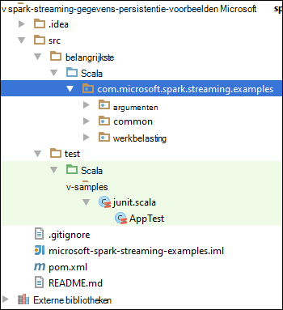

<properties 
    pageTitle="Azure gebeurtenis Hubs gebruiken met Apache Spark in HDInsight voor streaming gegevens | Microsoft Azure" 
    description="Stapsgewijze instructies voor het verzenden van een data streamen naar Azure gebeurtenis Hub en die gebeurtenissen ontvangt in motoren met een toepassing scala" 
    services="hdinsight" 
    documentationCenter="" 
    authors="nitinme" 
    manager="jhubbard" 
    editor="cgronlun"
    tags="azure-portal"/>

<tags 
    ms.service="hdinsight" 
    ms.workload="big-data" 
    ms.tgt_pltfrm="na" 
    ms.devlang="na" 
    ms.topic="article" 
    ms.date="09/30/2016" 
    ms.author="nitinme"/>

# Spark Streaming: Cluster-Azure gebeurtenis Hubs met Apache Spark gebeurtenissen laten verwerken op HDInsight Linux

Spark Streaming breidt de kern-API Spark schaalbare hoge gegevensdoorvoer en fouttolerante stream processing toepassingen te bouwen. Gegevens kunnen uit allerlei bronnen worden ingenomen. In dit artikel gebruiken we Azure gebeurtenis Hubs te nemen gegevens. Gebeurtenis Hubs is een zeer schaalbare opname-systeem dat inname kan miljoenen gebeurtenissen per seconde. 

In deze zelfstudie leert u het maken van een Hub Azure-gebeurtenis consumptie van berichten op de Hub van een gebeurtenis met een consoletoepassing in Java en ze parallel met de toepassing van een vonk geschreven in Scala ophalen. Deze toepassing neemt de gegevens stroomsgewijs verzonden via Hubs gebeurtenis en doorgestuurd naar verschillende uitgangen (Azure opslag Blob, component-tabel en SQL-tabel).

> [AZURE.NOTE] Volg de instructies in dit artikel, moet u beide versies van de portal Azure gebruiken. U gebruikt de [klassieke Azure portal](https://manage.windowsazure.com)een Hub gebeurtenis maken. Met het cluster HDInsight Spark wilt werken, gebruikt u de [Azure-Portal](https://portal.azure.com/).  

**Voorwaarden:**

U hebt de volgende opties:

- Een abonnement op Azure. Zie [Azure krijg gratis proefperiode](https://azure.microsoft.com/documentation/videos/get-azure-free-trial-for-testing-hadoop-in-hdinsight/).
- Een cluster van Apache Spark. Zie [clusters in Azure HDInsight Apache Spark maken](hdinsight-apache-spark-jupyter-spark-sql.md)voor instructies.
- Oracle Java Development kit. Vanaf [hier](http://www.oracle.com/technetwork/java/javase/downloads/jdk8-downloads-2133151.html)kunt u deze installeren.
- Een Java IDE. In dit artikel wordt een IntelliJ IDEE 15.0.1. Vanaf [hier](https://www.jetbrains.com/idea/download/)kunt u deze installeren.
- Microsoft JDBC-stuurprogramma voor SQL Server v4.1 of hoger. Dit is de om gebeurtenisgegevens te schrijven naar een database van SQL Server nodig. Vanaf [hier](https://msdn.microsoft.com/sqlserver/aa937724.aspx)kunt u deze installeren.
- Azure SQL-database. Zie [een SQL-database, in minuten maken](../sql-database/sql-database-get-started.md)voor instructies.

## Wat doet deze oplossing?

Dit is hoe de streaming oplossing loopt:

1. Maak een Azure gebeurtenis Hub die een reeks gebeurtenissen ontvangt.

2. Uitvoeren van een lokale zelfstandige toepassing die genereert gebeurtenissen en duwt deze de gebeurtenis Azure Hub. De voorbeeldtoepassing waarmee dit wordt gepubliceerd op [https://github.com/hdinsight/spark-streaming-data-persistence-examples](https://github.com/hdinsight/spark-streaming-data-persistence-examples).

2. Een streaming programma op afstand uitvoeren op een cluster Spark streaming gebeurtenissen leest van Azure gebeurtenis Hub en duwt deze op verschillende locaties (Azure Blob, component-tabel en een SQL-databasetabel). 

## Hub Azure gebeurtenis maken

1. Selecteer **Nieuw**vanuit [Azure Portal](https://manage.windowsazure.com) > **Service Bus** > **Gebeurtenis Hub** > **Aangepaste maken**.

2. Voer een **Naam van de gebeurtenis Hub**op het scherm **een Hub met nieuwe gebeurtenis toevoegen** , selecteert u de **regio** te maken van de hub, en een nieuwe naamruimte maken of Selecteer een bestaande. Klik op de **pijl** om door te gaan.

    ![wizard, pagina 1] (./media/hdinsight-apache-spark-eventhub-streaming/hdispark.streaming.create.event.hub.png "Een Hub Azure gebeurtenis maken")

    > [AZURE.NOTE] U moet dezelfde **locatie** als het cluster Apache Spark in HDInsight latentie en kosten te verminderen.

3. Voer de waarden voor **aantal partities** en het **Vasthouden van het bericht** en klikt u op het vinkje op het scherm **Gebeurtenis Hub configureren** . In dit voorbeeld een aantal partities van 10 en de handhaving van een bericht van 1 te gebruiken. Opmerking het aantal partities omdat u deze waarde hoger moet is.

    ![wizard, pagina 2] (./media/hdinsight-apache-spark-eventhub-streaming/hdispark.streaming.create.event.hub2.png "Geef partitie grootte en het vasthouden van dagen voor gebeurtenis Hub")

4. Op de Hub van de gebeurtenis die u hebt gemaakt, klikt u op **configureren**en vervolgens twee-beleid voor de gebeurtenis hub maken.

    <table>
    <tr><th>Naam</th><th>Machtigingen</th></tr>
    <tr><td>mysendpolicy</td><td>Verzenden</td></tr>
    <tr><td>myreceivepolicy</td><td>Luisteren</td></tr>
    </table>

    Nadat u de machtigingen hebt gemaakt, selecteert u het pictogram **Opslaan** onder aan de pagina. Hiermee maakt u de gedeelde-beleid dat wordt gebruikt voor het verzenden (**mysendpolicy**) en (**myreceivepolicy**) op de Hub van deze gebeurtenis luisteren.

    ![beleid] (./media/hdinsight-apache-spark-eventhub-streaming/hdispark.streaming.event.hub.policies.png "Beleid maken gebeurtenis Hub")

    
5. Op dezelfde pagina, dient u een beleid voor sleutels gegenereerd voor de twee beleidsregels. Deze sleutels worden opgeslagen omdat ze later worden gebruikt.

    ![beleid toetsen] (./media/hdinsight-apache-spark-eventhub-streaming/hdispark.streaming.event.hub.policy.keys.png "Beleid sleutels opslaan")

6. Klik op **de dashboardpagina** **Verbindingsgegevens** ophalen en opslaan van de tekenreeksen voor de gebeurtenis Hub met twee beleidsregels onder.

    ![beleid toetsen] (./media/hdinsight-apache-spark-eventhub-streaming/hdispark.streaming.event.hub.policy.connection.strings.png "Verbindingsreeksen beleid opslaan")

## Een toepassing Scala gebruikt om berichten te verzenden naar de gebeurtenis Hub

In deze sectie kunt u een Scala van zelfstandige lokale toepassing gebruiken voor het verzenden van een reeks gebeurtenissen met Azure gebeurtenis Hub die u in de vorige stap hebt gemaakt. Deze toepassing is beschikbaar op GitHub op [https://github.com/hdinsight/eventhubs-sample-event-producer](https://github.com/hdinsight/eventhubs-sample-event-producer). Hier de stappen wordt ervan uitgegaan dat u al deze opslagplaats GitHub hebben forked.

1. Open de toepassing, **EventhubsSampleEventProducer**, in IntelliJ IDEE.
    
2. Compileer het project. Klik in het menu **Build** **Project maken**. Het oppervlak van de uitvoer is gemaakt met de **\out\artifacts**.

>[AZURE.TIP] U kunt ook een optie beschikbaar in IntelliJ IDEE voor het maken van het project rechtstreeks uit een bibliotheek GitHub. Als u wilt weten hoe u kunt gebruiken, volg de instructies in de volgende sectie voor hulp. Houd er rekening mee dat veel van de stappen die worden beschreven in de volgende sectie wordt niet van toepassing zijn op de Scala-toepassing die u in deze stap maakt. Bijvoorbeeld:

> * U moet niet de POM zodanig dat de vonk versie bijwerken. Dat is omdat er geen afhankelijkheid op motoren voor het maken van deze toepassing
> * U geen enkele potten afhankelijkheid toevoegen aan de bibliotheek van het project. Dat komt doordat deze potten zijn niet vereist voor dit project.

## De toepassing voor het ontvangen van de gebeurtenissen streaming Scala bijwerken

Een voorbeeldtoepassing Scala aan de gebeurtenis ontvangen en deze doorsturen naar verschillende bestemmingen is beschikbaar op [https://github.com/hdinsight/spark-streaming-data-persistence-examples](https://github.com/hdinsight/spark-streaming-data-persistence-examples). De volgende stappen voor het bijwerken van de toepassing en maakt het oppervlak van de uitvoer.

1. IntelliJ IDEE starten en selecteer **uitchecken uit versiebeheer** in het scherm starten en klik vervolgens op **Git**.
        
    

2. In het dialoogvenster **Opslagplaats Clone** bieden de URL van de opslagplaats Git nabootsen van en **klonen**klik vervolgens op de map kopiëren naar opgeven.

    

    
3. Volg de aanwijzingen op totdat het project volledig is gekloond. Druk op **Alt + 1** om de **Projectweergave**te openen. Er moet uitzien.

    
    
4. Zorg ervoor dat de toepassingscode is gecompileerd met Java8. Om dit **bestand**op, op de **Structuur van het Project**en zorg ervoor dat op het tabblad **Project** taalniveau Project ingesteld op **8 - Lambdas, type-annotaties, enz**.

    

5. Open de **pom.xml** en controleer of de versie van de motoren correct is. Onder <properties> knooppunt, zoekt u naar het volgende fragment en controleer of de versie van de vonk.

        <scala.version>2.10.4</scala.version>
        <scala.compat.version>2.10.4</scala.compat.version>
        <scala.binary.version>2.10</scala.binary.version>
        <spark.version>1.6.2</spark.version>
    
5. De toepassing moet twee potten van afhankelijkheid:

    * **EventHub-ontvanger jar**. Dit is vereist voor Spark aan berichten van gebeurtenis Hub. Voor het gebruik van dit oppervlak, werken de **pom.xml** om toe te voegen de volgende vermeldingen in `<dependencies>`.

            <dependency>
              <groupId>com.microsoft.azure</groupId>
              <artifactId>spark-streaming-eventhubs_2.10</artifactId>
              <version>1.6.0</version>
            </dependency> 

    * **JDBC-stuurprogramma jar**. Dit is nodig voor het schrijven van de berichten die zijn ontvangen van gebeurtenis Hub in Azure SQL-database. U kunt downloaden v4.1 of hoger van het jar-bestand van [hier](https://msdn.microsoft.com/sqlserver/aa937724.aspx). Verwijzing naar deze potjes in de project-bibliotheek toevoegen. Voer de volgende stappen uit:

        1. Vanuit het venster IntelliJ IDEE waar u de toepassing opent, klikt u op **bestand**hebt op de **Structuur van het Project**en klik op **bibliotheken**. 
        
        2. Klik op het pictogram toevoegen () en klik op **Java**, navigeer naar de locatie waar u het oppervlak JDBC-stuurprogramma hebt gedownload. Volg de aanwijzingen op het jar-bestand toevoegen aan de bibliotheek van het project.

            ![toevoegen van ontbrekende afhankelijkheden] (./media/hdinsight-apache-spark-eventhub-streaming/add-missing-dependency-jars.png "Potten van ontbrekende afhankelijkheid toevoegen")

        3. Klik op **toepassen**.

6. Het uitvoerbestand jar maken. Voer de volgende stappen.
    1. Klik in het dialoogvenster **Projectstructuur** **artefacten** op en klik vervolgens op het plusteken. **JAR-**Klik in het dialoogvenster Pop- en klik op **uit de modules met afhankelijkheden**.

        

    1. Klik in het dialoogvenster **Maken JAR van Modules** op het weglatingsteken () ten opzichte van de **Belangrijkste klasse**.

    1. Selecteer een van de beschikbare klassen en klik op **OK**in het dialoogvenster **Selecteer Main klasse** .

        

    1. Zorg ervoor dat de optie om uit te **pakken naar het doel JAR** is geselecteerd in het dialoogvenster **Maken JAR van Modules** en klik op **OK**. Hiermee maakt u een enkele POTJES met alle afhankelijkheden.

        

    1. Op het tabblad **Indeling van de uitvoer** worden alle potten die geleverd als onderdeel van het Maven-project worden. U kunt selecteren en verwijderen die op die de toepassing Scala heeft geen directe afhankelijkheid. Voor de toepassing die u hier kunt u alle behalve de laatste een (**microsoft-spark-streaming-voorbeelden compileren uitvoer**). Selecteer de potten wilt verwijderen en klik vervolgens op het pictogram **verwijderen** ().

        

        Zorg ervoor dat **bouwen op merk** is ingeschakeld, die ervoor zorgt dat het oppervlak wordt gemaakt telkens wanneer het project wordt gemaakt of bijgewerkt. Klik op **toepassen** en klik vervolgens op **OK**.

    1. In het tabblad **Indeling van de uitvoer** rechts onderaan in het vak **Beschikbare elementen** hebt u het oppervlak JDBC SQL die u eerder hebt toegevoegd aan de bibliotheek van het project. U moet dit toevoegen aan het tabblad **Indeling van de uitvoer** . Klik met de rechtermuisknop op het jar-bestand en klik vervolgens op **Uitpakken in uitvoer Root**.

          

        Het tabblad **Indeling van de uitvoer** ziet er nu als volgt.

             

        Klik op **toepassen** en klik vervolgens op **OK**in het dialoogvenster **Projectstructuur** . 

    1. In de menubalk, klikt u op **maken**en klik vervolgens op **Project maken**. U kunt ook klikken op **Artefacten bouwen** om het oppervlak te maken. Het oppervlak van de uitvoer is gemaakt met de **\out\artifacts**.

        

## De toepassingen op afstand uitvoeren op een vonk cluster met behulp van Livius

We gebruiken hier de streaming-toepassing op afstand kunnen uitvoeren op een cluster vonk. Zie voor gedetailleerde informatie over het gebruik van Livius met HDInsight Spark cluster [taken op afstand met een cluster Apache Spark op Azure HDInsight indienen](hdinsight-apache-spark-livy-rest-interface.md). Voordat u begint met zijn de externe taken zijn stroom gebeurtenissen er motoren met een paar dingen die u moet doen:

1. Start van de lokale zelfstandige toepassing voor het genereren van de gebeurtenissen en verzonden naar de gebeurtenis Hub. Gebruik de volgende opdracht om dit te doen:

        java -cp EventhubsSampleEventProducer.jar com.microsoft.eventhubs.client.example.EventhubsClientDriver --eventhubs-namespace "mysbnamespace" --eventhubs-name "myeventhub" --policy-name "mysendpolicy" --policy-key "<policy key>" --message-length 32 --thread-count 32 --message-count -1

2. De streaming jar (**microsoft-spark-streaming-examples.jar**) kopiëren naar de Azure Blob-opslag die is gekoppeld aan het cluster. Hierdoor is het oppervlak toegankelijk voor hier. [**AzCopy**](../storage/storage-use-azcopy.md), een hulpprogramma voor de opdrachtregel, kunt u dat doen. Er zijn een heleboel andere clients die u kunt gebruiken voor het uploaden van gegevens. U vindt meer informatie over deze bij het [uploaden van gegevens voor Hadoop projecten in HDInsight](hdinsight-upload-data.md).

3. KRUL installeren op de computer waarop u deze toepassingen worden uitgevoerd. We KRUL gebruiken om op te roepen de eindpunten hier als u wilt de taken op afstand uitvoeren.

### De toepassingen voor het ontvangen van de gebeurtenissen in een Blob Azure opslag als tekst

Open een opdrachtprompt, Ga naar de map waarin u de KRUL geïnstalleerd en voer de volgende opdracht (vervang gebruikersnaam en wachtwoord en cluster naam):

    curl -k --user "admin:mypassword1!" -v -H "Content-Type: application/json" -X POST --data @C:\Temp\inputBlob.txt "https://mysparkcluster.azurehdinsight.net/livy/batches"

De parameters in het bestand **inputBlob.txt** zijn als volgt gedefinieerd:

    { "file":"wasbs:///example/jars/microsoft-spark-streaming-examples.jar", "className":"com.microsoft.spark.streaming.examples.workloads.EventhubsEventCount", "args":["--eventhubs-namespace", "mysbnamespace", "--eventhubs-name", "myeventhub", "--policy-name", "myreceivepolicy", "--policy-key", "<put-your-key-here>", "--consumer-group", "$default", "--partition-count", 10, "--batch-interval-in-seconds", 20, "--checkpoint-directory", "/EventCheckpoint", "--event-count-folder", "/EventCount/EventCount10"], "numExecutors":20, "executorMemory":"1G", "executorCores":1, "driverMemory":"2G" }

Laat ons weten wat de parameters in het invoerbestand zijn:

* **bestand** is het pad naar het toepassingsbestand potjes op de Azure opslag rekening die is gekoppeld aan het cluster.
* **className** is de naam van de klasse in het oppervlak.
* **args** is de lijst van argumenten vereist door de klasse
* **numExecutors** is het aantal kernen gebruikt door Spark de streaming-toepassing uit te voeren. Dit moet altijd ten minste tweemaal het aantal partities gebeurtenis Hub.
* **executorMemory**, **executorCores**, **driverMemory** zijn parameters gebruikt voor vereiste resources toewijzen aan de streaming-toepassing.

>[AZURE.NOTE] U hoeft niet de uitvoer-mappen (EventCheckpoint, EventCount/EventCount10) die worden gebruikt als parameters. De streaming-toepassing maakt ze voor u.
    
Wanneer u de opdracht uitvoert, ziet u de volgende uitvoer:

    < HTTP/1.1 201 Created
    < Content-Type: application/json; charset=UTF-8
    < Location: /18
    < Server: Microsoft-IIS/8.5
    < X-Powered-By: ARR/2.5
    < X-Powered-By: ASP.NET
    < Date: Tue, 01 Dec 2015 05:39:10 GMT
    < Content-Length: 37
    <
    {"id":1,"state":"starting","log":[]}* Connection #0 to host mysparkcluster.azurehdinsight.net left intact

Maak een notitie van de batch-ID in de laatste regel van de uitvoer (in dit voorbeeld is '1'). Om te controleren dat de toepassing met succes wordt uitgevoerd, kunt u uw Azure opslag-account die is gekoppeld aan het cluster bekijken en ziet u de **/EventCount/EventCount10** map gemaakt. Deze map moet bevatten BLOB's waarmee het aantal gebeurtenissen binnen de opgegeven periode voor de parameter **batch interval in seconden**verwerkt worden vastgelegd.

De aanvraag blijft actief totdat u het doden. Gebruik hiervoor de volgende opdracht:

    curl -k --user "admin:mypassword1!" -v -X DELETE "https://mysparkcluster.azurehdinsight.net/livy/batches/1"

### De toepassingen voor het ontvangen van de gebeurtenissen in een Blob Azure opslag als JSON

Open een opdrachtprompt, Ga naar de map waarin u de KRUL geïnstalleerd en voer de volgende opdracht (vervang gebruikersnaam en wachtwoord en cluster naam):

    curl -k --user "admin:mypassword1!" -v -H "Content-Type: application/json" -X POST --data @C:\Temp\inputJSON.txt "https://mysparkcluster.azurehdinsight.net/livy/batches"

De parameters in het bestand **inputJSON.txt** zijn als volgt gedefinieerd:

    { "file":"wasbs:///example/jars/microsoft-spark-streaming-examples.jar", "className":"com.microsoft.spark.streaming.examples.workloads.EventhubsToAzureBlobAsJSON", "args":["--eventhubs-namespace", "mysbnamespace", "--eventhubs-name", "myeventhub", "--policy-name", "myreceivepolicy", "--policy-key", "<put-your-key-here>", "--consumer-group", "$default", "--partition-count", 10, "--batch-interval-in-seconds", 20, "--checkpoint-directory", "/EventCheckpoint", "--event-count-folder", "/EventCount/EventCount10", "--event-store-folder", "/EventStore10"], "numExecutors":20, "executorMemory":"1G", "executorCores":1, "driverMemory":"2G" }

De parameters zijn vergelijkbaar met wat u hebt opgegeven voor de tekstuitvoer van de in de vorige stap. Nogmaals, niet nodig voor het maken van de uitvoermappen (EventCheckpoint, EventCount/EventCount10) die worden gebruikt als parameters. De streaming-toepassing maakt ze voor u.

 Nadat u de opdracht hebt uitgevoerd, kunt u uw Azure opslag-account die is gekoppeld aan het cluster bekijken en ziet u de **/EventStore10** map gemaakt. Open elk bestand voorafgegaan door de **deel-** en u ziet de gebeurtenissen verwerkt in een JSON-indeling.

### De toepassingen voor het ontvangen van de gebeurtenissen in een component-tabel

Als de toepassing die de streams van gebeurtenissen in een component-tabel wilt uitvoeren, moet u enkele extra onderdelen. Dit zijn:

* datanucleus-api-jdo-3.2.6.jar
* datanucleus-rdbms-3.2.9.jar
* datanucleus-core-3.2.10.jar
* component site.xml

De **JAR** -bestanden beschikbaar zijn op uw cluster HDInsight Spark op `/usr/hdp/current/spark-client/lib`. De **component site.xml** is beschikbaar op `/usr/hdp/current/spark-client/conf`.

[WinScp](http://winscp.net/eng/download.php) kunt u uit het cluster via deze bestanden kopiëren naar uw lokale computer. Vervolgens kunt u hulpprogramma's voor deze bestanden te kopiëren via uw opslag-account die is gekoppeld aan het cluster. Voor meer informatie over het uploaden van Zie bestanden naar de rekening opslag [uploaden van gegevens voor Hadoop projecten in HDInsight](hdinsight-upload-data.md).

Zodra u over de bestanden naar uw account Azure opslag hebt gekopieerd, open een opdrachtprompt, Ga naar de map waarin u de KRUL geïnstalleerd en de volgende opdracht (vervang gebruikersnaam en wachtwoord en cluster naam):

    curl -k --user "admin:mypassword1!" -v -H "Content-Type: application/json" -X POST --data @C:\Temp\inputHive.txt "https://mysparkcluster.azurehdinsight.net/livy/batches"

De parameters in het bestand **inputHive.txt** zijn als volgt gedefinieerd:

    { "file":"wasbs:///example/jars/microsoft-spark-streaming-examples.jar", "className":"com.microsoft.spark.streaming.examples.workloads.EventhubsToHiveTable", "args":["--eventhubs-namespace", "mysbnamespace", "--eventhubs-name", "myeventhub", "--policy-name", "myreceivepolicy", "--policy-key", "<put-your-key-here>", "--consumer-group", "$default", "--partition-count", 10, "--batch-interval-in-seconds", 20, "--checkpoint-directory", "/EventCheckpoint", "--event-count-folder", "/EventCount/EventCount10", "--event-hive-table", "EventHiveTable10" ], "jars":["wasbs:///example/jars/datanucleus-api-jdo-3.2.6.jar", "wasbs:///example/jars/datanucleus-rdbms-3.2.9.jar", "wasbs:///example/jars/datanucleus-core-3.2.10.jar"], "files":["wasbs:///example/jars/hive-site.xml"], "numExecutors":20, "executorMemory":"1G", "executorCores":1, "driverMemory":"2G" }

De parameters zijn vergelijkbaar met wat u hebt opgegeven voor de tekstuitvoer van de in de vorige stappen. Nogmaals, u hoeft niet voor het maken van de uitvoermappen (EventCheckpoint, EventCount/EventCount10) of de uitvoer component-tabel (EventHiveTable10) die worden gebruikt als parameters. De streaming-toepassing maakt ze voor u. Houd er rekening mee dat de optie **bestanden** en **potten van** paden naar de JAR-bestanden en de component site.xml die u hebt gekopieerd via de rekening van de opslag.

Als u wilt controleren of de component-tabel is gemaakt, kunt u SSH in de cluster en component-query's uitvoeren. Voor meer informatie, Zie [Gebruik component met Hadoop in HDInsight met SSH](hdinsight-hadoop-use-hive-ssh.md). Zodra u via SSH verbonden bent, kunt u uitvoeren met de volgende opdracht om te controleren of de component-tabel, **EventHiveTable10**, is gemaakt.

    show tables;

Een uitvoer van de volgende strekking worden weergegeven:

    OK
    eventhivetable10
    hivesampletable

U kunt ook een query als u de inhoud van de tabel wilt uitvoeren.

    SELECT * FROM eventhivetable10 LIMIT 10;

Hier ziet u de volgende uitvoer:

    ZN90apUSQODDTx7n6Toh6jDbuPngqT4c
    sor2M7xsFwmaRW8W8NDwMneFNMrOVkW1
    o2HcsU735ejSi2bGEcbUSB4btCFmI1lW
    TLuibq4rbj0T9st9eEzIWJwNGtMWYoYS
    HKCpPlWFWAJILwR69MAq863nCWYzDEw6
    Mvx0GQOPYvPR7ezBEpIHYKTKiEhYammQ
    85dRppSBSbZgThLr1s0GMgKqynDUqudr
    5LAWkNqorLj3ZN9a2mfWr9rZqeXKN4pF
    ulf9wSFNjD7BZXCyunozecov9QpEIYmJ
    vWzM3nvOja8DhYcwn0n5eTfOItZ966pa
    Time taken: 4.434 seconds, Fetched: 10 row(s)

### De toepassingen voor het ontvangen van de gebeurtenissen in een Azure SQL-databasetabel

Voordat u deze stap uitvoert, moet dat u een Azure SQL database hebt gemaakt. U moet waarden voor naam, naam van de databaseserver en de database administrator-referenties als parameters. U hoeft niet te maken met de databasetabel. De streaming-toepassing die voor u gemaakt.

Open een opdrachtprompt, Ga naar de map waarin u de KRUL geïnstalleerd en voer de volgende opdracht uit:

    curl -k --user "admin:mypassword1!" -v -H "Content-Type: application/json" -X POST --data @C:\Temp\inputSQL.txt "https://mysparkcluster.azurehdinsight.net/livy/batches"

De parameters in het bestand **inputSQL.txt** zijn als volgt gedefinieerd:

    { "file":"wasbs:///example/jars/microsoft-spark-streaming-examples.jar", "className":"com.microsoft.spark.streaming.examples.workloads.EventhubsToAzureSQLTable", "args":["--eventhubs-namespace", "mysbnamespace", "--eventhubs-name", "myeventhub", "--policy-name", "myreceivepolicy", "--policy-key", "<put-your-key-here>", "--consumer-group", "$default", "--partition-count", 10, "--batch-interval-in-seconds", 20, "--checkpoint-directory", "/EventCheckpoint", "--event-count-folder", "/EventCount/EventCount10", "--sql-server-fqdn", "<database-server-name>.database.windows.net", "--sql-database-name", "mysparkdatabase", "--database-username", "sparkdbadmin", "--database-password", "<put-password-here>", "--event-sql-table", "EventContent" ], "numExecutors":20, "executorMemory":"1G", "executorCores":1, "driverMemory":"2G" }

Om te controleren dat de toepassing met succes wordt uitgevoerd, kunt u verbinding maken met de Azure SQL-database met behulp van SQL Server Management Studio. Zie voor instructies over hoe u dat doet, [verbinding maken met SQL-Database met SQL Server Management Studio](../sql-database/sql-database-connect-query-ssms.md). Zodra u met de database verbonden bent, kunt u navigeren naar de **EventContent** -tabel die is gemaakt door de toepassing van streaming. U kunt een snelle query om de gegevens uit de tabel uitvoeren. De volgende query uitvoeren:

    SELECT * FROM EventCount

Uitvoer van de volgende strekking worden weergegeven:

    00046b0f-2552-4980-9c3f-8bba5647c8ee
    000b7530-12f9-4081-8e19-90acd26f9c0c
    000bc521-9c1b-4a42-ab08-dc1893b83f3b
    00123a2a-e00d-496a-9104-108920955718
    0017c68f-7a4e-452d-97ad-5cb1fe5ba81b
    001KsmqL2gfu5ZcuQuTqTxQvVyGCqPp9
    001vIZgOStka4DXtud0e3tX7XbfMnZrN
    00220586-3e1a-4d2d-a89b-05c5892e541a
    0029e309-9e54-4e1b-84be-cd04e6fce5ec
    003333cf-874f-4045-9da3-9f98c2b4ea49
    0043c07e-8d73-420a-9af7-1fcb94575356
    004a11a9-0c2c-4bc0-a7d5-2e0ebd947ab9

    
## Zie ook

* [Overzicht: Apache Spark op Azure HDInsight](hdinsight-apache-spark-overview.md)

### Scenario 's

* [Motoren met BI: interactieve gegevensanalyse Spark in HDInsight met BI-hulpprogramma's uitvoeren](hdinsight-apache-spark-use-bi-tools.md)

* [Motoren met Machine Learning: Spark in HDInsight voor het analyseren van gebouw temperatuur met behulp van HVAC-gegevens gebruiken](hdinsight-apache-spark-ipython-notebook-machine-learning.md)

* [Motoren met Machine Learning: gebruik Spark in HDInsight te voorspellen resultaten van levensmiddelen controle](hdinsight-apache-spark-machine-learning-mllib-ipython.md)

* [Website logboekanalyse met vonkontsteking in HDInsight](hdinsight-apache-spark-custom-library-website-log-analysis.md)

### Maken en uitvoeren van toepassingen

* [Een zelfstandige toepassing maken met Scala](hdinsight-apache-spark-create-standalone-application.md)

* [Taken op afstand uitvoeren op een vonk cluster met behulp van Livius](hdinsight-apache-spark-livy-rest-interface.md)

### Hulpprogramma's en -extensies

* [HDInsight extra Plugin voor IntelliJ IDEE maken en indienen van Spark Scala applicatons gebruiken](hdinsight-apache-spark-intellij-tool-plugin.md)

* [Gebruik HDInsight extra Plugin voor IntelliJ IDEE Spark toepassingen op afstand fouten opsporen](hdinsight-apache-spark-intellij-tool-plugin-debug-jobs-remotely.md)

* [Zeppelin notitieblokken gebruiken met een cluster motoren op HDInsight](hdinsight-apache-spark-use-zeppelin-notebook.md)

* [Kernels die beschikbaar zijn voor de laptop in een cluster voor HDInsight Jupyter](hdinsight-apache-spark-jupyter-notebook-kernels.md)

* [Externe-pakketten gebruiken met Jupyter-laptops](hdinsight-apache-spark-jupyter-notebook-use-external-packages.md)

* [Jupyter op uw computer installeren en verbinding maken met een cluster HDInsight Spark](hdinsight-apache-spark-jupyter-notebook-install-locally.md)

### Bronnen beheren

* [Bronnen voor het cluster Apache Spark in Azure HDInsight beheren](hdinsight-apache-spark-resource-manager.md)

* [Spoor en foutopsporing taken die worden uitgevoerd op een cluster van Apache Spark in HDInsight](hdinsight-apache-spark-job-debugging.md)

[hdinsight-versions]: hdinsight-component-versioning.md
[hdinsight-upload-data]: hdinsight-upload-data.md
[hdinsight-storage]: hdinsight-hadoop-use-blob-storage.md

[azure-purchase-options]: http://azure.microsoft.com/pricing/purchase-options/
[azure-member-offers]: http://azure.microsoft.com/pricing/member-offers/
[azure-free-trial]: http://azure.microsoft.com/pricing/free-trial/
[azure-management-portal]: https://manage.windowsazure.com/
[azure-create-storageaccount]: ../storage-create-storage-account/ 
