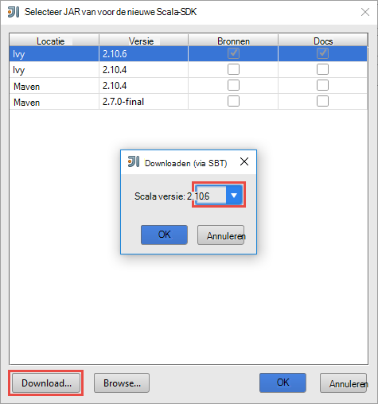
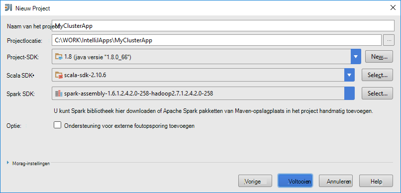
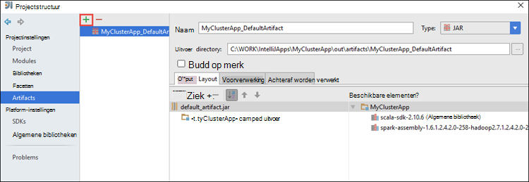
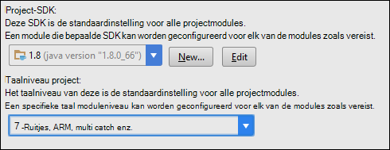
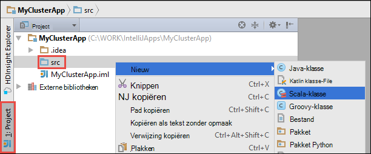

 <properties
    pageTitle="HDInsight's in Azure Toolkit voor IntelliJ gebruiken voor foutopsporing op afstand toepassingen die op clusters HDInsight Spark | Microsoft Azure"
    description="Meer informatie over hoe extra HDInsight in Azure Toolkit voor IntelliJ gebruiken voor foutopsporing op afstand toepassingen die op clusters HDInsight Spark."
    services="hdinsight"
    documentationCenter=""
    authors="nitinme"
    manager="jhubbard"
    editor="cgronlun"
    tags="azure-portal"/>

<tags
    ms.service="hdinsight"
    ms.workload="big-data"
    ms.tgt_pltfrm="na"
    ms.devlang="na"
    ms.topic="article"
    ms.date="09/09/2016"
    ms.author="nitinme"/>

# HDInsight's in Azure Toolkit voor IntelliJ gebruiken voor foutopsporing Spark toepassingen op afstand op HDInsight een Linux cluster

Dit artikel bevat stapsgewijze richtlijnen voor het gebruik van de hulpprogramma's voor HDInsight in Azure Toolkit voor IntelliJ een vonk-taak op de cluster HDInsight Spark en externe foutopsporing vanaf uw computer. Hiertoe moet u de volgende hoofdstappen uitvoeren:

1. Een website of punt-naar-site Azure virtueel netwerk maken. De stappen in dit document wordt ervan uitgegaan dat u een website netwerk.

2. Maak een cluster Spark in Azure HDInsight die deel uitmaakt van het virtuele netwerk van site naar site Azure.

3. Controleer of de verbinding tussen de headnode van het cluster en het bureaublad.

4. Een toepassing Scala in IntelliJ IDEE maken en configureren voor foutopsporing op afstand.

5. Uitvoeren en fouten opsporen in de toepassing.

##Vereisten

* Een abonnement op Azure. Zie [Azure krijg gratis proefperiode](https://azure.microsoft.com/documentation/videos/get-azure-free-trial-for-testing-hadoop-in-hdinsight/).

* Een cluster van Apache Spark op HDInsight Linux. Zie [clusters in Azure HDInsight Apache Spark maken](hdinsight-apache-spark-jupyter-spark-sql.md)voor instructies.
 
* Oracle Java Development kit. Vanaf [hier](http://www.oracle.com/technetwork/java/javase/downloads/jdk8-downloads-2133151.html)kunt u deze installeren.
 
* IntelliJ IDEE. In dit artikel wordt versie 15.0.1. Vanaf [hier](https://www.jetbrains.com/idea/download/)kunt u deze installeren.
 
* Extra HDInsight in Azure Toolkit voor IntelliJ. HDInsight's voor IntelliJ zijn beschikbaar als onderdeel van de Toolkit Azure voor IntelliJ. Zie [de Azure Toolkit voor IntelliJ installeren](../azure-toolkit-for-intellij-installation.md)voor instructies voor het installeren van de Toolkit Azure.

* Meld u aan bij uw abonnement Azure uit IntelliJ IDEE. Volg de instructies [hier](hdinsight-apache-spark-intellij-tool-plugin.md#log-into-your-azure-subscription).
 
* Tijdens het uitvoeren van een Scala van toepassing voor foutopsporing op afstand op een computer met Windows kunt u een uitzondering zoals uiteengezet in de [SPARK-2356](https://issues.apache.org/jira/browse/SPARK-2356) die als gevolg van een WinUtils.exe ontbreken in Windows optreedt. U kunt deze fout omzeilen, moet u [het uitvoerbare bestand hier downloaden](http://public-repo-1.hortonworks.com/hdp-win-alpha/winutils.exe) naar een locatie zoals **C:\WinUtils\bin**. Vervolgens moet u een omgevingsvariabele **HADOOP_HOME** toevoegen en stel de waarde van de variabele op **C\WinUtils**.

## Stap 1: Maak een Azure Virtual Network

Volg de instructies van de onderstaande koppelingen voor het maken van een virtueel netwerk Azure en controleert u of de verbinding tussen het bureaublad en Azure Virtual Network.

* [Een VNet maken met een site naar site VPN-verbinding met Azure Portal](../vpn-gateway/vpn-gateway-howto-site-to-site-resource-manager-portal.md)
* [Een VNet maken met een site naar site VPN-verbinding met PowerShell](../vpn-gateway/vpn-gateway-create-site-to-site-rm-powershell.md)
* [Een punt-naar-site verbinding met een virtueel netwerk met PowerShell configureren](../vpn-gateway/vpn-gateway-howto-point-to-site-rm-ps.md)

## Stap 2: Maak een cluster HDInsight Spark

Op Azure HDInsight die deel uitmaakt van het virtuele netwerk van Azure die u hebt gemaakt, moet u ook een Apache Spark-cluster maken. De beschikbare informatie gebruik [maken van Linux gebaseerde clusters in het HDInsight](hdinsight-hadoop-provision-linux-clusters.md). Als onderdeel van de optionele configuratie, selecteert u de Azure Virtual Network die u in de vorige stap hebt gemaakt.

## Stap 3: Controleer of de verbinding tussen de headnode van het cluster en het bureaublad

1. Het IP-adres van de headnode krijgen. Open Ambari UI voor het cluster. Uit het cluster blade, klikt u op het **Dashboard**.

    

2. Klik op de **Hosts**van de UI Ambari in de rechterbovenhoek.

    

3. U ziet een lijst met headnodes en knooppunten werknemer zookeeper knooppunten. De headnodes hebben de **hn*** voorvoegsel. Klik op de eerste headnode.

    

4. Kopieer het IP-adres van de headnode en de hostnaam van de onder aan de pagina die wordt geopend in het vak **Samenvatting** .

    

5. Het IP-adres en de hostnaam van de headnode aan het **hosts** -bestand op de computer waar u wilt uitvoeren en op afstand fouten opsporen in de Spark taken bevatten. Hiermee kunt u communiceren met de headnode via het IP-adres en de hostnaam.

    1. Kladblok openen met verhoogde bevoegdheden. Klik op **openen** in het bestandsmenu en ga vervolgens naar de locatie van het Hostsbestand. Op een Windows-computer, is het `C:\Windows\System32\Drivers\etc\hosts`.

    2. Voeg het volgende toe aan het **hosts** -bestand.

            # For headnode0
            192.xxx.xx.xx hn0-nitinp
            192.xxx.xx.xx hn0-nitinp.lhwwghjkpqejawpqbwcdyp3.gx.internal.cloudapp.net

            # For headnode1
            192.xxx.xx.xx hn1-nitinp
            192.xxx.xx.xx hn1-nitinp.lhwwghjkpqejawpqbwcdyp3.gx.internal.cloudapp.net

5. Controleer of dat u zowel de headnodes met behulp van zowel de hostnaam als het IP-adres kunt pingen vanaf de computer waarmee u verbinding hebt met de Azure Virtual Network dat wordt gebruikt door het cluster HDInsight.

6. SSH in de headnode van het cluster met behulp van de instructies op [verbinding maken met een HDInsight-cluster met behulp van SSH](hdinsight-hadoop-linux-use-ssh-windows.md#connect-to-a-linux-based-hdinsight-cluster). Ping het IP-adres van de pc van de headnode cluster. Connectiviteit met zowel de IP-adressen zijn toegewezen aan een voor de netwerkverbinding en de andere voor de Azure virtuele netwerk waarmee de computer is aangesloten op de computer, moet u testen.

7. Herhaal de stappen voor de andere headnode ook. 

## Stap 4: Met behulp van de hulpprogramma's voor HDInsight in Azure Toolkit voor IntelliJ Spark Scala een toepassing maken en configureren voor foutopsporing op afstand

1. Start IntelliJ IDEE en maak een nieuw project. De volgende opties in het dialoogvenster Nieuw project en klik op **volgende**.

    

    * Selecteer **HDInsight**in het linkerdeelvenster.
    * Selecteer in het rechterdeelvenster **motoren op HDInsight (Scala)**.
    * Klik op **volgende**.

2. In het volgende venster bevatten de projectdetails.

    * Geef een naam van het project en projectlocatie.
    * Voor de **Project-SDK**, zorg bieden u een Java-versie die groter zijn dan 7.
    * Voor **Scala SDK**, klikt u op **maken**, klik op **downloaden**en vervolgens selecteert u de versie van Scala te gebruiken. **Zorg ervoor dat u niet met versie 2.11.x**. In dit voorbeeld gebruikt versie **2.10.6**.

        

    * Voor **Motoren SDK**, downloaden en gebruiken van de SDK van [hier](http://go.microsoft.com/fwlink/?LinkID=723585&clcid=0x409). Ook dit negeren en gebruiken de [opslagplaats vonk, Maven](http://mvnrepository.com/search?q=spark) , maar zorg ervoor dat u beschikt over de juiste maven opslagplaats geïnstalleerd Spark toepassingen ontwikkelen. (Bijvoorbeeld, moet u controleren of dat u hebt het gedeelte Streaming Spark geïnstalleerd als u Spark Streaming; Ook moet controleren of u de bibliotheek gemarkeerd als Scala 2.10 - gebruik geen de opslagplaats gemarkeerd als Scala 2.11.)

        

    * Klik op **Voltooien**.

3. Het project Spark een artefact automatisch voor u gemaakt. Ga als volgt te werk om te zien de artefact.

    1. Klik in het menu **bestand** op **Projectstructuur**.
    2. Klik in het dialoogvenster **Projectstructuur** **artefacten** overzicht van de standaard-artefact dat wordt gemaakt.

        

    U kunt ook uw eigen artefact maken bly te klikken op de **+** pictogram, gemarkeerd in de afbeelding hierboven.

4. Klik in het dialoogvenster **Projectstructuur** op **Project**. Als u de **Project-SDK** 1.8, zorg ervoor dat het **niveau van het Project taal** is ingesteld op **7 - ruiten, ARM, multi catch, enz**.

    

4. Bibliotheken toevoegen aan uw project. Aan een bibliotheek toevoegen, klik met de rechtermuisknop op de naam van het project in de projectstructuur en klik op **Module-instellingen openen**. In het dialoogvenster **Projectstructuur** in het linkerdeelvenster op **bibliotheken**, klikt u op het (+) symbool en klik vervolgens op **Van Maven**. 

     

    Klik in het dialoogvenster **Bibliotheek downloaden uit de bibliotheek Maven** zoeken en toevoegen van de volgende bibliotheken.

    * `org.scalatest:scalatest_2.10:2.2.1`
    * `org.apache.hadoop:hadoop-azure:2.7.1`

5. Copy `yarn-site.xml` en `core-site.xml` van de headnode van het cluster en toevoegen aan het project. De volgende opdrachten gebruiken om de bestanden te kopiëren. U kunt [Cygwin](https://cygwin.com/install.html) te voeren de volgende `scp` opdrachten om de bestanden kopiëren vanaf de headnodes van het cluster.

        scp <ssh user name>@<headnode IP address or host name>://etc/hadoop/conf/core-site.xml .

    Omdat we al toegevoegd de hostnamen en IP-adres van cluster headnode fo het hosts-bestand op het bureaublad, we kunnen de **scp** -opdrachten op de volgende manier gebruiken.

        scp sshuser@hn0-nitinp:/etc/hadoop/conf/core-site.xml .
        scp sshuser@hn0-nitinp:/etc/hadoop/conf/yarn-site.xml .

    Deze bestanden aan uw project toevoegen door deze te kopiëren in de map **/src** in de projectstructuur van uw, bijvoorbeeld `<your project directory>\src`.

6. Update de `core-site.xml` de volgende wijzigingen aanbrengen.

    1. `core-site.xml`bevat de versleutelde sleutel naar de rekening van de opslag die is gekoppeld aan het cluster. In de `core-site.xml` dat u hebt toegevoegd aan het project, de gecodeerde sleutel vervangen door de sleutel van de feitelijke opslag die is gekoppeld aan de standaardaccount voor opslag. Zie [de toegangstoetsen opslag beheren](../storage/storage-create-storage-account.md#manage-your-storage-account).

            <property>
                <name>fs.azure.account.key.hdistoragecentral.blob.core.windows.net</name>
                <value>access-key-associated-with-the-account</value>
            </property>

    2. Verwijder de volgende vermeldingen uit de `core-site.xml`.

            <property>
                <name>fs.azure.account.keyprovider.hdistoragecentral.blob.core.windows.net</name>
                <value>org.apache.hadoop.fs.azure.ShellDecryptionKeyProvider</value>
            </property>

            <property>
                <name>fs.azure.shellkeyprovider.script</name>
                <value>/usr/lib/python2.7/dist-packages/hdinsight_common/decrypt.sh</value>
            </property>

            <property>
                <name>net.topology.script.file.name</name>
                <value>/etc/hadoop/conf/topology_script.py</value>
            </property>

    3. Sla het bestand.

7. De belangrijkste klasse voor uw toepassing toevoegen. In de **Project Explorer**met de rechtermuisknop op de **src**, wijs **Nieuw**aan en klik op **Scala klasse**.

    

8. Geef een naam op voor het **type** select- **Object**en klik op **OK**in het dialoogvenster **Nieuwe Scala klasse maken** .

    

9. In de `MyClusterAppMain.scala` bestand, plak de volgende code. Deze code maakt het Spark context en een keer een `executeJob` methode van de `SparkSample` object.

        import org.apache.spark.{SparkConf, SparkContext}

        object SparkSampleMain {
          def main (arg: Array[String]): Unit = {
            val conf = new SparkConf().setAppName("SparkSample")
                                      .set("spark.hadoop.validateOutputSpecs", "false")
            val sc = new SparkContext(conf)
        
            SparkSample.executeJob(sc,
                                   "wasbs:///HdiSamples/HdiSamples/SensorSampleData/hvac/HVAC.csv",
                                   "wasbs:///HVACOut")
          }
        }

10. Herhaal stap 8 en 9 hierboven om een nieuw Scala object genaamd `SparkSample`. Voeg de volgende code aan deze klasse. Deze code leest de gegevens van de HVAC.csv (beschikbaar op alle HDInsight Spark clusters), worden de rijen met slechts één cijfer in de zevende kolom in de CSV en schrijft de uitvoer naar de **/HVACOut** onder de standaard opslag container voor het cluster.

        import org.apache.spark.SparkContext
    
        object SparkSample {
          def executeJob (sc: SparkContext, input: String, output: String): Unit = {
            val rdd = sc.textFile(input)
        
            //find the rows which have only one digit in the 7th column in the CSV
            val rdd1 =  rdd.filter(s => s.split(",")(6).length() == 1)
        
            val s = sc.parallelize(rdd.take(5)).cartesian(rdd).count()
            println(s)
        
            rdd1.saveAsTextFile(output)
            //rdd1.collect().foreach(println)
          }
        
        }

11. Herhaal stap 8 en 9 hierboven om het toevoegen van een nieuwe klasse met de naam `RemoteClusterDebugging`. Deze klasse implementeert de Spark testframework die wordt gebruikt voor foutopsporing in toepassingen. Voeg de volgende code aan de `RemoteClusterDebugging` klasse.

        import org.apache.spark.{SparkConf, SparkContext}
        import org.scalatest.FunSuite
        
        class RemoteClusterDebugging extends FunSuite {
        
          test("Remote run") {
            val conf = new SparkConf().setAppName("SparkSample")
                                      .setMaster("yarn-client")
                                      .set("spark.yarn.am.extraJavaOptions", "-Dhdp.version=2.4")
                                      .set("spark.yarn.jar", "wasbs:///hdp/apps/2.4.2.0-258/spark-assembly-1.6.1.2.4.2.0-258-hadoop2.7.1.2.4.2.0-258.jar")
                                      .setJars(Seq("""C:\WORK\IntelliJApps\MyClusterApp\out\artifacts\MyClusterApp_DefaultArtifact\default_artifact.jar"""))
                                      .set("spark.hadoop.validateOutputSpecs", "false")
            val sc = new SparkContext(conf)
        
            SparkSample.executeJob(sc,
              "wasbs:///HdiSamples/HdiSamples/SensorSampleData/hvac/HVAC.csv",
              "wasbs:///HVACOut")
          }
        }

    Aantal belangrijke dingen om te onthouden hier:
    
    * Voor `.set("spark.yarn.jar", "wasbs:///hdp/apps/2.4.2.0-258/spark-assembly-1.6.1.2.4.2.0-258-hadoop2.7.1.2.4.2.0-258.jar")`, zorg ervoor dat de assembly Spark JAR is beschikbaar op de clusteropslag op het opgegeven pad.
    * Voor `setJars`, geef de locatie op waar het artefact oppervlak worden gemaakt. Meestal is het `<Your IntelliJ project directory>\out\<project name>_DefaultArtifact\default_artifact.jar`. 

11. In de `RemoteClusterDebugging` klasse, met de rechtermuisknop op de `test` trefwoord en selecteer **RemoteClusterDebugging configuratie maken**.

    

12. Geef een naam voor de configuratie in het dialoogvenster en selecteer het **type Test** als **de naam van de Test**. Laat alle andere waarden als standaard, klikt u op **toepassen**en klik vervolgens op **OK**.

    

13. U ziet nu een configuratie voor **Extern uitvoeren** -omlaag in de menubalk. 

    

## Stap 5: De toepassing uitvoert in foutopsporingsmodus

1. Open in uw project IntelliJ IDEE `SparkSample.scala` en maak een onderbrekingspunt naast 'val rdd1'. Selecteer in het pop-upmenu voor het maken van een onderbrekingspunt **regel in de functie executeJob**.

    

2. Klik op de knop **Foutopsporing uitvoeren** naast het **Uitvoeren van externe** configuratie vervolgkeuzelijst waarop de toepassing wordt gestart.

    

3. Wanneer de uitvoering van het programma het onderbrekingspunt wordt bereikt, wordt er een tabblad **Foutopsporing** in het onderste deelvenster.

    

4. Klik op de (**+**) pictogram om een controle toevoegen, zoals wordt weergegeven in de onderstaande afbeelding. 

    

    Hier, omdat de toepassing zich vóór de variabele `rdd1` is gemaakt met behulp van deze controle kunnen we zien wat zijn de eerste 5 rijen in de variabele `rdd`. Druk op **ENTER**.

    

    U ziet in de bovenstaande afbeelding is dat terrabytes en foutopsporing tijdens runtime kan opvragen hoe de voortgang van uw toepassing. Bijvoorbeeld in de uitvoer weergegeven in de afbeelding hierboven ziet u dat de eerste rij van de uitvoer een koptekst is. Op basis hiervan kunt u uw toepassingscode overslaan de veldnamenrij zo nodig wijzigen.

5. Nu kunt u het pictogram van het **Programma hervatten** om door te gaan met uw toepassing uitvoeren.

    

6. Als de toepassing is voltooid, raadpleegt u de volgende uitvoer.

    

 

## Zie ook

* [Overzicht: Apache Spark op Azure HDInsight](hdinsight-apache-spark-overview.md)

### Scenario 's

* [Motoren met BI: interactieve gegevensanalyse Spark in HDInsight met BI-hulpprogramma's uitvoeren](hdinsight-apache-spark-use-bi-tools.md)

* [Motoren met Machine Learning: Spark in HDInsight voor het analyseren van gebouw temperatuur met behulp van HVAC-gegevens gebruiken](hdinsight-apache-spark-ipython-notebook-machine-learning.md)

* [Motoren met Machine Learning: gebruik Spark in HDInsight te voorspellen resultaten van levensmiddelen controle](hdinsight-apache-spark-machine-learning-mllib-ipython.md)

* [Spark Streaming: Gebruik Spark in HDInsight voor het bouwen van real-time streaming toepassingen](hdinsight-apache-spark-eventhub-streaming.md)

* [Website logboekanalyse met vonkontsteking in HDInsight](hdinsight-apache-spark-custom-library-website-log-analysis.md)

### Maken en uitvoeren van toepassingen

* [Een zelfstandige toepassing maken met Scala](hdinsight-apache-spark-create-standalone-application.md)

* [Taken op afstand uitvoeren op een vonk cluster met behulp van Livius](hdinsight-apache-spark-livy-rest-interface.md)

### Hulpprogramma's en -extensies

* [HDInsight's in Azure Toolkit voor IntelliJ maken en indienen van Spark Scala applicatons gebruiken](hdinsight-apache-spark-intellij-tool-plugin.md)

* [HDInsight's gebruiken in Azure Toolkit voor Eclips Spark-toepassingen maken](hdinsight-apache-spark-eclipse-tool-plugin.md)

* [Zeppelin notitieblokken gebruiken met een cluster motoren op HDInsight](hdinsight-apache-spark-use-zeppelin-notebook.md)

* [Kernels die beschikbaar zijn voor de laptop in een cluster voor HDInsight Jupyter](hdinsight-apache-spark-jupyter-notebook-kernels.md)

* [Externe-pakketten gebruiken met Jupyter-laptops](hdinsight-apache-spark-jupyter-notebook-use-external-packages.md)

* [Jupyter op uw computer installeren en verbinding maken met een cluster HDInsight Spark](hdinsight-apache-spark-jupyter-notebook-install-locally.md)

### Bronnen beheren

* [Bronnen voor het cluster Apache Spark in Azure HDInsight beheren](hdinsight-apache-spark-resource-manager.md)

* [Spoor en foutopsporing taken die worden uitgevoerd op een cluster van Apache Spark in HDInsight](hdinsight-apache-spark-job-debugging.md)
