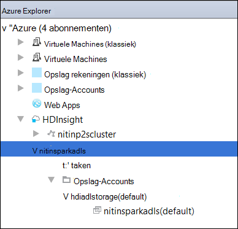

 <properties
    pageTitle="Spark Scala toepassingen met behulp van hulpprogramma's voor HDInsight in Azure Toolkit voor IntelliJ maken | Microsoft Azure"
    description="Informatie over het maken van een zelfstandige toepassing uitvoeren op clusters HDInsight Spark Spark."
    services="hdinsight"
    documentationCenter=""
    authors="nitinme"
    manager="jhubbard"
    editor="cgronlun"
    tags="azure-portal"/>

<tags
    ms.service="hdinsight"
    ms.workload="big-data"
    ms.tgt_pltfrm="na"
    ms.devlang="na"
    ms.topic="article"
    ms.date="09/09/2016"
    ms.author="nitinme"/>

# HDInsight's in Azure Toolkit voor IntelliJ Spark om toepassingen te maken voor HDInsight Spark Linux cluster gebruiken

Dit artikel bevat stapsgewijze richtlijnen over het ontwikkelen van Spark-toepassingen die zijn geschreven in Scala en in te dienen om een HDInsight Spark cluster met behulp van hulpprogramma's voor HDInsight in Azure Toolkit voor IntelliJ.  U kunt de hulpprogramma's in een aantal verschillende manieren:

* Voor de ontwikkeling en het indienen van een cluster HDInsight Spark Scala Spark
* Toegang tot de clusterbronnen Azure HDInsight vonk
* Voor het ontwikkelen en uitvoeren van een toepassing Scala Spark lokaal

U kunt ook een video [hier](https://mix.office.com/watch/1nqkqjt5xonza) u kunt volgen.

>[AZURE.IMPORTANT] Dit hulpprogramma kan worden gebruikt voor het maken en indienen van aanvragen voor een cluster HDInsight Spark op Linux alleen.

##Vereisten

* Een abonnement op Azure. Zie [Azure krijg gratis proefperiode](https://azure.microsoft.com/documentation/videos/get-azure-free-trial-for-testing-hadoop-in-hdinsight/).

* Een cluster van Apache Spark op HDInsight Linux. Zie [clusters in Azure HDInsight Apache Spark maken](hdinsight-apache-spark-jupyter-spark-sql.md)voor instructies.

* Oracle Java Development kit. Vanaf [hier](http://www.oracle.com/technetwork/java/javase/downloads/jdk8-downloads-2133151.html)kunt u deze installeren.

* IntelliJ IDEE. In dit artikel wordt versie 15.0.1. Vanaf [hier](https://www.jetbrains.com/idea/download/)kunt u deze installeren.

## HDInsight's in Azure Toolkit voor IntelliJ installeren

HDInsight hulpmiddelen voor IntelliJ beschikbaar is als onderdeel van de Toolkit Azure voor IntelliJ. Zie [de Azure Toolkit voor IntelliJ installeren](../azure-toolkit-for-intellij-installation.md)voor instructies voor het installeren van de Toolkit Azure.

## Meld u aan bij uw abonnement Azure

1. Start de IDE IntelliJ en open de Verkenner Azure. Klik op **Hulpprogramma voor Windows** en klik vervolgens op **Azure Explorer**in het menu **Beeld** in de IDE.

    

2. Klik met de rechtermuisknop op het knooppunt **Azure** in **Azure Explorer**en klik vervolgens op **Abonnementen beheren**.

3. Klik op **aanmelden** en voer uw Azure referenties in het dialoogvenster **Abonnementen beheren** .

    

4. Nadat u bent aangemeld, worden het dialoogvenster **Abonnementen beheren** de Azure abonnementen die zijn gekoppeld aan de referenties. Klik op **sluiten** in het dialoogvenster.

5. Vouw op het tabblad **Azure Explorer** **HDInsight** overzicht van de clusters HDInsight Spark onder uw abonnement.

    

6. Verder kunt u een naam clusterknooppunt als u resources (bijvoorbeeld opslag rekeningen) die is gekoppeld aan het cluster wilt uitvouwen.

    

## Een Scala van Spark-toepassing uitvoert op een cluster HDInsight Spark

1. Start IntelliJ IDEE en maak een nieuw project. De volgende opties in het dialoogvenster Nieuw project en klik op **volgende**.

    

    * Selecteer **HDInsight**in het linkerdeelvenster.
    * Selecteer in het rechterdeelvenster **motoren op HDInsight (Scala)**.
    * Klik op **volgende**.

2. In het volgende venster bevatten de projectdetails.

    * Geef een naam van het project en projectlocatie.
    * Voor de **Project-SDK**, zorg bieden u een Java-versie die groter zijn dan 7.
    * Voor **Scala SDK**, klikt u op **maken**, klik op **downloaden**en vervolgens selecteert u de versie van Scala te gebruiken. **Zorg ervoor dat u niet met versie 2.11.x**. In dit voorbeeld gebruikt versie **2.10.6**.

        

    * Voor **Motoren SDK**, downloaden en gebruiken van de SDK van [hier](http://go.microsoft.com/fwlink/?LinkID=723585&clcid=0x409). Ook dit negeren en gebruiken de [opslagplaats vonk, Maven](http://mvnrepository.com/search?q=spark) , maar zorg ervoor dat u beschikt over de juiste maven opslagplaats geïnstalleerd Spark toepassingen ontwikkelen. (Bijvoorbeeld, moet u controleren of dat u hebt het gedeelte Streaming Spark geïnstalleerd als u Spark Streaming; Ook moet controleren of u de bibliotheek gemarkeerd als Scala 2.10 - gebruik geen de opslagplaats gemarkeerd als Scala 2.11.)

        

    * Klik op **Voltooien**.

3. Het project Spark een artefact automatisch voor u gemaakt. Ga als volgt te werk om te zien de artefact.

    1. Klik in het menu **bestand** op **Projectstructuur**.
    2. Klik in het dialoogvenster **Projectstructuur** **artefacten** overzicht van de standaard-artefact dat wordt gemaakt.

        

    U kunt ook uw eigen artefact maken bly te klikken op de **+** pictogram, gemarkeerd in de afbeelding hierboven.

4. Klik in het dialoogvenster **Projectstructuur** op **Project**. Als u de **Project-SDK** 1.8, zorg ervoor dat het **niveau van het Project taal** is ingesteld op **7 - ruiten, ARM, multi catch, enz**.

    

5. De broncode van uw toepassing toevoegen.

    1. In de **Project Explorer**met de rechtermuisknop op de **src**, wijs **Nieuw**aan en klik op **Scala klasse**.

        

    2. Geef een naam op voor het **type** select- **Object**en klik op **OK**in het dialoogvenster **Nieuwe Scala klasse maken** .

        

    3. Plak de volgende code in het bestand **MyClusterApp.scala** . Deze code leest de gegevens van de HVAC.csv (beschikbaar op alle HDInsight Spark clusters), worden de rijen met slechts één cijfer in de zevende kolom in de CSV en schrijft de uitvoer naar de **/HVACOut** onder de standaard opslag container voor het cluster.

            import org.apache.spark.SparkConf
            import org.apache.spark.SparkContext

            object MyClusterApp{
              def main (arg: Array[String]): Unit = {
                val conf = new SparkConf().setAppName("MyClusterApp")
                val sc = new SparkContext(conf)

                val rdd = sc.textFile("wasbs:///HdiSamples/HdiSamples/SensorSampleData/hvac/HVAC.csv")

                //find the rows which have only one digit in the 7th column in the CSV
                val rdd1 =  rdd.filter(s => s.split(",")(6).length() == 1)

                rdd1.saveAsTextFile("wasbs:///HVACOut")
              }

            }

5. De toepassing uitvoeren op een cluster HDInsight Spark.

    1. In de **Project Explorer**met de rechtermuisknop op de naam van het project, en selecteer vervolgens **Spark toepassing verzenden naar HDInsight**.

        

    2. U wordt gevraagd uw referenties Azure-abonnement op te geven. Bevatten de volgende waarden in het dialoogvenster **Spark indienen** .

        * Voor **clusters Spark (alleen voor Linux)**, selecteer het HDInsight Spark cluster waarop u wilt dat uw toepassing uit te voeren.

        * U moet een artefact van het project IntelliJ selecteren of Selecteer een van de vaste schijf.

        * Klik op het weglatingsteken ten opzichte van het tekstvak **naam Main** ( ), selecteert u de hoofdklasse in de broncode van de toepassing en klik vervolgens op **OK**.

            

        * Omdat de toepassingscode in dit voorbeeld geen argumenten voor de opdrachtregel of verwijzen naar bestanden of potten, kunt u de resterende tekstvakken leeg laten.

        * Na het opgeven van de "inputs" moet in het dialoogvenster uitzien.

            

        * Klik op **indienen**.

    3. Het tabblad **Spark indiening** onderaan in het venster moet beginnen met het weergeven van de voortgang. U kunt de toepassing ook stoppen door te klikken op de rode knop in het venster 'Inzendingen Spark'.

        

    In het volgende gedeelte leert u hoe toegang te krijgen tot de taak uitvoeren met behulp van de hulpprogramma's voor HDInsight in Azure Toolkit voor IntelliJ.

## Openen en te beheren met de hulpprogramma's voor HDInsight in Azure Toolkit voor IntelliJ HDInsight Spark-clusters

U kunt tal van bewerkingen met behulp van de HDInsight's die deel van Azure Toolkit voor IntelliJ uitmaken uitvoeren.

### Toegang tot de weergave taak rechtstreeks vanuit de HDInsight 's

1. Vanuit de **Verkenner Azure**Vouw **HDInsight**uit, vouw de naam van een cluster en klik op **taken**.

2. Het tabblad **Weergave van een taak** weergegeven in het rechterdeelvenster de toepassingen die op het cluster worden uitgevoerd. Klik op de naam van de toepassing waarvoor u meer informatie wilt.

    

3. De vakken voor **Foutbericht**, **Uitvoer van de taak**, **Livius taak logboeken**en **Spark stuurprogramma logboeken** worden ingevuld op basis van de toepassing die u selecteert.

4. U kunt ook de **Spark geschiedenis UI** en het **GAREN UI** (op het niveau van de toepassing) openen door te klikken op de desbetreffende knoppen op de bovenkant van het scherm.

### Toegang tot de Server Spark geschiedenis

1. Vanuit de **Explorer Azure**Vouw **HDInsight**, met de rechtermuisknop op de naam van het cluster Spark en selecteert u **Openen Spark geschiedenis UI**. Voer desgevraagd de referenties van de beheerder voor het cluster. U moet hebben opgegeven deze tijdens het inrichten van het cluster.

2. In het dashboard Spark geschiedenis Server kunt u zoeken naar de toepassing u net klaar met de naam van de toepassing. In de code, u hebt ingesteld de toepassing naam met `val conf = new SparkConf().setAppName("MyClusterApp")`. Daarom is de naam van uw toepassing Spark **MyClusterApp**.

### De portal Ambari starten

Vanuit de **Explorer Azure**, **HDInsight**, met de rechtermuisknop op de naam van het cluster vonk en selecteer **Open Cluster Management Portal (Ambari)**. Voer desgevraagd de referenties van de beheerder voor het cluster. U moet hebben opgegeven deze tijdens het inrichten van het cluster.

### Azure abonnementen beheren

Standaard worden de HDInsight's Spark clusters van uw Azure abonnementen. Indien nodig kunt u de abonnementen die u wilt toegang tot het cluster. Vanuit de **Azure Explorer**met de rechtermuisknop op het hoofdknooppunt **Azure** en klik vervolgens op **Abonnementen beheren**. Schakel de selectievakjes uit voor het abonnement dat u wilt openen en klik vervolgens op **sluiten**in het dialoogvenster. U kunt ook klikken op **Afmelden** als u zich wilt afmelden bij uw abonnement Azure.

## De toepassing van een Scala van Spark lokaal uitvoeren

Kunt u de hulpprogramma's voor HDInsight in Azure Toolkit voor IntelliJ Spark Scala toepassingen lokaal uitvoeren op uw werkstation. Meestal dergelijke toepassingen niet moet toegang tot clusterbronnen, zoals opslag container en kan worden uitgevoerd en lokaal getest.

### Vereiste

Terwijl de lokale Spark Scala-toepassing uitvoert op een Windows-computer, kan u een uitzondering zoals uiteengezet in de [SPARK-2356](https://issues.apache.org/jira/browse/SPARK-2356) die als gevolg van een WinUtils.exe ontbreken in Windows optreedt. U kunt deze fout omzeilen, moet u [het uitvoerbare bestand hier downloaden](http://public-repo-1.hortonworks.com/hdp-win-alpha/winutils.exe) naar een locatie zoals **C:\WinUtils\bin**. Vervolgens moet u een omgevingsvariabele **HADOOP_HOME** toevoegen en stel de waarde van de variabele op **C\WinUtils**.

### Een lokale Spark Scala toepassing uitvoeren  

1. Start IntelliJ IDEE en maak een nieuw project. De volgende opties in het dialoogvenster Nieuw project en klik op **volgende**.

    

    * Selecteer **HDInsight**in het linkerdeelvenster.
    * Selecteer in het rechterdeelvenster **motoren op HDInsight lokale uitvoeren monster (Scala)**.
    * Klik op **volgende**.

2. In het volgende venster bevatten de projectdetails.

    * Geef een naam van het project en projectlocatie.
    * Voor de **Project-SDK**, zorg bieden u een Java-versie die groter zijn dan 7.
    * Voor **Scala SDK**, klikt u op **maken**, klik op **downloaden**en vervolgens selecteert u de versie van Scala te gebruiken. **Zorg ervoor dat u niet met versie 2.11.x**. In dit voorbeeld gebruikt versie **2.10.6**.

        

    * Voor **Motoren SDK**, downloaden en gebruiken van de SDK van [hier](http://go.microsoft.com/fwlink/?LinkID=723585&clcid=0x409). Ook dit negeren en gebruiken de [opslagplaats vonk, Maven](http://mvnrepository.com/search?q=spark) , maar zorg ervoor dat u beschikt over de juiste maven opslagplaats geïnstalleerd Spark toepassingen ontwikkelen. (Bijvoorbeeld, moet u controleren of dat u hebt het gedeelte Streaming Spark geïnstalleerd als u Spark Streaming; Ook moet controleren of u de bibliotheek gemarkeerd als Scala 2.10 - gebruik geen de opslagplaats gemarkeerd als Scala 2.11.)

        

    * Klik op **Voltooien**.

3. De sjabloon wordt toegevoegd onder de **src** map die u lokaal op uw computer uitvoeren kunt een voorbeeldcode (**LogQuery**).

    

4.  Klik met de rechtermuisknop op de toepassing van de **LogQuery** en klik op **'Uitvoeren 'LogQuery' '**. Ziet u een output als volgt op het tabblad **uitvoeren** onder.

    

## Converteren van bestaande IntelliJ IDEE toepassingen gebruik van de hulpprogramma's voor HDInsight in Azure Toolkit voor IntelliJ

U kunt ook uw bestaande Spark Scala toepassingen die zijn gemaakt in IntelliJ IDEE om compatibel te zijn met de HDInsight's in Azure Toolkit voor IntelliJ converteren. Hierdoor kunt u het hulpprogramma gebruiken voor het indienen van de aanvragen aan een cluster HDInsight Spark. U kunt dit doen door de volgende stappen uit te voeren:

1. Voor een bestaande Spark Scala appliction gemaakt met behulp van IntelliJ IDEE, het bijbehorende .iml-bestand te openen.
2. Op het hoogste niveau ziet u een element van de **module** als volgt:

        <module org.jetbrains.idea.maven.project.MavenProjectsManager.isMavenModule="true" type="JAVA_MODULE" version="4">

3. Bewerken van het element toe te voegen `UniqueKey="HDInsightTool"` zodat de **module** element ziet als het volgende eruit:

        <module org.jetbrains.idea.maven.project.MavenProjectsManager.isMavenModule="true" type="JAVA_MODULE" version="4" UniqueKey="HDInsightTool">

4. De wijzigingen worden opgeslagen. Uw toepassing moet nu compatibel zijn met de HDInsight's in Azure Toolkit voor IntelliJ. U kunt dit testen door met de rechtermuisknop op de naam van het project in de Project Explorer. Het pop-upmenu hebt nu de optie voor het **Spark-toepassing verzenden naar HDInsight**.

## Het oplossen van problemen

### "Gebruik een groter heap" fout in lokale uitvoeren

1.6 motoren, als u een 32-bits Java SDK tijdens de uitvoering van lokale gebruikt, kan er zich in de volgende fouten:

    Exception in thread "main" java.lang.IllegalArgumentException: System memory 259522560 must be at least 4.718592E8. Please use a larger heap size.
        at org.apache.spark.memory.UnifiedMemoryManager$.getMaxMemory(UnifiedMemoryManager.scala:193)
        at org.apache.spark.memory.UnifiedMemoryManager$.apply(UnifiedMemoryManager.scala:175)
        at org.apache.spark.SparkEnv$.create(SparkEnv.scala:354)
        at org.apache.spark.SparkEnv$.createDriverEnv(SparkEnv.scala:193)
        at org.apache.spark.SparkContext.createSparkEnv(SparkContext.scala:288)
        at org.apache.spark.SparkContext.<init>(SparkContext.scala:457)
        at LogQuery$.main(LogQuery.scala:53)
        at LogQuery.main(LogQuery.scala)
        at sun.reflect.NativeMethodAccessorImpl.invoke0(Native Method)
        at sun.reflect.NativeMethodAccessorImpl.invoke(NativeMethodAccessorImpl.java:57)
        at sun.reflect.DelegatingMethodAccessorImpl.invoke(DelegatingMethodAccessorImpl.java:43)
        at java.lang.reflect.Method.invoke(Method.java:606)
        at com.intellij.rt.execution.application.AppMain.main(AppMain.java:144)

Dit komt doordat de heapgrootte niet groot genoeg voor motoren uit te voeren is, omdat Spark ten minste 471MB is (krijgt u meer details van [een 12081](https://issues.apache.org/jira/browse/SPARK-12081) als u wilt). Een eenvoudige oplossing is het gebruik van een 64-bits Java SDK. U kunt ook de instellingen voor JVM in IntelliJ wijzigen door het toevoegen van de volgende opties:

    -Xms128m -Xmx512m -XX:MaxPermSize=300m -ea

## Feedback en bekende problemen

Op dit moment bekijkt vonk wordt direct wordt niet ondersteund en wij werken aan die.

Als u feedback of suggesties hebt, of als u problemen ondervindt bij het gebruik van dit hulpprogramma, gerust drop ons een e-mail op hdivstool bij microsoft dot com.

## Zie ook

* [Overzicht: Apache Spark op Azure HDInsight](hdinsight-apache-spark-overview.md)

### Scenario 's

* [Motoren met BI: interactieve gegevensanalyse Spark in HDInsight met BI-hulpprogramma's uitvoeren](hdinsight-apache-spark-use-bi-tools.md)

* [Motoren met Machine Learning: Spark in HDInsight voor het analyseren van gebouw temperatuur met behulp van HVAC-gegevens gebruiken](hdinsight-apache-spark-ipython-notebook-machine-learning.md)

* [Motoren met Machine Learning: gebruik Spark in HDInsight te voorspellen resultaten van levensmiddelen controle](hdinsight-apache-spark-machine-learning-mllib-ipython.md)

* [Spark Streaming: Gebruik Spark in HDInsight voor het bouwen van real-time streaming toepassingen](hdinsight-apache-spark-eventhub-streaming.md)

* [Website logboekanalyse met vonkontsteking in HDInsight](hdinsight-apache-spark-custom-library-website-log-analysis.md)

### Maken en uitvoeren van toepassingen

* [Een zelfstandige toepassing maken met Scala](hdinsight-apache-spark-create-standalone-application.md)

* [Taken op afstand uitvoeren op een vonk cluster met behulp van Livius](hdinsight-apache-spark-livy-rest-interface.md)

### Hulpprogramma's en -extensies

* [HDInsight's gebruiken in Azure Toolkit voor IntelliJ Spark toepassingen op afstand fouten opsporen](hdinsight-apache-spark-intellij-tool-plugin-debug-jobs-remotely.md)

* [HDInsight's gebruiken in Azure Toolkit voor Eclips Spark-toepassingen maken](hdinsight-apache-spark-eclipse-tool-plugin.md)

* [Zeppelin notitieblokken gebruiken met een cluster motoren op HDInsight](hdinsight-apache-spark-use-zeppelin-notebook.md)

* [Kernels die beschikbaar zijn voor de laptop in een cluster voor HDInsight Jupyter](hdinsight-apache-spark-jupyter-notebook-kernels.md)

* [Externe-pakketten gebruiken met Jupyter-laptops](hdinsight-apache-spark-jupyter-notebook-use-external-packages.md)

* [Jupyter op uw computer installeren en verbinding maken met een cluster HDInsight Spark](hdinsight-apache-spark-jupyter-notebook-install-locally.md)

### Bronnen beheren

* [Bronnen voor het cluster Apache Spark in Azure HDInsight beheren](hdinsight-apache-spark-resource-manager.md)

* [Spoor en foutopsporing taken die worden uitgevoerd op een cluster van Apache Spark in HDInsight](hdinsight-apache-spark-job-debugging.md)
