<properties 
    pageTitle="Spoor en foutopsporing taken die worden uitgevoerd op Apache Spark cluster in HDInsight | Microsoft Azure" 
    description="GARENS UI en UI Spark Spark geschiedenis server bijhouden en de taken die worden uitgevoerd op een cluster Spark in Azure HDInsight foutopsporing gebruiken" 
    services="hdinsight" 
    documentationCenter="" 
    authors="nitinme" 
    manager="jhubbard" 
    editor="cgronlun"
    tags="azure-portal"/>

<tags 
    ms.service="hdinsight" 
    ms.workload="big-data" 
    ms.tgt_pltfrm="na" 
    ms.devlang="na" 
    ms.topic="article" 
    ms.date="08/25/2016" 
    ms.author="nitinme"/>

# Spoor en foutopsporing taken uitvoeren op een cluster in HDInsight Linux Apache Spark

In dit artikel leert u bijhouden en opsporen met behulp van de gebruikersinterface voor het GAREN, Spark UI en de Server van de geschiedenis Spark Spark-taken. Voor dit artikel, we zullen een taak start die motoren met een laptop beschikbaar met het cluster Spark **Machine learning: voorspellende analyse van levensmiddelen controle gegevens met behulp van MLLib**. U kunt de volgende stappen uit voor het bijhouden van een toepassing die u hebt verzonden met een andere aanpak, bijvoorbeeld **spark indienen**.

##Vereisten

U hebt de volgende opties:

- Een abonnement op Azure. Zie [Azure krijg gratis proefperiode](https://azure.microsoft.com/documentation/videos/get-azure-free-trial-for-testing-hadoop-in-hdinsight/).
- Een cluster van Apache Spark op HDInsight Linux. Zie [clusters in Azure HDInsight Apache Spark maken](hdinsight-apache-spark-jupyter-spark-sql.md)voor instructies.
- U moet worden begonnen met het uitvoeren van de laptop, **[Machine learning: voorspellende analyse van levensmiddelen controle gegevens met behulp van MLLib](hdinsight-apache-spark-machine-learning-mllib-ipython.md)**. Volg de koppeling voor instructies voor het uitvoeren van deze laptop.  

## Bijhouden van een toepassing in de gebruikersinterface van garens

1. De gebruikersinterface voor het GAREN starten. Uit het cluster blade, klikt u op **Cluster Dashboard**en klik op **garens**.

    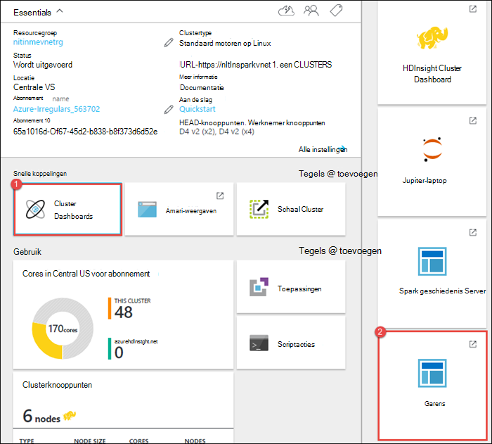

    >[AZURE.TIP] Als alternatief kunt u ook de gebruikersinterface voor het GAREN van de UI Ambari starten. De UI Ambari van de bladeserver cluster starten en klikt u op **Cluster Dashboard**, klik **HDInsight Cluster Dashboard**. Van de UI Ambari **garens**klikt u op, klikt u op **Snelkoppelingen**, klikt u op de actieve resourcemanager en klik op **ResourceManager UI**.  

3. Omdat u het Spark-project met behulp van Jupyter-laptops hebt gestart, wordt de toepassing de naam **remotesparkmagics** (dit is de naam voor alle toepassingen die worden gestart vanuit de laptops) heeft. Klik op de toepassings-ID voor de naam van de toepassing voor meer informatie over de taak. De weergave van de toepassing wordt gestart.

    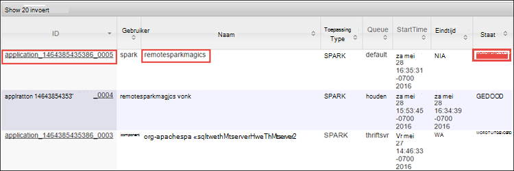

    Voor dergelijke toepassingen die worden gestart vanuit de Jupyter-laptops, de status is altijd **actief** totdat u de laptop afsluit.

4. In de weergave van de toepassing, kunt u inzoomen naar aanleiding van de containers die zijn gekoppeld aan de toepassing en de logboeken (stdout/stderr) uitzoeken. De Spark-gebruikersinterface kunt u ook starten door te klikken op de koppeling overeenkomt met de **URL volgen**, zoals hieronder wordt weergegeven. 

    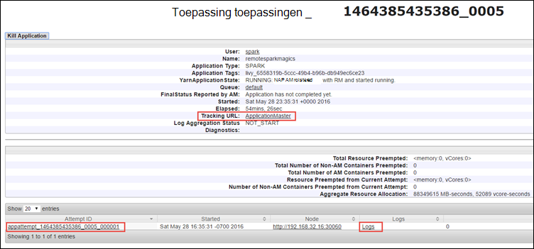

## Een toepassing in de gebruikersinterface van de vonk houden

In de gebruikersinterface van Spark, kunt u inzoomen naar de Spark projecten die worden geïnitieerd door de toepassing die u eerder hebt gestart.

1. Om de gebruikersinterface Spark vanuit de toepassing starten klik op de koppeling tegen de **URL volgen**zoals in de schermopname boven. Hier ziet u alle Spark-taken die worden gestart door de toepassing wordt uitgevoerd in de Jupyter-laptop.

    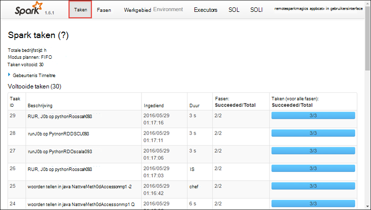

2. Klik op het tabblad **Executors** voor verwerking en opslag van informatie voor elke executor. U kunt ook de call-stack ophalen door te klikken op de koppeling **Thread dumpen** .

    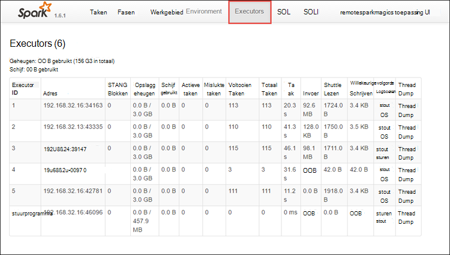
 
3. Klik op het tabblad **fasen** voor de fasen die zijn gekoppeld aan de toepassing.

    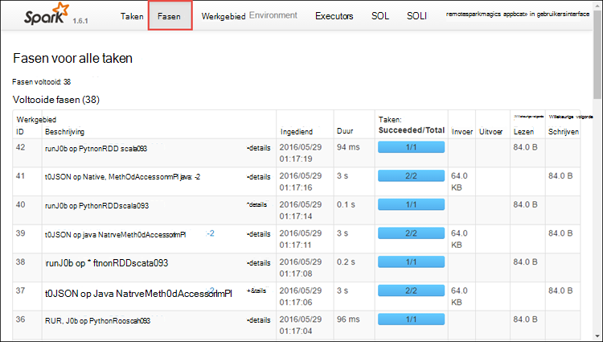

    Elke fase kan hebben meerdere taken waarvoor u statistieken worden uitgevoerd, zoals weergeven kunt hieronder wordt weergegeven.

    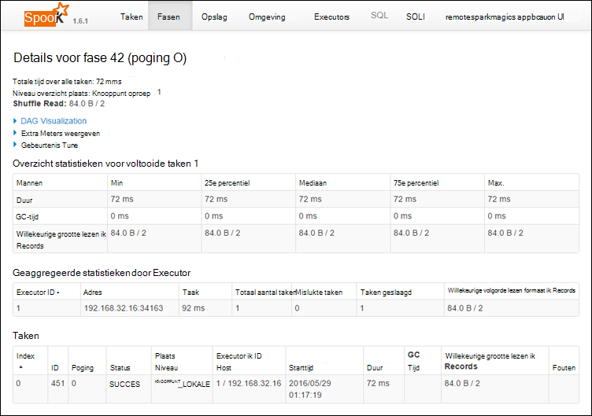 

4. U kunt de detailpagina van fase visualisatie DAG starten. Vouw de **DAG visualisatie** koppeling aan de bovenkant van de pagina, zoals hieronder wordt weergegeven.

    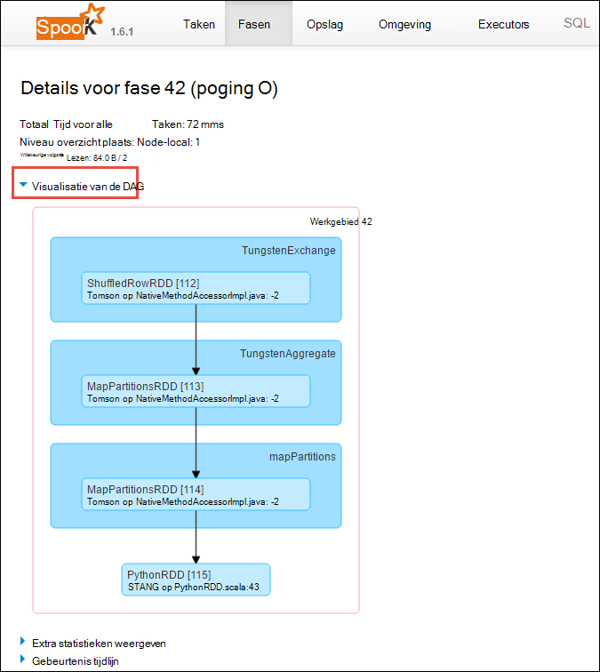

    DAG of directe Aclyic grafiek vertegenwoordigt de verschillende fasen in de toepassing. Elk vak blauw in de grafiek vertegenwoordigt een vonk-bewerking van de toepassing wordt aangeroepen.

5. Op de pagina details stadium kunt u de tijdlijnweergave toepassing starten. Vouw de **Gebeurtenis tijdlijn** koppeling aan de bovenkant van de pagina, zoals hieronder wordt weergegeven.

    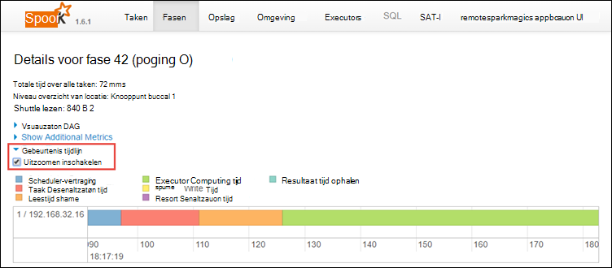

    De Spark-gebeurtenissen worden weergegeven in de vorm van een tijdlijn. De tijdlijnweergave is beschikbaar op drie niveaus in projecten, binnen een project, en binnen een fase. De bovenstaande afbeelding wordt de tijdlijnweergave voor een bepaald stadium vastgelegd.

    >[AZURE.TIP] Als u het selectievakje **Zoomen inschakelen** selecteert, kunt u in de tijdlijnweergave links en rechts schuiven.

6. Andere tabbladen in de gebruikersinterface van de Spark geven nuttige informatie over het Spark-exemplaar.

    * Tabblad opslag - als uw toepassing wordt gemaakt van een RDDs, vindt u informatie over de in het tabblad opslag.
    * Tabblad omgeving - dit tabblad bevat veel nuttige informatie over uw exemplaar van motoren, zoals de 
        * Scala-versie
        * Event logboekdirectory die is gekoppeld aan het cluster
        * Aantal kernen executor voor de toepassing
        * Enz.

## Informatie over voltooide taken met behulp van de Server Spark geschiedenis

Zodra een taak is voltooid, wordt de informatie over de taak in de geschiedenis van Spark Server behouden.

1. De Spark geschiedenis-Server uit de cluster blade starten en klikt u op **Cluster Dashboard** **Spark geschiedenis Server**klikt u vervolgens op.

    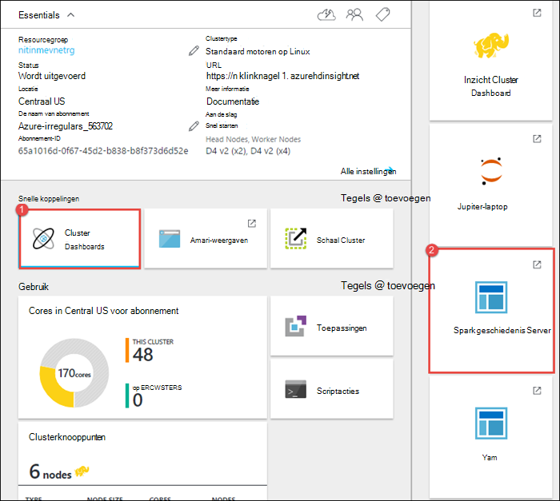

    >[AZURE.TIP] Als alternatief kunt u ook de gebruikersinterface Spark geschiedenis Server van de UI Ambari starten. De UI Ambari van de bladeserver cluster starten en klikt u op **Cluster Dashboard**, klik **HDInsight Cluster Dashboard**. Van de UI Ambari **Spark**klikt u op, klikt u op **Snelkoppelingen**en klik op **Spark geschiedenis Server UI**.

2. Ziet u de voltooide toepassingen weergegeven. Klik op een toepassings-ID om een drilldownbewerking uitvoeren op een toepassing voor meer informatie.

    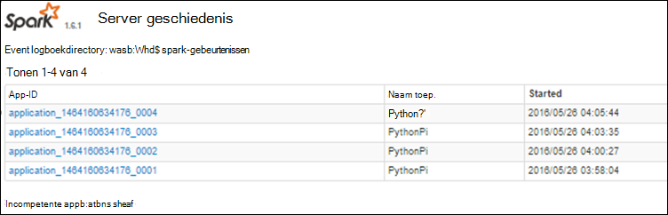
    

## Zie ook

* [Overzicht: Apache Spark op Azure HDInsight](hdinsight-apache-spark-overview.md)

### Scenario 's

* [Motoren met BI: interactieve gegevensanalyse Spark in HDInsight met BI-hulpprogramma's uitvoeren](hdinsight-apache-spark-use-bi-tools.md)

* [Motoren met Machine Learning: Spark in HDInsight voor het analyseren van gebouw temperatuur met behulp van HVAC-gegevens gebruiken](hdinsight-apache-spark-ipython-notebook-machine-learning.md)

* [Motoren met Machine Learning: gebruik Spark in HDInsight te voorspellen resultaten van levensmiddelen controle](hdinsight-apache-spark-machine-learning-mllib-ipython.md)

* [Spark Streaming: Gebruik Spark in HDInsight voor het bouwen van real-time streaming toepassingen](hdinsight-apache-spark-eventhub-streaming.md)

* [Website logboekanalyse met vonkontsteking in HDInsight](hdinsight-apache-spark-custom-library-website-log-analysis.md)

### Maken en uitvoeren van toepassingen

* [Een zelfstandige toepassing maken met Scala](hdinsight-apache-spark-create-standalone-application.md)

* [Taken op afstand uitvoeren op een vonk cluster met behulp van Livius](hdinsight-apache-spark-livy-rest-interface.md)

### Hulpprogramma's en -extensies

* [HDInsight extra Plugin voor IntelliJ IDEE maken en indienen van Spark Scala applicatons gebruiken](hdinsight-apache-spark-intellij-tool-plugin.md)

* [Gebruik HDInsight extra Plugin voor IntelliJ IDEE Spark toepassingen op afstand fouten opsporen](hdinsight-apache-spark-intellij-tool-plugin-debug-jobs-remotely.md)

* [Zeppelin notitieblokken gebruiken met een cluster motoren op HDInsight](hdinsight-apache-spark-use-zeppelin-notebook.md)

* [Kernels die beschikbaar zijn voor de laptop in een cluster voor HDInsight Jupyter](hdinsight-apache-spark-jupyter-notebook-kernels.md)

* [Externe-pakketten gebruiken met Jupyter-laptops](hdinsight-apache-spark-jupyter-notebook-use-external-packages.md)

* [Jupyter op uw computer installeren en verbinding maken met een cluster HDInsight Spark](hdinsight-apache-spark-jupyter-notebook-install-locally.md)

### Bronnen beheren

* [Bronnen voor het cluster Apache Spark in Azure HDInsight beheren](hdinsight-apache-spark-resource-manager.md)
