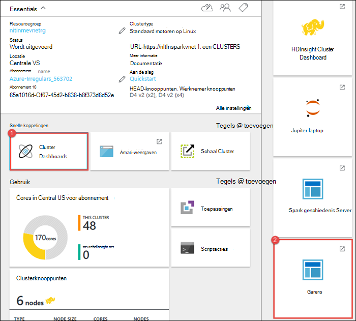
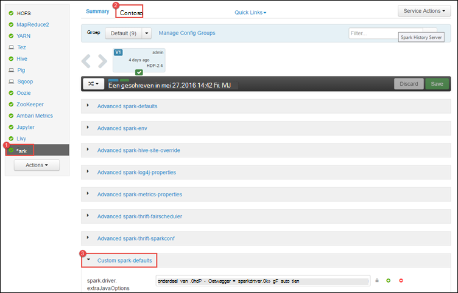
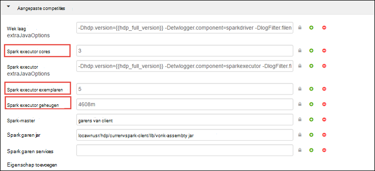
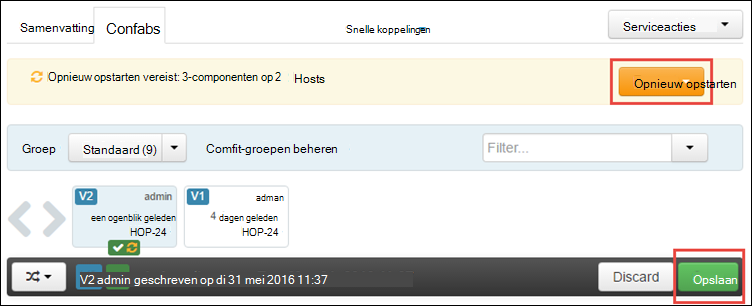
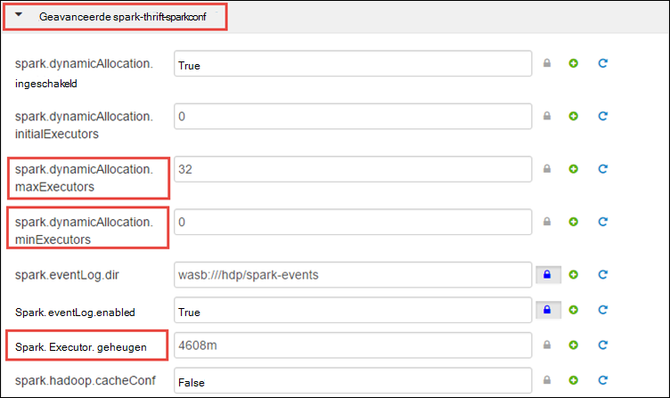
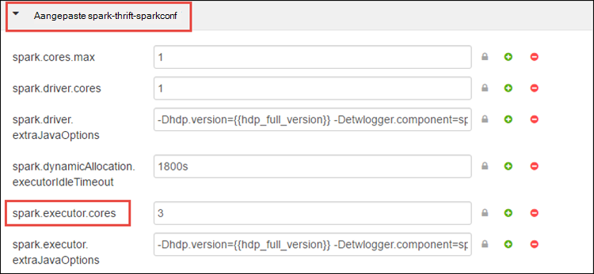
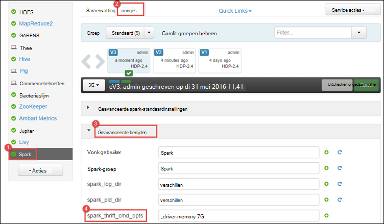
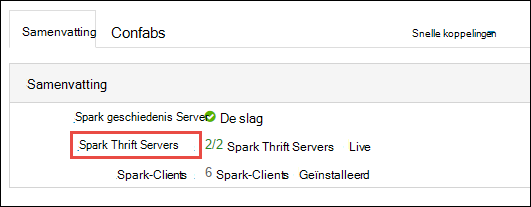
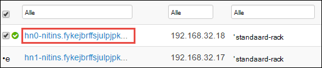
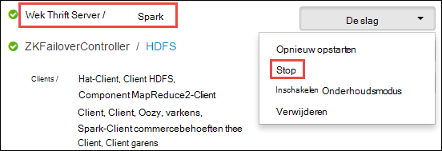

<properties 
    pageTitle="Gebruik resourcemanager resources toewijzen aan het cluster Apache Spark in HDInsight | Microsoft Azure" 
    description="Informatie over het gebruik van de bronnenbeheerder voor Spark clusters op HDInsight voor betere prestaties." 
    services="hdinsight" 
    documentationCenter="" 
    authors="nitinme" 
    manager="jhubbard" 
    editor="cgronlun"
    tags="azure-portal"/>

<tags 
    ms.service="hdinsight" 
    ms.workload="big-data" 
    ms.tgt_pltfrm="na" 
    ms.devlang="na" 
    ms.topic="article" 
    ms.date="08/25/2016" 
    ms.author="nitinme"/>

# Bronnen voor het cluster Apache Spark op HDInsight Linux beheren

In dit artikel leert u hoe u de interfaces zoals Ambari UI, gebruikersinterface, garens, en de geschiedenis Spark Server die is gekoppeld aan het cluster vonk. Ook leert u over het afstellen van de clusterconfiguratie voor optimale prestaties.

**Voorwaarden:**

U hebt de volgende opties:

- Een abonnement op Azure. Zie [Azure krijg gratis proefperiode](https://azure.microsoft.com/documentation/videos/get-azure-free-trial-for-testing-hadoop-in-hdinsight/).
- Een cluster van Apache Spark op HDInsight Linux. Zie [clusters in Azure HDInsight Apache Spark maken](hdinsight-apache-spark-jupyter-spark-sql.md)voor instructies.

## Hoe ik de Ambari Web interface starten?

1. De [Azure Portal](https://portal.azure.com/)van de startboard, klik op de tegel voor uw cluster Spark (als u deze aan de startboard vastgemaakt). U kunt ook navigeren naar het cluster onder **Alle bladeren** > **HDInsight Clusters**. 
 
2. Uit het cluster Spark blade, klikt u op het **Dashboard**. Voer desgevraagd de referenties van de beheerder voor het cluster vonk.

    ![Ambari starten] (./media/hdinsight-apache-spark-resource-manager/hdispark.cluster.launch.dashboard.png "Resource Manager starten")

3. Dit moet de Ambari Web-gebruikersinterface starten zoals hieronder wordt weergegeven.

    ![Ambari Web UI] (./media/hdinsight-apache-spark-resource-manager/ambari-web-ui.png "Ambari Web UI")   

## Hoe ik de geschiedenis van Spark Server starten?

1. De [Azure Portal](https://portal.azure.com/)van de startboard, klik op de tegel voor uw cluster Spark (als u deze aan de startboard vastgemaakt).

2. Van de bladeserver cluster, klikt u op **Cluster Dashboard** **Snelkoppelingen**. Klik op **Spark geschiedenis Server**in het **Cluster Dashboard** -blade.

    ![Spark geschiedenis Server] (./media/hdinsight-apache-spark-resource-manager/launch-history-server.png "Spark geschiedenis Server")

    Voer desgevraagd de referenties van de beheerder voor het cluster vonk.

## Hoe ik de gebruikersinterface van garen starten?

De gebruikersinterface voor het GAREN kunt u toepassingen die momenteel worden uitgevoerd op het cluster Spark controleren. 

1. Uit het cluster blade, klikt u op **Cluster Dashboard**en klik op **garens**.

    

    >[AZURE.TIP] Als alternatief kunt u ook de gebruikersinterface voor het GAREN van de UI Ambari starten. De UI Ambari van de bladeserver cluster starten en klikt u op **Cluster Dashboard**, klik **HDInsight Cluster Dashboard**. Van de UI Ambari **garens**klikt u op, klikt u op **Snelkoppelingen**, klikt u op de actieve resourcemanager en klik op **ResourceManager UI**.

## Wat is de optimale clusterconfiguratie Spark toepassingen uitvoeren?

De drie belangrijkste parameters die kunnen worden gebruikt voor de configuratie van de vonk afhankelijk van de vereisten van de toepassing zijn `spark.executor.instances`, `spark.executor.cores`, en `spark.executor.memory`. Een Executor is een proces gestart voor de toepassing van een vonk. Het wordt uitgevoerd op het knooppunt van de werknemer en die verantwoordelijk zijn voor het uitvoeren van de taken voor de toepassing. Het aantal executors en de grootte van de executor voor elk cluster wordt berekend op basis van het aantal knooppunten van de werknemer en de grootte van het knooppunt werknemer. Deze worden opgeslagen `spark-defaults.conf` op de kop van de clusterknooppunten. 

De drie configuratieparameters kunnen worden geconfigureerd op het clusterniveau (voor alle toepassingen die worden uitgevoerd op het cluster) of voor elke afzonderlijke toepassing ook kunnen worden opgegeven.

### De Ambari UI met parameters wijzigen

1. Klik op **Spark**van de UI Ambari **configuraties**klikt u op en vouw **aangepaste spark-standaardwaarden**.

    

2. De standaardwaarden zijn goed als er 4 Spark toepassingen tegelijkertijd worden uitgevoerd op het cluster. U kunt wijzigingen deze waarden vanuit de gebruikersinterface zoals hieronder wordt weergegeven.

    

3. Klik op **Opslaan** om de wijzigingen in de configuratie opslaan. Aan de bovenkant van de pagina, wordt u gevraagd alle services waarin dit probleem optreedt opnieuw opstarten. Klik op **opnieuw opstarten**.

    

### De parameters voor een toepassing wordt uitgevoerd in Jupyter-laptop

Voor toepassingen die worden uitgevoerd in de laptop Jupyter, kunt u de `%%configure` magic configuratiewijzigingen aan te brengen. In het ideale geval moet u deze wijzigingen aanbrengen aan het begin van de toepassing, voordat u de eerste cel in de code uitvoert. Dit zorgt ervoor dat de configuratie wordt toegepast op de sessie hier, wanneer deze wordt gemaakt. Als u wilt dat de configuratie in een later stadium in de toepassing wilt wijzigen, moet u de `-f` parameter. Door doen, zodat alle voortgang in de toepassing verloren.

In het volgende fragment laat zien hoe de configuratie wijzigen voor een toepassing wordt uitgevoerd in Jupyter.

    %%configure 
    {"executorMemory": "3072M", "executorCores": 4, “numExecutors”:10}

Configuratieparameters moeten worden doorgegeven als een JSON-string en moeten op de volgende regel na de magic, zoals weergegeven in de voorbeeldkolom. 

### De parameters voor een aanvraag ingediend met vonkontsteking indienen wijzigen

Volgende opdracht is een voorbeeld van het wijzigen van de configuratieparameters voor een batch-toepassing die wordt ingediend met behulp van `spark-submit`.

    spark-submit --class <the application class to execute> --executor-memory 3072M --executor-cores 4 –-num-executors 10 <location of application jar file> <application parameters>

### De parameters voor een aanvraag ingediend met krul

Volgende opdracht is een voorbeeld van het wijzigen van de configuratieparameters voor een batch-toepassing die wordt ingediend met behulp van met krul.

    curl -k -v -H 'Content-Type: application/json' -X POST -d '{"file":"<location of application jar file>", "className":"<the application class to execute>", "args":[<application parameters>], "numExecutors":10, "executorMemory":"2G", "executorCores":5' localhost:8998/batches

### Hoe kan ik deze parameters op een Server Spark Thrift wijzigen?

Spark Thrift Server biedt toegang tot een cluster Spark JDBC/ODBC- en service Spark SQL-query's wordt gebruikt. Hulpmiddelen zoals Power BI, Tableau enz. ODBC-protocol gebruiken om te communiceren met vonkontsteking Thrift Server Spark SQL-query's uitvoeren als de toepassing van een vonk. Bij het maken van een cluster Spark twee exemplaren van de vonk Thrift Server zijn gestart, een op elk knooppunt head. Elke Server Spark Thrift wordt weergegeven als een vonk-toepassing in de gebruikersinterface van het GAREN. 

Spark Thrift Server Spark executor dynamische toewijzing gebruikt en dus de `spark.executor.instances` niet wordt gebruikt. In plaats daarvan een Thrift Server maakt gebruik van `spark.dynamicAllocation.minExecutors` en `spark.dynamicAllocation.maxExecutors` geeft het aantal executor. De configuratieparameters `spark.executor.cores` en `spark.executor.memory` wordt gebruikt voor het wijzigen van de grootte executor. U kunt deze parameters wijzigen zoals hieronder wordt weergegeven.

* Vouw de categorie **Geavanceerd spark-thrift-sparkconf** om te werken de parameters `spark.dynamicAllocation.minExecutors`, `spark.dynamicAllocation.maxExecutors`, en `spark.executor.memory`.

     

* Vouw de categorie **aangepast spark-thrift-sparkconf** om te werken met de parameter `spark.executor.cores`.

    

### Hoe wijzig ik het geheugen van de Server van de Thrift Spark

Spark Thrift Server geheugen is ingesteld op 25% van het hoofd knooppunt RAM-geheugen, op voorwaarde dat de totale grootte van het RAM-geheugen van het knooppunt hoofd groter is dan 14GB. U kunt de Ambari UI de geheugenconfiguratie stuurprogramma wijzigen zoals hieronder wordt weergegeven.

* Van de UI Ambari **Spark**klikt u op op **configuraties**, vouw **Advanced spark env**, en geeft u de waarde voor **spark_thrift_cmd_opts**.

    

## Ik gebruik geen BI met vonkontsteking cluster. Hoe ik de middelen terug volgen?

Aangezien we een dynamische toewijzing gebruiken, zijn de enige bronnen die worden gebruikt door de server thrift de middelen voor de toepassing van twee modellen. Deze bronnen vrijkomt, moet u de Thrift Server services op het cluster stoppen.

1. Vanuit de UI Ambari in het linkerdeelvenster op **motoren**.

2. Klik op de volgende pagina **Spark Thrift Servers**.

    

3. Hier ziet u de twee headnodes de Spark Thrift-Server wordt uitgevoerd. Klik op een van de headnodes.

    

4. De volgende pagina geeft een overzicht van alle services die worden uitgevoerd op die headnode. Klik op de vervolgkeuzepijl naast de Spark Thrift Server uit de lijst en klik op **stoppen**.

    

5. Herhaal deze stappen voor de andere headnode ook.

## Mijn Jupyter-laptops worden niet uitgevoerd zoals verwacht. Hoe kan ik de service opnieuw starten

1. De Ambari Web interface starten zoals hierboven is weergegeven. Klik op **Jupyter**van het linkernavigatievenster klikt u op **Acties van de Service**en klikt u op **Alles opnieuw**. Hiermee start u de service Jupyter op alle headnodes.

    ![Opnieuw Jupyter] (./media/hdinsight-apache-spark-resource-manager/restart-jupyter.png "Opnieuw Jupyter")

    

## Zie ook

* [Overzicht: Apache Spark op Azure HDInsight](hdinsight-apache-spark-overview.md)

### Scenario 's

* [Motoren met BI: interactieve gegevensanalyse Spark in HDInsight met BI-hulpprogramma's uitvoeren](hdinsight-apache-spark-use-bi-tools.md)

* [Motoren met Machine Learning: Spark in HDInsight voor het analyseren van gebouw temperatuur met behulp van HVAC-gegevens gebruiken](hdinsight-apache-spark-ipython-notebook-machine-learning.md)

* [Motoren met Machine Learning: gebruik Spark in HDInsight te voorspellen resultaten van levensmiddelen controle](hdinsight-apache-spark-machine-learning-mllib-ipython.md)

* [Spark Streaming: Gebruik Spark in HDInsight voor het bouwen van real-time streaming toepassingen](hdinsight-apache-spark-eventhub-streaming.md)

* [Website logboekanalyse met vonkontsteking in HDInsight](hdinsight-apache-spark-custom-library-website-log-analysis.md)

### Maken en uitvoeren van toepassingen

* [Een zelfstandige toepassing maken met Scala](hdinsight-apache-spark-create-standalone-application.md)

* [Taken op afstand uitvoeren op een vonk cluster met behulp van Livius](hdinsight-apache-spark-livy-rest-interface.md)

### Hulpprogramma's en -extensies

* [HDInsight extra Plugin voor IntelliJ IDEE maken en indienen van Spark Scala applicatons gebruiken](hdinsight-apache-spark-intellij-tool-plugin.md)

* [Gebruik HDInsight extra Plugin voor IntelliJ IDEE Spark toepassingen op afstand fouten opsporen](hdinsight-apache-spark-intellij-tool-plugin-debug-jobs-remotely.md)

* [Zeppelin notitieblokken gebruiken met een cluster motoren op HDInsight](hdinsight-apache-spark-use-zeppelin-notebook.md)

* [Kernels die beschikbaar zijn voor de laptop in een cluster voor HDInsight Jupyter](hdinsight-apache-spark-jupyter-notebook-kernels.md)

* [Externe-pakketten gebruiken met Jupyter-laptops](hdinsight-apache-spark-jupyter-notebook-use-external-packages.md)

* [Jupyter op uw computer installeren en verbinding maken met een cluster HDInsight Spark](hdinsight-apache-spark-jupyter-notebook-install-locally.md)

### Bronnen beheren

* [Spoor en foutopsporing taken die worden uitgevoerd op een cluster van Apache Spark in HDInsight](hdinsight-apache-spark-job-debugging.md)

[hdinsight-versions]: hdinsight-component-versioning.md
[hdinsight-upload-data]: hdinsight-upload-data.md
[hdinsight-storage]: hdinsight-hadoop-use-blob-storage.md

[azure-purchase-options]: http://azure.microsoft.com/pricing/purchase-options/
[azure-member-offers]: http://azure.microsoft.com/pricing/member-offers/
[azure-free-trial]: http://azure.microsoft.com/pricing/free-trial/
[azure-management-portal]: https://manage.windowsazure.com/
[azure-create-storageaccount]: storage-create-storage-account.md 
