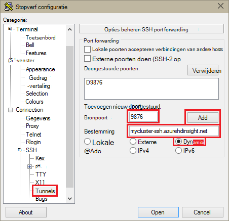
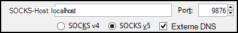
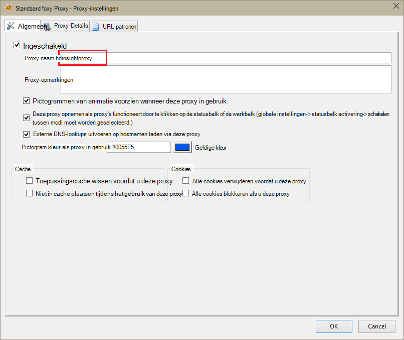
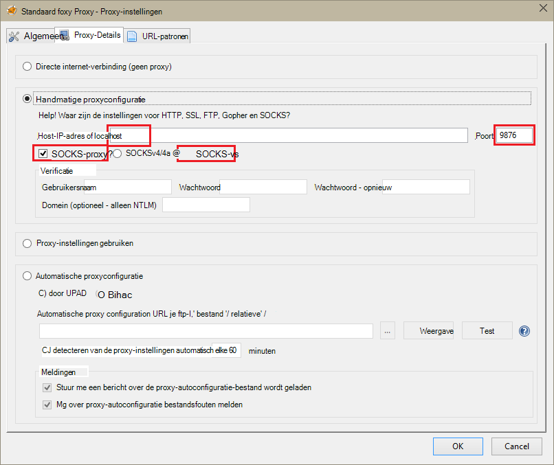
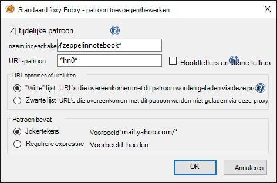
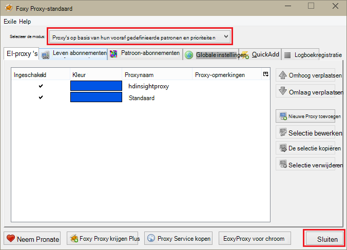

<properties 
    pageTitle="Zeppelin-laptops voor Apache Spark cluster installeren op HDInsight Linux | Microsoft Azure" 
    description="Stapsgewijze instructies voor het installeren en gebruiken van Zeppelin-laptops met vonkontsteking clusters op HDInsight Linux." 
    services="hdinsight" 
    documentationCenter="" 
    authors="nitinme" 
    manager="jhubbard" 
    editor="cgronlun"/>

<tags 
    ms.service="hdinsight" 
    ms.workload="big-data" 
    ms.tgt_pltfrm="na" 
    ms.devlang="na" 
    ms.topic="article" 
    ms.date="10/28/2016" 
    ms.author="nitinme"/>

# Zeppelin-laptops voor Apache Spark cluster installeren op HDInsight Linux

Informatie over het Zeppelin-laptops op Apache Spark clusters installeren en het gebruik van de Zeppelin-laptops Spark taken uitvoeren.

> [AZURE.IMPORTANT] Zeppelin-laptops zijn nu standaard met vonkontsteking clusters beschikbaar. U hoeft niet expliciet ze te installeren op een cluster vonk meer. Zie voor meer informatie, [Gebruik Zeppelin laptops met Apache Spark op HDInsight Linux cluster](hdinsight-apache-spark-zeppelin-notebook.md). 

**Voorwaarden:**

* Voordat u deze zelfstudie hebt u een abonnement op Azure. Zie [Azure krijg gratis proefperiode](https://azure.microsoft.com/documentation/videos/get-azure-free-trial-for-testing-hadoop-in-hdinsight/).
* Een cluster van Apache Spark. Zie [clusters in Azure HDInsight Apache Spark maken](hdinsight-apache-spark-jupyter-spark-sql.md)voor instructies.
* SSH-client. Distributies van Linux en Unix of Macintosh OS X, de `ssh` opdracht wordt geleverd bij het besturingssysteem. Voor Windows, het is raadzaam [stopverf](http://www.chiark.greenend.org.uk/~sgtatham/putty/download.html)

    > [AZURE.NOTE] Als u wilt een SSH-client gebruiken andere dan `ssh` of stopverf, Raadpleeg de documentatie voor de client op het opzetten van een SSH-tunnel.

* Een webbrowser die kan worden geconfigureerd voor het gebruik van een SOCKS-proxy

* __(optioneel)__: een plugin zoals [FoxyProxy](http://getfoxyproxy.org/,) kunt toepassen van regels die alleen specifieke vragen worden gerouteerd via de tunnel.

    > [AZURE.WARNING] Zonder een plugin zoals FoxyProxy kunnen alle aanvragen via de browser worden gerouteerd via de tunnel. Dit kan leiden tot trage laden van webpagina's in uw browser.

## Zeppelin installeren op een cluster met vonkontsteking

U kunt Zeppelin installeren op een vonk cluster met behulp van de scriptactie. Scriptactie worden aangepaste scripts gebruikt om onderdelen te installeren in het cluster dat niet standaard beschikbaar zijn. U kunt het aangepaste script Zeppelin met behulp van HDInsight .NET SDK of met Azure PowerShell installeren vanaf de Portal Azure. U kunt het script installeren Zeppelin als onderdeel van het maken van het cluster, of nadat het cluster actief is. Koppelingen in de onderstaande secties bevatten de instructies voor het doen. 

### Met behulp van de Portal Azure

Zie voor instructies over het gebruik van de Portal Azure uit te voeren scriptactie installeren Zeppelin [clusters van HDInsight aanpassen met behulp van de actie Script](hdinsight-hadoop-customize-cluster-linux.md#use-a-script-action-from-the-azure-portal). U moet enkele wijzigingen aanbrengen in de instructies in dat artikel.

* U moet het script Zeppelin installeren. Het aangepaste script Zeppelin installeren op een cluster motoren op HDInsight is beschikbaar via de volgende koppelingen:
    * Voor clusters Spark 1.6.0-`https://hdiconfigactions.blob.core.windows.net/linuxincubatorzeppelinv01/install-zeppelin-spark160-v01.sh`
    * Voor clusters 1.5.2 Spark-`https://hdiconfigactions.blob.core.windows.net/linuxincubatorzeppelinv01/install-zeppelin-spark151-v01.sh`

* U moet de scriptactie alleen uitvoeren op de headnode.

* Het script heeft geen parameters nodig. 

### Met behulp van HDInsight .NET SDK

Zie voor instructies over het gebruik van HDInsight .NET SDK voor het uitvoeren van de scriptactie installeren Zeppelin [clusters van HDInsight aanpassen met behulp van de actie Script](hdinsight-hadoop-customize-cluster-linux.md#use-a-script-action-from-the-hdinsight-net-sdk). U moet enkele wijzigingen aanbrengen in de instructies in dat artikel.

* U moet het script Zeppelin installeren. Het aangepaste script Zeppelin installeren op een cluster motoren op HDInsight is beschikbaar via de volgende koppelingen:
    * Voor clusters Spark 1.6.0-`https://hdiconfigactions.blob.core.windows.net/linuxincubatorzeppelinv01/install-zeppelin-spark160-v01.sh`
    * Voor clusters 1.5.2 Spark-`https://hdiconfigactions.blob.core.windows.net/linuxincubatorzeppelinv01/install-zeppelin-spark151-v01.sh`

* Het script heeft geen parameters nodig. 

* Stel in het cluster dat u maakt op Spark.

### Azure PowerShell gebruiken

In het volgende fragment van PowerShell gebruiken voor het maken van een cluster Spark op HDInsight Linux met Zeppelin geïnstalleerd. Afhankelijk van de versie van Spark cluster die u hebt, moet u het fragment PowerShell hieronder de link naar het bijbehorende aangepaste script toevoegen bijwerken. 

* Voor clusters Spark 1.6.0-`https://hdiconfigactions.blob.core.windows.net/linuxincubatorzeppelinv01/install-zeppelin-spark160-v01.sh`
* Voor clusters 1.5.2 Spark-`https://hdiconfigactions.blob.core.windows.net/linuxincubatorzeppelinv01/install-zeppelin-spark151-v01.sh`

[AZURE.INCLUDE [upgrade-powershell](../../includes/hdinsight-use-latest-powershell.md)]

    Login-AzureRMAccount
    
    # PROVIDE VALUES FOR THE VARIABLES
    $clusterAdminUsername="admin"
    $clusterAdminPassword="<<password>>"
    $clusterSshUsername="adminssh"
    $clusterSshPassword="<<password>>"
    $clusterName="<<clustername>>"
    $clusterContainerName=$clusterName
    $resourceGroupName="<<resourceGroupName>>"
    $location="<<region>>"
    $storage1Name="<<storagename>>"
    $storage1Key="<<storagekey>>"
    $subscriptionId="<<subscriptionId>>"
    
    Select-AzureRmSubscription -SubscriptionId $subscriptionId
    
    $passwordAsSecureString=ConvertTo-SecureString $clusterAdminPassword -AsPlainText -Force
    $clusterCredential=New-Object System.Management.Automation.PSCredential ($clusterAdminUsername, $passwordAsSecureString)
    $passwordAsSecureString=ConvertTo-SecureString $clusterSshPassword -AsPlainText -Force
    $clusterSshCredential=New-Object System.Management.Automation.PSCredential ($clusterSshUsername, $passwordAsSecureString)
    
    $azureHDInsightConfigs= New-AzureRmHDInsightClusterConfig -ClusterType Spark
    $azureHDInsightConfigs.DefaultStorageAccountKey = $storage1Key
    $azureHDInsightConfigs.DefaultStorageAccountName = "$storage1Name.blob.core.windows.net"
    
    Add-AzureRMHDInsightScriptAction -Config $azureHDInsightConfigs -Name "Install Zeppelin" -NodeType HeadNode -Parameters "void" -Uri "https://hdiconfigactions.blob.core.windows.net/linuxincubatorzeppelinv01/install-zeppelin-spark151-v01.sh"
    
    New-AzureRMHDInsightCluster -Config $azureHDInsightConfigs -OSType Linux -HeadNodeSize "Standard_D12" -WorkerNodeSize "Standard_D12" -ClusterSizeInNodes 2 -Location $location -ResourceGroupName $resourceGroupName -ClusterName $clusterName -HttpCredential $clusterCredential -DefaultStorageContainer $clusterContainerName -SshCredential $clusterSshCredential -Version "3.3"
 
## SSH tunneling voor toegang tot een Zeppelin notitieblok instellen

U kunt SSH tunnels toegang krijgen tot de Zeppelin-laptops op een cluster op HDInsight Linux. De onderstaande stappen om het maken van een SSH-tunnel met ssh opdrachtregel (Linux) en PuTTY (Windows).

### Maken van een tunnel met de opdracht SSH (Linux)

Gebruik de volgende opdracht maakt u een SSH-tunnel met behulp van de `ssh` opdracht. __Gebruikersnaam__ vervangen door een SSH-gebruiker voor uw cluster HDInsight en __CLUSTERNAAM__ vervangen door de naam van het cluster HDInsight

    ssh -C2qTnNf -D 9876 USERNAME@CLUSTERNAME-ssh.azurehdinsight.net

Hiermee maakt u een verbinding die verkeer naar de lokale poort 9876 aan het cluster worden doorgestuurd via SSH. De opties zijn:

* **D 9876** - de lokale poort die het doorsturen van verkeer via de tunnel.

* **C** - alle gegevens comprimeren omdat webverkeer voornamelijk uit tekst wordt.

* **2** - force SSH protocol versie 2 alleen proberen.

* **q** - stille modus.

* **T** - pseudo-tty toewijzing uitschakelen, omdat we alleen van een haven doorsturen.

* **n** - te voorkomen dat het lezen van STDIN, omdat we alleen van een haven doorsturen.

* **N** - een externe opdracht niet uitvoeren omdat we alleen van een haven doorsturen.

* **f** - op de achtergrond uitgevoerd.

Als u het cluster hebt geconfigureerd met een SSH-sleutel, moet u wellicht gebruik de `-i` parameter en geeft u het pad naar de persoonlijke sleutel voor SSH.

Nadat de opdracht is voltooid, wordt verkeer verzonden naar poort 9876 op de lokale computer worden gerouteerd via wordt Secure Sockets Layer (SSL) aan het cluster knooppunt head en er afkomstig lijken te zijn.

### Maken van een tunnel met PuTTY (Windows)

Gebruik de volgende stappen voor het maken van een SSH-tunnel met stopverf.

1. Open PuTTY en geef de verbindingsgegevens. Als u niet bekend met stopverf bent, Zie [Gebruiken SSH met Linux-gebaseerde Hadoop op HDInsight van Windows](hdinsight-hadoop-linux-use-ssh-windows.md) voor informatie over het gebruik in combinatie met HDInsight.

2. In de sectie **categorie** aan de linkerkant van het dialoogvenster **verbinding**Vouw, uit van **SSH**en selecteer vervolgens de **Tunnels**.

3. Geef de volgende gegevens op het formulier **Opties beheren SSH port forwarding** :

    * **Bronpoort** - de poort op de client die u wilt doorsturen. Bijvoorbeeld **9876**.

    * **Bestemming** - de SSH-adres voor het cluster Linux-gebaseerde HDInsight. Bijvoorbeeld **mijncluster ssh.azurehdinsight.net**.

    * **Dynamische** - schakelt dynamische SOCKS-proxy-routering.

    

4. Klik op **toevoegen** om de instellingen en klik vervolgens op **openen** als u wilt openen een SSH-verbinding.

5. Wanneer dat wordt gevraagd, aanmelden bij de server. Dit zal een SSH-sessie tot stand brengen en inschakelen van de tunnel.

### De tunnel vanuit uw browser gebruiken

> [AZURE.NOTE] De stappen in deze sectie gebruikt de FireFox-browser is vrij beschikbaar voor Linux, Unix, Macintosh OS X en Windows-systemen. Andere moderne browsers zoals Google Chrome, Microsoft Edge of Apple Safari werkt zo goed; echter, de invoegtoepassing voor FoxyProxy gebruikt in enkele stappen mogelijk niet beschikbaar voor alle browsers.

1. De browser voor het gebruik van **localhost:9876** als een **SOCKS v5** proxy configureren. Hier ziet u hoe de instellingen van Firefox eruit. Als u een andere poort dan 9876 gebruikt, moet u de poort wijzigen in die u gebruikt:

    

    > [AZURE.NOTE] Selecteren van **Externe DNS** oplossing Domain Name System (DNS) aanvragen met behulp van het cluster HDInsight. Als dit niet geselecteerd is, wordt DNS lokaal worden opgelost.

2. Controleer of dat verkeer wordt omgeleid via de tunnel door een site zoals [http://www.whatismyip.com/](http://www.whatismyip.com/) vising met de proxy-instellingen in- en uitgeschakeld in Firefox. Terwijl de instellingen zijn ingeschakeld, worden het IP-adres voor een machine in het datacenter Microsoft Azure.

### Browser-extensies

Tijdens het configureren van de browser voor het gebruik van de tunnel werkt, wilt u niet meestal al het verkeer via de tunnel te routeren. Browser-extensies zoals [FoxyProxy](http://getfoxyproxy.org/) ondersteuning voor URL-aanvragen voor patroonovereenkomsten (FoxyProxy Standard of Plus alleen), zodat alleen aanvragen voor specifieke URL's via de tunnel wordt verzonden.

Als u FoxyProxy Standard hebt geïnstalleerd, gebruikt u de volgende stappen te configureren voor het doorsturen van verkeer alleen voor HDInsight via de tunnel.

1. De extensie FoxyProxy in uw browser openen. Bijvoorbeeld in Firefox, selecteert u het pictogram naast het adresveld van FoxyProxy.

    

2. Selecteer **Nieuwe Proxy toevoegen**, selecteer het tabblad **Algemeen** en voer vervolgens de proxynaam van een van **HDInsightProxy**.

    

3. Selecteer het tabblad **Proxy Details** en vul de volgende velden:

    * **Host of het IP-adres** - dit is localhost, aangezien we een SSH-tunnel op de lokale computer gebruiken.

    * **Poort** - dit is de poort die u voor de tunnel SSH gebruikt.

    * **SOCKS-proxy** - Selecteer deze optie om de browser naar de tunnel als een proxy te gebruiken.

    * **SOCKS v5** - Selecteer deze optie om de vereiste versie voor de proxy instellen.

    

4. Selecteer het tabblad **URL-patronen** en selecteer vervolgens **Nieuw patroon toevoegen**. Gebruik de volgende definieert het patroon en klik vervolgens op **OK**:

    * **Naam van patroon** - **zeppelinnotebook** - dit is alleen een beschrijvende naam voor het patroon.

    * **URL-patroon** - **\*hn0** * - Hiermee definieert u een patroon dat overeenkomt met de interne FQDN-naam van het eindpunt waar de Zeppelin-laptops worden gehost. Zeppelin-laptops zijn alleen beschikbaar op de headnode0 van het cluster, en het eindpunt is meestal `http://hn0-<string>.internal.cloudapp.net`, met behulp van het patroon * *hn0** zou ervoor zorgen dat de aanvraag wordt omgeleid naar het eindpunt van de Zeppelin.

        

4. Klik op **OK** als u wilt toevoegen van de proxy en **Proxy-instellingen**te sluiten.

5. Aan de bovenkant van het dialoogvenster FoxyProxy **Selecteer modus** wijzigen naar **Gebruik proxy's op basis van hun vooraf gedefinieerde patronen en prioriteiten**en klik vervolgens op **sluiten**.

    

Na het volgen van deze stappen worden alleen aanvragen voor URL's met de tekenreeks __hn0__ gerouteerd via de SSL-tunnel. 

## Toegang tot de Zeppelin-laptop

Zodra u SSH tunneling setup hebt, kunt u de volgende stappen Zeppelin laptop op het cluster Spark door de onderstaande stappen uit om toegang tot. In dit gedeelte ziet u hoe sql % en % component-instructies uit te voeren.

1. Open in de webbrowser het volgende eindpunt:

        http://hn0-myspar:9995

    * **hn0** geeft headnode0
    * **myspar** is de eerste zes letters van de naam van een cluster.
    * **9995** is de poort waar de laptop Zeppelin toegankelijk is.

2. Een nieuw notitieblok maken. Vanuit het deelvenster kop op **notitieblok**en klik vervolgens op **Nieuwe notitie maken**.

    ![Een nieuw Zeppelin notitieblok maken] (./media/hdinsight-apache-spark-use-zeppelin-notebook/hdispark.createnewnote.png "Een nieuw Zeppelin notitieblok maken")

    Op dezelfde pagina onder het kopje **laptop** moet u een nieuw notitieblok zien met de naam beginnen met een **Opmerking XXXXXXXXX**. Klik op de nieuwe laptop.

3. Op de webpagina voor het nieuwe notitieblok, klikt u op de kop en de naam van het notitieblok als u wilt wijzigen. Druk op ENTER om op te slaan, het wijzigen van de naam. Controleer ook of dat de koptekst van de laptop toont de status van een **verbonden** in de rechterbovenhoek.

    ![Status van zeppelin-laptop] (./media/hdinsight-apache-spark-use-zeppelin-notebook/hdispark.newnote.connected.png "Status van zeppelin-laptop")

### SQL-instructies uitvoeren

4. Voorbeeldgegevens worden geladen in een tijdelijke tabel. Wanneer u een cluster Spark in HDInsight maakt, wordt het voorbeeldgegevensbestand, **hvac.csv**, aan de account gekoppeld opslag onder **\HdiSamples\SensorSampleData\hvac**gekopieerd.

    In de lege alinea die standaard in de nieuwe laptop is gemaakt, plak het volgende fragment.

        // Create an RDD using the default Spark context, sc
        val hvacText = sc.textFile("wasbs:///HdiSamples/HdiSamples/SensorSampleData/hvac/HVAC.csv")
        
        // Define a schema
        case class Hvac(date: String, time: String, targettemp: Integer, actualtemp: Integer, buildingID: String)
        
        // Map the values in the .csv file to the schema
        val hvac = hvacText.map(s => s.split(",")).filter(s => s(0) != "Date").map(
            s => Hvac(s(0), 
                    s(1),
                    s(2).toInt,
                    s(3).toInt,
                    s(6)
            )
        ).toDF()
        
        // Register as a temporary table called "hvac"
        hvac.registerTempTable("hvac")
        
    Druk op **SHIFT + ENTER** of klik op de knop **afspelen** voor de alinea uit te voeren in het fragment. De status in de rechterbenedenhoek van de alinea moet de voortgang van READY, in AFWACHTING van actief in GEREEDGEMELD. De uitvoer wordt weergegeven onder aan dezelfde alinea. Het screenshot ziet er als volgt uit:

    ![Maak een tijdelijke tabel uit onbewerkte gegevens] (./media/hdinsight-apache-spark-use-zeppelin-notebook/hdispark.note.loaddDataintotable.png "Maak een tijdelijke tabel uit onbewerkte gegevens")

    U kunt ook een titel aan elke alinea opgeven. Klik op **het pictogram** in de rechter bovenhoek en klik vervolgens op **Titel weergeven**.

5. U kunt nu Spark SQL-instructies uitvoeren op de tabel **voor installaties** . De volgende query plakken in een nieuwe alinea. De query haalt de ID van het gebouw en het verschil tussen het doel en de werkelijke temperatuur voor elke bouwen op een bepaalde datum. Druk op **SHIFT + ENTER**.

        %sql
        select buildingID, (targettemp - actualtemp) as temp_diff, date 
        from hvac
        where date = "6/1/13" 

    **% Sql** -instructie aan het begin geeft aan dat de laptop de interpreter Spark SQL te gebruiken. U kunt de gedefinieerde tolken van het tabblad **Interpreter** in de koptekst van de laptop kijken.

    De volgende schermafbeelding ziet u de uitvoer.

    ![Uitvoeren van een vonk SQL-instructie met behulp van de laptop] (./media/hdinsight-apache-spark-use-zeppelin-notebook/hdispark.note.sparksqlquery1.png "Uitvoeren van een vonk SQL-instructie met behulp van de laptop")

     Klik op de weergave-opties (gemarkeerd in de rechthoek) om te schakelen tussen verschillende weergaven voor hetzelfde resultaat op. Klik op **Instellingen** als u wilt kiezen welke consitutes de sleutel en de waarden in de uitvoer. De schermopname hierboven gebruikt **buildingID** als de sleutel en het gemiddelde van de **temp_diff** als de waarde.

    
6. Ook kunt u een SQL-instructies die variabelen gebruiken in de query uitvoeren. In het volgende fragment laat zien hoe de **Temp**-variabele definiëren in de query met de mogelijke waarden die u wilt opvragen met. Wanneer u de query voor het eerst uitvoert, wordt een vervolgkeuzelijst wordt automatisch gevuld met de waarden die u hebt opgegeven voor de variabele.

        %sql
        select buildingID, date, targettemp, (targettemp - actualtemp) as temp_diff
        from hvac
        where targettemp > "${Temp = 65,65|75|85}" 

    In dit fragment plakken in een nieuwe alinea en druk op **SHIFT + ENTER**. De volgende schermafbeelding ziet u de uitvoer.

    ![Uitvoeren van een vonk SQL-instructie met behulp van de laptop] (./media/hdinsight-apache-spark-use-zeppelin-notebook/hdispark.note.sparksqlquery2.png "Uitvoeren van een vonk SQL-instructie met behulp van de laptop")

    Voor volgende aanvragen kunt u een nieuwe waarde selecteren in de vervolgkeuzelijst en voer de query opnieuw uit. Klik op **Instellingen** als u wilt kiezen welke consitutes de sleutel en de waarden in de uitvoer. De bovenstaande schermopname gebruikt **buildingID** als de sleutel, het gemiddelde van de **temp_diff** als de waarde en de **targettemp** als de groep.

7. Start de SQL Spark-interpreter om de toepassing af te sluiten. Klik op het tabblad **Interpreter** boven en voor de interpreter Spark, klikt u op **opnieuw opstarten**.

    ![Opnieuw opstarten van de Zeppelin-intepreter] (./media/hdinsight-apache-spark-use-zeppelin-notebook/hdispark.zeppelin.restart.interpreter.png "Opnieuw opstarten van de Zeppelin-intepreter")

### Component-instructies uitvoeren

1. Klik op de knop **Interpreter** uit het notitieblok Zeppelin.

    ![Interpreter update-component] (./media/hdinsight-apache-spark-use-zeppelin-notebook/zeppelin-update-hive-interpreter-1.png "Interpreter update-component")

2. De interpreter **component** , klikt u op **bewerken**.

    ![Interpreter update-component] (./media/hdinsight-apache-spark-use-zeppelin-notebook/zeppelin-update-hive-interpreter-2.png "Interpreter update-component")

    De volgende eigenschappen bijwerken.

    * **Default.password** op de door u opgegeven wachtwoord voor de beheerder ingesteld tijdens het maken van het cluster HDInsight Spark.
    * **Default.url** ingesteld op `jdbc:hive2://<spark_cluster_name>.azurehdinsight.net:443/default;ssl=true?hive.server2.transport.mode=http;hive.server2.thrift.http.path=/hive2`. Vervangen ** \<spark_cluster_name >** met de naam van het cluster vonk.
    * **Default.user** instellen op de naam van de admin-gebruiker die u hebt opgegeven tijdens het maken van het cluster. Bijvoorbeeld *admin*.

3. Klik op **Opslaan** en opnieuw opstarten van de interpreter component, klik op **OK**.

4. Een nieuw notitieblok maken en voer de volgende instructie waarmee de component tabellen op het cluster.

        %hive
        SHOW TABLES

    Een HDInsight-cluster heeft een voorbeeldtabel **hivesampletable** aangeroepen zodat u de volgende uitvoer moet zien.

    ![Component output] (./media/hdinsight-apache-spark-use-zeppelin-notebook/zeppelin-update-hive-interpreter-3.png "Component output")

5. Voer de volgende instructie om de records in de tabel.

        %hive
        SELECT * FROM hivesampletable LIMIT 5

    U moet de volgende uitvoer.

    ![Component output] (./media/hdinsight-apache-spark-use-zeppelin-notebook/zeppelin-update-hive-interpreter-4.png "Component output")

## Zie ook

* [Overzicht: Apache Spark op Azure HDInsight](hdinsight-apache-spark-overview.md)

### Scenario 's

* [Motoren met BI: interactieve gegevensanalyse Spark in HDInsight met BI-hulpprogramma's uitvoeren](hdinsight-apache-spark-use-bi-tools.md)

* [Motoren met Machine Learning: Spark in HDInsight voor het analyseren van gebouw temperatuur met behulp van HVAC-gegevens gebruiken](hdinsight-apache-spark-ipython-notebook-machine-learning.md)

* [Motoren met Machine Learning: gebruik Spark in HDInsight te voorspellen resultaten van levensmiddelen controle](hdinsight-apache-spark-machine-learning-mllib-ipython.md)

* [Spark Streaming: Gebruik Spark in HDInsight voor het bouwen van real-time streaming toepassingen](hdinsight-apache-spark-eventhub-streaming.md)

* [Website logboekanalyse met vonkontsteking in HDInsight](hdinsight-apache-spark-custom-library-website-log-analysis.md)

### Maken en uitvoeren van toepassingen

* [Een zelfstandige toepassing maken met Scala](hdinsight-apache-spark-create-standalone-application.md)

* [Taken op afstand uitvoeren op een vonk cluster met behulp van Livius](hdinsight-apache-spark-livy-rest-interface.md)

### Hulpprogramma's en -extensies

* [HDInsight extra Plugin voor IntelliJ IDEE maken en indienen van Spark Scala applicatons gebruiken](hdinsight-apache-spark-intellij-tool-plugin.md)

* [Gebruik HDInsight extra Plugin voor IntelliJ IDEE Spark toepassingen op afstand fouten opsporen](hdinsight-apache-spark-intellij-tool-plugin-debug-jobs-remotely.md)

* [Kernels die beschikbaar zijn voor de laptop in een cluster voor HDInsight Jupyter](hdinsight-apache-spark-jupyter-notebook-kernels.md)

* [Externe-pakketten gebruiken met Jupyter-laptops](hdinsight-apache-spark-jupyter-notebook-use-external-packages.md)

* [Jupyter op uw computer installeren en verbinding maken met een cluster HDInsight Spark](hdinsight-apache-spark-jupyter-notebook-install-locally.md)

### Bronnen beheren

* [Bronnen voor het cluster Apache Spark in Azure HDInsight beheren](hdinsight-apache-spark-resource-manager.md)

* [Spoor en foutopsporing taken die worden uitgevoerd op een cluster van Apache Spark in HDInsight](hdinsight-apache-spark-job-debugging.md)

[hdinsight-versions]: hdinsight-component-versioning.md
[hdinsight-upload-data]: hdinsight-upload-data.md
[hdinsight-storage]: hdinsight-hadoop-use-blob-storage.md

[azure-purchase-options]: http://azure.microsoft.com/pricing/purchase-options/
[azure-member-offers]: http://azure.microsoft.com/pricing/member-offers/
[azure-free-trial]: http://azure.microsoft.com/pricing/free-trial/
[azure-management-portal]: https://manage.windowsazure.com/
[azure-create-storageaccount]: storage-create-storage-account.md 

