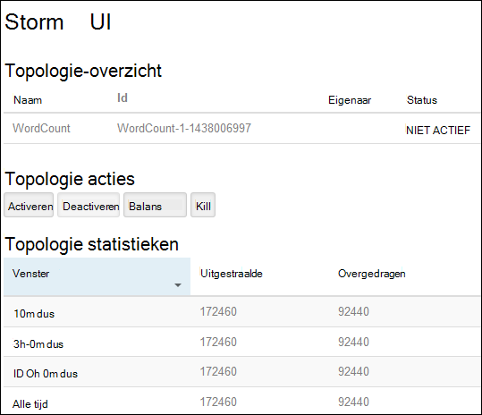
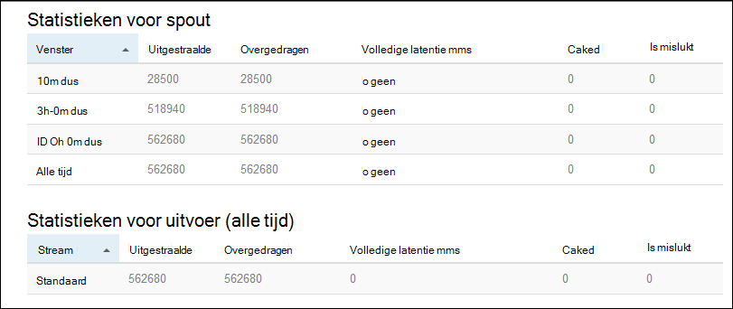

<properties
    pageTitle="Apache Storm zelfstudie: aan de slag met Linux-gebaseerde Storm op HDInsight | Microsoft Azure"
    description="Aan de slag met big data analytics met Apache Storm en Storm Starter monsters op Linux-gebaseerde HDInsight. Storm gebruiken om gegevens te verwerken real-time informatie."
    keywords="storm Apache, apache storm zelfstudie, big data analytics, storm starter"
    services="hdinsight"
    documentationCenter=""
    authors="Blackmist"
    manager="jhubbard"
    editor="cgronlun"/>

<tags
   ms.service="hdinsight"
   ms.devlang="java"
   ms.topic="get-started-article"
   ms.tgt_pltfrm="na"
   ms.workload="big-data"
   ms.date="10/12/2016"
   ms.author="larryfr"/>

# Apache Storm zelfstudie: aan de slag met de Storm Starter monsters voor big data analytics op HDInsight

Apache Storm is een schaalbare, fouttolerantie, gedistribueerde en real-time berekening systeem voor het stromen van gegevens verwerken. Met de Storm in Azure, HDInsight, kunt u een cloud-gebaseerde Storm cluster die big data analytics in real time uitvoert.

> [AZURE.NOTE] De stappen in dit artikel wordt een HDInsight op basis van Linux-cluster maken. Zie voor stapsgewijze instructies voor het maken van een op Windows gebaseerde Storm op de cluster HDInsight [Apache Storm zelfstudie: aan de slag met de Storm Starter monster met behulp van data-analytics op HDInsight](hdinsight-apache-storm-tutorial-get-started.md)

## Vereisten

[AZURE.INCLUDE [delete-cluster-warning](../../includes/hdinsight-delete-cluster-warning.md)]

Hiervoor hebt u het volgende te kunnen voltooien van deze zelfstudie Storm Apache:

- **Azure een abonnement**. Zie [Azure krijg gratis proefperiode](https://azure.microsoft.com/documentation/videos/get-azure-free-trial-for-testing-hadoop-in-hdinsight/).

- **Vertrouwdheid met SSH en SCP**. Zie de volgende onderwerpen voor meer informatie over het gebruik van SSH en SCP met HDInsight:

    - **Linux, Unix of OS X-clients**: Zie [Gebruik SSH met Linux-gebaseerde Hadoop op HDInsight van Linux, OS X en Unix](hdinsight-hadoop-linux-use-ssh-unix.md)

    - **Windows-clients**: Zie [Gebruik SSH met Linux-gebaseerde Hadoop op HDInsight van Windows](hdinsight-hadoop-linux-use-ssh-windows.md)

### Access controle-eisen

[AZURE.INCLUDE [access-control](../../includes/hdinsight-access-control-requirements.md)]

## Maak een cluster Storm

In dit gedeelte vindt u een HDInsight versie 3.2 cluster (Storm versie 0.9.3) maken met behulp van een sjabloon Azure Resource Manager. Zie voor meer informatie over de versies HDInsight en hun SLA's [HDInsight component versiebeheer](hdinsight-component-versioning.md). Zie voor andere methoden voor het maken van cluster [-clusters maken HDInsight](hdinsight-hadoop-provision-linux-clusters.md).

1. Klik op de onderstaande afbeelding om de sjabloon te openen in de portal voor Azure.         

    
    
    De sjabloon bevindt zich in een openbare blob container *https://hditutorialdata.blob.core.windows.net/armtemplates/create-linux-based-storm-cluster-in-hdinsight.json*. 
   
2. Voer de volgende gegevens van de bladeserver Parameters:

    - **Clusternaam**: Voer een naam voor het Hadoop-cluster dat u wilt maken.
    - **Cluster-aanmeldingsnaam en wachtwoord**: beheerder de aanmeldingsnaam van de standaard is.
    - **SSH-gebruikersnaam en wachtwoord**.
    
    Schrijf deze waarden.  U moet ze later in de zelfstudie.

    > [AZURE.NOTE] SSH wordt gebruikt om op afstand toegang tot de HDInsight-cluster met behulp van een opdrachtregel. De gebruikersnaam en het wachtwoord dat u hier gebruikt, wordt gebruikt wanneer een verbinding met het cluster via SSH. Ook moet de SSH-gebruikersnaam uniek zijn, zoals een gebruikersaccount wordt gemaakt op alle clusterknooppunten van HDInsight. De volgende zijn enkele van de accountnamen gereserveerd voor gebruik door de services op het cluster en kan niet worden gebruikt als de naam van de gebruiker SSH:
    >
    > Root, hdiuser, storm, hbase, ubuntu, zookeeper, hdfs, garen, mapred, hbase, component, oozie, falcon, sqoop, admin, tez, hcat, hdinsight-zookeeper.

    > Zie voor meer informatie over het gebruik van SSH in HDInsight, een van de volgende artikelen:

    > * [SSH gebruiken met Linux-gebaseerde Hadoop op HDInsight van Linux, Unix of OS X](hdinsight-hadoop-linux-use-ssh-unix.md)
    > * [SSH met Linux-gebaseerde Hadoop op HDInsight van Windows gebruiken](hdinsight-hadoop-linux-use-ssh-windows.md)

    
3. Klik op **OK** om op te slaan van de parameters.

4. uit de **aangepaste implementatie** blade, klikt u op de vervolgkeuzelijst **resourcegroep** en klik vervolgens op **Nieuw** om een nieuwe resourcegroep maken. De resourcegroep is een container waarin de account afhankelijk opslag en andere gekoppelde bron van het cluster worden gegroepeerd.

5. op **juridische voorwaarden**en klik vervolgens op **maken**.

6. Klik op **maken**. Ziet u een nieuwe tegel met de titel Submitting implementatie voor de implementatie van de sjabloon. Duurt ongeveer 20 minuten over het maken van het cluster en de SQL-database.

##Een voorbeeld van een Storm Starter worden uitgevoerd op HDInsight

De [storm starter](https://github.com/apache/storm/tree/master/examples/storm-starter) voorbeelden zijn opgenomen in het cluster HDInsight. U kunt het voorbeeld WordCount wordt uitgevoerd in de volgende stappen.

1. Verbinding maken met het HDInsight-cluster met behulp van SSH:

        ssh USERNAME@CLUSTERNAME-ssh.azurehdinsight.net
        
    Als u een wachtwoord voor het beveiligen van uw gebruikersaccount SSH gebruikt, wordt u gevraagd in te voeren. Als u een openbare sleutel gebruikt, kan er gebruik van de `-i` parameter geeft de overeenkomende persoonlijke sleutel. Bijvoorbeeld `ssh -i ~/.ssh/id_rsa USERNAME@CLUSTERNAME-ssh.azurehdinsight.net`.
        
    Raadpleeg de volgende artikelen voor meer informatie over het gebruik van SSH in Linux-gebaseerde HDInsight:
    
    * [SSH gebruiken met Linux-gebaseerde Hadoop op HDInsight van Linux, Unix of OS X](hdinsight-hadoop-linux-use-ssh-unix.md)

    * [SSH met Linux-gebaseerde Hadoop op HDInsight van Windows gebruiken](hdinsight-hadoop-linux-use-ssh-windows)

2. Gebruik de volgende opdracht start u een topologie:

        storm jar /usr/hdp/current/storm-client/contrib/storm-starter/storm-starter-topologies-*.jar storm.starter.WordCountTopology wordcount
        
    > [AZURE.NOTE] De `*` gedeelte van de bestandsnaam is die overeenkomt met het versienummer, verandert als de HDInsight wordt bijgewerkt.

    Hiermee start u de topologie WordCount op het cluster, met een beschrijvende naam 'wordcount'. Willekeurig worden genereren zinnen en tellen van elk woord in de zinnen.

    > [AZURE.NOTE] Bij de indiening van de topologie van het cluster, moet u eerst kopiëren het jar-bestand met het cluster voordat u de `storm` opdracht. Dit kunt u doen met behulp van de `scp` van de client waar het bestand zich bevindt. Bijvoorbeeld:`scp FILENAME.jar USERNAME@CLUSTERNAME-ssh.azurehdinsight.net:FILENAME.jar`
    >
    > In het voorbeeld WordCount en andere voorbeelden van de starter storm zijn al opgenomen in het cluster op `/usr/hdp/current/storm-client/contrib/storm-starter/`.

##De topologie controleren

De Storm-gebruikersinterface biedt een web-interface voor het werken met topologieën uitgevoerd en is opgenomen in het cluster HDInsight.

Gebruik de volgende stappen uit voor het controleren van de topologie die met behulp van de gebruikersinterface voor de Storm:

1. Open een webbrowser naar https://CLUSTERNAME.azurehdinsight.net/stormui, waar de __CLUSTERNAAM__ de naam van het cluster is. Hiermee opent u de Storm-gebruikersinterface.

    > [AZURE.NOTE] Als een gebruikersnaam en wachtwoord wordt gevraagd, voert u Clusterbeheer (admin) en wachtwoord dat u wanneer gebruikt u het cluster maakt.

2. Selecteer onder **Samenvatting topologie**, de **wordcount** vermelding in de kolom **naam** . Hierdoor wordt meer informatie over de topologie weergegeven.

    

    Deze pagina bevat de volgende informatie:

    * **Topologie statistieken** - basisgegevens over de prestaties van de topologie, ingedeeld in tijdvensters.

        > [AZURE.NOTE] Selecteren van een specifieke tijdvenster verandert het tijdvenster voor informatie in andere secties van de pagina weergegeven.

    * **Spouts** - informatie over spouts, met inbegrip van de laatste fout die door elke spout.

    * **Bolts** - basisinformatie over bouten.

    * **Topologie, configuratie** - informatie over de topologieconfiguratie.

    Deze pagina bevat ook acties die kunnen worden genomen op de topologie:

    * **Activate** - verwerking van een gedeactiveerde topologie wordt hervat.

    * **Deactivate** - pauzeert een topologie uitgevoerd.

    * **Balans** - Hiermee past u de evenwijdigheid van de topologie. Nadat u het aantal knooppunten in het cluster hebt gewijzigd, moet u lopende topologieën opnieuw. Hierdoor wordt de topologie aanpassen parallellisme ter compensatie van de gestegen/gedaald aantal knooppunten in het cluster. Zie [Wat is de evenwijdigheid van een topologie Storm](http://storm.apache.org/documentation/Understanding-the-parallelism-of-a-Storm-topology.html)voor meer informatie.

    * **Kill** - eindigt een topologie Storm na de opgegeven time-out.

3. Selecteer een item in de sectie **Spouts** of **Bolts** op deze pagina. Hiermee wordt informatie over het geselecteerde onderdeel weergegeven.

    

    Deze pagina bevat de volgende informatie:

    * **Spout/bout statistieken** - basisgegevens over de prestaties van de component in tijdvensters georganiseerd.

        > [AZURE.NOTE] Selecteren van een specifieke tijdvenster verandert het tijdvenster voor informatie in andere secties van de pagina weergegeven.

    * **Input-statistieken** (alleen bout) - meer informatie over de onderdelen die worden gebruikt door de bout gegevens te produceren.

    * **Statistieken van de uitvoer** - informatie op over gegevens die zijn gegenereerd door deze bout.

    * **Executors** - informatie over exemplaren van dit onderdeel.

    * **Fouten** - fouten die worden geproduceerd door dit onderdeel.

4. Wanneer u de details weergeven van een spout of bout, selecteer een item in de kolom **poort** in de sectie **Executors** om voor een specifieke instantie van de component te bekijken.

        2015-01-27 14:18:02 b.s.d.task [INFO] Emitting: split default ["with"]
        2015-01-27 14:18:02 b.s.d.task [INFO] Emitting: split default ["nature"]
        2015-01-27 14:18:02 b.s.d.executor [INFO] Processing received message source: split:21, stream: default, id: {}, [snow]
        2015-01-27 14:18:02 b.s.d.task [INFO] Emitting: count default [snow, 747293]
        2015-01-27 14:18:02 b.s.d.executor [INFO] Processing received message source: split:21, stream: default, id: {}, [white]
        2015-01-27 14:18:02 b.s.d.task [INFO] Emitting: count default [white, 747293]
        2015-01-27 14:18:02 b.s.d.executor [INFO] Processing received message source: split:21, stream: default, id: {}, [seven]
        2015-01-27 14:18:02 b.s.d.task [INFO] Emitting: count default [seven, 1493957]

    Van deze gegevens kunt u zien dat het woord **zeven** is opgetreden tijden 1493957. Dat is het aantal keren dat er sinds de start van deze topologie is gevonden.

##Stop de topologie

Terug naar de pagina **Samenvatting topologie** voor de topologie woorden tellen en selecteer vervolgens de knop **verwijderen** uit de sectie **topologie acties** . Wanneer dat wordt gevraagd, geeft u 10 voor het aantal seconden dat moet worden gewacht voordat de topologie te stoppen. De topologie wordt na de time-outperiode niet meer weergegeven wanneer u gaat u naar de sectie **Storm UI** van het dashboard.

##Het cluster te verwijderen

[AZURE.INCLUDE [delete-cluster-warning](../../includes/hdinsight-delete-cluster-warning.md)]

##Volgende stappen

In deze zelfstudie Apache Storm gebruikt u de Storm-Starter voor meer informatie over het maken van een Storm op de cluster HDInsight en gebruik van het Dashboard Storm te implementeren, bewaken en beheren van Storm topologieën. Vervolgens wordt uitgelegd hoe [ontwikkelen Java gebaseerde topologieën met Maven](hdinsight-storm-develop-java-topology.md).

Als u al vertrouwd met ontwikkelen op basis van Java topologieën en wilt u een bestaande topologie implementeren op HDInsight bent, Zie [implementeren en beheren van Apache Storm topologieën op HDInsight](hdinsight-storm-deploy-monitor-topology-linux.md).

Als u een .NET-ontwikkelaar bent, kunt u C# of hybride C# / Java topologieën met behulp van Visual Studio. Zie voor meer informatie, [ontwikkelen C# topologieën voor Apache Storm op HDInsight met Hadoop tools for Visual Studio](hdinsight-storm-develop-csharp-visual-studio-topology.md).

Topologieën die kunnen worden gebruikt met Storm op HDInsight, Zie bijvoorbeeld de volgende voorbeelden:

    * [Voorbeeld van de topologieën voor Storm op HDInsight](hdinsight-storm-example-topology.md)

[apachestorm]: https://storm.incubator.apache.org
[stormdocs]: http://storm.incubator.apache.org/documentation/Documentation.html
[stormstarter]: https://github.com/apache/storm/tree/master/examples/storm-starter
[stormjavadocs]: https://storm.incubator.apache.org/apidocs/
[azureportal]: https://manage.windowsazure.com/
[hdinsight-provision]: hdinsight-provision-clusters.md
[preview-portal]: https://portal.azure.com/
