<properties
    pageTitle="Apache Storm zelfstudie: aan de slag met de Storm | Microsoft Azure"
    description="Aan de slag met big data analytics met Apache Storm en Storm Starter monsters op HDInsight. Storm gebruiken om gegevens te verwerken real-time informatie."
    keywords="storm Apache, apache storm zelfstudie, big data analytics, storm starter"
    services="hdinsight"
    documentationCenter=""
    authors="Blackmist"
    manager="jhubbard"
    editor="cgronlun"
    tags="azure-portal"/>

<tags
   ms.service="hdinsight"
   ms.devlang="java"
   ms.topic="article"
   ms.tgt_pltfrm="na"
   ms.workload="big-data"
   ms.date="09/07/2016"
   ms.author="larryfr"/>

# Apache Storm zelfstudie: aan de slag met de Storm Starter monsters voor big data analytics op HDInsight

Apache Storm is een schaalbare, fouttolerantie, gedistribueerde en real-time berekening systeem voor het stromen van gegevens verwerken. Met de Storm op Microsoft Azure HDInsight, kunt u een cloud-gebaseerde Storm cluster die big data analytics in real time uitvoert. 

> [AZURE.NOTE] De stappen in dit artikel wordt een HDInsight op basis van Windows-cluster maken. Zie voor stapsgewijze instructies voor het maken van een Linux-gebaseerde Storm op de cluster HDInsight [Apache Storm zelfstudie: aan de slag met de Storm Starter monster met behulp van data-analytics op HDInsight](hdinsight-apache-storm-tutorial-get-started-linux.md)

## Vereisten

[AZURE.INCLUDE [delete-cluster-warning](../../includes/hdinsight-delete-cluster-warning.md)]

Hiervoor hebt u het volgende te kunnen voltooien van deze zelfstudie Storm Apache:

- **Azure een abonnement**. Zie [Azure krijg gratis proefperiode](https://azure.microsoft.com/documentation/videos/get-azure-free-trial-for-testing-hadoop-in-hdinsight/).

### Access controle-eisen

[AZURE.INCLUDE [access-control](../../includes/hdinsight-access-control-requirements.md)]

## Maak een cluster Storm

Azure Blob-opslag storm op HDInsight gebruikt voor het opslaan van logboekbestanden en topologieën voorgelegd aan het cluster. Gebruik de volgende stappen voor het maken van een account Azure opslag voor gebruik met het cluster:

1. Aanmelden bij de [Azure Portal][preview-portal].

2. Selecteer **Nieuw**en selecteer __HDInsight__ __Analytics gegevens__selecteren.

    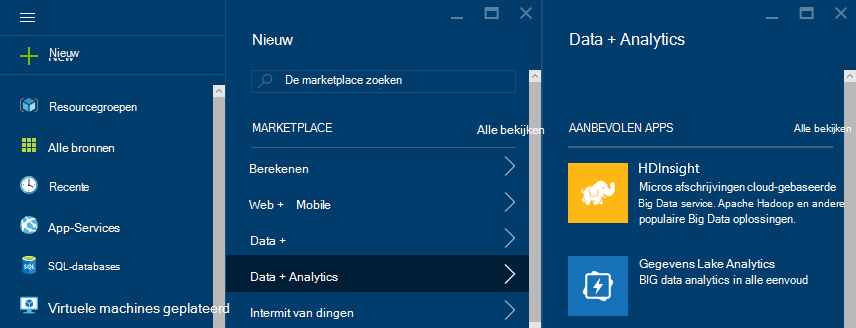

3. Voer een __naam van het Cluster__. Een groen vinkje verschijnt naast de __Naam van het Cluster__ , als deze beschikbaar is.

4. Als u meer dan één abonnement hebt, selecteert u vermelding selecteren de Azure abonnement die wordt gebruikt voor het cluster voor het __abonnement__ .

5.  Gebruik __Cluster Type selecteren__ om een cluster __Storm__ . Selecteer voor het __besturingssysteem__Windows. __Cluster-laag__, selecteert u standaard. Ten slotte de knop selecteren gebruiken om deze instellingen opslaan.

    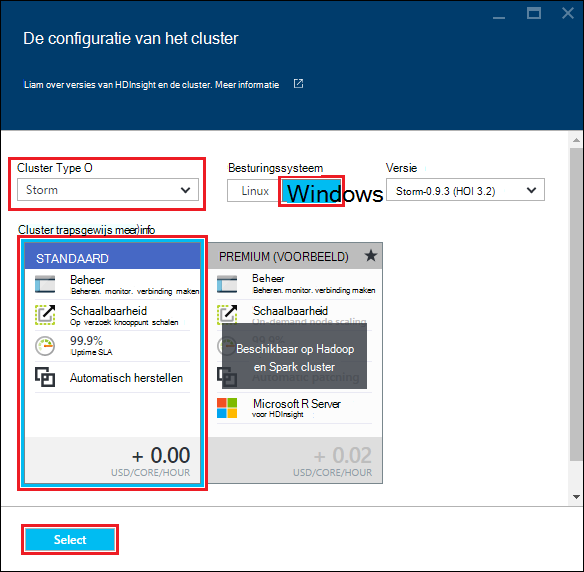

5. __Resourcegroep__kunt u ons de vervolgkeuzelijst voor een overzicht van de bestaande resourcegroepen en selecteer vervolgens een voor het maken van het cluster in. Of selecteer __Nieuw__ en voer vervolgens de naam van de nieuwe resourcegroep. Een groen vinkje weergegeven om aan te geven of de naam van de nieuwe groep beschikbaar is.

6. Selecteer __referenties__en voer vervolgens een __Cluster Login gebruikersnaam__ en __Wachtwoord voor aanmelding van Cluster__. Gebruik ten slotte __selecteert u__ referenties instellen. Extern bureaublad wordt niet gebruikt in dit document, zodat u kunt uitgeschakeld laten.

    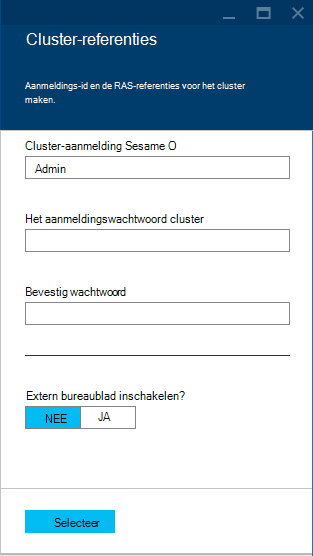

6. U kunt voor de __Gegevensbron__, selecteert u het item naar een bestaande gegevensbron kiezen of een nieuwe maken.

    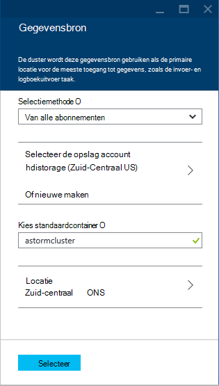

    Momenteel kunt u een account Azure opslag als gegevensbron voor een HDInsight-cluster. Gebruik de volgende te begrijpen van de posten op de __Gegevensbron__ blade.

    - __Selectie-methode__: deze worden ingesteld __van alle abonnementen__ bladeren van opslag accounts op uw abonnementen inschakelen. Als u wilt opgeven voor de __Opslag__ en de __Toegangstoets__ van een bestaande account voor opslag ingesteld op de __Toegangstoets__ .

    - __Nieuw__: Gebruik deze optie om een nieuwe opslag-account te maken. Gebruik het veld om het invoeren van de naam van de account van de opslag. Een groen vinkje wordt weergegeven als de naam beschikbaar is.

    - __Kies standaardcontainer__: Gebruik deze optie voert u de naam van de standaardcontainer te gebruiken voor het cluster. Terwijl u hier een naam invoert, wordt aangeraden met dezelfde naam als het cluster, zodat u gemakkelijk herkennen kunt dat de container wordt gebruikt voor deze specifieke clusterhost.

    - __Locatie__: de geografische regio die de account voor de opslag is of wordt gemaakt in.

        > [AZURE.IMPORTANT] Selecteren van de locatie voor de standaard-gegevensbron, stelt ook de locatie van het cluster HDInsight. De cluster- en gegevensbron moet zich bevinden in hetzelfde gebied.

    - __Selecteren__: Gebruik deze optie voor het opslaan van de configuratie van de gegevensbron.

7. Selecteer __Knooppunt prijzen lagen__ weer te geven informatie over de knooppunten die voor dit cluster wordt gemaakt. Het aantal knooppunten van de werknemer is standaard ingesteld op __4__. Deze optie instellen op __1__, zoals dit voldoende voor deze zelfstudie is en de kosten van het cluster beperkt. De geschatte kosten van het cluster wordt weergegeven onder aan deze blade.

    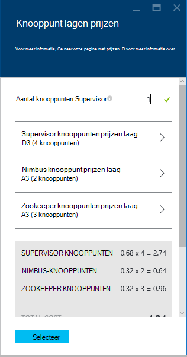

    Gebruik __selecteert u__ het __Knooppunt prijzen lagen__ gegevens op te slaan.

8. Selecteer __optionele configuratie__. Deze blade kunt u de versie van het cluster, evenals andere optionele instellingen zoals lid worden van een __Virtueel netwerk__configureren.

    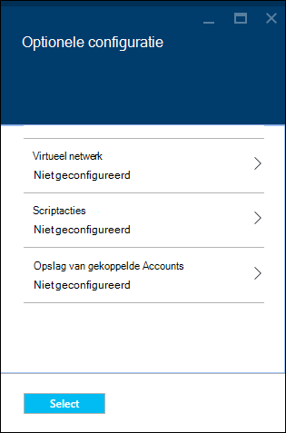

9. Controleer __Startboard Pin__ is geselecteerd en selecteer __maken__. Dit maakt het cluster en wordt een tegel voor deze toegevoegd aan de Startboard van uw portal Azure. Het pictogram geeft aan dat het cluster wordt ingericht, wordt gewijzigd in het HDInsight pictogram eenmaal ingericht is voltooid.

  	| Tijdens het inrichten | Inrichten is voltooid |
  	| ------------------ | --------------------- |
  	|  | 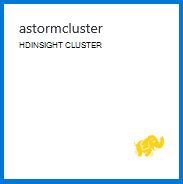 |

    > [AZURE.NOTE] Het duurt enige tijd voor het cluster moet worden gemaakt, meestal ongeveer 15 minuten. De tegel op de Startboard of de vermelding van de __kennisgevingen__ aan de linkerkant van de pagina gebruiken om te controleren op het inrichtingsproces.

## Een voorbeeld van een Storm Starter worden uitgevoerd op HDInsight

Deze zelfstudie Apache Storm maakt u kennis met big data analytics met de Storm Starter monsters op GitHub.

Elke Storm op de cluster HDInsight wordt geleverd met het Dashboard Storm, die kan worden gebruikt voor het uploaden en Storm topologieën op het cluster worden uitgevoerd. Elk cluster wordt ook geleverd met monster topologieën die rechtstreeks uit het Dashboard Storm kunnen worden uitgevoerd.

### Verbinding maken met het dashboard

Het dashboard bevindt zich op **https://&lt;Clusternaam >.azurehdinsight.net//**, waarbij **clusternaam** de naam van het cluster. U kunt ook een koppeling naar het dashboard door het cluster uit de Startboard selecteren en klikken op de __Dashboard__ -koppeling aan de bovenkant van het blad vinden.

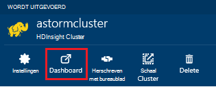

> [AZURE.NOTE] Wanneer u verbinding maakt met het dashboard, wordt u gevraagd een gebruikersnaam en wachtwoord invoeren. Dit is de naam van de beheerder (**admin**) en wachtwoord dat wordt gebruikt bij het maken van het cluster.

Nadat de Storm Dashboard is geladen, ziet u het formulier **Indienen topologie** .

Het formulier **Indienen topologie** kan worden gebruikt voor het uploaden en uitvoeren van de JAR-bestanden met Storm topologieën. Het bevat ook een aantal elementaire voorbeelden zijn voorzien van het cluster.

### Het monster aantal woorden uit het project Storm Starter in de GitHub uitvoeren

De monsters die voorzien zijn van het cluster zijn verschillende varianten van een topologie word tellen. Deze voorbeelden bevatten een **spout** die willekeurig zendt zinnen en **bolts** die elke zin op te splitsen in afzonderlijke woorden, en vervolgens tellen hoe vaak elk woord is opgetreden. Deze voorbeelden zijn van de [Storm Starter monsters](https://github.com/apache/storm/tree/master/examples/storm-starter)die deel uitmaken van de Apache Storm.

Voer de volgende stappen uit om een voorbeeld van een Storm Starter worden uitgevoerd:

1. **StormStarter - WordCount** selecteren in de vervolgkeuzelijst **Jar-bestand** . Hiermee wordt de **Klassenaam** en **Aanvullende Parameters** de parameters voor dit voorbeeld.

    

    * De **Klassenaam** - de klasse in het JAR-bestand waarmee de topologie.
    * **Aanvullende Parameters** - parameters vereist door de topologie. In dit voorbeeld wordt het veld gebruikt om een beschrijvende naam voor de ingediende topologie.

2. Klik op **indienen**. **Het resultaatveld** weergegeven en de opdracht indienen van het project, alsmede de resultaten van de opdracht. Het veld **foutbericht** geeft eventuele fouten die zich bij de indiening van de topologie.

    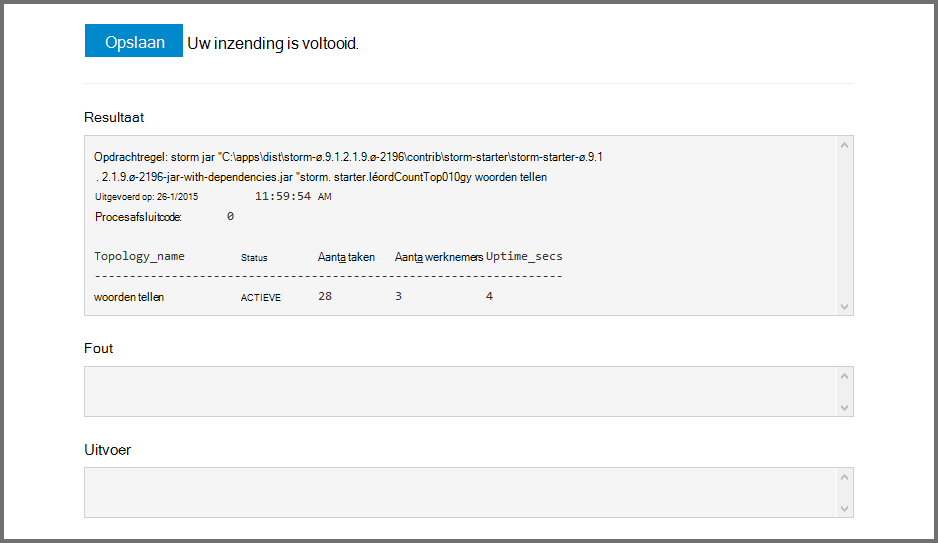

    > [AZURE.NOTE] De resultaten niet geven aan dat de topologie voltooid - **een Storm topologie, na het starten wordt uitgevoerd totdat u deze stoppen** De topologie van het aantal woorden genereert willekeurige zinnen en houdt een telling van het aantal keren dat er elk woord, totdat u het stopt.

### De topologie controleren

De Storm-gebruikersinterface kan worden gebruikt voor het controleren van de topologie.

1. Selecteer **Storm UI** vanaf de bovenzijde van het Dashboard Storm. Overzichtsinformatie voor het cluster en alle actieve topologieën worden weergegeven.

    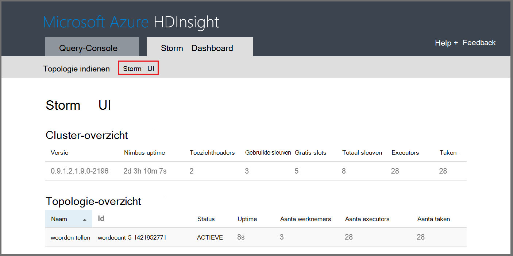

    Op de pagina ziet u de tijd die de topologie actief is geweest, alsmede het aantal werknemers, executors en taken worden gebruikt.

    > [AZURE.NOTE] De kolom **naam** bevat de beschrijvende naam die eerder via het veld **Aanvullende Parameters** .

4. Selecteer onder **Samenvatting topologie**, de **wordcount** vermelding in de kolom **naam** . Dit geeft meer informatie over de topologie.

    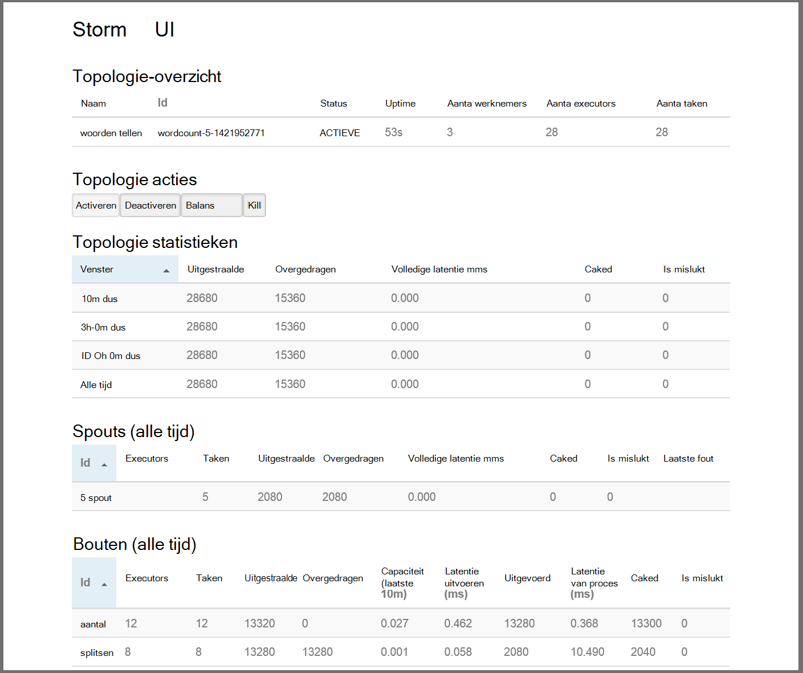

    Deze pagina bevat de volgende informatie:

    * **Topologie statistieken** - basisgegevens over de prestaties van de topologie, ingedeeld in tijdvensters.

        > [AZURE.NOTE] Selecteren van een specifieke tijdvenster verandert het tijdvenster voor informatie in andere secties van de pagina weergegeven.

    * **Spouts** - informatie over spouts, met inbegrip van de laatste fout die door elke spout.

    * **Bolts** - basisinformatie over bouten.

    * **Topologie, configuratie** - informatie over de topologieconfiguratie.

    Deze pagina bevat ook acties die kunnen worden genomen op de topologie:

    * **Activate** - verwerking van een gedeactiveerde topologie wordt hervat.

    * **Deactivate** - pauzeert een topologie uitgevoerd.

    * **Balans** - Hiermee past u de evenwijdigheid van de topologie. Nadat u het aantal knooppunten in het cluster hebt gewijzigd, moet u lopende topologieën opnieuw. Hierdoor wordt de topologie aanpassen parallellisme ter compensatie van de gestegen/gedaald aantal knooppunten in het cluster. Zie [Wat is de evenwijdigheid van een topologie Storm](http://storm.apache.org/documentation/Understanding-the-parallelism-of-a-Storm-topology.html)voor meer informatie.

    * **Kill** - eindigt een topologie Storm na de opgegeven time-out.

5. Selecteer een item in de sectie **Spouts** of **Bolts** op deze pagina. Informatie over het geselecteerde onderdeel worden weergegeven.

    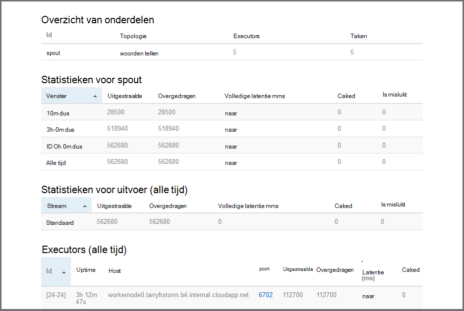

    Deze pagina bevat de volgende informatie:

    * **Spout/bout statistieken** - basisgegevens over de prestaties van de component in tijdvensters georganiseerd.

        > [AZURE.NOTE] Selecteren van een specifieke tijdvenster verandert het tijdvenster voor informatie in andere secties van de pagina weergegeven.

    * **Input-statistieken** (alleen bout) - meer informatie over de onderdelen die worden gebruikt door de bout gegevens te produceren.

    * **Statistieken van de uitvoer** - informatie op over gegevens die zijn gegenereerd door deze bout.

    * **Executors** - informatie over exemplaren van dit onderdeel.

    * **Fouten** - fouten die worden geproduceerd door dit onderdeel.

5. Wanneer u de details weergeven van een spout of bout, selecteer een item in de kolom **poort** in de sectie **Executors** om voor een specifieke instantie van de component te bekijken.

        2015-01-27 14:18:02 b.s.d.task [INFO] Emitting: split default ["with"]
        2015-01-27 14:18:02 b.s.d.task [INFO] Emitting: split default ["nature"]
        2015-01-27 14:18:02 b.s.d.executor [INFO] Processing received message source: split:21, stream: default, id: {}, [snow]
        2015-01-27 14:18:02 b.s.d.task [INFO] Emitting: count default [snow, 747293]
        2015-01-27 14:18:02 b.s.d.executor [INFO] Processing received message source: split:21, stream: default, id: {}, [white]
        2015-01-27 14:18:02 b.s.d.task [INFO] Emitting: count default [white, 747293]
        2015-01-27 14:18:02 b.s.d.executor [INFO] Processing received message source: split:21, stream: default, id: {}, [seven]
        2015-01-27 14:18:02 b.s.d.task [INFO] Emitting: count default [seven, 1493957]

    Van deze gegevens kunt u zien dat het woord **zeven** is opgetreden tijden 1,493,957. Dat is het aantal keren dat er sinds de start van deze topologie is gevonden.

### Stop de topologie

Terug naar de pagina **Samenvatting topologie** voor de topologie woorden tellen en selecteer **Kill** in de sectie **acties van de topologie** . Wanneer dat wordt gevraagd, geeft u 10 voor het aantal seconden dat moet worden gewacht voordat de topologie te stoppen. Na de time-outperiode de topologie wordt niet meer weergegeven wanneer u de **Storm UI** gedeelte van het dashboard bezoekt.

##Het cluster te verwijderen

[AZURE.INCLUDE [delete-cluster-warning](../../includes/hdinsight-delete-cluster-warning.md)]

## Samenvatting

In deze zelfstudie Apache Storm gebruikt u de Storm-Starter voor meer informatie over het maken van een Storm op de cluster HDInsight en gebruik van het Dashboard Storm te implementeren, bewaken en beheren van Storm topologieën.

## Volgende stappen

* **Extra HDInsight voor Visual Studio** - hulpmiddelen voor HDInsight kunt u met behulp van Visual Studio indienen, controleren en beheren van Storm topologieën is vergelijkbaar met de eerder genoemde Storm-Dashboard. Extra HDInsight ook biedt de mogelijkheid om C# Storm topologieën en monster topologieën die u kunt implementeren en uitvoeren op uw cluster bevat.

    Zie [aan de slag met behulp van de HDInsight's voor Visual Studio](hdinsight-hadoop-visual-studio-tools-get-started.md)voor meer informatie.

* **Voorbeeldbestanden** - cluster de Storm van HDInsight vindt u verschillende voorbeelden in de map **%STORM_HOME%\contrib** . Elk voorbeeld moet het volgende bevatten:

    * De broncode -, storm-starter-0.9.1.2.1.5.0-2057-sources.jar

    * De Java docs -, storm-starter-0.9.1.2.1.5.0-2057-javadoc.jar

    * In het voorbeeld - zo storm-starter-0.9.1.2.1.5.0-2057-jar-with-dependencies.jar

    Gebruik de opdracht "jar" broncode of Java docs uitpakken. Bijvoorbeeld, ' jar - xvf storm-starter-0.9.1.2.1.5.0.2057-javadoc.jar'.

    > [AZURE.NOTE] Java docs bestaan uit webpagina's. Eenmaal uitgepakt, kunt u een browser gebruiken om het bestand **index.html** .

    Als u deze voorbeelden, moet u extern bureaublad inschakelen voor de Storm op de cluster HDInsight en kopieert u de bestanden van de **%STORM_HOME%\contrib**.

* Het volgende document bevat een lijst van andere voorbeelden die kunnen worden gebruikt met Storm op HDInsight:

    * [Voorbeeld van de topologieën voor Storm op HDInsight](hdinsight-storm-example-topology.md)

[apachestorm]: https://storm.incubator.apache.org
[stormdocs]: http://storm.incubator.apache.org/documentation/Documentation.html
[stormstarter]: https://github.com/apache/storm/tree/master/examples/storm-starter
[stormjavadocs]: https://storm.incubator.apache.org/apidocs/
[azureportal]: https://manage.windowsazure.com/
[hdinsight-provision]: hdinsight-provision-clusters.md
[preview-portal]: https://portal.azure.com/
