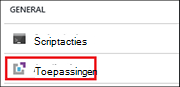
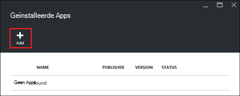
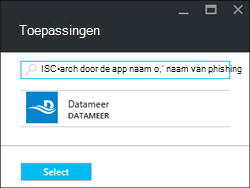
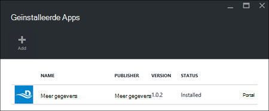

<properties
    pageTitle="Hadoop toepassingen installeren op HDInsight | Microsoft Azure"
    description="Informatie over het HDInsight om toepassingen te installeren op HDInsight toepassingen."
    services="hdinsight"
    documentationCenter=""
    authors="mumian"
    manager="jhubbard"
    editor="cgronlun"
    tags="azure-portal"/>

<tags
    ms.service="hdinsight"
    ms.devlang="na"
    ms.topic="hero-article"
    ms.tgt_pltfrm="na"
    ms.workload="big-data"
    ms.date="09/14/2016"
    ms.author="jgao"/>

# HDInsight-toepassingen installeren

Een HDInsight toepassing is een toepassing die gebruikers op een cluster van Linux-gebaseerde HDInsight installeren kunnen. Deze toepassingen kunnen worden ontwikkeld door Microsoft, onafhankelijke softwareleveranciers (ISV) of door uzelf. In dit artikel leert u hoe een uitgegeven toepassing installeren. Zie [aangepaste toepassingen voor HDInsight](hdinsight-apps-install-custom-applications.md)voor het installeren van uw eigen toepassing. 

Er is momenteel een uitgegeven toepassing:

- **Datameer**: [Datameer](http://www.datameer.com/documentation/display/DAS50/Home?ls=Partners&lsd=Microsoft&c=Partners&cd=Microsoft) biedt analisten een interactieve manier te ontdekken, te analyseren en de resultaten op grote gegevens visualiseren. Ophalen van aanvullende gegevensbronnen eenvoudig te ontdekken van nieuwe relaties en de antwoorden die u nodig hebt snel.

>[AZURE.NOTE] Datameer wordt momenteel alleen ondersteund in Azure HDInsight versie 3.2 clusters.

De instructies in dit artikel Azure portal gebruiken. U kunt de sjabloon Azure Resource Manager exporteren vanuit de portal of het verkrijgen van een kopie van de sjabloon Resource Manager van leveranciers en Azure PowerShell en Azure CLI gebruiken voor de implementatie van de sjabloon.  Zie [Hadoop maken Linux gebaseerde clusters in HDInsight met behulp van bronbeheer sjablonen](hdinsight-hadoop-create-linux-clusters-arm-templates.md).

## Vereisten

Als u wilt HDInsight om toepassingen te installeren in een bestaand HDInsight-cluster, moet u een HDInsight cluster hebben. Zie [clusters maken](hdinsight-hadoop-linux-tutorial-get-started.md#create-cluster)om een. Wanneer u een cluster HDInsight maakt, kunt u HDInsight toepassingen installeren.

## Toepassingen met bestaande clusters installeren

De volgende procedure wordt beschreven hoe u toepassingen aan een bestaand cluster van HDInsight HDInsight installeren.

**Een HDInsight-toepassing te installeren**

1. Log in om de [Azure portal](https://portal.azure.com).
2. Klik op **HDInsight Clusters** in het linkermenu.  Als u deze niet ziet, klikt u op **Bladeren**en klik op **HDInsight-Clusters**.
3. Klik op een HDInsight-cluster.  Als u er geen hebt, moet u een eerste.  Zie [clusters maken](hdinsight-hadoop-linux-tutorial-get-started.md#create-cluster).
4. Klik op **toepassingen** onder de categorie **Algemeen** van het blad **Instellingen** . De blade **Apps geïnstalleerd** , worden de geïnstalleerde toepassingen. 

    

5. Klik op **toevoegen** in het menu blade. 

    

    Er wordt een lijst met bestaande HDInsight-toepassingen.

    

6. Klik op een van de toepassingen, accepteer de juridische voorwaarden en klik vervolgens op **selecteren**.

Ziet u de installatiestatus van de portal meldingen (Klik op het pictogram bell boven aan de portal). Nadat de toepassing is geïnstalleerd, wordt de toepassing weergegeven op het blad Apps geïnstalleerd.

## Toepassingen installeren tijdens het maken van het cluster

U hebt de optie HDInsight om toepassingen te installeren wanneer u een cluster maakt. Tijdens het worden HDInsight toepassingen geïnstalleerd nadat het cluster is gemaakt en actief is. De volgende procedure wordt beschreven hoe u HDInsight toepassingen installeren wanneer u een cluster maakt.

**Een HDInsight-toepassing te installeren**

1. Log in om de [Azure portal](https://portal.azure.com).
2. Klik op **Nieuw**, klik op **gegevens + Analytics**en klik op **HDInsight**.
3. Voer de **Naam van het Cluster**: deze naam moet uniek zijn.
4. Klik op **abonnement** schakelt de Azure abonnement die wordt gebruikt voor het cluster.
5. Klik op **cluster Type selecteren**en selecteer:

    - **Cluster-Type**: als u niet wat weet te kiezen, selecteert u **Hadoop**. Het is de meest populaire clustertype.
    - **Besturingssysteem**: **Linux**selecteren.
    - **Versie**: de standaardversie gebruiken als u niet wat weet te kiezen. Zie voor meer informatie [HDInsight cluster versies](hdinsight-component-versioning.md).
    - **Cluster-Tier**: Azure HDInsight biedt de big data wolk aanbiedingen in twee categorieën: laag Standard en Premium-laag. Zie [lagen Cluster](hdinsight-hadoop-provision-linux-clusters.md#cluster-tiers)voor meer informatie.
6. Klik op **toepassingen**, klik op een van de uitgegeven toepassingen en klik vervolgens op **selecteren**.
6. Klik op **referenties** en voer een wachtwoord voor de admin-gebruiker. U moet ook een **SSH-gebruikersnaam** en een **wachtwoord** of een **Openbare sleutel**die wordt gebruikt voor het verifiëren van de gebruiker SSH invoeren. Met een openbare sleutel is de aanbevolen werkwijze. Klik op **selecteren** onderaan de configuratie van de referenties op te slaan.
8. Klik op **Gegevensbron**, selecteert u een van de bestaande opslag account of maak een nieuwe account voor opslag moet worden gebruikt als standaardaccount voor de opslag voor het cluster.
9. Klik op **Resourcegroep** om een bestaande resourcegroep selecteren of klik op **Nieuw** om een nieuwe resourcegroep maken

10. Op het **Nieuwe Cluster van HDInsight** -blade zorgen **vastmaken aan de Startboard** is geselecteerd en klik vervolgens op **maken**. 

## Geïnstalleerde apps HDInsight en eigenschappen

De portal bevat een overzicht van de geïnstalleerde toepassingen van HDInsight voor een cluster, en de eigenschappen van elke geïnstalleerde toepassing.

**Lijst met toepassing van de HDInsight en eigenschappen weergeven**

1. Log in om de [Azure portal](https://portal.azure.com).
2. Klik op **HDInsight Clusters** in het linkermenu.  Als u deze niet ziet, klikt u op **Bladeren**en klik op **HDInsight-Clusters**.
3. Klik op een HDInsight-cluster.
4. Klik op **toepassingen** onder de categorie **Algemeen** van het blad **Instellingen** . De blade Apps geïnstalleerd, worden de geïnstalleerde toepassingen. 

    

5. Klik op een van de geïnstalleerde toepassingen weer te geven van de eigenschap. De eigenschap blade-lijsten:

    - Naam: de naam van toepassing.
    - Status: toepassingsstatus van. 
    - Webpagina's: De URL van de webtoepassing die u naar het randknooppunt hebt geïmplementeerd als een. De referentie is dezelfde als de referenties van de HTTP-gebruiker die u hebt ingesteld voor het cluster.
    - HTTP-eindpunt: de referentie is dezelfde als de referenties van de HTTP-gebruiker die u hebt ingesteld voor het cluster. 
    - SSH-eindpunt: U kunt [SSH](hdinsight-hadoop-linux-use-ssh-unix.md) verbinding maken met het randknooppunt. De SSH-referenties zijn dezelfde als de referenties van de gebruiker SSH die u hebt ingesteld voor het cluster.

6. Als u een toepassing verwijdert, klik met de rechtermuisknop op de toepassing en klik vervolgens op **verwijderen** in het contextmenu.

## Verbinding maken met het randknooppunt

U kunt verbinding maken met de randknooppunt via HTTP en SSH. Het eindpunt informatie vindt u via de [portal](#list-installed-hdinsight-apps-and-properties). Zie voor meer informatie over het gebruik van SSH, [Gebruik SSH met Linux-gebaseerde Hadoop op HDInsight van Linux, Unix, of OS X](hdinsight-hadoop-linux-use-ssh-unix.md). 

De HTTP-eindpunt referenties zijn de referenties van de HTTP-gebruiker die u hebt ingesteld voor het cluster HDInsight. de SSH eindpunt referenties zijn de SSH-referenties die u hebt ingesteld voor het cluster HDInsight.

## Problemen oplossen met

Zie [problemen met de installatie](hdinsight-apps-install-custom-applications.md#troubleshoot-the-installation).

## Volgende stappen

- [Aangepaste toepassingen voor HDInsight](hdinsight-apps-install-custom-applications.md): informatie over het implementeren van een toepassing niet gepubliceerde HDInsight HDInsight.
- [Toepassingen publiceren HDInsight](hdinsight-apps-publish-applications.md): informatie over het publiceren van uw aangepaste HDInsight toepassingen met Azure Marketplace.
- [MSDN: installeren van een toepassing HDInsight](https://msdn.microsoft.com/library/mt706515.aspx): informatie over het definiëren van HDInsight toepassingen.
- [HDInsight aanpassen Linux gebaseerde clusters met scriptactie](hdinsight-hadoop-customize-cluster-linux.md): informatie over het gebruik van de actie Script om extra toepassingen te installeren.
- [Hadoop maken Linux gebaseerde clusters in HDInsight met behulp van bronbeheer sjablonen](hdinsight-hadoop-create-linux-clusters-arm-templates.md): informatie over het aanroepen van HDInsight clusters maken sjablonen Resource Manager.
- [Gebruik lege rand nodes in HDInsight](hdinsight-apps-use-edge-node.md): informatie over het gebruik van een randknooppunt leeg voor toegang tot de cluster HDInsight, testen van toepassingen voor HDInsight en HDInsight toepassingen die als host fungeert.

