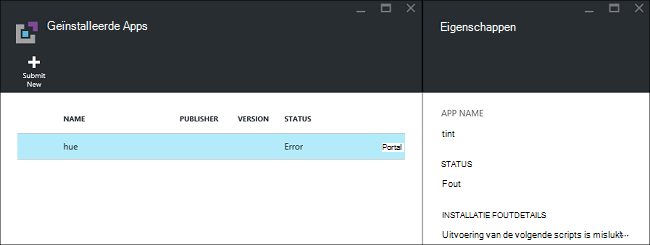
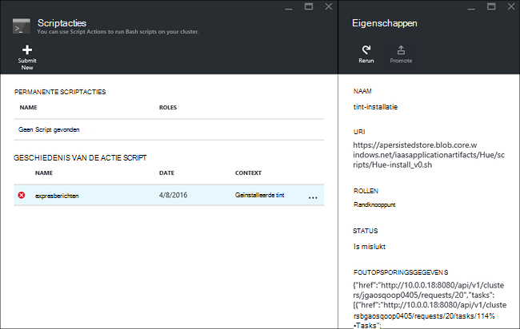

<properties
    pageTitle="Hadoop toepassingen installeren op HDInsight | Microsoft Azure"
    description="Informatie over het HDInsight om toepassingen te installeren op HDInsight toepassingen."
    services="hdinsight"
    documentationCenter=""
    authors="mumian"
    manager="jhubbard"
    editor="cgronlun"
    tags="azure-portal"/>

<tags
    ms.service="hdinsight"
    ms.devlang="na"
    ms.topic="hero-article"
    ms.tgt_pltfrm="na"
    ms.workload="big-data"
    ms.date="09/14/2016"
    ms.author="jgao"/>

# Aangepaste toepassingen voor HDInsight

Een HDInsight toepassing is een toepassing die gebruikers op een cluster van Linux-gebaseerde HDInsight installeren kunnen.  Deze toepassingen kunnen worden ontwikkeld door Microsoft, onafhankelijke softwareleveranciers (ISV) of door uzelf. In dit artikel leert u hoe u een HDInsight toepassing installeren die niet is gepubliceerd op de Azure portal op HDInsight. De toepassing die u installeert is [tint](http://gethue.com/). 

Andere verwante artikelen:

- [Toepassingen installeren HDInsight](hdinsight-apps-install-applications.md): informatie over het installeren van een toepassing HDInsight clusters.
- [Toepassingen publiceren HDInsight](hdinsight-apps-publish-applications.md): informatie over het publiceren van uw aangepaste HDInsight toepassingen met Azure Marketplace.
- [MSDN: installeren van een toepassing HDInsight](https://msdn.microsoft.com/library/mt706515.aspx): informatie over het definiëren van HDInsight toepassingen.

 
## Vereisten

Als u wilt HDInsight om toepassingen te installeren in een bestaand HDInsight-cluster, moet u een HDInsight cluster hebben. Zie [clusters maken](hdinsight-hadoop-linux-tutorial-get-started.md#create-cluster)om een. Wanneer u een cluster HDInsight maakt, kunt u HDInsight toepassingen installeren.

## HDInsight-toepassingen installeren

HDInsight-toepassingen kunnen worden geïnstalleerd wanneer u een cluster maakt of aan een bestaand cluster van HDInsight. Zie voor het definiëren van sjablonen Azure Resource Manager [MSDN: installeren van een toepassing voor HDInsight](https://msdn.microsoft.com/library/mt706515.aspx).

De bestanden die nodig zijn voor het implementeren van deze toepassing (tint):

- [azuredeploy.JSON](https://github.com/hdinsight/Iaas-Applications/blob/master/Hue/azuredeploy.json): sjabloon voor de Resource Manager voor het installeren van de toepassing van de HDInsight. Zie [MSDN: installeren van een toepassing HDInsight](https://msdn.microsoft.com/library/mt706515.aspx) voor het ontwikkelen van uw eigen sjabloon Resource Manager.
- [tint-install_v0.sh](https://github.com/hdinsight/Iaas-Applications/blob/master/Hue/scripts/Hue-install_v0.sh): actie van het Script wordt aangeroepen door de sjabloon Resource Manager voor het configureren van het randknooppunt. 
- [tint-binaries.tgz](https://hdiconfigactions.blob.core.windows.net/linuxhueconfigactionv01/hue-binaries-14-04.tgz): de tint van een binair bestand wordt aangeroepen vanuit de hui-install_v0.sh. 
- [tint-binaries-14-04.tgz](https://hdiconfigactions.blob.core.windows.net/linuxhueconfigactionv01/hue-binaries-14-04.tgz): de tint van een binair bestand wordt aangeroepen vanuit de hui-install_v0.sh. 
- [webwasb-tomcat.tar.gz](https://hdiconfigactions.blob.core.windows.net/linuxhueconfigactionv01/webwasb-tomcat.tar.gz): een monster-webtoepassing (Tomcat) wordt aangeroepen vanuit de hui-install_v0.sh.

**Installeren van tint aan een bestaand cluster van HDInsight**

1. Klik op de onderstaande afbeelding om te melden bij Azure en open de sjabloon Resource Manager in de Portal Azure. 

    

    Met deze knop opent een sjabloon Resource Manager op de Azure portal.  De bronnenbeheerder sjabloon bevindt zich op [https://github.com/hdinsight/Iaas-Applications/tree/master/Hue](https://github.com/hdinsight/Iaas-Applications/tree/master/Hue).  Zie voor informatie over het schrijven van deze sjabloon Resource Manager, [MSDN: installeren van een toepassing voor HDInsight](https://msdn.microsoft.com/library/mt706515.aspx).
    
2. Voer de volgende gegevens van de bladeserver **Parameters** :

    - **Clusternaam**: Voer de naam van het cluster waar u de toepassing installeren. Dit cluster moet een bestaand cluster.
    
3. Klik op **OK** om op te slaan van de parameters.
4. Invoeren van de blade **-implementatie aangepaste** **groep**.  De resourcegroep is een container waarin de account afhankelijk opslag en andere bronnen van het cluster worden gegroepeerd. Dezelfde resourcegroep gebruiken als het cluster is verplicht.
5. Klik op de **juridische voorwaarden**en klik vervolgens op **maken**.
6. Controleer of het selectievakje **pincode op het dashboard** is geselecteerd en klik vervolgens op **maken**. Ziet u de installatiestatus van de tegel vastgemaakt aan het dashboard van de portal en de portal kennisgeving (Klik op het pictogram bell boven aan de portal).  Het duurt ongeveer 10 minuten om de toepassing te installeren.

**Kleurtoon installeren tijdens het maken van een cluster**

1. Klik op de onderstaande afbeelding om te melden bij Azure en open de sjabloon Resource Manager in de Portal Azure. 

    

    Met deze knop opent een sjabloon Resource Manager op de Azure portal.  De bronnenbeheerder sjabloon bevindt zich op [https://hditutorialdata.blob.core.windows.net/hdinsightapps/create-linux-based-hadoop-cluster-in-hdinsight.json](https://hditutorialdata.blob.core.windows.net/hdinsightapps/create-linux-based-hadoop-cluster-in-hdinsight.json).  Zie voor informatie over het schrijven van deze sjabloon Resource Manager, [MSDN: installeren van een toepassing voor HDInsight](https://msdn.microsoft.com/library/mt706515.aspx).

2. Volg de aanwijzingen op het cluster maken en installeren van tint. Zie voor meer informatie over het maken van clusters HDInsight [Hadoop maken Linux gebaseerde clusters in het HDInsight](hdinsight-hadoop-provision-linux-clusters.md).

Naast de Azure portal kun je [Azure PowerShell](hdinsight-hadoop-create-linux-clusters-arm-templates.md#deploy-with-powershell) en [Azure CLI](hdinsight-hadoop-create-linux-clusters-arm-templates.md#deploy-with-azure-cli) sjablonen Resource Manager aanroepen.

## De installatie valideren

U kunt de toepassingsstatus op de Azure portal voor het valideren van de installatie van de toepassing controleren. Daarnaast kunt u ook valideren alle HTTP-eindpunten afkomstig van zoals verwacht en de webpagina als een:

**Voor het openen van de tint-portal**

1. Log in om de [Azure portal](https://portal.azure.com).
2. Klik op **HDInsight Clusters** in het linkermenu.  Als u deze niet ziet, klikt u op **Bladeren**en klik op **HDInsight-Clusters**.
3. Klik op het cluster waarop u de toepassing hebt geïnstalleerd.
4. Klik op **toepassingen** onder de categorie **Algemeen** van het blad **Instellingen** . Er wordt **tint** die worden vermeld in de blade **Apps geïnstalleerd** .
5. Klik op de **kleurtoon** in de lijst om de eigenschappen weer.  
6. Klik op de koppeling van de webpagina voor het valideren van de website; Open de HTTP-eindpunt in een browser te valideren de kleurtoon webgebruikersinterface, het SSH-eindpunt met [stopverf](hdinsight-hadoop-linux-use-ssh-windows.md) of andere [SSH clients](hdinsight-hadoop-linux-use-ssh-unix.md)openen.
 
## Problemen met de installatie

U kunt de installatiestatus van de toepassing van de portal melding controleren (Klik op het pictogram bell boven aan de portal). 

Als de installatie van een toepassing is mislukt, kunt u de foutberichten weergeven en debug informatie vanuit 3 plaatsen:

- HDInsight toepassingen: informatie algemene fout.

    Het cluster openen vanaf de portal en toepassingen van de bladeserver instellingen op:

    

- HDInsight scriptactie: als HDInsight toepassingen foutbericht aangeeft een storing van de actie script dat, meer details over de fout script in het deelvenster scripts acties worden weergegeven.

    Klik op actie Script van de bladeserver instellingen. Geschiedenis van de actie script bevat de foutberichten

    
    
- Ambari Web UI: Als het script voor installatie de oorzaak van de storing was, gebruiken Ambari Web UI om volledige logboeken over de scripts installeren.

    Zie [problemen oplossen](hdinsight-hadoop-customize-cluster-linux.md#troubleshooting)voor meer informatie.

## HDInsight-toepassingen verwijderen

Er zijn verschillende manieren om te verwijderen HDInsight toepassingen.

### Portal gebruiken

**Een toepassing met behulp van de portal verwijderen**

1. Log in om de [Azure portal](https://portal.azure.com).
2. Klik op **HDInsight Clusters** in het linkermenu.  Als u deze niet ziet, klikt u op **Bladeren**en klik op **HDInsight-Clusters**.
3. Klik op het cluster waarop u de toepassing hebt geïnstalleerd.
4. Klik op **toepassingen** onder de categorie **Algemeen** van het blad **Instellingen** . Er wordt een lijst met geïnstalleerde toepassing. Voor deze zelfstudie **tint** vermeld in de blade **Apps geïnstalleerd** .
5. Klik met de rechtermuisknop op de toepassing die u wilt verwijderen en klik vervolgens op **verwijderen**.
6. Klik op **Ja** om te bevestigen.

U kunt ook het cluster te verwijderen of verwijderen van de bronnengroep met de toepassing vanuit de portal.

### Azure PowerShell gebruiken

Azure PowerShell gebruikt, kan het cluster te verwijderen of verwijderen van de resourcegroep. Zie [clusters met Azure PowerShell verwijderen](hdinsight-administer-use-powershell.md#delete-clusters).

### Azure CLI gebruiken

Met behulp van de CLI Azure, kan het cluster te verwijderen of verwijderen van de resourcegroep. Zie [clusters met behulp van de CLI Azure verwijderen](hdinsight-administer-use-command-line.md#delete-clusters).

## Volgende stappen

- [MSDN: installeren van een toepassing HDInsight](https://msdn.microsoft.com/library/mt706515.aspx): informatie over het ontwikkelen van sjablonen voor het implementeren van toepassingen HDInsight Resource Manager.
- [Toepassingen installeren HDInsight](hdinsight-apps-install-applications.md): informatie over het installeren van een toepassing HDInsight clusters.
- [Toepassingen publiceren HDInsight](hdinsight-apps-publish-applications.md): informatie over het publiceren van uw aangepaste HDInsight toepassingen met Azure Marketplace.
- [HDInsight aanpassen Linux gebaseerde clusters met scriptactie](hdinsight-hadoop-customize-cluster-linux.md): informatie over het gebruik van de actie Script om extra toepassingen te installeren.
- [Hadoop maken Linux gebaseerde clusters in HDInsight met behulp van bronbeheer sjablonen](hdinsight-hadoop-create-linux-clusters-arm-templates.md): informatie over het aanroepen van HDInsight clusters maken sjablonen Resource Manager.
- [Gebruik lege rand nodes in HDInsight](hdinsight-apps-use-edge-node.md): informatie over het gebruik van een randknooppunt leeg voor toegang tot de cluster HDInsight, testen van toepassingen voor HDInsight en HDInsight toepassingen die als host fungeert.
