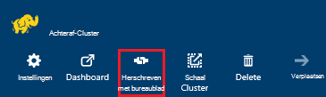
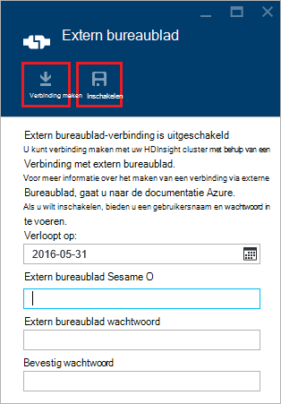
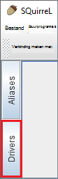
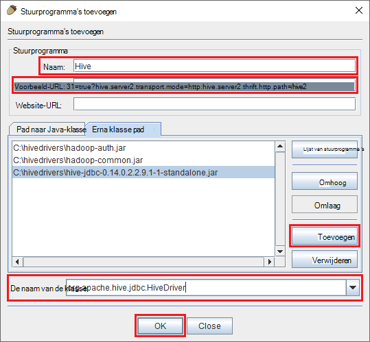
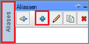
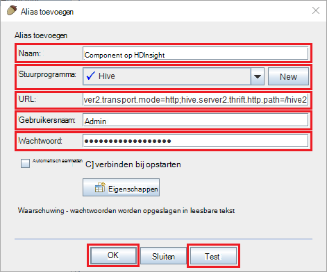
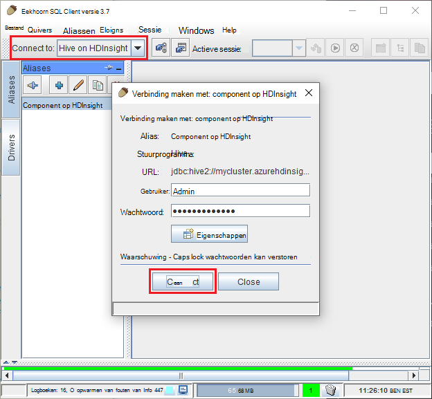
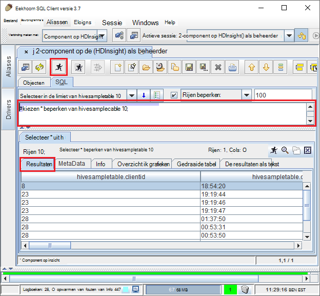

<properties
 pageTitle="JDBC aan component op Azure HDInsight query gebruiken"
 description="Leren met JDBC kunt u verbinding maken met de component in Azure, HDInsight en op afstand uitvoeren van query's op gegevens die zijn opgeslagen in de cloud."
 services="hdinsight"
 documentationCenter=""
 authors="Blackmist"
 manager="jhubbard"
 editor="cgronlun"
    tags="azure-portal"/>

<tags
 ms.service="hdinsight"
 ms.devlang="java"
 ms.topic="article"
 ms.tgt_pltfrm="na"
 ms.workload="big-data"
 ms.date="08/23/2016"
 ms.author="larryfr"/>

#Verbinding maken met de component in Azure HDInsight met behulp van de component JDBC-stuurprogramma

[AZURE.INCLUDE [ODBC-JDBC-selector](../../includes/hdinsight-selector-odbc-jdbc.md)]

In dit document leert u JDBC van een Java-toepassing gebruiken component query's naar een HDInsight-cluster op afstand indienen. U leert hoe u verbinding maakt vanaf de eekhoorn SQL client en hoe u verbinding maakt via een programma van Java.

Zie [HiveJDBCInterface](https://cwiki.apache.org/confluence/display/Hive/HiveJDBCInterface)voor meer informatie over de component JDBC-Interface.

##Vereisten

Als u de stappen in dit artikel hebt uitgevoerd, wilt nodig u het volgende:

* Een Hadoop op HDInsight cluster. Linux- of Windows clusters werkt.

* [Eekhoorn SQL](http://squirrel-sql.sourceforge.net/). Eekhoorn is een clienttoepassing JDBC.

Als u wilt maken en uitvoeren van het voorbeeld van de Java-toepassing van dit artikel zijn gekoppeld, moet u het volgende.

* De [Java Developer Kit (JDK) versie 7](https://www.oracle.com/technetwork/java/javase/downloads/jdk7-downloads-1880260.html) of hoger.

* [Apache Maven](https://maven.apache.org). Maven is een project maken voor projecten van Java systeem dat wordt gebruikt door het project die is gekoppeld aan dit artikel.

##Verbindingsreeks

Verbindingen met een HDInsight-cluster op Azure JDBC bestaan meer dan 443 en het verkeer wordt beveiligd met SSL. De openbare gateway die de clusters bevinden zich achter stuurt het verkeer naar de HiveServer2 daadwerkelijk luistert op poort. Zo zou een typische verbindingsreeks als volgt:

    jdbc:hive2://CLUSTERNAME.azurehdinsight.net:443/default;ssl=true?hive.server2.transport.mode=http;hive.server2.thrift.http.path=/hive2

__CLUSTERNAAM__ vervangen door de naam van het cluster HDInsight.

##Verificatie

Wanneer de verbinding tot stand te brengen, moet u de HDInsight cluster Administrator en het wachtwoord voor de verificatie van de cluster-gateway. Bij het verbinden van clients zoals eekhoorn SQL JDBC, moet u de naam van de beheerder en het wachtwoord in de instellingen van de client.

Van een Java-toepassing, moet u de naam en het wachtwoord bij het maken van een verbinding. De volgende Java-code opent bijvoorbeeld een nieuwe verbinding met de verbindingsreeks, naam admin en wachtwoord:

    DriverManager.getConnection(connectionString,clusterAdmin,clusterPassword);

##Verbinding maken met eekhoorn SQL client

Eekhoorn SQL is een JDBC-client die kan worden gebruikt voor het op afstand uitvoeren van query's component met het cluster HDInsight. De volgende stappen wordt ervan uitgegaan dat SQL eekhoorn al hebt geïnstalleerd en begeleidt u bij het downloaden en de stuurprogramma's configureren voor component.

1. De component JDBC-stuurprogramma's van het cluster HDInsight wilt kopiëren.

    * Voor __Linux-gebaseerde HDInsight__, gebruikt u de volgende stappen uit de vereiste jar-bestanden te downloaden.

        1. Maak een nieuwe map met de bestanden. Bijvoorbeeld `mkdir hivedriver`.

        2. Mappen naar de nieuwe map wijzigen vanaf een opdrachtprompt, Bash, PowerShell of andere opdrachtprompt en gebruik de volgende opdrachten om de bestanden te kopiëren uit het cluster HDInsight.

                scp USERNAME@CLUSTERNAME:/usr/hdp/current/hive-client/lib/hive-jdbc*standalone.jar .
                scp USERNAME@CLUSTERNAME:/usr/hdp/current/hadoop-client/hadoop-common.jar .
                scp USERNAME@CLUSTERNAME:/usr/hdp/current/hadoop-client/hadoop-auth.jar .

            Vervang __USERNAME__ door SSH naam van de gebruikersaccount voor de cluster. __CLUSTERNAAM__ vervangen door de naam van het cluster HDInsight.

            > [AZURE.NOTE] Op Windows-omgevingen moet u het hulpprogramma PSCP gebruiken in plaats van het scp. U kunt het downloaden van [http://www.chiark.greenend.org.uk/~sgtatham/putty/download.html](http://www.chiark.greenend.org.uk/~sgtatham/putty/download.html).

    * Voor __Windows-gebaseerde HDInsight__, gebruik de volgende stappen uit om de jar-bestanden te downloaden.

        1. Selecteer het cluster HDInsight vanuit de Azure portal en selecteer vervolgens het pictogram van __Extern bureaublad__ .

            

        2. Gebruik de knop __verbinden__ verbinding maken met het cluster op de extern bureaublad-blade. Als Extern bureaublad is ingeschakeld, kunt u het formulier gebruiken om een gebruikersnaam en wachtwoord, selecteer __inschakelen__ voor extern bureaublad inschakelen voor het cluster.

            

            Selecteer __verbinding maken__en worden een RDP-bestand gedownload. Dit bestand gebruiken voor het starten van de extern-bureaubladclient. Wanneer dat wordt gevraagd, gebruik de gebruikersnaam en het wachtwoord voor extern bureaublad-toegang.

        3. Wanneer een verbinding, Kopieer de volgende bestanden van de extern bureaublad-sessie op uw lokale computer. Opslaan in een lokale map met de naam `hivedriver`.

            * C:\apps\dist\hive-0.14.0.2.2.9.1-7\lib\hive-JDBC-0.14.0.2.2.9.1-7-standalone.jar
            * C:\apps\dist\hadoop-2.6.0.2.2.9.1-7\share\hadoop\common\hadoop-Common-2.6.0.2.2.9.1-7.jar
            * C:\apps\dist\hadoop-2.6.0.2.2.9.1-7\share\hadoop\common\lib\hadoop-auth-2.6.0.2.2.9.1-7.jar

            > [AZURE.NOTE] Het versienummer dat is opgenomen in de paden en bestandsnamen afwijken voor uw cluster.

        4. Zodra u klaar bent met het kopiëren van bestanden de extern bureaublad-sessie de verbinding verbreken.

3. Start de toepassing eekhoorn SQL. Selecteer __stuurprogramma's__vanaf de linkerkant van het venster.

    

4. Selecteer de pictogrammen boven aan het dialoogvenster van __stuurprogramma's__ , de __+__ pictogram voor het maken van een nieuw stuurprogramma.

    

5. Klik in het dialoogvenster stuurprogramma toevoegen de volgende informatie toevoegen.

    * __Naam__: component
    * __Voorbeeld-URL__: jdbc:hive2://localhost:443/default;ssl=true?hive.server2.transport.mode=http;hive.server2.thrift.http.path=/hive2
    * __Extra klassepad__: Gebruik de knop toevoegen in de jar-bestanden toe te voegen eerder hebt gedownload
    * __Naam__: org.apache.hive.jdbc.HiveDriver

    

    Klik op __OK__ om deze instellingen opslaan.

6. Selecteer aan de linkerkant van het venster SQL eekhoorn __aliassen__. Klik vervolgens op de __+__ pictogram naar de alias van een nieuwe verbinding maken.

    

7. De volgende waarden gebruiken voor het dialoogvenster __Alias toevoegen__ .

    * __Naam__: component op HDInsight
    * __Stuurprogramma__: Gebruik de vervolgkeuzelijst te selecteren van het stuurprogramma __component__
    * __URL__: jdbc:hive2://CLUSTERNAME.azurehdinsight.net:443/default;ssl=true?hive.server2.transport.mode=http;hive.server2.thrift.http.path=/hive2

        __CLUSTERNAAM__ vervangen door de naam van het cluster HDInsight.

    * __Gebruikersnaam__: de accountnaam voor aanmelding van cluster voor uw cluster HDInsight. De standaardwaarde is `admin`.
    * __Wachtwoord__: het wachtwoord voor de cluster-serviceaccount voor aanmelding. Dit is een wachtwoord dat u hebt opgegeven bij het maken van het cluster HDInsight.

    

    Gebruik de knop __testen__ om te controleren of de verbinding werkt. Wanneer __verbinding: component op HDInsight__ dialoogvenster wordt weergegeven, selecteert u __verbinding maken__ met het uitvoeren van de test. Als de test slaagt, ziet u een dialoogvenster voor de __verbinding tot stand gebracht__ .

    Gebruik de knop __Ok__ onderaan in het dialoogvenster __Alias toevoegen__ de alias verbinding opslaan.

8. Selecteer de __component op HDInsight__in de vervolgkeuzelijst __verbinding maken met__ aan de bovenkant van de eekhoorn SQL. Selecteer __verbinding maken__wanneer dit wordt gevraagd.

    

9. Zodra verbonden, voert u de volgende query in het dialoogvenster SQL-query's en selecteer vervolgens het pictogram __uitvoeren__ . De resultaten van de query moet worden weergegeven in het resultatengebied.

        select * from hivesampletable limit 10;

    

##Verbinding maken vanaf een voorbeeld van de Java-toepassing

Een voorbeeld van het gebruik van een Java-client query component op HDInsight is beschikbaar op [https://github.com/Azure-Samples/hdinsight-java-hive-jdbc](https://github.com/Azure-Samples/hdinsight-java-hive-jdbc). Volg de instructies in de opslagplaats maken en uitvoeren van het monster.

##Het oplossen van problemen

### Er is een onverwachte fout opgetreden tijdens het openen van een SQL-verbinding.

__Symptomen__: wanneer u verbinding maakt met een HDInsight-cluster dat versie 3.3 of 3.4, wordt een foutbericht weergegeven dat is een onverwachte fout opgetreden. De stacktrace van deze foutcode begint met de volgende regels:

    java.util.concurrent.ExecutionException: java.lang.RuntimeException: java.lang.NoSuchMethodError: org.apache.commons.codec.binary.Base64.<init>(I)V
    at java.util.concurrent.FutureTas...(FutureTask.java:122)
    at java.util.concurrent.FutureTask.get(FutureTask.java:206)

__Oorzaak__: deze fout wordt veroorzaakt door een probleem in de versie van het commons-codec.jar dat wordt gebruikt door de eekhoorn en de door de component JDBC onderdelen gedownload uit het cluster HDInsight vereist.

__Oplossing__: U kunt deze fout oplossen door de volgende stappen gebruiken.

1. De commons codec jar bestand downloaden van het cluster HDInsight.

        scp USERNAME@CLUSTERNAME:/usr/hdp/current/hive-client/lib/commons-codec*.jar ./commons-codec.jar

2. Eekhoorn af te sluiten en Ga naar de map waarin de eekhoorn op uw systeem is geïnstalleerd. In de map eekhoorn onder de `lib` directory, vervangen de bestaande commons-codec.jar met het downloaden van het cluster HDInsight.

3. Eekhoorn opnieuw. De fout moet niet meer worden uitgevoerd wanneer de verbinding te maken met de component in HDInsight.

##Volgende stappen

U hebt geleerd hoe u JDBC gebruiken om te werken met component, via de volgende koppelingen naar andere manieren om te werken met Azure HDInsight verkennen.

* [Gegevens uploaden naar HDInsight](hdinsight-upload-data.md)
* [Gebruik component met HDInsight](hdinsight-use-hive.md)
* [Varken met HDInsight gebruiken](hdinsight-use-pig.md)
* [MapReduce taken gebruiken met HDInsight](hdinsight-use-mapreduce.md)
