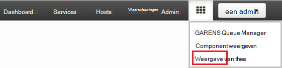
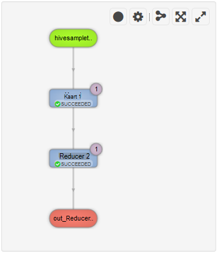

<properties
pageTitle="Gebruik Ambari Tez weergave met HDInsight | Azure"
description="Informatie over het gebruik van de weergave Ambari Tez voor foutopsporing Tez taken op HDInsight."
services="hdinsight"
documentationCenter=""
authors="Blackmist"
manager="jhubbard"
editor="cgronlun"/>

<tags
ms.service="hdinsight"
ms.devlang="na"
ms.topic="article"
ms.tgt_pltfrm="na"
ms.workload="big-data"
ms.date="10/04/2016"
ms.author="larryfr"/>

# Ambari weergaven gebruiken voor foutopsporing Tez taken op HDInsight

De Ambari Web UI voor HDInsight bevat een Tez weergave die te begrijpen en debug Tez als de engine voor uitvoering van gebruikt taken kan worden gebruikt. De Tez weergave kunt u de taak als van de gekoppelde items in een grafiek te visualiseren, analyseren in elk item en statistieken en registratie-informatie ophalen.

> [AZURE.NOTE] De informatie in dit document is specifiek voor de HDInsight op basis van Linux-clusters. Zie voor informatie over foutopsporing Tez taken met behulp van Windows-gebaseerde HDInsight, [de Tez de gebruikersinterface om te debuggen taken op Windows gebaseerde HDInsight Tez](hdinsight-debug-tez-ui.md).

## Vereisten

* Een HDInsight op basis van Linux-cluster. Zie [aan de slag met Linux-gebaseerde HDInsight](hdinsight-hadoop-linux-tutorial-get-started.md)voor stapsgewijze instructies over het maken van een nieuw cluster.

* Een moderne webbrowser die HTML5 ondersteunt.

## Wat zijn Tez

Tez is een uitbreidbare raamwerk voor gegevensverwerking in Hadoop met snelheden van meer dan traditionele MapReduce verwerking. Het is de standaard-engine voor component voor HDInsight op basis van Linux-clusters.

Werk bij Tez wordt ingediend, wordt een gericht acyclische grafiek (DAG) dat de volgorde van uitvoering van de acties die nodig zijn door de taak beschrijft gemaakt. Afzonderlijke acties hoekpunten worden genoemd, en een stuk van de algehele taak uitvoeren. De daadwerkelijke uitvoering van het werk dat wordt beschreven door een hoekpunt een taak wordt genoemd, en kan worden verdeeld over meerdere knooppunten in het cluster.

### Wat is de weergave Tez?

De weergave Tez bevat informatie over processen die worden uitgevoerd, of een ouder met Tez. Hiermee kunt u de DAG gegenereerd door Tez, bekijken hoe deze wordt verdeeld over de clusters, items zoals geheugen gebruikt door taken en hoekpunten en informatie over fouten. Deze bieden nuttige informatie in de volgende scenario's:

* Langdurige bewaking worden verwerkt, de voortgang van de kaart te bekijken en taken beperken.

* Historische gegevens analyseren voor geslaagde of mislukte processen om te leren hoe de verwerking kan worden verbeterd of de oorzaak van de fout.

## Een DAG genereren

De weergave Tez bevat alleen gegevens als een taak die wordt de engine Tez actief is of is geweest in het verleden is uitgevoerd. Eenvoudige component query's kunnen meestal worden opgelost zonder Tez, maar complexe query's filteren, groeperen, bestellen, joins, enz., wordt u doorgaans Tez.

Gebruik de volgende stappen uit te voeren van een component-query die wordt uitgevoerd met behulp van Tez.

1. Ga naar https://CLUSTERNAME.azurehdinsight.net, waar de __CLUSTERNAAM__ de naam van het cluster HDInsight is in een webbrowser.

2. Selecteer het pictogram __weergaven__ in het menu aan de bovenkant van de pagina. Dit ziet eruit als een reeks van de kwadraten. Selecteer de __component weergeven__in de vervolgkeuzelijst die wordt weergegeven. 

    

3. Wanneer de component wordt geladen, plak de volgende tekst in de Query Editor en klik vervolgens op __uitvoeren__.

        select market, state, country from hivesampletable where deviceplatform='Android' group by market, country, state;
    
    Als de taak is voltooid, ziet u de uitvoer weergegeven in het gedeelte van __De resultaten van Query Process__ . De resultaten moeten zijn de volgende
    
        market  state       country
        en-GB   Hessen      Germany
        en-GB   Kingston    Jamaica
        
4. Selecteer de tab __logboek__ . Ziet u de volgende informatie:
    
        INFO : Session is already open
        INFO :

        INFO : Status: Running (Executing on YARN cluster with App id application_1454546500517_0063)

    Sla de __App id-__ waarde, zoals deze wordt gebruikt in de volgende sectie.

## Gebruik de weergave Tez

1. Selecteer het pictogram __weergaven__ in het menu aan de bovenkant van de pagina. Selecteer in de vervolgkeuzelijst die wordt weergegeven, __Tez weergeven__.

    

2. Wanneer de weergave Tez wordt geladen, ziet u een lijst met DAGs die momenteel worden uitgevoerd, of zijn uitgevoerd op het cluster. De standaardweergave bevat de Dag Name, Id indiener, Status, begintijd, eindtijd, duur, toepassings-ID en wachtrij. Meer kolommen kunnen worden toegevoegd met behulp van het vistuig-pictogram aan de rechterkant van de pagina.

    

3. Als er slechts één post, worden voor de query die u in de vorige sectie hebt uitgevoerd. Als u meerdere posten hebt, kunt u zoeken op de toepassings-ID invoeren in het veld __ID van de toepassing__ en druk op enter.

4. Selecteer de __Naam van de Dag__. Hiermee worden gegevens over de DAG, en de optie voor het downloaden van een zip van JSON bestanden die informatie over de DAG bevatten weergegeven.

    

5. Boven de __Details van de DAG__ zijn verschillende koppelingen waarmee u informatie wilt weergeven over de DAG.

    * __DAG items__ worden items van deze DAG.
    
    * __Grafische weergave__ ziet u een grafische weergave van deze DAG.
    
    * __Alle hoekpunten__ geeft een overzicht van de hoekpunten in deze DAG.
    
    * __Alle taken__ geeft een overzicht van de taken voor alle hoekpunten in deze DAG.
    
    * __Alle TaskAttempts__ wordt informatie weergegeven over de pogingen om uit te voeren taken voor deze DAG.
    
    > [AZURE.NOTE] Als u de kolom weergegeven voor hoekpunten, taken en TaskAttempts schuift, ziet u dat er koppelingen zijn naar __items__ en __bekijken of downloaden van Logboeken__ voor elke rij weergeven.

    Als er een fout opgetreden met de taak is, worden de Details van de DAG de status mislukt, en koppelingen naar informatie over de mislukte taak weergegeven. Diagnostische gegevens wordt weergegeven onder de details van de DAG.
    
    

7. Selecteer de __grafische weergave__. Een grafische weergave van de DAG worden weergegeven. U kunt de muis over elk hoekpunt in de weergave voor informatie over het plaatsen.

    

8. Op een hoekpunt te klikken wordt het __Hoekpunt Details__ voor dat item wordt geladen. Klik op de __plattegrond 1__ hoekpunt om details van dit item weer te geven.

    

9. Houd er rekening mee dat u hebt nu links boven aan de pagina die betrekking hebben op de hoekpunten en taken.

    > [AZURE.NOTE] U kunt ook teruggaan naar de __Details van de DAG__, selecteert u __Hoekpunt Details__en vervolgens te klikken op het hoekpunt __1 kaart__ op deze pagina komen.

    * __Hoekpunt items__ worden itemgegevens voor dit hoekpunt weergegeven.
    
    * __Taken__ worden taken voor dit hoekpunt weergegeven.
    
    * Informatie over pogingen om uit te voeren taken voor deze __Taak probeert__ worden weergegeven.
    
    * __Bronnen & put__ gegevensbronnen weergeeft en PUT voor dit hoekpunt.

    > [AZURE.NOTE] Als met het vorige menu kunt u bladeren om de kolom weergeven voor taken, taak pogingen, en bronnen en Sinks__ koppelingen naar meer informatie over elk item weergeven.

10. Selecteer __taken__en klik vervolgens op het item met de naam __00_000000__. __De Details__ wordt voor deze taak weergegeven. Vanuit dit scherm, kunt u __Items van de taak__ en __Taak pogingen__weergeven.

    

## Volgende stappen

U hebt geleerd hoe u de weergave van Tez, weten [Met behulp van de component op HDInsight](hdinsight-use-hive.md).

Zie voor meer gedetailleerde technische informatie over Tez, de [pagina op Hortonworks Tez](http://hortonworks.com/hadoop/tez/).

Zie voor meer informatie over het gebruik van Ambari met HDInsight [HDInsight beheren van clusters met behulp van de Ambari Web UI](hdinsight-hadoop-manage-ambari.md)
